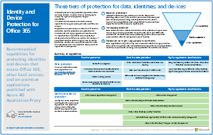

# Recursos de arquitectura de TI de la nube de Microsoft

 **Resumen:** Obtenga información acerca de las plataformas y los servicios en la nube de Microsoft. Revise nuestro mapa de ruta empresarial en la nube, explore nuestra serie de arquitectura y mucho más.
  
Estos pósteres y herramientas de arquitectura ofrecen información acerca de las plataformas y los servicios en la nube de Microsoft, como Office 365, Microsoft Azure, Microsoft Intune, Microsoft Dynamics 365, el centro de datos en la nube privada y las soluciones híbridas locales y en la nube. Los arquitectos y los responsables de la toma de decisiones de TI pueden usar estos recursos para determinar las soluciones ideales para sus cargas de trabajo y para tomar decisiones acerca de los componentes de la infraestructura básica, como la identidad y la seguridad. 
  
- **[Mapa de ruta de Enterprise Cloud de Microsoft](microsoft-cloud-it-architecture-resources.md#roadmap)** (Sway)
    
- **[La nube de Microsoft para Enterprise Architects Series](microsoft-cloud-it-architecture-resources.md#cloudarch)** 
    - [Opciones de plataforma y los servicios de nube de Microsoft](microsoft-cloud-it-architecture-resources.md#platformoptions)
    - [Identidad de nube de Microsoft para Enterprise Architects](microsoft-cloud-it-architecture-resources.md#identity)
    - [Seguridad de nube de Microsoft para Enterprise Architects](microsoft-cloud-it-architecture-resources.md#security)
    - [Microsoft Cloud Networking para arquitectos profesionales](microsoft-cloud-it-architecture-resources.md#networking)
    - [Movilidad de Microsoft y seguridad para arquitectos](microsoft-cloud-it-architecture-resources.md#mobility)
    - [Almacenamiento en la nube de Microsoft para Enterprise Architects](microsoft-cloud-it-architecture-resources.md#storage)
    - [Microsoft Hybrid Cloud para arquitectos profesionales](microsoft-cloud-it-architecture-resources.md#hybrid)
    - [Contoso en la nube de Microsoft](microsoft-cloud-it-architecture-resources.md#contoso)
    
- **[Serie de soluciones office 365 Enterprise](microsoft-cloud-it-architecture-resources.md#BKMK_o365solutions)**:
    - [Protección de la información para Office 365](microsoft-cloud-it-architecture-resources.md#BKMK_infoprotect)
    - [Identidad y protección de dispositivos para Office 365](microsoft-cloud-it-architecture-resources.md#BKMK_O365IDP)
    - [Soluciones de protección de archivos en Office 365](microsoft-cloud-it-architecture-resources.md#BKMK_O365fileprotect)
    - [Administración de cambios para los clientes de Office 365](microsoft-cloud-it-architecture-resources.md#changemgmt)
    - [Implementar un escritorio moderno y seguro con Microsoft](microsoft-cloud-it-architecture-resources.md#msd)
    
> [!TIP]
> La mayoría de los pósteres de esta página están disponibles en varios idiomas, incluidos chino, inglés, francés, alemán, italiano, japonés, coreano, portugués, ruso y español. Para descargar un póster en uno de estos idiomas, haga clic en el vínculo **Más idiomas** del póster en cuestión.
  
Díganos qué opina. Envíenos un correo electrónico a[cloudadopt@microsoft.com](mailto:cloudadopt@microsoft.com). 
  
## Mapa de ruta de Enterprise Cloud de Microsoft

Vea los pósteres, los conjuntos de iconos, las ubicaciones en la comunidad y otros recursos que describen la solución en la nube más completa del sector.
  
|**Elemento**|**Descripción**|
|:-----|:-----|
|[          ](https://aka.ms/cloudarchitecture)   [Microsoft's Enterprise Cloud Roadmap](https://aka.ms/cloudarchitecture) (https://aka.ms/cloudarchitecture)   |Desplácese por esta experiencia de Sway para conocer los recursos que describen la solución en la nube más completa del sector.    |
   
## Serie de Microsoft Cloud para arquitectos profesionales

Estos pósteres de arquitectura en la nube le ofrecen información acerca de las plataformas y los servicios en la nube de Microsoft, como Office 365, Microsoft Azure, Microsoft Intune, Microsoft Dynamics CRM Online, el centro de datos en la nube privada y las soluciones híbridas locales y en la nube. Los arquitectos y los responsables de la toma de decisiones de TI pueden usar estos recursos para determinar las soluciones ideales para sus cargas de trabajo y para tomar decisiones acerca de los componentes de la infraestructura básica, como la identidad y la seguridad.
  
### Opciones de plataforma y servicios en la nube de Microsoft

Descubra las principales diferencias entre las ofertas de plataforma y servicios en la nube de Microsoft. Encuentre la opción que mejor se ajuste a su solución.
  
|**Elemento**|**Descripción**|
|:-----|:-----|
|[          ](https://www.microsoft.com/download/details.aspx?id=54432)   [PDF](https://go.microsoft.com/fwlink/p/?LinkId=524731)  \| [Visio](https://go.microsoft.com/fwlink/p/?LinkId=524732)  \| [Más idiomas](https://www.microsoft.com/download/details.aspx?id=54432)   | En este modelo se describe lo siguiente: <ul><li>  Ofertas de software como servicio (SaaS), incluido Office 365 </li><li>  Características de plataforma como servicio (PaaS) en Microsoft Azure </li><li>  Características de infraestructura como servicio (laaS) en Microsoft Azure </li><li>  Capacidades de centro de datos de nube privada con Windows Server y System Center </li><li>  Descubra cómo el propio departamento de TI de Microsoft está migrando a estos servicios en la nube y creando su nube híbrida. </li></ul> |
   
### Identidad de nube de Microsoft para arquitectos de empresa

Lo que los arquitectos de TI necesitan saber sobre el diseño de la identidad para las organizaciones que usan plataformas y servicios en la nube de Microsoft.
  
|**Elemento**|**Descripción**|
|:-----|:-----|
|[          ](https://www.microsoft.com/download/details.aspx?id=54431)   [PDF](https://go.microsoft.com/fwlink/p/?LinkId=524586)  \| [Visio](https://download.microsoft.com/download/2/3/8/238228E6-9017-4F6C-BD3C-5559E6708F82/MSFT_cloud_architecture_identity.vsd)           \| [artículo](https://technet.microsoft.com/library/mt613459.aspx)   [Más idiomas](https://www.microsoft.com/download/details.aspx?id=54431)   | Este modelo contiene lo siguiente: <ul><li>Introducción a la identidad con la nube de Microsoft </li> <li>Funciones de Azure AD IDaaS </li><li>Integración de cuentas de Servicios de dominio de Active Directory local con Microsoft Azure Active Directory </li> <li>Colocar componentes de directorio en Azure </li><li>Opciones de servicios de dominio para cargas de trabajo en Azure IaaS </li></ul>  |
   
### Seguridad en la nube de Microsoft para arquitectos profesionales

Lo que los arquitectos de TI necesitan saber sobre la seguridad en las plataformas y los servicios en la nube de Microsoft.
  
|**Elemento**|**Descripción**|
|:-----|:-----|
|[          ](https://www.microsoft.com/download/details.aspx?id=48121)   [PDF](https://go.microsoft.com/fwlink/p/?linkid=842070)  \| [Visio](https://go.microsoft.com/fwlink/p/?LinkId=842071)  \| [Más idiomas](https://www.microsoft.com/download/details.aspx?id=48121)   | Este modelo contiene lo siguiente: <ul><li>El rol de Microsoft en el suministro de plataformas y servicios seguros</li><li>Responsabilidades del cliente para mitigar los riesgos de seguridad</li><li>Principales certificaciones de seguridad </li><li>Ofertas de seguridad proporcionadas por los servicios de consultoría de Microsoft </ul></li>Tome la [seguridad en un mundo de Cloud-Enabled](https://mva.microsoft.com/training-courses/security-in-a-cloudenabled-world-12725?l=CfLHobAcB_3904300474), un curso de Microsoft Virtual Academy basado en este póster de arquitectura.  |
   
### Microsoft Cloud Networking para arquitectos profesionales

Lo que los arquitectos de TI necesitan saber sobre las redes para las plataformas y los servicios en la nube de Microsoft.
  
|**Elemento**|**Descripción**|
|:-----|:-----|
|[          ](https://www.microsoft.com/download/details.aspx?id=54425)   [PDF](https://go.microsoft.com/fwlink/p/?linkid=842073)  \| [Visio](https://go.microsoft.com/fwlink/p/?linkid=842074)           \| [artículo](https://technet.microsoft.com/library/mt733214.aspx)  [Más idiomas](https://www.microsoft.com/download/details.aspx?id=54425)   | Este modelo contiene las páginas siguientes: <ul><li> **Desarrollo de la red para la conectividad en la nube** La migración a nube cambia el volumen y el carácter de los flujos de tráfico dentro y fuera de una red corporativa. También afecta a los métodos para mitigar los riesgos de seguridad.</li><li> **Elementos comunes de la conectividad en la nube de Microsoft** La integración de las redes con la nube de Microsoft proporciona un acceso óptimo a una amplia gama de servicios. </li><li> **ExpressRoute para la conectividad en la nube de Microsoft** ExpressRoute proporciona una conexión de red privada, dedicada y de alto rendimiento para la nube de Microsoft. </li><li> **Diseño de redes para SaaS de Microsoft (Office 365, Microsoft Intune y Dynamics CRM Online)** La optimización de la red para los servicios SaaS de Microsoft requiere un análisis cuidadoso de su perímetro de Internet, los dispositivos cliente y las operaciones de TI típicas. </li><li> **Diseño de redes para PaaS de Azure** La optimización de las redes para aplicaciones PaaS de Azure requiere suficiente ancho de banda de Internet y puede requerir la distribución del tráfico de red por varios sitios o aplicaciones. </li><li> **Diseño de redes para la IaaS de Azure** Siga los pasos del proceso de diseño para crear una red virtual de Azure óptima para cargas de trabajo de TI basadas en servidores de hospedaje (subredes, espacios de direcciones, enrutamiento, DNS, equilibrio de carga y conectividad a Internet, a la red local y a otras redes virtuales). </li></ul>   Tomar [Optimizar su red para las ofertas de nube de Microsoft](https://aka.ms/optimizecloudnetworkingmva), un curso de Microsoft Virtual Academy nuevo basado en este póster de arquitectura.   |
   
### Microsoft Mobility y seguridad para arquitectos de empresa

Lo que los arquitectos de TI necesitan saber sobre la movilidad con las plataformas y los servicios en la nube de Microsoft.
  
|**Elemento**|**Descripción**|
|:-----|:-----|
|[          ](https://www.microsoft.com/download/details.aspx?id=55023)   [PDF](https://go.microsoft.com/fwlink/p/?linkid=842076)  \| [Visio](https://go.microsoft.com/fwlink/p/?linkid=842077)  \| [Más idiomas](https://www.microsoft.com/download/details.aspx?id=55023)   | Este modelo contiene lo siguiente: <ul><li>Principales aplicaciones móviles para empresas </li><li>Plataforma, servicios y recursos para desarrollar aplicaciones móviles </li><li>Administrar el acceso a aplicaciones basadas en la nube y datos desde dispositivos móviles </li><li>Comparación de capacidades y plataforma de soporte para Office 365 MDM, Azure Active Directory Premium y Intune </li></ul>  |
   
### Almacenamiento en la nube de Microsoft para arquitectos profesionales

Lo que los arquitectos de TI necesitan saber sobre las opciones de almacenamiento en las plataformas y los servicios en la nube de Microsoft.
  
|**Elemento**|**Descripción**|
|:-----|:-----|
|[          ](https://www.microsoft.com/download/details.aspx?id=49552)   [PDF](https://go.microsoft.com/fwlink/p/?linkid=842079)  \| [Visio](https://go.microsoft.com/fwlink/p/?linkid=842080)           \| [artículo](hhttps://technet.microsoft.com/library/mt842597.aspx)  [Más idiomas](https://www.microsoft.com/download/details.aspx?id=49552)   | Este modelo contiene lo siguiente: <ul><li>Razones para utilizar el almacenamiento en la nube y los escenarios clave </li><li>Opciones de almacenamiento de nube que se incluyen con servicios existentes </li><li>Opciones de almacenamiento de información que puede utilizar como punto de partida para la solución de almacenamiento de información </li><li>Almacenamiento de bloques de creación para crear su propia solución de almacenamiento de información o almacenamiento de información para sus aplicaciones</li></ul> |
   
### Microsoft Hybrid Cloud para arquitectos profesionales

Lo que los arquitectos de TI necesitan saber sobre la nube híbrida para las plataformas y los servicios de Microsoft.
  
|**Elemento**|**Descripción**|
|:-----|:-----|
|[          ](https://www.microsoft.com/download/details.aspx?id=54424)   [PDF](https://go.microsoft.com/fwlink/p/?linkid=842082)  \| [Visio](https://go.microsoft.com/fwlink/p/?linkid=842083)           \| [artículo](https://technet.microsoft.com/library/mt750500.aspx)  [Más idiomas](https://www.microsoft.com/download/details.aspx?id=54424)   | Este modelo contiene las páginas siguientes: <ul><li> **Resumen de la nube híbrida** Ofertas de la nube de Microsoft (SaaS, Azure PaaS y Azure IaaS) y sus elementos comunes. </li><li> **Arquitectura de escenarios de nube híbrida de Microsoft** Esquema de la arquitectura de la nube híbrida para ofertas de Microsoft. Muestra las capas comunes de infraestructura local, redes e identidad. </li><li> **Escenarios de nube híbrida de Microsoft SaaS (Office 365)** Arquitectura del escenario híbrido de SaaS y descripciones de las configuraciones híbridas clave de Skype Empresarial, SharePoint Server y Exchange Server. </li><li> **Escenarios de nube híbrida de Azure PaaS** Arquitectura de escenarios híbridos de Azure PaaS, descripción de una aplicación híbrida de Azure PaaS con un ejemplo y descripción de la base de datos de SQL Server 2016 Stretch. </li><li> **Escenarios de nube híbrida de Azure IaaS** Arquitectura del escenario híbrido de Azure IaaS y descripción de una aplicación de línea de negocio (LOB) hospedada en Azure IaaS. </li></ul> |
   
### Contoso en la nube de Microsoft

¿Cómo una organización global ficticia pero representativa ha implementado ofertas de la nube de Microsoft, como Office 365, Azure, Dynamics 365 e Intune.
  
|**Elemento**|**Descripción**|
|:-----|:-----|
|[          ](https://www.microsoft.com/download/details.aspx?id=54427)   [PDF](https://go.microsoft.com/fwlink/p/?linkid=842085)  \| [Visio](https://go.microsoft.com/fwlink/p/?linkid=842086)           \| [artículo](https://technet.microsoft.com/library/mt775341.aspx)  [Más idiomas](https://www.microsoft.com/download/details.aspx?id=54427)   |Este modelo contiene lo siguiente: <ul><li>Información general de Contoso Corporation </li><li>Infraestructura y necesidades de TI de Contoso </li><li>Nube de red de Contoso</li><li>Identidad de la nube de Contoso</li><li>Suscripciones, licencias y las cuentas de usuario de Contoso</li><li>Seguridad de nube de Contoso</li><li>Escenarios de nube empresarial de Contoso</li></ul>  |
   
### The Santa Cloud

Vea cómo Santa Claus y sus duendes usan ofertas de nube de Microsoft para realizar sus entregas anuales.
  
|**Elemento**|**Descripción**|
|:-----|:-----|
|[          ](https://www.microsoft.com/download/details.aspx?id=55039)   [PDF](https://go.microsoft.com/fwlink/p/?linkid=842088)   |Para determinar quién ha sido bueno o malo, y los regalos que se entregan el 24 de diciembre, Papá Noel y su departamento de TI élfico usan Office 365, Azure, Dynamics 365 e Intune.   |
   
## Serie de soluciones de Office 365 Enterprise

La serie de soluciones empresariales de Office 365 ofrece orientación para implementar funcionalidades de Office 365, sobre todo cuando estas abarcan varias tecnologías.
  
### Protección de la información para Office 365

Funcionalidades para que las organizaciones empresariales protejan sus activos corporativos.
  
|**Elemento**|**Descripción**|
|:-----|:-----|
|[          ](https://www.microsoft.com/download/details.aspx?id=54429)   [PDF](http://download.microsoft.com/download/2/3/D/23D91386-8349-4F7A-9470-FD5AED861F16/MSFT_cloud_architecture_informationprotection.pdf)  \| [Visio](http://download.microsoft.com/download/2/3/D/23D91386-8349-4F7A-9470-FD5AED861F16/MSFT_cloud_architecture_informationprotection.vsd)  \| [Más idiomas](https://www.microsoft.com/download/details.aspx?id=54429)   |Microsoft proporciona el conjunto más completo de funcionalidades para proteger sus activos empresariales. Gracias a este modelo, las organizaciones pueden adoptar un enfoque metódico a la hora de planear las funcionalidades que desean implementar.   |
   
### Protección de identidades y dispositivos para Office 365

Capacidades recomendadas para la protección de las identidades y los dispositivos que tienen acceso a Office 365, otros servicios de SaaS y aplicaciones locales publicadas con Proxy de la aplicación de Azure AD.
  
|**Elemento**|**Descripción**|
|:-----|:-----|
|[          ](https://www.microsoft.com/download/details.aspx?id=55032)   [PDF](https://go.microsoft.com/fwlink/p/?linkid=841656)  \| [Visio](https://go.microsoft.com/fwlink/p/?linkid=841657)  \| [Más idiomas](https://www.microsoft.com/download/details.aspx?id=55032)   |Es importante usar siempre los mismos niveles de protección para todos sus datos, identidades y dispositivos. En este documento, se muestran las capacidades que son comparables con más información sobre las capacidades para proteger las identidades y los dispositivos.    |
   
### Soluciones de protección de archivos en Office 365

Capacidades recomendadas para proteger archivos en Office 365 basándose en tres niveles de confidencialidad diferentes.
  
|**Elemento**|**Descripción**|
|:-----|:-----|
|[          ](https://www.microsoft.com/download/details.aspx?id=55523)   [PDF](http://download.microsoft.com/download/7/8/9/789645A5-BD10-4541-BC33-F8D1EFF5E911/MSFT_cloud_architecture_O365 file protection.pdf)  \| [Visio](http://download.microsoft.com/download/7/8/9/789645A5-BD10-4541-BC33-F8D1EFF5E911/MSFT_cloud_architecture_O365%20file%20protection.vsdx)   |Es importante usar siempre los mismos niveles de protección para todos sus datos, identidades y dispositivos. En este documento, se muestran las capacidades que son comparables con más información sobre las capacidades para proteger archivos en Office 365.    |
   
### Administración de cambios para clientes de Office 365

Libera qué TI arquitectos deben saber acerca de la administración para las aplicaciones de cliente de Office 365 y 10 de Windows. 
  
|**Elemento**|**Descripción**|
|:-----|:-----|
|[          ](https://www.microsoft.com/download/details.aspx?id=49141)   [PDF](https://go.microsoft.com/fwlink/p/?LinkId=626681)  \| [Visio](https://go.microsoft.com/fwlink/p/?LinkId=626680)           \| [artículo](https://technet.microsoft.com/library/mt584223.aspx)  [Más idiomas](https://www.microsoft.com/download/details.aspx?id=49141)   | Este modelo contiene lo siguiente: <ul><li>El modelo de servicio para las aplicaciones cliente de Office 365 y Windows 10 </li><li>  Opciones de versión </li><li>  Frecuencias de lanzamiento </li><li>  Tipos de cambios </li><li>  Roles y responsabilidades </li><li>  Administración de las instalaciones de actualización </li></ul>   Ver la información en forma de artículo: [administración de cambios para los clientes de Office 365](http://technet.microsoft.com/library/815fa1aa-0355-40b5-b7bc-cdf7d4610062.aspx).    |
   
### Implementación de un escritorio seguro y moderno con Microsoft

Todo lo que los arquitectos de TI necesitan saber para implementar y actualizar las actualizaciones de Office 365 ProPlus en Windows 10.
  
|**Elemento**|**Descripción**|
|:-----|:-----|
|[          ](https://www.microsoft.com/download/details.aspx?id=55987)   [PDF](http://download.microsoft.com/download/4/E/9/4E90E227-770A-41D1-99FE-925A64D81A55/MSFT_modern_secure_desktop.pdf)  \| [Visio](http://download.microsoft.com/download/4/E/9/4E90E227-770A-41D1-99FE-925A64D81A55/MSFT_modern_secure_desktop.vsdx)   | Este modelo contiene lo siguiente: <ul><li>  Implementación de Windows 10 y Office ProPlus desde Microsoft Cloud </li><li>  Implementación de Windows 10 y Office ProPlus con System Center Configuration Manager </li><li>  Administración de las actualizaciones de Windows 10 y Office ProPlus desde Microsoft Cloud </li><li>  Administración de las actualizaciones de Windows 10 y Office ProPlus con System Center Configuration Manager </li><li>  Funciones de protección adicionales y de alto nivel para Windows 10 </li></ul>  |
   
## See Also

[Modelos arquitectónicos para SharePoint, Exchange, Skype para empresas y Lync](architectural-models-for-sharepoint-exchange-skype-for-business-and-lync.md)
  
[Guías del laboratorio de pruebas de adopción de la nube (TLG)](cloud-adoption-test-lab-guides-tlgs.md)
  
[Soluciones de seguridad](security-solutions.md)
  
[Soluciones híbridas](hybrid-solutions.md)

