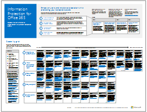

# Recursos de arquitectura de TI de la nube de Microsoft

 **Resumen:** Obtenga información acerca de las plataformas y los servicios en la nube de Microsoft. Revise nuestro mapa de ruta empresarial en la nube, explore nuestra serie de arquitectura y mucho más.
  
Estos pósteres y herramientas de arquitectura ofrecen información acerca de las plataformas y los servicios en la nube de Microsoft, como Office 365, Microsoft Azure, Microsoft Intune, Microsoft Dynamics 365, el centro de datos en la nube privada y las soluciones híbridas locales y en la nube. Los arquitectos y los responsables de la toma de decisiones de TI pueden usar estos recursos para determinar las soluciones ideales para sus cargas de trabajo y para tomar decisiones acerca de los componentes de la infraestructura básica, como la identidad y la seguridad.
  
- **[Mapa de ruta de Enterprise Cloud de Microsoft](microsoft-cloud-it-architecture-resources.md#roadmap)** (Sway)
    
- **[Serie de Microsoft Cloud para arquitectos profesionales](microsoft-cloud-it-architecture-resources.md#cloudarch)**, que incluye los pósteres[Opciones de plataforma y servicios en la nube de Microsoft](microsoft-cloud-it-architecture-resources.md#platformoptions), [Identidad de nube de Microsoft para arquitectos de empresa](microsoft-cloud-it-architecture-resources.md#identity), [Seguridad en la nube de Microsoft para arquitectos profesionales](microsoft-cloud-it-architecture-resources.md#security), [Microsoft Cloud Networking para arquitectos profesionales](microsoft-cloud-it-architecture-resources.md#networking), [Microsoft Mobility y seguridad para arquitectos de empresa](microsoft-cloud-it-architecture-resources.md#mobility), [Almacenamiento en la nube de Microsoft para arquitectos profesionales](microsoft-cloud-it-architecture-resources.md#storage), [Microsoft Hybrid Cloud para arquitectos profesionales](microsoft-cloud-it-architecture-resources.md#hybrid) y[Contoso en la nube de Microsoft](microsoft-cloud-it-architecture-resources.md#contoso).
    
- **[Serie de soluciones de Office 365 Enterprise](microsoft-cloud-it-architecture-resources.md#BKMK_o365solutions)**, que incluye[Protección de la información para Office 365](microsoft-cloud-it-architecture-resources.md#BKMK_infoprotect), [Protección de identidades y dispositivos para Office 365](microsoft-cloud-it-architecture-resources.md#BKMK_O365IDP), [Soluciones de protección de archivos en Office 365](microsoft-cloud-it-architecture-resources.md#BKMK_O365fileprotect), [Administración de cambios para clientes de Office 365](microsoft-cloud-it-architecture-resources.md#changemgmt) e[Implementación de un escritorio seguro y moderno con Microsoft](microsoft-cloud-it-architecture-resources.md#msd).
    
> [!TIP]
> La mayoría de los pósteres de esta página están disponibles en varios idiomas, incluidos chino, inglés, francés, alemán, italiano, japonés, coreano, portugués, ruso y español. Para descargar un póster en uno de estos idiomas, haga clic en el vínculo **Más idiomas** del póster en cuestión.
  
 Díganos qué opina. Envíenos un correo electrónico a[cloudadopt@microsoft.com](mailto:cloudadopt@microsoft.com). 
  
## Mapa de ruta de Enterprise Cloud de Microsoft

Vea los pósteres, los conjuntos de iconos, las ubicaciones en la comunidad y otros recursos que describen la solución en la nube más completa del sector.
  
|**Elemento**|**Descripción**|
|:-----|:-----|
|[          ](https://aka.ms/cloudarchitecture)   [Microsoft's Enterprise Cloud Roadmap](https://aka.ms/cloudarchitecture) (https://aka.ms/cloudarchitecture)   |Desplácese por esta experiencia de Sway para conocer los recursos que describen la solución en la nube más completa del sector.    |
   
## Serie de Microsoft Cloud para arquitectos profesionales

Estos pósteres de arquitectura en la nube le ofrecen información acerca de las plataformas y los servicios en la nube de Microsoft, como Office 365, Microsoft Azure, Microsoft Intune, Microsoft Dynamics CRM Online, el centro de datos en la nube privada y las soluciones híbridas locales y en la nube. Los arquitectos y los responsables de la toma de decisiones de TI pueden usar estos recursos para determinar las soluciones ideales para sus cargas de trabajo y para tomar decisiones acerca de los componentes de la infraestructura básica, como la identidad y la seguridad.
  
### Opciones de plataforma y servicios en la nube de Microsoft

Descubra las principales diferencias entre las ofertas de plataforma y servicios en la nube de Microsoft. Encuentre la opción que mejor se ajuste a su solución.
  
|**Elemento**|**Descripción**|
|:-----|:-----|
|[          ](https://www.microsoft.com/download/details.aspx?id=54432)   [PDF](https://go.microsoft.com/fwlink/p/?LinkId=524731) |[Visio](https://go.microsoft.com/fwlink/p/?LinkId=524732) |[Más idiomas](https://www.microsoft.com/download/details.aspx?id=54432)   | En este modelo se describe lo siguiente:    Ofertas de software como servicio (SaaS), incluido Office 365    Características de plataforma como servicio (PaaS) en Microsoft Azure    Características de infraestructura como servicio (laaS) en Microsoft Azure    Capacidades de centro de datos de nube privada con Windows Server y System Center    Descubra cómo el propio departamento de TI de Microsoft está migrando a estos servicios en la nube y creando su nube híbrida.   |
   
### Identidad de nube de Microsoft para arquitectos de empresa

Lo que los arquitectos de TI necesitan saber sobre el diseño de la identidad para las organizaciones que usan plataformas y servicios en la nube de Microsoft.
  
|**Elemento**|**Descripción**|
|:-----|:-----|
|[          ](https://www.microsoft.com/download/details.aspx?id=54431)   [PDF](https://go.microsoft.com/fwlink/p/?LinkId=524586) |[Visio](https://download.microsoft.com/download/2/3/8/238228E6-9017-4F6C-BD3C-5559E6708F82/MSFT_cloud_architecture_identity.vsd)          [Article](https://technet.microsoft.com/library/mt613459.aspx) |[Más idiomas](https://www.microsoft.com/download/details.aspx?id=54431)   | Este modelo contiene lo siguiente:    Uso de Azure AD como proveedor de Identidad como servicio (IDaaS)    Funciones de Azure AD IDaaS    Integración de cuentas de Servicios de dominio de Active Directory local con Microsoft Azure Active Directory    Colocar componentes de directorio en Azure    Opciones de servicios de dominio para cargas de trabajo en Azure IaaS    Vea la información en forma de artículo:[Identidad de nube de Microsoft para arquitectos de empresa](microsoft-cloud-identity-for-enterprise-architects.md).    |
   
### Seguridad en la nube de Microsoft para arquitectos profesionales

Lo que los arquitectos de TI necesitan saber sobre la seguridad en las plataformas y los servicios en la nube de Microsoft.
  
|**Elemento**|**Descripción**|
|:-----|:-----|
|[          ](https://www.microsoft.com/download/details.aspx?id=48121)   [PDF](https://go.microsoft.com/fwlink/p/?linkid=842070) |[Visio](https://go.microsoft.com/fwlink/p/?LinkId=842071) |[Más idiomas](https://www.microsoft.com/download/details.aspx?id=48121)   | Este modelo contiene lo siguiente:    El rol de Microsoft en el suministro de plataformas y servicios seguros    Responsabilidades del cliente para mitigar los riesgos de seguridad    Principales certificaciones de seguridad    Ofertas de seguridad proporcionadas por los servicios de consultoría de Microsoft    Vea[La seguridad en un mundo habilitado para la nube](https://aka.ms/securecustomermva), un curso de la Academia virtual de Microsoft basado en este póster de arquitectura.    |
   
### Microsoft Cloud Networking para arquitectos profesionales

Lo que los arquitectos de TI necesitan saber sobre las redes para las plataformas y los servicios en la nube de Microsoft.
  
|**Elemento**|**Descripción**|
|:-----|:-----|
|[          ](https://www.microsoft.com/download/details.aspx?id=54425)   [PDF](https://go.microsoft.com/fwlink/p/?linkid=842073) |[Visio](https://go.microsoft.com/fwlink/p/?linkid=842074)          [Artículo](https://technet.microsoft.com/library/mt733214.aspx) |[Más idiomas](https://www.microsoft.com/download/details.aspx?id=54425)   | Este modelo contiene las páginas siguientes:   **Desarrollo de la red para la conectividad en la nube** La migración a nube cambia el volumen y el carácter de los flujos de tráfico dentro y fuera de una red corporativa. También afecta a los métodos para mitigar los riesgos de seguridad.   **Elementos comunes de la conectividad en la nube de Microsoft** La integración de las redes con la nube de Microsoft proporciona un acceso óptimo a una amplia gama de servicios.   **ExpressRoute para la conectividad en la nube de Microsoft** ExpressRoute proporciona una conexión de red privada, dedicada y de alto rendimiento para la nube de Microsoft.   **Diseño de redes para SaaS de Microsoft (Office 365, Microsoft Intune y Dynamics CRM Online)** La optimización de la red para los servicios SaaS de Microsoft requiere un análisis cuidadoso de su perímetro de Internet, los dispositivos cliente y las operaciones de TI típicas.   **Diseño de redes para PaaS de Azure** La optimización de las redes para aplicaciones PaaS de Azure requiere suficiente ancho de banda de Internet y puede requerir la distribución del tráfico de red por varios sitios o aplicaciones.   **Diseño de redes para la IaaS de Azure** Siga los pasos del proceso de diseño para crear una red virtual de Azure óptima para cargas de trabajo de TI basadas en servidores de hospedaje (subredes, espacios de direcciones, enrutamiento, DNS, equilibrio de carga y conectividad a Internet, a la red local y a otras redes virtuales).    Vea[Optimizar la red para las ofertas de Microsoft Cloud](https://aka.ms/optimizecloudnetworkingmva), un nuevo curso de Microsoft Virtual Academy basado en este póster de arquitectura.    |
   
### Microsoft Mobility y seguridad para arquitectos de empresa

Lo que los arquitectos de TI necesitan saber sobre la movilidad con las plataformas y los servicios en la nube de Microsoft.
  
|**Elemento**|**Descripción**|
|:-----|:-----|
|[          ](https://www.microsoft.com/download/details.aspx?id=55023)   [PDF](https://go.microsoft.com/fwlink/p/?linkid=842076) |[Visio](https://go.microsoft.com/fwlink/p/?linkid=842077) |[Más idiomas](https://www.microsoft.com/download/details.aspx?id=55023)   | Microsoft proporciona compatibilidad amplia para la productividad móvil con controles administrativos para proteger datos y aplicaciones.    Aplicaciones móviles de Microsoft para empresas.    Plataforma, servicios y recursos para desarrollar aplicaciones móviles.    Administración de acceso a las aplicaciones basadas en la nube y los datos de dispositivos móviles.    Comparación de capacidades y compatibilidad de plataformas para Office 365 MDM, Azure Active Directory Premium e Intune.   |
   
### Almacenamiento en la nube de Microsoft para arquitectos profesionales

Lo que los arquitectos de TI necesitan saber sobre las opciones de almacenamiento en las plataformas y los servicios en la nube de Microsoft.
  
|**Elemento**|**Descripción**|
|:-----|:-----|
|[          ](https://www.microsoft.com/download/details.aspx?id=49552)   [PDF](https://go.microsoft.com/fwlink/p/?linkid=842079) |[Visio](https://go.microsoft.com/fwlink/p/?linkid=842080)          [Artículo](hhttps://technet.microsoft.com/library/mt842597.aspx) |[Más idiomas](https://www.microsoft.com/download/details.aspx?id=49552)   | Este modelo contiene lo siguiente:    Razones para usar el almacenamiento en la nube y los escenarios clave.    Opciones de almacenamiento en la nube de listas para moverse incluidas con los servicios existentes, que puede usar de inmediato y con una configuración mínima.    Algunas opciones de almacenamiento requeridas por los ensamblados, que puede usar como punto de partida para el almacenamiento de su solución con una configuración o codificación adicionales para un ajuste personalizado.    Empiece desde cero con bloques de creación de almacenamiento para generar su propia solución de almacenamiento o para almacenar sus aplicaciones desde el principio.   |
   
### Microsoft Hybrid Cloud para arquitectos profesionales

Lo que los arquitectos de TI necesitan saber sobre la nube híbrida para las plataformas y los servicios de Microsoft.
  
|**Elemento**|**Descripción**|
|:-----|:-----|
|[          ](https://www.microsoft.com/download/details.aspx?id=54424)   [PDF](https://go.microsoft.com/fwlink/p/?linkid=842082) |[Visio](https://go.microsoft.com/fwlink/p/?linkid=842083)          [Artículo](https://technet.microsoft.com/library/mt750500.aspx) |[Más idiomas](https://www.microsoft.com/download/details.aspx?id=54424)   | Este modelo contiene las páginas siguientes:   **Resumen de la nube híbrida** Ofertas de la nube de Microsoft (SaaS, Azure PaaS y Azure IaaS) y sus elementos comunes.   **Arquitectura de escenarios de nube híbrida de Microsoft** Esquema de la arquitectura de la nube híbrida para ofertas de Microsoft. Muestra las capas comunes de infraestructura local, redes e identidad.   **Escenarios de nube híbrida de Microsoft SaaS (Office 365)** Arquitectura del escenario híbrido de SaaS y descripciones de las configuraciones híbridas clave de Skype Empresarial, SharePoint Server y Exchange Server.   **Escenarios de nube híbrida de Azure PaaS** Arquitectura de escenarios híbridos de Azure PaaS, descripción de una aplicación híbrida de Azure PaaS con un ejemplo y descripción de la base de datos de SQL Server 2016 Stretch.   **Escenarios de nube híbrida de Azure IaaS** Arquitectura del escenario híbrido de Azure IaaS y descripción de una aplicación de línea de negocio (LOB) hospedada en Azure IaaS.   |
   
### Contoso en la nube de Microsoft

¿Cómo una organización global ficticia pero representativa ha implementado ofertas de la nube de Microsoft, como Office 365, Azure, Dynamics 365 e Intune.
  
|**Elemento**|**Descripción**|
|:-----|:-----|
|[          ](https://www.microsoft.com/download/details.aspx?id=54427)   [PDF](https://go.microsoft.com/fwlink/p/?linkid=842085) |[Visio](https://go.microsoft.com/fwlink/p/?linkid=842086)          [Artículo](https://technet.microsoft.com/library/mt775341.aspx) |[Más idiomas](https://www.microsoft.com/download/details.aspx?id=54427)   |Examine cómo Contoso Corporation, un conglomerado global de fabricación con sede en París, está adoptando una infraestructura de TI que incluye la nube y responde a las principales decisiones de diseño para redes, identidad y seguridad.    |
   
### The Santa Cloud

Vea cómo Santa Claus y sus duendes usan ofertas de nube de Microsoft para realizar sus entregas anuales.
  
|**Elemento**|**Descripción**|
|:-----|:-----|
|[          ](https://www.microsoft.com/download/details.aspx?id=55039)   [PDF](https://go.microsoft.com/fwlink/p/?linkid=842088)   |Para determinar quién ha sido bueno o malo, y los regalos que se entregan el 24 de diciembre, Papá Noel y su departamento de TI élfico usan Office 365, Azure, Dynamics 365 e Intune.    |
   
## Serie de soluciones de Office 365 Enterprise

La serie de soluciones empresariales de Office 365 ofrece orientación para implementar funcionalidades de Office 365, sobre todo cuando estas abarcan varias tecnologías.
  
### Protección de la información para Office 365

Funcionalidades para que las organizaciones empresariales protejan sus activos corporativos.
  
|**Elemento**|**Descripción**|
|:-----|:-----|
|[          ](https://www.microsoft.com/download/details.aspx?id=54429)   [PDF](http://download.microsoft.com/download/2/3/D/23D91386-8349-4F7A-9470-FD5AED861F16/MSFT_cloud_architecture_informationprotection.pdf) |[Visio](http://download.microsoft.com/download/2/3/D/23D91386-8349-4F7A-9470-FD5AED861F16/MSFT_cloud_architecture_informationprotection.vsd) |[Más idiomas](https://www.microsoft.com/download/details.aspx?id=54429)   |Microsoft proporciona el conjunto más completo de funcionalidades para proteger sus activos empresariales. Gracias a este modelo, las organizaciones pueden adoptar un enfoque metódico a la hora de planear las funcionalidades que desean implementar.    |
   
### Protección de identidades y dispositivos para Office 365

Capacidades recomendadas para la protección de las identidades y los dispositivos que tienen acceso a Office 365, otros servicios de SaaS y aplicaciones locales publicadas con Proxy de la aplicación de Azure AD.
  
|**Elemento**|**Descripción**|
|:-----|:-----|
|[          ](https://www.microsoft.com/download/details.aspx?id=55032)   [PDF](https://go.microsoft.com/fwlink/p/?linkid=841656) |[Visio](https://go.microsoft.com/fwlink/p/?linkid=841657) |[Más idiomas](https://www.microsoft.com/download/details.aspx?id=55032)   |Es importante usar siempre los mismos niveles de protección para todos sus datos, identidades y dispositivos. En este documento, se muestran las capacidades que son comparables con más información sobre las capacidades para proteger las identidades y los dispositivos.    |
   
### Soluciones de protección de archivos en Office 365

Capacidades recomendadas para proteger archivos en Office 365 basándose en tres niveles de confidencialidad diferentes.
  
|**Elemento**|**Descripción**|
|:-----|:-----|
|[          ](https://www.microsoft.com/download/details.aspx?id=55523)   [PDF](http://download.microsoft.com/download/7/8/9/789645A5-BD10-4541-BC33-F8D1EFF5E911/MSFT_cloud_architecture_O365 file protection.pdf) |[Visio](http://download.microsoft.com/download/7/8/9/789645A5-BD10-4541-BC33-F8D1EFF5E911/MSFT_cloud_architecture_O365%20file%20protection.vsdx)   |Es importante usar siempre los mismos niveles de protección para todos sus datos, identidades y dispositivos. En este documento, se muestran las capacidades que son comparables con más información sobre las capacidades para proteger archivos en Office 365.    |
   
### Administración de cambios para clientes de Office 365

Lo que los arquitectos de TI necesitan saber sobre la administración de versiones de rama para aplicaciones cliente de Office 365 y Windows 10. 
  
|**Elemento**|**Descripción**|
|:-----|:-----|
|[          ](https://www.microsoft.com/download/details.aspx?id=49141)   [PDF](https://go.microsoft.com/fwlink/p/?LinkId=626681) |[Visio](https://go.microsoft.com/fwlink/p/?LinkId=626680)          [Artículo](https://technet.microsoft.com/library/mt584223.aspx) |[Más idiomas](https://www.microsoft.com/download/details.aspx?id=49141)   | El modelo de servicio para las aplicaciones cliente de Office 365 y Windows 10    Opciones de versión    Frecuencias de lanzamiento    Tipos de cambios    Roles y responsabilidades    Administración de las instalaciones de actualización    Vea la información en forma de artículo:[Change management for Office 365 clients](http://technet.microsoft.com/library/815fa1aa-0355-40b5-b7bc-cdf7d4610062.aspx).    |
   