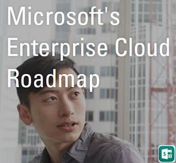
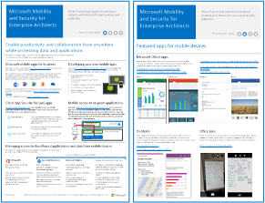
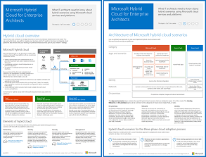
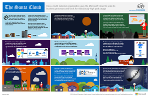

# Recursos de arquitectura de TI de la nube de MicrosoftMicrosoft Cloud IT architecture resources

 **Resumen:** Obtenga información acerca de las plataformas y los servicios en la nube de Microsoft. Revise nuestro mapa de ruta empresarial en la nube, explore nuestra serie de arquitectura y mucho más.**Summary:** Learn about Microsoft cloud services and platforms. Review our enterprise cloud roadmap, explore our cloud architecture series, and more.
  
Estos pósteres y herramientas de arquitectura ofrecen información sobre las plataformas y los servicios en la nube de Microsoft, como Office 365, Microsoft Azure, Microsoft Intune, Microsoft Dynamics 365, el centro de datos de nube privada y las soluciones híbridas locales y en la nube. Los arquitectos y responsables de decisiones de TI pueden usar estos recursos para determinar las soluciones ideales para sus cargas de trabajo y para tomar decisiones sobre los componentes de la infraestructura central, como la identidad y la seguridad.These architecture tools and posters give you information about Microsoft cloud services and platforms, including Office 365, Microsoft Azure, Microsoft Intune, Microsoft Dynamics 365, private cloud datacenter, and hybrid on-premises and cloud solutions. IT decision makers and architects can use these resources to determine the ideal solutions for their workloads and to make decisions about core infrastructure components such as identity and security. 
  
- **[Mapa de ruta de Enterprise Cloud de Microsoft](microsoft-cloud-it-architecture-resources.md#roadmap)** (Sway)**[Microsoft's Enterprise Cloud Roadmap](microsoft-cloud-it-architecture-resources.md#roadmap)** (Sway)
    
- **[Serie de Microsoft Cloud para arquitectos empresariales](microsoft-cloud-it-architecture-resources.md#cloudarch)****[Microsoft Cloud for Enterprise Architects Series](microsoft-cloud-it-architecture-resources.md#cloudarch)** 
    - [Opciones de plataforma y Servicios en la nube de MicrosoftMicrosoft Cloud Services and Platform Options](microsoft-cloud-it-architecture-resources.md#platformoptions)
    - [Identidad de Microsoft Cloud para arquitectos empresarialesMicrosoft Cloud Identity for Enterprise Architects](microsoft-cloud-it-architecture-resources.md#identity)
    - [Seguridad de Microsoft Cloud para arquitectos empresarialesMicrosoft Cloud Security for Enterprise Architects](microsoft-cloud-it-architecture-resources.md#security)
    - [Redes de Microsoft Cloud para arquitectos empresarialesMicrosoft Cloud Networking for Enterprise Architects](microsoft-cloud-it-architecture-resources.md#networking)
    - [Movilidad y seguridad de Microsoft para arquitectos empresarialesMicrosoft Mobility and Security for Enterprise Architects](microsoft-cloud-it-architecture-resources.md#mobility)
    - [Almacenamiento de Microsoft Cloud para arquitectos empresarialesMicrosoft Cloud Storage for Enterprise Architects](microsoft-cloud-it-architecture-resources.md#storage)
    - [Nube híbrida de Microsoft para arquitectos empresarialesMicrosoft Hybrid Cloud for Enterprise Architects](microsoft-cloud-it-architecture-resources.md#hybrid)
    - [Contoso en Microsoft CloudContoso in the Microsoft Cloud](microsoft-cloud-it-architecture-resources.md#contoso)
    
- **[Serie de soluciones de Office 365 Enterprise](microsoft-cloud-it-architecture-resources.md#BKMK_o365solutions)**:**[Office 365 Enterprise Solution Series](microsoft-cloud-it-architecture-resources.md#BKMK_o365solutions)**:
    - [Information Protection para Office 365Information Protection for Office 365](microsoft-cloud-it-architecture-resources.md#BKMK_infoprotect)
    - [Protección de identidades y dispositivos para Office 365Identity and Device Protection for Office 365](microsoft-cloud-it-architecture-resources.md#BKMK_O365IDP)
    - [Soluciones de protección de archivos en Office 365File Protection Solutions in Office 365](microsoft-cloud-it-architecture-resources.md#BKMK_O365fileprotect)
    - [Administración de cambios para clientes de Office 365Change Management for Office 365 Clients](microsoft-cloud-it-architecture-resources.md#changemgmt)
    - [Implementar un escritorio seguro y moderno con MicrosoftDeploy a modern and secure desktop with Microsoft](microsoft-cloud-it-architecture-resources.md#msd)
    
> [!TIP]
> La mayoría de los pósteres de esta página están disponibles en varios idiomas, incluidos chino, inglés, francés, alemán, italiano, japonés, coreano, portugués, ruso y español. Para descargar un póster en uno de estos idiomas, haga clic en el vínculo **Más idiomas** del póster en cuestión.Most of the posters on this page are available in multiple languages, including Chinese, English, French, German, Italian, Japanese, Korean, Portuguese, Russian, and Spanish. To download a poster in one of these languages, click the **More languages** link for that poster.
  
Queremos conocer su opinión. Envíenos un correo electrónico a [cloudadopt@microsoft.com](mailto:cloudadopt@microsoft.com).Let us know what you think! Send us email at [cloudadopt@microsoft.com](mailto:cloudadopt@microsoft.com). 
  

## Plan de desarrollo de la nube empresarial de MicrosoftMicrosoft's Enterprise Cloud Roadmap

Vea los pósteres, los conjuntos de iconos, las ubicaciones de la comunidad y otros recursos que describen la solución en la nube más completa del sector.See the posters, icon sets, community venues, and other resources that describe the industry's most complete cloud solution.
  
|**Elemento****Item**|**Descripción****Description**|
|:-----|:-----|
|[          ](https://aka.ms/cloudarchitecture)[          ](https://aka.ms/cloudarchitecture)   [Microsoft's Enterprise Cloud Roadmap](https://aka.ms/cloudarchitecture) ((https://aka.ms/cloudarchitecture))[Microsoft's Enterprise Cloud Roadmap](https://aka.ms/cloudarchitecture) ((https://aka.ms/cloudarchitecture))   |Vea esta experiencia de Sway para conocer los recursos que describen la solución en la nube más completa del sector.Swipe through this Sway experience for the resources that describe the industry's most complete cloud solution.    |
   

## Serie de Microsoft Cloud para arquitectos empresarialesMicrosoft Cloud for Enterprise Architects Series

Estos pósteres de arquitectura en la nube le ofrecen información acerca de las plataformas y los servicios en la nube de Microsoft, como Office 365, Microsoft Azure, Microsoft Intune, Microsoft Dynamics CRM Online, el centro de datos en la nube privada y las soluciones híbridas locales y en la nube. Los arquitectos y los responsables de la toma de decisiones de TI pueden usar estos recursos para determinar las soluciones ideales para sus cargas de trabajo y para tomar decisiones acerca de los componentes de la infraestructura básica, como la identidad y la seguridad.These cloud architecture posters give you information about Microsoft cloud services and platforms, including Office 365, Microsoft Azure, Microsoft Intune, Microsoft Dynamics CRM Online, private cloud datacenter, and hybrid on-premises and cloud solutions. IT decision makers and architects can use these resources to determine the ideal solutions for their workloads and to make decisions about core infrastructure components such as identity and security.
  

### Opciones de plataforma y servicios en la nube de MicrosoftMicrosoft Cloud Services and Platform Options

Descubra las principales diferencias entre las ofertas de plataforma y servicios en la nube de Microsoft. Encuentre la opción que mejor se ajuste a su solución.Learn key differences between Microsoft cloud services and platform offerings. Find the best fit for your solution.
  
|**Elemento****Item**|**Descripción****Description**|
|:-----|:-----|
|[          ](https://www.microsoft.com/download/details.aspx?id=54432)[          ](https://www.microsoft.com/download/details.aspx?id=54432)   [PDF](https://go.microsoft.com/fwlink/p/?LinkId=524731)  \\[PDF](https://go.microsoft.com/fwlink/p/?LinkId=524731)  \\| [Visio](https://go.microsoft.com/fwlink/p/?LinkId=524732)  \\[Visio](https://go.microsoft.com/fwlink/p/?LinkId=524732)  \\| [Más idiomas](https://www.microsoft.com/download/details.aspx?id=54432)[More languages](https://www.microsoft.com/download/details.aspx?id=54432)   | En este modelo se describe lo siguiente:This model describes: <ul><li>  Ofertas de software como servicio (SaaS), incluido Office 365Software as a Service (SaaS) offerings, including Office 365 </li><li>  Características de plataforma como servicio (PaaS) en Microsoft AzurePlatform as a Service (PaaS) features in Microsoft Azure </li><li>  Características de infraestructura como servicio (laaS) en Microsoft AzureInfrastructure as a Service (IaaS) features in Microsoft Azure </li><li>  Capacidades de centro de datos de nube privada con Windows Server y System CenterPrivate cloud datacenter capabilities using Windows Server and System Center </li><li>  Obtenga información sobre cómo el propio Departamento de TI de Microsoft migra a estos servicios en la nube y crea su nube híbrida.Learn how Microsoft's own IT department is migrating to these cloud services and building its hybrid cloud. </li></ul> |
   

### Identidad de nube de Microsoft para arquitectos empresarialesMicrosoft Cloud Identity for Enterprise Architects

Lo que los arquitectos de TI necesitan saber sobre el diseño de la identidad para las organizaciones que usan plataformas y servicios en la nube de Microsoft.What IT architects need to know about designing identity for organizations using Microsoft cloud services and platforms.
  
|**Elemento****Item**|**Descripción****Description**|
|:-----|:-----|
|[          ](https://www.microsoft.com/download/details.aspx?id=54431)[          ](https://www.microsoft.com/download/details.aspx?id=54431)   [PDF](https://go.microsoft.com/fwlink/p/?LinkId=524586)  \\[PDF](https://go.microsoft.com/fwlink/p/?LinkId=524586)  \\| [Visio](https://download.microsoft.com/download/2/3/8/238228E6-9017-4F6C-BD3C-5559E6708F82/MSFT_cloud_architecture_identity.vsd)           \\[Visio](https://download.microsoft.com/download/2/3/8/238228E6-9017-4F6C-BD3C-5559E6708F82/MSFT_cloud_architecture_identity.vsd)           \\| [Artículo](https://technet.microsoft.com/library/mt613459.aspx)[Article](https://technet.microsoft.com/library/mt613459.aspx)   [Más idiomas](https://www.microsoft.com/download/details.aspx?id=54431)[More languages](https://www.microsoft.com/download/details.aspx?id=54431)   | Este modelo contiene lo siguiente:This model contains: <ul><li>Introducción a la identidad con la nube de MicrosoftIntroduction to identity with Microsoft’s cloud </li> <li>Funciones de Azure AD IDaaSAzure AD IDaaS capabilities </li><li>Integración de cuentas de Servicios de dominio de Active Directory local con Microsoft Azure Active DirectoryIntegrating on-premises Active Directory Domain Services accounts with Microsoft Azure Active Directory </li> <li>Colocar componentes de directorio en AzurePutting directory components in Azure </li><li>Opciones de servicios de dominio para cargas de trabajo en IaaS de AzureDomain services options for workloads in Azure IaaS </li></ul>  |
   

### Seguridad de Microsoft Cloud para arquitectos empresarialesMicrosoft Cloud Security for Enterprise Architects

Lo que los arquitectos de TI necesitan saber sobre la seguridad en las plataformas y los servicios en la nube de Microsoft.What IT architects need to know about security in Microsoft cloud services and platforms.
  
|**Elemento****Item**|**Descripción****Description**|
|:-----|:-----|
|[          ](https://www.microsoft.com/download/details.aspx?id=48121)[          ](https://www.microsoft.com/download/details.aspx?id=48121)   [PDF](https://go.microsoft.com/fwlink/p/?linkid=842070)  \\[PDF](https://go.microsoft.com/fwlink/p/?linkid=842070)  \\| [Visio](https://go.microsoft.com/fwlink/p/?LinkId=842071)  \\[Visio](https://go.microsoft.com/fwlink/p/?LinkId=842071)  \\| [Más idiomas](https://www.microsoft.com/download/details.aspx?id=48121)[More languages](https://www.microsoft.com/download/details.aspx?id=48121)   | Este modelo contiene lo siguiente:This model contains: <ul><li>El rol de Microsoft en el suministro de plataformas y servicios segurosMicrosoft's role in providing secure services and platforms</li><li>Responsabilidades del cliente para mitigar los riesgos de seguridadCustomer responsibilities to mitigate security risks</li><li>Principales certificaciones de seguridadTop security certifications </li><li>Ofertas de seguridad proporcionadas por los servicios de asesoramiento de MicrosoftSecurity offerings provided by Microsoft consulting services </ul></li>Realice el curso [La seguridad en un mundo habilitado para la nube](https://mva.microsoft.com/training-courses/security-in-a-cloudenabled-world-12725?l=CfLHobAcB_3904300474), un curso de Microsoft Virtual Academy basado en este póster de arquitectura.Take [Security in a Cloud-Enabled World](https://mva.microsoft.com/training-courses/security-in-a-cloudenabled-world-12725?l=CfLHobAcB_3904300474), a Microsoft Virtual Academy course based on this architecture poster.  |
   

### Microsoft Cloud Networking para arquitectos profesionalesMicrosoft Cloud Networking for Enterprise Architects

Lo que los arquitectos de TI necesitan saber sobre las redes para las plataformas y los servicios en la nube de Microsoft.What IT architects need to know about networking for Microsoft cloud services and platforms.
  
|**Elemento****Item**|**Descripción****Description**|
|:-----|:-----|
|[          ](https://www.microsoft.com/download/details.aspx?id=54425)[          ](https://www.microsoft.com/download/details.aspx?id=54425)   [PDF](https://go.microsoft.com/fwlink/p/?linkid=842073)  \\[PDF](https://go.microsoft.com/fwlink/p/?linkid=842073)  \\| [Visio](https://go.microsoft.com/fwlink/p/?linkid=842074)           \\[Visio](https://go.microsoft.com/fwlink/p/?linkid=842074)           \\| [Artículo](https://technet.microsoft.com/library/mt733214.aspx)[Article](https://technet.microsoft.com/library/mt733214.aspx)  [Más idiomas](https://www.microsoft.com/download/details.aspx?id=54425)[More languages](https://www.microsoft.com/download/details.aspx?id=54425)   | Este modelo contiene las páginas siguientes:This model contains the following pages: <ul><li> **Desarrollo de la red para la conectividad en la nube** La migración a nube cambia el volumen y el carácter de los flujos de tráfico dentro y fuera de una red corporativa. También afecta a los métodos para mitigar los riesgos de seguridad.**Evolving your network for cloud connectivity** Cloud migration changes the volume and nature of traffic flows within and outside a corporate network. It also affects approaches to mitigating security risk. </li><li> **Elementos comunes de la conectividad en la nube de Microsoft** La integración de las redes con la nube de Microsoft proporciona un acceso óptimo a una amplia gama de servicios.**Common elements of Microsoft cloud connectivity** Integrating your networking with the Microsoft cloud provides optimal access to a broad range of services. </li><li> **ExpressRoute para la conectividad en la nube de Microsoft** ExpressRoute proporciona una conexión de red privada, dedicada y de alto rendimiento para la nube de Microsoft.**ExpressRoute for Microsoft cloud connectivity** ExpressRoute provides a private, dedicated, high-throughput network connection to Microsoft's cloud. </li><li> **Diseño de redes para SaaS de Microsoft (Office 365, Microsoft Intune y Dynamics CRM Online)** La optimización de la red para los servicios SaaS de Microsoft requiere un análisis cuidadoso de su perímetro de Internet, los dispositivos cliente y las operaciones de TI típicas.**Designing networking for Microsoft SaaS (Office 365, Microsoft Intune, and Dynamics CRM Online)** Optimizing your network for Microsoft SaaS services requires careful analysis of your Internet edge, your client devices, and typical IT operations. </li><li> **Diseño de redes para PaaS de Azure** La optimización de las redes para aplicaciones PaaS de Azure requiere suficiente ancho de banda de Internet y puede requerir la distribución del tráfico de red por varios sitios o aplicaciones.**Designing networking for Azure PaaS** Optimizing networking for Azure PaaS apps requires adequate Internet bandwidth and can require the distribution of network traffic across multiple sites or apps. </li><li> **Diseño de redes para la IaaS de Azure** Siga los pasos del proceso de diseño para crear una red virtual de Azure óptima para cargas de trabajo de TI basadas en servidores de hospedaje (subredes, espacios de direcciones, enrutamiento, DNS, equilibrio de carga y conectividad a Internet, a la red local y a otras redes virtuales).**Designing networking for Azure IaaS** Step through the design process to create an optimal Azure virtual network (VNet) for hosting server-based IT workloads, including subnets, address spaces, routing, DNS, load balancing, and connectivity to your on-premises network, other VNets, and the Internet. </li></ul>   Realice el curso [Optimizar la red para las ofertas de Microsoft Cloud](https://aka.ms/optimizecloudnetworkingmva), un curso de Microsoft Virtual Academy basado en este póster de arquitectura.Take [Optimize Your Network for Microsoft Cloud Offerings](https://aka.ms/optimizecloudnetworkingmva), a new Microsoft Virtual Academy course based on this architecture poster.   |
   

### Movilidad y seguridad de Microsoft para arquitectos empresarialesMicrosoft Mobility and Security for Enterprise Architects

Lo que los arquitectos de TI necesitan saber sobre la movilidad con las plataformas y los servicios en la nube de Microsoft.What IT architects need to know about mobility with Microsoft cloud services and platforms.
  
|**Elemento****Item**|**Descripción****Description**|
|:-----|:-----|
|[          ](https://www.microsoft.com/download/details.aspx?id=55023)[          ](https://www.microsoft.com/download/details.aspx?id=55023)   [PDF](https://go.microsoft.com/fwlink/p/?linkid=842076)  \\[PDF](https://go.microsoft.com/fwlink/p/?linkid=842076)  \\| [Visio](https://go.microsoft.com/fwlink/p/?linkid=842077)  \\[Visio](https://go.microsoft.com/fwlink/p/?linkid=842077)  \\| [Más idiomas](https://www.microsoft.com/download/details.aspx?id=55023)[More languages](https://www.microsoft.com/download/details.aspx?id=55023)   | Este modelo contiene lo siguiente:This model contains: <ul><li>Principales aplicaciones móviles para empresasTop mobile apps for business </li><li>Plataforma, servicios y recursos para desarrollar aplicaciones móvilesPlatform, services, and resources for developing mobile apps </li><li>Administrar el acceso a las aplicaciones basadas en la nube y los datos de dispositivos móvilesManaging access to cloud-based applications and data from mobile devices </li><li>Comparación de funciones y compatibilidad de plataformas para Office 365 MDM, Azure Active Directory Premium e IntuneComparison of capabilities and platform support for Office 365 MDM, Azure Active Directory Premium, and Intune </li></ul>  |
   

### Almacenamiento de Microsoft Cloud para arquitectos empresarialesMicrosoft Cloud Storage for Enterprise Architects

Lo que los arquitectos de TI necesitan saber sobre las opciones de almacenamiento en las plataformas y los servicios en la nube de Microsoft.What IT architects need to know about storage options in Microsoft cloud services and platforms.
  
|**Elemento****Item**|**Descripción****Description**|
|:-----|:-----|
|[          ](https://www.microsoft.com/download/details.aspx?id=49552)[          ](https://www.microsoft.com/download/details.aspx?id=49552)   [PDF](https://go.microsoft.com/fwlink/p/?linkid=842079)  \\[PDF](https://go.microsoft.com/fwlink/p/?linkid=842079)  \\| [Visio](https://go.microsoft.com/fwlink/p/?linkid=842080)           \\[Visio](https://go.microsoft.com/fwlink/p/?linkid=842080)           \\| [Artículo](hhttps://technet.microsoft.com/library/mt842597.aspx)[Article](hhttps://technet.microsoft.com/library/mt842597.aspx)  [Más idiomas](https://www.microsoft.com/download/details.aspx?id=49552)[More languages](https://www.microsoft.com/download/details.aspx?id=49552)   | Este modelo contiene lo siguiente:This model contains: <ul><li>Razones para usar el almacenamiento en la nube y los escenarios claveReasons for using cloud storage and the key scenarios </li><li>Opciones de almacenamiento en la nube que se incluyen con servicios existentesCloud storage options that are bundled with existing services </li><li>Opciones de almacenamiento que puede usar como punto de inicio para su solución de almacenamientoStorage options that you can use as a starting point for your storage solution </li><li>Bloques de creación de almacenamiento para crear su propia solución de almacenamiento o almacenamiento para sus aplicacionesStorage building blocks to create your own storage solution or storage for your apps</li></ul> |
   

### Microsoft Hybrid Cloud para arquitectos profesionalesMicrosoft Hybrid Cloud for Enterprise Architects

Lo que los arquitectos de TI necesitan saber sobre la nube híbrida para las plataformas y los servicios de Microsoft.What IT architects need to know about hybrid cloud for Microsoft services and platforms.
  
|**Elemento****Item**|**Descripción****Description**|
|:-----|:-----|
|[          ](https://www.microsoft.com/download/details.aspx?id=54424)[          ](https://www.microsoft.com/download/details.aspx?id=54424)   [PDF](https://go.microsoft.com/fwlink/p/?linkid=842082)  \\[PDF](https://go.microsoft.com/fwlink/p/?linkid=842082)  \\| [Visio](https://go.microsoft.com/fwlink/p/?linkid=842083)           \\[Visio](https://go.microsoft.com/fwlink/p/?linkid=842083)           \\| [Artículo](https://technet.microsoft.com/library/mt750500.aspx)[Article](https://technet.microsoft.com/library/mt750500.aspx)  [Más idiomas](https://www.microsoft.com/download/details.aspx?id=54424)[More languages](https://www.microsoft.com/download/details.aspx?id=54424)   | Este modelo contiene las páginas siguientes:This model contains the following pages: <ul><li> **Resumen de la nube híbrida** Ofertas de la nube de Microsoft (SaaS, Azure PaaS y Azure IaaS) y sus elementos comunes.**Hybrid cloud overview** Microsoft's cloud offerings (SaaS, Azure PaaS, and Azure IaaS) and their common elements. </li><li> **Arquitectura de escenarios de nube híbrida de Microsoft** Esquema de la arquitectura de la nube híbrida para ofertas de Microsoft. Muestra las capas comunes de infraestructura local, redes e identidad.**Architecture of Microsoft hybrid cloud scenarios** An architectural diagram of hybrid cloud for Microsoft's cloud offerings, showing the common layers of on-premises infrastructure, networking, and identity. </li><li> **Escenarios de nube híbrida de Microsoft SaaS (Office 365)** Arquitectura del escenario híbrido de SaaS y descripciones de las configuraciones híbridas clave de Skype Empresarial, SharePoint Server y Exchange Server.**Hybrid cloud scenarios for Microsoft SaaS (Office 365)** The SaaS hybrid scenario architecture and descriptions of key hybrid configurations for Skype for Business, SharePoint Server, and Exchange Server. </li><li> **Escenarios de nube híbrida de Azure PaaS** Arquitectura de escenarios híbridos de Azure PaaS, descripción de una aplicación híbrida de Azure PaaS con un ejemplo y descripción de la base de datos de SQL Server 2016 Stretch.**Hybrid cloud scenarios for Azure PaaS** The Azure PaaS hybrid scenario architecture, the description of an Azure PaaS hybrid application with an example, and the description of SQL Server 2016 Stretch Database. </li><li> **Escenarios de nube híbrida de Azure IaaS** Arquitectura del escenario híbrido de Azure IaaS y descripción de una aplicación de línea de negocio (LOB) hospedada en Azure IaaS.**Hybrid cloud scenarios for Azure IaaS** The Azure IaaS hybrid scenario architecture and the description of a line of business (LOB) application hosted in Azure IaaS. </li></ul> |
   

### Contoso en la nube de MicrosoftContoso in the Microsoft Cloud

¿Cómo una organización global ficticia pero representativa ha implementado ofertas de la nube de Microsoft, como Office 365, Azure, Dynamics 365 e Intune.How a fictional but representative global organization has implemented Microsoft's cloud offerings, including Office 365, Azure, Dynamics 365, and Intune.
  
|**Elemento****Item**|**Descripción****Description**|
|:-----|:-----|
|[          ](https://www.microsoft.com/download/details.aspx?id=54427)[          ](https://www.microsoft.com/download/details.aspx?id=54427)   [PDF](https://go.microsoft.com/fwlink/p/?linkid=842085)  \\[PDF](https://go.microsoft.com/fwlink/p/?linkid=842085)  \\| [Visio](https://go.microsoft.com/fwlink/p/?linkid=842086)           \\[Visio](https://go.microsoft.com/fwlink/p/?linkid=842086)           \\| [Artículo](https://technet.microsoft.com/library/mt775341.aspx)[Article](https://technet.microsoft.com/library/mt775341.aspx)  [Más idiomas](https://www.microsoft.com/download/details.aspx?id=54427)[More languages](https://www.microsoft.com/download/details.aspx?id=54427)   |Este modelo contiene lo siguiente:This model contains: <ul><li>Información general sobre Contoso CorporationOverview of the Contoso Corporation </li><li>Infraestructura y necesidades de TI de ContosoContoso's IT infrastructure and needs </li><li>Redes en la nube para ContosoCloud networking for Contoso</li><li>Identidad de nube para ContosoCloud identity for Contoso</li><li>Suscripciones, licencias y cuentas de usuario de ContosoContoso's subscriptions, licenses, and user accounts</li><li>Seguridad de la nube para ContosoCloud security for Contoso</li><li>Escenarios de nube empresarial para ContosoEnterprise cloud scenarios for Contoso</li></ul>  |
   

### La nube de SantaThe Santa Cloud

Vea cómo Santa Claus y sus duendes usan ofertas de nube de Microsoft para realizar sus entregas anuales.How Santa and his elves use Microsoft's cloud offerings to make their annual deliveries.
  
|**Elemento****Item**|**Descripción****Description**|
|:-----|:-----|
|[          ](https://www.microsoft.com/download/details.aspx?id=55039)[          ](https://www.microsoft.com/download/details.aspx?id=55039)   [PDF](https://go.microsoft.com/fwlink/p/?linkid=842088)[PDF](https://go.microsoft.com/fwlink/p/?linkid=842088)   |Para determinar quién ha sido bueno o malo, y los regalos que se entregan el 24 de diciembre, Papá Noel y su departamento de TI élfico usan Office 365, Azure, Dynamics 365 e Intune.To determine who is naughty and nice and the presents to deliver on December 24, Santa Claus and his elfin IT department use Office 365, Azure, Dynamics 365, and Intune.   |
   

## Serie de soluciones de Office 365 EnterpriseOffice 365 Enterprise Solution Series

La serie de soluciones empresariales de Office 365 ofrece orientación para implementar funcionalidades de Office 365, sobre todo cuando estas abarcan varias tecnologías.The Office 365 enterprise solution series provides guidance for implementing Office 365 capabilities, especially where capabilities cross technologies.
  

### Protección de la información para Office 365Information Protection for Office 365

Funcionalidades para que las organizaciones empresariales protejan sus activos corporativos.Capabilities for enterprise organizations to protect corporate assets.
  
|**Elemento****Item**|**Descripción****Description**|
|:-----|:-----|
|[          ](https://www.microsoft.com/download/details.aspx?id=54429)[          ](https://www.microsoft.com/download/details.aspx?id=54429)   [PDF](http://download.microsoft.com/download/2/3/D/23D91386-8349-4F7A-9470-FD5AED861F16/MSFT_cloud_architecture_informationprotection.pdf)  \\[PDF](http://download.microsoft.com/download/2/3/D/23D91386-8349-4F7A-9470-FD5AED861F16/MSFT_cloud_architecture_informationprotection.pdf)  \\| [Visio](http://download.microsoft.com/download/2/3/D/23D91386-8349-4F7A-9470-FD5AED861F16/MSFT_cloud_architecture_informationprotection.vsd)  \\[Visio](http://download.microsoft.com/download/2/3/D/23D91386-8349-4F7A-9470-FD5AED861F16/MSFT_cloud_architecture_informationprotection.vsd)  \\| [Más idiomas](https://www.microsoft.com/download/details.aspx?id=54429)[More languages](https://www.microsoft.com/download/details.aspx?id=54429)   |Microsoft proporciona el conjunto más completo de funcionalidades para proteger sus activos empresariales. Gracias a este modelo, las organizaciones pueden adoptar un enfoque metódico a la hora de planear las funcionalidades que desean implementar.Microsoft provides the most complete set of capabilities to protect your corporate assets. This model helps organizations take a methodical approach when planning which capabilities to implement.   |
   

### Protección de identidades y dispositivos para Office 365Identity and Device Protection for Office 365

Capacidades recomendadas para la protección de las identidades y los dispositivos que tienen acceso a Office 365, otros servicios de SaaS y aplicaciones locales publicadas con Proxy de la aplicación de Azure AD.Recommended capabilities for protecting identities and devices that access Office 365, other SaaS services, and on-premises applications published with Azure AD Application Proxy.
  
|**Elemento****Item**|**Descripción****Description**|
|:-----|:-----|
|[          ](https://www.microsoft.com/download/details.aspx?id=55032)[          ](https://www.microsoft.com/download/details.aspx?id=55032)   [PDF](https://go.microsoft.com/fwlink/p/?linkid=841656)  \\[PDF](https://go.microsoft.com/fwlink/p/?linkid=841656)  \\| [Visio](https://go.microsoft.com/fwlink/p/?linkid=841657)  \\[Visio](https://go.microsoft.com/fwlink/p/?linkid=841657)  \\| [Más idiomas](https://www.microsoft.com/download/details.aspx?id=55032)[More languages](https://www.microsoft.com/download/details.aspx?id=55032)   |Es importante usar siempre los mismos niveles de protección para todos sus datos, identidades y dispositivos. En este documento, se muestran las capacidades que son comparables con más información sobre las capacidades para proteger las identidades y los dispositivos.It's important to use consistent levels of protection across your data, identities, and devices. This document shows you which capabilities are comparable with more information on capabilities to protect identities and devices.    |
   

### Soluciones de protección de archivos en Office 365File Protection Solutions in Office 365

Capacidades recomendadas para proteger archivos en Office 365 basándose en tres niveles de confidencialidad diferentes.Recommended capabilities for protecting files in Office 365 based on three different sensitivity levels.
  
|**Elemento****Item**|**Descripción****Description**|
|:-----|:-----|
|[          ](https://www.microsoft.com/download/details.aspx?id=55523)[          ](https://www.microsoft.com/download/details.aspx?id=55523)   [PDF](http://download.microsoft.com/download/7/8/9/789645A5-BD10-4541-BC33-F8D1EFF5E911/MSFT_cloud_architecture_O365 file protection.pdf)  \\[PDF](http://download.microsoft.com/download/7/8/9/789645A5-BD10-4541-BC33-F8D1EFF5E911/MSFT_cloud_architecture_O365 file protection.pdf)  \\| [Visio](http://download.microsoft.com/download/7/8/9/789645A5-BD10-4541-BC33-F8D1EFF5E911/MSFT_cloud_architecture_O365%20file%20protection.vsdx)[Visio](http://download.microsoft.com/download/7/8/9/789645A5-BD10-4541-BC33-F8D1EFF5E911/MSFT_cloud_architecture_O365%20file%20protection.vsdx)   |Es importante usar siempre los mismos niveles de protección para todos sus datos, identidades y dispositivos. En este documento, se muestran las capacidades que son comparables con más información sobre las capacidades para proteger archivos en Office 365.It's important to use consistent levels of protection across your data, identities, and devices. This document shows you which capabilities are comparable with more information on capabilities to protect files in Office 365.    |
   

### Administración de cambios para clientes de Office 365Change Management for Office 365 Clients

Información importante para arquitectos de TI sobre cómo administrar la publicación de versiones para aplicaciones cliente de Office 365 y Windows 10.What IT architects need to know about managing releases for the Office 365 client applications and Windows 10. 
  
|**Elemento****Item**|**Descripción****Description**|
|:-----|:-----|
|[          ](https://www.microsoft.com/download/details.aspx?id=49141)[          ](https://www.microsoft.com/download/details.aspx?id=49141)   [PDF](https://go.microsoft.com/fwlink/p/?LinkId=626681)  \\[PDF](https://go.microsoft.com/fwlink/p/?LinkId=626681)  \\| [Visio](https://go.microsoft.com/fwlink/p/?LinkId=626680)           \\[Visio](https://go.microsoft.com/fwlink/p/?LinkId=626680)           \\| [Artículo](https://technet.microsoft.com/library/mt584223.aspx)[Article](https://technet.microsoft.com/library/mt584223.aspx)  [Más idiomas](https://www.microsoft.com/download/details.aspx?id=49141)[More languages](https://www.microsoft.com/download/details.aspx?id=49141)   | Este modelo contiene lo siguiente:This model contains: <ul><li>Modelo de mantenimiento para aplicaciones cliente de Office 365 y Windows 10The servicing model for Windows 10 and the Office 365 client applications </li><li>  Opciones de versiónRelease Options </li><li>  Frecuencias de lanzamientoRelease Cadences </li><li>  Tipos de cambiosTypes of Changes </li><li>  Roles y responsabilidadesRoles and Responsibilities </li><li>  Administrar implementaciones de actualizaciónManage Update Deployments </li></ul>   Vea la información en formato de artículo: [Administración de cambios para clientes de Office 365](http://technet.microsoft.com/library/815fa1aa-0355-40b5-b7bc-cdf7d4610062.aspx).View the information in article form: [Change management for Office 365 clients](http://technet.microsoft.com/library/815fa1aa-0355-40b5-b7bc-cdf7d4610062.aspx).    |
   

### Implementación de un escritorio seguro y moderno con MicrosoftDeploy a modern and secure desktop with Microsoft

Todo lo que los arquitectos de TI necesitan saber para implementar y administrar las actualizaciones de Office 365 ProPlus en Windows 10.What IT architects need to know about deploying and managing updates for Office 365 ProPlus on Windows 10.
  
|**Elemento****Item**|**Descripción****Description**|
|:-----|:-----|
|[          ](https://www.microsoft.com/download/details.aspx?id=55987)[          ](https://www.microsoft.com/download/details.aspx?id=55987)   [PDF](http://download.microsoft.com/download/4/E/9/4E90E227-770A-41D1-99FE-925A64D81A55/MSFT_modern_secure_desktop.pdf)  \\[PDF](http://download.microsoft.com/download/4/E/9/4E90E227-770A-41D1-99FE-925A64D81A55/MSFT_modern_secure_desktop.pdf)  \\| [Visio](http://download.microsoft.com/download/4/E/9/4E90E227-770A-41D1-99FE-925A64D81A55/MSFT_modern_secure_desktop.vsdx)[Visio](http://download.microsoft.com/download/4/E/9/4E90E227-770A-41D1-99FE-925A64D81A55/MSFT_modern_secure_desktop.vsdx)   | Este modelo contiene lo siguiente:This model contains: <ul><li>  Implementación de Windows 10 y Office ProPlus desde Microsoft CloudDeploying Windows 10 and Office ProPlus from the Microsoft cloud </li><li>  Implementación de Windows 10 y Office ProPlus con System Center Configuration ManagerDeploying Windows 10 and Office ProPlus with System Center Configuration Manager </li><li>  Administración de las actualizaciones de Windows 10 y Office ProPlus desde Microsoft CloudManaging updates for Windows 10 and Office ProPlus from the Microsoft cloud </li><li>  Administración de las actualizaciones de Windows 10 y Office ProPlus con System Center Configuration ManagerManaging updates for Windows 10 and Office ProPlus with System Center Configuration Manager </li><li>  Funciones de protección prediseñadas y adicionales para Windows 10Out-of-the-box and additional protection capabilities of Windows 10 </li></ul>  |
   
## Consulte tambiénSee Also

[Modelos de arquitectura para SharePoint, Exchange, Skype Empresarial y LyncArchitectural models for SharePoint, Exchange, Skype for Business, and Lync](architectural-models-for-sharepoint-exchange-skype-for-business-and-lync.md)
  
[Guías de entorno de pruebas de adopción de la nube (TLG)Cloud adoption Test Lab Guides (TLGs)](cloud-adoption-test-lab-guides-tlgs.md)
  
[Soluciones de seguridadSecurity solutions](security-solutions.md)
  
[Soluciones híbridasHybrid solutions](hybrid-solutions.md)

