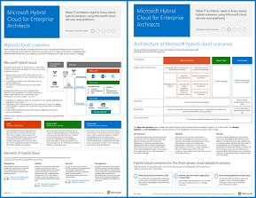

# Microsoft Hybrid Cloud para arquitectos profesionalesMicrosoft Hybrid Cloud for Enterprise Architects

 **Resumen:** Qué deben saber los arquitectos de TI sobre los escenarios híbridos al usar las plataformas y los servicios en la nube de Microsoft.**Summary:** What IT architects need to know about hybrid scenarios using Microsoft cloud services and platforms.
  
Este artículo contiene vínculos a un conjunto de artículos en los que se describe lo que necesitan saber los arquitectos de TI sobre la configuración y la arquitectura híbrida con plataformas y servicios en la nube de Microsoft. También puede ver este artículo como un póster de 7 páginas e imprimirlo en formato tabloide (también conocido como doble carta, 11 x 17 o A3).This article links you to a set of articles that describe what IT architects need to know about hybrid architecture and configurations with Microsoft cloud services and platforms. You can also view this article as a 7-page poster and print it in tabloid format (also known as ledger, 11 x 17, or A3).
  

  
[PDF](https://go.microsoft.com/fwlink/p/?linkid=842082) | [Visio](https://go.microsoft.com/fwlink/p/?linkid=842083) | 
[Más idiomas](https://www.microsoft.com/download/details.aspx?id=54424)[PDF](https://go.microsoft.com/fwlink/p/?linkid=842082) | [Visio](https://go.microsoft.com/fwlink/p/?linkid=842083) | 
[More languages](https://www.microsoft.com/download/details.aspx?id=54424)
  
También puede ver todos los modelos en los [Recursos de arquitectura de TI de Microsoft Cloud](microsoft-cloud-it-architecture-resources.md) y conocer el [Plan de desarrollo de la nube empresarial de Microsoft: Recursos para responsables de toma de decisiones de TI]((https://aka.ms/cloudarchitecture)).You can also see all of the models in the [Microsoft Cloud IT architecture resources](microsoft-cloud-it-architecture-resources.md) and swipe through [Microsoft's Enterprise Cloud Roadmap: Resources for IT Decision Makers]((https://aka.ms/cloudarchitecture)).
  
Vea las secciones siguientes:See the following sections:
  
- [Información general de la nube híbridaHybrid cloud overview](hybrid-cloud-overview.md)
    
    Ofertas de la nube de Microsoft (SaaS, PaaS de Azure e IaaS de Azure) y sus elementos comunes.Microsoft's cloud offerings (SaaS, Azure PaaS, and Azure IaaS) and their common elements.
    
- [Arquitectura de escenarios de nube híbrida de MicrosoftArchitecture of Microsoft hybrid cloud scenarios](architecture-of-microsoft-hybrid-cloud-scenarios.md)
    
    Esquema de la arquitectura de la nube híbrida para ofertas de Microsoft que muestra las capas comunes de infraestructura local, redes e identidad.An architectural diagram of hybrid cloud for Microsoft's cloud offerings, showing the common layers of on-premises infrastructure, networking, and identity.
    
- [Escenarios de nube híbrida para SaaS de Microsoft (Office 365)Hybrid cloud scenarios for Microsoft SaaS (Office 365)](hybrid-cloud-scenarios-for-microsoft-saas-office-365.md)
    
    Arquitectura del escenario híbrido de SaaS y descripciones de las configuraciones híbridas clave de Skype Empresarial, SharePoint Server y Exchange Server.The SaaS hybrid scenario architecture and descriptions of key hybrid configurations for Skype for Business, SharePoint Server, and Exchange Server.
    
- [Escenarios de nube híbrida para PaaS de AzureHybrid cloud scenarios for Azure PaaS](hybrid-cloud-scenarios-for-azure-paas.md)
    
    Arquitectura del escenario híbrido de PaaS de Azure, descripción de una aplicación híbrida de PaaS de Azure con un ejemplo y descripción de SQL Server 2016 Stretch Database.The Azure PaaS hybrid scenario architecture, the description of an Azure PaaS hybrid application with an example, and the description of SQL Server 2016 Stretch Database.
    
- [Escenarios de nube híbrida para IaaS de AzureHybrid cloud scenarios for Azure IaaS](hybrid-cloud-scenarios-for-azure-iaas.md)
    
    Arquitectura del escenario híbrido de IaaS de Azure y descripción de una aplicación de línea de negocio (LOB) hospedada en IaaS de Azure.The Azure IaaS hybrid scenario architecture and the description of a line of business (LOB) application hosted in Azure IaaS.
    
> [!NOTE]
> Estos artículos reflejan la versión de **junio de 2017** del póster de Microsoft Hybrid Cloud para arquitectos profesionales.These articles reflect the **June 2017** release of the Microsoft Hybrid Cloud for Enterprise Architects poster.
  
## Consulte tambiénSee Also

[Recursos de arquitectura de TI de la nube de MicrosoftMicrosoft Cloud IT architecture resources](microsoft-cloud-it-architecture-resources.md)

[Mapa de ruta de Enterprise Cloud de Microsoft: Recursos para los responsables de decisiones de TI]((https://sway.com/FJ2xsyWtkJc2taRD))[Microsoft's Enterprise Cloud Roadmap: Resources for IT Decision Makers]((https://sway.com/FJ2xsyWtkJc2taRD))

