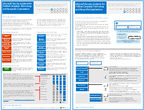
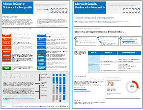

# Guía de seguridad de Microsoft para campañas políticas, las ONG y otras organizaciones de Agile

 **Resumen:** Guía de planificación e implementación para el movimiento rápido las organizaciones que tengan un perfil de amenaza elevado.
  
Si su organización es ágil, tiene un pequeño equipo de TI y tu perfil de amenaza es mayor que el promedio, esta guía está diseñada para usted. Esta solución muestra cómo crear rápidamente un entorno de servicios de nube esenciales que incluyen controles seguros desde el principio. Esta guía incluye recomendaciones de directrices de seguridad para la protección de datos, las identidades, correo electrónico y acceso desde dispositivos móviles.
  
## Guía de soluciones de seguridad

Esta guía describe cómo implementar un entorno de nube segura. La Guía de la solución puede utilizarse por cualquier organización. Incluye ayuda adicional para organizaciones ágiles con las cuentas de invitado y el acceso BYOD. Puede utilizar esta guía como punto de partida para diseñar su propio entorno. Le agradecemos sus comentarios a [CloudAdopt@microsoft.com](mailto:CloudAdopt@microsoft.com). 
  
|||
|:-----|:-----|
|**Elemento**   |**Descripción**   |
|**Guía de seguridad de Microsoft para campañas políticas**   [          ](http://download.microsoft.com/download/B/4/D/B4D520C3-4D0C-4B4D-BFB9-09F0651C2775/MSFT_Cloud_architecture_security for political campaigns.pdf)   [PDF](http://download.microsoft.com/download/B/4/D/B4D520C3-4D0C-4B4D-BFB9-09F0651C2775/MSFT_Cloud_architecture_security for political campaigns.pdf)  \| [Visio](http://download.microsoft.com/download/B/4/D/B4D520C3-4D0C-4B4D-BFB9-09F0651C2775/MSFT_Cloud_architecture_security for political campaigns.vsdx)   |Esta guía utiliza como ejemplo una organización de campaña política. Utilice esta guía como punto de partida para cualquier entorno.    |
|**Guía de seguridad de Microsoft para organizaciones no lucrativas**   [          ](http://download.microsoft.com/download/9/4/3/94389612-C679-4061-8DF2-D9A15D72B65F/Microsoft_Cloud Architecture_Security for Nonprofits.pdf)   [PDF](http://download.microsoft.com/download/9/4/3/94389612-C679-4061-8DF2-D9A15D72B65F/Microsoft_Cloud Architecture_Security for Nonprofits.pdf)  \| [Visio](http://download.microsoft.com/download/9/4/3/94389612-C679-4061-8DF2-D9A15D72B65F/Microsoft_Cloud Architecture_Security for Nonprofits.vsdx)   |Esta guía es ligeramente revisada para organizaciones sin ánimo de lucro. Por ejemplo, hace referencia a planes sin ánimo de lucro de Office 365. La orientación técnica es la misma que la Guía de solución de campaña política.    |
   
## Guía de entornos de pruebas

Para crear un entorno de desarrollo y prueba de esta solución, utilice las siguientes guías de laboratorio de prueba: 
  
- [Configurar grupos y usuarios de un entorno de pruebas y desarrollo de campaña política](configure-groups-and-users-for-a-political-campaign-dev-test-environment.md)
    
     Crear suscripciones de prueba de Office 365 y EMS y, a continuación, crear grupos y usuarios para una campaña político representativo.
    
- [Crear sitios de equipo en un entorno de pruebas y desarrollo de campaña política](create-team-sites-in-a-political-campaign-dev-test-environment.md)
    
    Cree cuatro sitios de equipo de SharePoint Online con niveles internos, privados, sensible y altamente confidencial de seguridad.
    
Para las características de seguridad adicionales para la demostración o prueba del concepto, consulte [Guías de laboratorio de prueba de Office 365](http://aka.ms/o365tlgs).
  
## Consulte también

[Soluciones de seguridad](security-solutions.md)
  
[Guías de entorno de pruebas de adopción de la nube (TLG)](cloud-adoption-test-lab-guides-tlgs.md)
  
[Recursos de arquitectura de TI de la nube de Microsoft](microsoft-cloud-it-architecture-resources.md)

