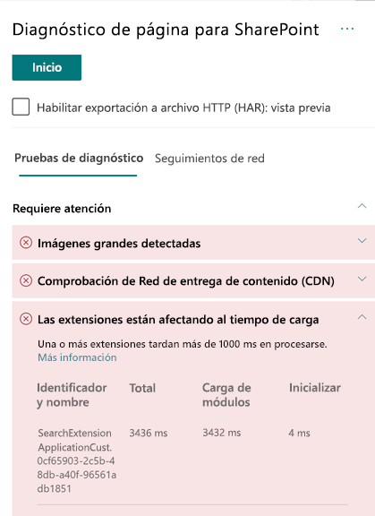

# Optimizar el rendimiento de extensiones personalizadas en páginas del sitio modernas de SharePoint OnlineOptimize custom extension performance in SharePoint Online modern site pages

Este artículo le ayudará a determinar cómo las extensiones personalizadas afectan a la latencia que percibe el usuario y cómo corregir los problemas más comunes.This article will help you understand how to determine how custom extensions affect user perceived latency, and how to remediate common issues.

## Usar la herramienta de Diagnóstico de páginas para SharePoint para analizar las extensiones personalizadasUse the Page Diagnostics for SharePoint tool to analyze custom extensions

La herramienta de Diagnóstico de páginas para SharePoint es una extensión de explorador para los nuevos exploradores de Microsoft Edge (https://www.microsoft.com/edge) y Chrome que analiza las páginas del sitio de publicación clásicas y las modernas del portal de SharePoint Online.The Page Diagnostics for SharePoint tool is a browser extension for the new Microsoft Edge (https://www.microsoft.com/edge) and Chrome browsers that analyzes both SharePoint Online modern portal and classic publishing site pages. La herramienta le ofrece un informe para cada página analizada en el que se muestra el rendimiento de la página respecto a un conjunto definido de criterios de rendimiento.The tool provides a report for each analyzed page showing how the page performs against a defined set of performance criteria. Para instalar e informarse de la herramienta Diagnóstico de página de SharePoint, visite [Usar la herramienta Diagnóstico de página para SharePoint Online](page-diagnostics-for-spo.md).To install and learn about the Page Diagnostics for SharePoint tool, visit [Use the Page Diagnostics tool for SharePoint Online](page-diagnostics-for-spo.md).

>[!NOTE]
>La herramienta de Diagnóstico de páginas solo funciona para SharePoint Online y no se puede usar en una página del sistema de SharePoint. The Page Diagnostics tool only works for SharePoint Online, and cannot be used on a SharePoint system page.

Al analizar una página del sitio de SharePoint con la herramienta de Diagnóstico de páginas para SharePoint, puede ver información sobre las extensiones personalizadas que superan la métrica de línea base en el resultado **Las extensiones afectan al tiempo de carga de la página** en el panel _Pruebas de diagnóstico_.When you analyze a SharePoint site page with the Page Diagnostics for SharePoint tool, you can see information about custom extensions that exceed the baseline metric in the **Extensions are impacting load time** result in the _Diagnostic tests_ pane.

Los posibles resultados incluyen:Possible results include:

- **Atención necesaria** (en rojo): cualquier extensión _personalizada_ que tarde más de **un** segundo en cargarse.**Attention required** (red): Any _custom_ extension that takes longer than **one** second to load. El tiempo de carga total que se muestra en los resultados de la prueba se desglosa por carga de módulos e inicialización.Total load time as displayed in test results is broken down by module load and init.
- **No es necesario realizar ninguna acción** (en verde): no hay ninguna extensión que tarde más de un segundo en cargarse.**No action required** (green): No extension is taking longer than one second to load.

Si una extensión afecta al tiempo de carga de la página, el resultado aparece en la sección **Atención necesaria** de los resultados.If an extension is impacting page load time, the result appears in the **Attention required** section of the results. Haga clic en el resultado para ver los detalles sobre la extensión que se está cargando despacio.Click the result to see details about which extension is loading slowly. Las actualizaciones futuras de la herramienta Diagnóstico de páginas para SharePoint pueden incluir actualizaciones de las reglas de análisis, así que asegúrese de que siempre tiene la versión más reciente de la herramienta.Future updates to the Page Diagnostics for SharePoint tool may include updates to analysis rules, so please ensure you always have the latest version of the tool.

La información disponible en los resultados incluye lo siguiente:Information available in the results includes:

- **Nombre e identificador** muestra información de identificación que puede ayudarle a encontrar la extensión en la página**Name and ID** shows identifying information that can help you find the extension on the page
- **Total** muestra el tiempo total para que se inicialice y cargue la extensión**Total** shows the total time for the extension to initialize and load
- **Carga de módulos** muestra el tiempo que se tarda en recuperar y cargar la extensión**Module Load** shows the time taken to fetch and load the extension
- **Inicialización** muestra el tiempo necesario para que se inicialice la extensión**Init** shows the time taken for the extension to initialize

Se proporciona esta información para que los diseñadores y desarrolladores puedan solucionar problemas.This information is provided to help designers and developers troubleshoot issues. Debe proporcionar esta información a su equipo de diseño y desarrollo.This information should be provided to your design and development team.

## Introducción a las extensionesOverview of extensions

Puede usar las Extensiones de SharePoint Framework (SPFx) para ampliar la experiencia de usuario de SharePoint.SharePoint Framework (SPFx) Extensions can be used to extend the SharePoint user experience. Con las Extensiones de SharePoint Framework, puede personalizar otros aspectos de la experiencia de SharePoint, como las vistas de datos de lista, las barras de herramientas y las áreas de notificación.With SharePoint Framework Extensions, you can customize more facets of the SharePoint experience, including notification areas, toolbars, and list data views.

Las extensiones pueden afectar negativamente al rendimiento de una página de SharePoint ya que también necesitan recursos de red y CPU para realizar el trabajo necesario.Extensions can have a bad influence on the performance of a SharePoint page as it also takes CPU and network resources to do required work.

Existen cuatro tipos de extensiones:There are four types of extensions:

- **Personalizadores de aplicación** agregan scripts a la página, tienen acceso a marcadores de posición de elementos HTML conocidos y los amplían con representaciones personalizadas.**Application Customizers** adds scripts to the page, and accesses well-known HTML element placeholders and extends them with custom renderings.
- **Personalizadores de campo** proporcionan vistas modificadas de los datos para los campos de una lista.**Field Customizers** provides modified views to data for fields within a list.
- **Conjuntos de comandos** amplían las superficies de comandos de SharePoint para agregar nuevas acciones y proporcionan código de cliente que puede utilizar para implementar comportamientos.**Command Sets** extend the SharePoint command surfaces to add new actions, and provides client-side code that you can use to implement behaviors.
- **Modificador de consulta de búsqueda (solo vista previa)** se invoca justo antes de ejecutar la consulta de búsqueda.**Search Query Modifier (preview only)** are invoked just before the search query is executed.

## Corrección de problemas de rendimiento de extensiónRemediate extension performance issues

Siga las instrucciones de esta sección para identificar y corregir los problemas de rendimiento de las extensiones que se muestran en los resultados **Las extensiones afectan al tiempo de carga de la página**.Follow the guidance in this section to identify and remediate performance issues with extensions listed in the **Extensions are impacting page load time** results.

>[!NOTE]
>Los personalizadores de la aplicación se pueden ejecutar en la fase temprana del ciclo de vida de una página y pueden influir en el rendimiento de otras extensiones de la misma.Application customizers may be executed in the early stage during the lifecycle of a page and it may influence the performance of other extensions on the page.

Los resultados de la auditoría en la herramienta de Diagnóstico de páginas mostrarán dos fases de ejecución de una extensión para ayudarle a identificar el potencial impacto en el rendimiento.The audit results in the Page Diagnostic Tool will display two stages of executing an extension in order to help identify the potential performance impact.

- **Carga de módulos** es el tiempo que tarda en cargar la extensión que se ve afectado por el tamaño de la misma, por lo que es una buena idea agrupar solo las bibliotecas necesarias en la extensión y también elegir bibliotecas más ligeras.**Module load** is how long it takes to load the extension, which is impacted by the size of an extension so it is a good idea to only bundle the necessary libraries in the extension and to also choose lighter libraries.
- **Inicialización** es el tiempo de inicialización de la extensión. Los desarrolladores de extensiones deben tener en cuenta si la extensión realiza tareas innecesarias o ejecuta demasiados comandos durante la fase de inicialización.**Init** is the initialization time of the extension and extension developers should consider whether the extension is doing unnecessary work or executing too many commands during the initializing stage.

Los autores de páginas también pueden usar el resultado de auditoría para ver si una página tiene demasiadas extensiones ya que pueden afectar negativamente al rendimiento de una página.Page authors can also use the audit result to see whether a page has too many extensions as too many extensions will negatively impact the performance of a page.

- **Tamaño de extensión y dependencias****Extension size and dependencies**
  - El uso de la red CDN de Office 365 es necesario para una descarga de recursos estática óptima.Use of the Office 365 CDN is required for optimal static resource download. Se prefieren los orígenes de la red CDN pública para los archivos _js/css_.Public CDN origins are preferable for _js/css_ files. Para obtener información sobre cómo usar la CDN de Office 365, vea [Usar la red de entrega de contenido (CDN) de Office 365 con SharePoint Online](use-office-365-cdn-with-spo.md).For more information about using the Office 365 CDN, see [Use the Office 365 Content Delivery Network (CDN) with SharePoint Online](use-office-365-cdn-with-spo.md).
  - Reutilice marcos como _importaciones de Fabric_ y _React_ que forman parte de SharePoint Framework (SPFx).Reuse frameworks like _React_ and _Fabric imports_ that come as part of the SharePoint Framework (SPFx). Para más información, vea [Información general de SharePoint Framework](https://docs.microsoft.com/sharepoint/dev/spfx/sharepoint-framework-overview).For more information, see [Overview of the SharePoint Framework](https://docs.microsoft.com/sharepoint/dev/spfx/sharepoint-framework-overview).
  - Asegúrese de que está usando la versión más reciente de SharePoint Framework y actualice a las nuevas versiones a medida que estén disponibles.Ensure that you are using the latest version of the SharePoint Framework, and upgrade to new versions as they become available.
- **Búsqueda y almacenamiento en caché de datos****Data fetching/caching**
  - Si la extensión se basa en llamadas de servidor adicionales para obtener datos para mostrar, asegúrese de que las API del servidor son rápidas o implementan el almacenamiento en caché del lado cliente (como _localStorage_ o _IndexDB_ para conjuntos más grandes).If the extension relies on extra server calls to fetch data for display, ensure those server APIs are fast and/or implement client side caching (such as using _localStorage_ or _IndexDB_ for larger sets).
  - Si se necesitan varias llamadas para representar datos fundamentales, considere la posibilidad de realizar el procesamiento por lotes en el servidor u otros métodos de consolidación de solicitudes en una sola llamada.If multiple calls are required to render critical data, consider batching on the server or other methods of consolidating requests to a single call.
  - Por otra parte, si algunos elementos de datos requieren una API más lenta, pero no son fundamentales para la representación inicial, desacóplelos en una llamada diferente que se ejecuta después de que se representen los datos fundamentales.Alternatively, if some elements of data require a slower API, but are not critical to initial rendering, decouple these to a separate call that is executed after critical data is rendered.
  - Si varios elementos usan los mismos datos, utilice una capa de datos común para evitar las llamadas duplicadas.If multiple parts use the same data, utilize a common data layer to avoid duplicate calls.
- **Tiempo de representación****Rendering time**
  - Cualquier fuente multimedia, como imágenes y vídeos, debe tener el tamaño máximo de los límites del contenedor, dispositivo o red, para evitar la descarga de activos de gran tamaño innecesarios.Any media sources like images and videos should be sized to the limits of the container, device and/or network to avoid downloading unnecessary large assets. Para obtener información sobre cómo las dependencias de contenido, vea [Usar la red de entrega de contenido (CDN) de Office 365 con SharePoint Online](use-office-365-cdn-with-spo.md).For more information about content dependencies, see [Use the Office 365 Content Delivery Network (CDN) with SharePoint Online](use-office-365-cdn-with-spo.md).
  - Evite las llamadas a la API que provocan la redistribución, reglas de CSS complejas o animaciones complicadas.Avoid API calls that cause re-flow, complex CSS rules or complicated animations. Para obtener más información, vea [Minimizar la redistribución del explorador](https://developers.google.com/speed/docs/insights/browser-reflow).For more information, see [Minimizing browser reflow](https://developers.google.com/speed/docs/insights/browser-reflow).
  - Evite usar tareas de larga ejecución encadenadas.Avoid use of chained long running tasks. En su lugar, divida las tareas de larga ejecución en distintas colas.Instead, break long running tasks apart into separate queues. Para obtener más información, vea [Optimizar la ejecución de JavaScript](https://developers.google.com/web/fundamentals/performance/rendering/optimize-javascript-execution).For more information, see [Optimize JavaScript Execution](https://developers.google.com/web/fundamentals/performance/rendering/optimize-javascript-execution).
  - Reserve el espacio correspondiente para representar de forma asincrónica elementos multimedia u objetos visuales para evitar fotogramas omitidos e interrupciones de flujo.Reserve corresponding space for asynchronously rendering media or visual elements to avoid skipped frames and stuttering (also known as _jank_).
  - Si un explorador específico no es compatible con una característica que se usa para la representación, cargue un polyfill o excluya la ejecución de un código dependiente.If a certain browser doesn't support a feature used in rendering, either load a polyfill or exclude running dependent code. Si la característica no es fundamental, elimine recursos como controladores de eventos para evitar pérdidas de memoria.If the feature is not critical, dispose resources such as event handlers to avoid memory leaks.

Antes de realizar revisiones de página para corregir problemas de rendimiento, anote el tiempo de carga de la página en los resultados del análisis.Before you make page revisions to remediate performance issues, make a note of the page load time in the analysis results. Ejecute la herramienta de nuevo después de la revisión y compruebe si los nuevos resultados están en línea con su valor de referencia. Luego, compruebe el nuevo tiempo de carga de la página para ver si se ha producido alguna mejora.Run the tool again after your revision to see if the new result is within the baseline standard, and check the new page load time to see if there was an improvement.

>[!NOTE]
>El tiempo de carga de la página puede variar en función de varios factores, como la carga de la red, la hora del día y otras condiciones transitorias.Page load time can vary based on a variety of factors such as network load, time of day, and other transient conditions. Debe probar el tiempo de carga de la página varias veces, antes y después de realizar cambios, para obtener un promedio.You should test page load time a few times before and after making changes to help you average the results.

## Temas relacionadosRelated topics

[Ajustar el rendimiento de SharePoint OnlineTune SharePoint Online performance](tune-sharepoint-online-performance.md)

[Ajustar el rendimiento de Office 365Tune Office 365 performance](tune-office-365-performance.md)

[Rendimiento en la experiencia moderna de SharePointPerformance in the modern SharePoint experience](https://docs.microsoft.com/sharepoint/modern-experience-performance)

[Redes de entrega de contenidoContent delivery networks](content-delivery-networks.md)

[Uso de la red de entrega de contenido (CDN) de Office 365 con SharePoint OnlineUse the Office 365 Content Delivery Network (CDN) with SharePoint Online](use-office-365-cdn-with-spo.md)