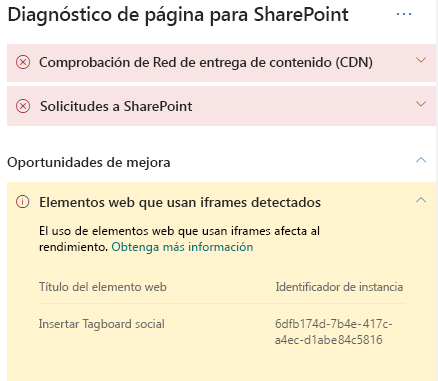

# Optimizar los iFrames en las páginas de sitio de publicación moderna y clásica de SharePoint Online

los iFrames pueden ser útiles para obtener una vista previa del contenido enriquecido, como vídeos u otros elementos multimedia. Sin embargo, dado que cargan una página independiente en la página del sitio de SharePoint, pueden contener imágenes, vídeos u otros elementos de gran tamaño que alarguen los tiempos de carga de la página sin que usted los pueda controlar desde la propia página. Este artículo le mostrará cómo los iFrames afectan a la latencia que percibe el usuario en sus páginas, y cómo corregir los problemas más comunes.

>[!NOTE]
>Para obtener más información sobre el rendimiento de los sitios modernos de SharePoint Online, vea [Rendimiento en la experiencia moderna de SharePoint.](https://docs.microsoft.com/sharepoint/modern-experience-performance)

## Use la herramienta de Diagnóstico de páginas de SharePoint para analizar los elementos web con iFrames

La **herramienta Diagnóstico de página de SharePoint** es una extensión de explorador para Chrome y la [versión 77 o posteriores de Microsoft Edge](https://www.microsoftedgeinsider.com/download?form=MI13E8&OCID=MI13E8) que le permite analizar páginas de sitios de publicación modernos y clásicos en SharePoint. La herramienta le ofrece un informe para cada página analizada en el que se muestra el rendimiento de la página respecto a un conjunto definido de criterios de rendimiento. Para instalar e informarse de la herramienta Diagnóstico de página de SharePoint, visite [Usar la herramienta Diagnóstico de página para SharePoint Online](page-diagnostics-for-spo.md).

Cuando analice una página de sitio de SharePoint con la herramienta Diagnóstico de páginas de SharePoint, puede ver información sobre los elementos web que contengan iFrames en el panel _Pruebas de diagnóstico_. El valor de referencia es el mismo para las páginas modernas y las clásicas.

Puede encontrarse con los siguientes resultados:

- **Atención requerida** (rojo): la página contiene **tres o más** elementos web con iFrames.
- **Oportunidades de mejora** (amarillo): la página **contiene uno o dos** elementos web con iFrames
- **No se requiere ninguna acción** (verde): la página no contiene elementos web con iFrames

Si se muestra el resultado **se han detectado elementos Web que usan iFrames** en la sección **Oportunidades de mejora** o **Atención requerida** de los resultados, puede hacer clic en el resultado para ver los elementos web que contienen iFrames.

## Corrección de problemas de rendimiento de iFrame

Use el resultado **Se han detectado elementos web con iFrames** en la herramienta de Diagnóstico de páginas para determinar qué elementos web contienen iFrames y pueden alargar el tiempo de carga de la página.

Los iFrames son inherentemente lentos porque cargan una página externa independiente que incluye todo un contenido asociado, como JavaScript, CSS y elementos del marco de trabajo, lo que puede multiplicar por dos o más el tiempo de carga de la página del sitio.

Siga las instrucciones que se indican a continuación para hacer un uso óptimo de los iFrames.

- Siempre que sea posible, use imágenes en lugar de iFrames si la vista previa es pequeña y no es interactiva.
- Si es necesario usar iFrames, minimice el número de los mismos o sáquelos de la ventanilla.
- Los archivos de Office incrustados, como los de Word, Excel y PowerPoint, son interactivos, pero ralentizan la carga. A menudo es más eficiente usar imágenes en miniatura con un vínculo al documento completo.
- Los vídeos de YouTube insertados y las fuentes de Twitter suelen tener un mejor rendimiento en iFrames, pero le recomendamos que los use de forma selectiva.
- Los elementos web aislados son una excepción razonable, pero reduzca su número y sáquelos de la ventanilla.
- Si un iFrame se encuentra fuera de la ventanilla, considere la posibilidad de usar _IntersectionObserver_ para retrasar el procesamiento del iFrame hasta que aparezca en la vista.

Antes de realizar revisiones de página para corregir problemas de rendimiento, anote el tiempo de carga de la página en los resultados del análisis. Ejecute la herramienta de nuevo después de la revisión y compruebe si los nuevos resultados están en línea con su valor de referencia. Luego, compruebe el nuevo tiempo de carga de la página para ver si se ha producido alguna mejora.

>[!NOTE]
>El tiempo de carga de la página puede variar en función de varios factores, como la carga de la red, la hora del día y otras condiciones transitorias. Debe probar el tiempo de carga de la página varias veces, antes y después de realizar cambios, para obtener un promedio.

## Temas relacionados

[Ajustar el rendimiento de SharePoint Online](tune-sharepoint-online-performance.md)

[Ajustar el rendimiento de Office 365](tune-office-365-performance.md)

[Rendimiento en la experiencia moderna de SharePoint](https://docs.microsoft.com/sharepoint/modern-experience-performance.md)
