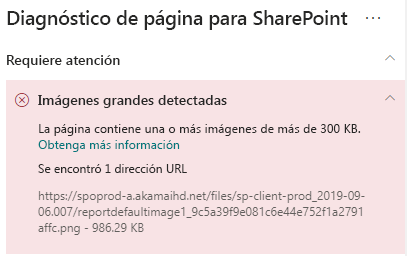

# Optimizar imágenes en páginas de sitio modernas de SharePoint OnlineOptimize images in SharePoint Online modern site pages

Lea este artículo para averiguar cómo optimizar imágenes en páginas de sitio modernas de SharePoint OnlineThis article will help you understand how to optimize images in SharePoint Online modern site pages.

Para obtener información sobre cómo optimizar imágenes en sitios de publicación clásicos, vea [Optimización de imágenes para SharePoint Online](image-optimization-for-sharepoint-online.md).For information about optimizing images in classic publishing sites, see [Image optimization for SharePoint Online](image-optimization-for-sharepoint-online.md)..

>[!NOTE]
>Para obtener más información sobre el rendimiento de los portales modernos de SharePoint Online, vea [Rendimiento en la experiencia moderna de SharePoint.](https://docs.microsoft.com/sharepoint/modern-experience-performance)For more information about performance in SharePoint Online modern portals, see [Performance in the modern SharePoint experience](https://docs.microsoft.com/sharepoint/modern-experience-performance).

## Use la herramienta de Diagnóstico de página de SharePoint para analizar la optimización de imágenesUse the Page Diagnostics for SharePoint tool to analyze image optimization

La herramienta de Diagnóstico de páginas para SharePoint es una extensión de explorador para los nuevos exploradores de Microsoft Edge (https://www.microsoft.com/edge) y Chrome que analiza las páginas del sitio de publicación clásicas y las modernas del portal de SharePoint Online.The Page Diagnostics for SharePoint tool is a browser extension for the new Microsoft Edge (https://www.microsoft.com/edge) and Chrome browsers that analyzes both SharePoint Online modern portal and classic publishing site pages. La herramienta le ofrece un informe para cada página analizada en el que se muestra el rendimiento de la página respecto a un conjunto definido de criterios de rendimiento.The tool provides a report for each analyzed page showing how the page performs against a defined set of performance criteria. Para instalar e informarse de la herramienta Diagnóstico de página de SharePoint, visite [Usar la herramienta Diagnóstico de página para SharePoint Online](page-diagnostics-for-spo.md).To install and learn about the Page Diagnostics for SharePoint tool, visit [Use the Page Diagnostics tool for SharePoint Online](page-diagnostics-for-spo.md).

>[!NOTE]
>La herramienta de Diagnóstico de páginas solo funciona para SharePoint Online y no se puede usar en una página del sistema de SharePoint. The Page Diagnostics tool only works for SharePoint Online, and cannot be used on a SharePoint system page.

Cuando analice un sitio moderno de SharePoint con la herramienta Diagnóstico de página de SharePoint, puede ver información sobre imágenes grandes en el panel _Pruebas de diagnóstico_.When you analyze a SharePoint modern site with the Page Diagnostics for SharePoint tool, you can see information about large images in the _Diagnostic tests_ pane.

Puede encontrarse con los siguientes resultados:Possible results include:

- **Atención requerida** (rojo): la página contiene **una o más** imágenes con un tamaño mayor a 300 KB**Attention required** (red): The page contains **one or more** images over 300KB in size
- **No se requiere ninguna acción** (verde): la página no contiene imágenes con un tamaño mayor a 300 KB**No action required** (green): The page contains no images over 300KB in size

Si aparece **Se han detectado imágenes grandes** en la sección **Atención requerida** de los resultados, puede hacer clic en el propio resultado para ver más detalles.If the **Large images detected** result appears in the **Attention required** section of the results, you can click the result to see additional details.

## Corrección de problemas causados por imágenes grandesRemediate large image issues

Si una página contiene imágenes con un tamaño superior a 300 KB, seleccione el resultado **Se han detectado imágenes grandes** para ver qué imágenes superan ese tamaño.If a page contains images over 300KB in size, select the **Large images detected** result to see which images are too large. En las páginas de SharePoint Online modernas, las imágenes se representan automáticamente con un tamaño ajustado, dependiendo del tamaño de la ventana del explorador y la resolución del monitor del cliente.In modern SharePoint Online pages, renditions of images are automatically provided and sized depending on the size of the browser window and the resolution of the client monitor. Siempre debe optimizar las imágenes para su uso en la web antes de cargarlas en SharePoint Online.You should always optimize images for web use prior to upload to SharePoint Online. Las imágenes muy grandes se reducen automáticamente en tamaño y resolución, lo que puede afectar a cómo se representan.Very large images will be automatically reduced in size and resolution which can result in unexpected rendering characteristics.

Antes de realizar revisiones de página para corregir problemas de rendimiento, anote el tiempo de carga de la página en los resultados del análisis.Before you make page revisions to remediate performance issues, make a note of the page load time in the analysis results. Ejecute la herramienta de nuevo después de la revisión y compruebe si los nuevos resultados están en línea con su valor de referencia. Luego, compruebe el nuevo tiempo de carga de la página para ver si se ha producido alguna mejora.Run the tool again after your revision to see if the new result is within the baseline standard, and check the new page load time to see if there was an improvement.

>[!NOTE]
>El tiempo de carga de la página puede variar en función de varios factores, como la carga de la red, la hora del día y otras condiciones transitorias.Page load time can vary based on a variety of factors such as network load, time of day, and other transient conditions. Debe probar el tiempo de carga de la página varias veces, antes y después de realizar cambios, para obtener un promedio.You should test page load time a few times before and after making changes to help you average the results.

## Temas relacionadosRelated topics

[Ajustar el rendimiento de SharePoint OnlineTune SharePoint Online performance](tune-sharepoint-online-performance.md)

[Ajustar el rendimiento de Office 365Tune Office 365 performance](tune-office-365-performance.md)

[Rendimiento en la experiencia moderna de SharePointPerformance in the modern SharePoint experience](https://docs.microsoft.com/sharepoint/modern-experience-performance)

[Redes de entrega de contenidoContent delivery networks](content-delivery-networks.md)

[Uso de la red de entrega de contenido (CDN) de Office 365 con SharePoint OnlineUse the Office 365 Content Delivery Network (CDN) with SharePoint Online](use-office-365-cdn-with-spo.md)
