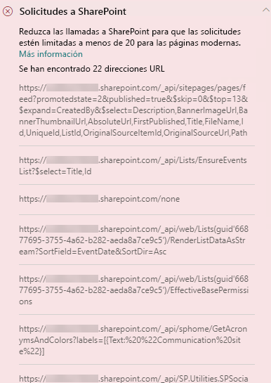
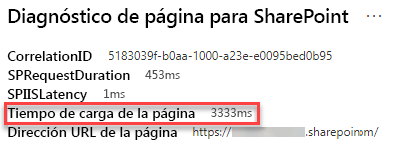

# Optimizar las llamadas de página en las páginas de sitios de publicación modernos y clásicos de SharePoint Online

Los sitios de publicación de SharePoint Online modernos y clásicos contienen vínculos que cargan datos de (o hacen llamadas a) características de SharePoint y CDN. Cuanto más llamadas realiza una página, más tiempo tarda la carga en cargar. Esto se conoce como **latencia percibida por el usuario final** o **EUPL**.

Este artículo le ayudará a comprender cómo determinar el número y el impacto de las llamadas a puntos de conexión externos desde las páginas de sitios de publicación modernos y clásicos y cómo limitar su efecto en la latencia percibida por el usuario final.

>[!NOTE]
>Para obtener más información sobre el rendimiento de los portales modernos de SharePoint Online, consulte [Rendimiento en la experiencia moderna de SharePoint](https://docs.microsoft.com/sharepoint/modern-experience-performance).

## Use la herramienta Diagnóstico de páginas para SharePoint para analizar las llamadas

La **herramienta Diagnóstico de páginas para SharePoint** es una extensión de explorador para Chrome y la [versión 77 o posteriores de Microsoft Edge](https://www.microsoftedgeinsider.com/download?form=MI13E8&OCID=MI13E8) que le permite analizar páginas de sitios de publicación modernas y clásicas en SharePoint. La herramienta le ofrece un informe para cada página analizada en el que se muestra el rendimiento de la página respecto a un conjunto definido de criterios de rendimiento. Para instalar e informarse sobre la herramienta Diagnóstico de páginas para SharePoint, visite [Usar la herramienta Diagnóstico de página para SharePoint Online](page-diagnostics-for-spo.md).

Cuando analice la página de un sitio de SharePoint con la herramienta Diagnóstico de páginas para SharePoint, puede ver información sobre llamadas externas en el resultado de _Solicitudes a SharePoint_ del panel **Pruebas de diagnóstico**. La línea aparecerá en verde si la página del sitio contiene un número de llamadas inferior al número de referencia y en rojo si la página supera el número de referencia. El número de referencia es diferente para las páginas modernas y clásicas porque las páginas de sitio clásicas usan HTTP 1.1 y las páginas modernas usan HTTP 2.0:

- Las páginas del sitio modernas no deben contener más de **25** llamadas.
- Las páginas de publicación clásicas no deben contener más de **6** llamadas.

Puede encontrarse con los siguientes resultados:

- **Requiere atención** (rojo): la página supera el número de referencia de llamadas
- **No se requiere ninguna acción** (verde): la página contiene un número de llamadas inferior al número de referencia.

Si el resultado de **Solicitudes a SharePoint** aparece en la sección **Requiere atención**, puede hacer clic en el resultado para obtener detalles, incluido el número total de llamadas en la página y una lista de direcciones URL.

## Corrección de problemas de rendimiento relacionados con demasiadas llamadas en una página

Si una página contiene demasiadas llamadas, puede usar la lista de direcciones URL de los resultados de **Solicitudes a SharePoint** para determinar si hay llamadas repetidas, llamadas que deben procesarse por lotes o las llamadas que devuelven datos que deberían almacenarse en caché.

**El procesamiento por lotes de llamadas REST** puede ayudar a reducir la sobrecarga de rendimiento. Para más información sobre el procesamiento por lotes de llamadas de API, consulte [Realizar solicitudes de lote con las API de REST](https://docs.microsoft.com/sharepoint/dev/sp-add-ins/make-batch-requests-with-the-rest-apis).

**El uso de una caché** para almacenar los resultados de una llamada de API puede mejorar el rendimiento de una solicitud semiactiva al permitir que el cliente use los datos en caché en lugar de realizar una llamada adicional para cada carga de página posterior. Hay varias formas de enfocar esta solución en función de las necesidades empresariales. Por lo general, si los datos van a ser los mismos para todos los usuarios, usar un servicio de almacenamiento en caché de nivel intermedio como [_Azure Redis_ Cache](https://azure.microsoft.com/services/cache/) es una opción excelente para reducir significativamente el tráfico de API en un sitio, puesto que los usuarios solicitarían los datos del servicio de almacenamiento en caché en lugar de directamente desde SPO. Las únicas llamadas a SPO necesarias serían para actualizar la memoria caché de nivel intermedio. Si los datos fluctúan en base a un usuario individual, puede que sea mejor implementar una caché de cliente, como LocalStorage o incluso una cookie. De esta forma, se reducirá el volumen de llamadas al eliminar las solicitudes siguientes que realiza el mismo usuario durante la duración de la caché, pero será menos eficaz que un servicio de almacenamiento en caché dedicado. PnP le permite usar LocalStorage con poco de desarrollo adicional.

Antes de realizar revisiones de página para corregir problemas de rendimiento, anote el tiempo de carga de la página en los resultados del análisis. Ejecute la herramienta de nuevo después de la revisión y compruebe si los nuevos resultados están en línea con su valor de referencia. Luego, compruebe el nuevo tiempo de carga de la página para ver si se ha producido alguna mejora.

>[!NOTE]
>El tiempo de carga de la página puede variar en función de varios factores, como la carga de la red, la hora del día y otras condiciones transitorias. Debe probar el tiempo de carga de la página varias veces, antes y después de realizar cambios, para obtener un promedio.

## Temas relacionados

[Ajustar el rendimiento de SharePoint Online](tune-sharepoint-online-performance.md)

[Ajustar el rendimiento de Office 365](tune-office-365-performance.md)

[Rendimiento en la experiencia moderna de SharePoint](https://docs.microsoft.com/sharepoint/modern-experience-performance)

[Redes de entrega de contenido](content-delivery-networks.md)

[Uso de la red de entrega de contenido (CDN) de Office 365 con SharePoint Online](use-office-365-cdn-with-spo.md)
