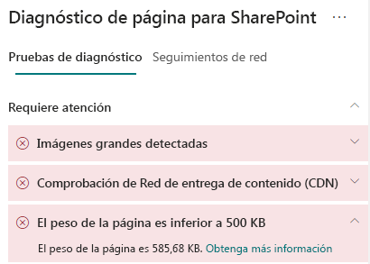

# Optimizar el peso de la página en páginas de sitio modernas de SharePoint Online

Las páginas de sitio modernas de SharePoint Online contienen código serializado que es necesario para representar el contenido de la página, como imágenes, texto, objetos en el área de contenido debajo de las barras de navegación y comandos, así como otros códigos HTML que conforman el marco de la página. El peso de página es una medida de este código HTML y se debe limitar para asegurar tiempos de carga de página óptimos.

Este artículo le ayudará a comprender cómo reducir el peso de página en las páginas de sitio modernas.

>[!NOTE]
>Para obtener más información sobre el rendimiento de los portales modernos de SharePoint Online, vea [Rendimiento en la experiencia moderna de SharePoint.](https://docs.microsoft.com/sharepoint/modern-experience-performance)

## Use la herramienta de Diagnóstico de páginas para SharePoint para analizar el peso de la página

La **herramienta Diagnóstico de páginas para SharePoint** es una extensión de explorador para Chrome y la [versión 77 o posteriores de Microsoft Edge](https://www.microsoftedgeinsider.com/download?form=MI13E8&OCID=MI13E8) que le permite analizar páginas de sitios de publicación modernos y clásicos en SharePoint. La herramienta le ofrece un informe para cada página analizada en el que se muestra el rendimiento de la página respecto a un conjunto definido de criterios de rendimiento. Para instalar e informarse sobre la herramienta Diagnóstico de páginas para SharePoint, visite [Usar la herramienta Diagnóstico de página para SharePoint Online](page-diagnostics-for-spo.md).

Cuando analice la página de un sitio de SharePoint con la herramienta Diagnóstico de páginas para SharePoint, puede ver información sobre la página en el resultado _Peso de página inferior a 500KB_ del panel **Pruebas de diagnóstico**. El resultado se mostrará en verde si el peso de la página es inferior al valor de referencia y rojo si el peso de la página es superior al valor de referencia.

Puede encontrarse con los siguientes resultados:

- **Requiere atención** (rojo): el peso de la página supera 500KB
- **No es necesario realizar ninguna acción** (verde): el peso de la página es inferior a 500KB

Si el resultado **Peso de página inferior a 500KB** aparece en la sección **Requiere atención**, puede hacer clic en el resultado para obtener detalles.

## Corrección de problemas de peso de página

Si el peso de la página supera 500KB, puede mejorar el tiempo total de carga de la página si reduce el número de elementos web y limita el contenido de la página hasta un grado adecuado.

Las instrucciones generales para reducir el peso de la página incluyen:

- Limite el contenido de la página a una cantidad razonable y use varias páginas para el contenido relacionado.
- Minimice el uso de elementos web que tengan contenedores de propiedades grandes.
- Use vistas resumidas no interactivas siempre que sea posible.
- Optimice los tamaños de imagen cambiando el tamaño de las imágenes de forma adecuada, con formatos de imagen comprimidos y asegurándose de que se descargan de una red CDN.

Puede encontrar más información para limitar el peso de la página en el artículo siguiente:

- [Optimizar el rendimiento de la página en SharePoint](https://docs.microsoft.com/sharepoint/dev/general-development/optimize-page-performance-in-sharepoint)

Antes de realizar revisiones de página para corregir problemas de rendimiento, anote el tiempo de carga de la página en los resultados del análisis. Ejecute la herramienta de nuevo después de la revisión y compruebe si los nuevos resultados están en línea con su valor de referencia. Luego, compruebe el nuevo tiempo de carga de la página para ver si se ha producido alguna mejora.

>[!NOTE]
>El tiempo de carga de la página puede variar en función de varios factores, como la carga de la red, la hora del día y otras condiciones transitorias. Debe probar el tiempo de carga de la página varias veces, antes y después de realizar cambios, para obtener un promedio.

## Temas relacionados

[Ajustar el rendimiento de SharePoint Online](tune-sharepoint-online-performance.md)

[Ajustar el rendimiento de Office 365](tune-office-365-performance.md)

[Rendimiento en la experiencia moderna de SharePoint](https://docs.microsoft.com/sharepoint/modern-experience-performance)

[Redes de entrega de contenido](content-delivery-networks.md)

[Uso de la red de entrega de contenido (CDN) de Office 365 con SharePoint Online](use-office-365-cdn-with-spo.md)
