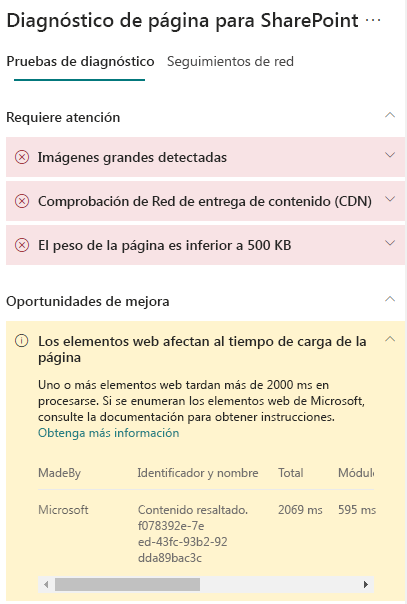

# Optimizar el rendimiento de elementos web en páginas del sitio modernas de SharePoint Online

Las páginas del sitio de SharePoint Online modernas contienen elementos web que pueden contribuir a los tiempos de carga totales de la página. En este artículo se mostrará cómo los elementos web de sus páginas afectan a la latencia que percibe el usuario y cómo corregir los problemas más comunes.

>[!NOTE]
>Para obtener más información sobre el rendimiento de los portales modernos de SharePoint Online, vea [Rendimiento en la experiencia moderna de SharePoint](https://docs.microsoft.com/sharepoint/modern-experience-performance).

## Usar la herramienta de Diagnóstico de páginas para SharePoint para analizar los elementos web

La herramienta de Diagnóstico de páginas para SharePoint es una extensión de explorador para los nuevos exploradores de Microsoft Edge (https://www.microsoft.com/edge) y Chrome que analiza las páginas del sitio de publicación clásicas y las modernas del portal de SharePoint Online. La herramienta le ofrece un informe para cada página analizada en el que se muestra el rendimiento de la página respecto a un conjunto definido de criterios de rendimiento. Para instalar e informarse de la herramienta Diagnóstico de página de SharePoint, visite [Usar la herramienta Diagnóstico de página para SharePoint Online](page-diagnostics-for-spo.md).

>[!NOTE]
>La herramienta de Diagnóstico de páginas solo funciona para SharePoint Online y no se puede usar en una página del sistema de SharePoint. 

Al analizar una página de un sitio de SharePoint con la herramienta Diagnóstico de páginas para SharePoint, puede ver información sobre los elementos web que superan la métrica de línea base en el resultado **Los elementos web afectan al tiempo de carga de la página** en el panel _Pruebas de diagnóstico_.

Puede encontrarse con los siguientes resultados:

- **Atención necesaria** (en rojo): cualquier elemento web _personalizado_ que esté visible en la ventanilla (parte visible de la pantalla de la página que se carga en primer lugar) y que tarda más de **dos** segundos en cargarse. Cualquier elemento web _personalizado_ que se encuentre fuera de la ventanilla y que tarde más de **cuatro** segundos en cargarse. El tiempo de carga total que se muestra en los resultados de la prueba se desglosa por carga de módulos, carga diferida, inicialización y representación.
- **Oportunidades de mejora** (amarillo): se deben revisar y supervisar los elementos que pueden afectar al tiempo de carga de la página que se muestran en esta sección. Esto puede incluir elementos web de Microsoft "de fábrica". Los resultados de los elementos web de Microsoft que se muestran en esta sección se comunican automáticamente a Microsoft, por lo que **no se requiere ninguna acción**. Solo debe registrar un vale de soporte técnico para investigar si la página tiene un rendimiento muy bajo y **todos los elementos web de Microsoft** en la misma aparecen en los resultados de la sección **Oportunidades de mejora**. Tenga en cuenta que, en una actualización posterior de la herramienta de Diagnóstico de páginas para SharePoint, los resultados se desglosarán en función de la configuración específica del elemento web de Microsoft.
- **No se requiere ninguna acción** (verde): no hay ningún elemento web que tarde más de **dos** segundos en devolver datos.

Si el resultado **Los elementos web afectan al tiempo de carga de la página** aparece en la sección de los resultados **Se necesita atención** u **Oportunidades de mejora**, haga clic en el resultado para ver los detalles de los elementos web que se cargan despacio. Las actualizaciones futuras de la herramienta Diagnóstico de páginas para SharePoint pueden incluir actualizaciones de las reglas de análisis, así que asegúrese de que siempre tiene la versión más reciente de la herramienta.

La información disponible en los resultados incluye lo siguiente:

- **Hecho por** muestra si el elemento web es personalizado o de fábrica de Microsoft
- **Nombre e identificador** muestra información de identificación que puede ayudarle a encontrar el elemento web en la página
- **Total** muestra el tiempo total en el que carga el elemento web
- **Carga de módulos** muestra el tiempo que tarda en recuperar y cargar los componentes de elementos web
- **Carga diferida** muestra el tiempo de carga aplazada de elementos web que no se ven en la sección principal de la página
- **Inicialización** muestra el tiempo que tarda en inicializar los elementos web
- **Representación** muestra el tiempo que tarda el elemento web en recuperar y procesar resultados

Se proporciona esta información para que los diseñadores y desarrolladores puedan solucionar problemas. Debe proporcionar esta información a su equipo de diseño y desarrollo.

## Corrección de problemas de rendimiento de elementos web

Siga las instrucciones de esta sección para identificar y corregir los problemas de rendimiento de los elementos web que se muestran en los resultados **Los elementos web afectan al tiempo de carga de la página**.

Existen tres tipos de causas por las que el elemento web puede tener problemas de rendimiento. Use la siguiente información para determinar el problema que se aplica a su escenario y cómo corregirlo.

- Dependencias y tamaño de script de elementos web
  - Optimice el script inicial que representa el escenario principal para el _modo de solo vista_.
  - Mueva los escenarios menos frecuentes y el código de modo de edición (como el panel de propiedades) para separar fragmentos con la instrucción _import()_.
  - Revise las dependencias del archivo _package.json_ para quitar por completo todos los códigos no alcanzados. Mueva todas las dependencias de solo prueba o compilación a devDependencies.
  - El uso de la red CDN de Office 365 es necesario para una descarga de recursos estática óptima. Se prefieren los orígenes de la red CDN pública para los archivos _js/css_. Para obtener información sobre cómo usar la CDN de Office 365, vea [Usar la red de entrega de contenido (CDN) de Office 365 con SharePoint Online](use-office-365-cdn-with-spo.md).
  - Reutilice marcos como _importaciones de Fabric_ y _React_ que forman parte de SharePoint Framework (SPFx). Para más información, vea [Información general de SharePoint Framework](https://docs.microsoft.com/sharepoint/dev/spfx/sharepoint-framework-overview).
  - Asegúrese de que está usando la versión más reciente de SharePoint Framework y actualice a las nuevas versiones a medida que estén disponibles.
- Búsqueda y almacenamiento en caché de datos
  - Si el elemento web se basa en llamadas de servidor adicionales para obtener datos para mostrar, asegúrese de que las API del servidor son rápidas o implementan el almacenamiento en caché del lado cliente (como _localStorage_ o _IndexDB_ para conjuntos más grandes).
  - Si se necesitan varias llamadas para representar datos fundamentales, considere la posibilidad de realizar el procesamiento por lotes en el servidor u otros métodos de consolidación de solicitudes en una sola llamada.
  - Por otra parte, si algunos elementos de datos requieren una API más lenta, pero no son fundamentales para la representación inicial, desacóplelos en una llamada diferente que se ejecuta después de que se representen los datos fundamentales.
  - Si varios elementos usan los mismos datos, utilice una capa de datos común para evitar las llamadas duplicadas.
- Tiempo de representación
  - Cualquier fuente multimedia, como imágenes y vídeos, debe tener el tamaño máximo de los límites del contenedor, dispositivo o red, para evitar la descarga de activos de gran tamaño innecesarios. Para obtener información sobre cómo las dependencias de contenido, vea [Usar la red de entrega de contenido (CDN) de Office 365 con SharePoint Online](use-office-365-cdn-with-spo.md).
  - Evite las llamadas a la API que provocan la redistribución, reglas de CSS complejas o animaciones complicadas. Para obtener más información, vea [Minimizar la redistribución del explorador](https://developers.google.com/speed/docs/insights/browser-reflow).
  - Evite usar tareas de larga ejecución encadenadas. En su lugar, divida las tareas de larga ejecución en distintas colas. Para obtener más información, vea [Optimizar la ejecución de JavaScript](https://developers.google.com/web/fundamentals/performance/rendering/optimize-javascript-execution).
  - Reserve el espacio correspondiente para representar de forma asincrónica elementos multimedia u objetos visuales para evitar fotogramas omitidos e interrupciones de flujo.
  - Si un explorador específico no es compatible con una característica que se usa para la representación, cargue un polyfill o excluya la ejecución de un código dependiente. Si la característica no es fundamental, elimine recursos como controladores de eventos para evitar pérdidas de memoria.

Antes de realizar revisiones de página para corregir problemas de rendimiento, anote el tiempo de carga de la página en los resultados del análisis. Ejecute la herramienta de nuevo después de la revisión y compruebe si los nuevos resultados están en línea con su valor de referencia. Luego, compruebe el nuevo tiempo de carga de la página para ver si se ha producido alguna mejora.

>[!NOTE]
>El tiempo de carga de la página puede variar en función de varios factores, como la carga de la red, la hora del día y otras condiciones transitorias. Debe probar el tiempo de carga de la página varias veces, antes y después de realizar cambios, para obtener un promedio.

## Temas relacionados

[Ajustar el rendimiento de SharePoint Online](tune-sharepoint-online-performance.md)

[Ajustar el rendimiento de Office 365](tune-office-365-performance.md)

[Rendimiento en la experiencia moderna de SharePoint](https://docs.microsoft.com/sharepoint/modern-experience-performance)

[Redes de entrega de contenido](content-delivery-networks.md)

[Uso de la red de entrega de contenido (CDN) de Office 365 con SharePoint Online](use-office-365-cdn-with-spo.md)
