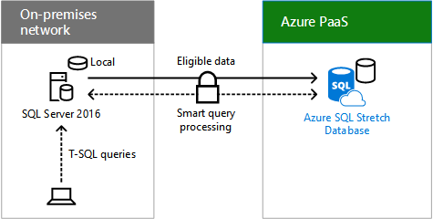
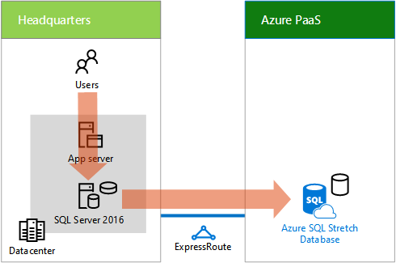

# Mover datos de transacción históricos a la nubeMoving historical transaction data to the cloud

 **Resumen:** Cómo Contoso ha implementado SQL Server Stretch Database para reducir sus necesidades de almacenamiento de datos locales y los costos de ejecución diarios.**Summary:** How Contoso implemented SQL Server stretch database to reduce its on-premises data storage needs and daily running costs.
  
El sistema de almacenamiento empresarial de Contoso almacena una gran cantidad de datos de transacción históricos para adaptarse a los requisitos reglamentarios y para las investigaciones de marketing y análisis de BI de tendencias de gasto. Contoso también necesita restaurar los datos archivados de una cinta magnética; un proceso muy largo. El hardware en el sistema de almacenamiento empresarial de Contoso estaba llegando al final de su ciclo de vida y reemplazarlo resultaría muy costoso.Contoso's enterprise storage system stores a large amount of historical transaction data for adherence with regulatory requirements and for marketing research and BI analysis of spending trends. Contoso also needs to restore archived data from magnetic tape, a time-intensive process. The hardware in Contoso's enterprise storage system was nearing its end of life and replacing it would be very expensive. 
  
Como parte de su necesidad empresarial de reducir verticalmente sus centros de datos locales, Contoso ha decidido actualizar a SQL Server 2016 por la característica híbrida de Stretch Database y su perfecta integración con Azure. Stretch Database permite que Contoso mueva los datos inactivos en sus tablas desde el entorno local al almacenamiento en la nube, lo que libera espacio en el disco local y reduce el mantenimiento. Los datos inactivos y activos se encuentran en las mismas tablas y siempre están disponibles para las aplicaciones, los usuarios y el mantenimiento, como copias de seguridad y restauraciones. En la figura 1 se muestra Stretch Database.As part of its business need to scale down its on-premises datacenters, Contoso chose to upgrade to SQL Server 2016 because of the Stretch Database hybrid feature and its seamless integration with Azure. Stretch Database allows Contoso to move the cold data in its tables from on-premises to cloud storage, freeing up local disk space and reducing maintenance. Both hot and cold data are in the same tables and are always available to applications and their users and for maintenance, such as backups and restores. Figure 1 shows Stretch Database.
  
**Figura 1: SQL Server Stretch Database****Figure 1: SQL Server Stretch Database**

  
En la figura 1 se muestra cómo un cliente de SQL envía consultas de T-SQL a un servidor que ejecuta SQL Server 2016, que las reenvía a Azure SQL Stretch Database en PaaS de Azure.Figure 1 shows how a SQL client sends T-SQL queries to a server running SQL Server 2016, which forwards them to an Azure SQL Stretch Database in Azure PaaS.
  
Para obtener más información, consulte [Stretch Database](https://msdn.microsoft.com/library/dn935011.aspx).For more information, see [Stretch Database](https://msdn.microsoft.com/library/dn935011.aspx).
  
Contoso ha usado estos pasos para mover sus datos históricos a la nube:Contoso used these steps to move their historical data to the cloud:
  
1. Analizar bases de datosAnalyze databases
    
    Se ha realizado un análisis de las tablas de las bases de datos que pretenden moverse a la nube y se han solucionado los problemas. El nuevo Stretch Database Advisor les proporciona información general completa de lo que pueden esperar de todas las características de SQL Server 2016, incluidas las tablas que tienen datos inactivos que podrían extenderse.Performed an analysis of the tables in the databases that they intended to move to the cloud and fixed any issues. The new Stretch Database Advisor gave them a full overview of what they can expect from all features in SQL Server 2016, including which tables have cold data that could be stretched.
    
2. ActualizaciónUpgrade
    
    Se han actualizado los servidores SQL Server existentes en el centro de datos de la sede central de París a SQL Server 2016.Updated existing SQL servers in the Paris headquarters datacenter to SQL Server 2016.
    
3. Migrar datos inactivos a la nubeMigrate cold data to the cloud
    
    Con SQL Management Studio han identificado las bases de datos que se van a extender y las tablas que se van a migrar a instancias de Stretch Database en Azure. Con el paso del tiempo y en segundo plano, SQL Server 2016 ha movido los datos históricos a las bases de datos de Stretch Database en Azure.Using SQL Management Studio, they identified the databases to stretch and the tables to migrate to instances of Stretch Database in Azure. Over time and in the background, SQL Server 2016 moved the historical data to stretch databases in Azure.
    
Aquí se muestra la configuración resultante para un servidor que ejecuta SQL Server 2016 en la sede central de París.Here is the resulting configuration for one server running SQL Server 2016 in the Paris headquarters.
  
**Figura 2: Usar Stretch Database en un servidor del centro de datos de Contoso****Figure 2: Using Stretch Database for a server in Contoso's datacenter**

  
En la figura 2 se muestra cómo las consultas de usuario en un servidor de aplicaciones del centro de datos de Contoso se convierten en consultas SQL que se pasan a Azure SQL Stretch Database en PaaS de Azure.Figure 2 shows how user queries to an application server in Contoso's datacenter become SQL queries that are passed to an Azure SQL Stretch Database in Azure PaaS.
  
Los usuarios tienen acceso a los datos mediante consultas y aplicaciones existentes. Las directivas de acceso siguen siendo las mismas. Además, no se necesitan copias de seguridad en cinta. El mantenimiento consiste en realizar copias de seguridad y restaurar datos activos.Users access the data through existing apps and queries. Access policies remain the same. Moving forward, there is no need for tape backups. Maintenance consists of backing up and restoring hot data.
  
Después de implementar Stretch Database, Contoso:After implementing Stretch Database, Contoso:
  
- Ha reducido sus necesidades de almacenamiento de datos locales en un 85 %.Reduced its on-premises data storage needs by 85%.
    
- Ha realizado la actualización del sistema de almacenamiento empresarial y la dependencia de archivos de cinta magnética innecesarios.Made the update of the enterprise storage system and reliance on magnetic tape archives unnecessary.
    
- Ha reducido sus costos de ejecución diarios de manera significativa.Reduced its daily running costs significantly.
    
## Vea tambiénSee Also

[Escenarios empresariales para Contoso CorporationEnterprise scenarios for the Contoso Corporation](enterprise-scenarios-for-the-contoso-corporation.md)
  
[Contoso en la nube de MicrosoftContoso in the Microsoft Cloud](contoso-in-the-microsoft-cloud.md)
  
[Recursos de arquitectura de TI de la nube de MicrosoftMicrosoft Cloud IT architecture resources](microsoft-cloud-it-architecture-resources.md)

[Stretch Database](https://msdn.microsoft.com/library/dn935011.aspx)[Stretch Database](https://msdn.microsoft.com/library/dn935011.aspx)
  
[Mapa de ruta de Enterprise Cloud de Microsoft: Recursos para los responsables de la toma de decisiones de TI](https://sway.com/FJ2xsyWtkJc2taRD)[Microsoft's Enterprise Cloud Roadmap: Resources for IT Decision Makers](https://sway.com/FJ2xsyWtkJc2taRD)

