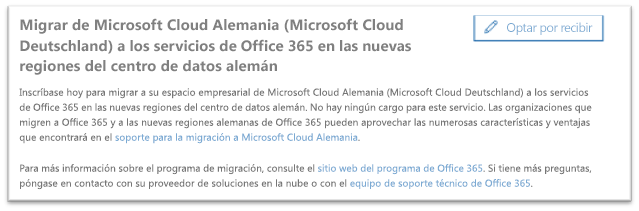
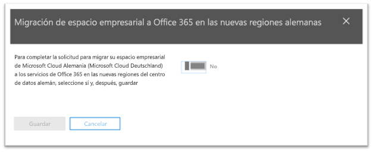
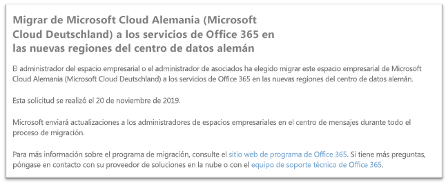

# Cómo participar en la migración de Microsoft Cloud Alemania (Microsoft Cloud Deutschland) a los servicios de Office 365 en las nuevas regiones del centro de datos alemánHow to opt-in for migration from Microsoft Cloud Germany (Microsoft Cloud Deutschland) to Office 365 services in the new German datacenter regions

>[!Note]
>Este artículo solo se aplica a los clientes de Microsoft Cloud Alemania/Deutschland elegibles.This article only applies to eligible Microsoft Cloud Germany/Deutschland customers.
>

## Cómo solicitar la migraciónHow to request migration

Los clientes elegibles para el servicio que se ofrece en Microsoft Cloud Alemania verán una página en el Centro de administración de Microsoft 365 que permite a un administrador del espacio empresarial del cliente participar en la migración.Eligible customers with service provisioned in Microsoft Cloud Germany will see a page in the Microsoft 365 admin center that will allow a customer tenant administrator to opt-in for migration.

Para obtener acceso a la página en el Centro de administración de Microsoft 365, en el panel de navegación de la izquierda, expanda **Configuración** y, después, haga clic en **Perfil de la organización**.To access the page in the Microsoft 365 admin center, in the navigation pane on the left, expand **Settings** and then click **Organization Profile**.

En la página **Perfil de la organización**, desplácese hacia abajo hasta la sección **Migrar desde Microsoft Cloud Alemania (Microsoft Cloud Deutschland) a los servicios de Office 365 de las nuevas regiones del centro de datos alemán**.On the **Organization Profile** page, scroll down to the **Migrate from Microsoft Cloud Germany (Microsoft Cloud Deutschland) to Office 365 services in the new German datacenter regions** section.

Si su organización quiere migrar el servicio de Microsoft Cloud Alemania (Microsoft Cloud Deutschland) a los servicios de Office 365 en las nuevas regiones del centro de datos alemán, haga clic en **Participar**.If your organization wishes to migrate your service from Microsoft Cloud Germany (Microsoft Cloud Deutschland) to Office 365 services in the new German datacenter regions, click **Opt-in**.
 

Se mostrará una nueva sección en la parte derecha de la pantalla para aceptar su confirmación.A new section will appear on the right side of your screen to accept your confirmation. Seleccione **Sí** con el botón de alternancia y, a continuación, haga clic en **Guardar**.Select the toggle button to **Yes**, and then click **Save**.
 

Una vez que el administrador ha aceptado la participación en nombre de su espacio empresarial, todos los administradores verán la confirmación en la sección **Migrar desde Microsoft Cloud Alemania (Microsoft Cloud Deutschland) a los servicios Office 365 en las nuevas regiones del centro de datos alemán**, incluida la fecha de participación.Once an administrator has opted-in on behalf of your tenant then all administrators will see the confirmation in **Migrate from Microsoft Cloud Germany (Microsoft Cloud Deutschland) to Office 365 services in the new German datacenter regions** section, including the date of opt-in. Los administradores también recibirán una confirmación en el centro de mensajes del Centro de administración de Microsoft 365.Administrators will also receive a confirmation in Message Center of the Microsoft 365 admin center. 
 

## ¿Qué pasa después de suscribirse a la migración?What happens after opting-in for migration?

Se espera que las migraciones de las organizaciones que participen en el enfoque liderado por Microsoft ocurran en 2020.Migrations are expected to take place in 2020 for organizations that opt-in to the Microsoft-driven approach.  Como resultado de la migración, los datos básicos del cliente y las suscripciones se mueven a las nuevas regiones alemanas.As a result of the migration, core customer data and subscriptions are moved to the new German regions.  Microsoft enviará actualizaciones en el Centro de mensajes durante todo el proceso de migración.Microsoft will send updates throughout the migration process in Message Center.

## Más informaciónMore information

- [Asistencia para la migración a Microsoft Cloud DeutschlandMicrosoft Cloud Deutschland Migration Assistance](https://aka.ms/germanymigrateassist)
- [Programa de migración de Office 365 para clientes de Microsoft Cloud DeutschlandOffice 365 migration program for Microsoft Cloud Deutschland customers](https://aka.ms/office365germanymove)
- [Programa de migración de Dynamics 365 para clientes de Microsoft Cloud DeutschlandDynamics 365 migration program for Microsoft Cloud Deutschland customers](https://aka.ms/d365ceoptin)
- [Programa de migración de Power BI para clientes de Microsoft Cloud DeutschlandPower BI migration program for Microsoft Cloud Deutschland customers](https://aka.ms/pbioptin)
- Envíe preguntas con el vínculo "¿Necesita ayuda?"Submit questions using the “Need Help?” del [Centro de administración de Microsoft 365](https://portal.office.de/)link of the [Microsoft 365 admin center](https://portal.office.de/)
