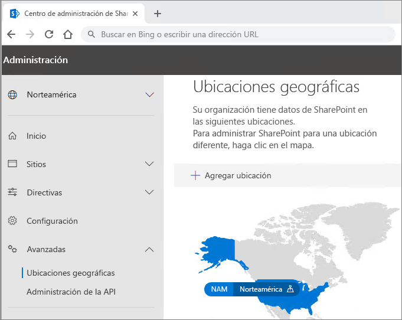

# Configuración de inquilino Multi-Geo de Office 365Office 365 Multi-Geo tenant configuration

Antes de configurar su inquilino de Office 365 Multi-Geo, asegúrese de haber leído [Plan para Office 365 Multi-Geo](plan-for-multi-geo.md).Before you configure your tenant for Office 365 Multi-Geo, be sure you have read [Plan for Office 365 Multi-Geo](plan-for-multi-geo.md). Para seguir los pasos de este artículo, necesitará una lista de las ubicaciones geográficas que quiera habilitar como ubicaciones satélite y los usuarios de la prueba que quiera aprovisionar en esas ubicaciones.To follow the steps in this article, you'll need a list of the geo locations that you want to enable as satellite locations, and the test users that you want to provision for those locations.

## Agregar las capacidades multigeográficas del plan de Office 365 al espacio empresarialAdd the Multi-Geo Capabilities in Office 365 plan to your tenant

Para usar Office 365 Multi-Geo, necesita el plan _Capacidades multigeográficas en Office 365_.To use Office 365 Multi-Geo, you need the _Multi-Geo Capabilities in Office 365_ plan. Trabaje con el equipo de cuentas para agregar este plan a su espacio empresarial.Work with your account team to add this plan to your tenant. Su equipo de cuentas le pondrá en contacto con el especialista en licencias adecuado y configurará el espacio empresarial.Your account team will connect you with the appropriate licensing specialist and get your tenant configured.

Tenga en cuenta que el plan _Multi-Geo Capabilities in Office 365_ (Capacidades multigeográficas de Office 365) es un plan de servicio de nivel de usuario. Necesita una licencia para cada usuario que quiera hospedar en una ubicación por satélite. Puede agregar más licencias a medida que agregue usuarios en las ubicaciones por satélite.Note that the _Multi-Geo Capabilities in Office 365_ plan is a user-level service plan. You need a license for each user that you want to host in a satellite location. You can add more licenses over time as you add users in satellite locations.

Cuando haya aprovisionado el espacio empresarial con el plan _Capacidades multigeográficas en Office 365_, la pestaña **Ubicaciones geográficas** estará disponible en los centros de administración de OneDrive y SharePoint.Once your tenant has been provisioned with the  _Multi-Geo Capabilities in Office 365_ plan, the **Geo locations** tab will become available in the OneDrive and SharePoint admin centers.

## Agregar ubicaciones satélite a su espacio empresarialAdd satellite locations to your tenant

Debe añadir una ubicación satélite para cada ubicación geográfica donde quiere almacenar datos.You must add a satellite location for each geo location where you want to store data. En la tabla siguiente se muestran las ubicaciones geográficas disponibles:Available geo locations are shown in the following table:

[!INCLUDE [Office 365 Multi-Geo locations](includes/office-365-multi-geo-locations.md)]

Para agregar una ubicación de satéliteTo add a satellite location

1. Abra el Centro de administración de SharePoint.Open the SharePoint admin center.

2. Navegue a la pestaña **Geo locations** (Ubicaciones geográficas).Navigate to the **Geo locations** tab.

3. Haga clic en **Agregar ubicación**.Click **Add location**.

4. Seleccione la ubicación que quiere agregar y haga clic en **Siguiente**.Select the location that you want to add, and then click **Next**.

5. Escriba el dominio que quiere usar con la ubicación geográfica y haga clic en **Agregar**.Type the domain that you want to use with the geo location, and then click **Add**.

6. Haga clic en **Cerrar**.Click **Close**.

El aprovisionamiento puede tardar desde unas horas hasta 72 horas, dependiendo del tamaño del espacio empresarial. Una vez completado el aprovisionamiento de una ubicación por satélite, recibirá un correo electrónico de confirmación. Cuando la nueva ubicación geográfica aparezca en azul en el mapa de la pestaña **Ubicaciones geográficas** del Centro de administración de OneDrive, podrá proceder a establecer la ubicación de datos preferida de los usuarios a esa ubicación geográfica.Provisioning may take from a few hours up to 72 hours, depending on the size of your tenant. Once provisioning of a satellite location has completed, you will receive an email confirmation. When the new geo location appears in blue on the map on the **Geo locations** tab in the OneDrive admin center, you can proceed to set users' preferred data location to that geo location. 

> [!IMPORTANT]
> La nueva ubicación por satélite se configurará con la configuración predeterminada. Esto le permitirá configurar esa ubicación por satélite según sus necesidades de cumplimiento local.Your new satellite location will be set up with default settings. This will allow you to configure that satellite location as appropriate for your local compliance needs.

## Establecimiento de la ubicación de datos preferida de los usuariosSetting users' preferred data location
 

Cuando haya habilitado las ubicaciones de satélite necesarias, puede actualizar su cuenta de usuario para que use la ubicación de datos adecuada. Se recomienda establecer una ubicación de datos preferida para cada uno de los usuarios, aunque el usuario permanezca en la ubicación central.Once you enable the needed satellite locations, you can update your user accounts to use the appropriate preferred data location. We recommend that you set a preferred data location for every user, even if that user is staying in the central location.

> [!IMPORTANT]
> Si se establece la ubicación de datos preferida de un usuario a una ubicación que no se ha configurado como una ubicación satélite o la ubicación central, el sistema usará de forma predeterminada la ubicación central para el aprovisionamiento de sitios de SharePoint, de OneDrive y de buzones de grupo.If a user's preferred data location is set to a location that has not been configured as a satellite location or the central location, the system will default to the central location when provisioning OneDrive and SharePoint sites and Group mailboxes.

> [!TIP]
> Se recomienda iniciar las validaciones con un usuario de prueba o un grupo pequeño de usuarios antes de implementar la versión multigeográfica en la organización completa.We recommend that you begin validations with a test user or small group of users before rolling out multi-geo to your broader organization.

En Azure Active Directory hay dos tipos de objetos de usuario: usuarios solo de nube y usuarios sincronizados.In Azure Active Directory there are two types of user objects: cloud only users and synchronized users. Siga las instrucciones adecuadas para el tipo de usuario.Please follow the appropriate instructions for your type of user.

### Sincronizar la ubicación de datos preferida del usuario con Azure Active Directory ConnectSynchronize user's Preferred Data Location using Azure Active Directory Connect 

Si los usuarios de la compañía se sincronizan en un sistema de Active Directory local con Azure Active Directory, el elemento PreferredDataLocation tiene que rellenarse en AD y sincronizarse con AAD. Siga el proceso de [Sincronización de Azure Active Directory Connect: configurar la ubicación de datos preferida de recursos de Office 365](/azure/active-directory/hybrid/how-to-connect-sync-feature-preferreddatalocation) para configurar la sincronización de la ubicación de datos preferida del entorno local de Active Directory en Azure Active Directory.If your company’s users are synchronized from an on-premises Active Directory system to Azure Active Directory, their PreferredDataLocation must be populated in AD and synchronized to AAD. Follow the process in [Azure Active Directory Connect sync: Configure preferred data location for Office 365 resources](/azure/active-directory/hybrid/how-to-connect-sync-feature-preferreddatalocation) to configure Preferred Data Location sync from on-premises Active Directory to Azure Active Directory.

Se recomienda incluir el establecimiento de la ubicación de datos preferida del usuario como parte del flujo de trabajo de creación de usuarios estándar.We recommend that you include setting the user's Preferred Data Location as a part of your standard user creation workflow.

> [!IMPORTANT]
> Para los nuevos usuarios que no tengan aprovisionado OneDrive, espere como mínimo 24 horas tras sincronizar la ubicación de datos preferida (PDL) de un usuario con Azure Active Directory para que los cambios se propaguen antes de que el usuario inicie sesión en OneDrive para la Empresa.For new users with no OneDrive provisioned, wait at least 24 hours after a user's PDL is synchronized to Azure Active Directory for the changes to propagate before the user logs in to OneDrive for Business. (El establecimiento de la PDL antes de que el usuario inicie sesión para aprovisionar OneDrive para la Empresa garantiza que la nueva instancia de OneDrive del usuario se aprovisionará en la ubicación correcta).(Setting the preferred data location before the user logs in to provision their OneDrive for Business ensures that the user's new OneDrive will be provisioned in the correct location.)

### Establecimiento de la ubicación de datos preferida de usuarios solo de nubeSetting Preferred Data Location for cloud only users 

Si los usuarios de la compañía no se sincronizan en un sistema de Active Directory local con Azure Active Directory, lo que indica que se crearon en Office 365 o Azure Active Directory, la PDL debe establecerse con Azure Active Directory PowerShell.If your company's users are not synchronized from an on-premises Active Directory system to Azure Active Directory, meaning they are created in Office 365 or Azure Active Directory, then the PDL must be set using Azure Active Directory PowerShell.

Los procedimientos de esta sección requieren el [Módulo Microsoft Azure Active Directory para Windows PowerShell](https://www.powershellgallery.com/packages/MSOnline/1.1.166.0). Si ya tiene instalado Azure Active Directory PowerShell, asegúrese de actualizarlo a la versión más reciente.The procedures in this section require the [Microsoft Azure Active Directory Module for Windows PowerShell Module](https://www.powershellgallery.com/packages/MSOnline/1.1.166.0). If you already have Azure Active Directory PowerShell installed, please ensure you update to the latest version.

1.  Abra el Módulo Microsoft Azure Active Directory para Windows PowerShell.Open the Microsoft Azure Active Directory Module for Windows PowerShell.

2.  Ejecute `Connect-MsolService` y escriba las credenciales del administrador global del espacio empresarial.Run `Connect-MsolService` and enter the global administrator credentials for your tenant.

3.  Use el cmdlet [Set-MsolUser](https://docs.microsoft.com/powershell/msonline/v1/set-msoluser) para establecer la ubicación de datos preferida de cada uno de los usuarios. Por ejemplo:Use the [Set-MsolUser](https://docs.microsoft.com/powershell/msonline/v1/set-msoluser) cmdlet to set the preferred data location for each of your users. For example:

    `Set-MsolUser -userprincipalName Robyn.Buckley@Contoso.com -PreferredDatalocation EUR`

    Puede comprobar que la ubicación de datos preferida se actualizó correctamente mediante el cmdlet Get-MsolUser. Por ejemplo:You can check to confirm that the preferred data location was updated properly by using the Get-MsolUser cmdlet. For example:

    `(Get-MsolUser -userprincipalName Robyn.Buckley@Contoso.com).PreferredDatalocation`

Se recomienda incluir el establecimiento de la ubicación de datos preferida del usuario como parte del flujo de trabajo de creación de usuarios estándar.We recommend that you include setting the user's Preferred Data Location as a part of your standard user creation workflow.

> [!IMPORTANT]
> Para los nuevos usuarios que no tengan aprovisionado OneDrive, espere como mínimo 24 horas tras establecer la PDL de un usuario para que los cambios se propaguen antes de que el usuario inicie sesión en OneDrive.For new users with no OneDrive provisioned, wait at least 24 hours after a user's PDL is set for the changes to propagate before the user logs in to OneDrive. (El establecimiento de la PDL antes de que el usuario inicie sesión para aprovisionar OneDrive para la Empresa garantiza que la nueva instancia de OneDrive del usuario se aprovisionará en la ubicación correcta).(Setting the preferred data location before the user logs in to provision their OneDrive for Business ensures that the user's new OneDrive will be provisioned in the correct location.)

## Aprovisionamiento de OneDrive y efecto de la PDLOneDrive Provisioning and the effect of PDL

Si el usuario ya ha creado un sitio de OneDrive en el espacio empresarial, el establecimiento de su PDL no trasladará automáticamente su instancia de OneDrive existente.If the user already has a OneDrive site created in the tenant, setting their PDL will not automatically move their existing OneDrive. Para mover la instancia de OneDrive de un usuario, vea [Transferencia geográfica de OneDrive para la Empresa](move-onedrive-between-geo-locations.md) y siga las instrucciones para mover OneDrive de una ubicación geográfica a otra.To move a user's OneDrive, see [OneDrive for Business Geo Move](move-onedrive-between-geo-locations.md) please follow the instructions in Moving OneDrive between geo locations. (Tenga en cuenta que el buzón de Exchange del usuario se mueve automáticamente al establecer la PDL del usuario)(Note that the user's Exchange mailbox does move automatically when you set the user's PDL.)

Si el usuario no tiene un sitio de OneDrive en el espacio empresarial, se le aprovisionará OneDrive de acuerdo con el valor de PDL, suponiendo que la PDL del usuario coincida con una de las ubicaciones satélite de la empresa.If the user does not have a OneDrive site within the tenant, OneDrive will be provisioned for them in accordance to their PDL value, assuming the PDL for the user matches one of the company's satellite locations.

## Configuración de la búsqueda multigeográficaConfiguring Multi-Geo search

El espacio empresarial multigeográfico tendrá funcionalidades de búsqueda agregada, lo que permite devolver resultados desde cualquier lugar en el espacio empresarial.Your multi-geo tenant will have aggregate search capabilities allowing a search query to return results from anywhere within the tenant.

De forma predeterminada, las búsquedas en estos puntos de entrada devolverán resultados agregados, aunque cada índice de búsqueda se encuentre en la ubicación geográfica correspondiente:By default, searches from these entry points will return aggregate results, even though each search index is located within its relevant geo location:

- OneDrive para la EmpresaOneDrive for business

- DelveDelve

- Página principal de SharePointSharePoint Home

- Centro de búsquedaSearch Center

Además, pueden configurarse funcionalidades de búsqueda multigeográficas para las aplicaciones de búsqueda personalizada que usan la API de SharePoint Search.Additionally, multi-geo search capabilities can be configured for your custom search applications that use the SharePoint search API.

Revise [Configurar la búsqueda en OneDrive para la Empresa multigeográfico](configure-search-for-multi-geo.md) para obtener instrucciones, incluidas las limitaciones y diferencias.Please review [Configure Search for OneDrive for Business Multi-Geo](configure-search-for-multi-geo.md) for instructions including any limitations and differences.

## Validar la configuración de Office 365 Multi-GeoValidating the Office 365 Multi-Geo configuration

A continuación se muestran algunos casos de uso básicos que tal vez quiera incluir en el plan de validación antes implementar Office 365 Multi-Geo de manera general en la compañía.Below are some basic use cases you may wish to include in your validation plan before broadly rolling out Office 365 Multi-Geo to your company. Después de completar estas pruebas y los casos de uso adicionales que sean relevantes para su compañía, puede continuar y agregar los usuarios al grupo piloto inicial.Once you have completed these tests and any additional use cases that are relevant to your company, you may choose to move on to adding the users in your initial pilot group.

**OneDrive para la Empresa****OneDrive for Business**

Seleccione OneDrive desde el iniciador de aplicaciones de Office 365 y confirme que le dirige automáticamente a la ubicación geográfica apropiada del usuario, en función de la PDL del usuario.Select OneDrive from the Office 365 app launcher and confirm that you are automatically directed to the appropriate geo location for the user, based on the user's PDL. OneDrive para la Empresa debería ahora comenzar el aprovisionamiento en esa ubicación.OneDrive for Business should now begin provisioning at that location. Una vez aprovisionado, pruebe a cargar y descargar algunos documentos.Once provisioned, try uploading and downloading some documents.

**Aplicación móvil de OneDrive****OneDrive Mobile App**

Inicie sesión en la aplicación móvil de OneDrive con sus credenciales de cuenta de evaluación. Confirme que puede ver sus archivos de OneDrive para la Empresa y puede interactuar con ellos desde su dispositivo móvil.Log into your OneDrive mobile App with your test account credentials. Confirm that you can see your OneDrive for business files and can interact with them from your mobile device.

**Cliente de sincronización de OneDrive****OneDrive sync client**

Confirme que el cliente de sincronización de OneDrive detecta automáticamente la ubicación geográfica de OneDrive para la Empresa al iniciar sesión. Si quiere descargar el cliente de sincronización, puede hacer clic en **Sincronización** en la biblioteca de OneDrive.Confirm that the OneDrive sync client automatically detects your OneDrive for Business geo location upon login. If you need to download the sync client, you can click **Sync** in the OneDrive library.

**Aplicaciones de Office****Office applications**

Para confirmar que tiene acceso a OneDrive para la Empresa, inicie sesión desde una aplicación de Office como Word. Abra la aplicación de Office y seleccione "OneDrive – <TenantName>". Office detectará la ubicación de OneDrive y mostrará los archivos que se pueden abrir.Confirm that you can access OneDrive for Business by logging in from an Office application, such as Word. Open the Office application and select "OneDrive – <TenantName>". Office will detect your OneDrive location and show you the files that you can open.

**Uso compartido****Sharing**

Pruebe el uso compartido de archivos de OneDrive. Confirme que el selector de personas muestra todos los usuarios de SharePoint Online independientemente de su ubicación geográfica.Try sharing OneDrive files. Confirm that the people picker shows you all your SharePoint online users regardless of their geo location.
