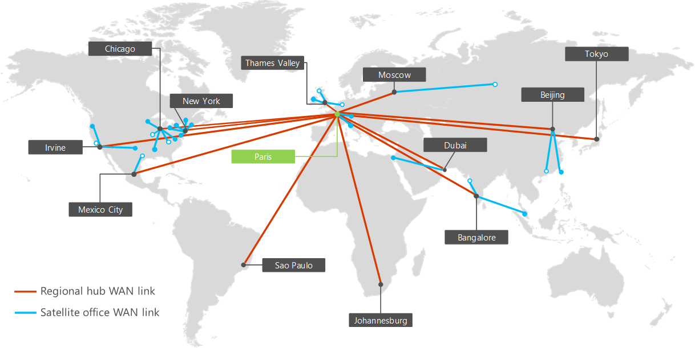
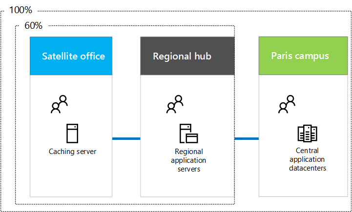
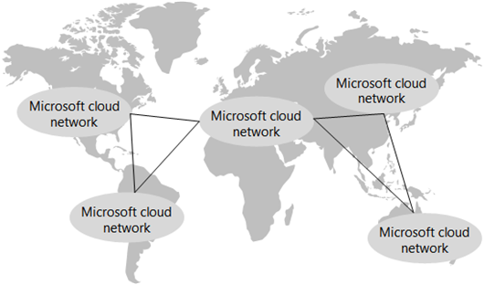

# Redes para Contoso Corporation

 **Resumen:** Comprenda la definición y los elementos de la nube híbrida de Microsoft.
  
Para adoptar una infraestructura cloud inclusive, ingenieros de red de Contoso se dio cuenta el cambio fundamental en el modo en que el tráfico de red a los recorridos de servicios basados en cloud. En lugar de sólo optimiza el tráfico a servidores locales y los centros de datos, debe prestarse atención igual a optimizar el tráfico en el perímetro de Internet y a través de Internet.
  
## Infraestructura de red de Contoso

Contoso tiene la infraestructura de red que se muestra en la figura 1.
  
**Figura 1: Infraestructura WAN de Contoso**

  
La figura 1 muestra las oficinas de Contoso en todo el mundo y el conjunto de vínculos WAN de oficinas regionales y satélite entre ellos.
  
Los elementos adicionales de la red son los siguientes:
  
- Red local
    
    Vínculos WAN conectan la sede de París para oficinas regionales y las oficinas regionales a oficinas satélite en una configuración de concentrador y radios. Dentro de cada oficina, enrutadores entregar tráfico a los hosts o los puntos de acceso inalámbrico en subredes, que utilizan el espacio de direcciones IP privado.
    
- Conectividad a Internet
    
    Cada oficina tiene su propia conexión a Internet mediante un servidor proxy. Esto normalmente se implementa como una WAN enlace a un ISP local que también proporciona direcciones IP públicas del servidor proxy.
    
- Presencia en Internet
    
    Contoso posee el nombre de dominio público de contoso.com. El sitio web público de Contoso para pedir productos es un conjunto de servidores en un centro de datos conectados a Internet en el campus de París. Contoso utiliza un /24 intervalo de direcciones IP pública en Internet.
    
## Infraestructura de app de Contoso

Contoso ha diseñado su infraestructura de servidores y aplicaciones para lo siguiente:
  
**Figura 2: Infraestructura de Contoso para aplicaciones internas**

  
- Las oficinas satélite usan servidores de almacenamiento en caché locales para almacenar documentos y sitios web internos a los que se accede frecuentemente.
    
- Concentradores regionales utilizar servidores de aplicación regional para la configuración regional y oficinas satélite. Estos servidores se sincronización con los servidores en las sedes de París.
    
- Las instalaciones de París tienen los centros de datos que contienen los servidores de aplicaciones centralizados que sirven a toda la organización.
    
Para los usuarios de oficinas de centros regionales o satélite, el 60 % de los recursos que necesitan los empleados pueden obtenerse de los servidores de oficinas de concentradores regionales o satélite. El 40 % adicional de solicitudes de recursos debe realizarse a través del vínculo WAN a las instalaciones de París.
  
## Análisis de red de Contoso

Éstos son los resultados de los análisis de Contoso de los cambios necesarios en su red para adaptarse a las diferentes categorías de ofertas de nube de Microsoft:
  
|**Las ofertas de nube de SaaS: Office 365, EMS y Dynamics 365**|**PaaS Azure: Aplicaciones móviles**|**Azure IaaS: Las cargas de trabajo basado en servidor**|
|:-----|:-----|:-----|
|Una adopción satisfactoria de servicios SaaS por parte de los usuarios depende de alta disponibilidad y rendimiento conectividad a Internet, o directamente a los servicios de nube de Microsoft.    Para usuarios móviles, se supone que su acceso a la Internet actual sea adecuada.    Para los usuarios de la intranet de Contoso, cada oficina debe ser analizada y optimizada para el rendimiento de Internet y tiempos de ida y vuelta al centro de datos de Microsoft Europa aloja a los inquilinos de Office 365, EMS y Dynamics 365.    |Para ofrecer mejor soporte a los empleados móviles, las aplicaciones heredadas y algunos sitios de uso compartido de archivos se están remodelando e implementando como aplicaciones PaaS de Azure. Para un rendimiento óptimo, Contoso planea implementar las nuevas aplicaciones desde varios centros de datos de Azure en todo el mundo. Azure Traffic Manager para enviar solicitudes de aplicaciones cliente, provengan de un usuario móvil o de en un equipo en la oficina, al centro de datos de Azure más cercano que hospede la aplicación.     El departamento de TI deberá agregar PaaS performance de las aplicaciones y la distribución de tráfico a su solución de supervisión de estado de red.   |Para mover algunos servidores heredados y archiving fuera de los centros de datos del campus de París y agregar servidores según sea necesario para el procesamiento de fin de trimestre, Contoso planea utilizar máquinas virtuales que se ejecutan en servicios de infraestructura de Azure.    Las redes virtuales de Azure que contienen estos servidores deben diseñarse para los espacios de direcciones no se superponen, DNS enrutamiento e integrado.    El departamento de TI debe incluir estos nuevos servidores en su sistema de administración y supervisión de la red.    |
   
## Uso de Contoso de ExpressRoute

ExpressRoute es una conexión WAN dedicada desde su ubicación en una ubicación de interconexión de Microsoft que se conecta a la red a la red de la nube de Microsoft. Las conexiones de ExpressRoute proporcionan performance predecible y un tiempo de actividad del 99,9% SLA. .
  
Con una conexión ExpressRoute, está conectado a la red de la nube de Microsoft y todas las ubicaciones de centros de datos de Microsoft en el mismo continente. El tráfico entre la ubicación de interconexión de la nube y el centro de datos de Microsoft de destino se realiza a través de la red de la nube de Microsoft
  
**Figura 3: La nube red de Microsoft en todo el mundo**

  
La figura 3 muestra la red en la nube de Microsoft interconectada para las distintas regiones del mundo.
  
Con ExpressRoute Premium, puede llegar a cualquier centro de datos de Microsoft de cualquier continente y desde cualquier ubicación de emparejamiento de Microsoft de cualquier continente. El tráfico entre continentes se transmite a través de la red en la nube de Microsoft.
  
Basándose en el análisis de tráfico actual y futuro a las ofertas de nube de Microsoft, Contoso ha realizado una evaluación de la red e implementado una a cualquier conexión ExpressRoute (basadas en MPLS) para obtener acceso a recursos de Azure, con interconexión privada y pública relaciones de la sede de París para la ubicación de interconexión de Microsoft en Europa.
  
Esta conexión le dará de al departamento de TI de Contoso:
  
- Rendimiento coherente para la administración de aplicaciones PaaS de Azure distribuidas
    
    Todos de los desarrolladores de aplicaciones y de infraestructura central de Contoso administradores están en el campus de París. Con aplicaciones de Azure PaaS distribuidas a centros de datos distintos de Azure todo el mundo, Contoso necesita performance consistente en el campus de París para administrar las aplicaciones y sus recursos de almacenamiento de información, que consisten en TB de documentos.
    
- Rendimiento constante para la administración de servidores en IaaS de Azure
    
    Los administradores de centros de datos de Contoso están en el campus de París y los servidores que se desplegarán en Azure son una extensión del centro de datos de París. Contoso necesita performance consistente a estos nuevos servidores para tener acceso a aplicaciones heredadas y almacenamiento para archiving y procesamiento de fin de trimestre.
    
## Ruta de acceso de Contoso en la preparación de redes de nube

Contoso usa los pasos siguientes para preparar su red para la nube de Microsoft:
  
1. Optimizar los equipos de los empleados para el acceso a Internet
    
    Se comprobarán los equipos individuales para garantizar que la pila de TCP/IP más reciente, el explorador, los controladores NIC y las actualizaciones de seguridad y del sistema operativo estén instalados.
    
2. Analizar el uso de la conexión a Internet en cada oficina y aumentarlo según sea necesario
    
    Se analizará cada oficina para el uso actual de Internet y ancho de banda del vínculo WAN aumentará si funciona el 70% o mayor utilización.
    
3. Analizar sistemas DMZ en cada oficina para un rendimiento óptimo
    
    Se analizarán los firewall, los ID y otros sistemas de la ruta de acceso de Internet para conseguir un rendimiento óptimo. Los servidores proxy se actualizarán según sea necesario.
    
4. Agregar ExpressRoute para las instalaciones de París
    
    Proporciona acceso coherente a los recursos de Azure para la administración de cargas de trabajo Azure PaaS e IaaS.
    
5. Crear y probar un perfil de Azure Traffic Manager para aplicaciones PaaS de Azure
    
    Probar un perfil de Azure Traffic Manager que use el método de enrutamiento del rendimiento para obtener experiencia en la distribución de tráfico de Internet a ubicaciones regionales.
    
6. Reservar espacio de direcciones privadas para VNets de Azure
    
    Según el número de servidores proyectados a corto y largo plazo en IaaS de Azure, reserva el espacio de direcciones privadas para las redes virtuales de Azure y sus subredes.
    
## See Also

[Contoso en la nube de Microsoft](contoso-in-the-microsoft-cloud.md)
  
[Recursos de arquitectura de TI de la nube de Microsoft](microsoft-cloud-it-architecture-resources.md)

[Mapa de ruta de Enterprise Cloud de Microsoft: Recursos para los responsables de decisiones de TI](https://sway.com/FJ2xsyWtkJc2taRD)

