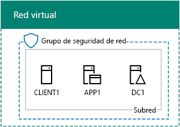
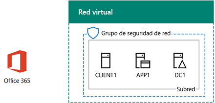

# <a name="office-365-devtest-environment"></a>Entorno de desarrollo y pruebas de Office 365

 **Resumen:** Utilice a esta guía de laboratorio de prueba para crear una suscripción de prueba de Office 365 para pruebas y desarrollo o de evaluación.
  
Puede usar una suscripción de prueba de Office 365 y crear un entorno de desarrollo y pruebas de Office 365 para las aplicaciones o para demostrar las características y funcionalidades de Office 365. Existen dos versiones:
  
- El entorno de desarrollo y pruebas ligero de Office 365 consiste en una suscripción de prueba de Office 365 a la que puede tener acceso desde su equipo principal.
    
    Use este entorno cuando quiera demostrar rápidamente una característica. Para el entorno de desarrollo y pruebas ligero de Office 365, complete las fases 2 y 3 de este artículo.
    
- El entorno de desarrollo y pruebas de una empresa simulada de Office 365 consiste en una suscripción de prueba a Office 365 y una intranet simplificada de una organización conectada a Internet, que se hospeda en los servicios de infraestructura de Microsoft Azure. Puede crear esta configuración completamente en la nube de Microsoft.
    
    Use este entorno cuando quiera demostrar una característica o una aplicación en un entorno que parece una red típica de la organización conectada a Internet, o para las características que requieran este tipo de entorno. Para el entorno de desarrollo y pruebas de una empresa simulada de Office 365, complete las fases 1, 2 y 3 de este artículo.
    
> [!NOTE]
> Es posible que quiera imprimir este artículo para anotar los valores específicos que necesite para usar este entorno durante los 30 días de la suscripción de prueba a Office 365. Puede extender fácilmente la suscripción de prueba otros 30 días. Para un entorno de pruebas y desarrollo permanente, cree una nueva suscripción de pago con un número reducido de licencias. 
  

  
> [!TIP]
> Haga clic [aquí](http://aka.ms/catlgstack) para ver un mapa visual para todos los artículos de la pila de una guía de laboratorio de prueba de nube de Microsoft.
  
## <a name="phase-1-create-the-base-configuration-in-azure"></a>Fase 1: Crear la configuración básica de Azure

Siga las instrucciones en el [entorno de desarrollo y prueba de configuración de Base](base-configuration-dev-test-environment.md).
  
Se necesita una suscripción de Azure. Puede utilizar la [Versión de prueba gratuita de Azure](https://azure.microsoft.com/pricing/free-trial/) para esta configuración. Si tiene una suscripción a MSDN o Visual Studio, vea [crédito Azure mensual para los suscriptores de Visual Studio](https://azure.microsoft.com/pricing/member-offers/msdn-benefits-details/).
  
Esta es la configuración resultante.
  

  
Esta configuración básica se compone de las máquinas virtuales DC1, APP1 y CLIENTE1 en una subred de una red virtual de Azure.
  
## <a name="phase-2-create-an-office-365-trial-subscription"></a>Fase 2: Crear una suscripción de prueba a Office 365

Para iniciar la suscripción de prueba a Office 365 E5, primero necesita el nombre de una compañía ficticia y una nueva cuenta de Microsoft.
  
1. Se recomienda que utilice una variante del nombre de la compañía Contoso para el nombre de su compañía, que es una empresa ficticia utilizada en contenido de ejemplo de Microsoft, pero no es imprescindible. Registrar el nombre de su compañía ficticia: ___.
    
2. Para obtener una nueva cuenta de Microsoft, vaya a [https://outlook.com](https://outlook.com) y cree una cuenta con una nueva cuenta de correo electrónico y la dirección. Utilizará esta cuenta para suscribirse a Office 365.
    
  - Registrar el nombre y apellidos de su nueva cuenta: ___.
    
  - Anote aquí la dirección de la nueva cuenta de correo: _____________________________@outlook.com
    
### <a name="sign-up-for-an-office-365-e5-trial-subscription"></a>Registrarse para una suscripción de prueba a Office 365 E5

1. Para el entorno de desarrollo y prueba ligero de Office 365, abra el Explorador de Internet en el equipo y vaya a [https://aka.ms/e5trial](https://aka.ms/e5trial). 
    
    Para el entorno de desarrollo/pruebas simuladas enterprise Office 365:
    
  - Desde el [portal de Azure](https://portal.azure.com), conéctese a CLIENTE1 con el CORP\\cuenta de Usuario1.
    
  - Abra un símbolo del sistema de Windows PowerShell con el nivel de administrador y ejecute estos comandos:
    
  ```
  Set-ItemProperty -Path "HKLM:\\SOFTWARE\\Microsoft\\Active Setup\\Installed Components\\{A509B1A7-37EF-4b3f-8CFC-4F3A74704073}" -Name "IsInstalled" -Value 0
Set-ItemProperty -Path "HKLM:\\SOFTWARE\\Microsoft\\Active Setup\\Installed Components\\{A509B1A8-37EF-4b3f-8CFC-4F3A74704073}" -Name "IsInstalled" -Value 0
Stop-Process -Name Explorer -Force
  ```

    > [!TIP]
    > Haga clic [aquí](https://gallery.technet.microsoft.com/PowerShell-commands-for-fe3d7a34) para obtener un archivo de texto que contiene todos los comandos de PowerShell en este artículo.
  
  - Desde la pantalla de inicio, haga clic en **Internet Explorer** y vaya a [https://aka.ms/e5trial](https://aka.ms/e5trial).
    
2. En la página de **bienvenida, pongámonos manos a conocerlo** , especifique:
    
  - Su ubicación física
    
  - El nombre y apellidos de la nueva cuenta de Microsoft
    
  - La dirección de la nueva cuenta de correo
    
  - El número de teléfono del trabajo
    
  - El nombre de la compañía ficticia
    
  - El tamaño de la organización (250 a 999 personas)
    
3. Haga clic en **sólo uno más que el paso**.
    
4. En la página **crear su ID de usuario** , escriba un nombre de usuario basado en su nueva dirección de correo electrónico, su empresa ficticia después del signo @ (quitar todos los espacios en el nombre), y una contraseña (dos veces) para este nuevo Office 365 cuenta.
    
    Anote en un lugar seguro la contraseña que ha escrito.
    
    Registre el nombre de su compañía ficticia, que se conoce como el **nombre de la organización**, aquí: ___.
    
5. Haga clic en **Crear mi cuenta**.
    
6. En la **probar. Eres. No. R. robot.** página, escriba el número de teléfono de su teléfono compatible con texto y, a continuación, haga clic en **texto**.
    
7. Escriba el código de verificación del mensaje de texto recibido y, a continuación, haga clic en **siguiente**.
    
8. Registrar la página de inicio de sesión URL aquí (seleccionar y copiar): ___.
    
9. Anote aquí el id. de usuario (seleccionar y copiar): __________________________________.onmicrosoft.com
    
    Este valor se denomina el **nombre de administrador global de Office 365**.
    
10. Cuando vea **está listo para ir**, haga clic en él.
    
11. En la siguiente página, espere hasta que Office 365 completa configuración de seguridad y todas las fichas están disponibles.
    
Verá la página principal del portal de Office 365, desde donde puede obtener acceso a servicios de Office Online y al Centro de administración de Office 365.
  
Para el entorno de desarrollo y pruebas de una empresa simulada de Office 365, aquí se muestra la configuración resultante.
  

  
Esta configuración se compone de:  
  
- Las máquinas virtuales DC1, APP1 y CLIENTE1 en una subred de una red virtual de Azure.
    
- Una suscripción de prueba a Office 365 E5.
    
## <a name="phase-3-configure-your-office-365-trial-subscription"></a>Fase 3: Configurar la suscripción de prueba de Office 365

En esta fase, se configura la suscripción a Office 365 con usuarios adicionales y sitios de equipo de SharePoint Online.
  
En primer lugar, agregue cuatro nuevos usuarios y asígneles licencias de E5.
  
Siga las instrucciones de [conectarse a Office 365 PowerShell](https://technet.microsoft.com/library/dn975125.aspx) para instalar los módulos de PowerShell y conectarse a la nueva suscripción de Office 365 desde:
  
- Su equipo (para el entorno de desarrollo y pruebas ligero de Office 365).
    
- La máquina virtual CLIENT1 (para el entorno de desarrollo y pruebas de una empresa simulada de Office 365).
    
 En el cuadro de diálogo solicitud de credencial de Windows PowerShell, escriba el nombre de administrador global de Office 365 (ejemplo: jdoe@contosotoycompany.onmicrosoft.com) y la contraseña.
  
Rellene el nombre de la organización (ejemplo: contosotoycompany), el código de país de dos caracteres para su ubicación y, después, ejecute los comandos siguientes desde el símbolo del sistema de Módulo Microsoft Azure Active Directory para Windows PowerShell:
  
```
$orgName="<organization name>"
$loc="<two-character country code, such as US>"
$licAssignment= $orgName + ":ENTERPRISEPREMIUM"
$userName= "user2@" + $orgName + ".onmicrosoft.com"
New-MsolUser -DisplayName "User 2" -FirstName User -LastName 2 -UserPrincipalName $userName -UsageLocation $loc -LicenseAssignment $licAssignment
```

En la pantalla del comando **MsolUser de nuevo** , tenga en cuenta la contraseña generada para la cuenta de usuario 2 y grabarlo en un lugar seguro.
  
Ejecute los siguientes comandos desde el símbolo del sistema del Módulo de Windows Azure Active Directory para Windows PowerShell:
  
```
$userName= "user3@" + $orgName + ".onmicrosoft.com"
New-MsolUser -DisplayName "User 3" -FirstName User -LastName 3 -UserPrincipalName $userName -UsageLocation $loc -LicenseAssignment $licAssignment
```

En la pantalla del comando **MsolUser de nuevo** , tenga en cuenta la contraseña generada para la cuenta de usuario 3 y grabarlo en un lugar seguro.
  
Ejecute los siguientes comandos desde el símbolo del sistema del Módulo de Windows Azure Active Directory para Windows PowerShell:
  
```
$userName= "user4@" + $orgName + ".onmicrosoft.com"
New-MsolUser -DisplayName "User 4" -FirstName User -LastName 4 -UserPrincipalName $userName -UsageLocation $loc -LicenseAssignment $licAssignment
```

En la pantalla del comando **MsolUser de nuevo** , tenga en cuenta la contraseña generada para la cuenta de usuario 4 y grabarlo en un lugar seguro.
  
Ejecute los siguientes comandos desde el símbolo del sistema del Módulo de Windows Azure Active Directory para Windows PowerShell:
  
```
$userName= "user5@" + $orgName + ".onmicrosoft.com"
New-MsolUser -DisplayName "User 5" -FirstName User -LastName 5 -UserPrincipalName $userName -UsageLocation $loc -LicenseAssignment $licAssignment
```

En la pantalla del comando **MsolUser de nuevo** , tenga en cuenta la contraseña generada para la cuenta de usuario 5 y grabarlo en un lugar seguro.
  
Después, cree tres nuevos sitios de equipo de SharePoint Online para los departamentos de Ventas, Producción y Soporte técnico.
  
### <a name="create-three-new-sharepoint-online-team-sites"></a>Crear tres nuevos sitios de equipo de SharePoint Online

1. Instalar el [Shell de administración de SharePoint Online](https://go.microsoft.com/fwlink/p/?LinkId=255251) (la x64 versión).
    
2. Haga clic en **Inicio**, escriba **sharepoint**y, a continuación, haga clic en **Shell de administración de SharePoint Online**.
    
3. Rellene el nombre de su organización (ejemplo: contosotoycompany) y después ejecute los comandos siguientes desde el símbolo del sistema del Shell de administración de SharePoint Online para conectar con el servicio de SharePoint Online
```
$orgName="<organization name>"
$spURL="https://" + $orgName + "-admin.sharepoint.com"
Connect-SPOService -Url $spURL
```

4. En el cuadro de diálogo de **Shell de administración de Microsoft SharePoint Online** , escriba el nombre de administrador global de Office 365 (ejemplo: jdoe@contosotoycompany.onmicrosoft.com) y la contraseña y, a continuación, haga clic en **iniciar sesión**.
    
5. Para crear tres nuevos sitios de equipo (ventas, producción y soporte), rellene el nombre de administrador global de Office 365 y, a continuación, ejecutan los siguientes comandos desde el símbolo del sistema del Shell de administración de SharePoint Online:
    
  ```
  $owner = "<global administrator account name>"
$siteURL = "https://" + $orgName + ".sharepoint.com/sites/sales"
New-SPOSite -Url $siteURL -Owner $owner -StorageQuota 1000 -Title "Sales site collection" -Template "STS#0"
$siteURL = "https://" + $orgName + ".sharepoint.com/sites/production"
New-SPOSite -Url $siteURL -Owner $owner -StorageQuota 1000 -Title "Production site collection" -Template "STS#0"
$siteURL = "https://" + $orgName + ".sharepoint.com/sites/support"
New-SPOSite -Url $siteURL -Owner $owner -StorageQuota 1000 -Title "Support site collection" -Template "STS#0"
  ```

6. Ejecute este comando para enumerar las direcciones URL de estos sitios nuevos:
    
  ```
  Get-SPOSite | Where URL -like "*/sites/*" | Sort URL | Select URL
  ```

7. En Internet Explorer, escriba la dirección URL del sitio de Producción para ver el sitio de grupo predeterminado de SharePoint Online para el departamento de Producción.
    
## <a name="record-values-for-future-reference"></a>Anote los valores para futuras referencias

Anote estos valores para trabajar con o implementar guías del laboratorio de pruebas adicionales en este entorno de pruebas:
  
- Nombre del administrador global de Office 365: ____________________________________.onmicrosoft.com (del paso 9 de la fase 2)
    
    Guarde también la contraseña de esta cuenta en una ubicación segura.
    
- Nombre de la organización de la suscripción de prueba: _______________________________________________ (del paso 4 de la fase 2)
    
- Para mostrar las cuentas de los usuarios 2, 3, 4 y 5, ejecute los siguientes comandos desde el símbolo del sistema del Módulo de Windows Azure Active Directory para Windows PowerShell.
    
  ```
  Get-MSolUser | Sort UserPrincipalName | Select UserPrincipalName
  ```

    Anote aquí los nombres de las cuentas:
    
  - Nombre de la cuenta de usuario 2: usuario2@_______________________________________________.onmicrosoft.com
    
  - Nombre de la cuenta de usuario 3: usuario3@_______________________________________________.onmicrosoft.com
    
  - Nombre de la cuenta de usuario 4: usuario4@_______________________________________________.onmicrosoft.com
    
  - Nombre de la cuenta de usuario 5: usuario5@_______________________________________________.onmicrosoft.com
    
    Guarde también las contraseñas de estas cuentas en una ubicación segura.
    
- Para mostrar las direcciones URL de los sitios de equipo Ventas, Producción y Soporte técnico, ejecute el comando siguiente desde el símbolo del sistema del Shell de administración de SharePoint Online:
    
  ```
  Get-SPOSite | Where URL -like "*/sites/*" | Sort URL | Select URL
  ```

  - Dirección URL del sitio de producción:https://______________________________________________.sharepoint.com/sites/production
    
  - Dirección URL del sitio de ventas:https://______________________________________________.sharepoint.com/sites/sales
    
  - Dirección URL del sitio de soporte técnico:https://______________________________________________.sharepoint.com/sites/support
    
## <a name="next-steps"></a>Pasos siguientes

Use estos artículos adicionales en el entorno de desarrollo y pruebas de Office 365:
  
- [Sincronización de directorios para el entorno de desarrollo y prueba de Office 365](dirsync-for-your-office-365-dev-test-environment.md)
    
- [Autenticación con varios factores para el entorno de desarrollo y prueba de Office 365](multi-factor-authentication-for-your-office-365-dev-test-environment.md)
    
- [Identidad federada para el entorno de desarrollo y pruebas de Office 365](federated-identity-for-your-office-365-dev-test-environment.md)
    
- [Seguridad de la aplicación de nube para su entorno de pruebas y desarrollo de Office 365](cloud-app-security-for-your-office-365-dev-test-environment.md)
    
- [Una protección avanzada para su entorno de pruebas y desarrollo de Office 365](advanced-threat-protection-for-your-office-365-dev-test-environment.md)
    
- [EDiscovery avanzada para su entorno de pruebas y desarrollo de Office 365](advanced-ediscovery-for-your-office-365-dev-test-environment.md)
    
- [Protección de archivos confidenciales en el entorno de desarrollo y prueba de Office 365](sensitive-file-protection-in-the-office-365-dev-test-environment.md)
    
- [Entorno de pruebas y desarrollo de SharePoint Online team sitio aislado](isolated-sharepoint-online-team-site-dev-test-environment.md)
    
- [Clasificación de datos y el etiquetado en el entorno de desarrollo y prueba de Office 365](data-classification-and-labeling-in-the-office-365-dev-test-environment.md)
    
Extienda el entorno de desarrollo y pruebas de Office 365 para incluir ofertas adicionales en la nube de Microsoft:
  
- [El entorno de pruebas y desarrollo empresarial de Microsoft 365](the-microsoft-365-enterprise-dev-test-environment.md)
    
- [Entorno de desarrollo y pruebas de Office 365 y Dynamics 365](office-365-and-dynamics-365-dev-test-environment.md)
    
## <a name="see-also"></a>Consulte también

[Guías de entorno de pruebas de adopción de la nube (TLG)](cloud-adoption-test-lab-guides-tlgs.md)
  
[Entorno de desarrollo y pruebas de Office 365 y Dynamics 365](office-365-and-dynamics-365-dev-test-environment.md)
  
[Adopción de la nube y soluciones híbridas](cloud-adoption-and-hybrid-solutions.md)


