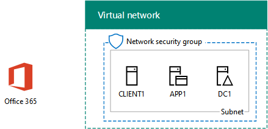

# <a name="office-365-devtest-environment"></a><span data-ttu-id="57106-103">Entorno de desarrollo y pruebas de Office 365</span><span class="sxs-lookup"><span data-stu-id="57106-103">Office 365 dev/test environment</span></span>

 <span data-ttu-id="57106-104">**Resumen:** Utilice a esta guía de laboratorio de prueba para crear una suscripción de prueba de Office 365 para pruebas y desarrollo o de evaluación.</span><span class="sxs-lookup"><span data-stu-id="57106-104">**Summary:** Use this Test Lab Guide to create an Office 365 trial subscription for evaluation or dev/test.</span></span>
  
<span data-ttu-id="57106-p101">Puede usar una suscripción de prueba de Office 365 y crear un entorno de desarrollo y pruebas de Office 365 para las aplicaciones o para demostrar las características y funcionalidades de Office 365. Existen dos versiones:</span><span class="sxs-lookup"><span data-stu-id="57106-p101">You can use an Office 365 trial subscription and create an Office 365 dev/test environment for applications or to demonstrate features and capabilities of Office 365. There are two versions:</span></span>
  
- <span data-ttu-id="57106-107">El entorno de desarrollo y pruebas ligero de Office 365 consiste en una suscripción de prueba de Office 365 a la que puede tener acceso desde su equipo principal.</span><span class="sxs-lookup"><span data-stu-id="57106-107">The lightweight Office 365 dev/test environment consists of an Office 365 trial subscription that you access from your main computer.</span></span>
    
    <span data-ttu-id="57106-p102">Use este entorno cuando quiera demostrar rápidamente una característica. Para el entorno de desarrollo y pruebas ligero de Office 365, complete las fases 2 y 3 de este artículo.</span><span class="sxs-lookup"><span data-stu-id="57106-p102">Use this environment when you want to quickly demonstrate a feature. For the lightweight Office 365 dev/test environment, complete phases 2 and 3 of this article.</span></span>
    
- <span data-ttu-id="57106-p103">El entorno de desarrollo y pruebas de una empresa simulada de Office 365 consiste en una suscripción de prueba a Office 365 y una intranet simplificada de una organización conectada a Internet, que se hospeda en los servicios de infraestructura de Microsoft Azure. Puede crear esta configuración completamente en la nube de Microsoft.</span><span class="sxs-lookup"><span data-stu-id="57106-p103">The simulated enterprise Office 365 dev/test environment consists of an Office 365 trial subscription and a simplified organization intranet connected to the Internet, which is hosted in Microsoft Azure infrastructure services. You can build this configuration completely in the Microsoft cloud.</span></span>
    
    <span data-ttu-id="57106-p104">Use este entorno cuando quiera demostrar una característica o una aplicación en un entorno que parece una red típica de la organización conectada a Internet, o para las características que requieran este tipo de entorno. Para el entorno de desarrollo y pruebas de una empresa simulada de Office 365, complete las fases 1, 2 y 3 de este artículo.</span><span class="sxs-lookup"><span data-stu-id="57106-p104">Use this environment when you want to demonstrate a feature or an app in an environment that resembles a typical organization network connected to the Internet, or for features that require this type of environment. For the simulated enterprise Office 365 dev/test environment, complete phases 1, 2, and 3 of this article.</span></span>
    
> [!NOTE]
> <span data-ttu-id="57106-p105">Es posible que quiera imprimir este artículo para anotar los valores específicos que necesite para usar este entorno durante los 30 días de la suscripción de prueba a Office 365. Puede extender fácilmente la suscripción de prueba otros 30 días. Para un entorno de pruebas y desarrollo permanente, cree una nueva suscripción de pago con un número reducido de licencias.</span><span class="sxs-lookup"><span data-stu-id="57106-p105">You might want to print this article to record the specific values that you will need for this environment over the 30 days of the Office 365 trial subscription. You can easily extend the trail subscription for another 30 days. For a permanent dev/test environment, create a new paid subscription with a small number of licenses.</span></span> 
  

  
> [!TIP]
> <span data-ttu-id="57106-118">Haga clic [aquí](http://aka.ms/catlgstack) para ver un mapa visual para todos los artículos de la pila de una guía de laboratorio de prueba de nube de Microsoft.</span><span class="sxs-lookup"><span data-stu-id="57106-118">Click [here](http://aka.ms/catlgstack) for a visual map to all the articles in the One Microsoft Cloud Test Lab Guide stack.</span></span>
  
## <a name="phase-1-create-the-base-configuration-in-azure"></a><span data-ttu-id="57106-119">Fase 1: Crear la configuración básica de Azure</span><span class="sxs-lookup"><span data-stu-id="57106-119">Phase 1: Create the base configuration in Azure</span></span>

<span data-ttu-id="57106-120">Siga las instrucciones en el [entorno de desarrollo y prueba de configuración de Base](base-configuration-dev-test-environment.md).</span><span class="sxs-lookup"><span data-stu-id="57106-120">Follow the instructions in [Base Configuration dev/test environment](base-configuration-dev-test-environment.md).</span></span>
  
<span data-ttu-id="57106-p106">Se necesita una suscripción de Azure. Puede utilizar la [Versión de prueba gratuita de Azure](https://azure.microsoft.com/pricing/free-trial/) para esta configuración. Si tiene una suscripción a MSDN o Visual Studio, vea [crédito Azure mensual para los suscriptores de Visual Studio](https://azure.microsoft.com/pricing/member-offers/msdn-benefits-details/).</span><span class="sxs-lookup"><span data-stu-id="57106-p106">You will need an Azure subscription. You can use the [Azure Free Trial](https://azure.microsoft.com/pricing/free-trial/) for this configuration. If you have an MSDN or Visual Studio subscription, see [Monthly Azure credit for Visual Studio subscribers](https://azure.microsoft.com/pricing/member-offers/msdn-benefits-details/).</span></span>
  
<span data-ttu-id="57106-124">Esta es la configuración resultante.</span><span class="sxs-lookup"><span data-stu-id="57106-124">Here is the resulting configuration.</span></span>
  

  
<span data-ttu-id="57106-126">Esta configuración básica se compone de las máquinas virtuales DC1, APP1 y CLIENTE1 en una subred de una red virtual de Azure.</span><span class="sxs-lookup"><span data-stu-id="57106-126">This configuration consists of the DC1, APP1, and CLIENT1 virtual machines on a subnet of an Azure virtual network.</span></span>
  
## <a name="phase-2-create-an-office-365-trial-subscription"></a><span data-ttu-id="57106-127">Fase 2: Crear una suscripción de prueba a Office 365</span><span class="sxs-lookup"><span data-stu-id="57106-127">Phase 2: Create an Office 365 trial subscription</span></span>

<span data-ttu-id="57106-128">Para iniciar la suscripción de prueba a Office 365 E5, primero necesita el nombre de una compañía ficticia y una nueva cuenta de Microsoft.</span><span class="sxs-lookup"><span data-stu-id="57106-128">To start your Office 365 E5 trial subscription, you first need a fictitious company name and a new Microsoft account.</span></span>
  
1. <span data-ttu-id="57106-p107">Se recomienda que utilice una variante del nombre de la compañía Contoso para el nombre de su compañía, que es una empresa ficticia utilizada en contenido de ejemplo de Microsoft, pero no es imprescindible. Registrar el nombre de su compañía ficticia: ___.</span><span class="sxs-lookup"><span data-stu-id="57106-p107">We recommend that you use a variant of the company name Contoso for your company name, which is a fictitious company used in Microsoft sample content, but it isn't required. Record your fictitious company name here: _____________________________________.</span></span>
    
2. <span data-ttu-id="57106-p108">Para obtener una nueva cuenta de Microsoft, vaya a [https://outlook.com](https://outlook.com) y cree una cuenta con una nueva cuenta de correo electrónico y la dirección. Utilizará esta cuenta para suscribirse a Office 365.</span><span class="sxs-lookup"><span data-stu-id="57106-p108">To sign up for a new Microsoft account, go to [https://outlook.com](https://outlook.com) and create an account with a new email account and address. You will use this account to sign up for Office 365.</span></span>
    
  - <span data-ttu-id="57106-133">Registrar el nombre y apellidos de su nueva cuenta: ___.</span><span class="sxs-lookup"><span data-stu-id="57106-133">Record the first and last name of your new account here: _______________________________.</span></span>
    
  - <span data-ttu-id="57106-134">Anote aquí la dirección de la nueva cuenta de correo: _____________________________@outlook.com</span><span class="sxs-lookup"><span data-stu-id="57106-134">Record the new email account address here: _____________________________@outlook.com</span></span>
    
### <a name="sign-up-for-an-office-365-e5-trial-subscription"></a><span data-ttu-id="57106-135">Registrarse para una suscripción de prueba a Office 365 E5</span><span class="sxs-lookup"><span data-stu-id="57106-135">Sign up for an Office 365 E5 trial subscription</span></span>

1. <span data-ttu-id="57106-136">Para el entorno de desarrollo y prueba ligero de Office 365, abra el Explorador de Internet en el equipo y vaya a [https://aka.ms/e5trial](https://aka.ms/e5trial).</span><span class="sxs-lookup"><span data-stu-id="57106-136">For the lightweight Office 365 dev/test environment, open the Internet browser on your computer and go to [https://aka.ms/e5trial](https://aka.ms/e5trial).</span></span> 
    
    <span data-ttu-id="57106-137">Para el entorno de desarrollo/pruebas simuladas enterprise Office 365:</span><span class="sxs-lookup"><span data-stu-id="57106-137">For the simulated enterprise Office 365 dev/test environment:</span></span>
    
  - <span data-ttu-id="57106-138">Desde el [portal de Azure](https://portal.azure.com), conéctese a CLIENTE1 con el CORP\\cuenta de Usuario1.</span><span class="sxs-lookup"><span data-stu-id="57106-138">From the [Azure portal](https://portal.azure.com), connect to CLIENT1 with the CORP\\User1 account.</span></span>
    
  - <span data-ttu-id="57106-139">Abra un símbolo del sistema de Windows PowerShell con el nivel de administrador y ejecute estos comandos:</span><span class="sxs-lookup"><span data-stu-id="57106-139">Open an administrator-level Windows PowerShell command prompt, and then run these commands:</span></span>
    
  ```
  Set-ItemProperty -Path "HKLM:\\SOFTWARE\\Microsoft\\Active Setup\\Installed Components\\{A509B1A7-37EF-4b3f-8CFC-4F3A74704073}" -Name "IsInstalled" -Value 0
Set-ItemProperty -Path "HKLM:\\SOFTWARE\\Microsoft\\Active Setup\\Installed Components\\{A509B1A8-37EF-4b3f-8CFC-4F3A74704073}" -Name "IsInstalled" -Value 0
Stop-Process -Name Explorer -Force
  ```

    > [!TIP]
    > <span data-ttu-id="57106-140">Haga clic [aquí](https://gallery.technet.microsoft.com/PowerShell-commands-for-fe3d7a34) para obtener un archivo de texto que contiene todos los comandos de PowerShell en este artículo.</span><span class="sxs-lookup"><span data-stu-id="57106-140">Click [here](https://gallery.technet.microsoft.com/PowerShell-commands-for-fe3d7a34) to get a text file that contains all the PowerShell commands in this article.</span></span>
  
  - <span data-ttu-id="57106-141">Desde la pantalla de inicio, haga clic en **Internet Explorer** y vaya a [https://aka.ms/e5trial](https://aka.ms/e5trial).</span><span class="sxs-lookup"><span data-stu-id="57106-141">From the Start screen, click **Internet Explorer** and go to [https://aka.ms/e5trial](https://aka.ms/e5trial).</span></span>
    
2. <span data-ttu-id="57106-142">En la página de **bienvenida, pongámonos manos a conocerlo** , especifique:</span><span class="sxs-lookup"><span data-stu-id="57106-142">On the **Welcome, let's get to know you** page, specify:</span></span>
    
  - <span data-ttu-id="57106-143">Su ubicación física</span><span class="sxs-lookup"><span data-stu-id="57106-143">Your physical location</span></span>
    
  - <span data-ttu-id="57106-144">El nombre y apellidos de la nueva cuenta de Microsoft</span><span class="sxs-lookup"><span data-stu-id="57106-144">The first and last name of your new Microsoft account</span></span>
    
  - <span data-ttu-id="57106-145">La dirección de la nueva cuenta de correo</span><span class="sxs-lookup"><span data-stu-id="57106-145">Your new email account address</span></span>
    
  - <span data-ttu-id="57106-146">El número de teléfono del trabajo</span><span class="sxs-lookup"><span data-stu-id="57106-146">A business phone number</span></span>
    
  - <span data-ttu-id="57106-147">El nombre de la compañía ficticia</span><span class="sxs-lookup"><span data-stu-id="57106-147">Your fictional company name</span></span>
    
  - <span data-ttu-id="57106-148">El tamaño de la organización (250 a 999 personas)</span><span class="sxs-lookup"><span data-stu-id="57106-148">An organization size of 250-999 people</span></span>
    
3. <span data-ttu-id="57106-149">Haga clic en **sólo uno más que el paso**.</span><span class="sxs-lookup"><span data-stu-id="57106-149">Click **Just one more step**.</span></span>
    
4. <span data-ttu-id="57106-150">En la página **crear su ID de usuario** , escriba un nombre de usuario basado en su nueva dirección de correo electrónico, su empresa ficticia después del signo @ (quitar todos los espacios en el nombre), y una contraseña (dos veces) para este nuevo Office 365 cuenta.</span><span class="sxs-lookup"><span data-stu-id="57106-150">On the **Create your user ID** page, type a user name based on your new email address, your fictional company after the @ sign (remove all spaces in the name), then a password (twice) for this new Office 365 account.</span></span>
    
    <span data-ttu-id="57106-151">Anote en un lugar seguro la contraseña que ha escrito.</span><span class="sxs-lookup"><span data-stu-id="57106-151">Record the password that you typed in a secure location.</span></span>
    
    <span data-ttu-id="57106-152">Registre el nombre de su compañía ficticia, que se conoce como el **nombre de la organización**, aquí: ___.</span><span class="sxs-lookup"><span data-stu-id="57106-152">Record your fictional company name, to be referred to as the **organization name**, here: ________________________________________.</span></span>
    
5. <span data-ttu-id="57106-153">Haga clic en **Crear mi cuenta**.</span><span class="sxs-lookup"><span data-stu-id="57106-153">Click **Create my account**.</span></span>
    
6. <span data-ttu-id="57106-p109">En la **probar. Eres. No. R. robot.** página, escriba el número de teléfono de su teléfono compatible con texto y, a continuación, haga clic en **texto**.</span><span class="sxs-lookup"><span data-stu-id="57106-p109">On the **Prove. You're. Not. A. Robot.** page, type the phone number of your text-capable phone, and then click **Text me**.</span></span>
    
7. <span data-ttu-id="57106-156">Escriba el código de verificación del mensaje de texto recibido y, a continuación, haga clic en **siguiente**.</span><span class="sxs-lookup"><span data-stu-id="57106-156">Type the verification code from the received text message, and then click **Next**.</span></span>
    
8. <span data-ttu-id="57106-157">Registrar la página de inicio de sesión URL aquí (seleccionar y copiar): ___.</span><span class="sxs-lookup"><span data-stu-id="57106-157">Record the sign-in page URL here (select and copy): ___________________________________________.</span></span>
    
9. <span data-ttu-id="57106-158">Anote aquí el id. de usuario (seleccionar y copiar): __________________________________.onmicrosoft.com</span><span class="sxs-lookup"><span data-stu-id="57106-158">Record the user ID here (select and copy): __________________________________.onmicrosoft.com</span></span>
    
    <span data-ttu-id="57106-159">Este valor se denomina el **nombre de administrador global de Office 365**.</span><span class="sxs-lookup"><span data-stu-id="57106-159">This value will be referred to as the **Office 365 global administrator name**.</span></span>
    
10. <span data-ttu-id="57106-160">Cuando vea **está listo para ir**, haga clic en él.</span><span class="sxs-lookup"><span data-stu-id="57106-160">When you see **You're ready to go**, click it.</span></span>
    
11. <span data-ttu-id="57106-161">En la siguiente página, espere hasta que Office 365 completa configuración de seguridad y todas las fichas están disponibles.</span><span class="sxs-lookup"><span data-stu-id="57106-161">On the next page, wait until Office 365 completes setting up and all the tiles are available.</span></span>
    
<span data-ttu-id="57106-162">Verá la página principal del portal de Office 365, desde donde puede obtener acceso a servicios de Office Online y al Centro de administración de Office 365.</span><span class="sxs-lookup"><span data-stu-id="57106-162">You should see main Office 365 portal page from which you can access Office Online services and the Office 365 Admin center.</span></span>
  
<span data-ttu-id="57106-163">Para el entorno de desarrollo y pruebas de una empresa simulada de Office 365, aquí se muestra la configuración resultante.</span><span class="sxs-lookup"><span data-stu-id="57106-163">For the simulated enterprise Office 365 dev/test environment, here is your resulting configuration.</span></span>
  

  
<span data-ttu-id="57106-165">Esta configuración se compone de: </span><span class="sxs-lookup"><span data-stu-id="57106-165">This configuration consists of:</span></span> 
  
- <span data-ttu-id="57106-166">Las máquinas virtuales DC1, APP1 y CLIENTE1 en una subred de una red virtual de Azure.</span><span class="sxs-lookup"><span data-stu-id="57106-166">The DC1, APP1, and CLIENT1 virtual machines on a subnet of an Azure virtual network.</span></span>
    
- <span data-ttu-id="57106-167">Una suscripción de prueba a Office 365 E5.</span><span class="sxs-lookup"><span data-stu-id="57106-167">An Office 365 E5 Trial Subscription.</span></span>
    
## <a name="phase-3-configure-your-office-365-trial-subscription"></a><span data-ttu-id="57106-168">Fase 3: Configurar la suscripción de prueba de Office 365</span><span class="sxs-lookup"><span data-stu-id="57106-168">Phase 3: Configure your Office 365 trial subscription</span></span>

<span data-ttu-id="57106-169">En esta fase, se configura la suscripción a Office 365 con usuarios adicionales y sitios de equipo de SharePoint Online.</span><span class="sxs-lookup"><span data-stu-id="57106-169">In this phase, you configure your Office 365 subscription with additional users and SharePoint Online team sites.</span></span>
  
<span data-ttu-id="57106-170">En primer lugar, agregue cuatro nuevos usuarios y asígneles licencias de E5.</span><span class="sxs-lookup"><span data-stu-id="57106-170">First, you add four new users and assign them E5 licenses.</span></span>
  
<span data-ttu-id="57106-171">Siga las instrucciones de [conectarse a Office 365 PowerShell](https://technet.microsoft.com/library/dn975125.aspx) para instalar los módulos de PowerShell y conectarse a la nueva suscripción de Office 365 desde:</span><span class="sxs-lookup"><span data-stu-id="57106-171">Use the instructions in [Connect to Office 365 PowerShell](https://technet.microsoft.com/library/dn975125.aspx) to install the PowerShell modules and connect to your new Office 365 subscription from:</span></span>
  
- <span data-ttu-id="57106-172">Su equipo (para el entorno de desarrollo y pruebas ligero de Office 365).</span><span class="sxs-lookup"><span data-stu-id="57106-172">Your computer (for the lightweight Office 365 dev/test environment).</span></span>
    
- <span data-ttu-id="57106-173">La máquina virtual CLIENT1 (para el entorno de desarrollo y pruebas de una empresa simulada de Office 365).</span><span class="sxs-lookup"><span data-stu-id="57106-173">The CLIENT1 virtual machine (for the simulated enterprise Office 365 dev/test environment).</span></span>
    
 <span data-ttu-id="57106-174">En el cuadro de diálogo solicitud de credencial de Windows PowerShell, escriba el nombre de administrador global de Office 365 (ejemplo: jdoe@contosotoycompany.onmicrosoft.com) y la contraseña.</span><span class="sxs-lookup"><span data-stu-id="57106-174">In the Windows PowerShell Credential Request dialog box, type the Office 365 global administrator name (example: jdoe@contosotoycompany.onmicrosoft.com) and password.</span></span>
  
<span data-ttu-id="57106-175">Rellene el nombre de la organización (ejemplo: contosotoycompany), el código de país de dos caracteres para su ubicación y, después, ejecute los comandos siguientes desde el símbolo del sistema de Módulo Microsoft Azure Active Directory para Windows PowerShell:</span><span class="sxs-lookup"><span data-stu-id="57106-175">Fill in your organization name (example: contosotoycompany), the two-character country code for your location, and then run the following commands from the Windows Azure Active Directory Module for Windows PowerShell prompt:</span></span>
  
```
$orgName="<organization name>"
$loc="<two-character country code, such as US>"
$licAssignment= $orgName + ":ENTERPRISEPREMIUM"
$userName= "user2@" + $orgName + ".onmicrosoft.com"
New-MsolUser -DisplayName "User 2" -FirstName User -LastName 2 -UserPrincipalName $userName -UsageLocation $loc -LicenseAssignment $licAssignment
```

<span data-ttu-id="57106-176">En la pantalla del comando **MsolUser de nuevo** , tenga en cuenta la contraseña generada para la cuenta de usuario 2 y grabarlo en un lugar seguro.</span><span class="sxs-lookup"><span data-stu-id="57106-176">From the display of the **New-MsolUser** command, note the generated password for the User 2 account and record it in a safe location.</span></span>
  
<span data-ttu-id="57106-177">Ejecute los siguientes comandos desde el símbolo del sistema del Módulo de Windows Azure Active Directory para Windows PowerShell:</span><span class="sxs-lookup"><span data-stu-id="57106-177">Run the following commands from the Windows Azure Active Directory Module for Windows PowerShell prompt:</span></span>
  
```
$userName= "user3@" + $orgName + ".onmicrosoft.com"
New-MsolUser -DisplayName "User 3" -FirstName User -LastName 3 -UserPrincipalName $userName -UsageLocation $loc -LicenseAssignment $licAssignment
```

<span data-ttu-id="57106-178">En la pantalla del comando **MsolUser de nuevo** , tenga en cuenta la contraseña generada para la cuenta de usuario 3 y grabarlo en un lugar seguro.</span><span class="sxs-lookup"><span data-stu-id="57106-178">From the display of the **New-MsolUser** command, note the generated password for the User 3 account and record it in a safe location.</span></span>
  
<span data-ttu-id="57106-179">Ejecute los siguientes comandos desde el símbolo del sistema del Módulo de Windows Azure Active Directory para Windows PowerShell:</span><span class="sxs-lookup"><span data-stu-id="57106-179">Run the following commands from the Windows Azure Active Directory Module for Windows PowerShell prompt:</span></span>
  
```
$userName= "user4@" + $orgName + ".onmicrosoft.com"
New-MsolUser -DisplayName "User 4" -FirstName User -LastName 4 -UserPrincipalName $userName -UsageLocation $loc -LicenseAssignment $licAssignment
```

<span data-ttu-id="57106-180">En la pantalla del comando **MsolUser de nuevo** , tenga en cuenta la contraseña generada para la cuenta de usuario 4 y grabarlo en un lugar seguro.</span><span class="sxs-lookup"><span data-stu-id="57106-180">From the display of the **New-MsolUser** command, note the generated password for the User 4 account and record it in a safe location.</span></span>
  
<span data-ttu-id="57106-181">Ejecute los siguientes comandos desde el símbolo del sistema del Módulo de Windows Azure Active Directory para Windows PowerShell:</span><span class="sxs-lookup"><span data-stu-id="57106-181">Run the following commands from the Windows Azure Active Directory Module for Windows PowerShell prompt:</span></span>
  
```
$userName= "user5@" + $orgName + ".onmicrosoft.com"
New-MsolUser -DisplayName "User 5" -FirstName User -LastName 5 -UserPrincipalName $userName -UsageLocation $loc -LicenseAssignment $licAssignment
```

<span data-ttu-id="57106-182">En la pantalla del comando **MsolUser de nuevo** , tenga en cuenta la contraseña generada para la cuenta de usuario 5 y grabarlo en un lugar seguro.</span><span class="sxs-lookup"><span data-stu-id="57106-182">From the display of the **New-MsolUser** command, note the generated password for the User 5 account and record it in a safe location.</span></span>
  
<span data-ttu-id="57106-183">Después, cree tres nuevos sitios de equipo de SharePoint Online para los departamentos de Ventas, Producción y Soporte técnico.</span><span class="sxs-lookup"><span data-stu-id="57106-183">Next, you create three new SharePoint Online team sites for the Sales, Production, and Support departments.</span></span>
  
### <a name="create-three-new-sharepoint-online-team-sites"></a><span data-ttu-id="57106-184">Crear tres nuevos sitios de equipo de SharePoint Online</span><span class="sxs-lookup"><span data-stu-id="57106-184">Create three new SharePoint Online team sites</span></span>

1. <span data-ttu-id="57106-185">Instalar el [Shell de administración de SharePoint Online](https://go.microsoft.com/fwlink/p/?LinkId=255251) (la x64 versión).</span><span class="sxs-lookup"><span data-stu-id="57106-185">Install the [SharePoint Online Management Shell](https://go.microsoft.com/fwlink/p/?LinkId=255251) (the x64 version).</span></span>
    
2. <span data-ttu-id="57106-186">Haga clic en **Inicio**, escriba **sharepoint**y, a continuación, haga clic en **Shell de administración de SharePoint Online**.</span><span class="sxs-lookup"><span data-stu-id="57106-186">Click **Start**, type **sharepoint**, and then click **SharePoint Online Management Shell**.</span></span>
    
3. <span data-ttu-id="57106-187">Rellene el nombre de su organización (ejemplo: contosotoycompany) y después ejecute los comandos siguientes desde el símbolo del sistema del Shell de administración de SharePoint Online para conectar con el servicio de SharePoint Online</span><span class="sxs-lookup"><span data-stu-id="57106-187">Fill in your organization name (example: contosotoycompany), and then run the following commands from the SharePoint Online Management Shell prompt to connect to the SharePoint Online service</span></span>
```
$orgName="<organization name>"
$spURL="https://" + $orgName + "-admin.sharepoint.com"
Connect-SPOService -Url $spURL
```

4. <span data-ttu-id="57106-188">En el cuadro de diálogo de **Shell de administración de Microsoft SharePoint Online** , escriba el nombre de administrador global de Office 365 (ejemplo: jdoe@contosotoycompany.onmicrosoft.com) y la contraseña y, a continuación, haga clic en **iniciar sesión**.</span><span class="sxs-lookup"><span data-stu-id="57106-188">In the **Microsoft SharePoint Online Management Shell** dialog box, type the Office 365 global administrator name (example: jdoe@contosotoycompany.onmicrosoft.com) and password, and then click **Sign in**.</span></span>
    
5. <span data-ttu-id="57106-189">Para crear tres nuevos sitios de equipo (ventas, producción y soporte), rellene el nombre de administrador global de Office 365 y, a continuación, ejecutan los siguientes comandos desde el símbolo del sistema del Shell de administración de SharePoint Online:</span><span class="sxs-lookup"><span data-stu-id="57106-189">To create three new team sites (Sales, Production, and Support), fill in the Office 365 global administrator name, and then run the following commands from the SharePoint Online Management Shell prompt:</span></span>
    
  ```
  $owner = "<global administrator account name>"
$siteURL = "https://" + $orgName + ".sharepoint.com/sites/sales"
New-SPOSite -Url $siteURL -Owner $owner -StorageQuota 1000 -Title "Sales site collection" -Template "STS#0"
$siteURL = "https://" + $orgName + ".sharepoint.com/sites/production"
New-SPOSite -Url $siteURL -Owner $owner -StorageQuota 1000 -Title "Production site collection" -Template "STS#0"
$siteURL = "https://" + $orgName + ".sharepoint.com/sites/support"
New-SPOSite -Url $siteURL -Owner $owner -StorageQuota 1000 -Title "Support site collection" -Template "STS#0"
  ```

6. <span data-ttu-id="57106-190">Ejecute este comando para enumerar las direcciones URL de estos sitios nuevos:</span><span class="sxs-lookup"><span data-stu-id="57106-190">Run this command to list the URLs of these new sites:</span></span>
    
  ```
  Get-SPOSite | Where URL -like "*/sites/*" | Sort URL | Select URL
  ```

7. <span data-ttu-id="57106-191">En Internet Explorer, escriba la dirección URL del sitio de Producción para ver el sitio de grupo predeterminado de SharePoint Online para el departamento de Producción.</span><span class="sxs-lookup"><span data-stu-id="57106-191">In Internet Explorer, enter the URL of the Production site to see the default SharePoint Online team site for the Production department.</span></span>
    
## <a name="record-values-for-future-reference"></a><span data-ttu-id="57106-192">Anote los valores para futuras referencias</span><span class="sxs-lookup"><span data-stu-id="57106-192">Record values for future reference</span></span>

<span data-ttu-id="57106-193">Anote estos valores para trabajar con o implementar guías del laboratorio de pruebas adicionales en este entorno de pruebas:</span><span class="sxs-lookup"><span data-stu-id="57106-193">Record these values for working with or deploying additional Test Lab Guides in this test environment:</span></span>
  
- <span data-ttu-id="57106-194">Nombre del administrador global de Office 365: ____________________________________.onmicrosoft.com (del paso 9 de la fase 2)</span><span class="sxs-lookup"><span data-stu-id="57106-194">Office 365 global administrator name: ____________________________________.onmicrosoft.com (from step 9 of Phase 2)</span></span>
    
    <span data-ttu-id="57106-195">Guarde también la contraseña de esta cuenta en una ubicación segura.</span><span class="sxs-lookup"><span data-stu-id="57106-195">Also record the password for this account in a secure location.</span></span>
    
- <span data-ttu-id="57106-196">Nombre de la organización de la suscripción de prueba: _______________________________________________ (del paso 4 de la fase 2)</span><span class="sxs-lookup"><span data-stu-id="57106-196">Your trial subscription organization name: _______________________________________________ (from step 4 of Phase 2)</span></span>
    
- <span data-ttu-id="57106-197">Para mostrar las cuentas de los usuarios 2, 3, 4 y 5, ejecute los siguientes comandos desde el símbolo del sistema del Módulo de Windows Azure Active Directory para Windows PowerShell.</span><span class="sxs-lookup"><span data-stu-id="57106-197">To list the accounts for User 2, User 3, User 4, and User 5, run the following command from the Windows Azure Active Directory Module for Windows PowerShell prompt:</span></span>
    
  ```
  Get-MSolUser | Sort UserPrincipalName | Select UserPrincipalName
  ```

    <span data-ttu-id="57106-198">Anote aquí los nombres de las cuentas:</span><span class="sxs-lookup"><span data-stu-id="57106-198">Record the account names here:</span></span>
    
  - <span data-ttu-id="57106-199">Nombre de la cuenta de usuario 2: usuario2@_______________________________________________.onmicrosoft.com</span><span class="sxs-lookup"><span data-stu-id="57106-199">User 2 account name: user2@_______________________________________________.onmicrosoft.com</span></span>
    
  - <span data-ttu-id="57106-200">Nombre de la cuenta de usuario 3: usuario3@_______________________________________________.onmicrosoft.com</span><span class="sxs-lookup"><span data-stu-id="57106-200">User 3 account name: user3@_______________________________________________.onmicrosoft.com</span></span>
    
  - <span data-ttu-id="57106-201">Nombre de la cuenta de usuario 4: usuario4@_______________________________________________.onmicrosoft.com</span><span class="sxs-lookup"><span data-stu-id="57106-201">User 4 account name: user4@_______________________________________________.onmicrosoft.com</span></span>
    
  - <span data-ttu-id="57106-202">Nombre de la cuenta de usuario 5: usuario5@_______________________________________________.onmicrosoft.com</span><span class="sxs-lookup"><span data-stu-id="57106-202">User 5 account name: user5@_______________________________________________.onmicrosoft.com</span></span>
    
    <span data-ttu-id="57106-203">Guarde también las contraseñas de estas cuentas en una ubicación segura.</span><span class="sxs-lookup"><span data-stu-id="57106-203">Also record the passwords for these accounts in a secure location.</span></span>
    
- <span data-ttu-id="57106-204">Para mostrar las direcciones URL de los sitios de equipo Ventas, Producción y Soporte técnico, ejecute el comando siguiente desde el símbolo del sistema del Shell de administración de SharePoint Online:</span><span class="sxs-lookup"><span data-stu-id="57106-204">To list the URLs for the Sales, Production, and Support team sites, run the following command from the SharePoint Online Management Shell prompt:</span></span>
    
  ```
  Get-SPOSite | Where URL -like "*/sites/*" | Sort URL | Select URL
  ```

  - <span data-ttu-id="57106-205">Dirección URL del sitio de producción:https://______________________________________________.sharepoint.com/sites/production</span><span class="sxs-lookup"><span data-stu-id="57106-205">Production site URL: https://______________________________________________.sharepoint.com/sites/production</span></span>
    
  - <span data-ttu-id="57106-206">Dirección URL del sitio de ventas:https://______________________________________________.sharepoint.com/sites/sales</span><span class="sxs-lookup"><span data-stu-id="57106-206">Sales site URL: https://______________________________________________.sharepoint.com/sites/sales</span></span>
    
  - <span data-ttu-id="57106-207">Dirección URL del sitio de soporte técnico:https://______________________________________________.sharepoint.com/sites/support</span><span class="sxs-lookup"><span data-stu-id="57106-207">Support site URL: https://______________________________________________.sharepoint.com/sites/support</span></span>
    
## <a name="next-steps"></a><span data-ttu-id="57106-208">Pasos siguientes</span><span class="sxs-lookup"><span data-stu-id="57106-208">Next steps</span></span>

<span data-ttu-id="57106-209">Use estos artículos adicionales en el entorno de desarrollo y pruebas de Office 365:</span><span class="sxs-lookup"><span data-stu-id="57106-209">Use these additional articles in your Office 365 dev/test environment:</span></span>
  
- [<span data-ttu-id="57106-210">Sincronización de directorios para el entorno de desarrollo y prueba de Office 365</span><span class="sxs-lookup"><span data-stu-id="57106-210">Directory Synchronization for your Office 365 dev/test environment</span></span>](dirsync-for-your-office-365-dev-test-environment.md)
    
- [<span data-ttu-id="57106-211">Autenticación con varios factores para el entorno de desarrollo y prueba de Office 365</span><span class="sxs-lookup"><span data-stu-id="57106-211">Multi-factor authentication for your Office 365 dev/test environment</span></span>](multi-factor-authentication-for-your-office-365-dev-test-environment.md)
    
- [<span data-ttu-id="57106-212">Identidad federada para el entorno de desarrollo y pruebas de Office 365</span><span class="sxs-lookup"><span data-stu-id="57106-212">Federated identity for your Office 365 dev/test environment</span></span>](federated-identity-for-your-office-365-dev-test-environment.md)
    
- [<span data-ttu-id="57106-213">Seguridad de la aplicación de nube para su entorno de pruebas y desarrollo de Office 365</span><span class="sxs-lookup"><span data-stu-id="57106-213">Cloud App Security for your Office 365 dev/test environment</span></span>](cloud-app-security-for-your-office-365-dev-test-environment.md)
    
- [<span data-ttu-id="57106-214">Una protección avanzada para su entorno de pruebas y desarrollo de Office 365</span><span class="sxs-lookup"><span data-stu-id="57106-214">Advanced Threat Protection for your Office 365 dev/test environment</span></span>](advanced-threat-protection-for-your-office-365-dev-test-environment.md)
    
- [<span data-ttu-id="57106-215">EDiscovery avanzada para su entorno de pruebas y desarrollo de Office 365</span><span class="sxs-lookup"><span data-stu-id="57106-215">Advanced eDiscovery for your Office 365 dev/test environment</span></span>](advanced-ediscovery-for-your-office-365-dev-test-environment.md)
    
- [<span data-ttu-id="57106-216">Protección de archivos confidenciales en el entorno de desarrollo y prueba de Office 365</span><span class="sxs-lookup"><span data-stu-id="57106-216">Sensitive file protection in the Office 365 dev/test environment</span></span>](sensitive-file-protection-in-the-office-365-dev-test-environment.md)
    
- [<span data-ttu-id="57106-217">Entorno de pruebas y desarrollo de SharePoint Online team sitio aislado</span><span class="sxs-lookup"><span data-stu-id="57106-217">Isolated SharePoint Online team site dev/test environment</span></span>](isolated-sharepoint-online-team-site-dev-test-environment.md)
    
- [<span data-ttu-id="57106-218">Clasificación de datos y el etiquetado en el entorno de desarrollo y prueba de Office 365</span><span class="sxs-lookup"><span data-stu-id="57106-218">Data classification and labeling in the Office 365 dev/test environment</span></span>](data-classification-and-labeling-in-the-office-365-dev-test-environment.md)
    
<span data-ttu-id="57106-219">Extienda el entorno de desarrollo y pruebas de Office 365 para incluir ofertas adicionales en la nube de Microsoft:</span><span class="sxs-lookup"><span data-stu-id="57106-219">Extend your Office 365 dev/test environment to include additional Microsoft cloud offerings:</span></span>
  
- [<span data-ttu-id="57106-220">El entorno de pruebas y desarrollo empresarial de Microsoft 365</span><span class="sxs-lookup"><span data-stu-id="57106-220">The Microsoft 365 Enterprise dev/test environment</span></span>](the-microsoft-365-enterprise-dev-test-environment.md)
    
- [<span data-ttu-id="57106-221">Entorno de desarrollo y pruebas de Office 365 y Dynamics 365</span><span class="sxs-lookup"><span data-stu-id="57106-221">Office 365 and Dynamics 365 dev/test environment</span></span>](office-365-and-dynamics-365-dev-test-environment.md)
    
## <a name="see-also"></a><span data-ttu-id="57106-222">Consulte también</span><span class="sxs-lookup"><span data-stu-id="57106-222">See Also</span></span>

[<span data-ttu-id="57106-223">Guías de entorno de pruebas de adopción de la nube (TLG)</span><span class="sxs-lookup"><span data-stu-id="57106-223">Cloud adoption Test Lab Guides (TLGs)</span></span>](cloud-adoption-test-lab-guides-tlgs.md)
  
[<span data-ttu-id="57106-224">Entorno de desarrollo y pruebas de Office 365 y Dynamics 365</span><span class="sxs-lookup"><span data-stu-id="57106-224">Office 365 and Dynamics 365 dev/test environment</span></span>](office-365-and-dynamics-365-dev-test-environment.md)
  
[<span data-ttu-id="57106-225">Adopción de la nube y soluciones híbridas</span><span class="sxs-lookup"><span data-stu-id="57106-225">Cloud adoption and hybrid solutions</span></span>](cloud-adoption-and-hybrid-solutions.md)


