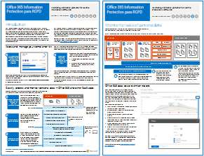

# Information Protection de Office 365 para RGPD

 **Resumen:** Esta solución muestra cómo proteger datos confidenciales que se almacenan en servicios de Office 365.
  
Esta solución incluye recomendaciones para descubrir, clasificar, proteger y supervisar datos personales. Esta solución usa el Reglamento general de protección de datos (RGPD) como ejemplo, pero se puede aplicar el mismo proceso para lograr el cumplimiento con muchas otras normativas.

  
[PDF](http://download.microsoft.com/download/E/C/D/ECD5A339-EF10-4420-B3A9-99098884D716/MSFT_Cloud_architecture_information protection for GDPR.pdf)  | [Visio](http://download.microsoft.com/download/E/C/D/ECD5A339-EF10-4420-B3A9-99098884D716/MSFT_Cloud_architecture_information protection for GDPR.vsdx)
  

## Consulte también

[Soluciones de seguridad](security-solutions.md)
  
[Instrucciones de seguridad de Microsoft para campañas políticas, organizaciones sin ánimo de lucro y otras organizaciones ágiles](microsoft-security-guidance-for-political-campaigns-nonprofits-and-other-agile-o.md)

