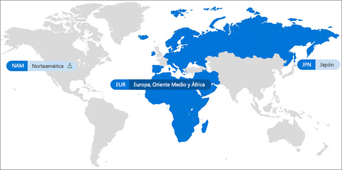

# Office 365 Multi-Geo

Con Office 365 Multi-Geo, su organización puede expandir su presencia en Office 365 a varias regiones geográficas y países dentro de su espacio empresarial existente. Póngase en contacto con su equipo de cuentas de Microsoft para registrar su compañía multinacional a Office 365 Multi-Geo.
  
Con Office 365 Multi-Geo, puede aprovisionar y almacenar los datos en reposo en las ubicaciones geográficas que haya elegido para cumplir los requisitos de residencia de datos y, al mismo tiempo, puede permitir la implementación global de experiencias de productividad modernas para sus empleados.

#### Vídeo: Introducción a Office 365 Multi-Geo

> [!VIDEO https://www.microsoft.com/videoplayer/embed/RE1Yk6B?autoplay=false]

En un entorno multigeográfico, su espacio empresarial de Office 365 cuenta con una ubicación central (donde se aprovisionó originalmente la suscripción a Office 365) y una o varias ubicaciones satélites. En un espacio empresarial multigeográfico, la información sobre las ubicaciones geográficas, grupos y la información de usuario, se controla en Azure Active Directory (AAD). Como la información del espacio empresarial se controla de forma centralizada y se sincroniza en cada ubicación geográfica, el uso compartido y las experiencias que involucran a todos los empleados de su compañía comparten una conciencia global.

Tenga en cuenta que Office 365 Multi-Geo no está diseñado principalmente para optimizar el rendimiento, sino que para cumplir con los requisitos de residencia de datos. Para obtener información sobre la optimización del rendimiento de Office 365, vea [Ajuste de rendimiento y planes de red para Office 365](https://support.office.com/article/e5f1228c-da3c-4654-bf16-d163daee8848) o póngase en contacto con su grupo de soporte técnico.

## Terminología

Estos son los términos clave utilizados para describir Office 365 Multi-Geo:

- **Ubicación central**: la ubicación geográfica en la que se ha aprovisionado originalmente el espacio empresarial.
- **Administrador geográfico**: un administrador que puede administrar una o varias ubicaciones satélites especificadas.
- **Código geográfico**: un código de tres letras de una ubicación geográfica determinada.
- **Ubicación geográfica**: una ubicación geográfica que puede usarse en un espacio empresarial multigeográfico para alojar datos, como los buzones de Exchange y los sitios de SharePoint y OneDrive.
- **Ubicación de datos preferida (PDL)**: una propiedad de usuario que establece el administrador e indica la ubicación geográfica donde se deben aprovisionar los buzones de Exchange de usuarios y OneDrive. La PDL también determina dónde aprovisionar sitios de SharePoint creados por el usuario.
- **Ubicación de satélite**: las ubicaciones geográficas donde están habilitadas las cargas de trabajo compatibles geográficamente de Office 365 (Exchange, OneDrive y SharePoint) en un espacio empresarial multigeográfico.
- **Espacio empresarial**: la representación de una organización de Office 365, que suele tener uno o más dominios asociados (por ejemplo, contoso.com).

## Disponibilidad de Office 365 Multi-Geo

Actualmente, se ofrece Office 365 Multi-Geo en estos países y regiones:

[!INCLUDE [Office 365 Multi-Geo locations](includes/office-365-multi-geo-locations.md)]

## Introducción

Siga estos pasos para empezar a usar Multi-Geo:

1. Trabaje con el equipo de cuentas para agregar el plan de servicio _Funciones multigeográficas en Office 365_. Le guiará para agregar el número de licencias necesarias. La característica multigeográfica está disponible actualmente para los clientes con un mínimo de 500 suscripciones a Office 365.

   Antes de empezar a usar Office 365 Multi-Geo, Microsoft necesita configurar el espacio empresarial de Exchange Online para la compatibilidad con Multi-Geo. Este proceso de configuración única se activa después de pedir el plan de servicio de las *Capacidades multigeográficas de Office 365* y después de que las licencias se muestren en el espacio empresarial. Recibirá notificaciones en el [centro de mensajes de Office 365](https://support.office.com/article/38FB3333-BFCC-4340-A37B-DEDA509C2093) cuando se apliquen las licencias Multi-Geo y, después, puede empezar a configurar y usar las capacidades de Office 365 Multi-Geo.

2. Lea [Planificar el entorno multigeográfico](plan-for-multi-geo.md).

3. Obtenga información sobre cómo [administrar un entorno multigeográfico](administering-a-multi-geo-environment.md) y [cómo los usuarios experimentarán el entorno](multi-geo-user-experience.md).

4. Cuando esté listo para configurar Office 365 Multi-Geo, [configure su espacio empresarial multigeográfico](multi-geo-tenant-configuration.md).

5. [Configure la búsqueda](configure-search-for-multi-geo.md).

## Vea también

[Capacidades multigeográficas en Exchange Online y OneDrive](https://Aka.ms/GoMultiGeo)

[Capacidades multigeográficas de OneDrive y SharePoint Online](https://docs.microsoft.com/office365/enterprise/multi-geo-capabilities-in-onedrive-and-sharepoint-online-in-office-365)

[Capacidades multigeográficas de Exchange Online](https://docs.microsoft.com/office365/enterprise/multi-geo-capabilities-in-exchange-online)

[Experiencia de equipos en un entorno multigeo](https://docs.microsoft.com/microsoftteams/teams-experience-o365odb-spo-multi-geo)
