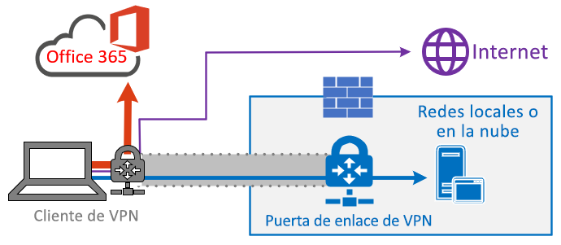
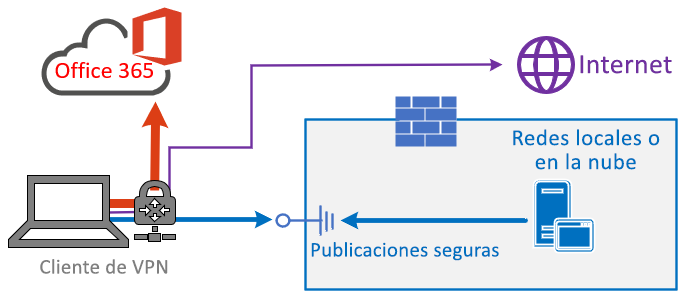

# <a name="implementing-vpn-split-tunneling-for-office-365"></a>Implementación del túnel dividido de VPN para Office 365

>[!NOTE]
>Este tema forma parte de un conjunto de temas que tratan la optimización de Office 365 para usuarios remotos.
>- Para obtener información general sobre el uso del túnel dividido de VPN para optimizar la conectividad de Office 365 para los usuarios remotos, consulte [Información general: túnel dividido VPN para Office 365](office-365-vpn-split-tunnel.md).
>- Para obtener más información sobre cómo optimizar el rendimiento de los inquilinos de Office 365 en todo el mundo para los usuarios de China, consulte [Optimización del rendimiento de Office 365 para usuarios de China](office-365-networking-china.md).

Durante muchos años, las empresas han estado usando VPN para dar soporte a experiencias remotas para sus usuarios. Mientras las cargas de trabajo básicas permanecían en entornos locales, una VPN del cliente remoto enrutada a través de un centro de datos de la red corporativa era el método principal para que los usuarios remotos accediesen a los recursos corporativos. Para salvaguardar estas conexiones, las empresas crean capas de soluciones de seguridad de red a lo largo de las rutas VPN. Esto se hizo para proteger la infraestructura interna, así como para salvaguardar la navegación móvil en sitios web externos al redirigir el tráfico a la VPN y, después, al perímetro de Internet local. Las VPN, los perímetros de red y la infraestructura de seguridad asociada a menudo se han creado y ampliado para un volumen de tráfico definido, normalmente con la mayor parte de la conectividad que se inicia desde dentro de la red corporativa y la mayoría de ellas se mantiene dentro de los límites de la red interna.

Durante bastante tiempo, los modelos de VPN en los que todas las conexiones del dispositivo del usuario remoto se enrutan de nuevo a la red local (conocido como **forzar el uso del túnel**) eran en gran medida sostenibles siempre que la escala concurrente de usuarios remotos fuera modesta y los volúmenes de tráfico que atravesaban la VPN fueran bajos.  Algunos clientes siguieron utilizando el túnel de fuerza VPN como el status quo incluso después de que sus aplicaciones se movieran desde el interior del perímetro corporativo a las nubes públicas de SaaS, siendo Office 365 un ejemplo destacado.

El uso de túneles forzados de VPN para conectarse a aplicaciones en la nube de distribución y rendimiento confidenciales es extremadamente deficiente, pero es posible que algunas empresas aceptasen el impacto negativo de esta práctica para mantener su método principal desde el punto de vista de la seguridad. A continuación se muestra un diagrama de ejemplo de este escenario:


Este problema ha estado creciendo durante varios años, en los que muchos clientes han estado informando de un cambio considerable en los patrones de tráfico de red. El tráfico que solía permanecer en local ahora se conecta a puntos de conexión de la nube externa. Muchos clientes de Microsoft han informado de que, en el pasado, alrededor del 80 % del tráfico de red se dirigía a un origen interno (representado por la línea de puntos en el diagrama anterior). En 2020 esa cifra ha caído aproximadamente a un 20 % o menos, debido a los desplazamientos de amplios volúmenes de cargas de trabajo a la nube. Estas tendencias no son infrecuentes para otras empresas. Con el tiempo, a medida que la nube avanza, el modelo anterior se convierte en algo cada vez más engorroso y menos sostenible, lo que limita la agilidad de la organización para adaptarse a un mundo que da prioridad a la nube.

La crisis mundial de la COVID-19 ha escalado este problema, de forma que necesita una solución inmediata. La necesidad de garantizar la seguridad de los empleados ha generado demandas sin precedentes en TI empresarial para dar soporte a la productividad del trabajo desde el hogar a una escala masiva. Microsoft Office 365 está bien posicionado para ayudar a los clientes a satisfacer esa demanda, pero la gran simultaneidad de los usuarios que trabajan desde casa generan un gran volumen de tráfico de Office 365 que, si se redirige a través de perímetros forzados VPN y perímetros de red local, provoca una saturación rápida y ejecuta la infraestructura de VPN sin capacidad. En esta nueva realidad, el uso de VPN para tener acceso a Office 365 ya no es solo un obstáculo de rendimiento, sino que es una pared difícil que no solo afecta a las operaciones de Office 365 pero críticas del negocio que aún deben depender de la VPN para funcionar.

Microsoft ha trabajado codo con codo con los clientes y las grandes empresas durante muchos años para ofrecer soluciones eficaces y modernas para estos problemas desde dentro de sus propios servicios, así como para adoptar las prácticas recomendadas del sector. Los [Principios de conectividad](https://aka.ms/pnc) para el servicio de Office 365 se diseñaron para que funcione de manera eficiente para los usuarios remotos y para que la organización mantenga la seguridad y el control sobre su conectividad. Estas soluciones también se pueden implementar rápidamente y con poco esfuerzo, de forma que tienen un impacto muy positivo en los problemas descritos anteriormente.

La estrategia recomendada por Microsoft para optimizar la conectividad de los trabajadores remotos se centra en solucionar rápidamente los problemas con el método tradicional y ofrecer un alto rendimiento con tan solo unos sencillos pasos. Estos pasos ajustan el enfoque de VPN heredado para un pequeño número de puntos de conexión definidos que omiten los servidores VPN con cuellos de botella. Se puede aplicar un modelo de seguridad equivalente o incluso superior en diferentes capas para que no sea necesario proteger todo el tráfico de salida de la red corporativa. En la mayoría de los casos, esto se puede lograr de forma eficaz en cuestión de horas, y luego escalar a otras cargas de trabajo a medida que sea necesario y el tiempo lo permita.

## <a name="common-vpn-scenarios"></a>Escenarios de VPN comunes

En la lista que aparece a continuación se muestran los escenarios de VPN más comunes que se ven en los entornos empresariales. La mayoría de los clientes utiliza el modelo 1 de forma tradicional (túnel forzado de VPN). Esta sección le ayudará a realizar una transición rápida y segura al **modelo 2**, lo que puede conseguirse con relativamente poco esfuerzo y tiene enormes ventajas para el rendimiento de la red y la experiencia del usuario.

| **Modelo** | **Descripción** |
| --- | --- |
| [1. Túnel forzado de VPN](#1-vpn-forced-tunnel) | 100% de tráfico entra en túnel VPN, incluido el local, Internet y todos los O365/M365 |
| [2. Túnel forzado de VPN con unas pocas excepciones](#2-vpn-forced-tunnel-with-a-small-number-of-trusted-exceptions) | El túnel de VPN se usa de forma predeterminada (la ruta predeterminada apunta a la VPN), con pocos escenarios de exención especialmente importantes que se pueden dirigir directamente |
| [3. Túnel forzado de VPN con muchas excepciones](#3-vpn-forced-tunnel-with-broad-exceptions) | El túnel VPN se usa de forma predeterminada (la ruta predeterminada apunta a la VPN), con muchas excepciones que se pueden dirigir directamente (como todas las instancias de Office 365, Salesforce y Zoom). |
| [4. Túnel de VPN selectivo](#4-vpn-selective-tunnel) | El túnel VPN solo se usa para los servicios basados en la red corporativa. La ruta predeterminada (Internet y todos los servicios basados en Internet) va directamente. |
| [5. No VPN](#5-no-vpn) | Una variación de #2, donde en lugar de la VPN heredada, todos los servicios de CorpNet se publican mediante enfoques de seguridad modernos (como Zscaler ZPA, proxy/MCAS de Azure Active Directory (Azure AD), etc.) |

### <a name="1-vpn-forced-tunnel"></a>1. Túnel forzado de VPN

Este es el escenario de inicio más habitual de la mayoría de los clientes empresariales. Se usa una VPN forzada, lo que significa que el 100% del tráfico se dirige a la red corporativa independientemente del hecho en que el extremo reside dentro de la red corporativa o no. Cualquier tráfico externo (Internet), como el de Office 365 o la exploración de Internet, se redirige fuera del equipamiento local de seguridad, como los servidores proxy. En el clima actual en el que 100 % de los usuarios trabajan de forma remota, este modelo pone una carga muy elevada en la infraestructura de VPN y es probable que obstaculice significativamente el rendimiento de todo el tráfico corporativo y que, por lo tanto, la empresa opere de forma eficaz en un momento de crisis.


### <a name="2-vpn-forced-tunnel-with-a-small-number-of-trusted-exceptions"></a>2. Túnel forzado de VPN con unas pocas excepciones de confianza

Este modelo es mucho más eficiente para que una empresa opere con, ya que permite un pequeño número de puntos de conexión controlados y definidos que tienen una carga muy alta y sensibles a la latencia para omitir el túnel de VPN y pasar directamente al servicio de Office 365 en este ejemplo. Esto mejora significativamente el rendimiento de los servicios descargados y también reduce la carga de la infraestructura de VPN, lo que permite que los elementos que aún lo necesiten funcionen con contención inferior para los recursos. Este modelo se centra en ayudar con la transición a, ya que permite que las acciones sencillas y definidas se tomen muy rápidamente con numerosos resultados positivos.


### <a name="3-vpn-forced-tunnel-with-broad-exceptions"></a>3. Túnel forzado de VPN con muchas excepciones

El tercer modelo amplía el ámbito del modelo dos como, en lugar de simplemente enviar un grupo pequeño de extremos definidos directamente, en su lugar envía todo el tráfico directamente a los servicios de confianza de Office 365 y SalesForce. Esto reduce aún más la carga en la infraestructura VPN corporativa y mejora el rendimiento de los servicios definidos. Como es probable que este modelo necesite más tiempo para evaluar la viabilidad y la implementación, es probable que sea un paso que pueda realizarse de forma iterativa en una fecha posterior, una vez que el modelo dos se haya implementado correctamente.


### <a name="4-vpn-selective-tunnel"></a>4. Túnel de VPN selectivo

Este modelo invierte el tercer modelo, puesto que únicamente el tráfico con una dirección IP corporativa identificada se envía por el túnel VPN y, por lo tanto, la ruta de Internet es la predeterminada para todo lo demás. Este modelo requiere que la organización se encuentre en una fase avanzada de implementación de [Confianza cero](https://www.microsoft.com/security/zero-trust?rtc=1) para poder implementar el modelo de forma segura. Se debe tener en cuenta que es probable que este modelo o alguna variación de él se acabe convirtiendo en el predeterminado con el tiempo, a medida que se vayan trasladando más servicios de la red corporativa a la nube. Microsoft utiliza este modelo internamente; puede encontrar más información sobre la implementación de Microsoft del túnel dividido VPN en [Ejecutando en VPN: como Microsoft mantiene su fuerza de trabajo remota conectada](https://www.microsoft.com/itshowcase/blog/running-on-vpn-how-microsoft-is-keeping-its-remote-workforce-connected/?elevate-lv).



### <a name="5-no-vpn"></a>5. No VPN

Una versión más avanzada del modelo número dos, por el que los servicios internos se publican a través de un enfoque de seguridad moderno o una solución SDWAN como proxy de Azure AD, MCAS, Zscaler ZPA, etc.



## <a name="implement-vpn-split-tunneling"></a>Implementación de túnel dividido de VPN

En esta sección se describen los pasos sencillos que se deben seguir para migrar la arquitectura de cliente de VPN de un _túnel forzado de VPN_ a un _túnel forzado de VPN con un número reducido de excepciones de confianza,_ [el modelo n.º 2 de túnel dividido de VPN](#2-vpn-forced-tunnel-with-a-small-number-of-trusted-exceptions) en la sección [Escenarios de VPN comunes](#common-vpn-scenarios).

En el siguiente diagrama se muestra cómo funciona la solución recomendada de túnel dividido de VPN:


### <a name="1-identify-the-endpoints-to-optimize"></a>1. Identificar los puntos de conexión que se deben optimizar

En el tema [Intervalos de direcciones IP y URL de Office 365](https://docs.microsoft.com/office365/enterprise/urls-and-ip-address-ranges), Microsoft identifica de manera clara los puntos de conexión clave que necesita optimizar y los categoriza como **Optimizar**. Actualmente, hay cuatro direcciones URL y veinte subredes IP que deben optimizarse. Este pequeño grupo de puntos de conexión representa, aproximadamente, entre un 70 % y un 80 % del volumen del tráfico hacia el servicio de Office 365, entre el que se incluyen los puntos de conexión sensibles a la latencia, como los del contenido multimedia de Teams. Básicamente, se trata del tráfico que debemos prestar especial atención y es también el tráfico que pondrá una presión increíble en las rutas de red y la infraestructura de VPN tradicionales.

Las direcciones URL de esta categoría tienen las siguientes características:

- Son los puntos de conexión que pertenecen a Microsoft, que también se encarga de administrarlos y alojarlos en su infraestructura
- Se les ofrece IP
- Tienen una baja tasa de cambio y un número esperado reducido (actualmente, 20 subredes IP)
- Tienen ancho de banda o son sensibles a la latencia
- Se les puede proporcionar elementos de seguridad necesarios directamente en el servicio en lugar de en línea en la red
- Suponen aproximadamente entre el 70 % y el 80 % del volumen de tráfico en el servicio de Office 365

>[!NOTE]
>Microsoft se ha comprometido a suspender los cambios realizados en **Optimizar** los puntos de conexión de Office 365 hasta al menos el **30 de junio de 2020**, lo que permite que los clientes se centren en otros problemas y no en mantener una lista blanca de puntos de conexión una vez que los implementaran inicialmente. Este artículo se actualizará para reflejar todos los cambios futuros.

Para obtener más información acerca de los puntos de conexión de Office 365 y cómo se clasifican y administran, vea el artículo [Administración de puntos de conexión de Office 365](managing-office-365-endpoints.md).

#### <a name="optimize-urls"></a>Optimización de direcciones URL

Las direcciones URL que se deben optimizar actualmente se muestran en la siguiente tabla. En la mayoría de los casos, solo debería necesitar usar puntos de conexión de URL en un [archivo PAC de explorador](managing-office-365-endpoints.md#use-a-pac-file-for-direct-routing-of-vital-office-365-traffic) en el que los puntos de conexión se configuren para enviarse directamente, en lugar de hacerlo al proxy.

| Optimización de direcciones URL | Puerto/Protocolo | Objetivo |
| --- | --- | --- |
| <https://outlook.office365.com> | TCP 443 | Esta es una de las direcciones URL primarias que Outlook usa para conectarse a su servidor de Exchange Online y tiene un alto volumen de uso de ancho de banda y recuento de conexiones. Se requiere una baja latencia de red para las características en línea, entre las que se incluyen: búsqueda instantánea, otros calendarios de buzón, búsqueda libre/ocupada, administrar reglas y alertas, archivo de Exchange Online y mensajes de correo electrónico que salen de la bandeja de salida. |
| <https://outlook.office.com> | TCP 443 | Esta dirección URL se usa para que Outlook Online Web Access se conecte al servidor de Exchange Online y es sensible a la latencia de red. La conectividad es especialmente importante para la carga y descarga de archivos grandes con SharePoint Online. |
| https:// \<tenant\> . SharePoint.com | TCP 443 | Esta es la dirección URL principal de SharePoint Online y tiene un gran uso de ancho de banda. |
| https:// \<tenant\> -My.SharePoint.com | TCP 443 | Esta es la dirección URL principal de OneDrive para la Empresa y tiene un gran uso de ancho de banda y posiblemente un alto número de conexiones de la Herramienta de sincronización de OneDrive para la Empresa. |
| Direcciones IP del contenido multimedia de Teams (sin URL) | UDP 3478, 3479, 3480 y 3481 | Asignación de detección de retransmisión y tráfico en tiempo real (3478), audio (3479), vídeo (3480) y pantalla compartida de vídeo (3481). Estos son los puntos de conexión que se usan para el tráfico multimedia de Skype empresarial y Microsoft Teams (llamadas, reuniones, etc.). La mayoría de los puntos de conexión se proporcionan cuando el cliente de Microsoft Teams establece una llamada (que se incluye en las direcciones IP mostradas para el servicio). El uso del protocolo UDP es necesario para obtener la calidad multimedia ideal.   |

En los ejemplos anteriores, se debe reemplazar al **inquilino** por el nombre de inquilino de Office 365. Por ejemplo, **contoso.onmicrosoft.com** usaría _contoso.sharepoint.com_ y _contoso-my.sharepoint.com_.

#### <a name="optimize-ip-address-ranges"></a>Optimización de intervalos de direcciones IP

En el momento de escribir los intervalos IP a los que estos puntos de conexión corresponden son los siguientes. Es **muy** recomendable que use un [script como el de este](https://github.com/microsoft/Office365NetworkTools/tree/master/Scripts/Display%20URL-IPs-Ports%20per%20Category) ejemplo, el [servicio web de dirección IP y URL de Office 365](https://docs.microsoft.com/office365/enterprise/office-365-ip-web-service) o la [página de la dirección IP o URL](https://docs.microsoft.com/office365/enterprise/urls-and-ip-address-ranges) para comprobar si hay actualizaciones al aplicar la configuración, y aplicar una directiva para que se realice esta comprobación de forma periódica.

```
104.146.128.0/17
13.107.128.0/22
13.107.136.0/22
13.107.18.10/31
13.107.6.152/31
13.107.64.0/18
131.253.33.215/32
132.245.0.0/16
150.171.32.0/22
150.171.40.0/22
191.234.140.0/22
204.79.197.215/32
23.103.160.0/20
40.104.0.0/15
40.108.128.0/17
40.96.0.0/13
52.104.0.0/14
52.112.0.0/14
52.96.0.0/14
52.120.0.0/14
```

### <a name="2-optimize-access-to-these-endpoints-via-the-vpn"></a>2. Optimizar el acceso a estos puntos de conexión a través de la VPN

Ya identificados los puntos de conexión críticos, se deben desviar del túnel de VPN y permitirles usar la conexión a Internet local del usuario para conectarse directamente al servicio. La forma en que se logra esto varía en función de la plataforma del equipo y del producto de VPN que se use, pero la mayoría de las soluciones de VPN permite una configuración sencilla de las directivas para aplicar esta lógica. Para obtener instrucciones sobre el túnel dividido específico de la plataforma de VPN, consulte [Guías para obtener más información sobre las plataformas VPN comunes](#howto-guides-for-common-vpn-platforms).

Si desea probar la solución manualmente, puede ejecutar el siguiente ejemplo de PowerShell para emular la solución en el nivel de la tabla de rutas. Este ejemplo agrega una ruta para cada subred IP del contenido multimedia de Teams a la tabla de rutas. Puede probar el rendimiento del contenido multimedia de Teams antes y después, y observar la diferencia de rutas en los extremos especificados.

#### <a name="example-add-teams-media-ip-subnets-into-the-route-table"></a>Ejemplo: agregar subredes IP del contenido multimedia de Teams a la tabla de rutas

```powershell
$intIndex = "" # index of the interface connected to the internet
$gateway = "" # default gateway of that interface
$destPrefix = "52.120.0.0/14", "52.112.0.0/14", "13.107.64.0/18" # Teams Media endpoints
# Add routes to the route table
foreach ($prefix in $destPrefix) {New-NetRoute -DestinationPrefix $prefix -InterfaceIndex $intIndex -NextHop $gateway}
```

En el script anterior, _$intIndex_ es el índice de la interfaz conectada a Internet (puede buscarla si ejecuta **get-netadapter** en PowerShell y se fija en el valor de _ifIndex_) y _$Gateway_ es la puerta de enlace predeterminada de esa interfaz (puede buscarla si ejecuta **ipconfig** en un símbolo del sistema o **(Get-NetIPConfiguration | Foreach IPv4DefaultGateway).NextHop** en PowerShell).

Una vez que haya agregado las rutas, puede confirmar que la tabla de rutas es la correcta, para ello, ejecute **route print** en un símbolo del sistema o PowerShell. El resultado debe contener las rutas que agregó y mostrar el índice de la interfaz (_22_ en este ejemplo) y la puerta de enlace para dicha interfaz (_192.168.1.1_ en este ejemplo):


Para agregar rutas para **todos** los intervalos de direcciones IP actuales en la categoría Optimizar, puede usar la siguiente variación de script para consultar el [servicio web de direcciones IP y URL de Office 365](https://docs.microsoft.com/office365/enterprise/office-365-ip-web-service) para el conjunto actual de subredes IP de la categoría Optimizar, y para agregarlo a la tabla de rutas.

#### <a name="example-add-all-optimize-subnets-into-the-route-table"></a>Ejemplo: agregar subredes IP de la categoría Optimizar a la tabla de rutas

```powershell
$intIndex = "" # index of the interface connected to the internet
$gateway = "" # default gateway of that interface
# Query the web service for IPs in the Optimize category
$ep = Invoke-RestMethod ("https://endpoints.office.com/endpoints/worldwide?clientrequestid=" + ([GUID]::NewGuid()).Guid)
# Output only IPv4 Optimize IPs to $optimizeIps
$destPrefix = $ep | where {$_.category -eq "Optimize"} | Select-Object -ExpandProperty ips | Where-Object { $_ -like '*.*' }
# Add routes to the route table
foreach ($prefix in $destPrefix) {New-NetRoute -DestinationPrefix $prefix -InterfaceIndex $intIndex -NextHop $gateway}
```

Si ha agregado accidentalmente rutas con parámetros incorrectos o si simplemente desea revertir los cambios, puede quitar las rutas que acaba de agregar con el siguiente comando:

```powershell
foreach ($prefix in $destPrefix) {Remove-NetRoute -DestinationPrefix $prefix -InterfaceIndex $intIndex -NextHop $gateway}
```

<!--- remmed until we add more reliable interface selection logic
#### Example script to add Teams Media subnets to the route table

```powershell
$adapter = get-netadapter | ? {$_.Status -eq "Up"}
$adapterIndex = $adapter.ifIndex
$gateway = (Get-NetIPConfiguration | Foreach IPv4DefaultGateway).NextHop

$destPrefix = "52.120.0.0/14", "52.112.0.0/14", "13.107.64.0/18"
foreach ($prefix in $destPrefix) {New-NetRoute -DestinationPrefix $prefix -InterfaceIndex $intIndex -NextHop $gateway}
```
-->

El cliente VPN debe configurarse para que el tráfico a las direcciones IP de la categoría **Optimizar** se enrute de esta forma. Esto permite que el tráfico Utilice recursos locales de Microsoft, como las puertas frontales del servicio de Office 365 [, como la puerta frontal de Azure](https://azure.microsoft.com/blog/azure-front-door-service-is-now-generally-available/) que entrega los puntos de conexión de conectividad y los servicios de Office 365 lo más cerca posible de los usuarios. Esto permite ofrecer un alto nivel de rendimiento a los usuarios, independientemente de en qué parte del mundo se encuentren, y aprovechar al máximo la [red global de nivel mundial de Microsoft](https://azure.microsoft.com/blog/how-microsoft-builds-its-fast-and-reliable-global-network/), que probablemente se encuentre a escasos milisegundos de la salida directa de los usuarios.

## <a name="configuring-and-securing-teams-media-traffic"></a>Configuración y protección del tráfico multimedia de Teams

Algunos administradores pueden requerir información más detallada sobre la forma en que funcionan los flujos de llamadas en Teams que utilizan un modelo de túnel dividido y cómo se aseguran las conexiones.

### <a name="configuration"></a>Configuración

Tanto para llamadas como para reuniones, siempre y cuando se hayan dispuesto correctamente en la tabla de rutas las subredes IP de la categoría Optimizar para el contenido multimedia de Teams, cuando Teams llama al método _GetBestRoute_ para determinar la interfaz que debe usar para un destino en particular, se devolverá la interfaz local para los destinos de Microsoft en los bloques de direcciones IP de Microsoft enumerados anteriormente.

Algunos programas de cliente de VPN permiten la manipulación del enrutamiento en función de la dirección URL. Pero el tráfico multimedia de Teams no tiene una dirección URL asociada, por lo que el control del enrutamiento para este tráfico tiene que realizarse mediante subredes IP.

En determinadas situaciones, a menudo no relacionadas con la configuración del cliente de Teams, el tráfico multimedia atraviesa igualmente el túnel de VPN aunque se hayan dispuesto las rutas correctas. Si este es el caso, debería bastar con usar una regla de firewall para evitar que las subredes IP o puertos de Teams usen la VPN.

>[!IMPORTANT]
>Para asegurarse de que el tráfico de los equipos multimedia se enruta a través del método deseado en todos los escenarios de VPN, asegúrese de que los usuarios ejecutan la versión **1.3.00.13565** o posterior del cliente de Microsoft Teams. Esta versión incluye mejoras en el modo en que el cliente detecta las rutas de red disponibles.

El tráfico de señalización se realiza a través de HTTPS y no es tan sensible a la latencia como el tráfico de medios y se marca como **permitir** en los datos URL/IP y, por lo tanto, se puede enrutar de manera segura a través del cliente VPN si así se desea.

### <a name="security"></a>Seguridad

Un argumento común para evitar los túneles divididos es que es menos seguro utilizarlos, es decir, el tráfico que no atraviese el túnel VPN no se beneficiará del esquema de cifrado que se aplique al túnel VPN, y por lo tanto será menos seguro.

El principal argumento contra esta idea es que el tráfico multimedia ya está cifrado mediante _protocolo de transporte en tiempo real seguro (SRTP)_, un perfil del protocolo de transporte en tiempo real (RTP) que proporciona confidencialidad, autenticación y protección contra ataques de reproducciones al tráfico RTP. SRTP se basa en una clave de sesión generada al azar, que se intercambia mediante el canal de señalización protegida de TLS. Este se trata de forma detallada en [esta guía de seguridad](https://docs.microsoft.com/skypeforbusiness/optimizing-your-network/security-guide-for-skype-for-business-online), pero la sección principal de interés es el cifrado multimedia.

El tráfico multimedia se cifra con SRTP, que usa una clave de sesión generada por un generador de números aleatorios seguros y se intercambia con el canal TLS de señalización. Además, el contenido multimedia que fluye en ambas direcciones entre el servidor de mediación y el próximo salto interno también se cifra con SRTP.

Skype Empresarial Online genera nombres de usuario o contraseñas para proteger el acceso a relés multimedia mediante _retransmisiones de uso de recorrido por NAT (TURN)_. Los relés multimedia intercambian el nombre de usuario/contraseña a través de un canal SIP protegido con TLS. Es importante tener en cuenta que, aunque se puede usar un túnel VPN para conectar el cliente a la red corporativa, el tráfico debe fluir en su forma SRTP cuando sale de la red corporativa para llegar al servicio.

Puede obtener información acerca de cómo Teams mitiga los problemas de seguridad comunes, como los ataques de amplificación de las utilidades de voz o _de recorrido de sesión para NAT (STUN)_, [en este artículo](https://docs.microsoft.com/openspecs/office_protocols/ms-ice2/69525351-8c68-4864-b8a6-04bfbc87785c).

También podrá obtener más información acerca de los controles de seguridad modernos en los escenarios de trabajo remoto en [Formas alternativas para que los profesionales de seguridad y de TI logren controles de seguridad modernos en los escenarios de trabajo remoto de hoy día (blog del Equipo de seguridad de Microsoft)](https://www.microsoft.com/security/blog/2020/03/26/alternative-security-professionals-it-achieve-modern-security-controls-todays-unique-remote-work-scenarios/).

## <a name="testing"></a>Pruebas

Una vez que la directiva se haya implementado, debe asegurarse de que funciona de la forma esperada. Hay varias formas de probar si la ruta de acceso se ha configurado correctamente para usar la conexión a Internet local:

- Ejecute la [prueba de conectividad de Microsoft 365](https://aka.ms/netonboard) que ejecutará pruebas de conectividad con rutas de seguimiento, como se indica anteriormente. También estamos agregando pruebas de VPN en estas herramientas que también deben proporcionar información adicional.

- Un sencillo tracert para un punto de conexión dentro del alcance del túnel dividido debe mostrar la ruta de acceso que se ha tomado, por ejemplo:

  ```powershell
  tracert worldaz.tr.teams.microsoft.com
  ```

  A continuación, debería ver una ruta de acceso a través del ISP local a este punto de conexión que debe resolverse en una dirección IP de los rangos de teams que hemos configurado para la tunelización dividida.

- Realice una captura de red con una herramienta como Wireshark. Filtre por UDP durante una llamada y debería ver el tráfico que fluye a una dirección IP en el intervalo **Optimizar** de Teams. Si el túnel VPN se usa para este tráfico, el tráfico multimedia no estará visible en el seguimiento.

### <a name="additional-support-logs"></a>Registros de soporte adicional

Si necesita más datos para solucionar problemas o bien asistencia del soporte técnico de Microsoft, la obtención de la siguiente información le permite acelerar la búsqueda de una solución. El conjunto de **herramientas de TTS de solución de problemas universal basado en Windows cmd** del soporte técnico de Microsoft puede ayudarle a recopilar los registros relevantes de forma sencilla. La herramienta y las instrucciones de uso se pueden encontrar en <https://aka.ms/TssTools.>

## <a name="howto-guides-for-common-vpn-platforms"></a>Guías paso a paso para plataformas VPN comunes

En esta sección se ofrecen enlaces a guías detalladas para la realización de túneles divididos para el tráfico de Office 365 de los socios más comunes en este espacio. Se agregarán guías adicionales a medida que estén disponibles.

- **Cliente VPN de Windows 10**: [optimizar el tráfico de Office 365 para trabajadores remotos con el cliente VPN nativo de Windows 10](https://docs.microsoft.com/windows/security/identity-protection/vpn/vpn-office-365-optimization)
- **Cisco AnyConnect**: [Optimize Anyconnect Split Tunnel for Office 365 (Optimización del túnel dividido de AnyConnect para Office 365)](https://www.cisco.com/c/en/us/support/docs/security/anyconnect-secure-mobility-client/215343-optimize-anyconnect-split-tunnel-for-off.html)
- **Palo Alto GlobalProtect**: [optimiza el tráfico de Office 365 mediante un túnel dividido de VPN para excluir la ruta de acceso](https://live.paloaltonetworks.com/t5/Prisma-Access-Articles/GlobalProtect-Optimizing-Office-365-Traffic/ta-p/319669)
- **F5 Networks BIG-IP APM**: [optimiza el tráfico de Office 365 en el acceso remoto mediante redes VPN al usar BIG-IP APM](https://devcentral.f5.com/s/articles/SSL-VPN-Split-Tunneling-and-Office-365)
- **Citrix Gateway**: [optimización del túnel dividido de VPN de Citrix Gateway para Office365](https://docs.citrix.com/en-us/citrix-gateway/13/optimizing-citrix-gateway-vpn-split-tunnel-for-office365.html)
- **Pulse Secure**: [Túnel VPN: Cómo configurar el túnel dividido para excluir aplicaciones de Office 365](https://kb.pulsesecure.net/articles/Pulse_Secure_Article/KB44417)
- **Check Point VPN**: [Cómo configurar el túnel dividido para Office 365 y otras aplicaciones SaaS](https://supportcenter.checkpoint.com/supportcenter/portal?eventSubmit_doGoviewsolutiondetails=&solutionid=sk167000)

## <a name="faq"></a>Preguntas más frecuentes

El equipo de seguridad de Microsoft ha publicado [un artículo](https://www.microsoft.com/security/blog/2020/03/26/alternative-security-professionals-it-achieve-modern-security-controls-todays-unique-remote-work-scenarios/) que describe las formas clave para los profesionales de seguridad y que puede obtener controles de seguridad modernos en los escenarios de trabajo remoto únicos de hoy en día. Además, a continuación se muestran algunas de las preguntas de los clientes más comunes acerca de este tema, con sus respuestas.

### <a name="how-do-i-stop-users-accessing-other-tenants-i-do-not-trust-where-they-could-exfiltrate-data"></a>¿Cómo puedo evitar que los usuarios tengan acceso a otros inquilinos en los que se pueden filtrar datos?

La respuesta es una [característica denominada restricciones de inquilino](https://docs.microsoft.com/azure/active-directory/manage-apps/tenant-restrictions). El tráfico de autenticación no es de gran volumen ni es especialmente sensible a la latencia, por lo que puede enviarse por la solución de VPN al proxy local donde se aplica la característica. Aquí se mantiene una lista de permitidos de inquilinos de confianza y si el cliente intenta obtener un token para un inquilino que no es de confianza, el proxy simplemente deniega la solicitud. Si el inquilino es de confianza, se puede obtener el token si el usuario tiene las credenciales y los derechos adecuados.

Por lo tanto, aunque un usuario pueda realizar una conexión TCP/UDP a los puntos de conexión de Optimizar marcados anteriores, sin un token válido para acceder al inquilino en cuestión, simplemente no podrán iniciar sesión y acceder a los datos ni moverlos.

### <a name="does-this-model-allow-access-to-consumer-services-such-as-personal-onedrive-accounts"></a>¿Permite este modelo el acceso a los servicios al consumidor, como cuentas de OneDrive personales?

No, los puntos de conexión de Office 365 no son los mismos que los servicios de consumidor (por ejemplo, Onedrive.live.com), por lo que el túnel dividido no permitirá que un usuario acceda directamente a los servicios al consumidor. El tráfico a los puntos de conexión de consumidor seguirá utilizando el túnel VPN y seguirán aplicándose las directivas existentes.

### <a name="how-do-i-apply-dlp-and-protect-my-sensitive-data-when-the-traffic-no-longer-flows-through-my-on-premises-solution"></a>¿Cómo puedo aplicar DLP y proteger mis datos confidenciales cuando el tráfico ya no circule por la solución local?

Para ayudarle a evitar la divulgación accidental de información confidencial, Office 365 tiene un conjunto completo de [herramientas integradas](https://docs.microsoft.com/microsoft-365/compliance/data-loss-prevention-policies?view=o365-worldwide). Puede usar las [funciones integradas de DLP](https://docs.microsoft.com/microsoft-365/compliance/data-loss-prevention-policies?view=o365-worldwide) de Teams y SharePoint para detectar información confidencial compartida o almacenada de forma no adecuada. Si una parte de la estrategia de trabajo remoto implica una directiva para traer su propio dispositivo (BYOD), puede usar el [acceso condicional basado](https://docs.microsoft.com/azure/active-directory/conditional-access/app-based-conditional-access) en la aplicación para evitar que los datos confidenciales se descarguen a los dispositivos personales de los usuarios.

### <a name="how-do-i-evaluate-and-maintain-control-of-the-users-authentication-when-they-are-connecting-directly"></a>¿Cómo puedo evaluar y mantener el control de la autenticación de los usuarios cuando se conectan directamente?

Además de la característica de restricciones de inquilino que se indicó en la P1, se pueden aplicar [directivas de acceso condicional](https://docs.microsoft.com/azure/active-directory/conditional-access/overview) para evaluar dinámicamente el riesgo de una solicitud de autenticación y reaccionar de forma adecuada. Microsoft recomienda la implementación del [modelo de confianza cero](https://www.microsoft.com/security/zero-trust?rtc=1) con el tiempo, y es posible usar las directivas de acceso condicional de Azure AD para mantener el control en un mundo que prioriza los dispositivos móviles y la nube. Las directivas de acceso condicional se pueden usar para tomar decisiones en tiempo real acerca de si una solicitud de autenticación es satisfactoria basándose en varios factores, como:

- Dispositivo, ¿se ha unido un dominio conocido o de confianza?
- IP, ¿la solicitud de autenticación proviene de una dirección IP corporativa conocida? ¿O de un país en el que no confíe?
- Aplicación, ¿está autorizado el usuario a usar esta aplicación?

Entonces se puede desencadenar una directiva como aprobar, activar MFA o bloquear la autenticación de acuerdo con estas directivas.

### <a name="how-do-i-protect-against-viruses-and-malware"></a>¿Cómo puedo protegerme contra virus y malware?

De nuevo, Office 365 proporciona protección para los puntos de conexión marcados para Optimizar en varias capas en el servicio, [como se describe en este documento](https://docs.microsoft.com/office365/Enterprise/office-365-malware-and-ransomware-protection). Como se ha mencionado, es mucho más eficaz proporcionar estos elementos de seguridad en el propio servicio, en lugar de intentar hacerlo en línea con dispositivos que podrían no comprender completamente el tráfico o los protocolos. De forma predeterminada, SharePoint Online [examina automáticamente las cargas de archivos](https://docs.microsoft.com/microsoft-365/security/office-365-security/virus-detection-in-spo?view=o365-worldwide) en busca de malware conocido

En el caso de los puntos de conexión de Exchange enumerados anteriormente, [Exchange Online Protection](https://docs.microsoft.com/office365/servicedescriptions/exchange-online-protection-service-description/exchange-online-protection-service-description) y [Protección contra amenazas avanzada de Office 365](https://docs.microsoft.com/office365/servicedescriptions/office-365-advanced-threat-protection-service-description) hacen un trabajo excelente para proporcionar seguridad del tráfico al servicio.

### <a name="can-i-send-more-than-just-the-optimize-traffic-direct"></a>¿Puedo enviar algo más de forma directa que el tráfico de Optimizar?

Se debe dar prioridad a los puntos de conexión marcados como **Optimizar**, ya que aportan el máximo beneficio con un bajo nivel de trabajo. Sin embargo, si lo desea, los puntos de conexión marcados son necesarios para que el servicio funcione y tienen direcciones IP proporcionadas para los puntos de conexión que se pueden usar si es necesario.

También hay varios proveedores que ofrecen soluciones de seguridad o proxy basadas en la nube denominadas puertas de enlace web seguras que proporcionan seguridad central, control y aplicación de directivas corporativas para la navegación web general. Estas soluciones pueden funcionar bien en la nube en primer lugar, si la alta disponibilidad, el rendimiento y el aprovisionamiento están cerca de los usuarios, lo que permite que el acceso seguro a Internet se entregue desde una ubicación basada en la nube cercana al usuario. Así se elimina la necesidad de redirigir el tráfico de navegación general al origen a través de la red VPN/corporativa, a la vez que se permite un control de seguridad centralizado.

Pero incluso con estas soluciones implementadas, Microsoft sigue recomendando que se envíe directamente al servicio el tráfico de Office 365 marcado como Optimizar.

Para obtener instrucciones sobre cómo permitir el acceso directo a una red virtual de Azure, vea el artículo [Remote work using Azure VPN Gateway Point-to-site (Trabajo remoto mediante Azure VPN Gateway de punto a sitio)](https://docs.microsoft.com/azure/vpn-gateway/work-remotely-support).

### <a name="why-is-port-80-required-is-traffic-sent-in-the-clear"></a>¿Por qué es necesario el puerto 80? ¿El tráfico se envía sin cifrar?

El puerto 80 solo se usa para cosas como redirigirse a una sesión de puerto 443, no se envían datos de clientes ni se obtiene acceso a ellos a través del puerto 80. [Este artículo](https://docs.microsoft.com/microsoft-365/compliance/encryption?view=o365-worldwide) describe el cifrado de datos en tránsito y en reposo para Office 365, y [este artículo](https://docs.microsoft.com/microsoftteams/microsoft-teams-online-call-flows#types-of-traffic) explica cómo se usa SRTP para proteger el tráfico multimedia de Teams.

### <a name="does-this-advice-apply-to-users-in-china-using-a-worldwide-instance-of-office-365"></a>¿Estos consejos se aplican a los usuarios de China con una instancia mundial de Office 365?

**No**. Los únicos que deben tomar precauciones respecto a los consejos anteriores son los usuarios de China que estén conectándose a una instancia mundial de Office 365. Como la congestión en la red de servicios transfronterizos es habitual en la región, el rendimiento de salida de Internet directo puede variar. La mayoría de los clientes de la región operan con una VPN para dirigir el tráfico a la red corporativa y usan su circuito de MPLS autorizado o similares para realizar la salida fuera del país mediante una ruta optimizada. Esto se describe con más detalle en el artículo [Office 365 performance optimization for China users (Optimización de rendimiento de Office 365 para usuarios de China)](office-365-networking-china.md).

## <a name="related-topics"></a>Temas relacionados

[Resumen: túnel de división VPN para Office 365 ](office-365-vpn-split-tunnel.md)

[Optimización de rendimiento de Office 365 para usuarios de China](office-365-networking-china.md)

[Formas alternativas para que los profesionales de seguridad y de TI logren controles de seguridad modernos en los escenarios de trabajo remoto específicos (blog del Equipo de Seguridad de Microsoft)](https://www.microsoft.com/security/blog/2020/03/26/alternative-security-professionals-it-achieve-modern-security-controls-todays-unique-remote-work-scenarios/)

[Mejorando el rendimiento de la VPN en Microsoft: usando perfiles de VPN de Windows 10 para permitir conexiones automáticas ](https://www.microsoft.com/itshowcase/enhancing-remote-access-in-windows-10-with-an-automatic-vpn-profile)

[Funcionando con VPN: cómo Microsoft mantiene conectado a su personal remoto](https://www.microsoft.com/itshowcase/blog/running-on-vpn-how-microsoft-is-keeping-its-remote-workforce-connected/?elevate-lv)

[Principios de conectividad de red de Office 365](office-365-network-connectivity-principles.md)

[Evaluar la red de Office 365](assessing-network-connectivity.md)

[Red de Office 365 y ajuste de rendimiento](network-planning-and-performance.md)
