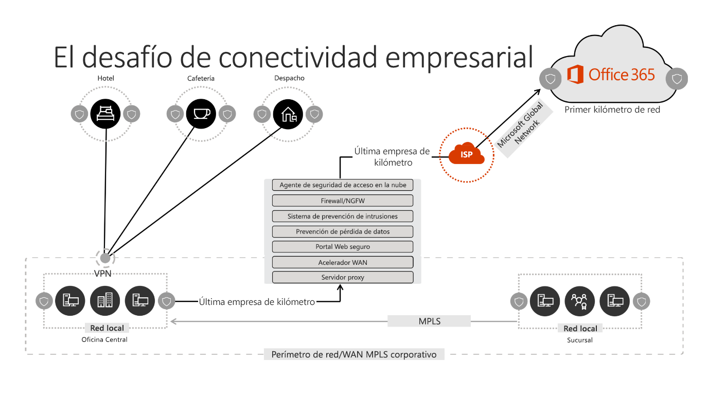
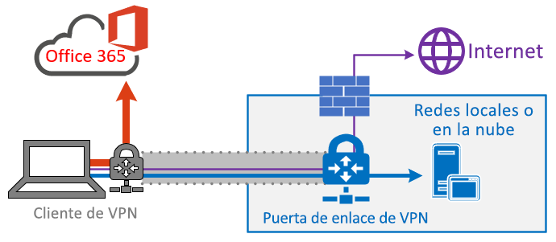
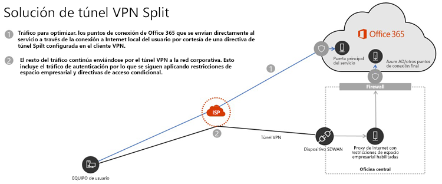

# <a name="implementing-vpn-split-tunnelling-for-office-365"></a><span data-ttu-id="b113f-103">Implementación de túnel dividido de VPN en Office 365</span><span class="sxs-lookup"><span data-stu-id="b113f-103">Implementing VPN split tunnelling for Office 365</span></span>

>[!NOTE]
><span data-ttu-id="b113f-104">Este tema forma parte de un conjunto de temas que tratan la optimización de Office 365 para usuarios remotos.</span><span class="sxs-lookup"><span data-stu-id="b113f-104">This topic is part of a set of topics that address Office 365 optimization for remote users.</span></span>
>- <span data-ttu-id="b113f-105">Para obtener información general sobre el uso de túneles divididos de VPN para optimizar la conectividad de Office 365 para los usuarios remotos, consulte [Información general: túnel dividido de VPN para Office 365](office-365-vpn-split-tunnel.md).</span><span class="sxs-lookup"><span data-stu-id="b113f-105">For an overview of using VPN split tunnelling to optimize Office 365 connectivity for remote users, see [Overview: VPN split tunnelling for Office 365](office-365-vpn-split-tunnel.md).</span></span>
>- <span data-ttu-id="b113f-106">Para obtener más información sobre cómo optimizar el rendimiento de los inquilinos de Office 365 en todo el mundo para los usuarios de China, consulte [Optimización del rendimiento de Office 365 para usuarios de China](office-365-networking-china.md).</span><span class="sxs-lookup"><span data-stu-id="b113f-106">For information about optimizing Office 365 worldwide tenant performance for users in China, see [Office 365 performance optimization for China users](office-365-networking-china.md).</span></span>

<span data-ttu-id="b113f-107">Durante muchos años, las empresas han estado usando VPN para dar soporte a experiencias remotas para sus usuarios.</span><span class="sxs-lookup"><span data-stu-id="b113f-107">For many years enterprises have been using VPNs to support remote experiences for their users.</span></span> <span data-ttu-id="b113f-108">Mientras las cargas de trabajo básicas permanecían en entornos locales, una VPN del cliente remoto enrutada a través de un centro de datos de la red corporativa era el método principal para que los usuarios remotos accediesen a los recursos corporativos.</span><span class="sxs-lookup"><span data-stu-id="b113f-108">Whilst core workloads remained on-premises, a VPN from the remote client routed through a datacenter on the corporate network was the primary method for remote users to access corporate resources.</span></span> <span data-ttu-id="b113f-109">Para salvaguardar estas conexiones, las empresas crean capas de soluciones de seguridad de red a lo largo de las rutas VPN.</span><span class="sxs-lookup"><span data-stu-id="b113f-109">To safeguard these connections, enterprises build layers of network security solutions along the VPN paths.</span></span> <span data-ttu-id="b113f-110">Esto se hizo para proteger la infraestructura interna, así como para salvaguardar la navegación móvil en sitios web externos al redirigir el tráfico a la VPN y, después, al perímetro de Internet local.</span><span class="sxs-lookup"><span data-stu-id="b113f-110">This was done to protect internal infrastructure as well as to safeguard mobile browsing of external web sites by rerouting traffic into the VPN and then out through the on-premises Internet perimeter.</span></span> <span data-ttu-id="b113f-111">Por lo general, las VPN, los perímetros de red y la infraestructura de seguridad asociada se creaban y escalaban para un volumen definido de tráfico, y normalmente la mayoría de las conexiones se iniciaban desde la red corporativa y casi toda dentro de los límites de la red interna.</span><span class="sxs-lookup"><span data-stu-id="b113f-111">VPNs, network perimeters and associated security infrastructure were often purpose built and scaled for a defined volume of traffic, typically with the majority of connectivity being initiated from within the corporate network, and most of it staying withing the internal network boundaries.</span></span>

<span data-ttu-id="b113f-112">Durante mucho tiempo, los modelos de VPN en los que todas las conexiones del dispositivo del usuario remoto se redirigen a la red local (lo que se conoce como **túneles forzados**) fueron altamente sostenibles, siempre y cuando la escala concurrente de usuarios remotos fuese limitada y los volúmenes de tráfico que atravesasen la VPN fuesen bajos.</span><span class="sxs-lookup"><span data-stu-id="b113f-112">For quite some time, VPN models where all connections from the remote user device are routed back into the on-premises network (known as **forced tunnelling**) were largely sustainable as long as the concurrent scale of remote users was modest and the traffic volumes traversing VPN were low.</span></span>  <span data-ttu-id="b113f-113">Algunos clientes siguieron utilizando los túneles forzados de VPN como método principal incluso después de que sus aplicaciones se moviesen de dentro del perímetro corporativo a nubes públicas de SaaS. Office 365 es un buen ejemplo de ello.</span><span class="sxs-lookup"><span data-stu-id="b113f-113">Some customers continued to use VPN force tunnelling as the status quo even after their applications moved from inside the corporate perimeter to public SaaS clouds, Office 365 being a prime example.</span></span>

<span data-ttu-id="b113f-114">El uso de túneles forzados de VPN para conectarse a aplicaciones en la nube de distribución y rendimiento confidenciales es extremadamente deficiente, pero es posible que algunas empresas aceptasen el impacto negativo de esta práctica para mantener su método principal desde el punto de vista de la seguridad.</span><span class="sxs-lookup"><span data-stu-id="b113f-114">The use of forced tunneled VPNs for connecting to distributed and performance sensitive cloud applications is extremely suboptimal, but the negative impact of that may have been accepted by some enterprises so as to maintain the status quo from a security perspective.</span></span> <span data-ttu-id="b113f-115">A continuación se muestra un diagrama de ejemplo de este escenario:</span><span class="sxs-lookup"><span data-stu-id="b113f-115">An example diagram of this scenario can be seen below:</span></span>



<span data-ttu-id="b113f-117">Este problema ha estado creciendo durante varios años, en los que muchos clientes han estado informando de un cambio considerable en los patrones de tráfico de red.</span><span class="sxs-lookup"><span data-stu-id="b113f-117">This problem has been growing for a number of years, with many customers reporting a significant shift of network traffic patterns.</span></span> <span data-ttu-id="b113f-118">El tráfico, que solía mantenerse en entornos locales, ahora se conecta a los puntos de conexión de la nube externa.</span><span class="sxs-lookup"><span data-stu-id="b113f-118">Traffic which used to stay on premises now connects to external cloud endpoints.</span></span> <span data-ttu-id="b113f-119">Muchos clientes de Microsoft han informado de que, en el pasado, alrededor del 80 % del tráfico de red se dirigía a un origen interno (representado por la línea de puntos en el diagrama anterior).</span><span class="sxs-lookup"><span data-stu-id="b113f-119">Numerous Microsoft customers report that previously, around 80% of their network traffic was to some internal source (represented by the dotted line in the above diagram).</span></span> <span data-ttu-id="b113f-120">En 2020 esa cifra ha caído aproximadamente a un 20 % o menos, debido a los desplazamientos de amplios volúmenes de cargas de trabajo a la nube. Estas tendencias no son infrecuentes para otras empresas.</span><span class="sxs-lookup"><span data-stu-id="b113f-120">In 2020 that number is now around 20% or lower as they have shifted major workloads to the cloud, these trends are not uncommon with other enterprises.</span></span> <span data-ttu-id="b113f-121">Con el tiempo, a medida que la nube avanza, el modelo anterior se convierte en algo cada vez más engorroso y menos sostenible, lo que limita la agilidad de la organización para adaptarse a un mundo que da prioridad a la nube.</span><span class="sxs-lookup"><span data-stu-id="b113f-121">Over time, as the cloud journey progresses, the above model becomes increasingly cumbersome and unsustainable, preventing an organization from being agile as they move into a cloud first world.</span></span>

<span data-ttu-id="b113f-122">La crisis mundial de la COVID-19 ha escalado este problema, de forma que necesita una solución inmediata.</span><span class="sxs-lookup"><span data-stu-id="b113f-122">The worldwide COVID-19 crisis has escalated this problem to require immediate remediation.</span></span> <span data-ttu-id="b113f-123">La necesidad de garantizar la seguridad de los empleados ha generado demandas sin precedentes en TI empresarial para dar soporte a la productividad del trabajo desde el hogar a una escala masiva.</span><span class="sxs-lookup"><span data-stu-id="b113f-123">The need to ensure employee safety has generated unprecedented demands on enterprise IT to support work-from-home productivity at a massive scale.</span></span> <span data-ttu-id="b113f-124">Microsoft Office 365 está bien posicionado para cumplir esta demanda, pero la elevada concurrencia de usuarios que trabajan desde casa genera un gran volumen de tráfico en Office 365 que, si se enruta mediante túneles forzados de VPN y perímetros de red local, provocará rápidamente una saturación y la infraestructura de VPN se quedará sin capacidad.</span><span class="sxs-lookup"><span data-stu-id="b113f-124">Microsoft Office 365 is well positioned to help customers fulfil that demand, but high concurrency of users working from home generates a large volume of Office 365 traffic which, if routed through forced tunnel VPN and on-premises network perimeters, causes rapid saturation and runs VPN infrastructure out of capacity.</span></span> <span data-ttu-id="b113f-125">En esta nueva realidad, el uso de VPN para tener acceso a Office 365 ya no es solamente un obstáculo de rendimiento, sino un muro que no solo afecta a Office 365, sino también a operaciones críticas de empresas cuyo funcionamiento todavía depende de la VPN.</span><span class="sxs-lookup"><span data-stu-id="b113f-125">In this new reality, using VPN to access Office 365 is no longer just a performance impediment, but a hard wall which not only impacts Office 365 but critical business operations which still have to rely on the VPN to operate.</span></span>

<span data-ttu-id="b113f-126">Microsoft ha trabajado codo con codo con los clientes y las grandes empresas durante muchos años para ofrecer soluciones eficaces y modernas para estos problemas desde dentro de sus propios servicios, así como para adoptar las prácticas recomendadas del sector.</span><span class="sxs-lookup"><span data-stu-id="b113f-126">Microsoft has been working closely with customers and the wider industry for many years to provide effective, modern solutions to these problems from within our own services, and to align with industry best practice.</span></span> <span data-ttu-id="b113f-127">Los [Principios de conectividad](https://aka.ms/pnc) para el servicio de Office 365 se diseñaron para que funcione de manera eficiente para los usuarios remotos y para que la organización mantenga la seguridad y el control sobre su conectividad.</span><span class="sxs-lookup"><span data-stu-id="b113f-127">[Connectivity principles](https://aka.ms/pnc) for the Office 365 service have been designed to work efficiently for remote users whilst still allowing an organization to maintain security and control over their connectivity.</span></span> <span data-ttu-id="b113f-128">Estas soluciones también se pueden implementar rápidamente y con poco esfuerzo, de forma que tienen un impacto muy positivo en los problemas descritos anteriormente.</span><span class="sxs-lookup"><span data-stu-id="b113f-128">These solutions can also be implemented very quickly with limited work yet achieve a significant positive impact on the problems outlined above.</span></span>

<span data-ttu-id="b113f-129">La estrategia recomendada por Microsoft para optimizar la conectividad de los trabajadores remotos se centra en solucionar rápidamente los problemas con el método tradicional y ofrecer un alto rendimiento con tan solo unos sencillos pasos.</span><span class="sxs-lookup"><span data-stu-id="b113f-129">Microsoft's recommended strategy for optimizing remote worker's connectivity is focused on rapidly alleviating the problems with the traditional approach and also providing high performance with a few simple steps.</span></span> <span data-ttu-id="b113f-130">En estos pasos, se ajusta el enfoque de VPN heredado para un número reducido de puntos de conexión definidos que omiten los servidores VPN con cuellos de botella.</span><span class="sxs-lookup"><span data-stu-id="b113f-130">These steps adjust the legacy VPN approach for a small number of defined endpoints which bypass bottlenecked VPN servers.</span></span> <span data-ttu-id="b113f-131">Se puede aplicar un modelo de seguridad equivalente o incluso superior en diferentes capas para que no sea necesario proteger todo el tráfico de salida de la red corporativa.</span><span class="sxs-lookup"><span data-stu-id="b113f-131">An equivalent or even superior security model can be applied at different layers to remove the need to secure all traffic at the egress of the corporate network.</span></span> <span data-ttu-id="b113f-132">En la mayoría de los casos, esto se puede lograr de forma eficaz en cuestión de horas, y luego escalar a otras cargas de trabajo a medida que sea necesario y el tiempo lo permita.</span><span class="sxs-lookup"><span data-stu-id="b113f-132">In most cases this can be effectively achieved within hours and is then scalable to other workloads as requirements demand and time allows.</span></span>

## <a name="common-vpn-scenarios"></a><span data-ttu-id="b113f-133">Escenarios de VPN comunes</span><span class="sxs-lookup"><span data-stu-id="b113f-133">Common VPN scenarios</span></span>

<span data-ttu-id="b113f-134">En la lista que aparece a continuación se muestran los escenarios de VPN más comunes que se ven en los entornos empresariales.</span><span class="sxs-lookup"><span data-stu-id="b113f-134">In the list below you'll see the most common VPN scenarios seen in enterprise environments.</span></span> <span data-ttu-id="b113f-135">La mayoría de los clientes utiliza el modelo 1 de forma tradicional (túnel forzado de VPN).</span><span class="sxs-lookup"><span data-stu-id="b113f-135">Most customers traditionally operate model 1 (VPN Forced Tunnel).</span></span> <span data-ttu-id="b113f-136">Esta sección le ayudará a realizar una transición rápida y segura al **modelo 2**, que se puede llevar a cabo con relativamente poco esfuerzo y que ofrece enormes ventajas para el rendimiento de la red y la experiencia de usuario.</span><span class="sxs-lookup"><span data-stu-id="b113f-136">This section will help you to quickly and securely transition to **model 2**, which is achievable with relatively little effort, and which has enormous benefits to network performance and user experience.</span></span>

| <span data-ttu-id="b113f-137">**Modelo**</span><span class="sxs-lookup"><span data-stu-id="b113f-137">**Model**</span></span> | <span data-ttu-id="b113f-138">**Descripción**</span><span class="sxs-lookup"><span data-stu-id="b113f-138">**Description**</span></span> |
| --- | --- |
| [<span data-ttu-id="b113f-139">1. Túnel forzado de VPN</span><span class="sxs-lookup"><span data-stu-id="b113f-139">1. VPN Forced Tunnel</span></span>](#1-vpn-forced-tunnel) | <span data-ttu-id="b113f-140">El 100 % del tráfico pasa por el túnel VPN, incluido el local, del de Internet y todas las instancias de O365/M365</span><span class="sxs-lookup"><span data-stu-id="b113f-140">100% of traffic goes into VPN tunnel, including on-premise, Internet and all O365/M365</span></span> |
| [<span data-ttu-id="b113f-141">2. Túnel forzado de VPN con unas pocas excepciones</span><span class="sxs-lookup"><span data-stu-id="b113f-141">2. VPN Forced Tunnel with few exceptions</span></span>](#2-vpn-forced-tunnel-with-a-small-number-of-trusted-exceptions) | <span data-ttu-id="b113f-142">El túnel de VPN se usa de forma predeterminada (la ruta predeterminada apunta a la VPN), con pocos escenarios de exención especialmente importantes que se pueden dirigir directamente</span><span class="sxs-lookup"><span data-stu-id="b113f-142">VPN tunnel is used by default (default route points to VPN), with few, most important exempt scenarios that are allowed to go direct</span></span> |
| [<span data-ttu-id="b113f-143">3. Túnel forzado de VPN con muchas excepciones</span><span class="sxs-lookup"><span data-stu-id="b113f-143">3. VPN Forced Tunnel with broad exceptions</span></span>](#3-vpn-forced-tunnel-with-broad-exceptions) | <span data-ttu-id="b113f-144">El túnel VPN se usa de forma predeterminada (la ruta predeterminada apunta a la VPN), con muchas excepciones que se pueden dirigir directamente (como todas las instancias de Office 365, Salesforce y Zoom).</span><span class="sxs-lookup"><span data-stu-id="b113f-144">VPN tunnel is used by default (default route points to VPN), with broad exceptions that are allowed to go direct (such as all Office 365, All Salesforce, All Zoom)</span></span> |
| [<span data-ttu-id="b113f-145">4. Túnel de VPN selectivo</span><span class="sxs-lookup"><span data-stu-id="b113f-145">4. VPN Selective Tunnel</span></span>](#4-vpn-selective-tunnel) | <span data-ttu-id="b113f-146">El túnel de VPN se usa solo para los servicios basados en la red corporativa.</span><span class="sxs-lookup"><span data-stu-id="b113f-146">VPN tunnel is used only for corpnet based services.</span></span> <span data-ttu-id="b113f-147">La ruta predeterminada (Internet y todos los servicios basados en Internet) se dirige directamente.</span><span class="sxs-lookup"><span data-stu-id="b113f-147">Default route (Internet and all Internet based services) goes direct.</span></span> |
| [<span data-ttu-id="b113f-148">5. No VPN</span><span class="sxs-lookup"><span data-stu-id="b113f-148">5. No VPN</span></span>](#5-no-vpn) | <span data-ttu-id="b113f-149">Una variación del método 2 en la que, en lugar de usar la VPN heredada, todos los servicios corporativos se publican por medio de enfoques de seguridad modernos (como Zscaler ZPA, AAD Proxy/MCAS, etc.)</span><span class="sxs-lookup"><span data-stu-id="b113f-149">A variation of #2, where instead of legacy VPN, all corpnet services are published through modern security approaches (like Zscaler ZPA, AAD Proxy/MCAS, etc)</span></span> |

### <a name="1-vpn-forced-tunnel"></a><span data-ttu-id="b113f-150">1. Túnel forzado de VPN</span><span class="sxs-lookup"><span data-stu-id="b113f-150">1. VPN Forced Tunnel</span></span>

<span data-ttu-id="b113f-151">Este es el escenario de inicio más habitual de la mayoría de los clientes empresariales.</span><span class="sxs-lookup"><span data-stu-id="b113f-151">This is the most common starting scenario for most enterprise customers.</span></span> <span data-ttu-id="b113f-152">Se usa una VPN forzada, lo que significa que el 100 % del tráfico se dirige a la red corporativa, independientemente de si el punto de conexión reside o no dentro de la red corporativa.</span><span class="sxs-lookup"><span data-stu-id="b113f-152">A forced VPN is used which means 100% of traffic is directed into the corporate network regardless of the fact the endpoint resides within the corporate network or not.</span></span> <span data-ttu-id="b113f-153">Cualquier tráfico externo (Internet), como el de Office 365 o la exploración de Internet, se redirige fuera del equipamiento local de seguridad, como los servidores proxy.</span><span class="sxs-lookup"><span data-stu-id="b113f-153">Any external (Internet) bound traffic such as Office 365 or Internet browsing is then hairpinned back out of the on premises security equipment such as proxies.</span></span> <span data-ttu-id="b113f-154">En el clima actual en el que 100 % de los usuarios trabajan de forma remota, este modelo pone una carga muy elevada en la infraestructura de VPN y es probable que obstaculice significativamente el rendimiento de todo el tráfico corporativo y que, por lo tanto, la empresa opere de forma eficaz en un momento de crisis.</span><span class="sxs-lookup"><span data-stu-id="b113f-154">In the current climate with nearly 100% of users working remotely, this model therefore puts extremely high load on the VPN infrastructure and is likely to significantly hinder performance of all corporate traffic and thus the enterprise to operate efficiently at a time of crisis.</span></span>


### <a name="2-vpn-forced-tunnel-with-a-small-number-of-trusted-exceptions"></a><span data-ttu-id="b113f-156">2. Túnel forzado de VPN con unas pocas excepciones de confianza</span><span class="sxs-lookup"><span data-stu-id="b113f-156">2. VPN Forced Tunnel with a small number of trusted exceptions</span></span>

<span data-ttu-id="b113f-157">Este modelo es mucho más eficaz para que la empresa opere, puesto que permite que un pequeño número de puntos de conexión controlados y definidos con una alta sensibilidad a la carga y latencia eluda el túnel de VPN y se dirija directamente al servicio de Office 365 en este ejemplo.</span><span class="sxs-lookup"><span data-stu-id="b113f-157">This model is significantly more efficient for an enterprise to operate under as it allows a small number of controlled and defined endpoints which are very high load and latency sensitive to bypass the VPN tunnel and go direct to the Office 365 service in this example.</span></span> <span data-ttu-id="b113f-158">Esto mejora significativamente el rendimiento de los servicios descargados y también reduce la carga en la infraestructura de VPN, lo que permite a los elementos que aún lo requieren funcionar con una contención inferior de recursos.</span><span class="sxs-lookup"><span data-stu-id="b113f-158">This significantly improves the performance for the offloaded services, and also decreases the load on the VPN infrastructure, thus allowing elements which still require it to operate with lower contention for resources.</span></span> <span data-ttu-id="b113f-159">Este es el modelo en el que este artículo se centra para ayudar con la transición, ya que permite realizar muy rápidamente acciones sencillas y definidas con numerosos resultados positivos.</span><span class="sxs-lookup"><span data-stu-id="b113f-159">It is this model which this article concentrates on assisting with the transition to as it allows for simple, defined actions to be taken very quickly with numerous positive outcomes.</span></span>


### <a name="3-vpn-forced-tunnel-with-broad-exceptions"></a><span data-ttu-id="b113f-161">3. Túnel forzado de VPN con muchas excepciones</span><span class="sxs-lookup"><span data-stu-id="b113f-161">3. VPN Forced Tunnel with broad exceptions</span></span>

<span data-ttu-id="b113f-162">El tercer modelo amplía el ámbito el segundo, puesto que, en lugar de enviar solo un pequeño grupo de puntos de conexión de forma directa, envía todo el tráfico directamente a servicios de confianza como Office 365, SalesForce, etc.</span><span class="sxs-lookup"><span data-stu-id="b113f-162">The third model broadens the scope of model two as rather than just sending a small group of defined endpoints direct, it instead sends all traffic to trusted services such Office 365, SalesForce etc. direct.</span></span> <span data-ttu-id="b113f-163">Esto reduce aún más la carga en la infraestructura VPN corporativa y mejora el rendimiento de los servicios definidos.</span><span class="sxs-lookup"><span data-stu-id="b113f-163">This further reduces the load on the corporate VPN infrastructure and improves the performance of the services defined.</span></span> <span data-ttu-id="b113f-164">Ya que es probable que lleve más tiempo evaluar la viabilidad y la implementación de este modelo, es un paso que probablemente pueda realizarse de forma iterativa en un momento posterior, una vez que el modelo dos se haya implementado correctamente.</span><span class="sxs-lookup"><span data-stu-id="b113f-164">As this model is likely to take more time to assess the feasibility of and implement, it is likely a step which can be taken iteratively at a later date once model two is successfully in place.</span></span>



### <a name="4-vpn-selective-tunnel"></a><span data-ttu-id="b113f-166">4. Túnel de VPN selectivo</span><span class="sxs-lookup"><span data-stu-id="b113f-166">4. VPN selective Tunnel</span></span>

<span data-ttu-id="b113f-167">Este modelo invierte el tercer modelo, puesto que únicamente el tráfico con una dirección IP corporativa identificada se envía por el túnel VPN y, por lo tanto, la ruta de Internet es la predeterminada para todo lo demás.</span><span class="sxs-lookup"><span data-stu-id="b113f-167">This model reverses the third model in that only traffic identified as having a corporate IP address is sent down the VPN tunnel and thus the Internet path is the default route for everything else.</span></span> <span data-ttu-id="b113f-168">Este modelo requiere que la organización se encuentre en una fase avanzada de implementación de [Confianza cero](https://www.microsoft.com/security/zero-trust?rtc=1) para poder implementar el modelo de forma segura.</span><span class="sxs-lookup"><span data-stu-id="b113f-168">This model requires an organization to be well on the path to [Zero Trust](https://www.microsoft.com/security/zero-trust?rtc=1) in able to safely implement this model.</span></span> <span data-ttu-id="b113f-169">Se debe tener en cuenta que es probable que este modelo o alguna variación de él se acabe convirtiendo en el predeterminado con el tiempo, a medida que se vayan trasladando más servicios de la red corporativa a la nube.</span><span class="sxs-lookup"><span data-stu-id="b113f-169">It should be noted that this model or some variation thereof will likely become the necessary default over time as more and more services move away from the corporate network and into the cloud.</span></span> <span data-ttu-id="b113f-170">Microsoft usa este modelo de forma interna. Puede obtener más información sobre la implementación de Microsoft del túnel dividido de VPN en [Funcionando en la VPN: cómo Microsoft conecta a su personal remoto](https://www.microsoft.com/itshowcase/blog/running-on-vpn-how-microsoft-is-keeping-its-remote-workforce-connected/?elevate-lv).</span><span class="sxs-lookup"><span data-stu-id="b113f-170">Microsoft uses this model internally; you can find more information on Microsoft's implementation of VPN split tunnelling at [Running on VPN: How Microsoft is keeping its remote workforce connected](https://www.microsoft.com/itshowcase/blog/running-on-vpn-how-microsoft-is-keeping-its-remote-workforce-connected/?elevate-lv).</span></span>


### <a name="5-no-vpn"></a><span data-ttu-id="b113f-172">5. No VPN</span><span class="sxs-lookup"><span data-stu-id="b113f-172">5. No VPN</span></span>

<span data-ttu-id="b113f-173">Una versión más avanzada del modelo número dos, en la que los servicios internos se publican con un enfoque de seguridad moderno o una solución SDWAN, como Azure AD proxy, MCAS, Zscaler ZPA, etc.</span><span class="sxs-lookup"><span data-stu-id="b113f-173">A more advanced version of model number two, whereby any internal services are published through a modern security approach or SDWAN solution such as Azure AD Proxy, MCAS, Zscaler ZPA etc.</span></span>


## <a name="implement-vpn-split-tunnelling"></a><span data-ttu-id="b113f-175">Implementación de un túnel dividido de VPN</span><span class="sxs-lookup"><span data-stu-id="b113f-175">Implement VPN split tunnelling</span></span>

<span data-ttu-id="b113f-176">En esta sección se describen los pasos sencillos que se deben seguir para migrar la arquitectura de cliente de VPN de un _túnel forzado de VPN_ a un _túnel forzado de VPN con un número reducido de excepciones de confianza,_ [el modelo n.º 2 de túnel dividido de VPN](#2-vpn-forced-tunnel-with-a-small-number-of-trusted-exceptions) en la sección [Escenarios de VPN comunes](#common-vpn-scenarios).</span><span class="sxs-lookup"><span data-stu-id="b113f-176">In this section, you'll find the simple steps required to migrate your VPN client architecture from a _VPN forced tunnel_ to a _VPN forced tunnel with a small number of trusted exceptions_, [VPN split tunnel model #2](#2-vpn-forced-tunnel-with-a-small-number-of-trusted-exceptions) in the [Common VPN scenarios](#common-vpn-scenarios) section.</span></span>

<span data-ttu-id="b113f-177">En el siguiente diagrama se muestra cómo funciona la solución recomendada de túnel dividido de VPN:</span><span class="sxs-lookup"><span data-stu-id="b113f-177">The diagram below illustrates how the recommended VPN split tunnel solution works:</span></span>



### <a name="1-identify-the-endpoints-to-optimize"></a><span data-ttu-id="b113f-179">1. Identificar los puntos de conexión que se deben optimizar</span><span class="sxs-lookup"><span data-stu-id="b113f-179">1. Identify the endpoints to optimize</span></span>

<span data-ttu-id="b113f-180">En el tema [Intervalos de direcciones IP y URL de Office 365](https://docs.microsoft.com/office365/enterprise/urls-and-ip-address-ranges), Microsoft identifica de manera clara los puntos de conexión clave que necesita optimizar y los categoriza como **Optimizar**.</span><span class="sxs-lookup"><span data-stu-id="b113f-180">In the [Office 365 URLs and IP address ranges](https://docs.microsoft.com/office365/enterprise/urls-and-ip-address-ranges) topic, Microsoft clearly identifies the key endpoints you need to optimize and categorizes them as **Optimize**.</span></span> <span data-ttu-id="b113f-181">Actualmente, solo hay cuatro URL que necesitan optimizarse y veinte subredes IP.</span><span class="sxs-lookup"><span data-stu-id="b113f-181">There are currently just four URLS which need to be optimized and twenty IP subnets.</span></span> <span data-ttu-id="b113f-182">Este pequeño grupo de puntos de conexión representa, aproximadamente, entre un 70 % y un 80 % del volumen del tráfico hacia el servicio de Office 365, entre el que se incluyen los puntos de conexión sensibles a la latencia, como los del contenido multimedia de Teams.</span><span class="sxs-lookup"><span data-stu-id="b113f-182">This small group of endpoints accounts for around 70% - 80% of the volume of traffic to the Office 365 service including the latency sensitive endpoints such as those for Teams media.</span></span> <span data-ttu-id="b113f-183">Esencialmente, este es el tráfico con el que es preciso tener un cuidado especial y que pondrá una presión increíble sobre las rutas de red tradicionales y la infraestructura de VPN.</span><span class="sxs-lookup"><span data-stu-id="b113f-183">Essentially this is the traffic that we need to take special care of and is also the traffic which will put incredible pressure on traditional network paths and VPN infrastructure.</span></span>

<span data-ttu-id="b113f-184">Las direcciones URL de esta categoría tienen las siguientes características:</span><span class="sxs-lookup"><span data-stu-id="b113f-184">URLs in this category have the following characteristics:</span></span>

- <span data-ttu-id="b113f-185">Son los puntos de conexión que pertenecen a Microsoft, que también se encarga de administrarlos y alojarlos en su infraestructura</span><span class="sxs-lookup"><span data-stu-id="b113f-185">Are Microsoft owned and managed endpoints, hosted on Microsoft infrastructure</span></span>
- <span data-ttu-id="b113f-186">Se les ofrece IP</span><span class="sxs-lookup"><span data-stu-id="b113f-186">Have IPs provided</span></span>
- <span data-ttu-id="b113f-187">Tienen una baja tasa de cambio y un número esperado reducido (actualmente, 20 subredes IP)</span><span class="sxs-lookup"><span data-stu-id="b113f-187">Low rate of change and are expected to remain small in number (currently 20 IP subnets)</span></span>
- <span data-ttu-id="b113f-188">Tienen ancho de banda o son sensibles a la latencia</span><span class="sxs-lookup"><span data-stu-id="b113f-188">Are bandwidth and/or latency sensitive</span></span>
- <span data-ttu-id="b113f-189">Se les puede proporcionar elementos de seguridad necesarios directamente en el servicio en lugar de en línea en la red</span><span class="sxs-lookup"><span data-stu-id="b113f-189">Are able to have required security elements provided in the service rather than inline on the network</span></span>
- <span data-ttu-id="b113f-190">Suponen aproximadamente entre el 70 % y el 80 % del volumen de tráfico en el servicio de Office 365</span><span class="sxs-lookup"><span data-stu-id="b113f-190">Account for around 70-80% of the volume of traffic to the Office 365 service</span></span>

>[!NOTE]
><span data-ttu-id="b113f-191">Microsoft se ha comprometido a suspender los cambios realizados en **Optimizar** los puntos de conexión de Office 365 hasta al menos el **30 de junio de 2020**, lo que permite que los clientes se centren en otros problemas y no en mantener una lista blanca de puntos de conexión una vez que los implementaran inicialmente.</span><span class="sxs-lookup"><span data-stu-id="b113f-191">Microsoft has committed to suspending changes to **Optimize** endpoints for Office 365 until at least **June 30 2020**, allowing customers to focus on other challenges rather than maintaining the endpoint whitelist once initially implemented.</span></span> <span data-ttu-id="b113f-192">Este artículo se actualizará para reflejar todos los cambios futuros.</span><span class="sxs-lookup"><span data-stu-id="b113f-192">This article will be updated to reflect any future changes.</span></span>

<span data-ttu-id="b113f-193">Para obtener más información acerca de los puntos de conexión de Office 365 y cómo se clasifican y administran, vea el artículo [Administración de puntos de conexión de Office 365](managing-office-365-endpoints.md).</span><span class="sxs-lookup"><span data-stu-id="b113f-193">For more information about Office 365 endpoints and how they are categorized and managed, see the article [Managing Office 365 endpoints](managing-office-365-endpoints.md).</span></span>

#### <a name="optimize-urls"></a><span data-ttu-id="b113f-194">Optimización de direcciones URL</span><span class="sxs-lookup"><span data-stu-id="b113f-194">Optimize URLs</span></span>

<span data-ttu-id="b113f-195">Las direcciones URL que se deben optimizar actualmente se muestran en la siguiente tabla.</span><span class="sxs-lookup"><span data-stu-id="b113f-195">The current Optimize URLs can be found in the table below.</span></span> <span data-ttu-id="b113f-196">En la mayoría de los casos, solo debería necesitar usar puntos de conexión de URL en un [archivo PAC de explorador](managing-office-365-endpoints.md#use-a-pac-file-for-direct-routing-of-vital-office-365-traffic) en el que los puntos de conexión se configuren para enviarse directamente, en lugar de hacerlo al proxy.</span><span class="sxs-lookup"><span data-stu-id="b113f-196">Under most circumstances, you should only need to use URL endpoints in a [browser PAC file](managing-office-365-endpoints.md#use-a-pac-file-for-direct-routing-of-vital-office-365-traffic) where the endpoints are configured to be sent direct, rather than to the proxy.</span></span>

| <span data-ttu-id="b113f-197">Optimización de direcciones URL</span><span class="sxs-lookup"><span data-stu-id="b113f-197">Optimize URLs</span></span> | <span data-ttu-id="b113f-198">Puerto/Protocolo</span><span class="sxs-lookup"><span data-stu-id="b113f-198">Port/Protocol</span></span> | <span data-ttu-id="b113f-199">Objetivo</span><span class="sxs-lookup"><span data-stu-id="b113f-199">Purpose</span></span> |
| --- | --- | --- |
| <https://outlook.office365.com> | <span data-ttu-id="b113f-200">TCP 443</span><span class="sxs-lookup"><span data-stu-id="b113f-200">TCP 443</span></span> | <span data-ttu-id="b113f-201">Esta es una de las direcciones URL primarias que Outlook usa para conectarse a su servidor de Exchange Online y tiene un alto volumen de uso de ancho de banda y recuento de conexiones.</span><span class="sxs-lookup"><span data-stu-id="b113f-201">This is one of the primary URLs Outlook uses to connect to its Exchange Online server and has a high volume of bandwidth usage and connection count.</span></span> <span data-ttu-id="b113f-202">Se requiere una baja latencia de red para las características en línea, entre las que se incluyen: búsqueda instantánea, otros calendarios de buzón, búsqueda libre/ocupada, administrar reglas y alertas, archivo de Exchange Online y mensajes de correo electrónico que salen de la bandeja de salida.</span><span class="sxs-lookup"><span data-stu-id="b113f-202">Low network latency is required for online features including: instant search, other mailbox calendars, free / busy lookup, manage rules and alerts, Exchange online archive, emails departing the outbox.</span></span> |
| <https://outlook.office.com> | <span data-ttu-id="b113f-203">TCP 443</span><span class="sxs-lookup"><span data-stu-id="b113f-203">TCP 443</span></span> | <span data-ttu-id="b113f-204">Esta dirección URL se usa para que Outlook Online Web Access se conecte al servidor de Exchange Online y es sensible a la latencia de red.</span><span class="sxs-lookup"><span data-stu-id="b113f-204">This URL is used for Outlook Online Web Access to connect to Exchange Online server, and is sensitive to network latency.</span></span> <span data-ttu-id="b113f-205">La conectividad es especialmente importante para la carga y descarga de archivos grandes con SharePoint Online.</span><span class="sxs-lookup"><span data-stu-id="b113f-205">Connectivity is particularly required for large file upload and download with SharePoint Online.</span></span> |
| <span data-ttu-id="b113f-206">https://\<tenant\>.sharepoint.com</span><span class="sxs-lookup"><span data-stu-id="b113f-206">https://\<tenant\>.sharepoint.com</span></span> | <span data-ttu-id="b113f-207">TCP 443</span><span class="sxs-lookup"><span data-stu-id="b113f-207">TCP 443</span></span> | <span data-ttu-id="b113f-208">Esta es la dirección URL principal de SharePoint Online y tiene un gran uso de ancho de banda.</span><span class="sxs-lookup"><span data-stu-id="b113f-208">This is the primary URL for SharePoint Online and has high bandwidth usage.</span></span> |
| <span data-ttu-id="b113f-209">https://\<tenant\>-my.sharepoint.com</span><span class="sxs-lookup"><span data-stu-id="b113f-209">https://\<tenant\>-my.sharepoint.com</span></span> | <span data-ttu-id="b113f-210">TCP 443</span><span class="sxs-lookup"><span data-stu-id="b113f-210">TCP 443</span></span> | <span data-ttu-id="b113f-211">Esta es la dirección URL principal de OneDrive para la Empresa y tiene un gran uso de ancho de banda y posiblemente un alto número de conexiones de la Herramienta de sincronización de OneDrive para la Empresa.</span><span class="sxs-lookup"><span data-stu-id="b113f-211">This is the primary URL for OneDrive for Business and has high bandwidth usage and possibly high connection count from the OneDrive for Business Sync tool.</span></span> |
| <span data-ttu-id="b113f-212">Direcciones IP del contenido multimedia de Teams (sin URL)</span><span class="sxs-lookup"><span data-stu-id="b113f-212">Teams Media IPs (no URL)</span></span> | <span data-ttu-id="b113f-213">UDP 3478, 3479, 3480 y 3481</span><span class="sxs-lookup"><span data-stu-id="b113f-213">UDP 3478, 3479, 3480, and 3481</span></span> | <span data-ttu-id="b113f-214">Asignación de detección de retransmisión y tráfico en tiempo real (3478), audio (3479), vídeo (3480) y uso compartido de pantalla de vídeo (3481).</span><span class="sxs-lookup"><span data-stu-id="b113f-214">Relay Discovery allocation and real time traffic (3478), Audio (3479), Video (3480), and Video Screen Sharing (3481).</span></span> <span data-ttu-id="b113f-215">Estos son los puntos de conexión que se usan para Skype Empresarial y el tráfico multimedia (llamadas, reuniones, etc.) de Microsoft Teams.</span><span class="sxs-lookup"><span data-stu-id="b113f-215">These are the endpoints used for Skype for Business and Microsoft Teams Media traffic (calls, meetings etc).</span></span> <span data-ttu-id="b113f-216">La mayoría de los puntos de conexión se proporcionan cuando el cliente de Microsoft Teams establece una llamada (que se incluye en las direcciones IP mostradas para el servicio).</span><span class="sxs-lookup"><span data-stu-id="b113f-216">Most endpoints are provided when the Microsoft Teams client establishes a call (and are contained within the required IPs listed for the service).</span></span> <span data-ttu-id="b113f-217">El uso del protocolo UDP es necesario para obtener la calidad multimedia ideal.</span><span class="sxs-lookup"><span data-stu-id="b113f-217">Use of the UDP protocol is required for optimal media quality.</span></span>   |

<span data-ttu-id="b113f-218">En los ejemplos anteriores, se debe reemplazar al **inquilino** por el nombre de inquilino de Office 365.</span><span class="sxs-lookup"><span data-stu-id="b113f-218">In the above examples, **tenant** should be replaced with your Office 365 tenant name.</span></span> <span data-ttu-id="b113f-219">Por ejemplo, **contoso.onmicrosoft.com** usaría _contoso.sharepoint.com_ y _contoso-my.sharepoint.com_.</span><span class="sxs-lookup"><span data-stu-id="b113f-219">For example, **contoso.onmicrosoft.com** would use _contoso.sharepoint.com_ and _constoso-my.sharepoint.com_.</span></span>

#### <a name="optimize-ip-address-ranges"></a><span data-ttu-id="b113f-220">Optimización de intervalos de direcciones IP</span><span class="sxs-lookup"><span data-stu-id="b113f-220">Optimize IP address ranges</span></span>

<span data-ttu-id="b113f-221">Durante la escritura, estos son los intervalos de direcciones IP a los que corresponden estos puntos de conexión.</span><span class="sxs-lookup"><span data-stu-id="b113f-221">At the time of writing the IP ranges which these endpoints correspond to are as follows.</span></span> <span data-ttu-id="b113f-222">Es **muy** recomendable que use un [script como el de este](https://github.com/microsoft/Office365NetworkTools/tree/master/Scripts/Display%20URL-IPs-Ports%20per%20Category) ejemplo, el [servicio web de dirección IP y URL de Office 365](https://docs.microsoft.com/office365/enterprise/office-365-ip-web-service) o la [página de la dirección IP o URL](https://docs.microsoft.com/office365/enterprise/urls-and-ip-address-ranges) para comprobar si hay actualizaciones al aplicar la configuración, y aplicar una directiva para que se realice esta comprobación de forma periódica.</span><span class="sxs-lookup"><span data-stu-id="b113f-222">It is **very strongly** advised you use a [script such as this](https://github.com/microsoft/Office365NetworkTools/tree/master/Scripts/Display%20URL-IPs-Ports%20per%20Category) example, the [Office 365 IP and URL web service](https://docs.microsoft.com/office365/enterprise/office-365-ip-web-service) or the [URL/IP page](https://docs.microsoft.com/office365/enterprise/urls-and-ip-address-ranges) to check for any updates when applying the configuration, and put a policy in place to do so on a regular basis.</span></span>

```
104.146.128.0/17
13.107.128.0/22
13.107.136.0/22
13.107.18.10/31
13.107.6.152/31
13.107.64.0/18
131.253.33.215/32
132.245.0.0/16
150.171.32.0/22
150.171.40.0/22
191.234.140.0/22
204.79.197.215/32
23.103.160.0/20
40.104.0.0/15
40.108.128.0/17
40.96.0.0/13
52.104.0.0/14
52.112.0.0/14
52.96.0.0/14
52.120.0.0/14
```

### <a name="2-optimize-access-to-these-endpoints-via-the-vpn"></a><span data-ttu-id="b113f-223">2. Optimizar el acceso a estos puntos de conexión a través de la VPN</span><span class="sxs-lookup"><span data-stu-id="b113f-223">2. Optimize access to these endpoints via the VPN</span></span>

<span data-ttu-id="b113f-224">Ya identificados los puntos de conexión críticos, se deben desviar del túnel de VPN y permitirles usar la conexión a Internet local del usuario para conectarse directamente al servicio.</span><span class="sxs-lookup"><span data-stu-id="b113f-224">Now that we have identified these critical endpoints, we need to divert them away from the VPN tunnel and allow them to use the user's local Internet connection to connect directly to the service.</span></span> <span data-ttu-id="b113f-225">La forma en que se logra esto varía en función de la plataforma del equipo y del producto de VPN que se use, pero la mayoría de las soluciones de VPN permite una configuración sencilla de las directivas para aplicar esta lógica.</span><span class="sxs-lookup"><span data-stu-id="b113f-225">The manner in which this is accomplished will vary depending on the VPN product and machine platform used but most VPN solutions will allow some simple configuration of policy to apply this logic.</span></span> <span data-ttu-id="b113f-226">Para obtener instrucciones sobre el túnel dividido específico de la plataforma de VPN, consulte [Guías para obtener más información sobre las plataformas VPN comunes](#howto-guides-for-common-vpn-platforms).</span><span class="sxs-lookup"><span data-stu-id="b113f-226">For information VPN platform-specific split tunnel guidance, see [HOWTO guides for common VPN platforms](#howto-guides-for-common-vpn-platforms).</span></span>

<span data-ttu-id="b113f-227">Si desea probar la solución manualmente, puede ejecutar el siguiente ejemplo de PowerShell para emular la solución en el nivel de la tabla de rutas.</span><span class="sxs-lookup"><span data-stu-id="b113f-227">If you wish to test the solution manually, you can execute the following PowerShell example to emulate the solution at the route table level.</span></span> <span data-ttu-id="b113f-228">Este ejemplo agrega una ruta para cada subred IP del contenido multimedia de Teams a la tabla de rutas.</span><span class="sxs-lookup"><span data-stu-id="b113f-228">This example adds a route for each of the Teams Media IP subnets into the route table.</span></span> <span data-ttu-id="b113f-229">Puede probar el rendimiento del contenido multimedia de Teams antes y después, y observar la diferencia de rutas en los extremos especificados.</span><span class="sxs-lookup"><span data-stu-id="b113f-229">You can test Teams media performance before and after, and observe the difference in routes for the specified endpoints.</span></span>

#### <a name="example-add-teams-media-ip-subnets-into-the-route-table"></a><span data-ttu-id="b113f-230">Ejemplo: agregar subredes IP del contenido multimedia de Teams a la tabla de rutas</span><span class="sxs-lookup"><span data-stu-id="b113f-230">Example: Add Teams Media IP subnets into the route table</span></span>

```powershell
$intIndex = "" # index of the interface connected to the internet
$gateway = "" # default gateway of that interface
$destPrefix = "52.120.0.0/14", "52.112.0.0/14", "13.107.64.0/18" # Teams Media endpoints
# Add routes to the route table
foreach ($prefix in $destPrefix) {New-NetRoute -DestinationPrefix $prefix -InterfaceIndex $intIndex -NextHop $gateway}
```

<span data-ttu-id="b113f-231">En el script anterior, _$intIndex_ es el índice de la interfaz conectada a Internet (puede buscarla si ejecuta **get-netadapter** en PowerShell y se fija en el valor de _ifIndex_) y _$Gateway_ es la puerta de enlace predeterminada de esa interfaz (puede buscarla si ejecuta **ipconfig** en un símbolo del sistema o **(Get-NetIPConfiguration | Foreach IPv4DefaultGateway).NextHop** en PowerShell).</span><span class="sxs-lookup"><span data-stu-id="b113f-231">In the above script, _$intIndex_ is the index of the interface connected to the internet (find by running **get-netadapter** in PowerShell; look for the value of _ifIndex_) and _$gateway_ is the default gateway of that interface (find by running **ipconfig** in a command prompt or **(Get-NetIPConfiguration | Foreach IPv4DefaultGateway).NextHop** in PowerShell).</span></span>

<span data-ttu-id="b113f-232">Una vez que haya agregado las rutas, puede confirmar que la tabla de rutas es la correcta, para ello, ejecute **route print** en un símbolo del sistema o PowerShell.</span><span class="sxs-lookup"><span data-stu-id="b113f-232">Once you have added the routes, you can confirm that the route table is correct by running **route print** in a command prompt or PowerShell.</span></span> <span data-ttu-id="b113f-233">El resultado debe contener las rutas que agregó y mostrar el índice de la interfaz (_22_ en este ejemplo) y la puerta de enlace para dicha interfaz (_192.168.1.1_ en este ejemplo):</span><span class="sxs-lookup"><span data-stu-id="b113f-233">The output should contain the routes you added, showing the interface index (_22_ in this example) and the gateway for that interface (_192.168.1.1_ in this example):</span></span>


<span data-ttu-id="b113f-235">Para agregar rutas para **todos** los intervalos de direcciones IP actuales en la categoría Optimizar, puede usar la siguiente variación de script para consultar el [servicio web de direcciones IP y URL de Office 365](https://docs.microsoft.com/office365/enterprise/office-365-ip-web-service) para el conjunto actual de subredes IP de la categoría Optimizar, y para agregarlo a la tabla de rutas.</span><span class="sxs-lookup"><span data-stu-id="b113f-235">To add routes for **all** current IP address ranges in the Optimize category, you can use the following script variation to query the [Office 365 IP and URL web service](https://docs.microsoft.com/office365/enterprise/office-365-ip-web-service) for the current set of Optimize IP subnets and add them to the route table.</span></span>

#### <a name="example-add-all-optimize-subnets-into-the-route-table"></a><span data-ttu-id="b113f-236">Ejemplo: agregar subredes IP de la categoría Optimizar a la tabla de rutas</span><span class="sxs-lookup"><span data-stu-id="b113f-236">Example: Add all Optimize subnets into the route table</span></span>

```powershell
$intIndex = "" # index of the interface connected to the internet
$gateway = "" # default gateway of that interface
# Query the web service for IPs in the Optimize category
$ep = Invoke-RestMethod ("https://endpoints.office.com/endpoints/worldwide?clientrequestid=" + ([GUID]::NewGuid()).Guid)
# Output only IPv4 Optimize IPs to $optimizeIps
$destPrefix = $ep | where {$_.category -eq "Optimize"} | Select-Object -ExpandProperty ips | Where-Object { $_ -like '*.*' }
# Add routes to the route table
foreach ($prefix in $destPrefix) {New-NetRoute -DestinationPrefix $prefix -InterfaceIndex $intIndex -NextHop $gateway}
```

<span data-ttu-id="b113f-237">Si ha agregado accidentalmente rutas con parámetros incorrectos o si simplemente desea revertir los cambios, puede quitar las rutas que acaba de agregar con el siguiente comando:</span><span class="sxs-lookup"><span data-stu-id="b113f-237">If you inadvertently added routes with incorrect parameters or simply wish to revert your changes, you can remove the routes you just added with the following command:</span></span>

```powershell
foreach ($prefix in $destPrefix) {Remove-NetRoute -DestinationPrefix $prefix -InterfaceIndex $intIndex -NextHop $gateway}
```

<!--- remmed until we add more reliable interface selection logic
#### Example script to add Teams Media subnets to the route table

```powershell
$adapter = get-netadapter | ? {$_.Status -eq "Up"}
$adapterIndex = $adapter.ifIndex
$gateway = (Get-NetIPConfiguration | Foreach IPv4DefaultGateway).NextHop

$destPrefix = "52.120.0.0/14", "52.112.0.0/14", "13.107.64.0/18"
foreach ($prefix in $destPrefix) {New-NetRoute -DestinationPrefix $prefix -InterfaceIndex $intIndex -NextHop $gateway}
```
-->

<span data-ttu-id="b113f-238">El cliente VPN debe configurarse para que el tráfico a las direcciones IP de la categoría **Optimizar** se enrute de esta forma.</span><span class="sxs-lookup"><span data-stu-id="b113f-238">The VPN client should be configured so that traffic to the **Optimize** IPs are routed in this way.</span></span> <span data-ttu-id="b113f-239">Esto permite que el tráfico utilice recursos locales de Microsoft, como las puertas delanteras del servicio Office 365, [como Azure Front Door](https://azure.microsoft.com/blog/azure-front-door-service-is-now-generally-available/), que ofrece los servicios de Office 365 y los extremos de conectividad más cercanos a los usuarios.</span><span class="sxs-lookup"><span data-stu-id="b113f-239">This allows the traffic to utilize local Microsoft resources such as Office 365 Service Front Doors [such as the Azure Front Door](https://azure.microsoft.com/blog/azure-front-door-service-is-now-generally-available/) which deliver Office 365 services and connectivity endpoints as close to your users as possible.</span></span> <span data-ttu-id="b113f-240">Esto permite ofrecer un alto nivel de rendimiento a los usuarios, independientemente de en qué parte del mundo se encuentren, y aprovechar al máximo la [red global de nivel mundial de Microsoft](https://azure.microsoft.com/blog/how-microsoft-builds-its-fast-and-reliable-global-network/), que probablemente se encuentre a escasos milisegundos de la salida directa de los usuarios.</span><span class="sxs-lookup"><span data-stu-id="b113f-240">This allows us to deliver extremely high performance levels to users wherever they are in the world and takes full advantage of [Microsoft's world class global network](https://azure.microsoft.com/blog/how-microsoft-builds-its-fast-and-reliable-global-network/), which is very likely within a small number of milliseconds of your users' direct egress.</span></span>

## <a name="configuring-and-securing-teams-media-traffic"></a><span data-ttu-id="b113f-241">Configuración y protección del tráfico multimedia de Teams</span><span class="sxs-lookup"><span data-stu-id="b113f-241">Configuring and securing Teams media traffic</span></span>

<span data-ttu-id="b113f-242">Algunos administradores pueden necesitar información más detallada sobre cómo funcionan los flujos de llamadas en Teams con un modelo de túnel dividido y cómo se protegen las conexiones.</span><span class="sxs-lookup"><span data-stu-id="b113f-242">Some administrators may require more detailed information on how call flows operate in Teams using a split tunnelling model and how connections are secured.</span></span>

### <a name="configuration"></a><span data-ttu-id="b113f-243">Configuración</span><span class="sxs-lookup"><span data-stu-id="b113f-243">Configuration</span></span>

<span data-ttu-id="b113f-244">Tanto para llamadas como para reuniones, siempre y cuando se hayan dispuesto correctamente en la tabla de rutas las subredes IP de la categoría Optimizar para el contenido multimedia de Teams, cuando Teams llama al método _GetBestRoute_ para determinar la interfaz que debe usar para un destino en particular, se devolverá la interfaz local para los destinos de Microsoft en los bloques de direcciones IP de Microsoft enumerados anteriormente.</span><span class="sxs-lookup"><span data-stu-id="b113f-244">For both calls and meetings, as long as the required Optimize IP subnets for Teams media are correctly in place in the route table, when Teams calls the _GetBestRoute_ method to determine which interface it should use for a particular destination, the local interface will be returned for Microsoft destinations in the Microsoft IP blocks listed above.</span></span>

<span data-ttu-id="b113f-245">Algunos programas de cliente de VPN permiten la manipulación del enrutamiento en función de la dirección URL.</span><span class="sxs-lookup"><span data-stu-id="b113f-245">Some VPN client software allows routing manipulation based on URL.</span></span> <span data-ttu-id="b113f-246">Pero el tráfico multimedia de Teams no tiene una dirección URL asociada, por lo que el control del enrutamiento para este tráfico tiene que realizarse mediante subredes IP.</span><span class="sxs-lookup"><span data-stu-id="b113f-246">However, Teams media traffic has no URL associated with it, so control of routing for this traffic must be done using IP subnets.</span></span>

<span data-ttu-id="b113f-247">En determinadas situaciones, a menudo no relacionadas con la configuración del cliente de Teams, el tráfico multimedia atraviesa igualmente el túnel de VPN aunque se hayan dispuesto las rutas correctas.</span><span class="sxs-lookup"><span data-stu-id="b113f-247">In certain scenarios, often unrelated to Teams client configuration, media traffic still traverses the VPN tunnel even with the correct routes in place.</span></span> <span data-ttu-id="b113f-248">Si este es el caso, debería bastar con usar una regla de firewall para evitar que las subredes IP o puertos de Teams usen la VPN.</span><span class="sxs-lookup"><span data-stu-id="b113f-248">If you encounter this scenario then using a firewall rule to block the Teams IP subnets or ports from using the VPN should suffice.</span></span>

<span data-ttu-id="b113f-249">Un requisito actual para que esto funcione en el 100 % de los escenarios es que también se agregue el intervalo de dirección IP **13.107.60.1/32**.</span><span class="sxs-lookup"><span data-stu-id="b113f-249">A current requirement for this to work in 100% of scenarios is to also add the IP range **13.107.60.1/32**.</span></span> <span data-ttu-id="b113f-250">Pronto no será necesario gracias a una actualización en el cliente más reciente de Teams, que se publicará a comienzos de **abril de 2020**.</span><span class="sxs-lookup"><span data-stu-id="b113f-250">This should not be necessary very shortly due to an update in the latest Teams client due for release in early **April 2020**.</span></span> <span data-ttu-id="b113f-251">Actualizaremos este artículo con los detalles de la compilación tan pronto como esté disponible la información.</span><span class="sxs-lookup"><span data-stu-id="b113f-251">We will update this article with the build details as soon as this information is available.</span></span>

<span data-ttu-id="b113f-252">El tráfico de señalización se lleva a cabo en HTTPS y no es tan sensible a la latencia como el tráfico multimedia, y está marcado como **Permitir** en los datos de URL/IP, por lo que puede enrutarse de forma segura a través del cliente VPN si se desea.</span><span class="sxs-lookup"><span data-stu-id="b113f-252">Signalling traffic is performed over HTTPS and is not as latency sensitive as the media traffic and is marked as **Allow** in the URL/IP data and thus can safely be routed through the VPN client if desired.</span></span>

### <a name="security"></a><span data-ttu-id="b113f-253">Seguridad</span><span class="sxs-lookup"><span data-stu-id="b113f-253">Security</span></span>

<span data-ttu-id="b113f-254">Un argumento común para evitar los túneles divididos es que es menos seguro utilizarlos, es decir,</span><span class="sxs-lookup"><span data-stu-id="b113f-254">One common argument for avoiding split tunnels is that it is less secure to do so, i.e</span></span> <span data-ttu-id="b113f-255">el tráfico que no atraviese el túnel VPN no se beneficiará del esquema de cifrado que se aplique al túnel VPN, y por lo tanto será menos seguro.</span><span class="sxs-lookup"><span data-stu-id="b113f-255">any traffic that does not go through the VPN tunnel will not benefit from whatever encryption scheme is applied to the VPN tunnel, and is therefore less secure.</span></span>

<span data-ttu-id="b113f-256">El principal argumento contra esta idea es que el tráfico multimedia ya está cifrado mediante _protocolo de transporte en tiempo real seguro (SRTP)_, un perfil del protocolo de transporte en tiempo real (RTP) que proporciona confidencialidad, autenticación y protección contra ataques de reproducciones al tráfico RTP.</span><span class="sxs-lookup"><span data-stu-id="b113f-256">The main counter-argument to this is that media traffic is already encrypted via _Secure Real-Time Transport Protocol (SRTP)_, a profile of Real-Time Transport Protocol (RTP) that provides confidentiality, authentication, and replay attack protection to RTP traffic.</span></span> <span data-ttu-id="b113f-257">SRTP se basa en una clave de sesión generada al azar, que se intercambia mediante el canal de señalización protegida de TLS.</span><span class="sxs-lookup"><span data-stu-id="b113f-257">SRTP itself relies on a randomly generated session key, which is exchanged via the TLS secured signaling channel.</span></span> <span data-ttu-id="b113f-258">Este se trata de forma detallada en [esta guía de seguridad](https://docs.microsoft.com/skypeforbusiness/optimizing-your-network/security-guide-for-skype-for-business-online), pero la sección principal de interés es el cifrado multimedia.</span><span class="sxs-lookup"><span data-stu-id="b113f-258">This is covered in great detail within [this security guide](https://docs.microsoft.com/skypeforbusiness/optimizing-your-network/security-guide-for-skype-for-business-online), but the primary section of interest is media encryption.</span></span>

<span data-ttu-id="b113f-259">El tráfico multimedia se cifra con SRTP, que usa una clave de sesión generada por un generador de números aleatorios seguros y se intercambia con el canal TLS de señalización.</span><span class="sxs-lookup"><span data-stu-id="b113f-259">Media traffic is encrypted using SRTP, which uses a session key generated by a secure random number generator and exchanged using the signaling TLS channel.</span></span> <span data-ttu-id="b113f-260">Además, el contenido multimedia que fluye en ambas direcciones entre el servidor de mediación y el próximo salto interno también se cifra con SRTP.</span><span class="sxs-lookup"><span data-stu-id="b113f-260">In addition, media flowing in both directions between the Mediation Server and its internal next hop is also encrypted using SRTP.</span></span>

<span data-ttu-id="b113f-261">Skype Empresarial Online genera nombres de usuario o contraseñas para proteger el acceso a relés multimedia mediante _retransmisiones de uso de recorrido por NAT (TURN)_.</span><span class="sxs-lookup"><span data-stu-id="b113f-261">Skype for Business Online generates username/passwords for secure access to media relays over _Traversal Using Relays around NAT (TURN)_.</span></span> <span data-ttu-id="b113f-262">Los relés multimedia intercambian el nombre de usuario/contraseña a través de un canal SIP protegido con TLS.</span><span class="sxs-lookup"><span data-stu-id="b113f-262">Media relays exchange the username/password over a TLS-secured SIP channel.</span></span> <span data-ttu-id="b113f-263">Es importante tener en cuenta que, aunque se puede usar un túnel VPN para conectar el cliente a la red corporativa, el tráfico debe fluir en su forma SRTP cuando sale de la red corporativa para llegar al servicio.</span><span class="sxs-lookup"><span data-stu-id="b113f-263">It is worth noting that even though a VPN tunnel may be used to connect the client to the corporate network, the traffic still needs to flow in its SRTP form when it leaves the corporate network to reach the service.</span></span>

<span data-ttu-id="b113f-264">Puede obtener información acerca de cómo Teams mitiga los problemas de seguridad comunes, como los ataques de amplificación de las utilidades de voz o _de recorrido de sesión para NAT (STUN)_, [en este artículo](https://docs.microsoft.com/openspecs/office_protocols/ms-ice2/69525351-8c68-4864-b8a6-04bfbc87785c).</span><span class="sxs-lookup"><span data-stu-id="b113f-264">Information on how Teams mitigates common security concerns such as voice or _Session Traversal Utilities for NAT (STUN)_ amplification attacks can be [found in this article](https://docs.microsoft.com/openspecs/office_protocols/ms-ice2/69525351-8c68-4864-b8a6-04bfbc87785c).</span></span>

<span data-ttu-id="b113f-265">También podrá obtener más información acerca de los controles de seguridad modernos en los escenarios de trabajo remoto en [Formas alternativas para que los profesionales de seguridad y de TI logren controles de seguridad modernos en los escenarios de trabajo remoto de hoy día (blog del Equipo de seguridad de Microsoft)](https://www.microsoft.com/security/blog/2020/03/26/alternative-security-professionals-it-achieve-modern-security-controls-todays-unique-remote-work-scenarios/).</span><span class="sxs-lookup"><span data-stu-id="b113f-265">You can also read about modern security controls in remote work scenarios at [Alternative ways for security professionals and IT to achieve modern security controls in today's unique remote work scenarios (Microsoft Security Team blog)](https://www.microsoft.com/security/blog/2020/03/26/alternative-security-professionals-it-achieve-modern-security-controls-todays-unique-remote-work-scenarios/).</span></span>

## <a name="testing"></a><span data-ttu-id="b113f-266">Pruebas</span><span class="sxs-lookup"><span data-stu-id="b113f-266">Testing</span></span>

<span data-ttu-id="b113f-267">Una vez que la directiva se haya implementado, debe asegurarse de que funciona de la forma esperada.</span><span class="sxs-lookup"><span data-stu-id="b113f-267">Once the policy is in place, you should confirm it is working as expected.</span></span> <span data-ttu-id="b113f-268">Hay varias formas de probar si la ruta de acceso se ha configurado correctamente para usar la conexión a Internet local:</span><span class="sxs-lookup"><span data-stu-id="b113f-268">There are multiple ways of testing the path is correctly set to use the local Internet connection:</span></span>

- <span data-ttu-id="b113f-269">Ejecute la [prueba de conectividad de Microsoft 365](https://aka.ms/netonboard), que ejecutará pruebas de conectividad automáticas, que incluyen las rutas de seguimiento, como se indicó anteriormente.</span><span class="sxs-lookup"><span data-stu-id="b113f-269">Run the [Microsoft 365 connectivity test](https://aka.ms/netonboard) which will run connectivity tests for you including trace routes as above.</span></span> <span data-ttu-id="b113f-270">También se agregarán pruebas de VPN a esta herramienta, que ofrecerán información adicional.</span><span class="sxs-lookup"><span data-stu-id="b113f-270">We're also adding in VPN tests into this tooling which should also provide some additional insight.</span></span>

- <span data-ttu-id="b113f-271">Un sencillo tracert para un punto de conexión dentro del alcance del túnel dividido debe mostrar la ruta de acceso que se ha tomado, por ejemplo:</span><span class="sxs-lookup"><span data-stu-id="b113f-271">A simple tracert to an endpoint within scope of the split tunnel should show the path taken, for example:</span></span>

  ```powershell
  tracert worldaz.tr.teams.microsoft.com
  ```

  <span data-ttu-id="b113f-272">Debería ver una ruta de acceso a través del ISP local hacia este punto de conexión, que debe resolverse en una dirección IP en los intervalos de Teams que se han configurado para túnel dividido.</span><span class="sxs-lookup"><span data-stu-id="b113f-272">You should then see a path via the local ISP to this endpoint which should resolve to an IP in the Teams ranges we have configured for split tunnelling.</span></span>

- <span data-ttu-id="b113f-273">Realice una captura de red con una herramienta como Wireshark.</span><span class="sxs-lookup"><span data-stu-id="b113f-273">Take a network capture using a tool such as Wireshark.</span></span> <span data-ttu-id="b113f-274">Filtre por UDP durante una llamada y debería ver el tráfico que fluye a una dirección IP en el intervalo **Optimizar** de Teams.</span><span class="sxs-lookup"><span data-stu-id="b113f-274">Filter on UDP during a call and you should see traffic flowing to an IP in the Teams **Optimize** range.</span></span> <span data-ttu-id="b113f-275">Si el túnel VPN se usa para este tráfico, el tráfico multimedia no estará visible en el seguimiento.</span><span class="sxs-lookup"><span data-stu-id="b113f-275">If the VPN tunnel is being used for this traffic, then the media traffic will not be visible in the trace.</span></span>

### <a name="additional-support-logs"></a><span data-ttu-id="b113f-276">Registros de soporte adicional</span><span class="sxs-lookup"><span data-stu-id="b113f-276">Additional support logs</span></span>

<span data-ttu-id="b113f-277">Si necesita más datos para solucionar problemas o bien asistencia del soporte técnico de Microsoft, la obtención de la siguiente información le permite acelerar la búsqueda de una solución.</span><span class="sxs-lookup"><span data-stu-id="b113f-277">If you need further data to troubleshoot, or are requesting assistance from Microsoft support, obtaining the following information should allow you to expedite finding a solution.</span></span> <span data-ttu-id="b113f-278">El **conjunto de herramientas de scripts de solución de problemas universal basado en CMD de Windows** del soporte técnico de Microsoft puede ayudarle a recopilar los registros relevantes de forma sencilla.</span><span class="sxs-lookup"><span data-stu-id="b113f-278">Microsoft support's **TSS Windows CMD based universal TroubleShooting Script toolset** can help you to collect the relevant logs in a simple manner.</span></span> <span data-ttu-id="b113f-279">La herramienta y las instrucciones de uso se pueden encontrar en <https://aka.ms/TssTools.></span><span class="sxs-lookup"><span data-stu-id="b113f-279">The tool and instructions on use can be found at <https://aka.ms/TssTools.></span></span>

## <a name="howto-guides-for-common-vpn-platforms"></a><span data-ttu-id="b113f-280">Guías paso a paso para plataformas VPN comunes</span><span class="sxs-lookup"><span data-stu-id="b113f-280">HOWTO guides for common VPN platforms</span></span>

<span data-ttu-id="b113f-281">En esta sección se proporcionan vínculos a guías detalladas para implementar túneles divididos para el tráfico de Office 365 de los partners más comunes de este espacio.</span><span class="sxs-lookup"><span data-stu-id="b113f-281">This section provides links to detailed guides for implementing split tunnelling for Office 365 traffic from the most common partners in this space.</span></span> <span data-ttu-id="b113f-282">Se agregarán guías adicionales a medida que estén disponibles.</span><span class="sxs-lookup"><span data-stu-id="b113f-282">We'll add additional guides as they become available.</span></span>

- <span data-ttu-id="b113f-283">**Cliente VPN de Windows 10**: [optimizar el tráfico de Office 365 para trabajadores remotos con el cliente VPN nativo de Windows 10](https://docs.microsoft.com/windows/security/identity-protection/vpn/vpn-office-365-optimization)</span><span class="sxs-lookup"><span data-stu-id="b113f-283">**Windows 10 VPN client**: [Optimizing Office 365 traffic for remote workers with the native Windows 10 VPN client](https://docs.microsoft.com/windows/security/identity-protection/vpn/vpn-office-365-optimization)</span></span>
- <span data-ttu-id="b113f-284">**Cisco AnyConnect**: [Optimize Anyconnect Split Tunnel for Office 365 (Optimización del túnel dividido de AnyConnect para Office 365)](https://www.cisco.com/c/en/us/support/docs/security/anyconnect-secure-mobility-client/215343-optimize-anyconnect-split-tunnel-for-off.html)</span><span class="sxs-lookup"><span data-stu-id="b113f-284">**Cisco Anyconnect**: [Optimize Anyconnect Split Tunnel for Office365](https://www.cisco.com/c/en/us/support/docs/security/anyconnect-secure-mobility-client/215343-optimize-anyconnect-split-tunnel-for-off.html)</span></span>
- <span data-ttu-id="b113f-285">**Palo Alto GlobalProtect**: [optimiza el tráfico de Office 365 mediante un túnel dividido de VPN para excluir la ruta de acceso](https://live.paloaltonetworks.com/t5/Prisma-Access-Articles/GlobalProtect-Optimizing-Office-365-Traffic/ta-p/319669)</span><span class="sxs-lookup"><span data-stu-id="b113f-285">**Palo Alto GlobalProtect**: [Optimizing Office 365 Traffic via VPN Split Tunnel Exclude Access Route](https://live.paloaltonetworks.com/t5/Prisma-Access-Articles/GlobalProtect-Optimizing-Office-365-Traffic/ta-p/319669)</span></span>
- <span data-ttu-id="b113f-286">**F5 Networks BIG-IP APM**: [optimiza el tráfico de Office 365 en el acceso remoto mediante redes VPN al usar BIG-IP APM](https://devcentral.f5.com/s/articles/SSL-VPN-Split-Tunneling-and-Office-365)</span><span class="sxs-lookup"><span data-stu-id="b113f-286">**F5 Networks BIG-IP APM**: [Optimizing Office 365 traffic on Remote Access through VPNs when using BIG-IP APM](https://devcentral.f5.com/s/articles/SSL-VPN-Split-Tunneling-and-Office-365)</span></span>
- <span data-ttu-id="b113f-287">**Citrix Gateway**: [optimización del túnel dividido de VPN de Citrix Gateway para Office365](https://docs.citrix.com/es-ES/citrix-gateway/13/optimizing-citrix-gateway-vpn-split-tunnel-for-office365.html)</span><span class="sxs-lookup"><span data-stu-id="b113f-287">**Citrix Gateway**: [Optimizing Citrix Gateway VPN split tunnel for Office365](https://docs.citrix.com/es-ES/citrix-gateway/13/optimizing-citrix-gateway-vpn-split-tunnel-for-office365.html)</span></span>
- <span data-ttu-id="b113f-288">**Pulse Secure**: [Túnel VPN: Cómo configurar el túnel dividido para excluir aplicaciones de Office 365](https://kb.pulsesecure.net/articles/Pulse_Secure_Article/KB44417)</span><span class="sxs-lookup"><span data-stu-id="b113f-288">**Pulse Secure**: [VPN Tunneling: How to configure split tunneling to exclude Office365 applications](https://kb.pulsesecure.net/articles/Pulse_Secure_Article/KB44417)</span></span>

## <a name="faq"></a><span data-ttu-id="b113f-289">Preguntas más frecuentes</span><span class="sxs-lookup"><span data-stu-id="b113f-289">FAQ</span></span>

<span data-ttu-id="b113f-290">El Equipo de Seguridad de Microsoft ha publicado[un artículo](https://www.microsoft.com/security/blog/2020/03/26/alternative-security-professionals-it-achieve-modern-security-controls-todays-unique-remote-work-scenarios/) que destaca formas clave para que los profesionales de seguridad y de TI logren controles de seguridad modernos en los escenarios de trabajo remoto específicos.</span><span class="sxs-lookup"><span data-stu-id="b113f-290">The Microsoft Security Team have published [an article](https://www.microsoft.com/security/blog/2020/03/26/alternative-security-professionals-it-achieve-modern-security-controls-todays-unique-remote-work-scenarios/) which outlines key ways for security professionals and IT can achieve modern security controls in today's unique remote work scenarios.</span></span> <span data-ttu-id="b113f-291">Además, a continuación se muestran algunas de las preguntas de los clientes más comunes acerca de este tema, con sus respuestas.</span><span class="sxs-lookup"><span data-stu-id="b113f-291">In addition, below are some of the common customer questions and answers on this subject.</span></span>

### <a name="how-do-i-stop-users-accessing-other-tenants-i-do-not-trust-where-they-could-exfiltrate-data"></a><span data-ttu-id="b113f-292">¿Cómo puedo evitar que los usuarios tengan acceso a otros inquilinos en los que se pueden filtrar datos?</span><span class="sxs-lookup"><span data-stu-id="b113f-292">How do I stop users accessing other tenants I do not trust where they could exfiltrate data?</span></span>

<span data-ttu-id="b113f-293">La respuesta es una [característica denominada restricciones de inquilino](https://docs.microsoft.com/azure/active-directory/manage-apps/tenant-restrictions).</span><span class="sxs-lookup"><span data-stu-id="b113f-293">The answer is a [feature called tenant restrictions](https://docs.microsoft.com/azure/active-directory/manage-apps/tenant-restrictions).</span></span> <span data-ttu-id="b113f-294">El tráfico de autenticación no es de gran volumen ni es especialmente sensible a la latencia, por lo que puede enviarse por la solución de VPN al proxy local donde se aplica la característica.</span><span class="sxs-lookup"><span data-stu-id="b113f-294">Authentication traffic is not high volume nor especially latency sensitive so can be sent through the VPN solution to the on-premises proxy where the feature is applied.</span></span> <span data-ttu-id="b113f-295">Aquí se mantiene una lista de inquilinos de confianza permitidos, y si el cliente intenta obtener un token para un inquilino que no es de confianza, el servidor proxy simplemente deniega la solicitud.</span><span class="sxs-lookup"><span data-stu-id="b113f-295">An allow list of trusted tenants is maintained here and if the client attempts to obtain a token to a tenant which is not trusted, the proxy simply denies the request.</span></span> <span data-ttu-id="b113f-296">Si el inquilino es de confianza, se puede obtener el token si el usuario tiene las credenciales y los derechos adecuados.</span><span class="sxs-lookup"><span data-stu-id="b113f-296">If the tenant is trusted, then a token is accessible if the user has the right credentials and rights.</span></span>

<span data-ttu-id="b113f-297">Por lo tanto, aunque un usuario pueda realizar una conexión TCP/UDP a los puntos de conexión de Optimizar marcados anteriores, sin un token válido para acceder al inquilino en cuestión, simplemente no podrán iniciar sesión y acceder a los datos ni moverlos.</span><span class="sxs-lookup"><span data-stu-id="b113f-297">So even though a user can make a TCP/UDP connection to the Optimize marked endpoints above, without a valid token to access the tenant in question, they simply cannot login and access/move any data.</span></span>

### <a name="does-this-model-allow-access-to-consumer-services-such-as-personal-onedrive-accounts"></a><span data-ttu-id="b113f-298">¿Permite este modelo el acceso a los servicios al consumidor, como cuentas de OneDrive personales?</span><span class="sxs-lookup"><span data-stu-id="b113f-298">Does this model allow access to consumer services such as personal OneDrive accounts?</span></span>

<span data-ttu-id="b113f-299">No, los puntos de conexión de Office 365 no son los mismos que los servicios de consumidor (por ejemplo, Onedrive.live.com), por lo que el túnel dividido no permitirá que un usuario acceda directamente a los servicios al consumidor.</span><span class="sxs-lookup"><span data-stu-id="b113f-299">No, it does not, the Office 365 endpoints are not the same as the consumer services (Onedrive.live.com as an example) so the split tunnel will not allow a user to directly access consumer services.</span></span> <span data-ttu-id="b113f-300">El tráfico a los puntos de conexión de consumidor seguirá utilizando el túnel VPN y seguirán aplicándose las directivas existentes.</span><span class="sxs-lookup"><span data-stu-id="b113f-300">Traffic to consumer endpoints will continue to use the VPN tunnel and existing policies will continue to apply.</span></span>

### <a name="how-do-i-apply-dlp-and-protect-my-sensitive-data-when-the-traffic-no-longer-flows-through-my-on-premises-solution"></a><span data-ttu-id="b113f-301">¿Cómo puedo aplicar DLP y proteger mis datos confidenciales cuando el tráfico ya no circule por la solución local?</span><span class="sxs-lookup"><span data-stu-id="b113f-301">How do I apply DLP and protect my sensitive data when the traffic no longer flows through my on-premises solution?</span></span>

<span data-ttu-id="b113f-302">Para ayudarle a evitar la divulgación accidental de información confidencial, Office 365 tiene un conjunto completo de [herramientas integradas](https://docs.microsoft.com/microsoft-365/compliance/data-loss-prevention-policies?view=o365-worldwide).</span><span class="sxs-lookup"><span data-stu-id="b113f-302">To help you prevent the accidental disclosure of sensitive information, Office 365 has a rich set of [built-in tools](https://docs.microsoft.com/microsoft-365/compliance/data-loss-prevention-policies?view=o365-worldwide).</span></span> <span data-ttu-id="b113f-303">Puede usar las [funciones integradas de DLP](https://docs.microsoft.com/microsoft-365/compliance/data-loss-prevention-policies?view=o365-worldwide) de Teams y SharePoint para detectar información confidencial compartida o almacenada de forma no adecuada.</span><span class="sxs-lookup"><span data-stu-id="b113f-303">You can use the built-in [DLP capabilities](https://docs.microsoft.com/microsoft-365/compliance/data-loss-prevention-policies?view=o365-worldwide) of Teams and SharePoint to detect inappropriately stored or shared sensitive information.</span></span> <span data-ttu-id="b113f-304">Si una parte de su estrategia laboral remota requiere una directiva Bring Your Own Device (BYOD), puede usar el [control de aplicaciones de acceso condicional](https://docs.microsoft.com/azure/active-directory/conditional-access/app-based-conditional-access) para evitar que se descarguen datos confidenciales en los dispositivos personales de los usuarios</span><span class="sxs-lookup"><span data-stu-id="b113f-304">If part of your remote work strategy involves a bring-your-own-device (BYOD) policy, you can use [Conditional Access App Control](https://docs.microsoft.com/azure/active-directory/conditional-access/app-based-conditional-access) to prevent sensitive data from being downloaded to users' personal devices</span></span>

### <a name="how-do-i-evaluate-and-maintain-control-of-the-users-authentication-when-they-are-connecting-directly"></a><span data-ttu-id="b113f-305">¿Cómo puedo evaluar y mantener el control de la autenticación de los usuarios cuando se conectan directamente?</span><span class="sxs-lookup"><span data-stu-id="b113f-305">How do I evaluate and maintain control of the user's authentication when they are connecting directly?</span></span>

<span data-ttu-id="b113f-306">Además de la característica de restricciones de inquilino que se indicó en la P1, se pueden aplicar [directivas de acceso condicional](https://docs.microsoft.com/azure/active-directory/conditional-access/overview) para evaluar dinámicamente el riesgo de una solicitud de autenticación y reaccionar de forma adecuada.</span><span class="sxs-lookup"><span data-stu-id="b113f-306">In addition to the tenant restrictions feature noted in Q1, [conditional access policies](https://docs.microsoft.com/azure/active-directory/conditional-access/overview) can be applied to dynamically assess the risk of an authentication request and react appropriately.</span></span> <span data-ttu-id="b113f-307">Microsoft recomienda la implementación del [modelo de confianza cero](https://www.microsoft.com/security/zero-trust?rtc=1) con el tiempo, y es posible usar las directivas de acceso condicional de Azure AD para mantener el control en un mundo que prioriza los dispositivos móviles y la nube.</span><span class="sxs-lookup"><span data-stu-id="b113f-307">Microsoft recommends the [Zero Trust model](https://www.microsoft.com/security/zero-trust?rtc=1) is implemented over time and we can use Azure AD conditional access policies to maintain control in a mobile and cloud first world.</span></span> <span data-ttu-id="b113f-308">Las directivas de acceso condicional se pueden usar para tomar decisiones en tiempo real acerca de si una solicitud de autenticación es satisfactoria basándose en varios factores, como:</span><span class="sxs-lookup"><span data-stu-id="b113f-308">Conditional access policies can be used to make a real-time decision on whether an authentication request is successful based on numerous factors such as:</span></span>

- <span data-ttu-id="b113f-309">Dispositivo, ¿se ha unido un dominio conocido o de confianza?</span><span class="sxs-lookup"><span data-stu-id="b113f-309">Device, is the device known/trusted/Domain joined?</span></span>
- <span data-ttu-id="b113f-310">IP, ¿la solicitud de autenticación proviene de una dirección IP corporativa conocida?</span><span class="sxs-lookup"><span data-stu-id="b113f-310">IP – is the authentication request coming from a known corporate IP address?</span></span> <span data-ttu-id="b113f-311">¿O de un país en el que no confíe?</span><span class="sxs-lookup"><span data-stu-id="b113f-311">Or from a country we do not trust?</span></span>
- <span data-ttu-id="b113f-312">Aplicación, ¿está autorizado el usuario a usar esta aplicación?</span><span class="sxs-lookup"><span data-stu-id="b113f-312">Application – Is the user authorized to use this application?</span></span>

<span data-ttu-id="b113f-313">Entonces se puede desencadenar una directiva como aprobar, activar MFA o bloquear la autenticación de acuerdo con estas directivas.</span><span class="sxs-lookup"><span data-stu-id="b113f-313">We can then trigger policy such as approve, trigger MFA or block authentication based on these policies.</span></span>

### <a name="how-do-i-protect-against-viruses-and-malware"></a><span data-ttu-id="b113f-314">¿Cómo puedo protegerme contra virus y malware?</span><span class="sxs-lookup"><span data-stu-id="b113f-314">How do I protect against viruses and malware?</span></span>

<span data-ttu-id="b113f-315">De nuevo, Office 365 proporciona protección para los puntos de conexión marcados para Optimizar en varias capas en el servicio, [como se describe en este documento](https://docs.microsoft.com/office365/Enterprise/office-365-malware-and-ransomware-protection).</span><span class="sxs-lookup"><span data-stu-id="b113f-315">Again, Office 365 provides protection for the Optimize marked endpoints in various layers in the service itself, [outlined in this document](https://docs.microsoft.com/office365/Enterprise/office-365-malware-and-ransomware-protection).</span></span> <span data-ttu-id="b113f-316">Como se ha mencionado anteriormente, es mucho más eficaz ofrecer estos elementos de seguridad en el servicio en lugar de intentar hacerlo en línea, con dispositivos que pueden no comprender totalmente el tráfico o los protocolos. De forma predeterminada, SharePoint Online [explora automáticamente las cargas de archivos](https://docs.microsoft.com/microsoft-365/security/office-365-security/virus-detection-in-spo?view=o365-worldwide) en busca de malware conocido</span><span class="sxs-lookup"><span data-stu-id="b113f-316">As noted, it is vastly more efficient to provide these security elements in the service itself rather than try and do it in line with devices which may not fully understand the protocols/traffic.By default, SharePoint Online [automatically scans file uploads](https://docs.microsoft.com/microsoft-365/security/office-365-security/virus-detection-in-spo?view=o365-worldwide) for known malware</span></span>

<span data-ttu-id="b113f-317">En el caso de los puntos de conexión de Exchange enumerados anteriormente, [Exchange Online Protection](https://docs.microsoft.com/office365/servicedescriptions/exchange-online-protection-service-description/exchange-online-protection-service-description) y [Protección contra amenazas avanzada de Office 365](https://docs.microsoft.com/office365/servicedescriptions/office-365-advanced-threat-protection-service-description) hacen un trabajo excelente para proporcionar seguridad del tráfico al servicio.</span><span class="sxs-lookup"><span data-stu-id="b113f-317">For the Exchange endpoints listed above, [Exchange Online Protection](https://docs.microsoft.com/office365/servicedescriptions/exchange-online-protection-service-description/exchange-online-protection-service-description) and [Office 365 Advanced Threat Protection](https://docs.microsoft.com/office365/servicedescriptions/office-365-advanced-threat-protection-service-description) do an excellent job of providing security of the traffic to the service.</span></span>

### <a name="can-i-send-more-than-just-the-optimize-traffic-direct"></a><span data-ttu-id="b113f-318">¿Puedo enviar algo más de forma directa que el tráfico de Optimizar?</span><span class="sxs-lookup"><span data-stu-id="b113f-318">Can I send more than just the Optimize traffic direct?</span></span>

<span data-ttu-id="b113f-319">Se debe dar prioridad a los puntos de conexión marcados como **Optimizar**, ya que aportan el máximo beneficio con un bajo nivel de trabajo.</span><span class="sxs-lookup"><span data-stu-id="b113f-319">Priority should be given to the **Optimize** marked endpoints as these will give maximum benefit for a low level of work.</span></span> <span data-ttu-id="b113f-320">Pero si lo desea, los puntos de conexión marcados como Permitir son necesarios para que el servicio funcione y proporcione direcciones IP para los puntos de conexión que se pueden usar si es necesario.</span><span class="sxs-lookup"><span data-stu-id="b113f-320">However, if you wish, the Allow marked endpoints are required for the service to work and have IPs provided for the endpoints which can be used if required.</span></span>

<span data-ttu-id="b113f-321">También hay varios proveedores que ofrecen soluciones de seguridad o proxy basadas en la nube denominadas puertas de enlace web seguras que proporcionan seguridad centralizada, control y aplicación de directivas corporativas para la navegación web general.</span><span class="sxs-lookup"><span data-stu-id="b113f-321">There are also various vendors who offer cloud based proxy/security solutions called secure web gateways which provide central security, control and corporate policy application for general web browsing.</span></span> <span data-ttu-id="b113f-322">Estas soluciones pueden funcionar bien en un mundo que prioriza la nube, siempre que tengan una alta disponibilidad, un buen rendimiento y se aprovisionen cerca de los usuarios al permitir acceso seguro a Internet desde una ubicación basada en la nube cerca del usuario.</span><span class="sxs-lookup"><span data-stu-id="b113f-322">These solutions can work well in a cloud first world, if highly available, performant, and provisioned close to your users by allowing secure Internet access to be delivered from a cloud based location close to the user.</span></span> <span data-ttu-id="b113f-323">Así se elimina la necesidad de redirigir el tráfico de navegación general al origen a través de la red VPN/corporativa, a la vez que se permite un control de seguridad centralizado.</span><span class="sxs-lookup"><span data-stu-id="b113f-323">This removes the need for a hairpin through the VPN/corporate network for general browsing traffic, whilst still allowing central security control.</span></span>

<span data-ttu-id="b113f-324">Pero incluso con estas soluciones implementadas, Microsoft sigue recomendando que se envíe directamente al servicio el tráfico de Office 365 marcado como Optimizar.</span><span class="sxs-lookup"><span data-stu-id="b113f-324">Even with these solutions in place however, Microsoft still strongly recommends that Optimize marked Office 365 traffic is sent direct to the service.</span></span>

<span data-ttu-id="b113f-325">Para obtener instrucciones sobre cómo permitir el acceso directo a una red virtual de Azure, vea el artículo [Remote work using Azure VPN Gateway Point-to-site (Trabajo remoto mediante Azure VPN Gateway de punto a sitio)](https://docs.microsoft.com/azure/vpn-gateway/work-remotely-support).</span><span class="sxs-lookup"><span data-stu-id="b113f-325">For guidance on allowing direct access to an Azure Virtual Network, see the article [Remote work using Azure VPN Gateway Point-to-site](https://docs.microsoft.com/azure/vpn-gateway/work-remotely-support).</span></span>

### <a name="why-is-port-80-required-is-traffic-sent-in-the-clear"></a><span data-ttu-id="b113f-326">¿Por qué es necesario el puerto 80?</span><span class="sxs-lookup"><span data-stu-id="b113f-326">Why is port 80 required?</span></span> <span data-ttu-id="b113f-327">¿El tráfico se envía sin cifrar?</span><span class="sxs-lookup"><span data-stu-id="b113f-327">Is traffic sent in the clear?</span></span>

<span data-ttu-id="b113f-328">El puerto 80 solo se usa para cosas como redirigirse a una sesión de puerto 443, no se envían datos de clientes ni se obtiene acceso a ellos a través del puerto 80.</span><span class="sxs-lookup"><span data-stu-id="b113f-328">Port 80 is only used for things like redirect to a port 443 session, no customer data is sent or is accessible over port 80.</span></span> <span data-ttu-id="b113f-329">[Este artículo](https://docs.microsoft.com/microsoft-365/compliance/encryption?view=o365-worldwide) describe el cifrado de datos en tránsito y en reposo para Office 365, y [este artículo](https://docs.microsoft.com/microsoftteams/microsoft-teams-online-call-flows#types-of-traffic) explica cómo se usa SRTP para proteger el tráfico multimedia de Teams.</span><span class="sxs-lookup"><span data-stu-id="b113f-329">[This article](https://docs.microsoft.com/microsoft-365/compliance/encryption?view=o365-worldwide) outlines encryption for data in transit and at rest for Office 365, and [this article](https://docs.microsoft.com/microsoftteams/microsoft-teams-online-call-flows#types-of-traffic) outlines how we use SRTP to protect Teams media traffic.</span></span>

### <a name="does-this-advice-apply-to-users-in-china-using-a-worldwide-instance-of-office-365"></a><span data-ttu-id="b113f-330">¿Estos consejos se aplican a los usuarios de China con una instancia mundial de Office 365?</span><span class="sxs-lookup"><span data-stu-id="b113f-330">Does this advice apply to users in China using a worldwide instance of Office 365?</span></span>

<span data-ttu-id="b113f-331">**No**.</span><span class="sxs-lookup"><span data-stu-id="b113f-331">**No**, it does not.</span></span> <span data-ttu-id="b113f-332">Los únicos que deben tomar precauciones respecto a los consejos anteriores son los usuarios de China que estén conectándose a una instancia mundial de Office 365.</span><span class="sxs-lookup"><span data-stu-id="b113f-332">The one caveat to the above advice is users in the PRC who are connecting to a worldwide instance of Office 365.</span></span> <span data-ttu-id="b113f-333">Como la congestión en la red de servicios transfronterizos es habitual en la región, el rendimiento de salida de Internet directo puede variar.</span><span class="sxs-lookup"><span data-stu-id="b113f-333">Due to the common occurrence of cross border network congestion in the region, direct Internet egress performance can be variable.</span></span> <span data-ttu-id="b113f-334">La mayoría de los clientes de la región operan con una VPN para dirigir el tráfico a la red corporativa y usan su circuito de MPLS autorizado o similares para realizar la salida fuera del país mediante una ruta optimizada.</span><span class="sxs-lookup"><span data-stu-id="b113f-334">Most customers in the region operate using a VPN to bring the traffic into the corporate network and utilize their authorized MPLS circuit or similar to egress outside the country via an optimized path.</span></span> <span data-ttu-id="b113f-335">Esto se describe con más detalle en el artículo [Office 365 performance optimization for China users (Optimización de rendimiento de Office 365 para usuarios de China)](office-365-networking-china.md).</span><span class="sxs-lookup"><span data-stu-id="b113f-335">This is outlined further in the article [Office 365 performance optimization for China users](office-365-networking-china.md).</span></span>

## <a name="related-topics"></a><span data-ttu-id="b113f-336">Temas relacionados</span><span class="sxs-lookup"><span data-stu-id="b113f-336">Related topics</span></span>

[<span data-ttu-id="b113f-337">Información general: túnel dividido de VPN para Office 365</span><span class="sxs-lookup"><span data-stu-id="b113f-337">Overview: VPN split tunnelling for Office 365</span></span>](office-365-vpn-split-tunnel.md)

[<span data-ttu-id="b113f-338">Optimización de rendimiento de Office 365 para usuarios de China</span><span class="sxs-lookup"><span data-stu-id="b113f-338">Office 365 performance optimization for China users</span></span>](office-365-networking-china.md)

[<span data-ttu-id="b113f-339">Formas alternativas para que los profesionales de seguridad y de TI logren controles de seguridad modernos en los escenarios de trabajo remoto específicos (blog del Equipo de Seguridad de Microsoft)</span><span class="sxs-lookup"><span data-stu-id="b113f-339">Alternative ways for security professionals and IT to achieve modern security controls in today's unique remote work scenarios (Microsoft Security Team blog)</span></span>](https://www.microsoft.com/security/blog/2020/03/26/alternative-security-professionals-it-achieve-modern-security-controls-todays-unique-remote-work-scenarios/)

[<span data-ttu-id="b113f-340">Mejorando el rendimiento de la VPN en Microsoft: usando perfiles de VPN de Windows 10 para permitir conexiones automáticas </span><span class="sxs-lookup"><span data-stu-id="b113f-340">Enhancing VPN performance at Microsoft: using Windows 10 VPN profiles to allow auto-on connections</span></span>](https://www.microsoft.com/itshowcase/enhancing-remote-access-in-windows-10-with-an-automatic-vpn-profile)

[<span data-ttu-id="b113f-341">Funcionando con VPN: cómo Microsoft mantiene conectado a su personal remoto</span><span class="sxs-lookup"><span data-stu-id="b113f-341">Running on VPN: How Microsoft is keeping its remote workforce connected</span></span>](https://www.microsoft.com/itshowcase/blog/running-on-vpn-how-microsoft-is-keeping-its-remote-workforce-connected/?elevate-lv)

[<span data-ttu-id="b113f-342">Principios de conectividad de red de Office 365</span><span class="sxs-lookup"><span data-stu-id="b113f-342">Office 365 Network Connectivity Principles</span></span>](office-365-network-connectivity-principles.md)

[<span data-ttu-id="b113f-343">Evaluar la red de Office 365</span><span class="sxs-lookup"><span data-stu-id="b113f-343">Assessing Office 365 network connectivity</span></span>](assessing-network-connectivity.md)

[<span data-ttu-id="b113f-344">Red de Office 365 y ajuste de rendimiento</span><span class="sxs-lookup"><span data-stu-id="b113f-344">Office 365 network and performance tuning</span></span>](network-planning-and-performance.md)
