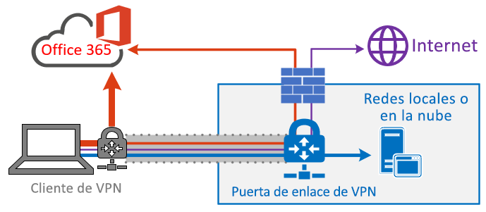
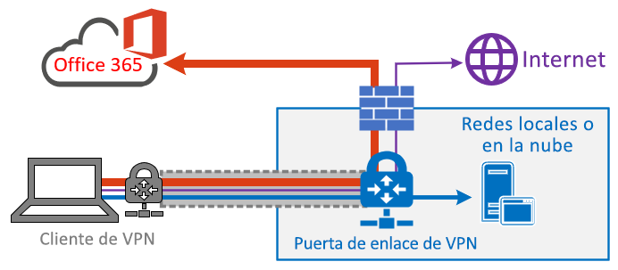

# Optimizar la conectividad de Office 365 para usuarios remotos que usan túnel dividido con VPN
<!---
>[!NOTE]
>This topic is part of a set of topics that address Office 365 optimization for remote users.
>- For VPN split tunnel implementation guidance, see [Implementing VPN split tunnelling for Office 365](office-365-vpn-implement-split-tunnel.md).
>- For information about optimizing Office 365 worldwide tenant performance for users in China, see [Office 365 performance optimization for China users](office-365-networking-china.md).
-->

A los clientes que usan una VPN para conectar sus dispositivos de trabajo remotos a la red corporativa o a la infraestructura de la nube, Microsoft recomienda que los escenarios clave de Office 365 **Microsoft Teams**, **SharePoint Online** y **Exchange Online** se enruten a través de una _configuración de túnel dividido de VPN_. Esto es especialmente importante como estrategia de primera línea para facilitar la productividad de los empleados durante largos periodos de trabajo remoto, como el causado por la crisis de la COVID-19.

_Figura 1: una solución de túnel dividido de VPN con excepciones de Office 365 definidas enviada directamente al servicio. El resto del tráfico recorre el túnel de VPN independientemente del destino._

La meta de este enfoque es ofrecer un método sencillo para que las empresas puedan mitigar el riesgo de la saturación de la infraestructura de VPN y mejorar considerablemente el rendimiento de Office 365 en el período de tiempo más reducido posible. Configurar los clientes de VPN para que permitan el tráfico de Office 365 más importante y de mayor volumen permite eludir el túnel VPN y, además, aporta las siguientes ventajas:

- Atenúa de inmediato la causa principal de la mayoría de los problemas de rendimiento y de capacidad de red detectados en clientes con arquitecturas VPN empresariales que afectan a la experiencia de usuario de Office 365.
  
  La solución recomendada se dirige específicamente a los puntos de conexión de servicio de Office 365 categorizados como **Optimizar** en el tema [URL e intervalos de direcciones IP de Office 365](https://aka.ms/o365ips). El tráfico hacia estos puntos de conexión es muy sensible a la latencia y a los límites de ancho de banda. Por ello, que eludan el túnel de VPN puede mejorar considerablemente la experiencia de usuario final y reducir la carga de la red corporativa. Las conexiones de Office 365 que no supongan la mayor parte del ancho de banda o no dejen una gran huella en la experiencia de usuario se pueden enrutar a través del túnel VPN junto con el resto del tráfico vinculado a Internet. Para obtener más información, consulte [La estrategia de túnel dividido de VPN](#the-vpn-split-tunnel-strategy).

- Se pueden configurar, probar e implementar rápidamente por parte de los clientes y sin requerimientos adicionales de aplicaciones o infraestructura.

  Según la plataforma de VPN y la arquitectura de red, la implementación puede llevar solo unas horas. Para obtener más información, consulte [Implementación de túnel dividido de VPN](office-365-vpn-implement-split-tunnel.md#implement-vpn-split-tunnelling).

- Preserva la posición de seguridad de las implementaciones de VPN del cliente sin tener que cambiar la forma en que se enrutan otras conexiones, incluido el tráfico de Internet

  La configuración recomendada sigue el principio del **privilegio mínimo** para las excepciones de tráfico de VPN y permite que los clientes implementen el túnel dividido de VPN sin exponer a los usuarios o a la infraestructura a riesgos de seguridad adicionales. El tráfico de red enrutado directamente a los puntos de conexión de Office 365 está cifrado, su integridad se ha comprobado mediante pilas de aplicaciones de cliente de Office y su ámbito se ha adaptado a las direcciones IP dedicadas a los servicios de Office 365, que se refuerzan tanto a nivel de red como de aplicación. Para más información, vea [Formas alternativas para que los profesionales de seguridad y de TI logren controles de seguridad modernos en los escenarios de trabajo remoto de hoy día (blog del Equipo de seguridad de Microsoft)](https://www.microsoft.com/security/blog/2020/03/26/alternative-security-professionals-it-achieve-modern-security-controls-todays-unique-remote-work-scenarios/).

- Es compatible de forma nativa con la mayoría de las plataformas VPN empresariales

  Microsoft continúa colaborando con socios del sector que produzcan soluciones VPN comerciales para ayudar a los asociados a desarrollar guías específicas y plantillas de configuración para sus soluciones según las recomendaciones anteriores. Para obtener más información, vea [Tutoriales para las plataformas VPN comunes](office-365-vpn-implement-split-tunnel.md#howto-guides-for-common-vpn-platforms).

>[!TIP]
>Microsoft recomienda aplicar la configuración de túnel dividido de VPN a intervalos de IP dedicados ya documentados para los servicios de Office 365. Aunque es posible en determinadas plataformas cliente de VPN utilizar configuraciones de túnel dividido basadas en FQDN o AppID, estas pueden no cubrir completamente los escenarios clave de Office 365 y pueden entrar en conflicto con las reglas de enrutamiento VPN basadas en IP. Por este motivo, Microsoft no recomienda usar FQDN de Office 365 para configurar el túnel dividido de VPN. El uso de la configuración FQDN puede resultar útil en otros escenarios similares, como la personalización de archivos .pac o la implementación de omisión de proxy.

Para obtener instrucciones detalladas sobre la implementación, consulte [Implementación de túneles divididos de VPN en Office 365](office-365-vpn-implement-split-tunnel.md).

## La estrategia de túneles divididos de VPN

Las redes corporativas tradicionales suelen diseñarse para trabajar de forma segura en estructuras prenube en las que la mayoría de los datos, servicios y aplicaciones importantes se hospedan de forma local y se conectan directamente a la red corporativa interna, al igual que la mayoría de los usuarios. Por lo tanto, la infraestructura de red se crea en torno a estos elementos. Las oficinas delegadas se conectan a la oficina central _a través de redes de Alternancia de etiquetas multiprotocolo (MPLS)_ y los usuarios remotos deben conectarse a la red corporativa a través de una VPN para acceder a los puntos de conexión locales y a Internet. En este modelo, todo el tráfico de usuarios remotos recorre la red corporativa y se enruta al servicio en la nube mediante un punto de salida común.

_Figura 2: una solución de VPN común para usuarios remotos en la que todo el tráfico se transfiere de nuevo obligatoriamente a la red corporativa, independientemente del destino_

A medida que las organizaciones mueven datos y aplicaciones a la nube, este modelo empieza a ser menos eficaz, ya que rápidamente se torna engorroso, costoso e imposible de escalar. Esto afecta significativamente al rendimiento de la red y a la eficiencia de los usuarios, y puede restringir la capacidad de la organización de adaptarse a las necesidades cambiantes. Muchos clientes de Microsoft informaron de que hace unos años el 80 % del tráfico de red tenía un destino interno, mientras que en 2020 el 80 % o más del tráfico se conecta a un recurso externo basado en la nube.

La crisis del COVID-19 ha agravado el problema de requerir soluciones inmediatas para la inmensa mayoría de las organizaciones. Muchos clientes han descubierto que el modelo de VPN forzoso no es lo suficientemente escalable ni tampoco es adecuado para el 100 % de escenarios de trabajo remoto como el que necesita esta crisis. Se requieren soluciones rápidas para que estas organizaciones puedan seguir funcionando eficazmente.

Para el servicio de Office 365, Microsoft ha diseñado los requisitos de conectividad teniendo en cuenta este problema. Así, un conjunto de puntos de conexión de servicios centrado, muy controlado y relativamente estático se puede optimizar simple y rápidamente para que ofrezca un alto rendimiento, que permita a los usuarios acceder al servicio y que reduzca la carga en la infraestructura de VPN —de forma que el tráfico que la necesite, pueda usarla—.

Office 365 clasifica los puntos de conexión necesarios para Office 365 en tres categorías: **Optimizar**, **Permitir** y **Predeterminado**. **Optimizar** los puntos de conexión es nuestra meta aquí y presenta las siguientes características:

- Son los puntos de conexión que pertenecen a Microsoft, que también se encarga de administrarlos y alojarlos en su infraestructura.
- Se les ofrece IP.
- Tienen una baja tasa de cambio y un número esperado reducido (actualmente, 20 subredes IP).
- Tienen un alto volumen o son sensibles a la latencia.
- Se les puede proporcionar elementos de seguridad necesarios directamente en el servicio en lugar de en línea en la red.
- Suponen alrededor de un 70-80 % del volumen de tráfico en el servicio de Office 365.

Este conjunto de puntos de conexión de ámbito estricto se puede dividir y separar del túnel de VPN forzoso para enviarlo de forma segura directamente al servicio de Office 365 mediante la interfaz local del usuario. Esto se conoce como **túnel dividido**.

Los elementos de seguridad como DLP, protección de antivirus, autenticación y control de acceso se pueden ofrecer de forma más eficaz con estos puntos de conexión en diferentes capas dentro del servicio. Como también desviamos la mayor parte del volumen del tráfico fuera de la solución de VPN, el tráfico de red privada queda liberado y puede usarse para el tráfico empresarial crítico que todavía depende de él. Asimismo, en muchos casos elimina la necesidad de usar un programa de actualización prolongado y costoso que pueda lidiar con esta nueva forma de operar.

_Figura 3: una solución de túnel dividido de VPN con excepciones de Office 365 definidas con envío directo al servicio. El resto del tráfico es forzado de vuelta a la red corporativa independientemente del destino._

Desde el punto de vista de la seguridad, Microsoft tiene una serie de características que pueden ofrecer una seguridad similar, o incluso mejor que la ofrecida por la inspección en línea de las pilas de seguridad locales. La entrada de blog del equipo de seguridad de Microsoft [Alternativas para que los profesionales de la seguridad y de TI puedan lograr controles de seguridad modernos en los escenarios de trabajo remoto actuales](https://www.microsoft.com/security/blog/2020/03/26/alternative-security-professionals-it-achieve-modern-security-controls-todays-unique-remote-work-scenarios/) resume claramente las características disponibles y encontrará instrucciones más detalladas en este artículo. También puede obtener información sobre la implementación de Microsoft del túnel dividido de VPN en [Funcionando en la VPN: cómo Microsoft conecta a su personal remoto](https://www.microsoft.com/itshowcase/blog/running-on-vpn-how-microsoft-is-keeping-its-remote-workforce-connected/?elevate-lv).

En la mayoría de los casos, esta implementación puede alcanzarse en cuestión de horas, solucionando rápidamente uno de los problemas más apremiantes de las organizaciones a la hora de extender los servicios de trabajo remoto a toda la empresa. Para obtener instrucciones detalladas sobre la implementación del túnel dividido de VPN, consulte [Implementación de túneles divididos de VPN en Office 365](office-365-vpn-implement-split-tunnel.md).

>[!NOTE]
>Microsoft se ha comprometido a suspender los cambios realizados en **Optimizar** los puntos de conexión de Office 365 hasta al menos el **30 de junio de 2020**, lo que permite que los clientes se centren en otros problemas y no en mantener una lista blanca de puntos de conexión una vez que los implementaran inicialmente.

## Temas relacionados

[Implementación de túnel dividido de VPN en Office 365](office-365-vpn-implement-split-tunnel.md)

[Optimización de rendimiento de Office 365 para usuarios de China](office-365-networking-china.md)

[Formas alternativas para que los profesionales de seguridad y de TI logren controles de seguridad modernos en los escenarios de trabajo remoto específicos (blog del Equipo de Seguridad de Microsoft)](https://www.microsoft.com/security/blog/2020/03/26/alternative-security-professionals-it-achieve-modern-security-controls-todays-unique-remote-work-scenarios/)

[Mejorando el rendimiento de la VPN en Microsoft: usando perfiles de VPN de Windows 10 para permitir conexiones automáticas ](https://www.microsoft.com/itshowcase/enhancing-remote-access-in-windows-10-with-an-automatic-vpn-profile)

[Funcionando con VPN: cómo Microsoft mantiene conectado a su personal remoto](https://www.microsoft.com/itshowcase/blog/running-on-vpn-how-microsoft-is-keeping-its-remote-workforce-connected/?elevate-lv)

[Principios de conectividad de red de Office 365](office-365-network-connectivity-principles.md)

[Evaluar la red de Office 365](assessing-network-connectivity.md)

[Prueba de conectividad de Microsoft 365](https://aka.ms/netonboard)
