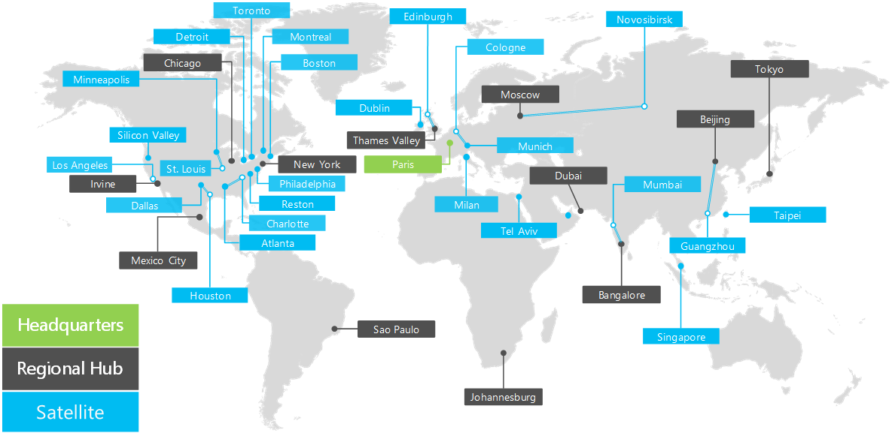

# Información general sobre Contoso CorporationOverview of the Contoso Corporation

 **Resumen:** Comprender el Contoso Corporation como una empresa y la estructura en niveles de sus oficinas de todo el mundo.**Summary:** Understand the Contoso Corporation as a business and the tiered structure of its worldwide offices.
  
Contoso Corporation es una empresa global con sede en París, Francia. Es una organización que agrupa la fabricación, las ventas y el soporte técnico de más de 100 000 productos. The Contoso Corporation is a global business with headquarters in Paris, France. It is a conglomerate manufacturing, sales, and support organization with over 100,000 products. 
  
## Contoso CorporationThe Contoso Corporation

Organización en todo el mundo de Contoso tiene oficinas en las siguientes ubicaciones:Contoso's worldwide organization has offices in the following locations:
  
**En la figura 1: Oficinas de Contoso todo el mundo****Figure 1: Contoso's offices around the world**

  
En la figura 1, se muestran la sede central en París, las oficinas de los centros regionales y las oficinas satélite en varios continentes.Figure 1 shows the headquarters office in Paris and regional hub and satellite offices in various continents.
  
Las oficinas de Contoso todo el mundo siguen un diseño de tres niveles.Contoso's offices around the world follow a three tier design.
  
- SedeHeadquarters
    
    La oficina central de Contoso Corporation es un campus corporativo grande en las afueras de París con docenas de edificios para las instalaciones de fabricación, ingeniería y administrativas. Todos los centros de datos de Contoso y su presencia en Internet se alojan en las sedes centrales de París.The Contoso Corporation headquarters is a large corporate campus on the outskirts of Paris with dozens of buildings for administrative, engineering, and manufacturing facilities. All of Contoso's datacenters and it's Internet presence are housed in the Paris headquarters.
    
    La sede cuenta con 15 000 empleados.The headquarters has 15,000 workers.
    
- Centros regionalesRegional hubs
    
    Las oficinas de centros regionales sirven a una región específica del mundo con el 60 % de ventas y personal de soporte técnico. Cada centro regional está conectado a la sede de París con un vínculo WAN de ancho de banda alto. Regional hub offices serve a specific region of the world with 60% sales and support staff. Each regional hub is connected to the Paris headquarters with a high-bandwidth WAN link. 
    
    Cada centro regional tiene un promedio de 2000 trabajadores.Each regional hub has an average of 2,000 workers.
    
- Oficinas satéliteSatellite offices
    
    Oficinas satélites contienen 80% ventas y personal de soporte técnico y proporcionan una presencia física y en el sitio para los clientes de Contoso en claves ciudades o regiones subcaracterística. Cada oficina satélite está conectado a un concentrador regional con un vínculo WAN de ancho de banda alto.Satellite offices contain 80% sales and support staff and provide a physical and on-site presence for Contoso customers in key cities or sub-regions. Each satellite office is connected to a regional hub with a high-bandwidth WAN link.
    
    Cada oficina satélite tiene un promedio de 250 trabajadores.Each satellite office has an average of 250 workers.
    
25% del personal de Contoso es de sólo mobile, con un porcentaje más alto de los trabajadores solo mobile en los concentradores regionales y oficinas satélites. Proporcionar una mejor compatibilidad para los trabajadores solo mobile es un objetivo empresarial importante para Contoso.25% of Contoso's workforce is mobile-only, with a higher percentage of mobile-only workers in the regional hubs and satellite offices. Providing better support for mobile-only workers is an important business goal for Contoso.
  
## Elementos de implementación de Contoso de Microsoft en la nubeElements of Contoso's implementation of the Microsoft cloud

Contoso arquitectos de TI han identificado los siguientes elementos al planear la adopción de las ofertas de nube de Microsoft.Contoso's IT architects have identified the following elements when planning for the adoption of Microsoft's cloud offerings.
  
- RedesNetworking
    
    Redes incluyen la conectividad con las ofertas de nube de Microsoft y ancho de banda suficiente para ser eficaz en las cargas máximas. Algunos conectividad será a través de conexiones de Internet locales y algunas estará en toda la infraestructura de red privada de Contoso.Networking includes the connectivity to Microsoft's cloud offerings and enough bandwidth to be performant under peak loads. Some connectivity will be over local Internet connections and some will be across Contoso's private network infrastructure.
    
    Para obtener más información, vea el póster de [Microsoft en la nube de la red para arquitectos de la empresa](microsoft-cloud-networking-for-enterprise-architects.md) .For more information, see the [Microsoft Cloud Networking for Enterprise Architects](microsoft-cloud-networking-for-enterprise-architects.md) poster.
   
- IdentidadIdentity
    
    Contoso utiliza un bosque de Windows Server AD para su proveedor de identidad interna y también permite la federación con proveedores de terceros para clientes y socios. Contoso debe aprovechar el conjunto interno de cuentas para las ofertas de nube de Microsoft. Acceso a aplicaciones basadas en la nube para los clientes y socios debe aprovechar así como los proveedores de identidad de terceros.Contoso uses a Windows Server AD forest for its internal identity provider and also federates with third-party providers for customer and partners. Contoso must leverage the internal set of accounts for Microsoft's cloud offerings. Access to cloud-based apps for customers and partners must leverage third-party identity providers as well.
    
    Para obtener más información, vea el póster de [Identidad de nube de Microsoft para arquitectos de la empresa](microsoft-cloud-it-architecture-resources.md#identity) .For more information, see the [Microsoft Cloud Identity for Enterprise Architects](microsoft-cloud-it-architecture-resources.md#identity) poster.
    
- SeguridadSecurity
    
    La seguridad de datos e identidades basados en la nube debe incluir protección de datos, administración de privilegios administrativos, reconocimiento de amenazas e implementación de directivas de control y seguridad de datos.Security for cloud-based identities and data must include data protection, administrative privilege management, threat awareness, and the implementation of data governance and security policies.
    
    Para obtener más información, vea el póster de [Seguridad de Microsoft en la nube para arquitectos de la empresa](http://aka.ms/cloudarchsecurity) .For more information, see the [Microsoft Cloud Security for Enterprise Architects](http://aka.ms/cloudarchsecurity) poster.
    
- AdministraciónManagement
    
    La administración de aplicaciones basadas en la nube y las cargas de trabajo de SaaS necesitarán la posibilidad de mantener las opciones de configuración, los datos, las cuentas, las directivas y los permisos, así como de supervisar el estado y el rendimiento continuos. Las herramientas de administración del servidor existentes se usarán para administrar máquinas virtuales en IaaS de Azure.Management for cloud-based apps and SaaS workloads will need the ability to maintain settings, data, accounts, policies, and permissions and to monitor ongoing health and performance. Existing server management tools will be used to manage virtual machines in Azure IaaS.
    
## See AlsoSee Also

[Contoso en la nube de MicrosoftContoso in the Microsoft Cloud](contoso-in-the-microsoft-cloud.md)
  
[Recursos de arquitectura de TI de la nube de MicrosoftMicrosoft Cloud IT architecture resources](microsoft-cloud-it-architecture-resources.md)

[Mapa de ruta de Enterprise Cloud de Microsoft: Recursos para los responsables de decisiones de TIMicrosoft's Enterprise Cloud Roadmap: Resources for IT Decision Makers](https://sway.com/FJ2xsyWtkJc2taRD)
 

