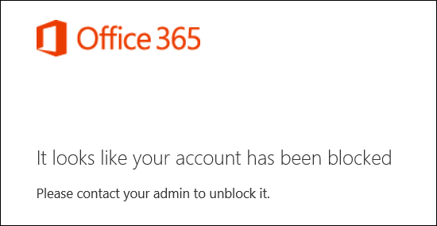

# <a name="block-user-accounts-with-office-365-powershell"></a><span data-ttu-id="e3821-103">Bloquear cuentas de usuario con PowerShell de Office 365</span><span class="sxs-lookup"><span data-stu-id="e3821-103">Block user accounts with Office 365 PowerShell</span></span>

<span data-ttu-id="e3821-104">**Resumen:**  Explica cómo utilizar Office 365 PowerShell para bloquear y desbloquear el acceso a cuentas de Office 365.</span><span class="sxs-lookup"><span data-stu-id="e3821-104">**Summary:**  Explains how to use Office 365 PowerShell to block and unblock access to Office 365 accounts.</span></span>
  
<span data-ttu-id="e3821-p101">Bloquea el acceso a una cuenta de Office 365 impide que alguien pueda usar la cuenta para iniciar sesión y tener acceso a los servicios y los datos de la organización de Office 365. Cuando se bloquea el acceso a la cuenta, el usuario recibe el siguiente mensaje de error cuando intentan iniciar sesión en:</span><span class="sxs-lookup"><span data-stu-id="e3821-p101">Blocking access to an Office 365 account prevents anyone from using the account to sign in and access the services and data in your Office 365 organization. When you block access to the account, the user receives the following error message when they attempt to sign in:</span></span>
  

  
<span data-ttu-id="e3821-108">Puede utilizar Office 365 PowerShell para bloquear el acceso a una persona y varias cuentas de usuario.</span><span class="sxs-lookup"><span data-stu-id="e3821-108">You can use Office 365 PowerShell to block access to individual and multiple user accounts.</span></span>
  
## <a name="before-you-begin"></a><span data-ttu-id="e3821-109">Antes de empezar</span><span class="sxs-lookup"><span data-stu-id="e3821-109">Before you begin</span></span>

- <span data-ttu-id="e3821-p102">Los procedimientos de este tema requieren conectarse a PowerShell de Office 365. Para obtener instrucciones, vea [Conectarse a PowerShell de Office 365](connect-to-office-365-powershell.md).</span><span class="sxs-lookup"><span data-stu-id="e3821-p102">The procedures in this topic require you to connect to Office 365 PowerShell. For instructions, see [Connect to Office 365 PowerShell](connect-to-office-365-powershell.md).</span></span>
    
- <span data-ttu-id="e3821-112">Cuando se bloquea una cuenta de usuario, puede demorar hasta 24 horas a partir de dispositivos y clientes de todos los usuarios.</span><span class="sxs-lookup"><span data-stu-id="e3821-112">When you block a user account, it might take as long as 24 hours to take effect on all the user's devices and clients.</span></span>
    
## <a name="use-office-365-powershell-to-block-access-to-individual-user-accounts"></a><span data-ttu-id="e3821-113">Usar PowerShell de Office 365 para bloquear el acceso a cuentas de usuario individuales</span><span class="sxs-lookup"><span data-stu-id="e3821-113">Use Office 365 PowerShell to block access to individual user accounts</span></span>

<span data-ttu-id="e3821-114">Utilice la sintaxis siguiente para bloquear el acceso a una cuenta de usuario individual:</span><span class="sxs-lookup"><span data-stu-id="e3821-114">Use the following syntax to block access to an individual user account:</span></span>
  
```
Set-MsolUser -UserPrincipalName <UPN of user account>  -BlockCredential $true
```

<span data-ttu-id="e3821-115">Este ejemplo bloquea el acceso a la cuenta de usuario fabricec@litwareinc.com.</span><span class="sxs-lookup"><span data-stu-id="e3821-115">This example blocks access to the user account fabricec@litwareinc.com.</span></span>
  
```
Set-MsolUser -UserPrincipalName fabricec@litwareinc.com -BlockCredential $true
```

<span data-ttu-id="e3821-116">Para desbloquear la cuenta de usuario, ejecute el siguiente comando:</span><span class="sxs-lookup"><span data-stu-id="e3821-116">To unblock the user account, run the following command:</span></span>
  
```
Set-MsolUser -UserPrincipalName <UPN of user account>  -BlockCredential $false
```

<span data-ttu-id="e3821-117">En cualquier momento, puede comprobar el estado de bloqueo de cuenta de usuario con el siguiente comando:</span><span class="sxs-lookup"><span data-stu-id="e3821-117">At any time, you can check the blocked status of a user account with the following command:</span></span>
  
```
Get-MolUser -UserPrincipalName <UPN of user account> | Select DisplayName,BlockCredential
```

## <a name="use-office-365-powershell-to-block-access-to-multiple-user-accounts"></a><span data-ttu-id="e3821-118">Utilice Office 365 PowerShell para bloquear el acceso a varias cuentas de usuario</span><span class="sxs-lookup"><span data-stu-id="e3821-118">Use Office 365 PowerShell to block access to multiple user accounts</span></span>

<span data-ttu-id="e3821-119">En primer lugar, cree un archivo de texto que contiene una cuenta en cada línea como esta:</span><span class="sxs-lookup"><span data-stu-id="e3821-119">First, create a text file that contains one account on each line like this:</span></span>
    
  ```
akol@contoso.com
tjohnston@contoso.com
kakers@contoso.com
  ```
<span data-ttu-id="e3821-p103">En los siguientes comandos, el archivo de texto de ejemplo es C:\My Documents\Accounts.txt. Reemplazar por la ruta de acceso y el nombre de su archivo de texto.</span><span class="sxs-lookup"><span data-stu-id="e3821-p103">In the following commands, the example text file is C:\My Documents\Accounts.txt. Replace this with the path and file name of your text file.</span></span>
    
<span data-ttu-id="e3821-122">Para bloquear el acceso a las cuentas enumeradas en el archivo de texto, ejecute el siguiente comando:</span><span class="sxs-lookup"><span data-stu-id="e3821-122">To block access to the accounts listed in the text file, run the following command:</span></span>
    
  ```
  Get-Content "C:\My Documents\Accounts.txt" | Set-MsolUser -UserPrincipalName $_.UserPrincipalName -BlockCredential $true
  ```
<span data-ttu-id="e3821-123">Para desbloquear las cuentas enumeradas en el archivo de texto, ejecute el siguiente comando:</span><span class="sxs-lookup"><span data-stu-id="e3821-123">To unblock the accounts listed in the text file, run the following command:</span></span>
    
  ```
  Get-Content "C:\My Documents\Accounts.txt" | Set-MsolUser -UserPrincipalName $_.UserPrincipalName -BlockCredential $false
  ```

## <a name="use-the-azure-active-directory-v2-powershell-module-to-block-access-to-user-accounts"></a><span data-ttu-id="e3821-124">Usar el módulo de PowerShell Azure Active Directory V2 para bloquear el acceso a cuentas de usuario</span><span class="sxs-lookup"><span data-stu-id="e3821-124">Use the Azure Active Directory V2 PowerShell module to block access to user accounts</span></span>

<span data-ttu-id="e3821-p104">Para usar el cmdlet **New-AzureADUser** desde el módulo de PowerShell Azure Active Directory V2 debe conectarse primero a la suscripción. Para las instrucciones, consulte[Conectarse con el módulo de PowerShell Azure Active Directory V2](https://go.microsoft.com/fwlink/?linkid=842218).</span><span class="sxs-lookup"><span data-stu-id="e3821-p104">To use the **New-AzureADUser** cmdlet from the Azure Active Directory V2 PowerShell module, you must first connect to your subscription. For the instructions, see[Connect with the Azure Active Directory V2 PowerShell module](https://go.microsoft.com/fwlink/?linkid=842218).</span></span>
  
<span data-ttu-id="e3821-127">Después de haberse conectado, use la sintaxis siguiente para bloquear una cuenta de usuario individual:</span><span class="sxs-lookup"><span data-stu-id="e3821-127">After you have connected, use the following syntax to block an individual user account:</span></span>
  
```
Set-AzureADUser -ObjectID <UPN of user account> -AccountEnabled $false
```

> [!NOTE]
> <span data-ttu-id="e3821-128">El parámetro ObjectID en el cmdlet Set-AzureAD acepta tanto el nombre de cuenta, también conocido como nombre principal de usuario, o la ID de objeto de la cuenta.</span><span class="sxs-lookup"><span data-stu-id="e3821-128">The -ObjectID parameter in the Set-AzureAD cmdlet accepts either the account name, also known as the User Principal Name, or the account's object ID.</span></span> 
  
<span data-ttu-id="e3821-129">Este ejemplo bloquea el acceso a la cuenta de usuario fabricec@litwareinc.com.</span><span class="sxs-lookup"><span data-stu-id="e3821-129">This example blocks access to the user account fabricec@litwareinc.com.</span></span>
  
```
Set-AzureADUser -ObjectID fabricec@litwareinc.com -AccountEnabled $false
```

<span data-ttu-id="e3821-130">Para desbloquear esta cuenta de usuario, ejecute el siguiente comando:</span><span class="sxs-lookup"><span data-stu-id="e3821-130">To unblock this user account, run the following command:</span></span>
  
```
Set-AzureADUser -ObjectID fabricec@litwareinc.com -AccountEnabled $true
```

<span data-ttu-id="e3821-131">Para mostrar la cuenta de usuario que UPN se basa en el nombre para mostrar del usuario, utilice los siguientes comandos:</span><span class="sxs-lookup"><span data-stu-id="e3821-131">To display the user account UPN based on the user's display name, use the following commands:</span></span>
  
```
$userName="<user account display name>"
Write-Host (Get-AzureADUser | where {$_.DisplayName -eq $userName}).UserPrincipalName

```

<span data-ttu-id="e3821-132">En este ejemplo se muestra la cuenta de usuario UPN del usuario llamado Caleb Sills.</span><span class="sxs-lookup"><span data-stu-id="e3821-132">This example displays the user account UPN for the user named Caleb Sills.</span></span>
  
```
$userName="Caleb Sills"
Write-Host (Get-AzureADUser | where {$_.DisplayName -eq $userName}).UserPrincipalName
```

<span data-ttu-id="e3821-133">Para bloquear una cuenta según el nombre de usuario, use los comandos siguientes:</span><span class="sxs-lookup"><span data-stu-id="e3821-133">To block an account based on the user's name, use the following commands:</span></span>
  
```
$userName="<user account display name>"
Set-AzureADUser -ObjectID (Get-AzureADUser | where {$_.DisplayName -eq $userName}).UserPrincipalName -AccountEnabled $false

```

<span data-ttu-id="e3821-134">En cualquier momento, puede comprobar el estado de bloqueo de cuenta de usuario con el siguiente comando:</span><span class="sxs-lookup"><span data-stu-id="e3821-134">At any time, you can check the blocked status of a user account with the following command:</span></span>
  
```
Get-AzureADUser -UserPrincipalName <UPN of user account> | Select DisplayName,AccountEnabled
```

<span data-ttu-id="e3821-135">Para bloquear el acceso a varias cuentas de usuario, cree un archivo de texto que contiene un nombre de cuenta en cada línea como esta:</span><span class="sxs-lookup"><span data-stu-id="e3821-135">To block access to multiple user accounts, create a text file that contains one account name on each line like this:</span></span>
    
  ```
akol@contoso.com
tjohnston@contoso.com
kakers@contoso.com
  ```

<span data-ttu-id="e3821-p105">En los siguientes comandos, el archivo de texto de ejemplo es C:\My Documents\Accounts.txt. Reemplazar por la ruta de acceso y el nombre de su archivo de texto.</span><span class="sxs-lookup"><span data-stu-id="e3821-p105">In the following commands, the example text file is C:\My Documents\Accounts.txt. Replace this with the path and file name of your text file.</span></span>
    
<span data-ttu-id="e3821-138">Para bloquear el acceso a las cuentas enumeradas en el archivo de texto, ejecute el siguiente comando:</span><span class="sxs-lookup"><span data-stu-id="e3821-138">To block access to the accounts listed in the text file, run the following command:</span></span>
    
```
Get-Content "C:\My Documents\Accounts.txt" | Set-AzureADUSer -ObjectID $_.ObjectID -AccountEnabled $true
```

<span data-ttu-id="e3821-139">Para desbloquear las cuentas enumeradas en el archivo de texto, ejecute el siguiente comando:</span><span class="sxs-lookup"><span data-stu-id="e3821-139">To unblock the accounts listed in the text file, run the following command:</span></span>
    
```
Get-Content "C:\My Documents\Accounts.txt" | Set-AzureADUSer -ObjectID $_.ObjectID -AccountEnabled $false
```

## <a name="see-also"></a><span data-ttu-id="e3821-140">See also</span><span class="sxs-lookup"><span data-stu-id="e3821-140">See also</span></span>
<span data-ttu-id="e3821-141"><a name="SeeAlso"> </a></span><span class="sxs-lookup"><span data-stu-id="e3821-141"></span></span>

<span data-ttu-id="e3821-142">Vea los siguientes temas adicionales acerca de cómo administrar usuarios con Office 365 PowerShell:</span><span class="sxs-lookup"><span data-stu-id="e3821-142">See the following additional topics about managing users with Office 365 PowerShell:</span></span>
  
- [<span data-ttu-id="e3821-143">Crear cuentas de usuario con PowerShell de Office 365</span><span class="sxs-lookup"><span data-stu-id="e3821-143">Create user accounts with Office 365 PowerShell</span></span>](create-user-accounts-with-office-365-powershell.md)
    
- [<span data-ttu-id="e3821-144">Eliminar y restaurar cuentas de usuario con PowerShell de Office 365</span><span class="sxs-lookup"><span data-stu-id="e3821-144">Delete and restore user accounts with Office 365 PowerShell</span></span>](delete-and-restore-user-accounts-with-office-365-powershell.md)
    
- [<span data-ttu-id="e3821-145">Asignar licencias a cuentas de usuario con PowerShell de Office 365</span><span class="sxs-lookup"><span data-stu-id="e3821-145">Assign licenses to user accounts with Office 365 PowerShell</span></span>](assign-licenses-to-user-accounts-with-office-365-powershell.md)
    
- [<span data-ttu-id="e3821-146">Eliminar licencias de cuentas de usuario con PowerShell de Office 365</span><span class="sxs-lookup"><span data-stu-id="e3821-146">Remove licenses from user accounts with Office 365 PowerShell</span></span>](remove-licenses-from-user-accounts-with-office-365-powershell.md)
    
<span data-ttu-id="e3821-147">Para obtener más información sobre los cmdlets que se usan en estos procedimientos, consulte los siguientes temas:</span><span class="sxs-lookup"><span data-stu-id="e3821-147">For more information about the cmdlets that are used in these procedures, see the following topics:</span></span>
  
- [<span data-ttu-id="e3821-148">Get-Content</span><span class="sxs-lookup"><span data-stu-id="e3821-148">Get-Content</span></span>](https://go.microsoft.com/fwlink/p/?LinkId=113310)
    
- [<span data-ttu-id="e3821-149">Conjunto de MsolUser</span><span class="sxs-lookup"><span data-stu-id="e3821-149">Set-MsolUser</span></span>](https://go.microsoft.com/fwlink/p/?LinkId=691644)
    
- [<span data-ttu-id="e3821-150">Nueva AzureADUser</span><span class="sxs-lookup"><span data-stu-id="e3821-150">New-AzureADUser</span></span>](https://docs.microsoft.com/powershell/module/azuread/new-azureaduser?view=azureadps-2.0)
    

