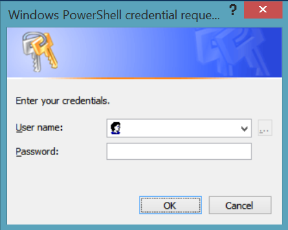
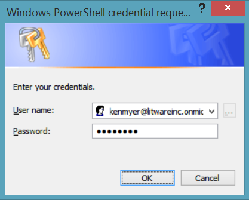
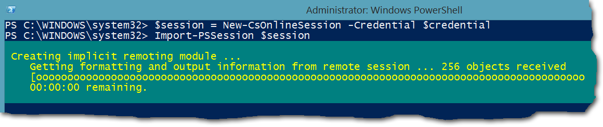

# <a name="connect-to-all-office-365-services-in-a-single-windows-powershell-window"></a><span data-ttu-id="f980c-103">Conectarse a todos los servicios de Office 365 en una sola ventana de Windows PowerShell</span><span class="sxs-lookup"><span data-stu-id="f980c-103">Connect to all Office 365 services in a single Windows PowerShell window</span></span>

 <span data-ttu-id="f980c-104">**Resumen:** En lugar de administrar diferentes servicios de Office 365 en distintas ventanas de la consola de PowerShell, puede conectarse a todos los servicios de Office 365 y gestionarlos desde la ventana de consola única.</span><span class="sxs-lookup"><span data-stu-id="f980c-104">**Summary:** Instead of managing different Office 365 services in separate PowerShell console windows, you can connect to all Office 365 services and manage them from single console window.</span></span>
  
<span data-ttu-id="f980c-p101">Al usar PowerShell para administrar Office 365, es posible tener hasta cinco sesiones diferentes de Windows PowerShell abierto al mismo tiempo correspondiente al centro de administración de Office 365, SharePoint Online, Exchange Online, Skype para los negocios en línea y la seguridad &amp;Centro de cumplimiento. Con cinco métodos de conexión diferentes en las sesiones de Windows PowerShell independientes, el escritorio tendría la apariencia siguiente:</span><span class="sxs-lookup"><span data-stu-id="f980c-p101">When you use PowerShell to manage Office 365, it is possible to have up to five different Windows PowerShell sessions open at the same time corresponding to Office 365 admin center, SharePoint Online, Exchange Online, Skype for Business Online, and the Security &amp; Compliance Center. With five different connection methods in separate Windows PowerShell sessions, your desktop could look like this:</span></span>
  

  
<span data-ttu-id="f980c-p102">Esto no es óptimo para la administración de Office 365 porque no pueden intercambiar datos entre esos cinco ventanas de administración de servicio de la cruz. Este tema describe cómo utilizar una única instancia de Windows PowerShell desde el que puede administrar la seguridad, Skype para los negocios en línea, Exchange Online, SharePoint Online y Office 365 &amp; centro de cumplimiento.</span><span class="sxs-lookup"><span data-stu-id="f980c-p102">This is not optimal for managing Office 365 because you can't exchange data among those five windows for cross-service management. This topic describes how to use a single instance of Windows PowerShell from which you can manage Office 365, Skype for Business Online, Exchange Online, SharePoint Online, and the Security &amp; Compliance Center.</span></span>
  
## <a name="before-you-begin"></a><span data-ttu-id="f980c-110">Antes de empezar</span><span class="sxs-lookup"><span data-stu-id="f980c-110">Before you begin</span></span>
<span data-ttu-id="f980c-111"><a name="BeforeYouBegin"> </a></span><span class="sxs-lookup"><span data-stu-id="f980c-111"></span></span>

<span data-ttu-id="f980c-112">Para poder administrar todo Office 365 desde una sola instancia de Windows PowerShell, tenga en cuenta los siguientes requisitos previos:</span><span class="sxs-lookup"><span data-stu-id="f980c-112">Before you can manage all of Office 365 from a single instance of Windows PowerShell, consider the following prerequisites:</span></span>
  
- <span data-ttu-id="f980c-p103">El Office 365 trabajo o escuela cuenta utilizar para estos procedimientos necesidades para ser miembro de una función de administración de Office 365. Para obtener más información, consulte [las funciones de administrador acerca de Office 365](https://go.microsoft.com/fwlink/p/?LinkId=532367). Este requisito para Office 365 PowerShell, pero no necesariamente para todos los demás servicios de Office 365.</span><span class="sxs-lookup"><span data-stu-id="f980c-p103">The Office 365 work or school account that you use for these procedures needs to be a member of an Office 365 admin role. For more information, see [About Office 365 admin roles](https://go.microsoft.com/fwlink/p/?LinkId=532367). This a requirement for Office 365 PowerShell, not necessarily for all other Office 365 services.</span></span>
    
- <span data-ttu-id="f980c-116">Puede usar las siguientes versiones de Windows de 64 bits:</span><span class="sxs-lookup"><span data-stu-id="f980c-116">You can use the following 64-bit versions of Windows:</span></span>
    
  - <span data-ttu-id="f980c-117">Windows 10</span><span class="sxs-lookup"><span data-stu-id="f980c-117">Windows 10</span></span>
    
  - <span data-ttu-id="f980c-118">Windows 8.1 o Windows 8</span><span class="sxs-lookup"><span data-stu-id="f980c-118">Windows 8.1 or Windows 8</span></span>
    
  - <span data-ttu-id="f980c-119">Windows Server 2016</span><span class="sxs-lookup"><span data-stu-id="f980c-119">Windows Server 2016</span></span>
    
  - <span data-ttu-id="f980c-120">Windows Server 2012 R2 o Windows Server 2012</span><span class="sxs-lookup"><span data-stu-id="f980c-120">Windows Server 2012 R2 or Windows Server 2012</span></span>
    
  - <span data-ttu-id="f980c-121">Windows 7 Service Pack 1 (SP1)\*</span><span class="sxs-lookup"><span data-stu-id="f980c-121">Windows 7 Service Pack 1 (SP1)\*</span></span>
    
  - <span data-ttu-id="f980c-122">Windows Server 2008 R2 SP1\*</span><span class="sxs-lookup"><span data-stu-id="f980c-122">Windows Server 2008 R2 SP1\*</span></span>
    
    * <span data-ttu-id="f980c-p104">Debe instalar el Microsoft.NET Framework 4.5. _x_ y, a continuación, el Windows Management Framework 3.0 o el marco de trabajo de administración de Windows 4.0. Para obtener más información, vea [instalar el.NET Framework](https://go.microsoft.com/fwlink/p/?LinkId=257868) y [Windows Management Framework 3.0](https://go.microsoft.com/fwlink/p/?LinkId=272757) o [4.0 de Windows Management Framework](https://go.microsoft.com/fwlink/p/?LinkId=391344).</span><span class="sxs-lookup"><span data-stu-id="f980c-p104">You need to install the Microsoft .NET Framework 4.5. _x_ and then either the Windows Management Framework 3.0 or the Windows Management Framework 4.0. For more information, see [Installing the .NET Framework](https://go.microsoft.com/fwlink/p/?LinkId=257868) and [Windows Management Framework 3.0](https://go.microsoft.com/fwlink/p/?LinkId=272757) or [Windows Management Framework 4.0](https://go.microsoft.com/fwlink/p/?LinkId=391344).</span></span>
    
    <span data-ttu-id="f980c-126">Debe utilizar una versión de 64 bits de Windows debido a los requisitos para el Skype para el módulo de negocios en línea y uno de los módulos de Office 365.</span><span class="sxs-lookup"><span data-stu-id="f980c-126">You need to use a 64-bit version of Windows because of the requirements for the Skype for Business Online module and one of the Office 365 modules.</span></span>
    
- <span data-ttu-id="f980c-127">Debe instalar los módulos necesarios para Office 365, SharePoint Online y Skype para los negocios en línea:</span><span class="sxs-lookup"><span data-stu-id="f980c-127">You need to install the modules that are required for Office 365, SharePoint Online, and Skype for Business Online:</span></span>
    
  - [<span data-ttu-id="f980c-128">Servicio en línea Sign-in Ayudante de Microsoft para profesionales de TI RTW</span><span class="sxs-lookup"><span data-stu-id="f980c-128">Microsoft Online Service Sign-in Assistant for IT Professionals RTW</span></span>](https://go.microsoft.com/fwlink/p/?LinkId=286152)
    
  - [<span data-ttu-id="f980c-129">Windows Azure Active Directory módulo para Windows PowerShell (versión de 64 bits)</span><span class="sxs-lookup"><span data-stu-id="f980c-129">Windows Azure Active Directory Module for Windows PowerShell (64-bit version)</span></span>](https://go.microsoft.com/fwlink/p/?linkid=236297)
    
  - [<span data-ttu-id="f980c-130">Shell de administración en línea de SharePoint</span><span class="sxs-lookup"><span data-stu-id="f980c-130">SharePoint Online Management Shell</span></span>](https://go.microsoft.com/fwlink/p/?LinkId=255251)
    
  - [<span data-ttu-id="f980c-131">Skype para el negocio en línea, módulo de Windows PowerShell</span><span class="sxs-lookup"><span data-stu-id="f980c-131">Skype for Business Online, Windows PowerShell Module</span></span>](https://go.microsoft.com/fwlink/p/?LinkId=532439)
    
-  <span data-ttu-id="f980c-p105">Windows PowerShell debe configurarse para ejecutar secuencias de comandos firmadas de Skype para los negocios en línea, Exchange Online y la seguridad &amp; centro de cumplimiento. Para ello, ejecute el siguiente comando en una sesión de Windows PowerShell con privilegios elevados (una ventana de Windows PowerShell que abra seleccionando **Ejecutar como administrador**).</span><span class="sxs-lookup"><span data-stu-id="f980c-p105">Windows PowerShell needs to be configured to run signed scripts for Skype for Business Online, Exchange Online, and the Security &amp; Compliance Center. To do this, run the following command in an elevated Windows PowerShell session (a Windows PowerShell window you open by selecting **Run as administrator**).</span></span>
    
  ```
  Set-ExecutionPolicy RemoteSigned
  ```

## <a name="the-short-version-instructions-without-explanations"></a><span data-ttu-id="f980c-134">Versión corta (instrucciones sin explicaciones)</span><span class="sxs-lookup"><span data-stu-id="f980c-134">The short version (instructions without explanations)</span></span>
<span data-ttu-id="f980c-135"><a name="ShortVersion"> </a></span><span class="sxs-lookup"><span data-stu-id="f980c-135"></span></span>

<span data-ttu-id="f980c-p106">Esta sección presenta los pasos de conexión sin explicaciones detalladas. Si tiene preguntas o desea obtener más información, puede leer el resto del tema. Los números de estos pasos coinciden con los números de las secciones del resto del tema:</span><span class="sxs-lookup"><span data-stu-id="f980c-p106">This section presents the connection steps without in-depth explanations. If you have questions or want more information, you can read rest of the topic. The step numbers here match the step-numbered sections in the rest of the topic:</span></span>
  
1. <span data-ttu-id="f980c-139">Abrir Windows PowerShell como administrador (uso de **Ejecutar como administrador**).</span><span class="sxs-lookup"><span data-stu-id="f980c-139">Open Windows PowerShell as an administrator (use **Run as administrator**).</span></span>
    
2. <span data-ttu-id="f980c-140">Ejecute este comando y especifique su trabajo en Office 365 o credenciales de la cuenta de la escuela.</span><span class="sxs-lookup"><span data-stu-id="f980c-140">Run this command, and enter your Office 365 work or school account credentials.</span></span>
    
  ```
  $credential = Get-Credential
  ```

3. <span data-ttu-id="f980c-141">Ejecutar estos comandos para conectarse a Office 365.</span><span class="sxs-lookup"><span data-stu-id="f980c-141">Run these commands to connect to Office 365.</span></span>
    
  ```
  Import-Module MsOnline
  Connect-MsolService -Credential $credential
  ```

4. <span data-ttu-id="f980c-p107">Ejecutar estos comandos para conectarse a SharePoint Online. Reemplazar _ \<domainhost >_ con el valor real de su dominio. Por ejemplo, para `litwareinc.onmicrosoft.com`, el _ \<domainhost >_ valor es `litwareinc`.</span><span class="sxs-lookup"><span data-stu-id="f980c-p107">Run these commands to connect to SharePoint Online. Replace  _\<domainhost>_ with the actual value for your domain. For example, for `litwareinc.onmicrosoft.com`, the  _\<domainhost>_ value is `litwareinc`.</span></span>
    
  ```
  Import-Module Microsoft.Online.SharePoint.PowerShell -DisableNameChecking
  Connect-SPOService -Url https://<domainhost>-admin.sharepoint.com -credential $credential
  ```

5. <span data-ttu-id="f980c-p108">Ejecutar estos comandos para conectar con Skype para los negocios en línea. Una advertencia acerca de cómo aumentar el `WSMan NetworkDelayms` valor se espera la primera vez que se conecta y se debe omitir.</span><span class="sxs-lookup"><span data-stu-id="f980c-p108">Run these commands to connect to Skype for Business Online. A warning about increasing the `WSMan NetworkDelayms` value is expected the first time you connect and should be ignored.</span></span>
    
  ```
  Import-Module SkypeOnlineConnector
  $sfboSession = New-CsOnlineSession -Credential $credential
  Import-PSSession $sfboSession
  ```

6. <span data-ttu-id="f980c-147">Ejecutar estos comandos para conectarse a Exchange Online.</span><span class="sxs-lookup"><span data-stu-id="f980c-147">Run these commands to connect to Exchange Online.</span></span>
    
  ```
  $exchangeSession = New-PSSession -ConfigurationName Microsoft.Exchange -ConnectionUri "https://outlook.office365.com/powershell-liveid/" -Credential $credential -Authentication "Basic" -AllowRedirection
  Import-PSSession $exchangeSession -DisableNameChecking
  ```

7. <span data-ttu-id="f980c-148">Ejecutar estos comandos para conectarse a la seguridad &amp; centro de cumplimiento.</span><span class="sxs-lookup"><span data-stu-id="f980c-148">Run these commands to connect to the Security &amp; Compliance Center.</span></span>
    
  ```
  $ccSession = New-PSSession -ConfigurationName Microsoft.Exchange -ConnectionUri https://ps.compliance.protection.outlook.com/powershell-liveid/ -Credential $credential -Authentication Basic -AllowRedirection
  Import-PSSession $ccSession -Prefix cc
  ```
> [!NOTE]
> <span data-ttu-id="f980c-p109">El prefijo de texto "cc" se agrega a *todos los* seguridad &amp; centro de cumplimiento de los nombres de cmdlet para poder ejecutar los cmdlets que existe en Exchange Online y la seguridad &amp; centro de cumplimiento en la misma sesión de Windows PowerShell. Por ejemplo, **Get-RoleGroup** pasa a ser **Get-ccRoleGroup** en la seguridad &amp; centro de cumplimiento.</span><span class="sxs-lookup"><span data-stu-id="f980c-p109">The text prefix "cc" is added to  *all*  Security &amp; Compliance Center cmdlet names so you can run cmdlets that exist in both Exchange Online and the Security &amp; Compliance Center in the same Windows PowerShell session. For example, **Get-RoleGroup** becomes **Get-ccRoleGroup** in the Security &amp; Compliance Center.</span></span>
  
<span data-ttu-id="f980c-p110">Aquí están todos los comandos en un único bloque. Especificar el nombre del host de dominio y, a continuación, ejecutarlos todos al mismo tiempo.</span><span class="sxs-lookup"><span data-stu-id="f980c-p110">Here are all the commands in a single block. Specify the name of your domain host, and then run them all at one time.</span></span>
  
```
$domainHost="<domain host name, such as litware for litwareinc.onmicrosoft.com>"
$credential = Get-Credential
Import-Module MsOnline
Connect-MsolService -Credential $credential
Import-Module Microsoft.Online.SharePoint.PowerShell -DisableNameChecking
Connect-SPOService -Url https://$domainHost-admin.sharepoint.com -credential $credential
Import-Module SkypeOnlineConnector
$sfboSession = New-CsOnlineSession -Credential $credential
Import-PSSession $sfboSession
$exchangeSession = New-PSSession -ConfigurationName Microsoft.Exchange -ConnectionUri "https://outlook.office365.com/powershell-liveid/" -Credential $credential -Authentication "Basic" -AllowRedirection
Import-PSSession $exchangeSession -DisableNameChecking
$ccSession = New-PSSession -ConfigurationName Microsoft.Exchange -ConnectionUri https://ps.compliance.protection.outlook.com/powershell-liveid/ -Credential $credential -Authentication Basic -AllowRedirection
Import-PSSession $ccSession -Prefix cc
```

<span data-ttu-id="f980c-153">Cuando esté listo para cerrar la ventana de Windows PowerShell, ejecute este comando para eliminar las sesiones activas en Skype para los negocios en línea, Exchange Online, SharePoint Online y la seguridad &amp; centro de cumplimiento de normas:</span><span class="sxs-lookup"><span data-stu-id="f980c-153">When you are ready to close down the Windows PowerShell window, run this command to remove the active sessions to Skype for Business Online, Exchange Online, SharePoint Online, and the Security &amp; Compliance Center:</span></span>
  
```
Remove-PSSession $sfboSession ; Remove-PSSession $exchangeSession ; Remove-PSSession $ccSession ; Disconnect-SPOService
```

## <a name="the-long-version-instructions-with-detailed-explanations"></a><span data-ttu-id="f980c-154">Versión larga (instrucciones con explicaciones detalladas)</span><span class="sxs-lookup"><span data-stu-id="f980c-154">The long version (instructions with detailed explanations)</span></span>
<span data-ttu-id="f980c-155"><a name="LongVersion"> </a></span><span class="sxs-lookup"><span data-stu-id="f980c-155"></span></span>

### <a name="step-1-open-windows-powershell-as-an-administrator"></a><span data-ttu-id="f980c-156">Paso 1: Abrir Windows PowerShell como administrador</span><span class="sxs-lookup"><span data-stu-id="f980c-156">Step 1: Open Windows PowerShell as an administrator</span></span>
<span data-ttu-id="f980c-157"><a name="Step1"> </a></span><span class="sxs-lookup"><span data-stu-id="f980c-157"></span></span>

<span data-ttu-id="f980c-158">Si está ejecutando Windows 10, Windows 8, Windows 8.1, 2016 de Windows Server, Windows Server 2012 R2 o Windows Server R2 de 2012, hacer esto:</span><span class="sxs-lookup"><span data-stu-id="f980c-158">If you're running Windows 10, Windows 8, Windows 8.1, Windows Server 2016, Windows Server 2012 R2, or Windows Server 2012 R2, do this:</span></span>
  
1. <span data-ttu-id="f980c-159">Utilice cualquiera de estos métodos para buscar el método abreviado de **Windows PowerShell**:</span><span class="sxs-lookup"><span data-stu-id="f980c-159">Use any of these methods to find the shortcut for **Windows PowerShell**:</span></span>
    
  - <span data-ttu-id="f980c-160">En la pantalla de inicio, haga clic en un área vacía y escriba Windows PowerShell.</span><span class="sxs-lookup"><span data-stu-id="f980c-160">On the Start screen, click an empty area, and type Windows PowerShell.</span></span>
    
  - <span data-ttu-id="f980c-p111">En el escritorio o la pantalla de inicio, presione el Windows teclas CTRL+q. En el encanto de búsqueda, escriba Windows PowerShell.</span><span class="sxs-lookup"><span data-stu-id="f980c-p111">On the desktop or the Start screen, press the Windows key+Q. In the Search charm, type Windows PowerShell.</span></span>
    
  - <span data-ttu-id="f980c-p112">En el escritorio o la pantalla de inicio, mueva el cursor a la esquina superior derecha, o Deslizar hacia la izquierda desde el borde derecho de la pantalla para mostrar los encantos. Seleccione los bueno de búsqueda y escriba Windows PowerShell.</span><span class="sxs-lookup"><span data-stu-id="f980c-p112">On the desktop or the Start screen, move your cursor to the upper-right corner, or swipe left from the right edge of the screen to show the charms. Select the Search charm, and enter Windows PowerShell.</span></span>
    
2. <span data-ttu-id="f980c-165">En los resultados, haga clic en **Windows PowerShell**y seleccione **Ejecutar como administrador**.</span><span class="sxs-lookup"><span data-stu-id="f980c-165">In the results, right-click **Windows PowerShell**, and select **Run as administrator**.</span></span>
    
3. <span data-ttu-id="f980c-166">Si aparece el cuadro de diálogo **Control de cuentas de usuario** , seleccione **Sí** para comprobar que desea ejecutar Windows PowerShell con credenciales de administrador.</span><span class="sxs-lookup"><span data-stu-id="f980c-166">If the **User Account Control** dialog box appears, select **Yes** to verify that you want to run Windows PowerShell under administrator credentials.</span></span>
    
<span data-ttu-id="f980c-167">Si está ejecutando el SP1 de Windows 7 (o Windows Server 2008 R2 SP1), puede hacer esto:</span><span class="sxs-lookup"><span data-stu-id="f980c-167">If you're running Windows 7 SP1 (or Windows Server 2008 R2 SP1), do this:</span></span>
  
1. <span data-ttu-id="f980c-p113">En el menú **Inicio** , seleccione **Todos los programas** > **Accesorios** > **De Windows PowerShell**. Haga clic derecho en **Windows PowerShell**y, a continuación, seleccione **Ejecutar como administrador**.</span><span class="sxs-lookup"><span data-stu-id="f980c-p113">On the **Start** menu, select **All Programs** > **Accessories** > **Windows PowerShell**. Right-click **Windows PowerShell**, and then select **Run as administrator**.</span></span>
    
2. <span data-ttu-id="f980c-170">Si aparece el cuadro de diálogo **Control de cuentas de usuario** , seleccione **Sí** para comprobar que desea ejecutar Windows PowerShell con credenciales de administrador.</span><span class="sxs-lookup"><span data-stu-id="f980c-170">If the **User Account Control** dialog box appears, select **Yes** to verify that you want to run Windows PowerShell under administrator credentials.</span></span>
    
<span data-ttu-id="f980c-p114">Debe ejecutar Windows PowerShell como administrador. Si no lo hace, va a obtener un mensaje de error similar al siguiente cuando intenta importar uno de los módulos necesarios.</span><span class="sxs-lookup"><span data-stu-id="f980c-p114">You must run Windows PowerShell as an administrator. If you don't, you're going to get an error message similar to this when you try to import one of the required modules.</span></span>
  
```
The specified module 'Microsoft.Online.SharePoint.Online.PowerShell' was not loaded because no valid module file was found in any directory.
```

<span data-ttu-id="f980c-p115">Es la única manera de remediar la situación cerrar Windows PowerShell y reiniciarlo como administrador. Aquí es una forma rápida y sencilla de saber si está ejecutando Windows PowerShell como administrador: es el símbolo del sistema `PS C:\Windows\System32>`, no `PS C:\Users\YourUserName>`.</span><span class="sxs-lookup"><span data-stu-id="f980c-p115">The only way to remedy the situation is to close Windows PowerShell and restart it as an administrator. Here's a quick and easy way to tell if you're running Windows PowerShell as an administrator: the prompt is  `PS C:\Windows\System32>`, not  `PS C:\Users\YourUserName>`.</span></span>

  
### <a name="step-2-create-a-windows-powershell-credentials-object"></a><span data-ttu-id="f980c-175">Paso 2: Crear un objeto de credenciales de Windows PowerShell</span><span class="sxs-lookup"><span data-stu-id="f980c-175">Step 2: Create a Windows PowerShell credentials object</span></span>
<span data-ttu-id="f980c-176"><a name="Step2"> </a></span><span class="sxs-lookup"><span data-stu-id="f980c-176"></span></span>

<span data-ttu-id="f980c-p116">El objeto de credenciales proporciona una forma cifrada para pasar su nombre de usuario y contraseña a Windows PowerShell. Para crear un objeto de credenciales, ejecute el siguiente comando en Windows PowerShell.</span><span class="sxs-lookup"><span data-stu-id="f980c-p116">The credentials object provides an encrypted way to pass your user name and password to Windows PowerShell. To create a credentials object, run the following command in Windows PowerShell.</span></span>
  
```
$credential = Get-Credential
```

> [!NOTE]
>  <span data-ttu-id="f980c-p117">`$credential`es una variable que almacenará el objeto de credenciales. No es necesario el nombre de la variable `$credential`, pero al hacerlo así resultará más sencillo recordar que la variable contiene el objeto de credenciales. (Y que es importante, ya que podrá utilizar esta variable varias veces). Que también resultará más fácil para seguir los ejemplos, ya que siempre se utilizará este artículo `$credential` para representar el objeto de credenciales.</span><span class="sxs-lookup"><span data-stu-id="f980c-p117">`$credential` is a variable that will store the credentials object. You don't have to name the variable `$credential`, but doing so makes it easier to remember which variable contains the credentials object. (And that's important, because we'll reuse this variable several times.) That will also make it easier for you to follow our examples, because this article will always use  `$credential` to represent the credentials object.</span></span>
  
<span data-ttu-id="f980c-182">Windows PowerShell se mostrará un cuadro de diálogo que tiene este aspecto.</span><span class="sxs-lookup"><span data-stu-id="f980c-182">Windows PowerShell will then display a dialog box that looks like this.</span></span>
  

  
<span data-ttu-id="f980c-184">Escriba el trabajo o la escuela de nombre de usuario en el cuadro **nombre de usuario** , utilizando el formato _username@domainname_ (por ejemplo, kenmyer@litwareinc.onmicrosoft.com); Escriba la contraseña en el cuadro **contraseña** ; y, a continuación, haga clic en **Aceptar**:</span><span class="sxs-lookup"><span data-stu-id="f980c-184">Type your work or school account user name in the **User name** box, using the format _username@domainname_ (for example, kenmyer@litwareinc.onmicrosoft.com); type your password in the **Password** box; and then click **OK**:</span></span>
  

  
<span data-ttu-id="f980c-p118">Tenga en cuenta que, como suele ser el caso, no verá a ningún tipo de confirmación que se creó el objeto de credenciales. (Windows PowerShell normalmente indica cuando cosas ir mal, pero no siempre sabrá cuando las cosas van derecho.) Si desea comprobar que se creó el objeto de credenciales, escriba lo siguiente en Windows PowerShell y, a continuación, presione ENTRAR.</span><span class="sxs-lookup"><span data-stu-id="f980c-p118">Note that, as is often the case, you won't see any sort of confirmation that the credentials object was created. (Windows PowerShell typically tells you when things go wrong but doesn't always tell you when things go right.) If you want to verify that the credentials object was created, type the following in Windows PowerShell and then press Enter.</span></span>
  
```
$credential
```

<span data-ttu-id="f980c-188">Luego debería ver algo parecido a esto en la pantalla.</span><span class="sxs-lookup"><span data-stu-id="f980c-188">You should then see something similar to this on the screen.</span></span>
  
```
UserName                               Password
--------                               --------
kenmyer@litwareinc.onmicrosoft.com     System.Security.SecureString
```

<span data-ttu-id="f980c-p119">Una cosa a tener en cuenta aquí es que el cmdlet [Get-Credential](https://go.microsoft.com/fwlink/p/?LinkId=389618) sólo crea el objeto de credenciales; no autentica ni lo contrario Compruebe que el nombre de usuario y la contraseña son correctos. Por ejemplo, supongamos que ha escrito incorrectamente el nombre de usuario como kenmyer@litwareinc.onmicrosoft.com. Si lo hace, **Get-Credential** creará un objeto de credenciales con ese nombre de usuario y sin comprobar para ver si ese es realmente un nombre de usuario válido. No sabrá si ha creado un objeto de credenciales válidas realmente hasta que realmente utiliza dicho objeto para intentar conectarse a los servicios de Office 365.</span><span class="sxs-lookup"><span data-stu-id="f980c-p119">One thing to keep in mind here is that the [Get-Credential](https://go.microsoft.com/fwlink/p/?LinkId=389618) cmdlet only creates the credentials object; it does not authenticate you or otherwise verify that the user name and password you supplied are correct. For example, suppose you mistyped the user name as kenmyer@litwareinc.onmicrosoft.com. If you do that, **Get-Credential** will create a credentials object using that user name, and without checking to see if that is actually a valid user name. You won't know whether you have created a truly valid credentials object until you actually use that object to try to connect to the Office 365 services.</span></span>
  
### <a name="step-3-connect-to-office-365"></a><span data-ttu-id="f980c-192">Paso 3: Conexión a Office 365</span><span class="sxs-lookup"><span data-stu-id="f980c-192">Step 3: Connect to Office 365</span></span>
<span data-ttu-id="f980c-193"><a name="Step3"> </a></span><span class="sxs-lookup"><span data-stu-id="f980c-193"></span></span>

<span data-ttu-id="f980c-194">Comenzaremos por conectarse a Office 365 propio.</span><span class="sxs-lookup"><span data-stu-id="f980c-194">We'll start by connecting to Office 365 itself.</span></span> 
  
<span data-ttu-id="f980c-p120">Lo primero que necesitamos hacer aquí es importar el módulo de Office 365 (el Microsoft Azure Active Directory módulo para Windows PowerShell). Para ello, ejecute este comando en Windows PowerShell.</span><span class="sxs-lookup"><span data-stu-id="f980c-p120">The first thing we need to do here is import the Office 365 module (the Microsoft Azure Active Directory Module for Windows PowerShell). To do that, run this command in Windows PowerShell.</span></span>
  
```
Import-Module MsOnline
```

<span data-ttu-id="f980c-197">Si quiere comprobar si el módulo se importó, ejecute este comando.</span><span class="sxs-lookup"><span data-stu-id="f980c-197">If you want to verify that the module was imported, run this command.</span></span>
  
```
Get-Module
```

<span data-ttu-id="f980c-198">En algún lugar de la lista de módulos que son devueltas por este comando debería ver algo similar a esto: `Manifest 1.0 MSOnline {Add-MsolForeignGroupToRole, Add-MsolG...}`.</span><span class="sxs-lookup"><span data-stu-id="f980c-198">Somewhere in the list of modules that are returned by this command you should see something that looks like this:  `Manifest 1.0 MSOnline {Add-MsolForeignGroupToRole, Add-MsolG...}`.</span></span>
  
<span data-ttu-id="f980c-199">Si ve `MSOnline` en la lista, eso significa que todo haya salido según el plan.</span><span class="sxs-lookup"><span data-stu-id="f980c-199">If you see  `MSOnline` listed, that means that everything went according to plan.</span></span>
  
<span data-ttu-id="f980c-200">Con el objeto de credenciales creado (consulte [paso 2: crear un objeto de credenciales de Windows PowerShell](connect-to-all-office-365-services-in-a-single-windows-powershell-window.md#Step2)) y con el `MsOnline` módulo cargado, podemos conectarnos ahora a Office 365 mediante el cmdlet [Connect-MsolService](https://go.microsoft.com/fwlink/p/?LinkId=532375) y el siguiente comando.</span><span class="sxs-lookup"><span data-stu-id="f980c-200">With the credentials object created (see [Step 2: Create a Windows PowerShell credentials object](connect-to-all-office-365-services-in-a-single-windows-powershell-window.md#Step2)) and with the  `MsOnline` module loaded, we can now connect to Office 365 by using the [Connect-MsolService](https://go.microsoft.com/fwlink/p/?LinkId=532375) cmdlet and the following command.</span></span>
  
```
Connect-MsolService -Credential $credential
```

<span data-ttu-id="f980c-p121">Observe que todo lo que tienen que proporcionar es el objeto de credenciales ( `$credential`). En función de las credenciales, Office 365 se conectará automáticamente el dominio correcto. No es necesario especificar el nombre del dominio al ejecutar **MsolService de conectar**.</span><span class="sxs-lookup"><span data-stu-id="f980c-p121">Notice that all you have to provide is the credentials object ( `$credential`). Based on those credentials, Office 365 will automatically connect you to the correct domain. You do not have to specify your domain name when running **Connect-MsolService**.</span></span>
  
<span data-ttu-id="f980c-204">Para comprobar que realmente *está* conectado a Office 365, ejecute este comando.</span><span class="sxs-lookup"><span data-stu-id="f980c-204">To verify that you really  *are*  connected to Office 365, run this command.</span></span>
  
```
Get-MsolDomain
```

<span data-ttu-id="f980c-205">A cambio, debería obtener algo similar a esto:</span><span class="sxs-lookup"><span data-stu-id="f980c-205">In return, you should get back something similar to this.</span></span>
  
```
Name                         Status          Authentication
----                         ------          --------------
litwareinc.onmicrosoft.com   Verified        Managed
```

### <a name="step-4-connect-to-sharepoint-online"></a><span data-ttu-id="f980c-206">Paso 4: Conectarse a SharePoint Online</span><span class="sxs-lookup"><span data-stu-id="f980c-206">Step 4: Connect to SharePoint Online</span></span>
<span data-ttu-id="f980c-207"><a name="Step4"> </a></span><span class="sxs-lookup"><span data-stu-id="f980c-207"></span></span>

<span data-ttu-id="f980c-208">Importar el módulo de SharePoint Online con el siguiente comando:</span><span class="sxs-lookup"><span data-stu-id="f980c-208">Import the SharePoint Online module with the following command:</span></span>
  
```
Import-Module Microsoft.Online.SharePoint.PowerShell -DisableNameChecking
```

<span data-ttu-id="f980c-209">El modificador _DisableNameChecking_ suprime esta advertencia.</span><span class="sxs-lookup"><span data-stu-id="f980c-209">The  _DisableNameChecking_ switch suppresses this warning.</span></span>
  
```
WARNING: The names of some imported commands from the module 'Microsoft.Online.SharePoint.PowerShell' include unapproved verbs that might make them less discoverable. To find the commands with unapproved verbs, run the Import-Module command again with the Verbose parameter. For a list of approved verbs, type Get-Verb.
```

<span data-ttu-id="f980c-p122">Para conectar con SharePoint Online, deberá suministrar dos fragmentos de información: las credenciales y la URL de su sitio de administración de SharePoint Online. La parte de credenciales es fácil: ya nos hemos almacenado en la variable `$credential` (consulte [paso 2: crear un objeto de credenciales de Windows PowerShell](connect-to-all-office-365-services-in-a-single-windows-powershell-window.md#Step2)). En cuanto a la dirección URL de su sitio de administración, que es bastante fácil de determinar, también. Supongamos que es el nombre de dominio de Office 365 `litwareinc.onmicrosoft.com`.</span><span class="sxs-lookup"><span data-stu-id="f980c-p122">In order to connect to SharePoint Online, you need to supply two pieces of information: your credentials and the URL of your SharePoint Online admin site. The credentials part is easy: we've already stored that in the variable  `$credential` (see [Step 2: Create a Windows PowerShell credentials object](connect-to-all-office-365-services-in-a-single-windows-powershell-window.md#Step2)). As for the URL of your admin site, that's easy enough to determine, as well. Suppose your Office 365 domain name is  `litwareinc.onmicrosoft.com`.</span></span>
  
<span data-ttu-id="f980c-214">Para determinar la dirección URL del sitio de administración, realice lo siguiente:</span><span class="sxs-lookup"><span data-stu-id="f980c-214">To determine the admin site URL, do this:</span></span>
  
1. <span data-ttu-id="f980c-215">Iniciar con el prefijo `https://`.</span><span class="sxs-lookup"><span data-stu-id="f980c-215">Start by using the prefix  `https://`.</span></span>
    
2. <span data-ttu-id="f980c-p123">Agregar la parte del host de dominio del nombre de dominio. Por ejemplo, para `litwareinc.onmicrosoft.com`, el nombre de host de dominio es `litwareinc`. Para `contoso.onmicrosoft.com`, el nombre de host de dominio es `contoso`.</span><span class="sxs-lookup"><span data-stu-id="f980c-p123">Add the domain host portion of your domain name. For example, for  `litwareinc.onmicrosoft.com`, the domain host name is  `litwareinc`. For  `contoso.onmicrosoft.com`, the domain host name is  `contoso`.</span></span>
    
3. <span data-ttu-id="f980c-219">Agregar un guión (-) seguido de `admin.sharepoint.com`.</span><span class="sxs-lookup"><span data-stu-id="f980c-219">Add a hyphen (-) followed by  `admin.sharepoint.com`.</span></span>
    
<span data-ttu-id="f980c-220">En otras palabras:</span><span class="sxs-lookup"><span data-stu-id="f980c-220">In other words:</span></span>
  
 `https://` + `litwareinc` + `-admin.sharepoint.com` = `https://litwareinc-admin.sharepoint.com`
  
<span data-ttu-id="f980c-p124">Una vez construido el URL, puede utilizar esa dirección URL y el objeto de credenciales para conectarse a SharePoint Online. Llamar al cmdlet [Connect-SPOService](https://go.microsoft.com/fwlink/p/?LinkId=532436) , con un comando similar a éste.</span><span class="sxs-lookup"><span data-stu-id="f980c-p124">After you've constructed the URL, you can then use that URL and your credentials object to connect to SharePoint Online. Just call the [Connect-SPOService](https://go.microsoft.com/fwlink/p/?LinkId=532436) cmdlet, using a command similar to this one.</span></span>
  
```
Connect-SPOService -Url https://litwareinc-admin.sharepoint.com -credential $credential
```

<span data-ttu-id="f980c-223">Para comprobar que se ha realizado la conexión, ejecute el siguiente comando en Windows PowerShell.</span><span class="sxs-lookup"><span data-stu-id="f980c-223">To verify that the connection has been made, run the following command in Windows PowerShell.</span></span>
  
```
Get-SPOSite
```

<span data-ttu-id="f980c-p125">Debe obtener una lista de todos los sitios de SharePoint Online. Éste es un ejemplo:</span><span class="sxs-lookup"><span data-stu-id="f980c-p125">You should get a list of all your SharePoint Online sites. Here is an example:</span></span>
  
```
Url                                       Owner          Storage Quota
---                                       -----          -------------
http://litwareinc-public.sharepoint.com/                 1000
https://litwareinc.sharepoint.com/                       1000
https://litwareinc.sharepoint.com/search                 1000
```

<span data-ttu-id="f980c-p126">Los comandos de Office 365 (los que se describen en [paso 3: conectarse a Office 365](connect-to-all-office-365-services-in-a-single-windows-powershell-window.md#Step3)) le siguen funcionando. (Intente ejecutar **Get-MsolUser**y véalo por sí mismo). Esto significa que ahora puede administrar Office 365 y SharePoint Online desde la misma instancia de Windows PowerShell.</span><span class="sxs-lookup"><span data-stu-id="f980c-p126">Your Office 365 commands (the ones described in [Step 3: Connect to Office 365](connect-to-all-office-365-services-in-a-single-windows-powershell-window.md#Step3)) will still work. (Try running **Get-MsolUser**, and see for yourself.) That means that you can now manage both Office 365 and SharePoint Online from the same instance of Windows PowerShell.</span></span>
  
### <a name="step-5-connect-to-skype-for-business-online"></a><span data-ttu-id="f980c-228">Paso 5: Conectarse a Skype Empresarial Online</span><span class="sxs-lookup"><span data-stu-id="f980c-228">Step 5: Connect to Skype for Business Online</span></span>
<span data-ttu-id="f980c-229"><a name="Step5"> </a></span><span class="sxs-lookup"><span data-stu-id="f980c-229"></span></span>

<span data-ttu-id="f980c-p127">Conectar con Skype para los negocios en línea (y Exchange Online o la seguridad &amp; centro de cumplimiento) es diferente de la conexión a Office 365 y SharePoint Online. Eso es porque el Skype para los cmdlets de Exchange Online y negocios en línea no se instaló en el equipo, como ocurre con el Office 365 y los cmdlets de SharePoint Online. En su lugar, cada vez que inicies sesión, los cmdlets adecuados se copian temporalmente en el equipo. Cuando aprueban, los cmdlets se quitan del equipo.</span><span class="sxs-lookup"><span data-stu-id="f980c-p127">Connecting to Skype for Business Online (and to Exchange Online or the Security &amp; Compliance Center) is different than connecting to Office 365 or to SharePoint Online. That's because the Skype for Business Online and Exchange Online cmdlets don't get installed on your computer like the Office 365 and the SharePoint Online cmdlets do. Instead, each time you sign in, the appropriate cmdlets are temporarily copied to your computer. When you sign off, those cmdlets are then removed from your computer.</span></span>
  
<span data-ttu-id="f980c-p128">Para conectar con Skype para los negocios en línea, debe importar el Skype para el módulo de negocios en línea. Para ello, ejecute este comando.</span><span class="sxs-lookup"><span data-stu-id="f980c-p128">In order to connect to Skype for Business Online, you need to import the Skype for Business Online module. To do that, run this command.</span></span>
  
```
Import-Module SkypeOnlineConnector
```

<span data-ttu-id="f980c-236">La primera vez que lo haga, verá el siguiente mensaje de advertencia, que se puede pasar por alto.</span><span class="sxs-lookup"><span data-stu-id="f980c-236">The first time you do this, you might see the following warning message, which you can safely ignore.</span></span>
  
```
WARNING: WSMan NetworkDelayms has been set to 30000 milliseconds. The previous value was 5000 milliseconds.
WARNING: To improve the performance of the Lync Online Connector, it is recommended that the network delay be set to
30000 milliseconds (30 seconds). However, you can use Set-WinRMNetworkDelayMS to change the network delay to any
integer value.
```

<span data-ttu-id="f980c-237">Tras importar el módulo, ejecute este comando.</span><span class="sxs-lookup"><span data-stu-id="f980c-237">After the module has been imported, run this command.</span></span>
  
```
$sfboSession = New-CsOnlineSession -Credential $credential
```

<span data-ttu-id="f980c-p129">Hemos creado una sesión remota de PowerShell. En este caso, eso significa que nos hemos conectado a una instancia de Windows PowerShell se ejecuta en uno de los servidores de Office 365.</span><span class="sxs-lookup"><span data-stu-id="f980c-p129">We have created a remote PowerShell session. In this case, that means that we've connected to an instance of Windows PowerShell running on one of the Office 365 servers.</span></span> 
  
<span data-ttu-id="f980c-p130">Aunque hemos hecho una conexión a Office 365, nosotros no hemos descargado las secuencias de comandos, cmdlets y otros elementos necesarios para administrar Skype para los negocios en línea. Para ello, se debe ejecutar este comando.</span><span class="sxs-lookup"><span data-stu-id="f980c-p130">Although we've made a connection to Office 365, we haven't downloaded the scripts, cmdlets, and other items needed to manage Skype for Business Online. To do that, we have to run this command.</span></span>
  
```
Import-PSSession $sfboSession
```

<span data-ttu-id="f980c-242">Cuando se importa a la sesión de Windows PowerShell, verá una barra de progreso similar a la siguiente, una barra de progreso que informa sobre todos lo Skype para los negocios en línea cmdlets que se importa a su equipo.</span><span class="sxs-lookup"><span data-stu-id="f980c-242">When you import the Windows PowerShell session, you should see a progress bar similar to the following, a progress bar that reports on all the Skype for Business Online cmdlets being imported to your computer.</span></span>
  

  
<span data-ttu-id="f980c-244">Cuando la barra de progreso desaparezca, debería obtener un resultado similar al siguiente:</span><span class="sxs-lookup"><span data-stu-id="f980c-244">When the progress bar disappears, you should then see output similar to the following.</span></span>
  
```
ModuleType Version    Name               ExportedCommands
---------- -------    ----               ----------------
Script     1.0        tmp_swc5mp4v.1ck  {Copy-CsVoicePolicy, Disabl...
```

### <a name="step-6-connect-to-exchange-online"></a><span data-ttu-id="f980c-245">Paso 6: Conectarse a Exchange Online</span><span class="sxs-lookup"><span data-stu-id="f980c-245">Step 6: Connect to Exchange Online</span></span>
<span data-ttu-id="f980c-246"><a name="Step6"> </a></span><span class="sxs-lookup"><span data-stu-id="f980c-246"></span></span>

<span data-ttu-id="f980c-247">Ejecutar este comando, que se crea una sesión remota de Windows PowerShell con Exchange Online.</span><span class="sxs-lookup"><span data-stu-id="f980c-247">Run this command, which creates a remote Windows PowerShell session with Exchange Online.</span></span>
  
```
$exchangeSession = New-PSSession -ConfigurationName Microsoft.Exchange -ConnectionUri "https://outlook.office365.com/powershell-liveid/" -Credential $credential -Authentication "Basic" -AllowRedirection
```

> [!NOTE]
> <span data-ttu-id="f980c-p131">¿Por qué es el comando para conectarse a Exchange Online más complicado que el comando para conectar con Skype para los negocios en línea? Técnicamente, no es: ambos comandos hacen exactamente lo mismo. Sin embargo, el Skype para los negocios en línea equipo crea su propio cmdlet: **New-CsOnlineSession** , que oculta algunos de los parámetros (como _la autenticación_ y _AllowRedirection_) que se utilizan al conectarse a Exchange Online. En lugar de tener que escribir esa información manualmente, los parámetros de _autenticación_ y _AllowRedirection_ se desarrollan con eficacia para el cmdlet **New-CsOnlineSession** . Tendrá que escribir esos parámetros al conectarse a Exchange Online porque Exchange Online utiliza el cmdlet [New-PSSession](https://go.microsoft.com/fwlink/p/?LinkId=389621) estándar para conectarse a Office 365. La desventaja es que tiene que escribir algo más para ello. La ventaja es que no tienes que descargar e instalar un módulo Exchange Online.</span><span class="sxs-lookup"><span data-stu-id="f980c-p131">Why is the command for connecting to Exchange Online more complicated than the command to connect to Skype for Business Online? Technically, it's not: both commands do the exact same thing. However, the Skype for Business Online team created its own cmdlet— **New-CsOnlineSession** —that hides some of the parameters (like _Authentication_ and _AllowRedirection_) that are used when connecting to Exchange Online. Instead of requiring you to type that information yourself, the  _Authentication_ and _AllowRedirection_ parameters are effectively built in to the **New-CsOnlineSession** cmdlet. You have to type those parameters when connecting to Exchange Online because Exchange Online uses the standard [New-PSSession](https://go.microsoft.com/fwlink/p/?LinkId=389621) cmdlet to connect to Office 365. The disadvantage is that you have a little more typing to do. The advantage is that you don't have to download and install an Exchange Online module.</span></span>
  
<span data-ttu-id="f980c-255">Ahora todo lo que tiene que hacer es importar esta sesión remota, como hicimos con Skype para los negocios en línea.</span><span class="sxs-lookup"><span data-stu-id="f980c-255">All you have to do now is import this remote session, just like we did with Skype for Business Online.</span></span>
  
```
Import-PSSession $exchangeSession -DisableNameChecking
```

<span data-ttu-id="f980c-256">Debería ver algo parecido a esto en la pantalla.</span><span class="sxs-lookup"><span data-stu-id="f980c-256">You should see something similar to this on the screen.</span></span>
  
```
ModuleType Version  Name             ExportedCommands
---------- -------  ----             ----------------
Script     1.0      tmp_nweiqjvl.geu {Add-AvailabilityAddressSpace...
```

<span data-ttu-id="f980c-257">Ahora, intente ejecutar este comando:</span><span class="sxs-lookup"><span data-stu-id="f980c-257">Now try running this command.</span></span>
  
```
Get-AcceptedDomain
```

<span data-ttu-id="f980c-258">Como resultado, verá información acerca de los dominios de Office 365 configurados para direcciones de correo electrónico de Exchange en línea.</span><span class="sxs-lookup"><span data-stu-id="f980c-258">In return, you should see information about your Office 365 domains that are configured for email addresses in Exchange Online.</span></span>
  
```
Name            DomainName          DomainType      Default
----            ----------          ----------      -------
litwareinc.com  litwareinc.com      Authoritative   True
```

### <a name="step-7-connect-to-the-security-amp-compliance-center"></a><span data-ttu-id="f980c-259">Paso 7: Conectar a la seguridad &amp; centro de cumplimiento</span><span class="sxs-lookup"><span data-stu-id="f980c-259">Step 7: Connect to the Security &amp; Compliance Center</span></span>
<span data-ttu-id="f980c-260"><a name="Step7"> </a></span><span class="sxs-lookup"><span data-stu-id="f980c-260"></span></span>

<span data-ttu-id="f980c-p132">La seguridad &amp; centro de cumplimiento es un servicio de Office 365 que le permite administrar características de cumplimiento desde una ubicación. Para obtener más información, consulte el [Centro de cumplimiento de normas de Office 365](http://technet.microsoft.com/library/fde83656-f136-448d-b250-6fa17b503e4e.aspx).</span><span class="sxs-lookup"><span data-stu-id="f980c-p132">The Security &amp; Compliance Center is a service in Office 365 that lets you to manage compliance features from one location. For more information, see [Office 365 compliance center](http://technet.microsoft.com/library/fde83656-f136-448d-b250-6fa17b503e4e.aspx).</span></span>
  
<span data-ttu-id="f980c-263">Las instrucciones de conexión para la seguridad &amp; centro de cumplimiento son muy similares a las de Exchange Online, pero con mayor complicación, que verá en el momento.</span><span class="sxs-lookup"><span data-stu-id="f980c-263">The connection instructions for the Security &amp; Compliance Center are very similar to those for Exchange Online, but with an added twist, which you'll see in a moment.</span></span>
  
<span data-ttu-id="f980c-264">Ejecutar este comando, que se crea una sesión remota de PowerShell con la seguridad &amp; centro de cumplimiento.</span><span class="sxs-lookup"><span data-stu-id="f980c-264">Run this command, which creates a remote PowerShell session with the Security &amp; Compliance Center.</span></span>
  
```
$ccSession = New-PSSession -ConfigurationName Microsoft.Exchange -ConnectionUri https://ps.compliance.protection.outlook.com/powershell-liveid/ -Credential $credential -Authentication Basic -AllowRedirection
```

<span data-ttu-id="f980c-265">Ahora ejecute este comando:</span><span class="sxs-lookup"><span data-stu-id="f980c-265">Now run this command:</span></span>
  
```
Import-PSSession $ccSession -Prefix cc
```

<span data-ttu-id="f980c-p133">De nuevo, este comando es muy similar al comando para Exchange Online. El conmutador de _DisableNameChecking_ no es necesario porque no hay ningún verbo no aprobada en la seguridad &amp; centro de cumplimiento. Pero ¿qué pasa con ese adicionales `-Prefix cc` parámetro y valor? Que es la mayor complicación que dijimos acerca de.</span><span class="sxs-lookup"><span data-stu-id="f980c-p133">Again, this command is very similar to the command for Exchange Online. The  _DisableNameChecking_ switch isn't required because there are no unapproved verbs in the Security &amp; Compliance Center. But what about that additional `-Prefix cc` parameter and value? That's the added twist we told you about.</span></span>
  
<span data-ttu-id="f980c-p134">Exchange Online y la seguridad &amp; centro de cumplimiento compartir algunos cmdlets que tienen exactamente los mismos nombres y proporcionan la misma funcionalidad. **Get-RoleGroup** es un ejemplo.</span><span class="sxs-lookup"><span data-stu-id="f980c-p134">Exchange Online and the Security &amp; Compliance Center share some cmdlets that have exactly the same names and provide the same functionality. **Get-RoleGroup** is an example.</span></span>
  
<span data-ttu-id="f980c-p135">Así que, ¿qué sucede si se intenta importar dos sesiones que contengan cmdlets con el mismo nombre? Colisionen. Obtendrá un mensaje de advertencia amarillo grande que dice `WARNING: Proxy creation has been skipped for the following command:` seguido por la lista de cmdlets en conflicto que no se pudo importar. ¿El resultado final? Puede ejecutar **Get-RoleGroup** en Exchange Online debido a que hay conectado en primer lugar, pero no puede ejecutar **Get-RoleGroup** en la seguridad &amp; centro de cumplimiento debido a que hay conectado última y los cmdlets en conflicto se negaron a importar.</span><span class="sxs-lookup"><span data-stu-id="f980c-p135">So what happens if you try to import two sessions that contain cmdlets with the same name? They collide. You'll get a big yellow warning message that says,  `WARNING: Proxy creation has been skipped for the following command:` followed by the list of conflicting cmdlets that couldn't be imported. The end result? You can run **Get-RoleGroup** in Exchange Online because you connected there first, but you can't run **Get-RoleGroup** in the Security &amp; Compliance Center because you connected there last and the conflicting cmdlets refused to import.</span></span>
  
<span data-ttu-id="f980c-p136">La forma más sencilla de resolver este problema es agregar un prefijo de texto arbitrario a la seguridad importado &amp; cmdlets de centro de cumplimiento. Lo hicimos usando el _prefijo de_ parámetro con el valor "cc" en el cmdlet **Import-PSSession** . ¿Qué hizo para nosotros? Eliminan los conflictos cambiando (ligeramente) la seguridad &amp; nombres de cmdlet de centro de cumplimiento para esta sesión. Toda la seguridad importada &amp; centro de cumplimiento cmdlets ahora comenzar con "cc" en la parte del sustantivo del nombre del cmdlet (a la derecha de la "-"). Por ejemplo, el cmdlet **Get-RoleGroup** contencioso se convierte en **Get-ccRoleGroup** para la seguridad &amp; centro de cumplimiento de normas para que no entre en conflicto con **Get RoleGroup** para Exchange Online.</span><span class="sxs-lookup"><span data-stu-id="f980c-p136">The easiest way to deal with this problem is to add an arbitrary text prefix to the imported Security &amp; Compliance Center cmdlets. We did that using the  _Prefix_ parameter with the value "cc" on the **Import-PSSession** cmdlet. What did that do for us? It eliminated the conflicts by (slightly) changing the Security &amp; Compliance Center cmdlet names for this session. All of the imported Security &amp; Compliance Center cmdlets now start with "cc" in the noun part of the cmdlet name (to the right of the "-"). For example, the contentious **Get-RoleGroup** cmdlet becomes **Get-ccRoleGroup** for the Security &amp; Compliance Center so it doesn't conflict with **Get-RoleGroup** for Exchange Online.</span></span>
  
<span data-ttu-id="f980c-p137">¿El inconveniente?  *Todos los*  Seguridad &amp; nombres de cmdlet de centro de cumplimiento reciben el prefijo "cc" — incluso cmdlets únicos que no lo necesitan. Por ejemplo, **Get-ComplianceSearch** se convierte en **Get-ccComplianceSearch** aunque hay un tal cmdlet de Exchange en línea. Al considerar los beneficios de la administración de todos los servicios de Office 365 en una única sesión de Windows PowerShell es un poco de una molestia, pero no está tan mal. Recuerde agregar "cc" a los nombres de cmdlet para todos los procedimientos en la seguridad &amp; centro de cumplimiento.</span><span class="sxs-lookup"><span data-stu-id="f980c-p137">The downside?  *All*  Security &amp; Compliance Center cmdlet names receive the "cc" prefix—even unique cmdlets that don't need it. For example, **Get-ComplianceSearch** becomes **Get-ccComplianceSearch** even though there is no such cmdlet in Exchange Online. It's a bit of a pain, but not too bad when you consider the benefits of managing all Office 365 services in a single Windows PowerShell session. Just remember to add "cc" to the cmdlet names for all procedures in the Security &amp; Compliance Center.</span></span>
  
<span data-ttu-id="f980c-288">Si todo va bien, verá algo parecido a esto:</span><span class="sxs-lookup"><span data-stu-id="f980c-288">If all goes well, you'll see something similar to this:</span></span>
  
```
ModuleType Version  Name             ExportedCommands
---------- -------  ----             ----------------
Script     1.0      tmp_xbbx5exr.ehm {Add-ccRoleGroupMember, Get-ccAdminAuditLogConfig, Get-ccA...
```

<span data-ttu-id="f980c-289">Ahora está libre para administrar todos los servicios de Office 365 en una única sesión de Windows PowerShell.</span><span class="sxs-lookup"><span data-stu-id="f980c-289">Now you are free to manage all Office 365 services in a single Windows PowerShell session.</span></span>
  
### <a name="step-8-gracefully-end-your-powershell-sessions"></a><span data-ttu-id="f980c-290">Paso 8: Finalizar la sesiones de PowerShell</span><span class="sxs-lookup"><span data-stu-id="f980c-290">Step 8: Gracefully end your PowerShell sessions</span></span>
<span data-ttu-id="f980c-291"><a name="Step8"> </a></span><span class="sxs-lookup"><span data-stu-id="f980c-291"></span></span>

<span data-ttu-id="f980c-p138">Si sólo cierra la ventana de Windows PowerShell, su Skype para conexión remota en línea Business permanecerá activa durante los próximos 15 minutos o menos. Porque Skype para los negocios en línea limita el número de conexiones simultáneas que cualquier persona o cualquier un dominio puede tener abiertos, que podría ser un problema. Con Skype para los negocios en línea, puede tener un administrador individual, a lo sumo, tres conexiones abiertas al mismo tiempo, y un dominio puede tener un máximo de nueve conexiones abiertas. Si inicia sesión Skype para los negocios en línea y luego salga sin cerrar correctamente la sesión, esa sesión permanece abierta durante los próximos 15 minutos o menos. Como resultado, es una conexión menos disponible a usted o a otros administradores en el dominio.</span><span class="sxs-lookup"><span data-stu-id="f980c-p138">If you just close the Windows PowerShell window, your Skype for Business Online remote connection will remain active for the next 15 minutes or so. Because Skype for Business Online limits the number of simultaneous connections that any one person or any one domain can have open, that could be a problem. With Skype for Business Online, an individual administrator can have, at most, three open connections at one time, and a domain can have a maximum of nine open connections. If you sign in to Skype for Business Online and then exit without properly closing the session, that session remains open for the next 15 minutes or so. As a result, that's one fewer connection available to you or to other administrators in your domain.</span></span>
  
<span data-ttu-id="f980c-p139">En su lugar, vamos a cerrar las sesiones remotas Skype para los negocios en línea, Exchange Online y la seguridad &amp; cumplimiento centrar correctamente. Antes de hacerlo, ejecute este comando.</span><span class="sxs-lookup"><span data-stu-id="f980c-p139">Instead, let's close the remote sessions for Skype for Business Online, Exchange Online, and the Security &amp; Compliance Center gracefully. Before we do that, run this command.</span></span>
  
```
Get-PSSession
```

<span data-ttu-id="f980c-p140">El cmdlet [Get-PSSession](https://go.microsoft.com/fwlink/p/?LinkId=532437) debe mostrar que tiene abierto al menos tres sesiones remotas, uno para Skype para los negocios en línea, uno para Exchange Online y otro para la seguridad &amp; centro de cumplimiento de normas (es posible que podría tener más de tres remoto sesiones que se ejecutan, dependiendo de si ya ha utilizado esta instancia de Windows PowerShell para conectarse a otra cosa aparte de los servicios de Office 365). Debería ver algo parecido a lo siguiente.</span><span class="sxs-lookup"><span data-stu-id="f980c-p140">The [Get-PSSession](https://go.microsoft.com/fwlink/p/?LinkId=532437) cmdlet should show you that you have at least three remote sessions open, one for Skype for Business Online, one for Exchange Online and one for the Security &amp; Compliance Center (it's possible you could have more than three remote sessions running, depending on whether you've used this instance of Windows PowerShell to connect to something else besides the Office 365 services). You should see something similar to the following.</span></span>
  
```
Id Name     ComputerName     State   ConfigurationName    Availability
-- ----     ------------     -----   -----------------    ------------
 1 Session1 webdir0a.onl...  Opened  Microsoft.PowerShell    Available
 2 Session2 outlook.offi...  Opened  Microsoft.Exchange      Available
 3 Session3 ps.complianc...  Opened  Microsoft.Exchange      Available
```

<span data-ttu-id="f980c-p141">Para cerrar estos tres sesiones, ejecutar estos comandos uno por uno. El primer comando cierra el Skype para la sesión de negocios en línea, la segunda cierra la sesión de Exchange Online, y el tercero cierra la seguridad &amp; sesión de centro de cumplimiento.</span><span class="sxs-lookup"><span data-stu-id="f980c-p141">To close these three sessions, run these commands one at a time. The first command closes the Skype for Business Online session, the second closes the Exchange Online session, and the third closes the Security &amp; Compliance Center session.</span></span>
  
```
Remove-PSSession $sfboSession
Remove-PSSession $exchangeSession
Remove-PSSession $ccSession
```

<span data-ttu-id="f980c-303">Si ahora ejecuta el cmdlet **Get-PSSession** , debería ver nada en absoluto (a menos que tenga otras sesiones remotas de funcionamiento).</span><span class="sxs-lookup"><span data-stu-id="f980c-303">If you now run the **Get-PSSession** cmdlet, you should see nothing at all (unless you have other remote sessions up and running).</span></span>
  

  
> [!NOTE]
> <span data-ttu-id="f980c-305">Si prefiere cerrar todas las sesiones remotas al mismo tiempo, puede utilizar este comando: >`Get-PSSession | Remove-PSSession`</span><span class="sxs-lookup"><span data-stu-id="f980c-305">If you'd prefer to close all your remote sessions at the same time, you can use this command: >  `Get-PSSession | Remove-PSSession`</span></span>
  
<span data-ttu-id="f980c-306">Si ahora intenta ejecutar un cmdlet desde cualquiera de estas cerrado las sesiones (por ejemplo, **Get-CsMeetingConfiguration** en Skype para los negocios en línea) obtendrá un mensaje de error similar a éste.</span><span class="sxs-lookup"><span data-stu-id="f980c-306">If you now try running a cmdlet from any of these closed sessions (for example, **Get-CsMeetingConfiguration** in Skype for Business Online) you'll get an error message that's similar to this one.</span></span>
  
```
Get-CsMeetingConfiguration : The term 'Get-CsMeetingConfiguration' is not recognized as the name of a cmdlet, function, script file, or operable program. Check the spelling of the name, or if a path was included, verify that the path is correct and try again.
```

<span data-ttu-id="f980c-307">Obtenemos el mensaje de error porque los cmdlets de Skype para los negocios en línea, Exchange Online y la seguridad &amp; centro de cumplimiento se eliminaron cuando se cierra las sesiones remotas.</span><span class="sxs-lookup"><span data-stu-id="f980c-307">We get that error message because the cmdlets for Skype for Business Online, Exchange Online, and the Security &amp; Compliance Center were deleted when we closed the remote sessions.</span></span>
  
<span data-ttu-id="f980c-308">Para cerrar la sesión en SharePoint Online, escriba este comando.</span><span class="sxs-lookup"><span data-stu-id="f980c-308">To close the SharePoint Online session, type this command.</span></span>
  
```
Disconnect-SPOService
```

<span data-ttu-id="f980c-309">Si intenta ejecutar el cmdlet **Get-SPOSite** , obtendrá un mensaje de error como éste.</span><span class="sxs-lookup"><span data-stu-id="f980c-309">If you now try to run the **Get-SPOSite** cmdlet, you'll get an error message like this.</span></span>
  
```
get-sposite : No connection available. Use Connect-SPOService before running this CmdLet.
```

<span data-ttu-id="f980c-310">No se puede recuperar la información del sitio porque ya no está conectado a SharePoint Online.</span><span class="sxs-lookup"><span data-stu-id="f980c-310">You can't retrieve site information because you're no longer connected to SharePoint Online.</span></span>
  
<span data-ttu-id="f980c-p142">En cuanto a su conexión a Office 365, aunque no hay un cmdlet **Connect-MsolService** , hay un cmdlet de **Desconexión MsolService** correspondiente. Así que para Office 365, simplemente cierre la ventana de Windows PowerShell. No obstante, sigue siendo una buena idea hacer esto último para que pueda correctamente desconectar de SharePoint Online, Skype para los negocios en línea, Exchange Online y la seguridad &amp; centro de cumplimiento.</span><span class="sxs-lookup"><span data-stu-id="f980c-p142">As for your connection to Office 365, although there's a **Connect-MsolService** cmdlet, there's no corresponding **Disconnect-MsolService** cmdlet. So for Office 365, just close the Windows PowerShell window. Nevertheless, it's still a good idea to do this last so you can properly disconnect from SharePoint Online, Skype for Business Online, Exchange Online, and the Security &amp; Compliance Center.</span></span>
  
## <a name="new-to-office-365"></a><span data-ttu-id="f980c-314">¿Es la primera vez que usa Office 365?</span><span class="sxs-lookup"><span data-stu-id="f980c-314">New to Office 365?</span></span>
<span data-ttu-id="f980c-315"><a name="LongVersion"> </a></span><span class="sxs-lookup"><span data-stu-id="f980c-315"></span></span>

[!INCLUDE [LinkedIn Learning Info](../common/office/linkedin-learning-info.md)]

## <a name="see-also"></a><span data-ttu-id="f980c-316">Consulte también</span><span class="sxs-lookup"><span data-stu-id="f980c-316">See also</span></span>

#### 

[<span data-ttu-id="f980c-317">Administrar Office 365 con PowerShell de Office 365</span><span class="sxs-lookup"><span data-stu-id="f980c-317">Manage Office 365 with Office 365 PowerShell</span></span>](manage-office-365-with-office-365-powershell.md)
  
[<span data-ttu-id="f980c-318">Introducción a PowerShell de Office 365</span><span class="sxs-lookup"><span data-stu-id="f980c-318">Getting started with Office 365 PowerShell</span></span>](getting-started-with-office-365-powershell.md)
  
[<span data-ttu-id="f980c-319">Administrar SharePoint Online con PowerShell de Office 365</span><span class="sxs-lookup"><span data-stu-id="f980c-319">Manage SharePoint Online with Office 365 PowerShell</span></span>](manage-sharepoint-online-with-office-365-powershell.md)
  
[<span data-ttu-id="f980c-320">Administrar licencias y cuentas de usuario con PowerShell de Office 365</span><span class="sxs-lookup"><span data-stu-id="f980c-320">Manage user accounts and licenses with Office 365 PowerShell</span></span>](manage-user-accounts-and-licenses-with-office-365-powershell.md)
  
[<span data-ttu-id="f980c-321">Usar Windows PowerShell para crear informes en Office 365</span><span class="sxs-lookup"><span data-stu-id="f980c-321">Use Windows PowerShell to create reports in Office 365</span></span>](use-windows-powershell-to-create-reports-in-office-365.md)

