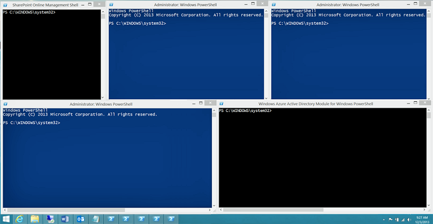

# <a name="connect-to-all-office-365-services-in-a-single-windows-powershell-window"></a>Conectarse a todos los servicios de Office 365 en una sola ventana de Windows PowerShell

 **Resumen:** En lugar de administrar diferentes servicios de Office 365 en distintas ventanas de la consola de PowerShell, puede conectarse a todos los servicios de Office 365 y gestionarlos desde la ventana de consola única.
  
Al usar PowerShell para administrar Office 365, es posible tener hasta cinco sesiones diferentes de Windows PowerShell abierto al mismo tiempo correspondiente al centro de administración de Office 365, SharePoint Online, Exchange Online, Skype para los negocios en línea y la seguridad &amp;Centro de cumplimiento. Con cinco métodos de conexión diferentes en las sesiones de Windows PowerShell independientes, el escritorio tendría la apariencia siguiente:
  

  
Esto no es óptimo para la administración de Office 365 porque no pueden intercambiar datos entre esos cinco ventanas de administración de servicio de la cruz. Este tema describe cómo utilizar una única instancia de Windows PowerShell desde el que puede administrar la seguridad, Skype para los negocios en línea, Exchange Online, SharePoint Online y Office 365 &amp; centro de cumplimiento.

>[!Note]
>Este artículo es que se está actualizando para utilizar el módulo de Active Directory V2 PowerShell de Azure y para la autenticación con varios factores (AMF).
>
  
## <a name="before-you-begin"></a>Antes de empezar
<a name="BeforeYouBegin"> </a>

Para poder administrar todo Office 365 desde una sola instancia de Windows PowerShell, tenga en cuenta los siguientes requisitos previos:
  
- El Office 365 trabajo o escuela cuenta utilizar para estos procedimientos necesidades para ser miembro de una función de administración de Office 365. Para obtener más información, consulte [las funciones de administrador acerca de Office 365](https://go.microsoft.com/fwlink/p/?LinkId=532367). Este requisito para Office 365 PowerShell, pero no necesariamente para todos los demás servicios de Office 365.
    
- Puede usar las siguientes versiones de Windows de 64 bits:
    
  - Windows 10
    
  - Windows 8.1 o Windows 8
    
  - Windows Server 2016
    
  - Windows Server 2012 R2 o Windows Server 2012
    
  - Windows 7 Service Pack 1 (SP1)*
    
  - Windows Server 2008 R2 SP1*
    
    * Debe instalar el Microsoft.NET Framework 4.5. *x* y, a continuación, el Windows Management Framework 3.0 o el marco de trabajo de administración de Windows 4.0. Para obtener más información, vea [instalar el.NET Framework](https://go.microsoft.com/fwlink/p/?LinkId=257868) y [Windows Management Framework 3.0](https://go.microsoft.com/fwlink/p/?LinkId=272757) o [4.0 de Windows Management Framework](https://go.microsoft.com/fwlink/p/?LinkId=391344).
    
    Debe utilizar una versión de 64 bits de Windows debido a los requisitos para el Skype para el módulo de negocios en línea y uno de los módulos de Office 365.
    
- Debe instalar los módulos necesarios para Office 365, SharePoint Online y Skype para los negocios en línea:
    
   - [Servicio en línea Sign-in Ayudante de Microsoft para profesionales de TI RTW](https://go.microsoft.com/fwlink/p/?LinkId=286152)
   - Windows Azure Active Directory módulo para Windows PowerShell (versión de 64 bits) con el comando **Install-módulo MSOnline** en una línea de comandos de PowerShell elevado.
   - [Shell de administración en línea de SharePoint](https://go.microsoft.com/fwlink/p/?LinkId=255251)
   - [Skype para el negocio en línea, módulo de Windows PowerShell](https://go.microsoft.com/fwlink/p/?LinkId=532439)
    
-  Windows PowerShell debe configurarse para ejecutar secuencias de comandos firmadas de Skype para los negocios en línea, Exchange Online y la seguridad &amp; centro de cumplimiento. Para ello, ejecute el siguiente comando en una sesión de Windows PowerShell con privilegios elevados (una ventana de Windows PowerShell que abra seleccionando **Ejecutar como administrador**).
    
  ```
  Set-ExecutionPolicy RemoteSigned
  ```

## <a name="connection-steps"></a>Pasos de conexión
<a name="BeforeYouBegin"> </a>

Estos son los pasos para conectarse a todos los servicios en una sola ventana de PowerShell.
  
1. Abrir Windows PowerShell como administrador (uso de **Ejecutar como administrador**).
    
2. Ejecute este comando y especifique su trabajo en Office 365 o credenciales de la cuenta de la escuela.
    
  ```
  $credential = Get-Credential
  ```

3. Ejecutar estos comandos para conectarse a Office 365.
    
  ```
  Import-Module MsOnline
  Connect-MsolService -Credential $credential
  ```

4. Ejecutar estos comandos para conectarse a SharePoint Online. Reemplazar _ \<domainhost >_ con el valor real de su dominio. Por ejemplo, para `litwareinc.onmicrosoft.com`, el _ \<domainhost >_ valor es `litwareinc`.
    
  ```
  Import-Module Microsoft.Online.SharePoint.PowerShell -DisableNameChecking
  Connect-SPOService -Url https://<domainhost>-admin.sharepoint.com -credential $credential
  ```

5. Ejecutar estos comandos para conectar con Skype para los negocios en línea. Una advertencia acerca de cómo aumentar el `WSMan NetworkDelayms` valor se espera la primera vez que se conecta y se debe omitir.
    
  ```
  Import-Module SkypeOnlineConnector
  $sfboSession = New-CsOnlineSession -Credential $credential
  Import-PSSession $sfboSession
  ```

6. Ejecutar estos comandos para conectarse a Exchange Online.
    
  ```
  $exchangeSession = New-PSSession -ConfigurationName Microsoft.Exchange -ConnectionUri "https://outlook.office365.com/powershell-liveid/" -Credential $credential -Authentication "Basic" -AllowRedirection
  Import-PSSession $exchangeSession -DisableNameChecking
  ```

7. Ejecutar estos comandos para conectarse a la seguridad &amp; centro de cumplimiento.
    
  ```
  $ccSession = New-PSSession -ConfigurationName Microsoft.Exchange -ConnectionUri https://ps.compliance.protection.outlook.com/powershell-liveid/ -Credential $credential -Authentication Basic -AllowRedirection
  Import-PSSession $ccSession -Prefix cc
  ```
> [!NOTE]
> El prefijo de texto "cc" se agrega a *todos los* seguridad &amp; centro de cumplimiento de los nombres de cmdlet para poder ejecutar los cmdlets que existe en Exchange Online y la seguridad &amp; centro de cumplimiento en la misma sesión de Windows PowerShell. Por ejemplo, **Get-RoleGroup** pasa a ser **Get-ccRoleGroup** en la seguridad &amp; centro de cumplimiento.
  
Aquí están todos los comandos en un único bloque. Especificar el nombre del host de dominio y, a continuación, ejecutarlos todos al mismo tiempo.
  
```
$domainHost="<domain host name, such as litware for litwareinc.onmicrosoft.com>"
$credential = Get-Credential
Import-Module MsOnline
Connect-MsolService -Credential $credential
Import-Module Microsoft.Online.SharePoint.PowerShell -DisableNameChecking
Connect-SPOService -Url https://$domainHost-admin.sharepoint.com -credential $credential
Import-Module SkypeOnlineConnector
$sfboSession = New-CsOnlineSession -Credential $credential
Import-PSSession $sfboSession
$exchangeSession = New-PSSession -ConfigurationName Microsoft.Exchange -ConnectionUri "https://outlook.office365.com/powershell-liveid/" -Credential $credential -Authentication "Basic" -AllowRedirection
Import-PSSession $exchangeSession -DisableNameChecking
$ccSession = New-PSSession -ConfigurationName Microsoft.Exchange -ConnectionUri https://ps.compliance.protection.outlook.com/powershell-liveid/ -Credential $credential -Authentication Basic -AllowRedirection
Import-PSSession $ccSession -Prefix cc
```
Cuando esté listo para cerrar la ventana de Windows PowerShell, ejecute este comando para eliminar las sesiones activas en Skype para los negocios en línea, Exchange Online, SharePoint Online y la seguridad &amp; centro de cumplimiento de normas:
  
```
Remove-PSSession $sfboSession ; Remove-PSSession $exchangeSession ; Remove-PSSession $ccSession ; Disconnect-SPOService
```

## <a name="new-to-office-365"></a>¿Es la primera vez que usa Office 365?
<a name="LongVersion"> </a>

[!INCLUDE [LinkedIn Learning Info](../common/office/linkedin-learning-info.md)]

## <a name="see-also"></a>Consulte también

- [Administrar Office 365 con PowerShell de Office 365](manage-office-365-with-office-365-powershell.md)
- [Introducción a PowerShell de Office 365](getting-started-with-office-365-powershell.md)
- [Administrar SharePoint Online con PowerShell de Office 365](manage-sharepoint-online-with-office-365-powershell.md)
- [Administrar licencias y cuentas de usuario con PowerShell de Office 365](manage-user-accounts-and-licenses-with-office-365-powershell.md)
- [Usar Windows PowerShell para crear informes en Office 365](use-windows-powershell-to-create-reports-in-office-365.md)
