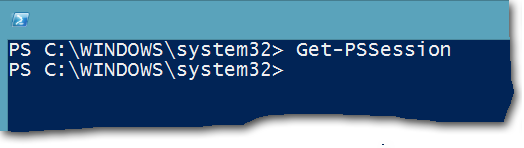

# <a name="connect-to-all-office-365-services-in-a-single-windows-powershell-window"></a>Conectarse a todos los servicios de Office 365 en una sola ventana de Windows PowerShell

 **Summary:** Instead of managing different Office 365 services in separate PowerShell console windows, you can connect to all Office 365 services and manage them from single console window.
  
When you use PowerShell to manage Office 365, it is possible to have up to five different Windows PowerShell sessions open at the same time corresponding to Office 365 admin center, SharePoint Online, Exchange Online, Skype for Business Online, and the Security &amp; Compliance Center. With five different connection methods in separate Windows PowerShell sessions, your desktop could look like this:
  

  
This is not optimal for managing Office 365 because you can't exchange data among those five windows for cross-service management. This topic describes how to use a single instance of Windows PowerShell from which you can manage Office 365, Skype for Business Online, Exchange Online, SharePoint Online, and the Security &amp; Compliance Center.
  
## <a name="before-you-begin"></a>Antes de empezar
<a name="BeforeYouBegin"> </a>

Before you can manage all of Office 365 from a single instance of Windows PowerShell, consider the following prerequisites:
  
- The Office 365 work or school account that you use for these procedures needs to be a member of an Office 365 admin role. For more information, see [About Office 365 admin roles](https://go.microsoft.com/fwlink/p/?LinkId=532367). This a requirement for Office 365 PowerShell, not necessarily for all other Office 365 services.
    
- Puede usar las siguientes versiones de Windows de 64 bits:
    
  - Windows 10
    
  - Windows 8.1 o Windows 8
    
  - Windows Server 2016
    
  - Windows Server 2012 R2 o Windows Server 2012
    
  - Windows 7 Service Pack 1 (SP1)*
    
  - Windows Server 2008 R2 SP1*
    
    * You need to install the Microsoft .NET Framework 4.5. _x_ and then either the Windows Management Framework 3.0 or the Windows Management Framework 4.0. For more information, see [Installing the .NET Framework](https://go.microsoft.com/fwlink/p/?LinkId=257868) and [Windows Management Framework 3.0](https://go.microsoft.com/fwlink/p/?LinkId=272757) or [Windows Management Framework 4.0](https://go.microsoft.com/fwlink/p/?LinkId=391344).
    
    You need to use a 64-bit version of Windows because of the requirements for the Skype for Business Online module and one of the Office 365 modules.
    
- You need to install the modules that are required for Office 365, SharePoint Online, and Skype for Business Online:
    
  - [Microsoft Online Service Sign-in Assistant for IT Professionals RTW](https://go.microsoft.com/fwlink/p/?LinkId=286152)
    
  - [Windows Azure Active Directory Module for Windows PowerShell (64-bit version)](https://go.microsoft.com/fwlink/p/?linkid=236297)
    
  - [SharePoint Online Management Shell](https://go.microsoft.com/fwlink/p/?LinkId=255251)
    
  - [Skype for Business Online, Windows PowerShell Module](https://go.microsoft.com/fwlink/p/?LinkId=532439)
    
-  Windows PowerShell needs to be configured to run signed scripts for Skype for Business Online, Exchange Online, and the Security &amp; Compliance Center. To do this, run the following command in an elevated Windows PowerShell session (a Windows PowerShell window you open by selecting **Run as administrator**).
    
  ```
  Set-ExecutionPolicy RemoteSigned
  ```

## <a name="the-short-version-instructions-without-explanations"></a>Versión corta (instrucciones sin explicaciones)
<a name="ShortVersion"> </a>

Esta sección presenta los pasos de conexión sin explicaciones detalladas. Si tiene preguntas o desea obtener más información, puede leer el resto del tema. Los números de estos pasos coinciden con los números de las secciones del resto del tema:
  
1. Open Windows PowerShell as an administrator (use **Run as administrator**).
    
2. Run this command, and enter your Office 365 work or school account credentials.
    
  ```
  $credential = Get-Credential
  ```

3. Run these commands to connect to Office 365.
    
  ```
  Import-Module MsOnline
  Connect-MsolService -Credential $credential
  ```

4. Run these commands to connect to SharePoint Online. Replace  _\<domainhost>_ with the actual value for your domain. For example, for `litwareinc.onmicrosoft.com`, the  _\<domainhost>_ value is `litwareinc`.
    
  ```
  Import-Module Microsoft.Online.SharePoint.PowerShell -DisableNameChecking
  Connect-SPOService -Url https://<domainhost>-admin.sharepoint.com -credential $credential
  ```

5. Run these commands to connect to Skype for Business Online. A warning about increasing the `WSMan NetworkDelayms` value is expected the first time you connect and should be ignored.
    
  ```
  Import-Module SkypeOnlineConnector
  $sfboSession = New-CsOnlineSession -Credential $credential
  Import-PSSession $sfboSession
  ```

6. Run these commands to connect to Exchange Online.
    
  ```
  $exchangeSession = New-PSSession -ConfigurationName Microsoft.Exchange -ConnectionUri "https://outlook.office365.com/powershell-liveid/" -Credential $credential -Authentication "Basic" -AllowRedirection
  Import-PSSession $exchangeSession -DisableNameChecking
  ```

7. Run these commands to connect to the Security &amp; Compliance Center.
    
  ```
  $ccSession = New-PSSession -ConfigurationName Microsoft.Exchange -ConnectionUri https://ps.compliance.protection.outlook.com/powershell-liveid/ -Credential $credential -Authentication Basic -AllowRedirection
  Import-PSSession $ccSession -Prefix cc
  ```
> [!NOTE]
> The text prefix "cc" is added to  *all*  Security &amp; Compliance Center cmdlet names so you can run cmdlets that exist in both Exchange Online and the Security &amp; Compliance Center in the same Windows PowerShell session. For example, **Get-RoleGroup** becomes **Get-ccRoleGroup** in the Security &amp; Compliance Center.
  
Here are all the commands in a single block. Specify the name of your domain host, and then run them all at one time.
  
```
$domainHost="<domain host name, such as litware for litwareinc.onmicrosoft.com>"
$credential = Get-Credential
Import-Module MsOnline
Connect-MsolService -Credential $credential
Import-Module Microsoft.Online.SharePoint.PowerShell -DisableNameChecking
Connect-SPOService -Url https://$domainHost-admin.sharepoint.com -credential $credential
Import-Module SkypeOnlineConnector
$sfboSession = New-CsOnlineSession -Credential $credential
Import-PSSession $sfboSession
$exchangeSession = New-PSSession -ConfigurationName Microsoft.Exchange -ConnectionUri "https://outlook.office365.com/powershell-liveid/" -Credential $credential -Authentication "Basic" -AllowRedirection
Import-PSSession $exchangeSession -DisableNameChecking
$ccSession = New-PSSession -ConfigurationName Microsoft.Exchange -ConnectionUri https://ps.compliance.protection.outlook.com/powershell-liveid/ -Credential $credential -Authentication Basic -AllowRedirection
Import-PSSession $ccSession -Prefix cc
```

When you are ready to close down the Windows PowerShell window, run this command to remove the active sessions to Skype for Business Online, Exchange Online, SharePoint Online, and the Security &amp; Compliance Center:
  
```
Remove-PSSession $sfboSession ; Remove-PSSession $exchangeSession ; Remove-PSSession $ccSession ; Disconnect-SPOService
```

## <a name="the-long-version-instructions-with-detailed-explanations"></a>Versión larga (instrucciones con explicaciones detalladas)
<a name="LongVersion"> </a>

### <a name="step-1-open-windows-powershell-as-an-administrator"></a>Paso 1: Abrir Windows PowerShell como administrador
<a name="Step1"> </a>

If you're running Windows 10, Windows 8, Windows 8.1, Windows Server 2016, Windows Server 2012 R2, or Windows Server 2012 R2, do this:
  
1. Use any of these methods to find the shortcut for **Windows PowerShell**:
    
  - On the Start screen, click an empty area, and type Windows PowerShell.
    
  - En el escritorio o la pantalla de inicio, presione el Windows teclas CTRL+q. En el encanto de búsqueda, escriba Windows PowerShell.
    
  - On the desktop or the Start screen, move your cursor to the upper-right corner, or swipe left from the right edge of the screen to show the charms. Select the Search charm, and enter Windows PowerShell.
    
2. In the results, right-click **Windows PowerShell**, and select **Run as administrator**.
    
3. If the **User Account Control** dialog box appears, select **Yes** to verify that you want to run Windows PowerShell under administrator credentials.
    
If you're running Windows 7 SP1 (or Windows Server 2008 R2 SP1), do this:
  
1. On the **Start** menu, select **All Programs** > **Accessories** > **Windows PowerShell**. Right-click **Windows PowerShell**, and then select **Run as administrator**.
    
2. If the **User Account Control** dialog box appears, select **Yes** to verify that you want to run Windows PowerShell under administrator credentials.
    
You must run Windows PowerShell as an administrator. If you don't, you're going to get an error message similar to this when you try to import one of the required modules.
  
```
The specified module 'Microsoft.Online.SharePoint.Online.PowerShell' was not loaded because no valid module file was found in any directory.
```

The only way to remedy the situation is to close Windows PowerShell and restart it as an administrator. Here's a quick and easy way to tell if you're running Windows PowerShell as an administrator: the prompt is  `PS C:\Windows\System32>`, not  `PS C:\Users\YourUserName>`.

  
### <a name="step-2-create-a-windows-powershell-credentials-object"></a>Paso 2: Crear un objeto de credenciales de Windows PowerShell
<a name="Step2"> </a>

The credentials object provides an encrypted way to pass your user name and password to Windows PowerShell. To create a credentials object, run the following command in Windows PowerShell.
  
```
$credential = Get-Credential
```

> [!NOTE]
>  `$credential` is a variable that will store the credentials object. You don't have to name the variable `$credential`, but doing so makes it easier to remember which variable contains the credentials object. (And that's important, because we'll reuse this variable several times.) That will also make it easier for you to follow our examples, because this article will always use  `$credential` to represent the credentials object.
  
Windows PowerShell will then display a dialog box that looks like this.
  

  
Type your work or school account user name in the **User name** box, using the format _username@domainname_ (for example, kenmyer@litwareinc.onmicrosoft.com); type your password in the **Password** box; and then click **OK**:
  

  
Tenga en cuenta que, como suele ser el caso, no verá a ningún tipo de confirmación que se creó el objeto de credenciales. (Windows PowerShell normalmente indica cuando cosas ir mal, pero no siempre sabrá cuando las cosas van derecho.) Si desea comprobar que se creó el objeto de credenciales, escriba lo siguiente en Windows PowerShell y, a continuación, presione ENTRAR.
  
```
$credential
```

Luego debería ver algo parecido a esto en la pantalla.
  
```
UserName                               Password
--------                               --------
kenmyer@litwareinc.onmicrosoft.com     System.Security.SecureString
```

Una cosa a tener en cuenta aquí es que el cmdlet [Get-Credential](https://go.microsoft.com/fwlink/p/?LinkId=389618) sólo crea el objeto de credenciales; no autentica ni lo contrario Compruebe que el nombre de usuario y la contraseña son correctos. Por ejemplo, supongamos que ha escrito incorrectamente el nombre de usuario como kenmyer@litwareinc.onmicrosoft.com. Si lo hace, **Get-Credential** creará un objeto de credenciales con ese nombre de usuario y sin comprobar para ver si ese es realmente un nombre de usuario válido. No sabrá si ha creado un objeto de credenciales válidas realmente hasta que realmente utiliza dicho objeto para intentar conectarse a los servicios de Office 365.
  
### <a name="step-3-connect-to-office-365"></a>Paso 3: Conexión a Office 365
<a name="Step3"> </a>

We'll start by connecting to Office 365 itself. 
  
The first thing we need to do here is import the Office 365 module (the Microsoft Azure Active Directory Module for Windows PowerShell). To do that, run this command in Windows PowerShell.
  
```
Import-Module MsOnline
```

Si quiere comprobar si el módulo se importó, ejecute este comando.
  
```
Get-Module
```

En algún lugar de la lista de módulos que son devueltas por este comando debería ver algo similar a esto: `Manifest 1.0 MSOnline {Add-MsolForeignGroupToRole, Add-MsolG...}`.
  
Si ve `MSOnline` en la lista, eso significa que todo haya salido según el plan.
  
With the credentials object created (see [Step 2: Create a Windows PowerShell credentials object](connect-to-all-office-365-services-in-a-single-windows-powershell-window.md#Step2)) and with the  `MsOnline` module loaded, we can now connect to Office 365 by using the [Connect-MsolService](https://go.microsoft.com/fwlink/p/?LinkId=532375) cmdlet and the following command.
  
```
Connect-MsolService -Credential $credential
```

Notice that all you have to provide is the credentials object ( `$credential`). Based on those credentials, Office 365 will automatically connect you to the correct domain. You do not have to specify your domain name when running **Connect-MsolService**.
  
To verify that you really  *are*  connected to Office 365, run this command.
  
```
Get-MsolDomain
```

A cambio, debería obtener algo similar a esto:
  
```
Name                         Status          Authentication
----                         ------          --------------
litwareinc.onmicrosoft.com   Verified        Managed
```

### <a name="step-4-connect-to-sharepoint-online"></a>Paso 4: Conectarse a SharePoint Online
<a name="Step4"> </a>

Importar el módulo de SharePoint Online con el siguiente comando:
  
```
Import-Module Microsoft.Online.SharePoint.PowerShell -DisableNameChecking
```

El modificador _DisableNameChecking_ suprime esta advertencia.
  
```
WARNING: The names of some imported commands from the module 'Microsoft.Online.SharePoint.PowerShell' include unapproved verbs that might make them less discoverable. To find the commands with unapproved verbs, run the Import-Module command again with the Verbose parameter. For a list of approved verbs, type Get-Verb.
```

Para conectar con SharePoint Online, deberá suministrar dos fragmentos de información: las credenciales y la URL de su sitio de administración de SharePoint Online. La parte de credenciales es fácil: ya nos hemos almacenado en la variable `$credential` (consulte [paso 2: crear un objeto de credenciales de Windows PowerShell](connect-to-all-office-365-services-in-a-single-windows-powershell-window.md#Step2)). En cuanto a la dirección URL de su sitio de administración, que es bastante fácil de determinar, también. Supongamos que es el nombre de dominio de Office 365 `litwareinc.onmicrosoft.com`.
  
Para determinar la dirección URL del sitio de administración, realice lo siguiente:
  
1. Start by using the prefix  `https://`.
    
2. Add the domain host portion of your domain name. For example, for  `litwareinc.onmicrosoft.com`, the domain host name is  `litwareinc`. For  `contoso.onmicrosoft.com`, the domain host name is  `contoso`.
    
3. Add a hyphen (-) followed by  `admin.sharepoint.com`.
    
En otras palabras:
  
 `https://` + `litwareinc` + `-admin.sharepoint.com` = `https://litwareinc-admin.sharepoint.com`
  
Una vez construido el URL, puede utilizar esa dirección URL y el objeto de credenciales para conectarse a SharePoint Online. Llamar al cmdlet [Connect-SPOService](https://go.microsoft.com/fwlink/p/?LinkId=532436) , con un comando similar a éste.
  
```
Connect-SPOService -Url https://litwareinc-admin.sharepoint.com -credential $credential
```

To verify that the connection has been made, run the following command in Windows PowerShell.
  
```
Get-SPOSite
```

You should get a list of all your SharePoint Online sites. Here is an example:
  
```
Url                                       Owner          Storage Quota
---                                       -----          -------------
http://litwareinc-public.sharepoint.com/                 1000
https://litwareinc.sharepoint.com/                       1000
https://litwareinc.sharepoint.com/search                 1000
```

Los comandos de Office 365 (los que se describen en [paso 3: conectarse a Office 365](connect-to-all-office-365-services-in-a-single-windows-powershell-window.md#Step3)) le siguen funcionando. (Intente ejecutar **Get-MsolUser**y véalo por sí mismo). Esto significa que ahora puede administrar Office 365 y SharePoint Online desde la misma instancia de Windows PowerShell.
  
### <a name="step-5-connect-to-skype-for-business-online"></a>Paso 5: Conectarse a Skype Empresarial Online
<a name="Step5"> </a>

Conectar con Skype para los negocios en línea (y Exchange Online o la seguridad &amp; centro de cumplimiento) es diferente de la conexión a Office 365 y SharePoint Online. Eso es porque el Skype para los cmdlets de Exchange Online y negocios en línea no se instaló en el equipo, como ocurre con el Office 365 y los cmdlets de SharePoint Online. En su lugar, cada vez que inicies sesión, los cmdlets adecuados se copian temporalmente en el equipo. Cuando aprueban, los cmdlets se quitan del equipo.
  
Para conectar con Skype para los negocios en línea, debe importar el Skype para el módulo de negocios en línea. Para ello, ejecute este comando.
  
```
Import-Module SkypeOnlineConnector
```

La primera vez que lo haga, verá el siguiente mensaje de advertencia, que se puede pasar por alto.
  
```
WARNING: WSMan NetworkDelayms has been set to 30000 milliseconds. The previous value was 5000 milliseconds.
WARNING: To improve the performance of the Lync Online Connector, it is recommended that the network delay be set to
30000 milliseconds (30 seconds). However, you can use Set-WinRMNetworkDelayMS to change the network delay to any
integer value.
```

Tras importar el módulo, ejecute este comando.
  
```
$sfboSession = New-CsOnlineSession -Credential $credential
```

We have created a remote PowerShell session. In this case, that means that we've connected to an instance of Windows PowerShell running on one of the Office 365 servers. 
  
Aunque hemos hecho una conexión a Office 365, nosotros no hemos descargado las secuencias de comandos, cmdlets y otros elementos necesarios para administrar Skype para los negocios en línea. Para ello, se debe ejecutar este comando.
  
```
Import-PSSession $sfboSession
```

Cuando se importa a la sesión de Windows PowerShell, verá una barra de progreso similar a la siguiente, una barra de progreso que informa sobre todos lo Skype para los negocios en línea cmdlets que se importa a su equipo.
  

  
Cuando la barra de progreso desaparezca, debería obtener un resultado similar al siguiente:
  
```
ModuleType Version    Name               ExportedCommands
---------- -------    ----               ----------------
Script     1.0        tmp_swc5mp4v.1ck  {Copy-CsVoicePolicy, Disabl...
```

### <a name="step-6-connect-to-exchange-online"></a>Paso 6: Conectarse a Exchange Online
<a name="Step6"> </a>

Run this command, which creates a remote Windows PowerShell session with Exchange Online.
  
```
$exchangeSession = New-PSSession -ConfigurationName Microsoft.Exchange -ConnectionUri "https://outlook.office365.com/powershell-liveid/" -Credential $credential -Authentication "Basic" -AllowRedirection
```

> [!NOTE]
> ¿Por qué es el comando para conectarse a Exchange Online más complicado que el comando para conectar con Skype para los negocios en línea? Técnicamente, no es: ambos comandos hacen exactamente lo mismo. Sin embargo, el Skype para los negocios en línea equipo crea su propio cmdlet: **New-CsOnlineSession** , que oculta algunos de los parámetros (como _la autenticación_ y _AllowRedirection_) que se utilizan al conectarse a Exchange Online. En lugar de tener que escribir esa información manualmente, los parámetros de _autenticación_ y _AllowRedirection_ se desarrollan con eficacia para el cmdlet **New-CsOnlineSession** . Tendrá que escribir esos parámetros al conectarse a Exchange Online porque Exchange Online utiliza el cmdlet [New-PSSession](https://go.microsoft.com/fwlink/p/?LinkId=389621) estándar para conectarse a Office 365. La desventaja es que tiene que escribir algo más para ello. La ventaja es que no tienes que descargar e instalar un módulo Exchange Online.
  
Ahora todo lo que tiene que hacer es importar esta sesión remota, como hicimos con Skype para los negocios en línea.
  
```
Import-PSSession $exchangeSession -DisableNameChecking
```

Debería ver algo parecido a esto en la pantalla.
  
```
ModuleType Version  Name             ExportedCommands
---------- -------  ----             ----------------
Script     1.0      tmp_nweiqjvl.geu {Add-AvailabilityAddressSpace...
```

Ahora, intente ejecutar este comando:
  
```
Get-AcceptedDomain
```

In return, you should see information about your Office 365 domains that are configured for email addresses in Exchange Online.
  
```
Name            DomainName          DomainType      Default
----            ----------          ----------      -------
litwareinc.com  litwareinc.com      Authoritative   True
```

### <a name="step-7-connect-to-the-security-amp-compliance-center"></a>Step 7: Connect to the Security &amp; Compliance Center
<a name="Step7"> </a>

The Security &amp; Compliance Center is a service in Office 365 that lets you to manage compliance features from one location. For more information, see [Office 365 compliance center](http://technet.microsoft.com/library/fde83656-f136-448d-b250-6fa17b503e4e.aspx).
  
Las instrucciones de conexión para la seguridad &amp; centro de cumplimiento son muy similares a las de Exchange Online, pero con mayor complicación, que verá en el momento.
  
Ejecutar este comando, que se crea una sesión remota de PowerShell con la seguridad &amp; centro de cumplimiento.
  
```
$ccSession = New-PSSession -ConfigurationName Microsoft.Exchange -ConnectionUri https://ps.compliance.protection.outlook.com/powershell-liveid/ -Credential $credential -Authentication Basic -AllowRedirection
```

Ahora ejecute este comando:
  
```
Import-PSSession $ccSession -Prefix cc
```

De nuevo, este comando es muy similar al comando para Exchange Online. El conmutador de _DisableNameChecking_ no es necesario porque no hay ningún verbo no aprobada en la seguridad &amp; centro de cumplimiento. Pero ¿qué pasa con ese adicionales `-Prefix cc` parámetro y valor? Que es la mayor complicación que dijimos acerca de.
  
Exchange Online y la seguridad &amp; centro de cumplimiento compartir algunos cmdlets que tienen exactamente los mismos nombres y proporcionan la misma funcionalidad. **Get-RoleGroup** es un ejemplo.
  
Así que, ¿qué sucede si se intenta importar dos sesiones que contengan cmdlets con el mismo nombre? Colisionen. Obtendrá un mensaje de advertencia amarillo grande que dice `WARNING: Proxy creation has been skipped for the following command:` seguido por la lista de cmdlets en conflicto que no se pudo importar. ¿El resultado final? Puede ejecutar **Get-RoleGroup** en Exchange Online debido a que hay conectado en primer lugar, pero no puede ejecutar **Get-RoleGroup** en la seguridad &amp; centro de cumplimiento debido a que hay conectado última y los cmdlets en conflicto se negaron a importar.
  
La forma más sencilla de resolver este problema es agregar un prefijo de texto arbitrario a la seguridad importado &amp; cmdlets de centro de cumplimiento. Lo hicimos usando el _prefijo de_ parámetro con el valor "cc" en el cmdlet **Import-PSSession** . ¿Qué hizo para nosotros? Eliminan los conflictos cambiando (ligeramente) la seguridad &amp; nombres de cmdlet de centro de cumplimiento para esta sesión. Toda la seguridad importada &amp; centro de cumplimiento cmdlets ahora comenzar con "cc" en la parte del sustantivo del nombre del cmdlet (a la derecha de la "-"). Por ejemplo, el cmdlet **Get-RoleGroup** contencioso se convierte en **Get-ccRoleGroup** para la seguridad &amp; centro de cumplimiento de normas para que no entre en conflicto con **Get RoleGroup** para Exchange Online.
  
¿El inconveniente?  *Todos los*  Seguridad &amp; nombres de cmdlet de centro de cumplimiento reciben el prefijo "cc" — incluso cmdlets únicos que no lo necesitan. Por ejemplo, **Get-ComplianceSearch** se convierte en **Get-ccComplianceSearch** aunque hay un tal cmdlet de Exchange en línea. Al considerar los beneficios de la administración de todos los servicios de Office 365 en una única sesión de Windows PowerShell es un poco de una molestia, pero no está tan mal. Recuerde agregar "cc" a los nombres de cmdlet para todos los procedimientos en la seguridad &amp; centro de cumplimiento.
  
Si todo va bien, verá algo parecido a esto:
  
```
ModuleType Version  Name             ExportedCommands
---------- -------  ----             ----------------
Script     1.0      tmp_xbbx5exr.ehm {Add-ccRoleGroupMember, Get-ccAdminAuditLogConfig, Get-ccA...
```

Now you are free to manage all Office 365 services in a single Windows PowerShell session.
  
### <a name="step-8-gracefully-end-your-powershell-sessions"></a>Paso 8: Finalizar la sesiones de PowerShell
<a name="Step8"> </a>

If you just close the Windows PowerShell window, your Skype for Business Online remote connection will remain active for the next 15 minutes or so. Because Skype for Business Online limits the number of simultaneous connections that any one person or any one domain can have open, that could be a problem. With Skype for Business Online, an individual administrator can have, at most, three open connections at one time, and a domain can have a maximum of nine open connections. If you sign in to Skype for Business Online and then exit without properly closing the session, that session remains open for the next 15 minutes or so. As a result, that's one fewer connection available to you or to other administrators in your domain.
  
En su lugar, vamos a cerrar las sesiones remotas Skype para los negocios en línea, Exchange Online y la seguridad &amp; cumplimiento centrar correctamente. Antes de hacerlo, ejecute este comando.
  
```
Get-PSSession
```

El cmdlet [Get-PSSession](https://go.microsoft.com/fwlink/p/?LinkId=532437) debe mostrar que tiene abierto al menos tres sesiones remotas, uno para Skype para los negocios en línea, uno para Exchange Online y otro para la seguridad &amp; centro de cumplimiento de normas (es posible que podría tener más de tres remoto sesiones que se ejecutan, dependiendo de si ya ha utilizado esta instancia de Windows PowerShell para conectarse a otra cosa aparte de los servicios de Office 365). Debería ver algo parecido a lo siguiente.
  
```
Id Name     ComputerName     State   ConfigurationName    Availability
-- ----     ------------     -----   -----------------    ------------
 1 Session1 webdir0a.onl...  Opened  Microsoft.PowerShell    Available
 2 Session2 outlook.offi...  Opened  Microsoft.Exchange      Available
 3 Session3 ps.complianc...  Opened  Microsoft.Exchange      Available
```

To close these three sessions, run these commands one at a time. The first command closes the Skype for Business Online session, the second closes the Exchange Online session, and the third closes the Security &amp; Compliance Center session.
  
```
Remove-PSSession $sfboSession
Remove-PSSession $exchangeSession
Remove-PSSession $ccSession
```

If you now run the **Get-PSSession** cmdlet, you should see nothing at all (unless you have other remote sessions up and running).
  

  
> [!NOTE]
> Si prefiere cerrar todas las sesiones remotas al mismo tiempo, puede utilizar este comando: >`Get-PSSession | Remove-PSSession`
  
If you now try running a cmdlet from any of these closed sessions (for example, **Get-CsMeetingConfiguration** in Skype for Business Online) you'll get an error message that's similar to this one.
  
```
Get-CsMeetingConfiguration : The term 'Get-CsMeetingConfiguration' is not recognized as the name of a cmdlet, function, script file, or operable program. Check the spelling of the name, or if a path was included, verify that the path is correct and try again.
```

We get that error message because the cmdlets for Skype for Business Online, Exchange Online, and the Security &amp; Compliance Center were deleted when we closed the remote sessions.
  
To close the SharePoint Online session, type this command.
  
```
Disconnect-SPOService
```

If you now try to run the **Get-SPOSite** cmdlet, you'll get an error message like this.
  
```
get-sposite : No connection available. Use Connect-SPOService before running this CmdLet.
```

You can't retrieve site information because you're no longer connected to SharePoint Online.
  
As for your connection to Office 365, although there's a **Connect-MsolService** cmdlet, there's no corresponding **Disconnect-MsolService** cmdlet. So for Office 365, just close the Windows PowerShell window. Nevertheless, it's still a good idea to do this last so you can properly disconnect from SharePoint Online, Skype for Business Online, Exchange Online, and the Security &amp; Compliance Center.
  
## <a name="new-to-office-365"></a>¿Es la primera vez que usa Office 365?
<a name="LongVersion"> </a>

||
|:-----|
| **¿Es la primera vez que usa Office 365?**         LinkedIn Learning pone a su disposición vídeos gratuitos de cursos de [Office 365 admins and IT pros](https://support.office.com/article/Office-365-admin-and-IT-pro-courses-68cc9b95-0bdc-491e-a81f-ee70b3ec63c5). |
   
## <a name="see-also"></a>Consulte también

#### 

[Administrar Office 365 con PowerShell de Office 365](manage-office-365-with-office-365-powershell.md)
  
[Introducción a PowerShell de Office 365](getting-started-with-office-365-powershell.md)
  
[Administrar SharePoint Online con PowerShell de Office 365](manage-sharepoint-online-with-office-365-powershell.md)
  
[Administrar licencias y cuentas de usuario con PowerShell de Office 365](manage-user-accounts-and-licenses-with-office-365-powershell.md)
  
[Usar Windows PowerShell para crear informes en Office 365](use-windows-powershell-to-create-reports-in-office-365.md)

