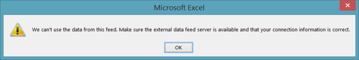
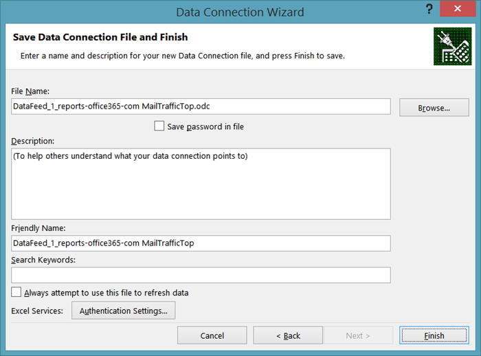
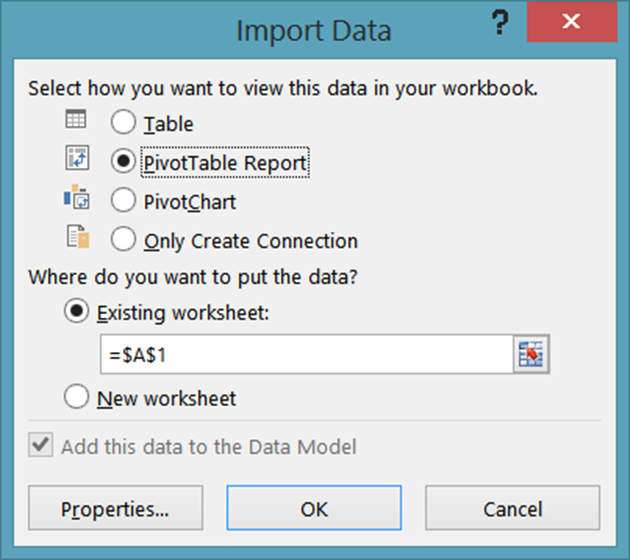

# <a name="using-excel-to-retrieve-office-365-reporting-data"></a><span data-ttu-id="f47c2-103">Uso de Excel para recuperar datos de informes de Office 365</span><span class="sxs-lookup"><span data-stu-id="f47c2-103">Using Excel to Retrieve Office 365 Reporting Data</span></span>

 <span data-ttu-id="f47c2-104">**Resumen:** use la característica de OData en Microsoft Excel para recuperar información detallada para la implementación de Office 365.</span><span class="sxs-lookup"><span data-stu-id="f47c2-104">**Summary:** Use the oData feature in Microsoft Excel to retrieve detailed reporting information for your deployment of Office 365</span></span>
  
<span data-ttu-id="f47c2-p101">La creación de informes es una parte clave de la administración del sistema. El Centro de administración de Office 365 incluye varios informes predefinidos a los que puede acceder desde la sección **Informes** del panel de navegación izquierdo. Hay informes de uso e informes de seguridad y cumplimiento.</span><span class="sxs-lookup"><span data-stu-id="f47c2-p101">Reporting is a key part of system administration. The Office 365 Admin center includes a number of predefined reports, which you can access from the **Reports** section of the left navigation. There are usage reports and security and compliance reports.</span></span>
  
<span data-ttu-id="f47c2-p102">Los informes disponibles dependen de la versión de Office 365 que esté utilizando y de los servicios de Office 365 que haya habilitado. Para más información, consulte la [página Informes](https://technet.microsoft.com/es-ES/library/office-365-reports.aspx).</span><span class="sxs-lookup"><span data-stu-id="f47c2-p102">The reports available to you depend on the version of Office 365 you are using and which Office 365 services you have enabled. For more information, see the [Reports page](https://technet.microsoft.com/es-ES/library/office-365-reports.aspx).</span></span>
  
<span data-ttu-id="f47c2-p103">Los informes predefinidos del Centro de administración son un recurso excelente. Facilitan la comprobación de aspectos como el uso del buzón de correo o el número de minutos que los usuarios emplean en las conferencias en línea. Sin embargo, cuando se trata de un análisis detallado del dominio de Office 365, los informes tienen sus limitaciones.</span><span class="sxs-lookup"><span data-stu-id="f47c2-p103">The pre-defined Admin center reports are an excellent resource. They make it easy to check on such things as mailbox usage or the number of minutes that your users have been spending in online conferences. However, when it comes to detailed analysis of your Office 365 domain, the reports do have their limitations.</span></span>
  
<span data-ttu-id="f47c2-p104">Una forma de evitar estas limitaciones es utilizar otro lenguaje de desarrollo o de Windows PowerShell para acceder al servicio de generación de informes de Office 365 y crear informes personalizados; los informes personalizados le ofrecen la posibilidad de dictar qué datos (y cuántos) se devuelven desde el servicio de informes de Office 365. También puede especificar cómo deben organizarse y agruparse los datos mediante la escritura de informes personalizados y, si procede, cómo se guardarán esos datos. Por ejemplo, puede guardar datos en formato XML o en un formato de valores separados por comas que pueda importarse fácilmente en Excel.</span><span class="sxs-lookup"><span data-stu-id="f47c2-p104">One way to work around these limitations is to use Windows PowerShell or another development language to access the Office 365 reporting service and create custom reports; custom reports give you the ability to dictate which data (and how much data) is returned from the Office 365 reporting service. By writing custom reports you can also specify how the data should be sorted and grouped, and, if applicable, how that data should be saved; for example, you can save data in XML format or in a comma-separated values format that can easily be imported in Excel.</span></span> 
  
<span data-ttu-id="f47c2-p105">Además, los scripts y aplicaciones personalizados le permiten acceder a los informes que no están disponibles en el Centro de administración de Office 365. Por ejemplo, el Centro de administración puede indicarle cuántos buzones obsoletos tiene, pero no a qué buzones no se ha accedido en los últimos 30 días. Puede averiguar eso con un script de PowerShell personalizado. En conjunto, esto representa una enorme cantidad de flexibilidad a cambio de tener que escribir un script breve y relativamente simple de Windows PowerShell.</span><span class="sxs-lookup"><span data-stu-id="f47c2-p105">In addition, custom scripts/applications enable you to access reports that are not available in the Office 365 Admin center. For example, the Admin center can tell you how many stale mailboxes you have, but it can't tell which mailboxes haven't been accessed in the past 30 days. That is something that a custom PowerShell script can tell you. Taken together, this represents an enormous amount of flexibility in return for having to write a short and relatively-simple Windows PowerShell script.</span></span>
  
> [!VISUAL BASIC NOTE]<span data-ttu-id="f47c2-119"> Para más información, consulte la [página principal](https://msdn.microsoft.com/es-ES/library/office/jj984325%28v=office.15%29.aspx) para ver el servicio de generación de informes de Office 365.</span><span class="sxs-lookup"><span data-stu-id="f47c2-119"> For more information, see the [home page](https://msdn.microsoft.com/es-ES/library/office/jj984325%28v=office.15%29.aspx) for the Office 365 reporting service.</span></span>
  
<span data-ttu-id="f47c2-p106">Para poder recuperar estos datos es necesario escribir código de algún tipo. Esto vale la pena si pertenece a una gran organización que debe limitar la cantidad y el tipo de información que se devuelve. Pero si la organización es más pequeña y no es necesario limitar la cantidad ni el tipo de información que se devuelve, se pueden abrir los informes de Office 365 directamente desde Excel.</span><span class="sxs-lookup"><span data-stu-id="f47c2-p106">In order to retrieve this data, you do have to write code of some kind. That's worth it if you are a larger organization that needs to limit the amount and the type of information that gets returned. But if you're a smaller organization, and you don't need to limit the amount and type of information that gets returned, you might consider opening the Office 365 reports from within Excel itself.</span></span>
  
<span data-ttu-id="f47c2-p107">Sin embargo, existen algunas limitaciones, y la principal es que no se pueden filtrar, ordenar, seleccionar ni manipular de ninguna forma los datos que se devuelven. En su lugar, simplemente obtiene el conjunto predeterminado de datos que devuelve el informe. En algunos casos, es posible que no haya suficientes datos. Por ejemplo, el informe puede devolver datos, pongamos por caso, únicamente del mes anterior y no de todo el año. Por el contrario, en otros casos es posible que haya demasiados datos: es posible que obtenga datos de todo el año aunque solo quiera los del mes anterior.</span><span class="sxs-lookup"><span data-stu-id="f47c2-p107">However, there are a few limitations here, the primary one being this: you cannot filter, sort, select, or otherwise manipulate the data that before it gets returned. Instead, you simply get back the default set of data returned by the report. In some cases that might not be enough data. For example, the report might return data for, say, only the previous month and not for the entire year. Conversely, in other cases that might be too much data: you might get back data for the entire year even though you only want data for the previous month.</span></span>
  
<span data-ttu-id="f47c2-128">Para abrir un informe de Office 365 directamente desde Excel, haga lo siguiente:</span><span class="sxs-lookup"><span data-stu-id="f47c2-128">To open an Office 365 report directly from within Excel, complete the following procedure:</span></span>
  
1. <span data-ttu-id="f47c2-p108">Empiece por abrir una nueva hoja de cálculo en Excel. En esa hoja de cálculo, haga clic en **Datos**, en **De otras fuentes** y, después, en **De la fuente de datos ODATA**. Esto abre el cuadro de diálogo **Asistente para la conexión de datos**:</span><span class="sxs-lookup"><span data-stu-id="f47c2-p108">Start by opening a new worksheet in Excel. On that worksheet, click **Data**, click **From Other Sources**, and then click **From OData Data Feed**. That brings up the **Data Connection Wizard** dialog box:</span></span>
    
     
  
2. <span data-ttu-id="f47c2-p109">En la página **Conectar con una fuente de datos**, escriba ( **https://reports.office365.com/ecp/reportingwebservice/reporting.svc/** ) como ubicación de la fuente de datos. Tenga en cuenta que solo puede especificar la dirección URL base tal como se muestra; no puede agregar ninguna instrucción de selección, filtro ni formato. Si escribe cualquier cosa adicional a la URL base no obtendrá ningún dato; en su lugar, simplemente verá el siguiente mensaje de error:</span><span class="sxs-lookup"><span data-stu-id="f47c2-p109">On the **Connect to a Data Feed** page, enter **https://reports.office365.com/ecp/reportingwebservice/reporting.svc/** as the data feed location. Note that you can only enter the base URL as shown; you cannot add any Select, Filter, or Format statements. If you enter anything but the base URL you won't get back any data; instead, you'll simply see the following error message:</span></span>
    
     
  
3. <span data-ttu-id="f47c2-p110">Después de escribir la dirección URL del servicio de generación de informes, seleccione **Usar este nombre y contraseña** en **Credenciales de inicio de sesión**. En el cuadro **Nombre de usuario**, escriba el nombre de inicio de sesión de Office 365 (por ejemplo, admin@litwareinc.onmicrosoft.com). En el cuadro **Contraseña**, escriba la contraseña de inicio de sesión de Office 365 y, a continuación, haga clic en **Siguiente**. Excel intentará conectar con el servicio de generación de informes con las credenciales proporcionadas.</span><span class="sxs-lookup"><span data-stu-id="f47c2-p110">After entering the reporting service URL, select **Use this name and password** under **Log on credentials**. In the **User Name** box, enter your Office 365 logon name (for example, admin@litwareinc.onmicrosoft.com). In the **Password** box, enter your Office 365 logon password and then click **Next**. Excel will then attempt to connect to the reporting service using the supplied credentials.</span></span>
    
4. <span data-ttu-id="f47c2-p111">Una vez que se haya autenticado, verá la página **Seleccionar tablas**. Seleccione el informe que quiera ver (por ejemplo, **FuenteDistribuciónDatos**) y haga clic en **Siguiente**:</span><span class="sxs-lookup"><span data-stu-id="f47c2-p111">After you have been authenticated, you'll see the **Select Tables** page. Select the report that you'd like to view (for example, **MailTrafficTop** ) and then click **Next**:</span></span>
    
     
  
    > [!NOTE]
    > <span data-ttu-id="f47c2-p112">Es posible seleccionar varios informes y, como resultado, se agregarán múltiples tablas o gráficos a la hoja de cálculo de Excel. También es posible crear una única tabla o un solo gráfico que combine datos de varios informes. Pero no lo trataremos en este artículo introductorio.</span><span class="sxs-lookup"><span data-stu-id="f47c2-p112">It's possible to select multiple reports; that results in multiple tables/charts being added to your Excel spreadsheet. It's even possible to create a single table/chart that combines data from multiple reports. However, we won't discuss that in this introductory article.</span></span> 
  
5. <span data-ttu-id="f47c2-147">Después de hacer clic en **Siguiente** aparecerá la página **Guardar archivo de conexión de datos y finalizar**:</span><span class="sxs-lookup"><span data-stu-id="f47c2-147">After clicking **Next** you'll be presented with the **Save Data Connection File and Finish** page:</span></span>
    
     
  
    <span data-ttu-id="f47c2-p113">Aquí no tiene que introducir ningún tipo de información. Para recuperar los datos solo tiene que hacer clic en **Finalizar**. Sin embargo, cabe señalar que, de forma predeterminada, Excel guarda información acerca de cada conexión de datos que realice; estos datos se almacenan en la carpeta **Mis archivos de origen de datos**:</span><span class="sxs-lookup"><span data-stu-id="f47c2-p113">You don't have to enter any information here. All you need to do to retrieve your data is to click **Finish**. However, it's worth noting that, by default, Excel saves information about each data connection you make; this data is stored in your **My Data Sources** folder:</span></span>
    
     
  
    <span data-ttu-id="f47c2-p114">Por ello, el cuadro de diálogo incluye cuadros de texto con etiquetas como **Nombre descriptivo** y **Palabras clave de búsqueda**; estas opciones le ofrecen la oportunidad de personalizar estas conexiones de datos. De este modo no terminará con un montón de orígenes de datos similares a estos:</span><span class="sxs-lookup"><span data-stu-id="f47c2-p114">That's why the dialog box includes text boxes with labels like **Friendly Name** and **Search Keywords**; these options give you the chance to customize these data connections. That way you do not end up with a whole bunch of data sources that look like these:</span></span>
    
  ```
  DataFeed_1_reports-office365-com ClientSoftwareBrowserDetail.odc
DataFeed_1_reports-office365-com MailTrafficTop.odc
DataFeed_1_reports-office365-com Multiple Tables.odc
DataFeed_2_reports-office365-com MailboxActivityWeekly.odc
DataFeed_2_reports-office365-com MailTrafficTop.odc
DataFeed_3_reports-office365-com ClientSoftwareBrowserDetail.odc
  ```

<span data-ttu-id="f47c2-p115">Si selecciona la casilla **Guardar contraseña en archivo**, podrá volver a usar estos orígenes de datos. Por ejemplo, supongamos que guarda una conexión de datos como **Informe de explorador del cliente**. La próxima vez que quiera obtener información sobre los exploradores web que se usan para acceder a su dominio de Office 365, no tendrá que volver a pasar por el asistente para la conexión de datos. Lo único que deberá hacer es abrir Excel y hacer clic en **Datos** y, después, en **Orígenes existentes**. Seleccione la conexión de datos deseada en el cuadro de diálogo **Conexiones existentes** y luego haga clic en **Aceptar**:</span><span class="sxs-lookup"><span data-stu-id="f47c2-p115">If you select the checkbox **Save password in file**, you'll be able to reuse these data feeds. For example, suppose you save a data connection as **Client Browser Report**. The next time you want information about the web browsers being used to access your Office 365 domain you don't have to walk through the data connection wizard. Instead, all you need to do is open Excel, click **Data**, and then click **Existing Sources**. Select the desired data connection in the **Existing Connections** dialog box and then click **OK**:</span></span>
    

  
<span data-ttu-id="f47c2-161">En ese momento, Excel establecerá la conexión y recuperará los datos.</span><span class="sxs-lookup"><span data-stu-id="f47c2-161">At that point, Excel will make the connection for you and retrieve the data.</span></span>
    
<span data-ttu-id="f47c2-p116">Tenga en cuenta que estos archivos .ODC son archivos XML de texto sin formato. Estos archivos de texto XML sin formato contienen su nombre de usuario y contraseña de Office 365:</span><span class="sxs-lookup"><span data-stu-id="f47c2-p116">Note that these .ODC files are plain-text XML files. Included in these plain-text XML files are your Office 365 user name and password:</span></span>
    
<span data-ttu-id="f47c2-164">\<odc:ConnectionString>Data Source=https://reports.office365.com/ecp/reportingwebservice/reporting.svc/;Namespaces to Include=\*;Max Received Message Size=4398046511104;Integrated Security=Basic; **User ID=admin@litwareinc.onmicrosoft.com;Password=MYpassw0rd!**;Persist Security Info=false;Service Document Url=https://reports.office365.com/ecp/reportingwebservice/reporting.svc/\</odc:ConnectionString></span><span class="sxs-lookup"><span data-stu-id="f47c2-164">\<odc:ConnectionString>Data Source=https://reports.office365.com/ecp/reportingwebservice/reporting.svc/;Namespaces to Include=\*;Max Received Message Size=4398046511104;Integrated Security=Basic; **User ID=admin@litwareinc.onmicrosoft.com;Password=MYpassw0rd!**;Persist Security Info=false;Service Document Url=https://reports.office365.com/ecp/reportingwebservice/reporting.svc/\</odc:ConnectionString></span></span>
    
<span data-ttu-id="f47c2-p117">Si no le gusta la idea de guardar su nombre de usuario y contraseña en un archivo de texto sin formato, entonces no active la casilla **Guardar contraseña en archivo**. Sin embargo, si hace esto, tenga en cuenta que no podrá volver a usar estas conexiones de datos. Eso es porque, sin el nombre de usuario y la contraseña, Office 365 no podrá autenticar el intento de iniciar sesión en el servicio.</span><span class="sxs-lookup"><span data-stu-id="f47c2-p117">If you don't like the idea of saving your user name and password in a plain-text file, then don't check the box labeled **Save password in file**. If you do that, however, keep in mind that you won't be able to reuse these data connections. That's because, without the user name and password, Office 365 will not be able to authenticate your attempt to log on to the service.</span></span>
    
6. <span data-ttu-id="f47c2-168">Haga clic en **Finalizar** en la página **Guardar archivo de conexión de datos y finalizar** y aparecerá el cuadro de diálogo **Importar datos**:</span><span class="sxs-lookup"><span data-stu-id="f47c2-168">Click **Finish** on the **Save Data Connection File and Finish** page you'll be presented with the **Import Data** dialog box:</span></span>
    
     
  
7. <span data-ttu-id="f47c2-p118">Seleccione las opciones de vista (por ejemplo, **Informe de tabla dinámica** ) y, a continuación, haga clic en **Aceptar**. Si todo va bien, los datos se importarán y se presentarán en la opción de vista que haya elegido:</span><span class="sxs-lookup"><span data-stu-id="f47c2-p118">Select your view options (for example, **PivotTable Report** ) and then click **OK**. If all goes well, your data will be imported and be presented in whichever view option you happened to choose:</span></span>
    
     
  
<span data-ttu-id="f47c2-p119">Lo que haga con estos datos es una decisión exclusivamente suya. Para ver algunas sugerencias, también puede leer [Crear un panel de Excel Services con una fuente de datos OData](https://technet.microsoft.com/es-ES/library/jj873965%28v=office.15%29.aspx). Aunque este artículo no usa el servicio de generación de informes de Office 365, proporciona algunos consejos útiles para tareas como añadir filtros y segmentaciones en el nuevo panel.</span><span class="sxs-lookup"><span data-stu-id="f47c2-p119">What you do with that data is then entirely up to you. For some suggestions. take a look at [Create an Excel Services dashboard using an oData data feed](https://technet.microsoft.com/es-ES/library/jj873965%28v=office.15%29.aspx). Although that article doesn't use the Office 365 reporting service, it does provide some handy hints for doing things like adding filters and slicers to your new dashboard.</span></span>
  
## <a name="see-also"></a><span data-ttu-id="f47c2-177">Consulte también</span><span class="sxs-lookup"><span data-stu-id="f47c2-177">See also</span></span>

#### 

[<span data-ttu-id="f47c2-178">Administrar Office 365 con PowerShell de Office 365</span><span class="sxs-lookup"><span data-stu-id="f47c2-178">Manage Office 365 with Office 365 PowerShell</span></span>](manage-office-365-with-office-365-powershell.md)
  
[<span data-ttu-id="f47c2-179">Introducción a PowerShell de Office 365</span><span class="sxs-lookup"><span data-stu-id="f47c2-179">Getting started with Office 365 PowerShell</span></span>](getting-started-with-office-365-powershell.md)
  
[<span data-ttu-id="f47c2-180">Usar Windows PowerShell para crear informes en Office 365</span><span class="sxs-lookup"><span data-stu-id="f47c2-180">Use Windows PowerShell to create reports in Office 365</span></span>](use-windows-powershell-to-create-reports-in-office-365.md)

