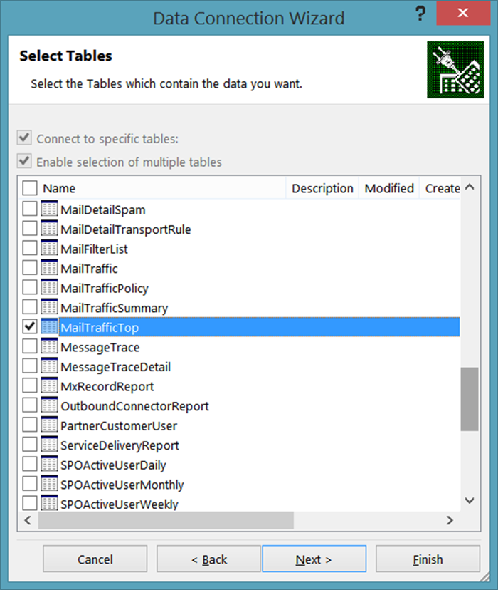
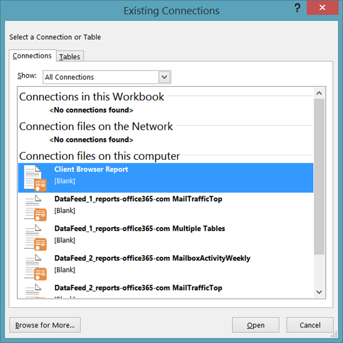
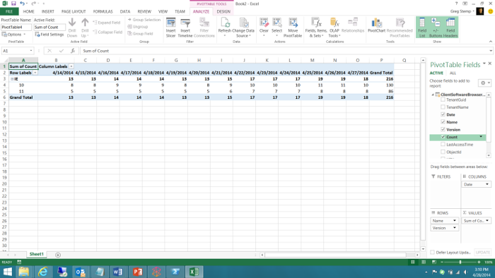

# <a name="using-excel-to-retrieve-office-365-reporting-data"></a>Uso de Excel para recuperar datos de informes de Office 365

 **Resumen:** use la característica de OData en Microsoft Excel para recuperar información detallada para la implementación de Office 365.
  
La creación de informes es una parte clave de la administración del sistema. El Centro de administración de Office 365 incluye varios informes predefinidos a los que puede acceder desde la sección **Informes** del panel de navegación izquierdo. Hay informes de uso e informes de seguridad y cumplimiento.
  
Los informes disponibles dependen de la versión de Office 365 que esté utilizando y de los servicios de Office 365 que haya habilitado. Para más información, consulte la [página Informes](https://technet.microsoft.com/es-ES/library/office-365-reports.aspx).
  
Los informes predefinidos del Centro de administración son un recurso excelente. Facilitan la comprobación de aspectos como el uso del buzón de correo o el número de minutos que los usuarios emplean en las conferencias en línea. Sin embargo, cuando se trata de un análisis detallado del dominio de Office 365, los informes tienen sus limitaciones.
  
Una forma de evitar estas limitaciones es utilizar otro lenguaje de desarrollo o de Windows PowerShell para acceder al servicio de generación de informes de Office 365 y crear informes personalizados; los informes personalizados le ofrecen la posibilidad de dictar qué datos (y cuántos) se devuelven desde el servicio de informes de Office 365. También puede especificar cómo deben organizarse y agruparse los datos mediante la escritura de informes personalizados y, si procede, cómo se guardarán esos datos. Por ejemplo, puede guardar datos en formato XML o en un formato de valores separados por comas que pueda importarse fácilmente en Excel. 
  
Además, los scripts y aplicaciones personalizados le permiten acceder a los informes que no están disponibles en el Centro de administración de Office 365. Por ejemplo, el Centro de administración puede indicarle cuántos buzones obsoletos tiene, pero no a qué buzones no se ha accedido en los últimos 30 días. Puede averiguar eso con un script de PowerShell personalizado. En conjunto, esto representa una enorme cantidad de flexibilidad a cambio de tener que escribir un script breve y relativamente simple de Windows PowerShell.
  
> [!VISUAL BASIC NOTE] Para más información, consulte la [página principal](https://msdn.microsoft.com/es-ES/library/office/jj984325%28v=office.15%29.aspx) para ver el servicio de generación de informes de Office 365.
  
Para poder recuperar estos datos es necesario escribir código de algún tipo. Esto vale la pena si pertenece a una gran organización que debe limitar la cantidad y el tipo de información que se devuelve. Pero si la organización es más pequeña y no es necesario limitar la cantidad ni el tipo de información que se devuelve, se pueden abrir los informes de Office 365 directamente desde Excel.
  
Sin embargo, existen algunas limitaciones, y la principal es que no se pueden filtrar, ordenar, seleccionar ni manipular de ninguna forma los datos que se devuelven. En su lugar, simplemente obtiene el conjunto predeterminado de datos que devuelve el informe. En algunos casos, es posible que no haya suficientes datos. Por ejemplo, el informe puede devolver datos, pongamos por caso, únicamente del mes anterior y no de todo el año. Por el contrario, en otros casos es posible que haya demasiados datos: es posible que obtenga datos de todo el año aunque solo quiera los del mes anterior.
  
Para abrir un informe de Office 365 directamente desde Excel, haga lo siguiente:
  
1. Empiece por abrir una nueva hoja de cálculo en Excel. En esa hoja de cálculo, haga clic en **Datos**, en **De otras fuentes** y, después, en **De la fuente de datos ODATA**. Esto abre el cuadro de diálogo **Asistente para la conexión de datos**:
    
     
  
2. En la página **Conectar con una fuente de datos**, escriba ( **https://reports.office365.com/ecp/reportingwebservice/reporting.svc/** ) como ubicación de la fuente de datos. Tenga en cuenta que solo puede especificar la dirección URL base tal como se muestra; no puede agregar ninguna instrucción de selección, filtro ni formato. Si escribe cualquier cosa adicional a la URL base no obtendrá ningún dato; en su lugar, simplemente verá el siguiente mensaje de error:
    
     
  
3. Después de escribir la dirección URL del servicio de generación de informes, seleccione **Usar este nombre y contraseña** en **Credenciales de inicio de sesión**. En el cuadro **Nombre de usuario**, escriba el nombre de inicio de sesión de Office 365 (por ejemplo, admin@litwareinc.onmicrosoft.com). En el cuadro **Contraseña**, escriba la contraseña de inicio de sesión de Office 365 y, a continuación, haga clic en **Siguiente**. Excel intentará conectar con el servicio de generación de informes con las credenciales proporcionadas.
    
4. Una vez que se haya autenticado, verá la página **Seleccionar tablas**. Seleccione el informe que quiera ver (por ejemplo, **FuenteDistribuciónDatos**) y haga clic en **Siguiente**:
    
     
  
    > [!NOTE]
    > Es posible seleccionar varios informes y, como resultado, se agregarán múltiples tablas o gráficos a la hoja de cálculo de Excel. También es posible crear una única tabla o un solo gráfico que combine datos de varios informes. Pero no lo trataremos en este artículo introductorio. 
  
5. Después de hacer clic en **Siguiente** aparecerá la página **Guardar archivo de conexión de datos y finalizar**:
    
     
  
    Aquí no tiene que introducir ningún tipo de información. Para recuperar los datos solo tiene que hacer clic en **Finalizar**. Sin embargo, cabe señalar que, de forma predeterminada, Excel guarda información acerca de cada conexión de datos que realice; estos datos se almacenan en la carpeta **Mis archivos de origen de datos**:
    
     
  
    Por ello, el cuadro de diálogo incluye cuadros de texto con etiquetas como **Nombre descriptivo** y **Palabras clave de búsqueda**; estas opciones le ofrecen la oportunidad de personalizar estas conexiones de datos. De este modo no terminará con un montón de orígenes de datos similares a estos:
    
  ```
  DataFeed_1_reports-office365-com ClientSoftwareBrowserDetail.odc
DataFeed_1_reports-office365-com MailTrafficTop.odc
DataFeed_1_reports-office365-com Multiple Tables.odc
DataFeed_2_reports-office365-com MailboxActivityWeekly.odc
DataFeed_2_reports-office365-com MailTrafficTop.odc
DataFeed_3_reports-office365-com ClientSoftwareBrowserDetail.odc
  ```

Si selecciona la casilla **Guardar contraseña en archivo**, podrá volver a usar estos orígenes de datos. Por ejemplo, supongamos que guarda una conexión de datos como **Informe de explorador del cliente**. La próxima vez que quiera obtener información sobre los exploradores web que se usan para acceder a su dominio de Office 365, no tendrá que volver a pasar por el asistente para la conexión de datos. Lo único que deberá hacer es abrir Excel y hacer clic en **Datos** y, después, en **Orígenes existentes**. Seleccione la conexión de datos deseada en el cuadro de diálogo **Conexiones existentes** y luego haga clic en **Aceptar**:
    

  
En ese momento, Excel establecerá la conexión y recuperará los datos.
    
Tenga en cuenta que estos archivos .ODC son archivos XML de texto sin formato. Estos archivos de texto XML sin formato contienen su nombre de usuario y contraseña de Office 365:
    
\<odc:ConnectionString>Data Source=https://reports.office365.com/ecp/reportingwebservice/reporting.svc/;Namespaces to Include=*;Max Received Message Size=4398046511104;Integrated Security=Basic; **User ID=admin@litwareinc.onmicrosoft.com;Password=MYpassw0rd!**;Persist Security Info=false;Service Document Url=https://reports.office365.com/ecp/reportingwebservice/reporting.svc/\</odc:ConnectionString>
    
Si no le gusta la idea de guardar su nombre de usuario y contraseña en un archivo de texto sin formato, entonces no active la casilla **Guardar contraseña en archivo**. Sin embargo, si hace esto, tenga en cuenta que no podrá volver a usar estas conexiones de datos. Eso es porque, sin el nombre de usuario y la contraseña, Office 365 no podrá autenticar el intento de iniciar sesión en el servicio.
    
6. Haga clic en **Finalizar** en la página **Guardar archivo de conexión de datos y finalizar** y aparecerá el cuadro de diálogo **Importar datos**:
    
     
  
7. Seleccione las opciones de vista (por ejemplo, **Informe de tabla dinámica** ) y, a continuación, haga clic en **Aceptar**. Si todo va bien, los datos se importarán y se presentarán en la opción de vista que haya elegido:
    
     
  
Lo que haga con estos datos es una decisión exclusivamente suya. Para ver algunas sugerencias, también puede leer [Crear un panel de Excel Services con una fuente de datos OData](https://technet.microsoft.com/es-ES/library/jj873965%28v=office.15%29.aspx). Aunque este artículo no usa el servicio de generación de informes de Office 365, proporciona algunos consejos útiles para tareas como añadir filtros y segmentaciones en el nuevo panel.
  
## <a name="see-also"></a>Consulte también

#### 

[Administrar Office 365 con PowerShell de Office 365](manage-office-365-with-office-365-powershell.md)
  
[Introducción a PowerShell de Office 365](getting-started-with-office-365-powershell.md)
  
[Usar Windows PowerShell para crear informes en Office 365](use-windows-powershell-to-create-reports-in-office-365.md)

