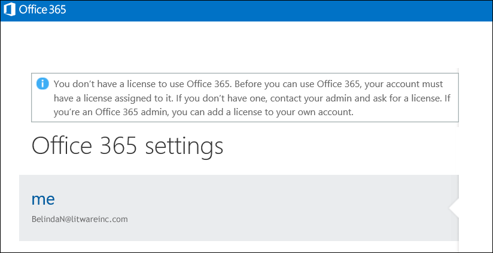

# <a name="view-licensed-and-unlicensed-users-with-office-365-powershell"></a><span data-ttu-id="99719-103">Ver los usuarios con licencia y sin licencia con PowerShell de Office 365</span><span class="sxs-lookup"><span data-stu-id="99719-103">View licensed and unlicensed users with Office 365 PowerShell</span></span>

<span data-ttu-id="99719-104">**Resumen:** se explica cómo usar PowerShell de Office 365 para ver las cuentas de usuario con licencia y sin licencia.</span><span class="sxs-lookup"><span data-stu-id="99719-104">**Summary:** Explains how to use Office 365 PowerShell to view licensed and unlicensed user accounts.</span></span>
  
<span data-ttu-id="99719-p101">Las cuentas de usuario de la organización de Office 365 pueden tener algunas, todas o ninguna de las licencias disponibles asignadas a ellas desde los planes de licencias que están disponibles en su organización. Puede usar PowerShell de Office 365 para encontrar rápidamente los usuarios con licencia y sin licencia de la organización.</span><span class="sxs-lookup"><span data-stu-id="99719-p101">User accounts in your Office 365 organization may have some, all, or none of the available licenses assigned to them from the licensing plans that are available in your organization. You can use Office 365 PowerShell to quickly find the licensed and unlicensed users in your organization.</span></span>
  
## <a name="before-you-begin"></a><span data-ttu-id="99719-107">Antes de empezar</span><span class="sxs-lookup"><span data-stu-id="99719-107">Before you begin</span></span>

- <span data-ttu-id="99719-p102">Los procedimientos de este tema requieren conectarse a PowerShell de Office 365. Para obtener instrucciones, vea [Conectarse a PowerShell de Office 365](connect-to-office-365-powershell.md).</span><span class="sxs-lookup"><span data-stu-id="99719-p102">The procedures in this topic require you to connect to Office 365 PowerShell. For instructions, see [Connect to Office 365 PowerShell](connect-to-office-365-powershell.md).</span></span>
    
- <span data-ttu-id="99719-110">Si usa el cmdlet **Get-MsolUser** sin usar el parámetro _All_, solo se devuelven las 500 primeras cuentas.</span><span class="sxs-lookup"><span data-stu-id="99719-110">If you use the **Get-MsolUser** cmdlet without using the _-All_ parameter, only the first 500 accounts are returned.</span></span>
    
## <a name="the-short-version-instructions-without-explanations"></a><span data-ttu-id="99719-111">Versión corta (instrucciones sin explicaciones)</span><span class="sxs-lookup"><span data-stu-id="99719-111">The short version (instructions without explanations)</span></span>

<span data-ttu-id="99719-p103">En esta sección se presentan los procedimientos sin explicaciones superfluas. Si tiene preguntas o desea obtener más información, puede leer el resto del tema.</span><span class="sxs-lookup"><span data-stu-id="99719-p103">This section presents the procedures without fanfare or superfluous explanation. If you have questions or want more information, you can read rest of the topic.</span></span>
  
<span data-ttu-id="99719-114">Para ver la lista de todas las cuentas de usuario y su estado de licencias en la organización, ejecute el comando siguiente en PowerShell de Office 365:</span><span class="sxs-lookup"><span data-stu-id="99719-114">To view the list of all user accounts and their licensing status in your organization, run the following command in Office 365 PowerShell:</span></span>
  
```
Get-MsolUser -All
```

<span data-ttu-id="99719-115">Para ver la lista de todas las cuentas de usuario sin licencia de su organización, ejecute el comando siguiente:</span><span class="sxs-lookup"><span data-stu-id="99719-115">To view the list of all unlicensed user accounts in your organization, run the following command:</span></span>
  
```
Get-MsolUser -All -UnlicensedUsersOnly
```

<span data-ttu-id="99719-116">Para ver la lista de todas las cuentas de usuario con licencia de su organización, ejecute el comando siguiente:</span><span class="sxs-lookup"><span data-stu-id="99719-116">To view the list of all licensed user accounts in your organization, run the following command:</span></span>
  
```
Get-MsolUser -All | where {$_.isLicensed -eq $true}
```

## <a name="the-long-version-instructions-with-detailed-explanations"></a><span data-ttu-id="99719-117">Versión larga (instrucciones con explicaciones detalladas)</span><span class="sxs-lookup"><span data-stu-id="99719-117">The long version (instructions with detailed explanations)</span></span>

<span data-ttu-id="99719-p104">Las cuentas de usuario de Office 365 y las licencias de Office 365 no necesitan tener una correspondencia de uno a uno: se pueden tener usuarios de Office 365 sin una licencia de Office 365 y, además, tener licencias de Office 365 que no estén asignadas a usuarios (de hecho, una sola cuenta de usuario puede, incluso, tener *varias* licencias de Office 365). Al crear una cuenta de usuario de Office 365 (para obtener más información, vea el artículo [Asignar licencias a usuarios de Office 365 con Windows PowerShell](http://technet.microsoft.com/library/0ab9fcac-e5ea-4b5b-b72c-8c92c55565ac.aspx)), no es necesario asignar una licencia a ese usuario: el nuevo usuario tendrá una cuenta válida, pero no podrá iniciar sesión en Office 365. Si intenta iniciar sesión, verá algo parecido a esto:</span><span class="sxs-lookup"><span data-stu-id="99719-p104">Office 365 user accounts and Office 365 licenses don't need to have a one-to-one correspondence: it's possible to have Office 365 users who do not have an Office 365 license, and it's possible to have Office 365 licenses that haven't been assigned to a user. (In fact, a single user account can even have  *multiple*  Office 365 licenses.) When you create a new Office 365 user account (see the article [License Office 365 users with Windows PowerShell](http://technet.microsoft.com/library/0ab9fcac-e5ea-4b5b-b72c-8c92c55565ac.aspx) for more information) you don't have to assign that user a license: the new user will have a valid account, but he or she won't be able to sign in to Office 365. If they try to sign in, they'll see something similar to this:</span></span>
  

  
<span data-ttu-id="99719-p105">Asimismo, puede tener un usuario que se tomará un tiempo libre prolongado, tal vez para un período sabático o para un permiso de maternidad o paternidad. En un caso como ese, se puede quitar la licencia del usuario y dejar la cuenta de usuario intacta (es decir, dejar todos los valores de propiedad, como la dirección y el número de teléfono, tal y como están). De esta forma, podría asignar esa licencia a otra persona como, por ejemplo, al trabajador temporal que sustituya a la persona que está de baja. Cuando el usuario vuelva a trabajar, le puede emitir una nueva licencia y podrá seguir trabajando como si nunca se hubiera ausentado.</span><span class="sxs-lookup"><span data-stu-id="99719-p105">Likewise, you might have a user who will be taking some extended time off, perhaps for a sabbatical or for maternity/paternity leave. In a case like that, you could remove the user's license but leave the user account intact (that is, leave all its property values, such as address and phone number, as-is). By doing that, you can assign their license to someone else (like, say, a temporary worker filling in for the person on leave). When the user returns to work you can issue them a new license and they'll be able to resume working as if they'd never been gone.</span></span>
  
<span data-ttu-id="99719-p106">Esto simplemente significa que, sí, es posible tener usuarios que tienen cuentas pero que no tienen licencias. O viceversa.</span><span class="sxs-lookup"><span data-stu-id="99719-p106">Which simply means that, yes, you can have users who have accounts but who don't have licenses. Or vice-versa.</span></span>
  
<span data-ttu-id="99719-p107">En el artículo [Ver las licencias y los servicios con PowerShell de Office 365](view-licenses-and-services-with-office-365-powershell.md) se explica cómo averiguar el número de licencias de Office 365 que ha adquirido la organización y cuántas de ellas se han asignado a usuarios. Esta información es muy importante. También lo es, sin embargo, saber quiénes tienen asignadas estas licencias y quiénes no. Y este artículo le explica cómo lograrlo.</span><span class="sxs-lookup"><span data-stu-id="99719-p107">The article [View licenses and services with Office 365 PowerShell](view-licenses-and-services-with-office-365-powershell.md) explains how you can determine the number of Office 365 licenses your organization has purchased as well as how many of those licenses have been assigned to users. That's important information. Equally important, however is knowing which of your users have been assigned these licenses and which ones haven't. And this article will tell you how to do just that.</span></span>
  
<span data-ttu-id="99719-p108">Como probablemente sabrá, el cmdlet **Get-MsolUser** devuelve información sobre todas las cuentas de usuario de Office 365. ¿Necesita información rápida sobre todos los usuarios de Office 365? En ese caso, ejecute este comando en PowerShell de Office 365:</span><span class="sxs-lookup"><span data-stu-id="99719-p108">As you probably know, the **Get-MsolUser** cmdlet returns information about all your Office 365 user accounts. Need some quick info about all your Office 365 users? Then run this command in Office 365 PowerShell:</span></span>
  
```
Get-MsolUser
```

<span data-ttu-id="99719-135">A su vez, Get-MsolUser devuelve datos similares a estos:</span><span class="sxs-lookup"><span data-stu-id="99719-135">In turn, Get-MsolUser returns data similar to this:</span></span>
  
```
UserPrincipalName           DisplayName                     isLicensed
-----------------           -----------                     ----------
ZrinkaM@litwareinc.com      Zrinka Makovac                  True
BelindaN@litwareinc.com     Belinda Newman                  False
BonnieK@litwareinc.com      Bonnie Kearney                  True
FabriceC@litwareinc.com     Fabrice Canel                   True
AnneW@litwareinc.com        Anne Wallace                    True
AlexD@litwareinc.com        Alex Darrow                     True
```

<span data-ttu-id="99719-p109">Como puede ver, uno de los valores de propiedad devueltos es el valor de la propiedad **isLicensed**. Si **isLicensed** es igual a `False`, significa que el usuario no tiene una licencia para Office 365. En otras palabras, si lo quisiera, simplemente podría desplazarse por la lista de usuarios y seleccionar aquellos en los que la propiedad **isLicensed** se establece en `False`.</span><span class="sxs-lookup"><span data-stu-id="99719-p109">As you can see, one of the property values returned is for the **isLicensed** property. If **isLicensed** is equal to `False` that means that the user doesn't have a license for Office 365. In other words, and if you wanted to, you could simply scroll through your list of users and pick out the ones where the **isLicensed** property is set to `False`.</span></span>
  
<span data-ttu-id="99719-p110">En cualquier caso, desplazarse por una lista de usuarios para elegir a los usuarios sin licencia funciona siempre que tenga un número relativamente pequeño de usuarios. Si tiene un gran número de usuarios, desplazarse por la lista será, en el mejor de los casos, sumamente tedioso. (Y, según cómo se haya configurado Windows PowerShell, quizá imposible. Esto se debe a que existe un límite en cuanto a la cantidad de líneas de salida que se pueden mostrar en la consola de Windows PowerShell en cualquier momento).</span><span class="sxs-lookup"><span data-stu-id="99719-p110">At any rate, scrolling through a list of users trying to pick out the unlicensed users works as long as you have a relatively small number of users. If you have a large number of users, however, scrolling through that list will be, at best, extremely tedious. (And, depending on how Windows PowerShell has been configured, perhaps downright impossible. That's because there's a limit to the number of lines of output that can be displayed in the Windows PowerShell console at any one time.)</span></span>
  
<span data-ttu-id="99719-143">Con eso en mente, una manera mucho mejor de hacer una lista de los usuarios sin licencia es ejecutar este comando:</span><span class="sxs-lookup"><span data-stu-id="99719-143">With that in mind, a much better way to list your unlicensed users is to run this command instead:</span></span>
  
```
Get-MsolUser -UnlicensedUsersOnly
```

<span data-ttu-id="99719-p111">Ese comando devuelve únicamente a los usuarios que no tienen una licencia para Office 365. En otras palabras:</span><span class="sxs-lookup"><span data-stu-id="99719-p111">That command returns only those users who don't have a license for Office 365. In other words:</span></span>
  
```
UserPrincipalName           DisplayName                     isLicensed
-----------------           -----------                     ----------
BelindaN@litwareinc.com     Belinda Newman                  False
```

<span data-ttu-id="99719-p112">Como puede ver, tenemos un usuario sin licencia. ¿Y si solo queremos una lista de los usuarios *con licencia*? Eso es un poco más complicado, pero solo un poco:</span><span class="sxs-lookup"><span data-stu-id="99719-p112">As you can see we have one unlicensed user. And what is we only wanted a list of the  *licensed*  users? That's a tiny bit more complicated, but only the tiniest bit:</span></span>
  
```
Get-MsolUser | Where-Object {$_.isLicensed -eq $true}
```

<span data-ttu-id="99719-149">Ese comando, que busca todas las cuentas de usuario donde la propiedad **isLicensed** es igual a `True`, devuelve información similar a la siguiente:</span><span class="sxs-lookup"><span data-stu-id="99719-149">That command, which looks for all the user accounts where the **isLicensed** property is equal to `True`, returns information similar to this:</span></span>
  
```
UserPrincipalName           DisplayName                     isLicensed
-----------------           -----------                     ----------
ZrinkaM@litwareinc.com      Zrinka Makovac                  True
BonnieK@litwareinc.com      Bonnie Kearney                  True
FabriceC@litwareinc.com     Fabrice Canel                   True
AnneW@litwareinc.com        Anne Wallace                    True
AlexD@litwareinc.com        Alex Darrow                     True
```

<span data-ttu-id="99719-p113">Como puede ver, no se devuelve ninguna información sobre Belinda Newman. ¿Por qué no? Acertó: porque la propiedad **isLicensed** para la cuenta de Belinda no está establecida en `True`.</span><span class="sxs-lookup"><span data-stu-id="99719-p113">As you can see, information is not returned for Belinda Newman. Why not? You got it: because the **isLicensed** property for Belinda's account is not set to `True`.</span></span>
  
## <a name="see-also"></a><span data-ttu-id="99719-153">Vea también</span><span class="sxs-lookup"><span data-stu-id="99719-153">See also</span></span>
<span data-ttu-id="99719-154"><a name="SeeAlso"> </a></span><span class="sxs-lookup"><span data-stu-id="99719-154"><a name="SeeAlso"> </a></span></span>

<span data-ttu-id="99719-155">Para obtener más información sobre los cmdlets que se usan en estos procedimientos, consulte los siguientes temas:</span><span class="sxs-lookup"><span data-stu-id="99719-155">For more information about the cmdlets that are used in these procedures, see the following topics:</span></span>
  
- [<span data-ttu-id="99719-156">Get-MsolUser</span><span class="sxs-lookup"><span data-stu-id="99719-156">Get-MsolUser</span></span>](https://go.microsoft.com/fwlink/p/?LinkId=691547)
    
- [<span data-ttu-id="99719-157">Where-Object</span><span class="sxs-lookup"><span data-stu-id="99719-157">Where-Object</span></span>](https://go.microsoft.com/fwlink/p/?LinkId=113423)
    

