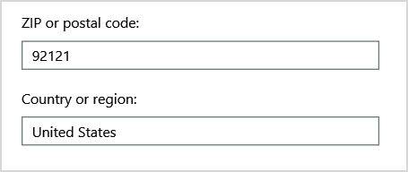
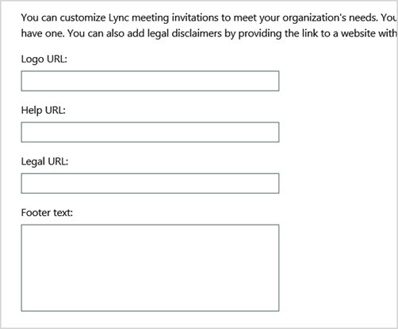
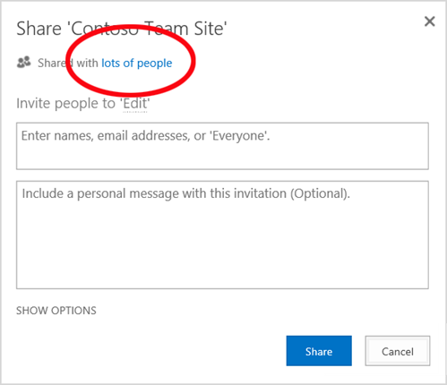
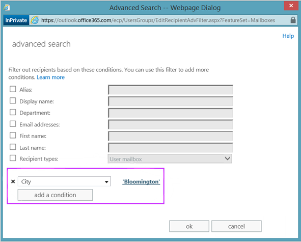
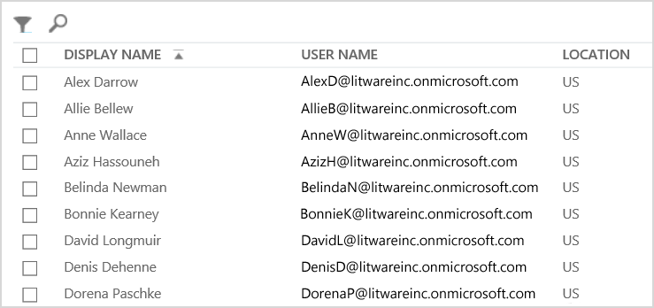
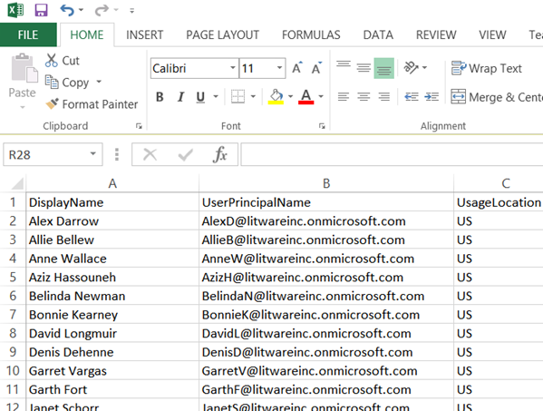

# <a name="why-you-need-to-use-office-365-powershell"></a><span data-ttu-id="d10ff-103">Por qué necesita usar PowerShell de Office 365</span><span class="sxs-lookup"><span data-stu-id="d10ff-103">Why you need to use Office 365 PowerShell</span></span>

 <span data-ttu-id="d10ff-104">**Resumen:** comprenda por qué tiene que usar PowerShell de Office 365 para administrar Office 365, en algunos casos de manera más eficiente y, en otros casos, por necesidad.</span><span class="sxs-lookup"><span data-stu-id="d10ff-104">**Summary:** Understand why you must use Office 365 PowerShell to manage Office 365, in some cases more efficiently and in other cases by necessity.</span></span>
  
<span data-ttu-id="d10ff-p101">Con Centro de administración de Office 365, no solo puede administrar las cuentas de usuario y licencias de Office 365, sino que también puede administrar los productos del servidor de Office 365: Exchange, Skype Empresarial Online y SharePoint Online. En cambio, también puede administrar estos elementos con comandos de PowerShell de Office 365 y aprovechar las ventajas que le ofrece un entorno de lenguaje de línea de comandos y scripting para ganar en velocidad, automatización y funcionalidad.</span><span class="sxs-lookup"><span data-stu-id="d10ff-p101">With the Office 365 admin center, you can not only manage your Office 365 user accounts and licenses, but you can also manage your Office 365 server products: Exchange, Skype for Business Online, and SharePoint Online. However, you can also manage these elements with Office 365 PowerShell commands, taking advantage of a command-line and scripting language environment for speed, automation, and additional capability.</span></span>
  
<span data-ttu-id="d10ff-107">En este artículo, le mostraremos las formas en que puede usar PowerShell de Office 365 para administrar Office 365.</span><span class="sxs-lookup"><span data-stu-id="d10ff-107">In this article, we'll show you these ways in which you can use Office 365 PowerShell to manage Office 365.</span></span>
  
- <span data-ttu-id="d10ff-108">PowerShell de Office 365 puede revelar información adicional que no puede ver con Centro de administración de Office 365</span><span class="sxs-lookup"><span data-stu-id="d10ff-108">Office 365 PowerShell can reveal additional information that you cannot see with the Office 365 admin center</span></span>
    
- <span data-ttu-id="d10ff-109">Office 365 tiene características que solo se pueden configurar mediante Office 365 PowerShell</span><span class="sxs-lookup"><span data-stu-id="d10ff-109">Office 365 has features that you can only configure by using Office 365 PowerShell</span></span>
    
- <span data-ttu-id="d10ff-110">PowerShell de Office 365 es excelente para realizar operaciones masivas</span><span class="sxs-lookup"><span data-stu-id="d10ff-110">Office 365 PowerShell is great at performing bulk operations</span></span>
    
- <span data-ttu-id="d10ff-111">Office 365 PowerShell es excelente en el filtrado de datos</span><span class="sxs-lookup"><span data-stu-id="d10ff-111">Office 365 PowerShell is great at filtering data</span></span>
    
- <span data-ttu-id="d10ff-112">Office 365 PowerShell facilita imprimir o guardar datos</span><span class="sxs-lookup"><span data-stu-id="d10ff-112">Office 365 PowerShell makes it easy to print or save data</span></span>
    
- <span data-ttu-id="d10ff-113">PowerShell de Office 365 le permite administrar los productos del servidor</span><span class="sxs-lookup"><span data-stu-id="d10ff-113">Office 365 PowerShell lets you manage across server products</span></span>
    
<span data-ttu-id="d10ff-p102">Antes de empezar, hay que entender que PowerShell de Office 365 es un conjunto de módulos para Windows PowerShell, un entorno de línea de comandos para plataformas y servicios basados en Windows. Este entorno crea un lenguaje de shell de comandos que se puede ampliar con módulos adicionales y ofrece una forma de ejecutar scripts y comandos simples o complejos. Por ejemplo, después de instalar los módulos de PowerShell de Office 365 y conectarse a la suscripción de Office 365, puede ejecutar este comando para hacer una lista de todos los buzones de usuario de Microsoft Exchange Online:</span><span class="sxs-lookup"><span data-stu-id="d10ff-p102">Before you begin, understand that Office 365 PowerShell is a set of modules for Windows PowerShell, a command-line environment for Windows-based services and platforms. This environment creates a command shell language that can be extended with additional modules and provides a way to execute simple or complex commands or scripts For example, after you install the Office 365 PowerShell modules and connect to your Office 365 subscription, you can run this command to list all of the user mailboxes for Microsoft Exchange Online:</span></span>
  
```
Get-Mailbox
```

<span data-ttu-id="d10ff-117">También puede ejecutar este comando para calcular el número de elementos de todas las listas de todos los sitios de todas las aplicaciones web en SharePoint Online:</span><span class="sxs-lookup"><span data-stu-id="d10ff-117">You can also run this command to calculate the number of items in all of the lists for all of the sites for all of your web apps in SharePoint Online:</span></span>
  
```
Get-SPOSite -Limit All | Get-SPWeb -Limit All | % {$_.Lists} | ? {$_ -is [Microsoft.SharePoint.SPDocumentLibrary]} | % {$total+= $_.ItemCount}; $total
```

<span data-ttu-id="d10ff-118">También se puede obtener fácilmente la lista de buzones mediante el Centro de administración de Office 365, pero el recuento de elementos de todas las listas de todos los sitios de todas las aplicaciones web no puede realizarse tan fácilmente.</span><span class="sxs-lookup"><span data-stu-id="d10ff-118">Getting the list of mailboxes can also be easily done using the Office 365 admin center, but counting the number of items in all of the lists for all of the sites for all of your web apps cannot be easily done.</span></span>
  
<span data-ttu-id="d10ff-p103">Tenga en cuenta que PowerShell de Office 365 está diseñado para aumentar y mejorar su capacidad de administrar Office 365, no para sustituir el Centro de administración de Office 365. Como administrador de Office 365, debe al menos sentirse cómodo al usar PowerShell de Office 365, porque hay algunos procedimientos de configuración que solo pueden realizarse con comandos de PowerShell de Office 365. En estos casos, deberá comprender cómo hacer lo siguiente:</span><span class="sxs-lookup"><span data-stu-id="d10ff-p103">Please note that Office 365 PowerShell is designed to augment and enhance your ability to manage Office 365, not to replace the Office 365 admin center. As an Office 365 administrator, you must become at least comfortable with using Office 365 PowerShell because there are some configuration procedures that can only be done with Office 365 PowerShell commands. In these cases, you will be required to understand how to:</span></span>
  
- <span data-ttu-id="d10ff-122">Instalar los módulos de PowerShell de Office 365 (se realiza una sola vez en cada equipo de administrador).</span><span class="sxs-lookup"><span data-stu-id="d10ff-122">Install the Office 365 PowerShell modules (done only once for each administrator computer).</span></span>
    
- <span data-ttu-id="d10ff-123">Conectarse a su suscripción de Office 365 (se realiza una vez por sesión de PowerShell).</span><span class="sxs-lookup"><span data-stu-id="d10ff-123">Connect to your Office 365 subscription (done once for each PowerShell session).</span></span>
    
- <span data-ttu-id="d10ff-124">Recopilar la información necesaria para ejecutar los comandos de PowerShell de Office 365 necesarios.</span><span class="sxs-lookup"><span data-stu-id="d10ff-124">Gather the information needed to run the required Office 365 PowerShell commands.</span></span>
    
- <span data-ttu-id="d10ff-125">Ejecutar los comandos de PowerShell de Office 365 correctamente.</span><span class="sxs-lookup"><span data-stu-id="d10ff-125">Run the Office 365 PowerShell commands successfully.</span></span>
    
<span data-ttu-id="d10ff-p104">Después de haber aprendido estos conocimientos básicos, no es necesario hacer una lista de los usuarios de buzones con el comando **Get-Mailbox** ni es necesario que sepa cómo crear un nuevo comando como el anterior para contar todos los elementos de todas las listas de todos los sitios para todas las aplicaciones web. Microsoft y la Comunidad de administradores de Office 365 pueden ayudarle con eso cuando sea necesario.</span><span class="sxs-lookup"><span data-stu-id="d10ff-p104">After learning these basic skills, you are not required to list your mailbox users with **Get-Mailbox** command, nor are you required to understand how to create a new command like the previous one to count all the items in all the lists for all of the sites for all of your web apps. Microsoft and the community of Office 365 administrators can help you with that as needed.</span></span>
  
## <a name="office-365-powershell-can-reveal-additional-information-that-you-cannot-see-with-the-office-365-admin-center"></a><span data-ttu-id="d10ff-128">Con PowerShell de Office 365, puede ver información adicional que no se muestra en el Centro de administración de Office 365</span><span class="sxs-lookup"><span data-stu-id="d10ff-128">Office 365 PowerShell can reveal additional information that you cannot see with the Office 365 admin center</span></span>
<span data-ttu-id="d10ff-129"><a name="reveal"> </a></span><span class="sxs-lookup"><span data-stu-id="d10ff-129"></span></span>

<span data-ttu-id="d10ff-p105">El Centro de administración de Office 365 muestra una gran cantidad de información útil, pero eso no significa que muestre toda la información posible que Office 365 almacena en usuarios, licencias, buzones de correo y sitios. Este es un ejemplo de **usuarios y grupos** en el Centro de administración de Office 365:</span><span class="sxs-lookup"><span data-stu-id="d10ff-p105">The Office 365 admin center displays a lot of useful information, but that doesn't mean that it displays all the possible information that Office 365 stores on users, licenses, mailboxes, and sites. Here is an example for **users and groups** in the Office 365 admin center:</span></span>
  

  
<span data-ttu-id="d10ff-p106">Para muchos fines, se muestra la información que necesita saber. En cambio, algunas veces necesitará más. Por ejemplo, las licencias de Office 365 (así como las características de Office 365 disponibles para un determinado usuario) dependen en parte de la ubicación geográfica del usuario. Las directivas y características que se pueden extender a un usuario que vive en los Estados Unidos tal vez no sean las mismas que las directivas y características que se pueden extender a un usuario que vive en India o en Bélgica. Puede usar el Centro de administración de Office 365 para determinar la ubicación geográfica de un usuario con estos pasos:</span><span class="sxs-lookup"><span data-stu-id="d10ff-p106">For many purposes, this displays the information you need to know. However, there are times when you need more. For example, Office 365 licensing (as well as the Office 365 features available to a user) depend in part on that user's geographic location. The policies and features you can extend to a user who lives in the United States might not be the same as the policies and features you can extend to a user who lives in India or in Belgium. You can use the Office 365 admin center to determine a user's geographic location with these steps:</span></span>
  
1. <span data-ttu-id="d10ff-138">Haga doble clic en el **Nombre para mostrar** del usuario.</span><span class="sxs-lookup"><span data-stu-id="d10ff-138">Double-click the user's **Display Name**.</span></span>
    
2. <span data-ttu-id="d10ff-139">En el panel de presentación de las propiedades del usuario, haga clic en **Detalles**.</span><span class="sxs-lookup"><span data-stu-id="d10ff-139">In the user properties display pane, click **details**.</span></span>
    
3. <span data-ttu-id="d10ff-140">En la pantalla de detalles, haga clic en **Detalles adicionales**.</span><span class="sxs-lookup"><span data-stu-id="d10ff-140">In the details display, click **additional details**.</span></span>
    
4. <span data-ttu-id="d10ff-141">Desplácese hacia abajo hasta que vea el encabezado **País o región**:</span><span class="sxs-lookup"><span data-stu-id="d10ff-141">Scroll down until you see the heading **Country or region**:</span></span>
    
     
  
5. <span data-ttu-id="d10ff-143">Escriba el nombre para mostrar y la ubicación del usuario en una hoja de papel, o cópielo y péguelo en el Bloc de notas.</span><span class="sxs-lookup"><span data-stu-id="d10ff-143">Write the user's display name and location on a piece of paper, or copy and paste it into Notepad.</span></span> 
    
<span data-ttu-id="d10ff-p107">Debe repetir este procedimiento para cada usuario. Para muchos usuarios, esto puede ser una tarea tediosa. Con PowerShell de Office 365, puede mostrar esta información para todos los usuarios con el siguiente comando:</span><span class="sxs-lookup"><span data-stu-id="d10ff-p107">You must repeat this procedure for each user. For many users, this can be a tedious task. With Office 365 PowerShell, you can display this information for all of your users with the following command:</span></span>
  
```
Get-MsolUser | Select DisplayName, UsageLocation
```

> [!NOTE]
> <span data-ttu-id="d10ff-147">Este comando requiere que instale el [módulo de Windows Azure Active Directory](https://technet.microsoft.com/es-ES/library/jj151815.aspx).</span><span class="sxs-lookup"><span data-stu-id="d10ff-147">This command requires you to install the [Windows Azure Active Directory module](https://technet.microsoft.com/es-ES/library/jj151815.aspx).</span></span> 
  
<span data-ttu-id="d10ff-148">Este es un ejemplo del resultado:</span><span class="sxs-lookup"><span data-stu-id="d10ff-148">Here is an example of the display:</span></span>
  
```
DisplayName                               UsageLocation
-----------                               -------------
Zrinka Makovac                            US
Bonnie Kearney                            GB
Fabrice Canel                             BR
Brian Johnson (TAILSPIN)                  US
Anne Wallace                              US
Alex Darrow                               US
David Longmuir                            BR
```

> [!TIP]
>  <span data-ttu-id="d10ff-149">La interpretación de este comando de PowerShell de Office 365 es la siguiente: se obtienen todos los usuarios de la suscripción actual a Office 365 (**Get-MsolUser**), pero solo se muestra el nombre y la ubicación de cada usuario (**Select DisplayName, UsageLocation**).</span><span class="sxs-lookup"><span data-stu-id="d10ff-149">The interpretation of this Office 365 PowerShell command is: Get all of the users in the current Office 365 subscription ( **Get-MsolUser** ), but only display the name and location for each user ( **Select DisplayName, UsageLocation** ).</span></span>
  
<span data-ttu-id="d10ff-p108">Dado que PowerShell de Office 365 admite un lenguaje de shell de comandos, puede manipular aún más la información que obtiene del comando **Get-MSolUser**. Por ejemplo, tal vez le gustaría ordenar estos usuarios según su ubicación, agrupando todos los usuarios brasileños, todos los usuarios de Estados Unidos, etc. Este es el comando:</span><span class="sxs-lookup"><span data-stu-id="d10ff-p108">Because Office 365 PowerShell supports a command shell language, you can further manipulate the information obtained from the **Get-MSolUser** command. For example, maybe you'd like to sort these users by their location, grouping all the Brazilian users together, all the United States users together, etc. Here is the command:</span></span>
  
```
Get-MsolUser | Select DisplayName, UsageLocation | Sort UsageLocation, DisplayName
```

<span data-ttu-id="d10ff-152">Este es un ejemplo del resultado:</span><span class="sxs-lookup"><span data-stu-id="d10ff-152">Here is an example of the display:</span></span>
  
```
DisplayName                                 UsageLocation
-----------                                 -------------
David Longmuir                              BR
Fabrice Canel                               BR
Bonnie Kearney                              GB
Alex Darrow                                 US
Anne Wallace                                US
Brian Johnson (TAILSPIN)                    US
Zrinka Makovac                              US
```

> [!TIP]
>  <span data-ttu-id="d10ff-153">La interpretación de este comando de PowerShell de Office 365 es la siguiente: se obtienen todos los usuarios de la suscripción actual a Office 365, pero solo se muestra el nombre y la ubicación de cada usuario, y se ordenan primero por ubicación y, después, por sus nombres (**Sort UsageLocation, DisplayName**).</span><span class="sxs-lookup"><span data-stu-id="d10ff-153">The interpretation of this Office 365 PowerShell command is: Get all of the users in the current Office 365 subscription, but only display the name and location for each user and sort them first by their location, and then their names ( **Sort UsageLocation, DisplayName** ).</span></span>
  
<span data-ttu-id="d10ff-p109">También puede usar un filtrado adicional. Por ejemplo, si solo quiere ver información sobre los usuarios que están en Brasil, use este comando:</span><span class="sxs-lookup"><span data-stu-id="d10ff-p109">You can also employ additional filtering. For example, if you only want to see information about users based in Brazil, use this command:</span></span>
  
```
Get-MsolUser | Where {$_.UsageLocation -eq "BR"} | Select DisplayName, UsageLocation 
```

<span data-ttu-id="d10ff-156">Este es un ejemplo del resultado:</span><span class="sxs-lookup"><span data-stu-id="d10ff-156">Here is an example of the display:</span></span>
  
```
DisplayName                                           UsageLocation
-----------                                           -------------
David Longmuir                                        BR
Fabrice Canel                                         BR
```

> [!TIP]
>  <span data-ttu-id="d10ff-157">La interpretación de este comando de PowerShell de Office 365 es la siguiente: se obtienen todos los usuarios de la suscripción actual a Office 365 cuya ubicación es Brasil (**Where {$\_.UsageLocation -eq "BR"}**) y, después, se muestra el nombre y la ubicación de cada usuario.</span><span class="sxs-lookup"><span data-stu-id="d10ff-157">The interpretation of this Office 365 PowerShell command is: Get all of the users in the current Office 365 subscription whose location is Brazil ( **Where {$\_.UsageLocation -eq "BR"}** ), then display the name and location for each user.</span></span>
  
 <span data-ttu-id="d10ff-158">**Una nota rápida sobre dominios de mayor tamaño**</span><span class="sxs-lookup"><span data-stu-id="d10ff-158">**A Quick Note Regarding Larger Domains**</span></span>
  
<span data-ttu-id="d10ff-p110">Si tiene un dominio muy grande, con decenas de miles de usuarios, probar algunos de los ejemplos que se muestran en este artículo introductorio podría provocar una "limitación". Esto significa que, en función de algunos factores como la potencia del equipo y el ancho de banda de red disponible, está intentando hacer demasiado a la vez. Por ello, las grandes organizaciones quizá quieran dividir algunos de estos comandos de PowerShell de Office 365 en dos comandos. Por ejemplo, este comando único devuelve todas las cuentas de usuario y muestra el nombre y la ubicación de cada usuario:</span><span class="sxs-lookup"><span data-stu-id="d10ff-p110">If you have a very large domain with tens of thousands of users, trying some of the examples we show in this article could lead to "throttling." That means that, based on things like computing power and available network bandwidth, you're trying to do a little too much at one time. Because of that, larger organizations might want to split some of these Office 365 PowerShell commands into two commands. For example, this one command returns all the user accounts and shows the name and location for each:</span></span>
  
```
Get-MsolUser | Select DisplayName, UsageLocation
```

<span data-ttu-id="d10ff-p111">Esto funciona muy bien en los dominios más pequeños. No obstante, en una organización grande tal vez tenga que dividirlo en dos comandos: un comando para almacenar la información de la cuenta de usuario en una variable y otro comando para mostrar la información que se necesita. Aquí le mostramos un ejemplo:</span><span class="sxs-lookup"><span data-stu-id="d10ff-p111">That works great for smaller domains. In a large organization, however, you might need to split that into two commands: one command to store the user account information in a variable and another command to display the needed information. Here is an example:</span></span>
  
```
$x = Get-MsolUser
$x | Select DisplayName, UsageLocation
```


<span data-ttu-id="d10ff-166">La interpretación de este conjunto de comandos de PowerShell de Office 365 es la siguiente:</span><span class="sxs-lookup"><span data-stu-id="d10ff-166">The interpretation of this set of Office 365 PowerShell commands is:</span></span>
- <span data-ttu-id="d10ff-167">Se obtienen todos los usuarios de la suscripción actual de Office 365 y se almacena la información en una variable denominada $x (**$x = Get-MsolUser**).</span><span class="sxs-lookup"><span data-stu-id="d10ff-167">Get all of the users in the current Office 365 subscription and store the information in a variable named $x ( **$x = Get-MsolUser** ).</span></span>
- <span data-ttu-id="d10ff-168">Se muestra el contenido de la variable $x, pero solo se incluye el nombre y la ubicación de cada usuario (**$x | Select DisplayName, UsageLocation**).</span><span class="sxs-lookup"><span data-stu-id="d10ff-168">Display the contents of the variable $x, but only include the name and location for each user ( **$x | Select DisplayName, UsageLocation** ).</span></span>
  
## <a name="office-365-has-features-that-you-can-only-configure-with-office-365-powershell"></a><span data-ttu-id="d10ff-169">Office 365 tiene características que solo se pueden configurar con PowerShell de Office 365</span><span class="sxs-lookup"><span data-stu-id="d10ff-169">Office 365 has features that you can only configure with Office 365 PowerShell</span></span>
<span data-ttu-id="d10ff-170"><a name="only"> </a></span><span class="sxs-lookup"><span data-stu-id="d10ff-170"></span></span>

<span data-ttu-id="d10ff-p112">El Centro de administración de Office 365 está diseñado para proporcionar acceso a las tareas administrativas más comunes o importantes aplicables a la mayoría de los usuarios. En otras palabras, el Centro de administración de Office 365 se ha diseñado para que el administrador común pueda usar la herramienta y llevar a cabo las tareas de administración más habituales. Por definición, esto significa que hay algunas tareas que no se pueden realizar con el Centro de administración de Office 365.</span><span class="sxs-lookup"><span data-stu-id="d10ff-p112">The Office 365 admin center is intended to provide access to the most common or meaningful administrative tasks that apply to most people. In other words, the Office 365 admin center was designed so that the typical administrator could use the tool to carry out the most common management tasks. By this definition, that means that there are some tasks that can't be completed by using the Office 365 admin center.</span></span>
  
<span data-ttu-id="d10ff-174">Por ejemplo, el Centro de administración de Skype Empresarial Online proporciona unas cuantas opciones para crear invitaciones a reuniones personalizadas:</span><span class="sxs-lookup"><span data-stu-id="d10ff-174">For example, the Skype for Business Online Admin center provides a few options for creating custom meeting invitations:</span></span>
  

  
<span data-ttu-id="d10ff-p113">Con esta configuración, puede agregar un toque de personalización y profesionalidad a las invitaciones a reuniones. Sin embargo, la configuración de reuniones es mucho más que la mera creación de invitaciones a reuniones personalizadas. Por ejemplo, de forma predeterminada las reuniones permiten lo siguiente:</span><span class="sxs-lookup"><span data-stu-id="d10ff-p113">With these settings, you can add a touch of personalization and professionalism to meeting invitations. However, there's more to meeting configuration settings than simply creating custom meeting invitations. For example, by default, meetings allow:</span></span>
  
- <span data-ttu-id="d10ff-179">A los usuarios anónimos obtener entrada automática a cada reunión.</span><span class="sxs-lookup"><span data-stu-id="d10ff-179">Anonymous users to gain automatic entrance to each meeting.</span></span>
    
- <span data-ttu-id="d10ff-180">A los asistentes grabar la reunión.</span><span class="sxs-lookup"><span data-stu-id="d10ff-180">Attendees to record the meeting.</span></span>
    
- <span data-ttu-id="d10ff-181">A todos los usuarios de la organización poder ser designados como moderadores cuando se unen a la reunión.</span><span class="sxs-lookup"><span data-stu-id="d10ff-181">All users from your organization to be designated as presenters when they join the meeting.</span></span>
    
<span data-ttu-id="d10ff-p114">Estas opciones no están disponibles desde el Centro de administración de Skype Empresarial Online. Sin embargo, se pueden controlar desde PowerShell de Office 365. Este es un comando que deshabilita estas tres opciones:</span><span class="sxs-lookup"><span data-stu-id="d10ff-p114">These settings are not available from the Skype for Business Online Admin center. However, you can control them from Office 365 PowerShell. Here is a command that disables these three settings:</span></span>
  
```
Set-CsMeetingConfiguration -AdmitAnonymousUsersByDefault $False -AllowConferenceRecording $False -DesignateAsPresenter "None"
```

> [!NOTE]
> <span data-ttu-id="d10ff-185">Para usar este comando, necesita instalar el [módulo de PowerShell de Skype Empresarial Online](https://www.microsoft.com/download/details.aspx?id=39366).</span><span class="sxs-lookup"><span data-stu-id="d10ff-185">This command requires that you install the [Skype for Business Online PowerShell Module ](https://www.microsoft.com/download/details.aspx?id=39366).</span></span> 
  
> [!TIP]
>  <span data-ttu-id="d10ff-186">La interpretación de este comando de PowerShell de Office 365 es la siguiente: para configurar nuevas reuniones de Skype Empresarial Online (**Set-CsMeetingConfiguration**), no permita que los usuarios anónimos puedan obtener acceso automáticamente a reuniones (**-AdmitAnonymousUsersByDefault $False**), no permita que los asistentes graben las reuniones (**-AllowConferenceRecording $False**) y no designe a todos los usuarios de la organización como moderadores (**-DesignateAsPresenter "None"**).</span><span class="sxs-lookup"><span data-stu-id="d10ff-186">The interpretation of this Office 365 PowerShell command is: For the settings for new Skype for Business Online meetings ( **Set-CsMeetingConfiguration** ), disable allowing anonymous users to gain automatic entrance to meetings ( **-AdmitAnonymousUsersByDefault $False** ), disable the ability for attendees to record meetings ( **-AllowConferenceRecording $False** ), and do not designate all users from your organization as presenters ( **-DesignateAsPresenter "None"** ).</span></span>
  
<span data-ttu-id="d10ff-187">Si cambia de opinión y quiere restaurar la configuración predeterminada (habilitar todas las opciones), ejecute este comando:</span><span class="sxs-lookup"><span data-stu-id="d10ff-187">If you change your mind and want to restore these default settings (all of them enabled), run this command:</span></span>
  
```
Set-CsMeetingConfiguration -AdmitAnonymousUsersByDefault $True -AllowConferenceRecording $True -DesignateAsPresenter "Company"
```

<span data-ttu-id="d10ff-p115">Esto es solo un ejemplo. Hay otros más. Este es el motivo por el que usted, como administrador de Office 365, debe sentirse cómodo ejecutando comandos de PowerShell de Office 365.</span><span class="sxs-lookup"><span data-stu-id="d10ff-p115">This is just one example. There are others, which is why you, as an Office 365 administrator, need to be comfortable with running Office 365 PowerShell commands.</span></span>
  
## <a name="office-365-powershell-is-great-at-carrying-out-bulk-operations"></a><span data-ttu-id="d10ff-190">Office 365 PowerShell es excelente para llevar a cabo operaciones masivas</span><span class="sxs-lookup"><span data-stu-id="d10ff-190">Office 365 PowerShell is great at carrying out bulk operations</span></span>
<span data-ttu-id="d10ff-191"><a name="bulk"> </a></span><span class="sxs-lookup"><span data-stu-id="d10ff-191"></span></span>

<span data-ttu-id="d10ff-p116">Tradicionalmente, las interfaces visuales como el Centro de administración de Office 365 son muy útiles cuando tiene que llevar a cabo una sola operación. Por ejemplo, si necesita deshabilitar una cuenta de usuario, puede usar el Centro de administración de Office 365 para localizar de forma rápida y desactivar una casilla. Esto puede ser más sencillo que realizar una operación similar en PowerShell de Office 365.</span><span class="sxs-lookup"><span data-stu-id="d10ff-p116">Historically, visual interfaces like the Office 365 admin center are most valuable when you have a single operation to perform. For example, if you need to disable one user account, you can use the Office 365 admin center to quickly locate and clear a checkbox. This can be simpler than performing a similar operation in Office 365 PowerShell.</span></span>
  
<span data-ttu-id="d10ff-p117">Pero si tiene que cambiar muchas cosas, o algunas cosas seleccionadas dentro de un conjunto grande de otras cosas, el Centro de administración de Office 365 puede que no sea la mejor forma de sacar partido a su tiempo. Por ejemplo, si tuviera que cambiar el prefijo de miles de números de teléfono o quitar a un usuario específico, Ken Myer, de todos los sitios de SharePoint Online, ¿cómo haría esto en el Centro de administración de Office 365?</span><span class="sxs-lookup"><span data-stu-id="d10ff-p117">But if you have to change many things or some selected things within a large set of other things, the Office 365 admin center might not be the best use of your time. For example, if you had to change the prefix on thousands of phone numbers or you needed to remove a specific user, Ken Myer, from all of your SharePoint Online sites, how would you do that in the Office 365 admin center?</span></span>
  
<span data-ttu-id="d10ff-p118">Para el último ejemplo, hay varios cientos de sitios de SharePoint Online y usted no sabe siquiera de cuáles es miembro Ken Meyer. Esto significa que tendrá que comenzar en el Centro de administración de Office 365 y luego realizar este procedimiento para cada sitio:</span><span class="sxs-lookup"><span data-stu-id="d10ff-p118">For the latter example, you have several hundred SharePoint Online sites and you don't know even know which ones of which Ken Meyer is a member. That means you'll have to start at the Office 365 admin center and then perform this procedure for each site:</span></span>
  
1. <span data-ttu-id="d10ff-199">Haga clic en la **dirección URL** del sitio.</span><span class="sxs-lookup"><span data-stu-id="d10ff-199">Click the **URL** of the site.</span></span>
    
2. <span data-ttu-id="d10ff-200">En el cuadro **propiedades de colección de sitios**, haga clic en el vínculo **Dirección del sitio web** para abrir el sitio.</span><span class="sxs-lookup"><span data-stu-id="d10ff-200">In the **site collection properties** box, click the **Web Site Address** link to open the site.</span></span>
    
3. <span data-ttu-id="d10ff-201">En el sitio, haga clic en **Compartir**.</span><span class="sxs-lookup"><span data-stu-id="d10ff-201">On the site, click **Share**.</span></span>
    
4. <span data-ttu-id="d10ff-202">En el cuadro de diálogo **Compartir**, haga clic en el vínculo que muestra todos los usuarios que tienen permisos en el sitio:</span><span class="sxs-lookup"><span data-stu-id="d10ff-202">In the **Share** dialog box click the link that shows you all the users who have permissions to the site:</span></span>
    
     
  
5. <span data-ttu-id="d10ff-204">En el cuadro de diálogo **Compartido con**, haga clic en **Opciones avanzadas**.</span><span class="sxs-lookup"><span data-stu-id="d10ff-204">In the **Shared With** dialog box, click **Advanced**.</span></span>
    
6. <span data-ttu-id="d10ff-205">Desplácese por la lista de usuarios, busque y seleccione Ken Myer (suponiendo que tiene permisos en el sitio) y, a continuación, haga clic en **Quitar permisos de usuario**.</span><span class="sxs-lookup"><span data-stu-id="d10ff-205">Scroll down the list of users, find and select Ken Myer (assuming he has permissions to the site), and then click **Remove User Permissions**.</span></span>
    
<span data-ttu-id="d10ff-206">Esto puede tardar mucho tiempo para varios cientos de sitios.</span><span class="sxs-lookup"><span data-stu-id="d10ff-206">This can take a long time for several hundred sites.</span></span>
  
<span data-ttu-id="d10ff-207">La alternativa es usar PowerShell de Office 365 y el siguiente comando para quitar a Ken Myer de todos los sitios:</span><span class="sxs-lookup"><span data-stu-id="d10ff-207">The alternative is to use Office 365 PowerShell and the following command to remove Ken Myer from all of your sites:</span></span>
  
```
Get-SPOSite | ForEach {Remove-SPOUser -Site $_.Url -LoginName "kenmyer@litwareinc.com"}
```

> [!NOTE]
> <span data-ttu-id="d10ff-208">Para usar este comando, necesita [instalar el Shell de administración de PowerShell para la conexión a SharePoint Online](https://technet.microsoft.com/library/fp161372.aspx).</span><span class="sxs-lookup"><span data-stu-id="d10ff-208">This command requires that you install the [Connect to SharePoint Online PowerShell](https://technet.microsoft.com/library/fp161372.aspx).</span></span> 
  
> [!TIP]
>  <span data-ttu-id="d10ff-209">La interpretación de este comando de PowerShell de Office 365 es la siguiente: se obtienen todos los sitios de SharePoint de la suscripción actual a Office 365 (**Get-SPOSite**) y, por cada sitio, se quita a Ken Meyer de la lista de usuarios que pueden tener acceso al sitio (**ForEach {Remove-SPOUser -Site $\_.Url -LoginName "kenmyer@litwareinc.com"}**).</span><span class="sxs-lookup"><span data-stu-id="d10ff-209">The interpretation of this Office 365 PowerShell command is:  Get all of the SharePoint sites in the current Office 365 subscription ( **Get-SPOSite** ) and for each site, remove Ken Meyer from the list of users who can access it ( **ForEach {Remove-SPOUser -Site $\_.Url -LoginName "kenmyer@litwareinc.com"}** ).</span></span>
  
<span data-ttu-id="d10ff-p119">Como le estamos diciendo a Office 365 que quite a Ken Meyer de todos los sitios, incluidos aquellos a los que no tiene acceso, la visualización de este comando mostrará errores para los sitios a los que actualmente no tiene acceso. Podemos usar una condición adicional en este comando para quitar a Ken Meyer solo de los sitios que lo tienen en la lista de inicio de sesión, pero los errores que aparecerán no perjudican a los sitios en sí. Este comando puede tardar unos minutos en ejecutarse en cientos de sitios y ahorra horas de trabajo en el Centro de administración de Office 365.</span><span class="sxs-lookup"><span data-stu-id="d10ff-p119">Because we are telling Office 365 to remove Ken Meyer from every site, including those in which he does not have access, the display of this command will show errors for those sites in which he does not currently have access. We can use an additional condition on this command to remove Key Meyer only from the sites that have him in their login list, but the listed errors cause no harm to the sites themselves. This command might take a few minutes to run against hundreds of sites, rather than hours of working through the Office 365 admin center.</span></span>
  
<span data-ttu-id="d10ff-p120">Este es otro ejemplo de operación masiva. Use este comando para agregar a Bonnie Kearney, una nueva administradora de SharePoint, para todos los sitios de la organización:</span><span class="sxs-lookup"><span data-stu-id="d10ff-p120">Here is another bulk operation example. Use this command to add Bonnie Kearney, a new SharePoint administrator, to all of the sites in the organization:</span></span>
  
```
Get-SPOSite | ForEach {Add-SPOUser -Site $_.Url -LoginName "bkearney@litwareinc.com" -Group "Members"}
```

> [!TIP]
>  <span data-ttu-id="d10ff-215">La interpretación de este comando de PowerShell de Office 365 es la siguiente: se obtienen todos los sitios de SharePoint de la suscripción actual a Office 365 y, por cada sitio, se permite el acceso de Bonnie Kearney; para hacerlo, se agrega su nombre de inicio de sesión al grupo de integrantes del sitio (**ForEach {Add-SPOUser -Site $\_.Url -LoginName "bkearney@litwareinc.com" -Group "Members"}**).</span><span class="sxs-lookup"><span data-stu-id="d10ff-215">The interpretation of this Office 365 PowerShell command is:  Get all of the SharePoint sites in the current Office 365 subscription and for each site, allow Bonnie Kearney access by adding her login name to the Members group of the site ( **ForEach {Add-SPOUser -Site $\_.Url -LoginName "bkearney@litwareinc.com" -Group "Members"}** ).</span></span>
  
## <a name="office-365-powershell-is-great-at-filtering-data"></a><span data-ttu-id="d10ff-216">PowerShell de Office 365 es excelente para filtrar datos</span><span class="sxs-lookup"><span data-stu-id="d10ff-216">Office 365 PowerShell is great at filtering data</span></span>
<span data-ttu-id="d10ff-217"><a name="filter"> </a></span><span class="sxs-lookup"><span data-stu-id="d10ff-217"></span></span>

<span data-ttu-id="d10ff-p121">El Centro de administración de Office 365 proporciona varias formas de filtrar los datos para ubicar rápida y fácilmente un subconjunto de información específica. Por ejemplo, Exchange facilita el filtrado de prácticamente cualquier propiedad de un buzón de usuario. Por ejemplo, a continuación se muestra la lista de buzones de todos los usuarios que viven en la ciudad de Bloomington:</span><span class="sxs-lookup"><span data-stu-id="d10ff-p121">The Office 365 admin center provides several different ways to filter your data to quickly and easily locate a targeted subset of information. For example, Exchange makes it easy to filter on practically any property of a user mailbox. For example, here is the list of mailboxes for all the users who live in the city of Bloomington:</span></span>
  

  
<span data-ttu-id="d10ff-p122">El Centro de administración de Exchange también le permite combinar criterios de filtro. Por ejemplo, puede buscar los buzones de correo de todas las personas que viven en Bloomington y que trabajan en el Departamento de finanzas.</span><span class="sxs-lookup"><span data-stu-id="d10ff-p122">The Exchange Admin center also lets you combine filter criteria. For example, you can find the mailboxes for all the people who live in Bloomington and who work in the Finance department.</span></span> 
  
<span data-ttu-id="d10ff-p123">Sin embargo, existen limitaciones en lo que puede hacer el Centro de administración de Exchange. Por ejemplo, tal vez le gustaría buscar los buzones de correo de las personas que viven en Bloomington o en San Diego, o los buzones de correo de todas las personas que no viven en Bloomington.</span><span class="sxs-lookup"><span data-stu-id="d10ff-p123">However, there are limitations to what you can do in the Exchange Admin center. For example, maybe you'd like to find the mailboxes of people who live in Bloomington or San Diego, or the mailboxes for all the people who don't live in Bloomington.</span></span> 
  
<span data-ttu-id="d10ff-226">Con PowerShell de Office 365, puede obtener una lista de buzones de correo de todas las personas que viven en las ciudades de Bloomington o San Diego con este comando:</span><span class="sxs-lookup"><span data-stu-id="d10ff-226">With Office 365 PowerShell, you can get a list of mailboxes for all the people who live in the cities of Bloomington or San Diego with this command:</span></span>
  
```
Get-User | Where {$_.RecipientTypeDetails -eq "UserMailbox" -and ($_.City -eq "San Diego" -or $_.City -eq "Bloomington")} | Select DisplayName, City
```

<span data-ttu-id="d10ff-227">Este es un ejemplo del resultado:</span><span class="sxs-lookup"><span data-stu-id="d10ff-227">Here is an example of the display:</span></span>
  
```
DisplayName                              City
-----------                              ----
Alex Darrow                              San Diego
Bonnie Kearney                           San Diego
Julian Isla                              Bloomington
Rob Young                                Bloomington
Zrinka Makovac                           San Diego
```

> [!TIP]
>  <span data-ttu-id="d10ff-228">La interpretación de este comando de PowerShell de Office 365 es la siguiente: se obtienen todos los usuarios de la suscripción actual a Office 365 que tienen un buzón de correo en las ciudades de San Diego o Bloomington (**Where {$\_.RecipientTypeDetails -eq "UserMailbox" -and ($\_.City -eq "San Diego" -or $\_.City -eq "Bloomington")}**) y, después, se muestra el nombre y la ciudad de cada uno de ellos (**Select DisplayName, City**).</span><span class="sxs-lookup"><span data-stu-id="d10ff-228">The interpretation of this Office 365 PowerShell command is: Get all of the users in the current Office 365 subscription who have a mailbox in the cities of either San Diego or Bloomington ( **Where {$\_.RecipientTypeDetails -eq "UserMailbox" -and ($\_.City -eq "San Diego" -or $\_.City -eq "Bloomington")}** ), then display the name and city for each ( **Select DisplayName, City** ).</span></span>
  
<span data-ttu-id="d10ff-229">Para obtener una lista de todos los buzones de personas que viven en cualquier otro lugar que no sea Bloomington, este es el comando:</span><span class="sxs-lookup"><span data-stu-id="d10ff-229">To list all the mailboxes for people who live anywhere except Bloomington, here is the command:</span></span>
  
```
Get-User | Where {$_.RecipientTypeDetails -eq "UserMailbox" -and $_.City -ne "Bloomington"} | Select DisplayName, City
```

<span data-ttu-id="d10ff-230">Este es un ejemplo del resultado:</span><span class="sxs-lookup"><span data-stu-id="d10ff-230">Here is an example of the display:</span></span>
  
```
DisplayName                               City
-----------                               ----
MOD Administrator                         Redmond
Alex Darrow                               San Diego
Allie Bellew                              Bellevue
Anne Wallace                              Louisville
Aziz Hassouneh                            Cairo
Belinda Newman                            Charlotte
Bonnie Kearney                            San Diego
David Longmuir                            Waukesha
Denis Dehenne                             Birmingham
Garret Vargas                             Seattle
Garth Fort                                Tulsa
Janet Schorr                              Bellevue
```

> [!TIP]
>  <span data-ttu-id="d10ff-231">La interpretación de este comando de PowerShell de Office 365 es la siguiente: se obtienen todos los usuarios de la suscripción actual a Office 365 que tienen un buzón que no se encuentra en la ciudad de Bloomington (**Where {$\_.RecipientTypeDetails -eq "UserMailbox" -and $\_.City -ne "Bloomington"}**) y, después, se muestra el nombre y la ciudad de cada uno de ellos.</span><span class="sxs-lookup"><span data-stu-id="d10ff-231">The interpretation of this Office 365 PowerShell command is: Get all of the users in the current Office 365 subscription who have a mailbox not located in the city of Bloomington ( **Where {$\_.RecipientTypeDetails -eq "UserMailbox" -and $\_.City -ne "Bloomington"}** ), then display the name and city for each.</span></span>
  
<span data-ttu-id="d10ff-p124">También puede usar caracteres comodín en los filtros de PowerShell de Office 365 para que coincidan con una parte del nombre. Por ejemplo, suponga que está buscando una cuenta de usuario y lo único que recuerda es que su apellido era Anderson, Henderson o quizá era Jorgenson.</span><span class="sxs-lookup"><span data-stu-id="d10ff-p124">You can also use wildcard characters in your Office 365 PowerShell filters to match part of a name. For example, suppose you're looking for a user account, and all you can remember is that their last name was Anderson, or maybe Henderson, or maybe it was Jorgenson.</span></span>
  
<span data-ttu-id="d10ff-234">Puede realizar un seguimiento de ese usuario en el Centro de administración de Office 365 mediante la herramienta de búsqueda y llevar a cabo tres búsquedas diferentes:</span><span class="sxs-lookup"><span data-stu-id="d10ff-234">You could track down that user in the Office 365 admin center by using the search tool and carrying out three different searches:</span></span>
  
- <span data-ttu-id="d10ff-235">Una para  *Anderson*</span><span class="sxs-lookup"><span data-stu-id="d10ff-235">One for  *Anderson*</span></span> 
    
- <span data-ttu-id="d10ff-236">Otra para  *Henderson*</span><span class="sxs-lookup"><span data-stu-id="d10ff-236">One for  *Henderson*</span></span> 
    
- <span data-ttu-id="d10ff-237">Y otra para  *Jorgenson*</span><span class="sxs-lookup"><span data-stu-id="d10ff-237">One for  *Jorgenson*</span></span> 
    
<span data-ttu-id="d10ff-p125">Dado que los tres nombres terminan en "son", puede indicar a PowerShell de Office 365 que muestre todos los usuarios cuyo nombre termina en "son". Este es el comando:</span><span class="sxs-lookup"><span data-stu-id="d10ff-p125">Because all three of these names end in "son", you can tell Office 365 PowerShell to display all the users whose name ends in "son". Here is the command:</span></span>
  
```
Get-User -Filter '{LastName -like "*son"}'
```

> [!TIP]
>  <span data-ttu-id="d10ff-p126">La interpretación de este comando de PowerShell de Office 365 es la siguiente: se obtienen todos los usuarios de la suscripción actual a Office 365, pero se usa un filtro que solo muestra los usuarios cuyos apellidos terminan en “son” (**-Filter '{LastName -like "\*son"}'**). El asterisco (\*) representa cualquier conjunto de caracteres (que, en el caso de los apellidos del usuario, son letras).</span><span class="sxs-lookup"><span data-stu-id="d10ff-p126">The interpretation of this Office 365 PowerShell command is: Get all of the users in the current Office 365 subscription, but use a filter that only lists the users whose last names end in "son" ( **-Filter '{LastName -like "\*son"}'** ). The \* stands for any set of characters, which are letters in the case of the user's last name.</span></span>
  
## <a name="office-365-powershell-makes-it-easy-to-print-or-save-data"></a><span data-ttu-id="d10ff-242">PowerShell de Office 365 permite imprimir o guardar datos fácilmente</span><span class="sxs-lookup"><span data-stu-id="d10ff-242">Office 365 PowerShell makes it easy to print or save data</span></span>
<span data-ttu-id="d10ff-243"><a name="printsave"> </a></span><span class="sxs-lookup"><span data-stu-id="d10ff-243"></span></span>

<span data-ttu-id="d10ff-p127">El Centro de administración de Office 365 permite ver listas de datos. Este es un ejemplo del Centro de administración de Skype Empresarial Online en el que se muestra una lista de los usuarios habilitados para Skype Empresarial Online:</span><span class="sxs-lookup"><span data-stu-id="d10ff-p127">The Office 365 admin center allows you to view lists of data. Here is an example of the Skype for Business Online Admin center displaying a list of users who have been enabled for Skype for Business Online:</span></span>
  

  
<span data-ttu-id="d10ff-p128">Para guardar la información en un archivo, debe copiarla y pegarla en un documento o en un archivo de Excel. En cualquier caso, la copia puede requerir formato adicional. Además, el Centro de administración de Office 365 no proporciona ninguna forma de imprimir directamente la lista que aparece.</span><span class="sxs-lookup"><span data-stu-id="d10ff-p128">To save that information to a file, you must copy and paste it into a document or Excel. In either case, the copy might require additional formatting. Additionally, the Office 365 admin center does not provide a way to directly print the displayed list.</span></span>
  
<span data-ttu-id="d10ff-p129">Afortunadamente, puede usar PowerShell de Office 365 no solo para mostrar la lista, sino que puede guardarla en un archivo que puede importarse fácilmente a Excel. Este es un ejemplo de un comando para guardar datos de usuario de Skype Empresarial Online en un archivo de valores separados por comas (CSV), archivo que puede importarse fácilmente en forma de tabla a una hoja de cálculo de Excel:</span><span class="sxs-lookup"><span data-stu-id="d10ff-p129">Fortunately, you can use Office 365 PowerShell to not only display the list, but save it to a file that can be easily imported into Excel. Here is an example command to save Skype for Business Online user data to a comma-separated values (CSV) file, a file that can be easily imported as a table in an Excel worksheet:</span></span>
  
```
Get-CsOnlineUser | Select DisplayName, UserPrincipalName, UsageLocation | Export-Csv -Path "C:\Logs\SfBUsers.csv" -NoTypeInformation
```

<span data-ttu-id="d10ff-252">Este es un ejemplo de la pantalla:</span><span class="sxs-lookup"><span data-stu-id="d10ff-252">Here is an example of the display:</span></span>
  

  
> [!TIP]
>  <span data-ttu-id="d10ff-254">La interpretación de este comando de PowerShell de Office 365 es la siguiente: se obtienen todos los usuarios de Skype Empresarial Online de la suscripción actual a Office 365 (**Get-CsOnlineUser**), se obtiene solo el nombre de usuario, el UPN y la ubicación (**Select DisplayName, UserPrincipalName, UsageLocation**) y, después, se guarda esa información en el archivo CSV denominado C:\\Logs\\SfBUsers.csv (**Export-Csv -Path "C:\\Logs\\SfBUsers.csv" -NoTypeInformation**).</span><span class="sxs-lookup"><span data-stu-id="d10ff-254">The interpretation of this Office 365 PowerShell command is: Get all of the Skype for Business Online users in the current Office 365 subscription ( **Get-CsOnlineUser** ), obtain only the user name, UPN, and location ( **Select DisplayName, UserPrincipalName, UsageLocation** ), and then save that information in CSV file named C:\\Logs\\SfBUsers.csv ( **Export-Csv -Path "C:\\Logs\\SfBUsers.csv" -NoTypeInformation** ).</span></span>
  
<span data-ttu-id="d10ff-p130">También puede usar las opciones de para guardar esta lista como archivo XML o como página HTML. De hecho, con los comandos de PowerShell adicionales, podría guardarlo directamente como archivo de Excel, con el formato personalizado que quiera.</span><span class="sxs-lookup"><span data-stu-id="d10ff-p130">You can also use options to save this list as an XML file or as an HTML page. In fact, with additional PowerShell commands, you could save it directly as an Excel file, with any custom formatting you desire.</span></span> 
  
<span data-ttu-id="d10ff-p131">También puede enviar el resultado de un comando de PowerShell de Office 365 que muestra una lista directamente a la impresora predeterminada de Windows. A continuación se muestra un ejemplo:</span><span class="sxs-lookup"><span data-stu-id="d10ff-p131">You can also send the output of an Office 365 PowerShell command that displays a list directly to the default printer in Windows. Here is an example command:</span></span>
  
```
Get-CsOnlineUser | Select DisplayName, UserPrincipalName, UsageLocation | Out-Printer
```

<span data-ttu-id="d10ff-259">Y este es el aspecto que tendrá el documento impreso:</span><span class="sxs-lookup"><span data-stu-id="d10ff-259">Here's what your printed document will look like:</span></span>
  

  
> [!TIP]
>  <span data-ttu-id="d10ff-261">La interpretación de este comando de PowerShell de Office 365 es la siguiente: se obtienen todos los usuarios de Skype Empresarial Online de la suscripción actual a Office 365, solo se obtiene el nombre de usuario, el UPN y la ubicación y, después, se envía dicha información a la impresora predeterminada de Windows (**Out-Printer**).</span><span class="sxs-lookup"><span data-stu-id="d10ff-261">The interpretation of this Office 365 PowerShell command is:  Get all of the Skype for Business Online users in the current Office 365 subscription, obtain only the user name, UPN, and location, and then send that information to the default Windows printer ( **Out-Printer** ).</span></span>
  
<span data-ttu-id="d10ff-262">El documento impreso tiene el mismo formato simple que la visualización de la ventana de comandos de PowerShell de Office 365; pero, después de crear un comando de PowerShell de Office 365 que muestre lo que necesita ver, solo tiene que agregar **| Out-Printer** al final del comando para obtener una copia impresa con la que trabajar.</span><span class="sxs-lookup"><span data-stu-id="d10ff-262">The printed document has the same simple formatting as the display within the Office 365 PowerShell command window, but once you have created an Office 365 PowerShell command to list what you need, you just add **| Out-Printer** to the end of the command to get a hard copy to work from.</span></span>
  
## <a name="office-365-powershell-lets-you-manage-across-server-products"></a><span data-ttu-id="d10ff-263">PowerShell de Office 365 le permite administrar los productos del servidor</span><span class="sxs-lookup"><span data-stu-id="d10ff-263">Office 365 PowerShell lets you manage across server products</span></span>
<span data-ttu-id="d10ff-264"><a name="printsave"> </a></span><span class="sxs-lookup"><span data-stu-id="d10ff-264"></span></span>

<span data-ttu-id="d10ff-p132">Los diferentes componentes que conforman Office 365 están diseñados para poder funcionar conjuntamente. Por ejemplo, suponga que agrega un nuevo usuario a Office 365 y, cuando lo hace, especifica información como el departamento y el número de teléfono del usuario. Dicha información estará disponible si accede a la información del usuario mediante cualquiera de los productos de servidor de Office 365: Skype Empresarial Online, Exchange o SharePoint Online.</span><span class="sxs-lookup"><span data-stu-id="d10ff-p132">The different components that make up Office 365 are designed to work together. For example, suppose you add a new user to Office 365 and, when you do, you specify such information as the user's department and phone number. That information will then be available if you access the user's information using any of the Office 365 server products: Skype for Business Online, Exchange, or SharePoint Online.</span></span>
  
<span data-ttu-id="d10ff-p133">Pero eso es para la información habitual que abarca el conjunto de productos. La información específica del producto (por ejemplo, la información sobre el buzón de Exchange de un usuario) normalmente no está disponible en el conjunto de aplicaciones. Por ejemplo, para saber si el buzón de un usuario está o no habilitado, esa información solo está disponible en el Centro de administración de Exchange.</span><span class="sxs-lookup"><span data-stu-id="d10ff-p133">But that's for common information that spans the suite of products. Product-specific information-for example, information about a user's Exchange mailbox-is typically not available across the suite. For example, if you want to know if a user's mailbox is enabled or not, that information is available only in the Exchange Admin center.</span></span> 
  
<span data-ttu-id="d10ff-271">Suponga que quiere crear un informe que muestre la información siguiente de todos los usuarios:</span><span class="sxs-lookup"><span data-stu-id="d10ff-271">Suppose you'd like to make a report that shows the following information for all your users:</span></span>
  
- <span data-ttu-id="d10ff-272">El nombre para mostrar del usuario</span><span class="sxs-lookup"><span data-stu-id="d10ff-272">The user's display name</span></span>
    
- <span data-ttu-id="d10ff-273">Si el usuario tiene licencias para Office 365</span><span class="sxs-lookup"><span data-stu-id="d10ff-273">Whether the user is licensed for Office 365</span></span>
    
- <span data-ttu-id="d10ff-274">Si el buzón de Exchange del usuario se ha habilitado</span><span class="sxs-lookup"><span data-stu-id="d10ff-274">Whether the user's Exchange mailbox has been enabled</span></span>
    
- <span data-ttu-id="d10ff-275">Si el usuario está habilitado en Skype Empresarial Online</span><span class="sxs-lookup"><span data-stu-id="d10ff-275">Whether the user is enabled for Skype for Business Online</span></span>
    
<span data-ttu-id="d10ff-p134">Actualmente, es posible usar el Centro de administración de Office 365 para crear un informe con facilidad. Por el contrario, tendrá que crear un documento independiente para almacenar la información, por ejemplo, una hoja de cálculo de Excel, y obtener todos los nombres de usuario y la información de licencia del Centro de administración de Office 365, obtener información del buzón del Centro de administración de Exchange, obtener información de Skype Empresarial Online del Centro de administración de Skype Empresarial Online y luego intercalar y combinar esa información.</span><span class="sxs-lookup"><span data-stu-id="d10ff-p134">You currently cannot use the Office 365 admin center to easily produce such a report. Instead, you'll have to create a separate document to store the information, like an Excel worksheet, and get all the user names and licensing information from the Office 365 admin center, get mailbox information from the Exchange Admin center, get Skype for Business Online information from the Skype for Business Online Admin center, and then collate and combine that information.</span></span>
  
<span data-ttu-id="d10ff-278">La alternativa es usar un script de PowerShell de Office 365 para compilar dicho informe.</span><span class="sxs-lookup"><span data-stu-id="d10ff-278">The alternative is to use an Office 365 PowerShell script to compile that report for you.</span></span>
  
<span data-ttu-id="d10ff-p135">El siguiente script de ejemplo es más complicado que los comandos que hasta ahora hemos visto en este artículo. Pero muestra la posibilidad de usar PowerShell de Office 365 para crear vistas de información que son muy difíciles de obtener de otra forma. Este es el script que puede compilar y mostrar la lista necesaria:</span><span class="sxs-lookup"><span data-stu-id="d10ff-p135">The following example script is more complicated than the commands you have seen so far in this article. But, it shows the potential of using Office 365 PowerShell to create views of information that are very difficult to do otherwise. Here is the script that can compile and display the needed list:</span></span>
  
```
$x = Get-MsolUser

foreach ($i in $x)
    {
      $y = Get-Mailbox -Identity $i.UserPrincipalName
      $i | Add-Member -MemberType NoteProperty -Name IsMailboxEnabled -Value $y.IsMailboxEnabled

      $y = Get-CsOnlineUser -Identity $i.UserPrincipalName
      $i | Add-Member -MemberType NoteProperty -Name EnabledForSfB -Value $y.Enabled
    }

$x | Select DisplayName, IsLicensed, IsMailboxEnabled, EnabledforSfB
```

<span data-ttu-id="d10ff-282">Este es un ejemplo del resultado:</span><span class="sxs-lookup"><span data-stu-id="d10ff-282">Here is an example of the display:</span></span>
  
```
DisplayName             IsLicensed   IsMailboxEnabled   EnabledForSfB
-----------             ----------   ----------------   --------------
Zrinka Makovac          True         True               True
Bonnie Kearney          True         True               True
Fabrice Canel           True         True               True
Brian Johnson           False        True               False
Anne Wallace            True         True               True
Alex Darrow             True         True               True
David Longmuir          True         True               True
Katy Jordan             False        True               False
Molly Dempsey           False        True               False
```

<span data-ttu-id="d10ff-283">Esta es la interpretación del script de PowerShell de Office 365:</span><span class="sxs-lookup"><span data-stu-id="d10ff-283">The interpretation of this Office 365 PowerShell script is:</span></span>  
- <span data-ttu-id="d10ff-284">Se obtienen todos los usuarios de la suscripción actual de Office 365 y se almacena la información en una variable denominada $x (**$x = Get-MsolUser**).</span><span class="sxs-lookup"><span data-stu-id="d10ff-284">Get all of the users in the current Office 365 subscription and store the information in a variable named $x ( **$x = Get-MsolUser** ).</span></span>
- <span data-ttu-id="d10ff-285">Se inicia un bucle que se ejecuta para todos los usuarios en la variable denominada $x (**foreach ($i in $x)**).</span><span class="sxs-lookup"><span data-stu-id="d10ff-285">Start a loop that runs over all the users in the variable named $x ( **foreach ($i in $x)** ).</span></span>  
- <span data-ttu-id="d10ff-286">Se define una variable denominada $y y se almacena la información del buzón de usuario en ella (**$y = Get-Mailbox -Identity $i.UserPrincipalName**).</span><span class="sxs-lookup"><span data-stu-id="d10ff-286">Define a variable named $y and store the user's mailbox information in it ( **$y = Get-Mailbox -Identity $i.UserPrincipalName** ).</span></span>
- <span data-ttu-id="d10ff-287">Se agrega una nueva propiedad a la información de usuario denominada IsMailBoxEnabled, que se establece en el valor de la propiedad IsMailBoxEnabled del buzón del usuario (**$i | Add-Member -MemberType NoteProperty -Name IsMailboxEnabled -Value $y.IsMailboxEnabled**).</span><span class="sxs-lookup"><span data-stu-id="d10ff-287">Add a new property to the user information named IsMailBoxEnabled and set it to the value of the IsMailBoxEnabled property of the user's mailbox ( **$i | Add-Member -MemberType NoteProperty -Name IsMailboxEnabled -Value $y.IsMailboxEnabled** ).</span></span>
- <span data-ttu-id="d10ff-288">Se define una variable denominada $y y se almacena la información de Skype Empresarial Online del usuario en ella (**$y = Get-CsOnlineUser -Identity $i.UserPrincipalName**).</span><span class="sxs-lookup"><span data-stu-id="d10ff-288">Define a variable named $y and store the user's Skype for Business Online information in it ( **$y = Get-CsOnlineUser -Identity $i.UserPrincipalName** ).</span></span>
- <span data-ttu-id="d10ff-289">Se agrega una nueva propiedad a la información de usuario denominada EnabledForSfB y esta se establece en el valor de la propiedad habilitada de la información de Skype Empresarial Online de usuario (**$i | Add-Member -MemberType NoteProperty -Name EnabledForSfB -Value $y.Enabled**).</span><span class="sxs-lookup"><span data-stu-id="d10ff-289">Add a new property to the user information named EnabledForSfB and set it to the value of the Enabled property of the user's Skype for Business Online information ( **$i | Add-Member -MemberType NoteProperty -Name EnabledForSfB -Value $y.Enabled** ).</span></span>
- <span data-ttu-id="d10ff-290">Se muestra la lista de usuarios, pero solo se incluyen el nombre de cada usuario, si tiene licencia y las dos nuevas propiedades que indican si el buzón está habilitado y si se habilitó para Skype Empresarial Online (**$x | Select DisplayName, IsLicensed, IsMailboxEnabled, EnabledforSfB**).</span><span class="sxs-lookup"><span data-stu-id="d10ff-290">Display the list of users, but include only their name, whether they are licensed, and the two new properties that indicate whether their mailbox is enabled and whether they are enabled for Skype for Business Online ( **$x | Select DisplayName, IsLicensed, IsMailboxEnabled, EnabledforSfB** ).</span></span>
  
## <a name="see-also"></a><span data-ttu-id="d10ff-291">Consulte también</span><span class="sxs-lookup"><span data-stu-id="d10ff-291">See also</span></span>


#### 

[<span data-ttu-id="d10ff-292">Introducción a PowerShell de Office 365</span><span class="sxs-lookup"><span data-stu-id="d10ff-292">Getting started with Office 365 PowerShell</span></span>](getting-started-with-office-365-powershell.md)
  
[<span data-ttu-id="d10ff-293">Administrar licencias y cuentas de usuario con PowerShell de Office 365</span><span class="sxs-lookup"><span data-stu-id="d10ff-293">Manage user accounts and licenses with Office 365 PowerShell</span></span>](manage-user-accounts-and-licenses-with-office-365-powershell.md)
  
[<span data-ttu-id="d10ff-294">Usar Windows PowerShell para crear informes en Office 365</span><span class="sxs-lookup"><span data-stu-id="d10ff-294">Use Windows PowerShell to create reports in Office 365</span></span>](use-windows-powershell-to-create-reports-in-office-365.md)

