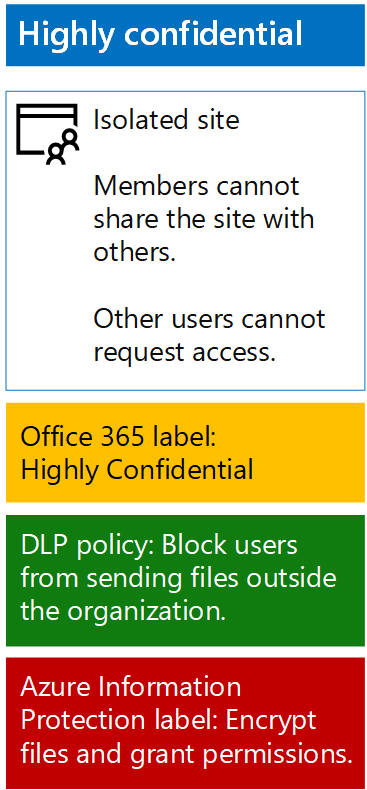

# Proteger archivos de SharePoint Online con protección de la información de AzureProtect SharePoint Online files with Azure Information Protection

 **Resumen:** Aplicar la protección de la información de Azure para proteger los archivos en un sitio de grupo SharePoint Online altamente confidencial.**Summary:** Apply Azure Information Protection to protect files in a highly confidential SharePoint Online team site.
  
Utilice los pasos de este artículo para configurar la protección de la información de Azure para proporcionar cifrado y los permisos de archivos en un sitio de grupo SharePoint Online altamente confidencial. La protección de cifrado y permisos viaja con un archivo, incluso cuando se descarga desde el sitio. Para obtener más información acerca de los sitios de equipo de SharePoint Online altamente confidenciales, vea [archivos y sitios de SharePoint Online seguro](secure-sharepoint-online-sites-and-files.md).Use the steps in this article to configure Azure Information Protection to provide encryption and permissions for files in a highly confidential SharePoint Online team site. The encryption and permissions protection travels with a file even when it is downloaded from the site. For more information about highly confidential SharePoint Online team sites, see [Secure SharePoint Online sites and files](secure-sharepoint-online-sites-and-files.md).
  
> [!NOTE]
> Cuando se aplica el cifrado de protección de la información de Azure a archivos almacenados en Office 365, el servicio no puede procesar el contenido de estos archivos. Co-autoría, eDiscovery, búsqueda, Delve y otras características de colaboración no funcionan. Políticas de datos Loss Prevention (DLP) sólo pueden trabajar con los metadatos (incluidos los rótulos de Office 365), pero no el contenido de estos archivos (como números de tarjeta de crédito dentro de los archivos).When Azure Information Protection encryption is applied to files stored in Office 365, the service cannot process the contents of these files. Co-authoring, eDiscovery, search, Delve, and other collaborative features do not work. Data Loss Prevention (DLP) policies can only work with the metadata (including Office 365 labels) but not the contents of these files (such as credit card numbers within files). 
  
En primer lugar, siga las instrucciones de [Activar Azure RMS con el centro de administración de Office 365](https://docs.microsoft.com/information-protection/deploy-use/activate-office365) para la suscripción de Office 365.First, use the instructions in [Activate Azure RMS with the Office 365 admin center](https://docs.microsoft.com/information-protection/deploy-use/activate-office365) for your Office 365 subscription.
  
A continuación, configure la protección de la información de Azure con una nueva directiva con ámbito y Sub-etiqueta de protección y los permisos de su sitio de grupo de SharePoint Online altamente confidencial.Next, configure Azure Information Protection with a new scoped policy and sub-label for protection and permissions of your highly confidential SharePoint Online team site.
  
1. Iniciar sesión en el portal de Office 365 con una cuenta que tiene la función de administrador de seguridad o de la empresa. Para obtener ayuda, visite [dónde puede iniciar sesión en Office 365](https://support.office.com/Article/Where-to-sign-in-to-Office-365-e9eb7d51-5430-4929-91ab-6157c5a050b4).Sign in to the Office 365 portal with an account that has the Security Administrator or Company Administrator role. For help, see [Where to sign in to Office 365](https://support.office.com/Article/Where-to-sign-in-to-Office-365-e9eb7d51-5430-4929-91ab-6157c5a050b4).
    
2. En una ficha independiente del explorador, vaya al portal de Azure ([https://portal.azure.com](https://portal.azure.com)).In a separate tab of your browser, go to the Azure portal ([https://portal.azure.com](https://portal.azure.com)).
    
3. Si es la primera vez se configura la protección de la información de Azure, consulte estas [instrucciones](https://docs.microsoft.com/information-protection/deploy-use/configure-policy#to-access-the-azure-information-protection-blade-for-the-first-time).If this is the first time you are configuring Azure Information Protection, see these [instructions](https://docs.microsoft.com/information-protection/deploy-use/configure-policy#to-access-the-azure-information-protection-blade-for-the-first-time).
    
4. En el panel lista, haga clic en **más servicios**, escriba la **información**y, a continuación, haga clic en **Protección de la información de Azure**.In the list pane, click **More services**, type **information**, and then click **Azure Information Protection**.
    
5. En la hoja de **protección de la información de Azure** , haga clic en **ámbito directivas > + Agregar una nueva directiva de**.On the **Azure Information protection** blade, , click **Scoped policies > + Add a new policy**.
    
6. En **nombre de directiva** y una descripción, en **Descripción**, escriba un nombre para la nueva directiva.Type a name for the new policy in **Policy name** and a description in **Description**.
    
7. Haga clic en **Seleccionar qué usuarios o grupos Obtén esta directiva > usuario/grupos**, y, a continuación, seleccione el sitio acceso a miembros grupo para el sitio de grupo SharePoint Online altamente confidencial.Click **Select which users or groups get this policy > User/Groups**, and then select the site members access group for your highly sensitive SharePoint Online team site. 
    
8. Haga clic en **Seleccionar > Aceptar**.Click **Select > OK**.
    
9. Para la etiqueta **Altamente confidencial** , haga clic en los puntos suspensivos (...) y, a continuación, haga clic en **Agregar una etiqueta Sub**.For the **Highly Confidential** label, click the ellipses (…), and then click **Add a sub-label**.
    
10. Escriba un nombre para la Sub-etiqueta de **nombre** y una descripción de la etiqueta de **Descripción**.Type a name for the sub-label in **Name** and a description of the label in **Description**.
    
11. **Establecer permisos para documentos y correos electrónicos con esta etiqueta**, haga clic en **proteger**.In **Set permissions for documents and emails containing this label**, click **Protect**.
    
12. En la sección de **protección** , haga clic en **Azure (clave de nube)**.In the **Protection** section, click **Azure (cloud key)**.
    
13. En la hoja de **protección** , en **configuración de protección**, haga clic en **+ Agregar permisos**.On the **Protection** blade, under **Protection settings**, click **+ Add permissions**.
    
14. En la hoja de **permisos para agregar** , en **especificar usuarios y grupos**, haga clic en **+ Examinar directorio**.On the **Add permissions** blade, under **Specify users and groups**, click **+ Browse directory**.
    
15. En el panel de **DAA usuarios y grupos** , seleccione el grupo de acceso de miembros de sitio para el sitio de grupo SharePoint Online muy confidencial y, a continuación, haga clic en **Seleccionar**.On the **AAD Users and Groups** pane, select the site members access group for your highly sensitive SharePoint Online team site, and then click **Select**.
    
16. En **Elija el ajuste preestablecido los permisos**, desactive las casillas de verificación **Imprimir**, **Copiar y extraer contenido**y **hacia delante** .Under **Choose permissions from the preset**, clear the **Print**, **Copy and extract content**, and **Forward** check boxes.
    
17. Haga clic en **Aceptar** dos veces.Click **OK** twice.
    
18. En la hoja **secundario-etiqueta** , haga clic en **Guardar**.On the **Sub-label** blade, click **Save**.
    
19. Cierre el nuevo blade de ámbito de la política.Close the new scoped policy blade.
    
20. En el módulo de **protección de la información de Azure - directivas de ámbito** , haga clic en **Publicar**.On the **Azure Information protection - Scoped policies** blade, click **Publish**.
    
Ésta es su configuración resultante para el sitio de grupo SharePoint Online altamente confidencial.This is your resulting configuration for your highly confidential SharePoint Online team site.
  

  
Ahora está listo para empezar a crear documentos y protegerlas con protección de la información de Azure y la nueva etiqueta.You are now ready to begin creating documents and protecting them with Azure Information Protection and your new label.
  
Debe [instalar al cliente de protección de la información de Azure](https://docs.microsoft.com/information-protection/rms-client/install-client-app) en el dispositivo o el equipo basado en Windows. Puede automatizar la instalación y secuencia de comandos o los usuarios pueden instalar al cliente manualmente. Consulte los siguientes recursos:You must [install the Azure Information Protection client](https://docs.microsoft.com/information-protection/rms-client/install-client-app) on your device or Windows-based computer. You can script and automate the installation, or users can install the client manually. See the following resources:
  
- [El lado del cliente de protección de la información de AzureThe client side of Azure Information Protection](https://docs.microsoft.com/information-protection/rms-client/use-client)
    
- [Instalación del cliente de protección de la información de AzureInstalling the Azure Information Protection client](https://docs.microsoft.com/information-protection/rms-client/client-admin-guide)
    
- [Página de descarga para una instalación manualDownload page for manual installation](https://www.microsoft.com/download/details.aspx?id=53018)
    
Una vez instalado, los usuarios ejecutaron y, a continuación, inicio de sesión a partir de una aplicación de Office (como Microsoft Word) con su cuenta de Office 365. Una nueva barra de **Protección de la información** permite a los usuarios seleccionar la nueva etiqueta. Asegúrese de que los usuarios saben el sitio de grupo SharePoint Online y que la etiqueta a utilizar, para proteger sus archivos altamente confidenciales.Once installed, your users run and then sign-in from an Office application (such as Microsoft Word) with their Office 365 account. A new **Information Protection** bar allows users to select the new label. Make sure that your users know the SharePoint Online team site and which label to use, to protect their highly confidential files.
  
> [!NOTE]
> Si tiene varios sitios de equipo de SharePoint Online altamente confidenciales, debe crear varias directivas de protección de la información de Azure ámbito con subetiquetas con la configuración anterior, con los permisos para cada Sub-etiqueta establecer al grupo acceso de miembros del sitio de un sitio de grupo SharePoint Online específico.If you have multiple highly sensitive SharePoint Online team sites, you should create multiple Azure Information Protection scoped policies with sub-labels with the above settings, with the permissions for each sub-label set to the site members access group of a specific SharePoint Online team site. 
  
## Consulte tambiénSee Also

[Proteger los archivos y los sitios de SharePoint OnlineSecure SharePoint Online sites and files](secure-sharepoint-online-sites-and-files.md)
  
[Sitios de SharePoint Online seguros en un entorno de pruebas y desarrolloSecure SharePoint Online sites in a dev/test environment](secure-sharepoint-online-sites-in-a-dev-test-environment.md)
  
[Guía de seguridad de Microsoft para campañas políticas, las ONG y otras organizaciones de AgileMicrosoft Security Guidance for Political Campaigns, Nonprofits, and Other Agile Organizations](microsoft-security-guidance-for-political-campaigns-nonprofits-and-other-agile-o.md)
  
[Adopción de la nube y soluciones híbridasCloud adoption and hybrid solutions](cloud-adoption-and-hybrid-solutions.md)

