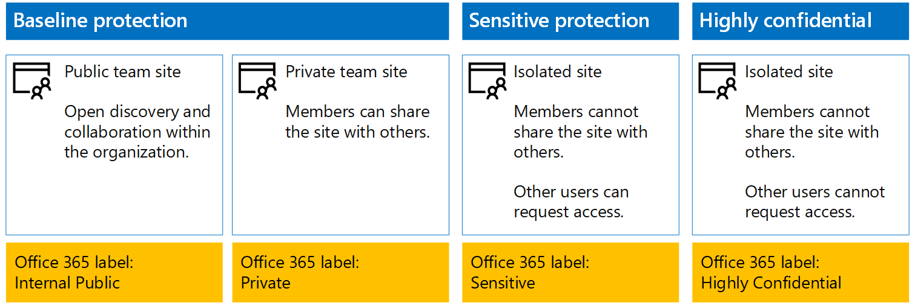

# <a name="protect-sharepoint-online-files-with-office-365-labels-and-dlp"></a>Proteger archivos de SharePoint Online con etiquetas de Office 365 y DLP

 **Resumen:** Aplicar Office 365 rótulos y datos pérdida prevention (DLP) directivas para sitios de equipo de SharePoint Online con varios niveles de protección de la información.
  
Utilice los pasos de este artículo para diseñar e implementar Office 365 etiquetas y las directivas DLP de línea de base, sensibles y altamente confidenciales SharePoint Online sitios team. Para obtener más información acerca de estos tres niveles de protección, vea [archivos y sitios de SharePoint Online seguro](secure-sharepoint-online-sites-and-files.md).
  
## <a name="office-365-labels-for-your-sharepoint-online-sites"></a>Etiquetas de Office 365 para los sitios de SharePoint Online

Hay tres fases para crear y asignarle Office 365 etiquetas a los sitios de equipo de SharePoint Online.
  
### <a name="phase-1-determine-the-office-365-label-names"></a>Fase 1: Determinar los nombres de etiqueta de Office 365

En esta fase se determinan los nombres de las etiquetas de Office 365 para los cuatro niveles de protección de la información aplicados a los sitios de grupo de SharePoint Online. En la siguiente tabla se indican los nombres recomendados para cada nivel.
  
|**Nivel de protección de sitio de grupo de SharePoint Online**|**Nombre de etiqueta**|
|:-----|:-----|
|Base de referencia-Público  <br/> |Interno público  <br/> |
|Base de referencia-Privado  <br/> |Private  <br/> |
|Confidencial  <br/> |Confidencial  <br/> |
|Extremadamente confidencial  <br/> |Extremadamente confidencial  <br/> |
   
### <a name="phase-2-create-the-office-365-labels"></a>Fase 2: Crear las etiquetas de Office 365

En esta fase se crean y luego se publican las etiquetas determinadas para los diferentes niveles de protección de la información.
  
Para crear las etiquetas, puede usar el Centro de administración de Office 365 o Microsoft PowerShell.
  
### <a name="create-office-365-labels-with-the-office-365-admin-center"></a>Crear etiquetas de Office 365 con el centro de administración de Office 365

1. Iniciar sesión en el portal de Office 365 con una cuenta que tiene la función de administrador de seguridad o de la empresa. Para obtener ayuda, visite [dónde puede iniciar sesión en Office 365](https://support.office.com/Article/Where-to-sign-in-to-Office-365-e9eb7d51-5430-4929-91ab-6157c5a050b4).
    
2. En la pestaña de **inicio de Microsoft Office**, haga clic en el icono **Administración**.
    
3. Desde la ficha del **Centro de administración de Office** nueva del explorador, haga clic en **centros de administración > seguridad &amp; Compliance**.
    
4. Desde la nueva **Inicio - seguridad &amp; Compliance** ficha del explorador, haga clic en **las clasificaciones > etiquetas**.
    
5. En el panel **Inicio > Etiquetas**, haga clic en **Crear una etiqueta**.
    
6. En el panel **nombre de la etiqueta** , escriba el nombre de la etiqueta y, a continuación, haga clic en **siguiente**.
    
7. En el panel **Configuración de etiquetas**, haga clic en **Siguiente**.
    
8. En el panel **Revisar la configuración** , haga clic en **crear esta etiqueta**y, a continuación, haga clic en **Cerrar**.
    
9. Repita los pasos del 5 al 8 para las etiquetas adicionales.
    
### <a name="create-office-365-labels-with-powershell"></a>Crear etiquetas de Office 365 con PowerShell

1. [Conectar con la seguridad de Office 365 &amp; centro de cumplimiento de normas mediante PowerShell remoto](http://go.microsoft.com/fwlink/?LinkID=799771&amp;clcid=0x409) y especifique las credenciales de una cuenta que tiene la función de administrador de seguridad o de la empresa.
    
2. Rellene la lista de nombres de etiqueta y luego ejecute estos comandos en el símbolo del sistema de PowerShell:
    
  ```
  $labelNames=@(<list of label names, each enclosed in quotes and separated by commas>)
ForEach ($element in $labelNames){ New-ComplianceTag -Name $element }
  ```

Luego siga estos pasos para publicar las nuevas etiquetas de Office 365.
  
1. Desde el **Home > etiquetas** panel la seguridad &amp; centro de cumplimiento de normas, haga clic en **etiquetas de publicar**.
    
2. En el panel para **elegir las etiquetas que se van a publicar**, haga clic para **elegir las etiquetas que se van a publicar**.
    
3. En el panel de **elección de etiquetas**, haga clic en **Agregar** y seleccione las cuatro etiquetas.
    
4. Haga clic en **Listo**.
    
5. En el panel **Choose labels to publish** (Elegir las etiquetas que se van a publicar), haga clic en **Siguiente**.
    
6. En el panel **Elegir ubicaciones**, haga clic en **Siguiente**.
    
7. En el panel **nombre de la directiva** , escriba un nombre para el conjunto de etiquetas de **nombre**y, a continuación, haga clic en **siguiente**.
    
8. En el panel **Revisar la configuración** , haga clic en **etiquetas de publicar**y, a continuación, haga clic en **Cerrar**.
    
### <a name="phase-3-apply-the-office-365-labels-to-your-sharepoint-online-sites"></a>Fase 3: Aplicar las etiquetas de Office 365 a los sitios de SharePoint Online

Siga estos pasos para aplicar las etiquetas de Office 365 a las carpetas de documentos de los sitios de grupo de SharePoint Online.
  
1. En la pestaña **Inicio de Microsoft Office** del explorador, haga clic en el icono **SharePoint**.
    
2. En la nueva pestaña **SharePoint** del explorador, haga clic en un sitio al que haya que asignarle una etiqueta de Office 365.
    
3. En la nueva pestaña del sitio de SharePoint del explorador, haga clic en **Documentos**.
    
4. Haga clic en el icono de configuración y luego en **Configuración de biblioteca**.
    
5. En **Permisos y administración**, haga clic en **Apply label to items in this library** (Aplicar la etiqueta a los elementos de esta biblioteca).
    
6. En **Aplicar configuración de etiqueta**, seleccione la etiqueta adecuada y, a continuación, haga clic en **Guardar**.
    
7. Cierre la pestaña del sitio de SharePoint Online.
    
8. Repita los pasos del 3 al 8 para asignar etiquetas de Office 365 a otros sitios de SharePoint Online.
    
Esta es la configuración resultante.
  

  
## <a name="dlp-policies-for-your-sharepoint-online-sites"></a>Directivas de DLP para los sitios de SharePoint Online

Siga estos pasos para configurar una directiva de DLP que notifique a los usuarios cada vez que compartan un documento en un sitio de grupo confidencial de SharePoint Online de fuera de la organización.
  
1. En la ficha **Página de inicio de Microsoft Office** en el explorador, haga clic en el **seguridad &amp; Compliance** mosaico.
    
2. En el nuevo **seguridad &amp; Compliance** , haga clic en el explorador **prevención de pérdidas de datos > directiva de**.
    
3. En el panel **Prevención de pérdida de datos**, haga clic en **+ Crear una directiva**.
    
4. En el **comenzar con una plantilla o crear una directiva personalizada** panel, haga clic en **personalizado**y, a continuación, haga clic en **siguiente**.
    
5. En el panel **nombre de la directiva** , escriba el nombre de la directiva DLP nivel confidencial en **nombre**y, a continuación, haga clic en **siguiente**.
    
6. En el panel **Elegir ubicaciones**, haga clic para que se le **permita elegir ubicaciones concretas** y luego haga clic en **Siguiente**.
    
7. En la lista de ubicaciones, deshabilitar las ubicaciones de **correo electrónico de Exchange** y **cuentas de OneDrive** y, a continuación, haga clic en **siguiente**.
    
8. En el panel **Customize the types of sensitive info you want to protect** (Personalizar los tipos de información confidencial que quiere proteger), haga clic en **Editar**.
    
9. En el panel **Elija los tipos de contenido para proteger** , haga clic en **Agregar** en el cuadro de lista desplegable y, a continuación, haga clic en **etiquetas**.
    
10. En el panel **etiquetas** , haga clic en **+ Agregar**, seleccione la etiqueta **confidencial** , haga clic en **Agregar**y, a continuación, haga clic en **Listo**.
    
11. En el panel **Choose the types of content to protect** (Elegir los tipos de contenido que se va a proteger), haga clic en **Guardar**.
    
12. En el panel **Customize the types of sensitive info you want to protect** (Personalizar los tipos de información confidencial que quiere proteger), haga clic en **Siguiente**.
    
13. En el panel **What do you want to do if we detect sensitive info?** (¿Qué quiere hacer si se detecta información confidencial?), haga clic en **Customize the tip and email** (Personalizar la sugerencia y el correo electrónico).
    
14. En el panel **Customize policy tips and email notifications** (Personalizar sugerencias de directiva y notificaciones de correo electrónico), haga clic en **Customize the policy tip text** (Personalizar el texto de la sugerencia de directiva).
    
15. En el cuadro de texto, escriba o pegue lo siguiente:
    
  - Para compartir con un usuario de fuera de la organización, descargue el archivo y luego ábralo. Haga clic en Archivo, Proteger documento y Cifrar con contraseña y, luego, especifique una contraseña segura. Envíe la contraseña en un correo electrónico diferente u otro medio de comunicación.
    
    Como alternativa, escriba o pegue en su propia sugerencia de directiva que indica a los usuarios sobre cómo compartir un archivo fuera de la organización.
    
16. Haga clic en **Aceptar**.
    
17. En la **¿Qué desea hacer si se detecta información sensible?** panel, desactive la casilla de verificación **Bloquear personas compartan y restringir el acceso al contenido compartido** y, a continuación, haga clic en **siguiente**.
    
18. En el **¿desea activar las cosas de la política o prueba primero?** panel, haga clic en **Sí, activarlo inmediatamente**y, a continuación, haga clic en **siguiente**.
    
19. En el panel **Revisar la configuración** , haga clic en **crear**y, a continuación, haga clic en **Cerrar**.
    
A continuación se muestra la configuración resultante para los sitios de grupo confidenciales de SharePoint Online.
  

  
Ahora siga estos pasos para configurar una directiva de DLP que impida a los usuarios compartir un documento en un sitio de grupo extremadamente confidencial de SharePoint Online de fuera de la organización.
  
1. En la ficha **Página de inicio de Microsoft Office** en el explorador, haga clic en el **seguridad &amp; Compliance** mosaico.
    
2. En el nuevo **seguridad &amp; Compliance** , haga clic en el explorador **prevención de pérdidas de datos > directiva de**.
    
3. En el panel **Prevención de pérdida de datos**, haga clic en **+ Crear una directiva**.
    
4. En el **comenzar con una plantilla o crear una directiva personalizada** panel, haga clic en **personalizado**y, a continuación, haga clic en **siguiente**.
    
5. En el panel **nombre de la directiva** , escriba el nombre de la directiva DLP nivel muy confidencial en **nombre**y, a continuación, haga clic en **siguiente**.
    
6. En el panel **Elegir ubicaciones**, haga clic para que se le **permita elegir ubicaciones concretas** y luego haga clic en **Siguiente**.
    
7. En la lista de ubicaciones, deshabilitar las ubicaciones de **correo electrónico de Exchange** y **cuentas de OneDrive** y, a continuación, haga clic en **siguiente**.
    
8. En el panel **Customize the types of sensitive info you want to protect** (Personalizar los tipos de información confidencial que quiere proteger), haga clic en **Editar**.
    
9. En el panel **Elija los tipos de contenido para proteger** , haga clic en **Agregar** en el cuadro de lista desplegable y, a continuación, haga clic en **etiquetas**.
    
10. En el panel **etiquetas** , haga clic en **+ Agregar**, seleccione la etiqueta **Altamente confidencial** , haga clic en **Agregar**y, a continuación, haga clic en **Listo**.
    
11. En el panel **Choose the types of content to protect** (Elegir los tipos de contenido que se va a proteger), haga clic en **Guardar**.
    
12. En el panel **Customize the types of sensitive info you want to protect** (Personalizar los tipos de información confidencial que quiere proteger), haga clic en **Siguiente**.
    
13. En el panel **What do you want to do if we detect sensitive info?** (¿Qué quiere hacer si se detecta información confidencial?), haga clic en **Customize the tip and email** (Personalizar la sugerencia y el correo electrónico).
    
14. En el panel **Customize policy tips and email notifications** (Personalizar sugerencias de directiva y notificaciones de correo electrónico), haga clic en **Customize the policy tip text** (Personalizar el texto de la sugerencia de directiva).
    
15. En el cuadro de texto, escriba o pegue lo siguiente:
    
  - Para compartir con un usuario de fuera de la organización, descargue el archivo y luego ábralo. Haga clic en Archivo, Proteger documento y Cifrar con contraseña y, luego, especifique una contraseña segura. Envíe la contraseña en un correo electrónico diferente u otro medio de comunicación.
    
    Como alternativa, escriba o pegue en su propia sugerencia de directiva que indica a los usuarios sobre cómo compartir un archivo fuera de la organización.
    
16. Haga clic en **Aceptar**.
    
17. En la **¿Qué desea hacer si se detecta información sensible?** panel, seleccione **requerir una justificación comercial para reemplazar**y, a continuación, haga clic en **siguiente**.
    
18. En el **¿desea activar las cosas de la política o prueba primero?** panel, haga clic en **Sí, activarlo inmediatamente**y, a continuación, haga clic en **siguiente**.
    
19. En el panel **Revisar la configuración** , haga clic en **crear**y, a continuación, haga clic en **Cerrar**.
    
A continuación se muestra la configuración resultante para sitios de grupo extremadamente confidenciales de SharePoint Online.
  

  
## <a name="next-step"></a>Paso siguiente

[Protección de archivos de SharePoint Online con Azure Information Protection](protect-sharepoint-online-files-with-azure-information-protection.md)
    
## <a name="see-also"></a>Consulte también

[Protección de archivos y sitios de SharePoint Online](secure-sharepoint-online-sites-and-files.md)
  
[Protección de sitios de SharePoint Online en un entorno de prueba y desarrollo](secure-sharepoint-online-sites-in-a-dev-test-environment.md)
  
[Instrucciones de seguridad de Microsoft para campañas políticas, organizaciones sin ánimo de lucro y otras organizaciones ágiles](microsoft-security-guidance-for-political-campaigns-nonprofits-and-other-agile-o.md)
  
[Adopción de la nube y soluciones híbridas](cloud-adoption-and-hybrid-solutions.md)


