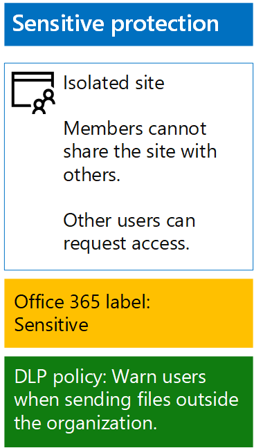

# <a name="protect-sharepoint-online-files-with-office-365-labels-and-dlp"></a>Proteger archivos de SharePoint Online con etiquetas de Office 365 y DLP

 **Resumen:** Aplicar Office 365 rótulos y datos pérdida prevention (DLP) directivas para sitios de equipo de SharePoint Online con varios niveles de protección de la información.
  
Utilice los pasos de este artículo para diseñar e implementar Office 365 etiquetas y las directivas DLP de línea de base, sensibles y altamente confidenciales SharePoint Online sitios team. Para obtener más información acerca de estos tres niveles de protección, vea [archivos y sitios de SharePoint Online seguro](secure-sharepoint-online-sites-and-files.md).
  
## <a name="office-365-labels-for-your-sharepoint-online-sites"></a>Etiquetas de Office 365 para los sitios de SharePoint Online

Hay tres fases para crear y asignarle Office 365 etiquetas a los sitios de equipo de SharePoint Online.
  
### <a name="phase-1-determine-the-office-365-label-names"></a>Fase 1: Determinar los nombres de etiqueta de Office 365

En esta fase, se determinan los nombres de las etiquetas de Office 365 para los cuatro niveles de protección de la información que se aplica a los sitios de equipo de SharePoint Online. En la tabla siguiente enumera los nombres recomendados para cada nivel.
  
|**Nivel de protección de sitio de equipo SharePoint Online**|**Nombre de la etiqueta**|
|:-----|:-----|
|Público de la línea de base  <br/> |Público interno  <br/> |
|Línea de base y privada  <br/> |Privada  <br/> |
|Confidencial  <br/> |Confidencial  <br/> |
|Altamente confidencial  <br/> |Altamente confidencial  <br/> |
   
### <a name="phase-2-create-the-office-365-labels"></a>Fase 2: Crear las etiquetas de Office 365

En esta fase, cree y publique las etiquetas determinadas para los diferentes niveles de protección de la información.
  
Para crear las etiquetas, puede utilizar el centro de administración de Office 365 o Microsoft PowerShell.
  
### <a name="create-office-365-labels-with-the-office-365-admin-center"></a>Crear etiquetas de Office 365 con el centro de administración de Office 365

1. Iniciar sesión en el portal de Office 365 con una cuenta que tiene la función de administrador de seguridad o de la empresa. Para obtener ayuda, visite [dónde puede iniciar sesión en Office 365](https://support.office.com/Article/Where-to-sign-in-to-Office-365-e9eb7d51-5430-4929-91ab-6157c5a050b4).
    
2. Desde la ficha **Página de inicio de Microsoft Office** , haga clic en el mosaico de **Admin** .
    
3. Desde la ficha del **Centro de administración de Office** nueva del explorador, haga clic en **centros de administración > seguridad &amp; Compliance**.
    
4. Desde la nueva **Inicio - seguridad &amp; Compliance** ficha del explorador, haga clic en **las clasificaciones > etiquetas**.
    
5. Desde el **Home > etiquetas** panel, haga clic en **crear una etiqueta**.
    
6. En el panel **nombre de la etiqueta** , escriba el nombre de la etiqueta y, a continuación, haga clic en **siguiente**.
    
7. En el panel de **configuración de etiquetas** , haga clic en **siguiente**.
    
8. En el panel **Revisar la configuración** , haga clic en **crear esta etiqueta**y, a continuación, haga clic en **Cerrar**.
    
9. Repita los pasos 5-8 para sus etiquetas adicionales.
    
### <a name="create-office-365-labels-with-powershell"></a>Crear etiquetas de Office 365 con PowerShell

1. [Conectar con la seguridad de Office 365 &amp; centro de cumplimiento de normas mediante PowerShell remoto](http://go.microsoft.com/fwlink/?LinkID=799771&amp;clcid=0x409) y especifique las credenciales de una cuenta que tiene la función de administrador de seguridad o de la empresa.
    
2. Rellenar la lista de nombres de etiqueta y, a continuación, ejecutar estos comandos en el símbolo del sistema de PowerShell:
    
  ```
  $labelNames=@(<list of label names, each enclosed in quotes and separated by commas>)
ForEach ($element in $labelNames){ New-ComplianceTag -Name $element }
  ```

A continuación, siga estos pasos para publicar las nuevas etiquetas de Office 365.
  
1. Desde el **Home > etiquetas** panel la seguridad &amp; centro de cumplimiento de normas, haga clic en **etiquetas de publicar**.
    
2. En el panel **etiquetas elegir publicar** , haga clic en **Elegir etiquetas para publicar**.
    
3. En el panel **etiquetas de elegir** , haga clic en **Agregar** y seleccione todas las etiquetas de cuatro.
    
4. Haga clic en **Listo**.
    
5. En el panel **etiquetas elegir publicar** , haga clic en **siguiente**.
    
6. En el panel **Elegir ubicaciones** , haga clic en **siguiente**.
    
7. En el panel **nombre de la directiva** , escriba un nombre para el conjunto de etiquetas de **nombre**y, a continuación, haga clic en **siguiente**.
    
8. En el panel **Revisar la configuración** , haga clic en **etiquetas de publicar**y, a continuación, haga clic en **Cerrar**.
    
### <a name="phase-3-apply-the-office-365-labels-to-your-sharepoint-online-sites"></a>Fase 3: Aplicar las etiquetas de Office 365 a los sitios de SharePoint Online

Utilice estos pasos para aplicar las etiquetas Office 365 a las carpetas de documentos de los sitios de equipo de SharePoint Online.
  
1. Desde la ficha **Página de inicio de Microsoft Office** del explorador, haga clic en el mosaico de **SharePoint** .
    
2. En la ficha nuevo de **SharePoint** en el explorador, haga clic en un sitio que tiene asignada una etiqueta de Office 365.
    
3. En la nueva ficha de sitio de SharePoint del explorador, haga clic en **documentos**.
    
4. Haga clic en el icono de configuración y, a continuación, haga clic en **configuración de la biblioteca**.
    
5. En **permisos y administración**, haga clic en **Aplicar etiqueta a los elementos de esta biblioteca**.
    
6. En **Aplicar configuración de etiqueta**, seleccione la etiqueta adecuada y, a continuación, haga clic en **Guardar**.
    
7. Cierre la ficha para el sitio de SharePoint Online.
    
8. Repita los pasos 3 a 8 para asignar etiquetas de Office 365 a los sitios de SharePoint Online adicionales.
    
Esta es la configuración resultante.
  

  
## <a name="dlp-policies-for-your-sharepoint-online-sites"></a>Directivas de DLP para sus sitios de SharePoint Online

Siga estos pasos para configurar una directiva DLP que notifica a los usuarios cuando comparte un documento en un sitio SharePoint Online del equipo confidenciales fuera de la organización.
  
1. En la ficha **Página de inicio de Microsoft Office** en el explorador, haga clic en el **seguridad &amp; Compliance** mosaico.
    
2. En el nuevo **seguridad &amp; Compliance** , haga clic en el explorador **prevención de pérdidas de datos > directiva de**.
    
3. En el panel de **prevención de pérdidas de datos** , haga clic en **+ crear una directiva**.
    
4. En el **comenzar con una plantilla o crear una directiva personalizada** panel, haga clic en **personalizado**y, a continuación, haga clic en **siguiente**.
    
5. En el panel **nombre de la directiva** , escriba el nombre de la directiva DLP nivel confidencial en **nombre**y, a continuación, haga clic en **siguiente**.
    
6. En el panel **Elegir ubicaciones** , haga clic en **Dejarme elegir ubicaciones específicas**y, a continuación, haga clic en **siguiente**.
    
7. En la lista de ubicaciones, deshabilitar las ubicaciones de **correo electrónico de Exchange** y **cuentas de OneDrive** y, a continuación, haga clic en **siguiente**.
    
8. En el panel **Personalizar los tipos de información confidencial que desea proteger** , haga clic en **Editar**.
    
9. En el panel **Elija los tipos de contenido para proteger** , haga clic en **Agregar** en el cuadro de lista desplegable y, a continuación, haga clic en **etiquetas**.
    
10. En el panel **etiquetas** , haga clic en **+ Agregar**, seleccione la etiqueta **confidencial** , haga clic en **Agregar**y, a continuación, haga clic en **Listo**.
    
11. En el panel **Elija los tipos de contenido para proteger** , haga clic en **Guardar**.
    
12. En el panel **Personalizar los tipos de información confidencial que desea proteger** , haga clic en **siguiente**.
    
13. En la **¿Qué desea hacer si se detecta información sensible?** panel, haga clic en **Personalizar la sugerencia y correo electrónico**.
    
14. En el panel de **sugerencias de directiva personalizar y notificaciones por correo electrónico** , haga clic en **Personalizar el texto de sugerencia de directiva**.
    
15. En el cuadro texto, escriba o pegue lo siguiente:
    
  - Para compartir con otros usuarios fuera de la organización, descargue el archivo y, a continuación, ábralo. Haga clic en archivo, a continuación, Proteger documento y a continuación, cifrar con contraseña y, a continuación, especifique una contraseña segura. Enviar la contraseña en un correo electrónico u otros medios de comunicación.
    
    Como alternativa, escriba o pegue en su propia sugerencia de directiva que indica a los usuarios sobre cómo compartir un archivo fuera de la organización.
    
16. Haga clic en **Aceptar**.
    
17. En la **¿Qué desea hacer si se detecta información sensible?** panel, desactive la casilla de verificación **Bloquear personas compartan y restringir el acceso al contenido compartido** y, a continuación, haga clic en **siguiente**.
    
18. En el **¿desea activar las cosas de la política o prueba primero?** panel, haga clic en **Sí, activarlo inmediatamente**y, a continuación, haga clic en **siguiente**.
    
19. En el panel **Revisar la configuración** , haga clic en **crear**y, a continuación, haga clic en **Cerrar**.
    
Aquí está la configuración resultante de importantes sitios de equipo de SharePoint Online.
  

  
A continuación, siga estos pasos para configurar una directiva DLP que impide a los usuarios cuando comparte un documento en un sitio SharePoint Online de equipo altamente confidencial fuera de la organización.
  
1. En la ficha **Página de inicio de Microsoft Office** en el explorador, haga clic en el **seguridad &amp; Compliance** mosaico.
    
2. En el nuevo **seguridad &amp; Compliance** , haga clic en el explorador **prevención de pérdidas de datos > directiva de**.
    
3. En el panel de **prevención de pérdidas de datos** , haga clic en **+ crear una directiva**.
    
4. En el **comenzar con una plantilla o crear una directiva personalizada** panel, haga clic en **personalizado**y, a continuación, haga clic en **siguiente**.
    
5. En el panel **nombre de la directiva** , escriba el nombre de la directiva DLP nivel muy confidencial en **nombre**y, a continuación, haga clic en **siguiente**.
    
6. En el panel **Elegir ubicaciones** , haga clic en **Dejarme elegir ubicaciones específicas**y, a continuación, haga clic en **siguiente**.
    
7. En la lista de ubicaciones, deshabilitar las ubicaciones de **correo electrónico de Exchange** y **cuentas de OneDrive** y, a continuación, haga clic en **siguiente**.
    
8. En el panel **Personalizar los tipos de información confidencial que desea proteger** , haga clic en **Editar**.
    
9. En el panel **Elija los tipos de contenido para proteger** , haga clic en **Agregar** en el cuadro de lista desplegable y, a continuación, haga clic en **etiquetas**.
    
10. En el panel **etiquetas** , haga clic en **+ Agregar**, seleccione la etiqueta **Altamente confidencial** , haga clic en **Agregar**y, a continuación, haga clic en **Listo**.
    
11. En el panel **Elija los tipos de contenido para proteger** , haga clic en **Guardar**.
    
12. En el panel **Personalizar los tipos de información confidencial que desea proteger** , haga clic en **siguiente**.
    
13. En la **¿Qué desea hacer si se detecta información sensible?** panel, haga clic en **Personalizar la sugerencia y correo electrónico**.
    
14. En el panel de **sugerencias de directiva personalizar y notificaciones por correo electrónico** , haga clic en **Personalizar el texto de sugerencia de directiva**.
    
15. En el cuadro texto, escriba o pegue lo siguiente:
    
  - Para compartir con otros usuarios fuera de la organización, descargue el archivo y, a continuación, ábralo. Haga clic en archivo, a continuación, Proteger documento y a continuación, cifrar con contraseña y, a continuación, especifique una contraseña segura. Enviar la contraseña en un correo electrónico u otros medios de comunicación.
    
    Como alternativa, escriba o pegue en su propia sugerencia de directiva que indica a los usuarios sobre cómo compartir un archivo fuera de la organización.
    
16. Haga clic en **Aceptar**.
    
17. En la **¿Qué desea hacer si se detecta información sensible?** panel, seleccione **requerir una justificación comercial para reemplazar**y, a continuación, haga clic en **siguiente**.
    
18. En el **¿desea activar las cosas de la política o prueba primero?** panel, haga clic en **Sí, activarlo inmediatamente**y, a continuación, haga clic en **siguiente**.
    
19. En el panel **Revisar la configuración** , haga clic en **crear**y, a continuación, haga clic en **Cerrar**.
    
Aquí está la configuración resultante para sitios de equipo de SharePoint Online de alto secreto.
  

  
## <a name="next-step"></a>Paso siguiente

[Proteger archivos de SharePoint Online con protección de la información de Azure](protect-sharepoint-online-files-with-azure-information-protection.md)
    
## <a name="see-also"></a>Consulte también

[Proteger los archivos y los sitios de SharePoint Online](secure-sharepoint-online-sites-and-files.md)
  
[Sitios de SharePoint Online seguros en un entorno de pruebas y desarrollo](secure-sharepoint-online-sites-in-a-dev-test-environment.md)
  
[Guía de seguridad de Microsoft para campañas políticas, las ONG y otras organizaciones de Agile](microsoft-security-guidance-for-political-campaigns-nonprofits-and-other-agile-o.md)
  
[Adopción de la nube y soluciones híbridas](cloud-adoption-and-hybrid-solutions.md)


