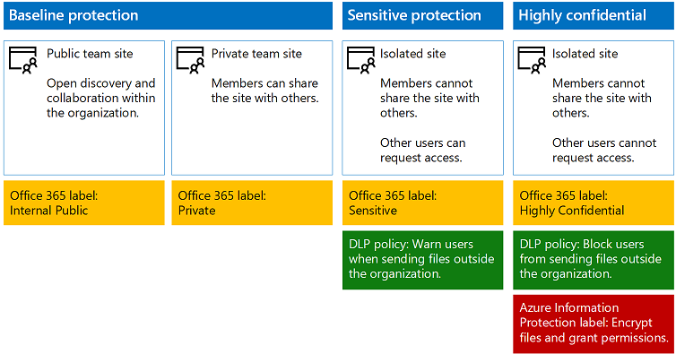
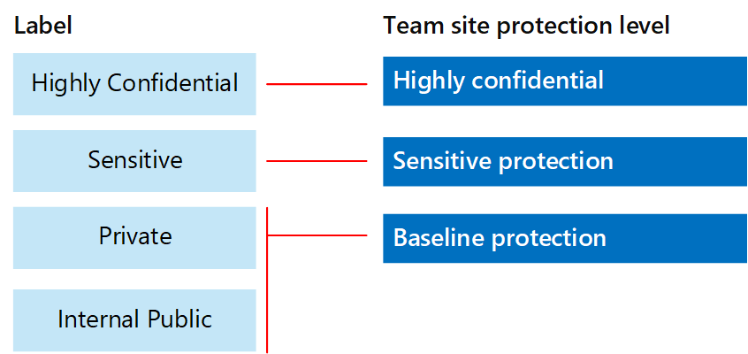
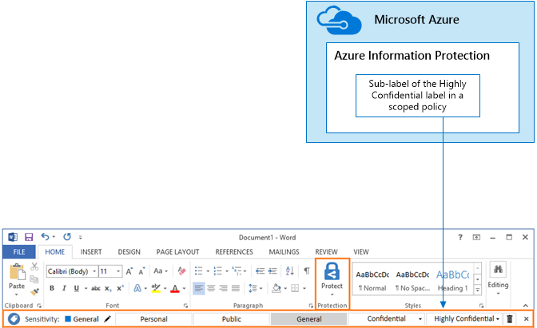

# Proteger los archivos y los sitios de SharePoint OnlineSecure SharePoint Online sites and files

 **Resumen:** Recomendaciones de configuración para proteger los archivos en SharePoint Online y Office 365.**Summary:** Configuration recommendations for protecting files in SharePoint Online and Office 365.
  
En este artículo se ofrece recomendaciones para configurar sitios de equipo de SharePoint Online y protección de archivos que equilibra la seguridad con la facilidad de colaboración. Este artículo define cuatro configuraciones distintas, a partir de un sitio público dentro de su organización con las directivas de uso compartidas más abiertas. Cada configuración adicional representa un paso significativo de protección, pero se reduce la capacidad de acceso y colaborar en los recursos para el conjunto pertinente de los usuarios. Utilice estas recomendaciones como punto de partida y ajustar las configuraciones para satisfacer las necesidades de su organización.This article provides recommendations for configuring SharePoint Online team sites and file protection that balances security with ease of collaboration. This article defines four different configurations, starting with a public site within your organization with the most open sharing policies. Each additional configuration represents a meaningful step up in protection, but the ability to access and collaborate on resources is reduced to the relevant set of users. Use these recommendations as a starting point and adjust the configurations to meet the needs of your organization. 
  
Las configuraciones en este artículo se alinean con las recomendaciones de Microsoft para tres niveles de protección de datos, identidades y dispositivos:The configurations in this article align with Microsoft's recommendations for three tiers of protection for data, identities, and devices:
  
- Protección básicaBaseline protection
    
- Protección confidencialSensitive protection
    
- Protección altamente confidencialHighly confidential protection
    
Para obtener más información acerca de estos niveles y capacidades recomendadas para cada nivel, consulte los siguientes recursos.For more information about these tiers and capabilities recommended for each tier, see the following resources. 
  
- [Protección de identidades y dispositivos para Office 365Identity and Device Protection for Office 365](microsoft-cloud-it-architecture-resources.md#BKMK_O365IDP)
    
- [Soluciones de protección de archivos en Office 365File Protection Solutions in Office 365](microsoft-cloud-it-architecture-resources.md#BKMK_O365fileprotect)
    
## Resumen de la capacidadCapability overview

Recomendaciones para los sitios de SharePoint Online equipo dibujar en una variedad de capacidades de Office 365. Sitios altamente confidencial, se recomienda la protección de la información de Azure. Esto se incluye en la movilidad en la empresa + seguridad (EMS).Recommendations for SharePoint Online team sites draw on a variety of Office 365 capabilities. For highly confidential sites, Azure Information Protection is recommended. This is included in Enterprise Mobility + Security (EMS). 
  
La ilustración siguiente muestra las configuraciones recomendadas para cuatro sitios de equipo de SharePoint Online.The following illustration shows the recommended configurations for four SharePoint Online team sites.
  

  
Tal como se muestra:As illustrated:
  
- Protección básica incluye dos opciones para sitios de equipo de SharePoint Online: un sitio público y sitio privado. Sitios públicos pueden ser detectados y acceso a alguien de la organización. Sitios privados sólo pueden ser detectados y tener acceso a los miembros del sitio. Ambas de estas configuraciones de sitio permiten compartir fuera del grupo.Baseline protection includes two options for SharePoint Online team sites — a public site and private site. Public sites can be discovered and accessed by anybody in the organization. Private sites can only be discovered and accessed by members of the site. Both of these site configurations allow for sharing outside the group. 
    
- Protección altamente confidencial y sensible en los sitios son sitios privados con acceso limitado sólo a los miembros de grupos específicos.Sites for sensitive and highly confidential protection are private sites with access limited only to members of specific groups.
    
- Etiquetas de Office 365 proporcionan una manera de clasificar los datos con un nivel de protección necesaria. Cada uno de los sitios de equipo de SharePoint Online se configuran automáticamente archivos de etiqueta en bibliotecas de documentos con una etiqueta predeterminada para el sitio. Correspondientes a las configuraciones de cuatro sitios, las etiquetas en este ejemplo son internos Public, Private, sensible y altamente confidencial. Los usuarios pueden cambiar las etiquetas, pero esta configuración asegura que todos los archivos reciban una etiqueta default.Office 365 labels provide a way to classify data with a needed protection level. Each of the SharePoint Online team sites are configured to automatically label files in document libraries with a default label for the site. Corresponding to the four site configurations, the labels in this example are Internal Public, Private, Sensitive, and Highly Confidential. Users can change the labels, but this configuration ensures all files receive a default label.
    
- Las políticas de prevención (DLP) de pérdida de datos se configuran para que las etiquetas altamente confidencial Office 365 y sensibles a advertir o impedir que los usuarios cuando intentan enviar estos tipos de archivos fuera de la organización.Data loss prevention (DLP) policies are configured for the Sensitive and Highly Confidential Office 365 labels to either warn or prevent users when they attempt to send these types of files outside the organization.
    
- Para los sitios configurados con protección altamente confidencial, protección de la información de Azure cifra y concede permisos para los archivos.For sites configured with highly confidential protection, Azure Information Protection encrypts and grants permissions for files.
    
## Configuración de inquilinos todo para SharePoint Online y OneDrive para el negocioTenant-wide settings for SharePoint Online and OneDrive for Business

SharePoint Online y OneDrive para los negocios incluyen la configuración de todo el inquilino que afectan a todos los sitios y los usuarios. Algunas de estas opciones pueden ajustarse en el nivel del sitio para que sea más restrictivo (pero no inferior). Esta sección trata la configuración inquilinos que afectan a la seguridad y la colaboración.SharePoint Online and OneDrive for Business include tenant-wide settings that affect all sites and users. Some of these settings can also be adjusted at the site level to be more restrictive (but not less). This section discusses tenant-wide settings that affect security and collaboration. 
  
### Uso compartidoSharing

Para esta solución, se recomienda la siguiente configuración de inquilinos:For this solution, we recommend the following tenant-wide settings:
  
- Mantenga la predeterminada compartir directiva que permita el uso compartido con todos los tipos de cuenta, incluido el uso compartido de anónimo.Keep the default sharing policy that allows all sharing with all account types, including anonymous sharing.
    
- Establecer vínculos anónimos caduque, si lo desea.Set anonymous links to expire, if desired.
    
- Cambiar el tipo de vínculo predeterminado para compartir como interna. Esto ayuda a prevenir la pérdida accidental de datos fuera de la organización.Change the default link type for sharing to Internal. This helps prevent accidental data leakage outside your organization.
    
Aunque pueda parecer poco intuitiva para permitir el uso compartido externo, este enfoque proporciona más control sobre comparado con el envío de archivos por correo electrónico el uso compartido de archivos. SharePoint Online y Outlook colaboran para proporcionar colaboración segura de archivos.While it might seem counterintuitive to allow external sharing, this approach provides more control over file sharing compared to sending files in email. SharePoint Online and Outlook work together to provide secure collaboration on files. 
  
- De forma predeterminada, Outlook comparte un vínculo a un archivo en lugar de enviar el archivo por correo electrónico.By default, Outlook shares a link to a file instead of sending the file in email. 
    
- SharePoint Online y OneDrive para el negocio facilitan compartir vínculos a archivos con colaboradores que están tanto dentro como fuera de la organizaciónSharePoint Online and OneDrive for Business make it easy to share links to files with contributors who are both inside and outside your organization
    
También tiene los controles y regulan el intercambio externo. Por ejemplo, puede:You also have controls to help govern external sharing. For example, you can:
  
- Deshabilitar un vínculo de invitado anónimo.Disable an anonymous guest link.
    
- Revocar el acceso de usuario a un sitio.Revoke user access to a site.
    
- Vea quién tiene acceso a un sitio específico o un documento.See who has access to a specific site or document.
    
- Establecer vínculos para compartir anónimo a punto de caducar (establecer el arrendatario).Set anonymous sharing links to expire (tenant setting).
    
- Limitar quién puede compartir fuera de su organización (establecer el arrendatario).Limit who can share outside your organization (tenant setting).
    
### Uso externo compartiendo junto con la prevención de pérdidas de datos (DLP)Use external sharing together with data loss prevention (DLP)

Si no desea permitir compartir externos, los usuarios con una empresa necesitan encontrará métodos y herramientas alternativas. Microsoft recomienda que combinar compartir externo con las directivas de DLP para proteger los archivos confidenciales y altamente confidenciales.If you don't allow external sharing, users with a business need will find alternate tools and methods. Microsoft recommends you combine external sharing with DLP policies to protect sensitive and highly confidential files.
  
### Configuración de acceso de dispositivoDevice access settings

Configuración de acceso de dispositivo para SharePoint Online y OneDrive para el negocio permite determinar si el acceso está limitado a sólo explorador (no se pueden descargar archivos) o si se bloquea el acceso. Estos valores están actualmente en la primera versión y aplican todo el arrendatario. Próximamente es la capacidad de configurar las directivas de acceso de dispositivo en el nivel de sitio. Para esta solución, se recomienda no utilizar configuración de acceso de dispositivo que se aplican a todo el arrendatario.Device access settings for SharePoint Online and OneDrive for Business let you determine whether access is limited to browser only (files can't be downloaded) or if access is blocked. These settings are currently in First Release and apply tenant-wide. Coming soon is the ability to configure device access policies at the site level. For this solution, we recommend not using device access settings that apply tenant-wide.
  
Para utilizar la configuración de acceso de dispositivo mientras se encuentran en la primera versión: [Configurar el estándar o las primeras opciones liberar en Office 365](https://support.office.com/article/Set-up-the-Standard-or-First-Release-options-in-Office-365-3B3ADFA4-1777-4FF0-B606-FB8732101F47).To use device access settings while these are in first release: [Set up the Standard or First Release Options in Office 365](https://support.office.com/article/Set-up-the-Standard-or-First-Release-options-in-Office-365-3B3ADFA4-1777-4FF0-B606-FB8732101F47).
  
### OneDrive para la EmpresaOneDrive for Business

Visite estos valores para decidir si desea cambiar la configuración predeterminada para la OneDrive de los sitios comerciales. Actualmente, la configuración de acceso de uso compartido y el dispositivo se duplica desde el centro de administración de SharePoint Online y se aplica a ambos entornos.Visit these settings to decide if you want to change the default settings for OneDrive for Business sites. Currently, the sharing and device access settings are duplicated from the SharePoint Online admin center and apply to both environments.
  
## Configuración de sitio de SharePoint teamSharePoint team site configuration

La tabla siguiente resume la configuración para cada uno de los sitios de equipo descritos anteriormente en este artículo. Utilice estas configuraciones como recomendaciones de punto de partida y ajustar los tipos de sitio y configuraciones para satisfacer las necesidades de su organización. No todas las organizaciones deben cada tipo de sitio. Sólo un pequeño número de organizaciones requiere protección altamente confidencial.The following table summarizes the configuration for each of the team sites described earlier in this article. Use these configurations as starting point recommendations and adjust the site types and configurations to meet the needs of your organization. Not every organization needs every type of site. Only a small number of organizations require highly confidential protection.
  
||||||
|:-----|:-----|:-----|:-----|:-----|
||**Protección básica #1****Baseline protection #1**   |**Protección básica #2****Baseline protection #2**   |**Protección confidencial****Sensitive protection**   |**Altamente confidencial****Highly confidential**   |
|DescripciónDescription    |Abra el descubrimiento y la colaboración dentro de la organización.Open discovery and collaboration within the organization.    |Sitio privado y grupo con uso compartido permitido fuera del grupo.Private site and group with sharing allowed outside the group.    |Sitio aislado, en el que se definen los niveles de acceso por la pertenencia a grupos específicos. Sólo se permite el uso compartido a los miembros del sitio. DLP advierte a los usuarios al intentar enviar archivos fuera de la organización.Isolated site, in which levels of access are defined by membership in specific groups. Sharing is only allowed to members of the site. DLP warns users when attempting to send files outside the organization.    |Sitio aislado + cifrado de archivos y permisos con protección de la información de Azure. DLP impide que los usuarios envíen archivos fuera de la organización.Isolated site + file encryption and permissions with Azure Information Protection. DLP prevents users from sending files outside the organization.    |
|Sitio de grupo privado o públicoPrivate or public team site    |PúblicoPublic    |PrivadaPrivate    |PrivadaPrivate    |PrivadaPrivate    |
|¿Quién tiene acceso?Who has access?    |Todos los miembros de la organización, incluidos los usuarios de B2B y los invitados.Everybody in the organization, including B2B users and guest users.    |Miembros del sitio sólo. Otros usuarios pueden solicitar el acceso.Members of the site only. Others can request access.    |Miembros del sitio sólo. Otros usuarios pueden solicitar el acceso.Members of the site only. Others can request access.    |Sólo los miembros. Otros usuarios no pueden solicitar el acceso.Members only. Others cannot request access.    |
|Controles de nivel de sitio para compartirSite-level sharing controls    |Compartir permitidos con nadie. La configuración predeterminada.Sharing allowed with anybody. Default settings.    |Compartir permitidos con nadie. La configuración predeterminada.Sharing allowed with anybody. Default settings.    |Los miembros no pueden compartir el acceso al sitio.Members cannot share access to the site.    Que no sean miembros pueden solicitar acceso al sitio, pero estas solicitudes deben solucionarse por un administrador del sitio.Non-members can request access to the site, but these requests need to be addressed by a site administrator.    |Los miembros no pueden compartir el acceso al sitio.Members cannot share access to the site.    Que no sean miembros no pueden solicitar acceso al sitio o al contenido.Non-members cannot request access to the site or contents.    |
|Controles de acceso de dispositivo de nivel de sitioSite-level device access controls    |No hay controles adicionales.No additional controls.    |No hay controles adicionales.No additional controls.    |Controles de nivel de sitio son muy pronto, lo que impide que los usuarios descargar archivos en dispositivos combinados no conformes o no sea de dominio. Esto permite el acceso sólo mediante navegador de todos los demás dispositivos.Site-level controls are coming soon, which prevents users from downloading files to non-compliant or non-domain joined devices. This allows browser-only access from all other devices.    |Controles de nivel de sitio son muy pronto, que bloquea la descarga de archivos a dispositivos combinados no conformes o no sea de dominio.Site-level controls are coming soon, which blocks downloading of files to non-compliant or non-domain joined devices.    |
|Etiquetas de Office 365Office 365 labels    |Público internoInternal Public    |PrivadaPrivate    |ConfidencialSensitive    |Altamente confidencialHighly Confidential    |
|Directivas de DLPDLP policies    |||Advertir a los usuarios enviar archivos etiquetados como delicada fuera de la organización.Warn users when sending files that are labeled as Sensitive outside the organization.    Para bloquear el intercambio externo de tipos de datos confidenciales, como números de tarjetas de crédito u otros datos personales, puede configurar directivas DLP adicionales para estos tipos de datos (incluidos los tipos de datos personalizados que configura).To block external sharing of sensitive data types, such as credit card numbers or other personal data, you can configure additional DLP policies for these data types (including custom data types you configure).    |Impedir que los usuarios envíen archivos etiquetados como altamente confidenciales fuera de la organización. Permitir a los usuarios reemplazar esto proporcionando justificación, incluidos los que están compartiendo el archivo con.Block users from sending files that are labeled as highly confidential outside organization. Allow users to override this by providing justification, including who they are sharing the file with.    |
|Azure Information ProtectionAzure Information Protection    ||||Utilice la protección de la información de Azure para cifrar automáticamente y conceder permisos a los archivos. Esta protección se desplaza con los archivos en caso de se produzca la pérdida.Use Azure Information Protection to automatically encrypt and grant permissions to files. This protection travels with the files in case they are leaked.    Office 365 no puede leer los archivos cifrados con protección de la información de Azure. Además, las directivas de DLP sólo pueden trabajar con los metadatos (incluidas etiquetas), pero no el contenido de estos archivos (como números de tarjeta de crédito dentro de los archivos).Office 365 cannot read files encrypted with Azure Information Protection. Additionally, DLP policies can only work with the metadata (including labels) but not the contents of these files (such as credit card numbers within files).    |
   
Para que los pasos para implementar los cuatro tipos diferentes de sitios de SharePoint Online team en esta solución, vea [implementar SharePoint Online sitios para tres niveles de protección](deploy-sharepoint-online-sites-for-three-tiers-of-protection.md). Para que los pasos para crear un entorno de pruebas y desarrollo, consulte [sitios seguro en línea de SharePoint en un entorno de pruebas y desarrollo](secure-sharepoint-online-sites-in-a-dev-test-environment.md).For the steps to deploy the four different types of SharePoint Online team sites in this solution, see [Deploy SharePoint Online sites for three tiers of protection](deploy-sharepoint-online-sites-for-three-tiers-of-protection.md). For the steps to create a dev/test environment, see [Secure SharePoint Online sites in a dev/test environment](secure-sharepoint-online-sites-in-a-dev-test-environment.md). 
  
## Las etiquetas y la clasificación de office 365Office 365 classification and labels

Con las etiquetas de Office 365 se recomienda para entornos con datos confidenciales. Después de configurar y publicar Office 365 etiquetas:Using Office 365 labels is recommended for environments with sensitive data. After you configure and publish Office 365 labels:
  
- Puede aplicar una etiqueta predeterminada a una biblioteca de documentos en un sitio de grupo SharePoint Online, para que todos los documentos de dicha biblioteca Obtén la etiqueta predeterminada.You can apply a default label to a document library in a SharePoint Online team site, so that all documents in that library get the default label. 
    
- Puede aplicar etiquetas al contenido automáticamente si coincide con las condiciones específicas.You can apply labels to content automatically if it matches specific conditions.
    
- Puede aplicar las directivas de DLP se basan en etiquetas de Office 365.You can apply DLP policies that are based on Office 365 labels.
    
- Personas de la organización pueden aplicar una etiqueta manualmente al contenido en Outlook en el web, Outlook 2010 y posterior, OneDrive para grupos de trabajo, SharePoint Online y Office 365. Los usuarios suelen conocer mejor qué tipo de contenido están trabajando, para que pueda clasificarlos y aplicará la correspondiente directiva de DLP.People in your organization can apply a label manually to content in Outlook on the web, Outlook 2010 and later, OneDrive for Business, SharePoint Online, and Office 365 groups. Users often know best what type of content they're working with, so they can classify it and have the appropriate DLP policy applied.
    

  
Como se muestra, esta solución incluye la creación de las etiquetas siguientes:As illustrated, this solution includes creating the following labels:
  
- Altamente confidencialHighly Confidential
    
- ConfidencialSensitive
    
- PrivadaPrivate
    
- Público internoInternal Public
    
Estas etiquetas se asignan a los sitios recomendados en las ilustraciones y los gráficos anteriormente en este artículo. Esta solución recomienda la configuración de directivas DLP para ayudar a evitar la pérdida de archivos etiquetados como altamente confidenciales y sensibles.These labels are mapped to the recommended sites in the illustrations and charts earlier in this article. This solution recommends configuring DLP policies to help prevent the leakage of files labeled as Sensitive and Highly Confidential.
  
Para que los pasos para configurar las etiquetas de Office 365 y las directivas de DLP en esta solución, vea [proteger SharePoint Online archivos con etiquetas de Office 365 y DLP](protect-sharepoint-online-files-with-office-365-labels-and-dlp.md).For the steps to configure Office 365 labels and DLP policies in this solution, see [Protect SharePoint Online files with Office 365 labels and DLP](protect-sharepoint-online-files-with-office-365-labels-and-dlp.md).
  
## Azure Information ProtectionAzure Information Protection

Utilizar protección de la información de Azure para aplicar las etiquetas y las protecciones que siguen los archivos dondequiera que vayan. Para esta solución, se recomienda que utilizar una directiva de protección de la información de Azure con ámbito y una etiqueta dentro de la etiqueta altamente confidencial para cifrar y conceder permisos a los archivos que necesitan ser protegidos con el mayor nivel de seguridad.Use Azure Information Protection to apply labels and protections that follow the files wherever they go. For this solution, we recommend you use a scoped Azure Information Protection policy and a sub-label of the Highly Confidential label to encrypt and grant permissions to files that need to be protected with the highest level of security. 
  
Tenga en cuenta que cuando se aplica el cifrado de protección de la información de Azure a archivos almacenados en Office 365, el servicio no puede procesar el contenido de estos archivos. Co-autoría, eDiscovery, búsqueda, Delve y otras características de colaboración no funcionan. Las directivas de DLP sólo pueden trabajar con los metadatos (incluidos los rótulos de Office 365), pero no el contenido de estos archivos (como números de tarjeta de crédito dentro de los archivos).Be aware that when Azure Information Protection encryption is applied to files stored in Office 365, the service cannot process the contents of these files. Co-authoring, eDiscovery, search, Delve, and other collaborative features do not work. DLP policies can only work with the metadata (including Office 365 labels) but not the contents of these files (such as credit card numbers within files).
  

  
Tal como se muestra:As illustrated:
  
- Configurar las directivas de protección de la información de Azure y etiquetas en el portal de Microsoft Azure. Se recomienda configurar una etiqueta dentro de una política de protección de la información de Azure con ámbito.You configure Azure Information Protection policies and labels in the Microsoft Azure portal. Configuring a sub-label of a scoped Azure Information Protection policy is recommended.
    
- Protección de la información de Azure etiquetas mostrar encima como una barra de **protección de la información** en las aplicaciones de Office.Azure Information Protection labels show up as an **Information protection** bar in Office applications.
    
### Agregar permisos para usuarios externosAdding permissions for external users

Hay dos formas de conceder a los usuarios externos el acceso a archivos protegidos con protección de la información de Azure. En ambos casos, los usuarios externos deben tener una cuenta de Azure AD. Si los usuarios externos no son miembros de una organización que utiliza AD Azure, pueden obtener una cuenta de Azure AD como individuo mediante el uso de esta página: [https://aka.ms/aip-signup](https://aka.ms/aip-signup).There are two ways you can grant external users access to files protected with Azure Information Protection. In both these cases, external users must have an Azure AD account. If external users aren't members of an organization that uses Azure AD, they can obtain an Azure AD account as an individual by using this sign-up page: [https://aka.ms/aip-signup](https://aka.ms/aip-signup).
  
- Agregar usuarios externos a un grupo de AD de Azure que se utiliza para configurar la protección para una etiquetaAdd external users to an Azure AD group that is used to configure protection for a label
    
     Debe agregar la cuenta como usuario en el directorio B2B. Puede tardar un par de horas para el [almacenamiento en caché de Azure Rights Management de pertenencia de grupo](https://docs.microsoft.com/information-protection/plan-design/prepare#group-membership-caching-by-azure-rights-management). Con este método, los permisos se conceden a todos los archivos protegidos con la etiqueta (incluso archivos protegidos antes de agrega un usuario al grupo AD Azure).You'll need to first add the account as a B2B user in your directory. It can take a couple of hours for [group membership caching by Azure Rights Management](https://docs.microsoft.com/information-protection/plan-design/prepare#group-membership-caching-by-azure-rights-management). With this method, permissions are granted to all existing files protected with the label (even files protected before a user is added to the Azure AD group).
    
- Agregar usuarios externos directamente a la protección de etiquetaAdd external users directly to the label protection
    
     Puede agregar todos los usuarios de una organización (por ejemplo, Fabrikam.com), un grupo de AD Azure (por ejemplo, un grupo de finanzas dentro de una organización) o un usuario individual. Por ejemplo, puede agregar un equipo externo de los reguladores para la protección de una etiqueta. Con este método, los permisos se conceden sólo para archivos protegidos con la etiqueta después de agrega la entidad externa a la protección.You can add all users from an organization (e.g. Fabrikam.com), an Azure AD group (such as a finance group within an organization), or an individual user. For example, you can add an external team of regulators to the protection for a label. With this method, permissions are granted only to files protected with the label after the external entity is added to the protection.
    
### Implementar y utilizar la protección de la información de AzureDeploying and using Azure Information Protection

Para que los pasos para configurar la protección de la información de Azure en esta solución, vea [proteger SharePoint Online archivos con protección de la información de Azure](protect-sharepoint-online-files-with-azure-information-protection.md).For the steps to configure Azure Information Protection in this solution, see [Protect SharePoint Online files with Azure Information Protection](protect-sharepoint-online-files-with-azure-information-protection.md).
  
## Consulte tambiénSee Also

[Guía de seguridad de Microsoft para campañas políticas, las ONG y otras organizaciones de AgileMicrosoft Security Guidance for Political Campaigns, Nonprofits, and Other Agile Organizations](microsoft-security-guidance-for-political-campaigns-nonprofits-and-other-agile-o.md)
  
[Soluciones de seguridadSecurity solutions](security-solutions.md)
  
[Adopción de la nube y soluciones híbridasCloud adoption and hybrid solutions](cloud-adoption-and-hybrid-solutions.md)
  
[Sitios de SharePoint Online seguros en un entorno de pruebas y desarrolloSecure SharePoint Online sites in a dev/test environment](secure-sharepoint-online-sites-in-a-dev-test-environment.md)

