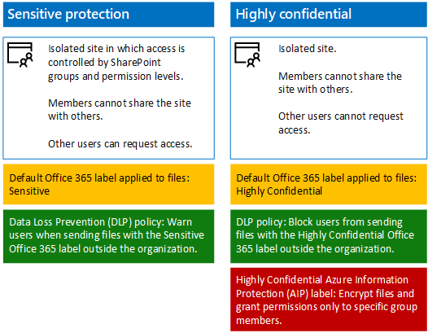

# Sitios de equipo SharePoint Online seguros de activos importantes y altamente confidenciales

 **Resumen:** Cómo Contoso implementa confidencial protección y altamente confidencial SharePoint Online sitios para la colaboración más fácil y segura, para ejecutivos y sus centros de investigación del equipo.
  
El liderazgo ejecutivo de Contoso desea utilizar Office 365 y almacenar sus archivos en una única ubicación para colaboración, independientemente de dónde podría ser un ejecutivo. De forma similar, los departamentos de investigación de Contoso, con divisiones en Bangalore, Beijing, Moscú, Nueva York y París — le gustaría sus activos digitales de local a la nube para facilitar el acceso y la colaboración más abierta la transición entre equipos.
  
Sin embargo, en ambos casos, el acceso a estos recursos debe restringirse al subconjunto de personas que pueden ver o modificarlas, con continua permisos para el sitio administrado por el personal de TI. Además, incluso si algunos recursos de forma intencionada o no distribuidas, deben estar cifrados y tienen permisos para impedir que quienes no tienen acceso para ver o cambiar su contenido.
  
Los administradores de seguridad y SharePoint en Contoso del departamento de TI decidió utilizar protección sensible y sitios de grupo de SharePoint Online altamente confidencial, como se muestra en la figura 1.
  
**Figura 1: Comparación de protección sensible y altamente confidenciales sitios de grupo de SharePoint Online**

  
Contoso utiliza estos pasos para crear sitios de equipo de SharePoint Online seguros para sus ejecutivos y equipos de investigación:
  
1. Crear un sitio de grupo de SharePoint Online confidencial **ejecutivos**
    
    El nuevo sitio de equipo utiliza los grupos existentes de Azure de Active Directory (AD) para ejecutivos como miembros con el nivel de permisos de SharePoint Editar y un pequeño conjunto de cuentas de administrador de SharePoint como propietarios con el nivel de permiso Control total.
    
2. Migrar archivos de ejecutivos
    
    Mover local ejecutivo archivos y carpetas existentes en el nuevo sitio del grupo ejecutivos SharePoint Online.
    
3. Crear un sitio de grupo de SharePoint Online altamente confidencial **investigación**
    
    El nuevo sitio de equipo utiliza grupos de equipo de investigación de Azure AD existentes como miembros con el nivel de permiso de edición y un pequeño conjunto de cuentas de administrador de SharePoint como propietarios con el nivel de permiso Control total. Una etiqueta AIP asignada a archivos de investigación garantiza que están cifrados y sólo los miembros de un grupo de investigación pueden abrirlos.
    
4. Migrar archivos de investigación
    
    Mover el equipo de investigación existentes local archivos y carpetas en el nuevo sitio SharePoint Online de investigación de equipo.
    
El resultado es que dos sitios de colaboración, cuyo acceso se controla estrechamente por la seguridad y los administradores de SharePoint. Para archivos con la etiqueta altamente confidencial AIP, incluso si se distribuyen fuera del sitio del equipo de investigación, que están encriptados y sólo puede abrirse por un miembro de un equipo de investigación.
  
Para obtener más información, vea [archivos y sitios de SharePoint Online seguro](https://docs.microsoft.com/microsoft-365-enterprise/secure-sharepoint-online-sites-and-files).
  
 Para utilizar esta configuración para pruebas y desarrollo, prueba de concepto o demostración, vea [sitios seguro en línea de SharePoint en un entorno de pruebas y desarrollo](https://docs.microsoft.com/microsoft-365-enterprise/secure-sharepoint-online-sites-dev-test).
  
## Vea también

[Escenarios empresariales para Contoso Corporation](enterprise-scenarios-for-the-contoso-corporation.md)
  
[Contoso en la nube de Microsoft](contoso-in-the-microsoft-cloud.md)
  
[Recursos de arquitectura de TI de la nube de Microsoft](microsoft-cloud-it-architecture-resources.md)

[Stretch Database](https://msdn.microsoft.com/library/dn935011.aspx)
  
[Mapa de ruta de Enterprise Cloud de Microsoft: Recursos para los responsables de la toma de decisiones de TI](https://sway.com/FJ2xsyWtkJc2taRD)

