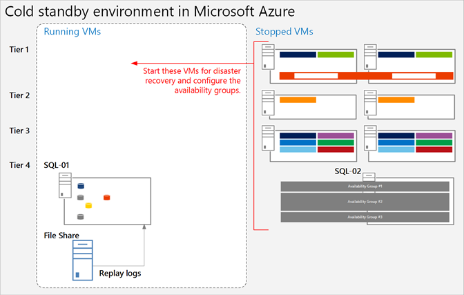

# <a name="sharepoint-server-2013-disaster-recovery-in-microsoft-azure"></a>Recuperación ante desastres de SharePoint Server 2013 en Microsoft Azure

 **Resumen:** con Azure, puede crear un entorno de recuperación ante desastres para la granja de servidores local de SharePoint. En este artículo se describe cómo diseñar e implementar esta solución.
  
 Cuando se produce un desastre en el entorno local de SharePoint, la prioridad es que el sistema vuelva a funcionar lo antes posible. La recuperación ante desastres con SharePoint es más fácil y rápida cuando ya tiene un entorno de copia de seguridad que ya se está ejecutando en Microsoft Azure. En este vídeo se explican los conceptos principales de un entorno de conmutación por error activo de SharePoint y complementa los detalles que se ofrecen en este artículo.
  

  
Use este artículo con el modelo de solución: **recuperación ante desastres de SharePoint en Microsoft Azure**.
  
[
  
](https://go.microsoft.com/fwlink/p/?LinkId=392555)
  
[PDF](https://go.microsoft.com/fwlink/p/?LinkId=392555) |[Visio](https://go.microsoft.com/fwlink/p/?LinkId=392554)
  
En este artículo:
  
- [Usar Servicios de infraestructura de Azure para recuperación ante desastres](sharepoint-server-2013-disaster-recovery-in-microsoft-azure.md#AZ)
    
- [Descripción de la solución](sharepoint-server-2013-disaster-recovery-in-microsoft-azure.md#SOL)
    
- [Arquitectura detallada](sharepoint-server-2013-disaster-recovery-in-microsoft-azure.md#arch)
    
- [Plan de recuperación ante desastres](sharepoint-server-2013-disaster-recovery-in-microsoft-azure.md#RDmap)
    
- [Fase 1: Diseñar el entorno de recuperación ante desastres](sharepoint-server-2013-disaster-recovery-in-microsoft-azure.md#Phase1)
    
- [Fase 2: Crear la red virtual de Azure y la conexión VPN](sharepoint-server-2013-disaster-recovery-in-microsoft-azure.md#Phase2)
    
- [Fase 3: Implementar Active Directory y servicios de nombres de dominio en la red virtual de Azure](sharepoint-server-2013-disaster-recovery-in-microsoft-azure.md#Phase3)
    
- [Fase 4: Implementar la granja de servidores de recuperación de SharePoint en Azure](sharepoint-server-2013-disaster-recovery-in-microsoft-azure.md#Phase4)
    
- [Fase 5: Configurar DFSR entre las granjas de servidores](sharepoint-server-2013-disaster-recovery-in-microsoft-azure.md#Phase5)
    
- [Fase 6: Configurar el trasvase de registros a la granja de servidores de recuperación](sharepoint-server-2013-disaster-recovery-in-microsoft-azure.md#Phase6)
    
- [Fase 7: Validar la conmutación por error y la recuperación](sharepoint-server-2013-disaster-recovery-in-microsoft-azure.md#Phase7)
    
- [Entorno de prueba de concepto de Microsoft](sharepoint-server-2013-disaster-recovery-in-microsoft-azure.md#POC)
    
- [Sugerencias para solucionar problemas](sharepoint-server-2013-disaster-recovery-in-microsoft-azure.md#Troubleshooting)
    
## <a name="use-azure-infrastructure-services-for-disaster-recovery"></a>Usar Servicios de infraestructura de Azure para recuperación ante desastres
<a name="AZ"> </a>

Muchas organizaciones no disponen de un entorno de recuperación ante desastres para SharePoint, ya que puede resultar caro crearlo y mantenerlo en la instalación local. Servicios de infraestructura de Azure ofrece opciones atractivas para entornos de recuperación ante desastres que son más flexibles y económicas que las alternativas en instalación local.
  
Entre las ventajas de usar Servicios de infraestructura de Azure se incluyen:
  
- **Menos recursos costosos**: se mantienen y pagan menos recursos que en los entornos locales de recuperación ante desastres. El número de recursos depende de qué entorno de recuperación ante desastres elija: espera activa, semiactiva o pasiva.
    
- **Mayor flexibilidad de recursos**: cuando se produce un desastre, puede escalar horizontalmente la granja de servidores de recuperación de SharePoint para cumplir los requisitos locales. Cuando ya no necesite los recursos, puede reducirlos horizontalmente.
    
- **Reducir el compromiso de los centros de datos** Use Servicios de infraestructura de Azure en lugar de invertir en un segundo centro de datos en una región distinta.
    
Existen opciones menos completas para organizaciones que acaban de empezar con la recuperación ante desastres y opciones avanzadas para organizaciones con requisitos de alta resistencia. Las definiciones de entornos de espera activa, semiactiva y pasiva son algo diferentes cuando el entorno se hospeda en una plataforma en la nube. En esta tabla se describen estos entornos para crear una granja de servidores de recuperación de SharePoint en Azure.
  
**Tabla: Entornos de recuperación**

|**Tipo de entorno de recuperación**|**Descripción**|
|:-----|:-----|
|Activa  <br/> |Se aprovisiona, actualiza y ejecuta una granja completa en modo de espera.  <br/> |
|Semiactiva  <br/> |Se crea la granja de servidores y se ponen en marcha y actualizan las máquinas virtuales.  <br/> La recuperación incluye adjuntar bases de datos de contenido, aprovisionar aplicaciones de servicio y rastrear contenido.  <br/> La granja de servidores puede ser una versión reducida de la granja de servidores de producción y más adelante se puede escalar horizontalmente para atender a la base completa de usuarios.  <br/> |
|Pasiva  <br/> |La granja de servidores se ha creado por completo, pero las máquinas virtuales están detenidas.  <br/> Para realizar el mantenimiento del entorno, hay que iniciar las máquinas virtuales de vez en cuando, revisar, actualizar y comprobar el entorno.  <br/> En caso de desastre, inicie el entorno completo.  <br/> |
   
Es importante evaluar los objetivos de tiempo de recuperación y los objetivos de punto de recuperación (RPO) de la organización. Estos requisitos determinan qué entorno es la inversión más adecuada para su organización.
  
En este artículo se explica cómo implementar un entorno de espera semiactiva. También puede adaptarlo a un entorno de espera pasiva, pero tendrá que realizar otros procedimientos adicionales para admitir este tipo de entorno. En este artículo no se describe cómo implementar un entorno de espera activa.
  
Para obtener más información sobre las soluciones de recuperación ante desastres, consulte [Conceptos de alta disponibilidad y recuperación ante desastres en SharePoint 2013](https://go.microsoft.com/fwlink/p/?LinkID=393114) y[Elegir una estrategia de recuperación ante desastres para SharePoint 2013](https://go.microsoft.com/fwlink/p/?linkid=203228).
  
## <a name="solution-description"></a>Descripción de la solución
<a name="SOL"> </a>

Para la solución de recuperación ante desastres de espera semiactiva se requiere este entorno:
  
- Una granja de servidores de producción de SharePoint local
    
- Una granja de servidores de recuperación de SharePoint en Azure
    
- Una conexión VPN de sitio a sitio entre los dos entornos
    
En esta ilustración se muestran estos tres elementos.
  
**Ilustración: Elementos de una solución en estado de espera semiactiva en Azure**


  
El trasvase de registros de SQL Server con la Replicación del sistema de archivos distribuido (DFSR) se usa para copiar las copias de seguridad de bases de datos y los registros de transacciones en la granja de servidores de recuperación en Azure: 
  
- DFSR transfiere los registros del entorno de producción al entorno de recuperación. En un escenario WAN, resulta más eficaz usar DFSR que trasvasar los registros directamente al servidor secundario en Azure.
    
- Los registros se reproducen para SQL Server en el entorno de recuperación de Azure.
    
- No adjunte bases de datos de contenido de SharePoint cuyos registros se han trasvasado en el entorno de recuperación, hasta que se realice un ejercicio de recuperación.
    
Siga estos pasos para recuperar la granja de servidores:
  
1. Detenga el trasvase de registros.
    
2. Deje de aceptar tráfico a la granja de servidores principal.
    
3. Reproduzca los registros de transacciones finales.
    
4. Adjunte las bases de datos de contenido a la granja de servidores.
    
5. Restaure las aplicaciones de servicio a partir de las bases de datos de servicios que se han replicado.
    
6. Actualice los registros del sistema de nombres de dominio (DNS) para que apunten a la granja de servidores de recuperación.
    
7. Inicie un rastreo completo.
    
Se recomienda ensayar periódicamente estos pasos y documentarlos para ayudarle a garantizar que la recuperación en directo se ejecutará correctamente. El proceso de adjuntar bases de datos de contenido y restaurar aplicaciones de servicio puede tardar bastante y normalmente requiere algo de configuración manual.
  
Después de realizar una recuperación, esta solución proporciona los elementos que aparecen en la tabla siguiente.
  
**Tabla: Objetivos de recuperación de solución**

|**Elemento**|**Descripción**|
|:-----|:-----|
|Sitios y contenido  <br/> |Los sitios y el contenido están disponibles en el entorno de recuperación.  <br/> |
|Una nueva instancia de búsqueda  <br/> |En esta solución de espera semiactiva, la búsqueda no se restaura a partir de las bases de datos de búsqueda. Los componentes de búsqueda de la granja de servidores de recuperación se configuran lo más parecido posible a la granja de servidores de producción. Después de restaurar los sitios y el contenido, se inicia un rastreo completo para recompilar el índice de búsqueda. No es necesario esperar a que se complete el rastreo para que los sitios y el contenido estén disponibles.  <br/> |
|Servicios  <br/> | Los servicios que almacenan datos en las bases de datos se restauran desde las bases de datos cuyos registros se han trasvasado. Simplemente se inician los servicios que no almacenan datos en bases de datos. <br/>  No es necesario restaurar todos los servicios con bases de datos. Los siguientes servicios no necesitan restaurarse a partir de las bases de datos y simplemente pueden iniciarse después de la conmutación por error: <br/>  Recolección de datos de uso y estado <br/>  Servicio de estado <br/>  Automatización de Word <br/>  Cualquier otro servicio que no usa una base de datos <br/> |
   
Puede trabajar con los Servicios de Consultoría de Microsoft (MCS) o un socio para tratar objetivos de recuperación más complejos. Estos se resumen en la siguiente tabla.
  
**Tabla: Otros elementos que MCS o un socio pueden tratar**

|**Elemento**|**Descripción**|
|:-----|:-----|
|Sincronización de soluciones de granja personalizadas  <br/> |Lo ideal es que la configuración de la granja de servidores de recuperación sea idéntica a la granja de servidores de producción. Puede trabajar con un consultor o un socio para evaluar si se replicarán las soluciones de granja personalizadas y si hay un proceso para mantener los dos entornos sincronizados.  <br/> |
|Conexiones a orígenes de datos de locales  <br/> |No sería práctico replicar las conexiones en sistemas de datos back-end, como conexiones de controlador de dominio de reserva (BDC) y orígenes de contenido de búsqueda.  <br/> |
|Escenarios de restauración de búsqueda  <br/> |Dado que las implementaciones del motor de búsqueda Enterprise Search tienden a ser únicas y bastante complejas, para restaurar la búsqueda desde las bases de datos es necesario realizar una mayor inversión. Puede trabajar con un consultor o un socio para identificar e implementar los escenarios de restauración de búsqueda que puede necesitar la organización.  <br/> |
   
En las instrucciones proporcionadas en este artículo se supone que la granja de servidores ya está diseñada e implementada.
  
## <a name="detailed-architecture"></a>Arquitectura detallada
<a name="arch"> </a>

Lo ideal es que la configuración de la granja de servidores de recuperación en Azure sea idéntica a la granja de servidores de producción local, incluido lo siguiente:
  
- La misma representación de roles de servidor
    
- La misma configuración de personalizaciones
    
- La misma configuración de componentes de búsqueda
    
El entorno de Azure puede ser una versión reducida de la granja de servidores de producción. Si va a escalar horizontalmente la granja de servidores de recuperación después de una conmutación por error, es importante que cada tipo de rol de servidor se represente desde el principio.
  
Es posible que no resulte práctico replicar algunas configuraciones en el entorno de conmutación por error. Asegúrese de probar los procedimientos de conmutación por error y el entorno para ayudar a garantizar que la granja de servidores de conmutación por error ofrezca el nivel de servicio previsto.
  
Esta solución no exige una topología específica para una granja de servidores de SharePoint. El objetivo de esta solución es usar Azure para la granja de servidores de conmutación por error y para implementar el trasvase de registros y DFSR entre los dos entornos.
  
### <a name="warm-standby-environments"></a>Entorno de espera semiactiva

En un entorno de espera semiactiva, todas las máquinas virtuales del entorno de Azure se están ejecutando. El entorno está listo para un evento o un ejercicio de conmutación por error.
  
En la siguiente ilustración se muestra una solución de recuperación ante desastres procedente de una granja de SharePoint local hacia una granja de SharePoint basada en Azure, que está configurada como un entorno de espera semiactiva.
  
**Ilustración: Topología y elementos clave de una granja de producción y una granja de servidores de recuperación en espera semiactiva.**


  
En este diagrama:
  
- Se ilustran dos entornos en paralelo: la granja de SharePoint local y la granja de espera semiactiva en Azure.
    
- Cada entorno incluye un recurso compartido de archivos.
    
- Cada granja de servidores incluye cuatro niveles. Para lograr alta disponibilidad, cada nivel incluye dos servidores o máquinas virtuales que están configuradas de forma idéntica para un rol específico, como los servicios front-end, la caché distribuida, los servicios back-end y las bases de datos. No hemos considerado importante destacar los componentes específicos en esta ilustración. Las dos granjas de servidores tienen una configuración idéntica.
    
- El cuarto nivel es el nivel de base de datos. El trasvase de registros se usa para copiar registros desde el servidor de bases de datos secundario en el entorno local hacia el recurso compartido de archivos en el mismo entorno.
    
- DFSR copia archivos desde el recurso compartido de archivos del entorno local hacia el recurso compartido de archivos en el entorno de Azure.
    
- El trasvase de registros reproduce los registros desde el recurso compartido de archivos en el entorno de Azure hasta la réplica principal en el grupo disponibilidad AlwaysOn de SQL Server en el entorno de recuperación.
    
### <a name="cold-standby-environments"></a>Entornos de espera pasiva

En un entorno de espera pasiva, la mayoría de las máquinas virtuales de la granja de servidores de SharePoint pueden cerrarse. (Se recomienda iniciar las máquinas virtuales de vez en cuando, como por ejemplo, cada dos semanas o una vez al mes, para que cada máquina virtual puede sincronizarse con el dominio). Las siguientes máquinas virtuales del entorno de recuperación de Azure deben seguir ejecutándose para garantizar la continuidad de las operaciones de trasvase de registros y DFSR:
  
- El recurso compartido de archivos
    
- El servidor de bases de datos principal
    
- Al menos una máquina virtual que ejecute Servicios de dominio de Windows Server Active Directory y DNS
    
En esta ilustración se muestra un entorno de conmutación por error de Azure en el que están en funcionamiento la máquina virtual del recurso compartido de archivos y la máquina virtual de la base de datos de SharePoint principal. Las demás máquinas virtuales de SharePoint están detenidas. No se muestra la máquina virtual que ejecuta Windows Server Active Directory y DNS.
  
**Ilustración: Granja de servidores de recuperación de espera pasiva con máquinas virtuales en funcionamiento**


  
Después de la conmutación por error a un entorno de espera pasiva, se inician todas las máquinas virtuales y debe configurarse el método para lograr una alta disponibilidad de los servidores de bases de datos, como los grupos de disponibilidad AlwaysOn de SQL Server.
  
Si se implementan varios grupos de almacenamiento (las bases de datos están dispersas en más de un conjunto de alta disponibilidad de SQL Server), la base de datos principal para cada grupo de almacenamiento debe estar ejecutándose para aceptar los registros asociados a su grupo de almacenamiento.
  
### <a name="skills-and-experience"></a>Conocimientos y experiencia

Se usan varias tecnologías en esta solución de recuperación ante desastres. Para garantizar que estas tecnologías interactúan de la manera esperada, cada componente del entorno local y el entorno de Azure debe estar instalado y configurado correctamente. Se recomienda que la persona o el grupo que configuren esta solución conozcan en profundidad las tecnologías descritas en estos artículos y tengan una sólida experiencia práctica con ellas:
  
- [Servicios de replicación del Sistema de archivos distribuido (DFS)](https://go.microsoft.com/fwlink/p/?LinkId=392698)
    
- [Clústeres de conmutación por error de Windows Server (WSFC) con SQL Server](https://go.microsoft.com/fwlink/p/?LinkId=392701)
    
- [Grupos de disponibilidad AlwaysOn (SQL Server)](https://go.microsoft.com/fwlink/p/?LinkId=392725)
    
- [Realizar copias de seguridad y restaurar bases de datos de SQL Server](https://go.microsoft.com/fwlink/p/?LinkId=392728)
    
- [Instalación e implementación de la granja de servidores de SharePoint Server 2013](https://go.microsoft.com/fwlink/p/?LinkId=393119)
    
- [Microsoft Azure](https://go.microsoft.com/fwlink/p/?LinkId=392729)
    
Por último, le recomendamos que elabore scripts con los conocimientos y los use para automatizar tareas asociadas a estas tecnologías. Se pueden usar las interfaces de usuario que hay disponibles para completar todas las tareas descritas en esta solución. Sin embargo, si este proceso se realiza de manera manual podría resultar muy lento, ocasionar algún error y ofrecer resultados incoherentes.
  
Además de Windows PowerShell, también hay bibliotecas de Windows PowerShell para SQL Server, SharePoint Server y Azure. No olvide T-SQL, que también puede ayudarle a reducir el tiempo necesario para configurar y mantener el entorno de recuperación ante desastres.
  
## <a name="disaster-recovery-roadmap"></a>Plan de recuperación ante desastres
<a name="RDmap"> </a>


  
En esta guía básica se da por supuesto que ya tiene una granja de servidores de SharePoint Server 2013 implementada en producción.
  
**Tabla: Guía básica de recuperación ante desastres**

|**Fase**|**Descripción**|
|:-----|:-----|
|Fase 1  <br/> |Diseñar el entorno de recuperación ante desastres  <br/> |
|Fase 2  <br/> |Crear la red virtual de Azure y la conexión VPN.  <br/> |
|Fase 3  <br/> |Implementar Windows Active Directory y servicios de nombres de dominio en la red virtual de Azure  <br/> |
|Fase 4  <br/> |Implementar la granja de servidores de recuperación de SharePoint en Azure.  <br/> |
|Fase 5  <br/> |Configurar DFSR entre granjas.  <br/> |
|Fase 6  <br/> |Configurar el trasvase de registros a la granja de servidores de recuperación.  <br/> |
|Fase 7  <br/> | Validar las soluciones de conmutación por error y recuperación. Esto incluye los siguientes procedimientos y tecnologías: <br/>  Detener el trasvase de registros <br/>  Restaurar las copias de seguridad <br/>  Rastrear el contenido <br/>  Recuperar servicios <br/>  Administrar los registros DNS <br/> |
   
## <a name="phase-1-design-the-disaster-recovery-environment"></a>Fase 1: Diseñar el entorno de recuperación ante desastres
<a name="Phase1"> </a>

Siga las instrucciones de [Arquitecturas de Microsoft Azure para SharePoint 2013](microsoft-azure-architectures-for-sharepoint-2013.md) para diseñar el entorno de recuperación ante desastres, incluida la granja de servidores de recuperación de SharePoint. Puede usar los gráficos del archivo de Visio sobre la[solución de recuperación ante desastres de SharePoint en Azure](https://go.microsoft.com/fwlink/p/?LinkId=392554) para empezar el proceso de diseño. Le recomendamos que diseñe el entorno completo antes comenzar a trabajar en el entorno de Azure.
  
Además de las instrucciones proporcionadas en [Arquitecturas de Microsoft Azure para SharePoint 2013](microsoft-azure-architectures-for-sharepoint-2013.md) para el diseño de la red virtual, la conexión VPN, Active Directory y la granja de servidores de SharePoint, asegúrese de agregar un rol de recurso compartido de archivos al entorno de Azure.
  
Para admitir el trasvase de registros en una solución de recuperación ante desastres, se agrega una máquina virtual de recurso compartido de archivos a la subred donde se encuentran los roles de base de datos. El recurso compartido de archivos también actúa como el tercer nodo de una Mayoría de nodo para el grupo de disponibilidad AlwaysOn de SQL Server. Se trata de la configuración recomendada para una granja de servidores de SharePoint estándar que usa grupos de disponibilidad AlwaysOn de SQL Server. 
  
> [!NOTE]
> Es importante revisar los requisitos previos para que una base de datos participe en un grupo de disponibilidad AlwaysOn de SQL Server. Para obtener más información, consulte [Requisitos previos, restricciones y recomendaciones para grupos de disponibilidad AlwaysOn](https://go.microsoft.com/fwlink/p/?LinkId=510870). 
  
**Ilustración: Ubicación de un servidor de archivos utilizado para una solución de recuperación ante desastres**


  
En este diagrama, se agrega una máquina virtual de recurso compartido de archivos a la misma subred de Azure que contiene los roles de servidor de bases de datos. Recomendamos que no agregue la máquina virtual del recurso compartido de archivos a un conjunto de disponibilidad con otros roles de servidor, como los roles de SQL Server.
  
Si le preocupa la alta disponibilidad de los registros, considere la posibilidad de adoptar un enfoque diferente, mediante el uso de [copia de seguridad de SQL Server y restauración con el servicio de almacenamiento de blobs de Azure](https://go.microsoft.com/fwlink/p/?LinkId=393113). Se trata de una nueva característica de Azure que guarda los registros directamente en una dirección URL de almacenamiento de blobs. Esta solución no incluye instrucciones sobre cómo usar esta característica.
  
Cuando diseñe la granja de servidores de recuperación, tenga en cuenta que un entorno de recuperación ante desastres refleja con exactitud la granja de servidores de producción que desea recuperar. El tamaño de la granja de servidores de recuperación no es lo más importante que debe tener en cuenta al diseñar la granja de recuperación, de implementación y de prueba. La escala de la granja de servidores varía de una organización a otra según los requisitos empresariales. Puede usar una granja de servidores reducida para un breve período o hasta que las demandas de rendimiento y capacidad requieran escalar la granja de servidores.
  
Configure la granja de servidores de recuperación del modo más parecido posible a la granja de servidores de producción para que cumpla los requisitos del acuerdo de nivel de servicio (SLA) y proporcione la funcionalidad que necesita para su negocio. Al diseñar el entorno de recuperación ante desastres, mire también el proceso de administración de cambios para el entorno de producción. Se recomienda ampliar el proceso de administración de cambios al entorno de recuperación, mediante la actualización del entorno de recuperación en el mismo intervalo que el entorno de producción. Como parte del proceso de administración de cambios, le recomendamos que mantenga un inventario detallado de la configuración de la granja de servidores, las aplicaciones y los usuarios. 
  
## <a name="phase-2-create-the-azure-virtual-network-and-vpn-connection"></a>Fase 2: Crear la red virtual de Azure y la conexión VPN
<a name="Phase2"> </a>

El tema [Conectar una red local con una red virtual de Microsoft Azure](connect-an-on-premises-network-to-a-microsoft-azure-virtual-network.md) muestra cómo planear e implementar la red virtual en Azure y cómo crear la conexión VPN. Siga las instrucciones de este tema para completar los procedimientos siguientes:
  
- Planear el espacio de direcciones IP privado de la Red virtual.
    
- Planear los cambios de infraestructura de enrutamiento para la Red virtual.
    
- Planear las reglas de firewall para el tráfico hacia y desde el dispositivo VPN local.
    
- Crear la red virtual entre entornos locales en Azure.
    
- Configurar el enrutamiento entre la red local y la Red virtual.
    
## <a name="phase-3-deploy-active-directory-and-domain-name-services-to-the-azure-virtual-network"></a>Fase 3: Implementar Active Directory y servicios de nombres de dominio en la red virtual de Azure
<a name="Phase3"> </a>

Esta fase abarca la implementación de Windows Server Active Directory y DNS en la Red virtual en un escenario híbrido, como se describe en [Arquitecturas de Microsoft Azure para SharePoint 2013](microsoft-azure-architectures-for-sharepoint-2013.md) y se muestra en esta imagen.
  
**Ilustración: Configuración de dominio híbrido de Active Directory**


  
En la ilustración, se implementan dos máquinas virtuales en la misma subred. Cada una de estas máquinas virtuales hospeda dos roles: Active Directory y DNS.
  
Antes de implementar Active Directory en Azure, lea [Directrices para implementar Windows Server Active Directory en máquinas virtuales de Azure](https://go.microsoft.com/fwlink/p/?linkid=392681). Estas directrices le ayudarán a determinar si necesita una arquitectura diferente o unos valores de configuración distintos para la solución.
  
Para obtener instrucciones detalladas sobre cómo configurar un controlador de dominio en Azure, consulte [Instalación de un controlador de dominio réplica de Active Directory en Redes virtuales de Azure](https://go.microsoft.com/fwlink/p/?LinkId=392687).
  
Antes de pasar a esta fase, no implementó máquinas virtuales en la Red virtual. Las máquinas virtuales para hospedar Active Directory y DNS probablemente no sean las más grandes que necesita para la solución. Antes de implementar estas máquinas virtuales, cree la máquina virtual más grande que vaya a usar en la Red virtual. De este modo, garantizará que la solución llegue a una etiqueta en Azure que permita el mayor tamaño posible. No es necesario que configure esta máquina virtual ahora, solo tiene que crearla y reservarla. Si no lo hace, podría tener una limitación al intentar crear máquinas virtuales de mayor tamaño más adelante, lo que era un problema en el momento en el que redactamos este artículo. 
  
## <a name="phase-4-deploy-the-sharepoint-recovery-farm-in-azure"></a>Fase 4: Implementar la granja de servidores de recuperación de SharePoint en Azure
<a name="Phase4"> </a>

Implemente la granja de servidores de SharePoint en la Red virtual según sus planes de diseño. Puede resultarle útil revisar el tema sobre [Planeación para SharePoint 2013 en Servicios de infraestructura de Azure](https://go.microsoft.com/fwlink/p/?LinkId=400984) antes de implementar los roles de SharePoint en Azure.
  
Tenga en cuenta estas prácticas que hemos aprendido al crear nuestro entorno de prueba de concepto:
  
- Cree las máquinas virtuales mediante el portal de Azure o PowerShell.
    
- Azure y Hyper-V no admiten la memoria dinámica. Asegúrese de tenerlo en cuenta en sus planes de capacidad y rendimiento.
    
- Reinicie las máquinas virtuales desde la interfaz de Azure, en lugar de a través del propio inicio de sesión de la máquina virtual. La interfaz de Azure funciona mejor y es más predecible.
    
- Si quiere desconectar una máquina virtual para ahorrar gastos, use la interfaz de Azure. Si la cierra desde el inicio de sesión de la máquina virtual, los cargos seguirán acumulándose.
    
- Use una convención de nomenclatura para las máquinas virtuales.
    
- Preste atención a la ubicación del centro de datos en la que se van a implementar las máquinas virtuales.
    
- No se admite la característica de ajuste a escala automático de Azure para los roles de SharePoint.
    
- No configure los elementos de la granja de servidores que se vayan a restaurar, como las colecciones de sitios. 
    
## <a name="phase-5-set-up-dfsr-between-the-farms"></a>Fase 5: Configurar DFSR entre las granjas de servidores
<a name="Phase5"> </a>

Para configurar la replicación de archivos mediante DFSR, use el complemento Administración de DNS. No obstante, antes de instalar DFSR, inicie sesión en el servidor de archivos local y el servidor de archivos de Azure y habilite el servicio en Windows.
  
En el panel del administrador de servidores, siga estos pasos:
  
- Configure el servidor local.
    
- Inicie el **Asistente para agregar roles y características**.
    
- Abra el nodo **Servicios de archivos y almacenamiento**.
    
- Seleccione **Espacios de nombres DFS** y **Replicación DFS**.
    
- Haga clic en **Siguiente** para finalizar los pasos del asistente.
    
En esta tabla se proporcionan vínculos a entradas de blog y artículos de referencia de DFSR.
  
**Tabla: Artículos de referencia de DFSR**

|**Title**|**Descripción**|
|:-----|:-----|
|[Replicación](https://go.microsoft.com/fwlink/p/?LinkId=392732) <br/> |Tema de TechNet sobre administración de DFS con vínculos para la replicación  <br/> |
|[Replicación DFS: Guía de supervivencia](https://go.microsoft.com/fwlink/p/?LinkId=392737) <br/> |Sitio wiki con vínculos a información sobre DFS  <br/> |
|[Replicación DFS: Preguntas más frecuentes](https://go.microsoft.com/fwlink/p/?LinkId=392738) <br/> |Tema de TechNet sobre replicación DFS  <br/> |
|[Blog de Jose Barreto](https://go.microsoft.com/fwlink/p/?LinkId=392739) <br/> |Blog escrito por un administrador del programa principal del equipo de Servidor de archivos de Microsoft  <br/> |
|[Blog del equipo de Almacenamiento de Microsoft: File Cabinet](https://go.microsoft.com/fwlink/p/?LinkId=392740) <br/> |Blog sobre los servicios de archivo y las características de almacenamiento en Windows Server  <br/> |
   
## <a name="phase-6-set-up-log-shipping-to-the-recovery-farm"></a>Fase 6: Configurar el trasvase de registros a la granja de servidores de recuperación
<a name="Phase6"> </a>

El trasvase de registros es el componente fundamental para configurar la recuperación ante desastres en este entorno. Puede usar el trasvase de registros para enviar automáticamente los archivos de registro de transacciones desde una instancia de servidor de bases de datos principal hacia una instancia de servidor de bases de datos secundario. Para configurar el trasvase de registros, vea [Configure log shipping in SharePoint 2013](http://technet.microsoft.com/library/482aeb81-e2aa-419f-a269-5b349a6c4721.aspx). 
  
> [!IMPORTANT]
> La compatibilidad con el trasvase de registros en SharePoint Server está limitada a determinadas bases de datos. Para obtener más información, consulte [Compatibilidad de alta disponibilidad y opciones de recuperación ante desastres para bases de datos de SharePoint (SharePoint 2013)](https://go.microsoft.com/fwlink/p/?LinkId=393121). 
  
## <a name="phase-7-validate-failover-and-recovery"></a>Fase 7: Validar la conmutación por error y la recuperación
<a name="Phase7"> </a>

El objetivo de esta fase final consiste en comprobar que la solución de recuperación ante desastres funciona según lo previsto. Para ello, cree un evento de conmutación por error que cierre la granja de servidores de producción e inicie la granja de servidores de recuperación para sustituirla. Puede iniciar una situación de conmutación por error manualmente o mediante scripts.
  
El primer paso consiste en detener las solicitudes entrantes de los usuarios para el contenido o los servicios de la granja de servidores. Para hacerlo, puede deshabilitar las entradas DNS o apagar los servidores front-end web. Una vez que ha "caído" la granja de servidores, puede iniciar la conmutación por error a la granja de servidores de recuperación.
  
### <a name="stop-log-shipping"></a>Detener el trasvase de registros

Debe detener el trasvase de registros antes de recuperar la granja de servidores. Primero detenga el trasvase de registros en el servidor secundario en Azure y luego deténgalo en servidor principal local. Use este script para detener el trasvase de registros primero en el servidor secundario y, después, en el servidor principal. Los nombres de base de datos que figuran en el script podrían ser distintos, según el entorno.
  
```
-- This script removes log shipping from the server.
-- Commands must be executed on the secondary server first and then on the primary server.

SET NOCOUNT ON
DECLARE  @PriDB nvarchar(max)
,@SecDB nvarchar(250)
,@PriSrv nvarchar(250)
,@SecSrv nvarchar(250)

Set @PriDB= ''
SET @PriDB = UPPER(@PriDB)
SET @PriDB = REPLACE(@PriDB, ' ', '')
SET @PriDB = '''' + REPLACE(@PriDB, ',', ''', ''') + ''''

Set @SecDB = @PriDB

Exec ( 'Select  ''exec master..sp_delete_log_shipping_secondary_database '' + '''''''' + prm.primary_database +  ''''''''   
from msdb.dbo.log_shipping_monitor_primary prm INNER JOIN msdb.dbo.log_shipping_primary_secondaries sec  ON  prm.primary_database=sec.secondary_database
where prm.primary_database in ( ' + @PriDB + ' )')

Exec ( 'Select  ''exec master..sp_delete_log_shipping_primary_secondary '' + '''''''' + prm.Primary_Database + '''''', '''''' + sec.Secondary_Server + '''''', '''''' + sec.Secondary_database + ''''''''   
from msdb.dbo.log_shipping_monitor_primary prm INNER JOIN msdb.dbo.log_shipping_primary_secondaries sec  ON  prm.primary_database=sec.secondary_database
where prm.primary_database in ( ' + @PriDB + ' )')

Exec ( 'Select  ''exec master..sp_delete_log_shipping_primary_database '' + '''''''' + prm.primary_database +  ''''''''   
from msdb.dbo.log_shipping_monitor_primary prm INNER JOIN msdb.dbo.log_shipping_primary_secondaries sec  ON  prm.primary_database=sec.secondary_database
where prm.primary_database in ( ' + @PriDB + ' )')

Exec ( 'Select  ''exec master..sp_delete_log_shipping_secondary_primary '' + '''''''' + prm.primary_server + '''''', '''''' + prm.primary_database +  ''''''''   
from msdb.dbo.log_shipping_monitor_primary prm INNER JOIN msdb.dbo.log_shipping_primary_secondaries sec  ON  prm.primary_database=sec.secondary_database
where prm.primary_database in ( ' + @PriDB + ' )')

```

### <a name="restore-the-backups"></a>Restaurar las copias de seguridad

Las copias de seguridad deben restaurarse en el orden en que se crearon. Para poder restaurar una copia de seguridad de un registro de transacción en particular, primero tiene que restaurar las copias de seguridad anteriores sin deshacer las transacciones no confirmadas (es decir, con  `WITH NORECOVERY`):
  
- La copia de seguridad de la base de datos completa y la última copia de seguridad diferencial: restaure estas copias de seguridad, si existe alguna, realizadas antes de la copia de seguridad del registro de transacciones concreto. Antes de crearla copia de seguridad de base de datos completa o diferencial más reciente, la base de datos usaba el modelo de recuperación completa o el modelo de recuperación de registro masivo.
    
- Todas las copias de seguridad del registro de transacciones: restaure cualquier copia de seguridad del registro de transacciones que se haya realizado después de la copia de seguridad de la base de datos completa o la copia de seguridad diferencial (si restaura una), pero antes de la copia de seguridad del registro de transacciones concreto. Las copias de seguridad de registros deben aplicarse siguiendo la misma secuencia en que se crearon, sin espacios en la cadena de registro.
    
Para recuperar la base de datos de contenido en el servidor secundario para que se representen los sitios, quite todas las conexiones de base de datos antes de realizar la recuperación. Para restaurar la base de datos, ejecute la siguiente instrucción SQL.
  
```
restore database WSS_Content with recovery

```

> [!IMPORTANT]
> Cuando usa T-SQL expresamente, especifique **WITH NORECOVERY** o **WITH RECOVERY** en cada instrucción RESTORE para eliminar la ambigüedad; esto es muy importante al escribir scripts. Una vez que se han restaurado las copias de seguridad completas y diferenciales, se pueden restaurar los registros de transacciones en SQL Server Management Studio. Además, como ya se ha detenido el trasvase de registros, la base de datos de contenido se encuentra en un estado de espera, por lo que debe cambiar el estado para el acceso total.
  
En SQL Server Management Studio, haga clic con el botón derecho en la base de datos **WSS_Content**, seleccione **Tareas** > **Restaurar** y, después, haga clic en **Registro de transacciones** (si no ha restaurado la copia de seguridad completa, no estará disponible). Para obtener más información, consulte[Restaurar una copia de seguridad de registros de transacciones (SQL Server)](https://go.microsoft.com/fwlink/p/?LinkId=392778).
  
### <a name="crawl-the-content-source"></a>Rastrear el origen de contenido

Debe iniciar un rastreo completo para que cada origen de contenido restaure el servicio Búsqueda. Tenga en cuenta que se pierde cierta información de análisis de la granja de servidores local, como las recomendaciones de búsqueda. Antes de iniciar el rastreo completo, use el cmdlet **Restore-SPEnterpriseSearchServiceApplication** de Windows PowerShell y especifique la base de datos de administración de búsqueda **Search_Service__DB_<GUID>** que se ha replicado y cuyos registros se han trasvasado. Este cmdlet proporciona la configuración, el esquema, las propiedades administradas, las reglas y los orígenes de búsqueda, y crea un conjunto predeterminado de los demás componentes.
  
Para iniciar un rastreo completo, siga estos pasos:
  
1. En Administración central de SharePoint 2013, vaya a **Administración de aplicaciones** > **Aplicaciones de servicio** > **Administrar aplicaciones de servicio** y, a continuación, haga clic en la aplicación de servicio Búsqueda que quiera rastrear.
    
2. En la página **Administración de búsquedas**, haga clic en **Orígenes de contenido**, señale el origen de contenido que quiera, haga clic en la flecha y después en **Iniciar rastreo completo**.
    
### <a name="recover-farm-services"></a>Recuperar servicios de la granja de servidores
<a name="Reco"> </a>

En esta tabla se muestra cómo recuperar servicios que tienen bases de datos con trasvase de registros, servicios que tienen bases de datos pero no se recomienda que se restauren con el trasvase de registros y servicios que no tienen bases de datos.
  
> [!IMPORTANT]
> Si restaura una base de datos de SharePoint local en el entorno de Azure no recuperará los servicios de SharePoint que no haya instalado manualmente en Azure. 
  
**Tabla: Referencia de la base de datos de aplicación de servicio**

|**Restaurar estos servicios desde bases de datos con trasvase de registros:**|**Estos servicios tienen bases de datos, pero le recomendamos que inicie estos servicios sin restaurar las bases de datos:**|**Estos servicios no almacenan datos en bases de datos; inicie estos servicios después de la conmutación por error:**|
|:-----|:-----|:-----|
| Servicio de traducción automática <br/>  Servicio de metadatos administrados <br/>  Servicio de almacenamiento seguro <br/>  Perfil de usuario. (Se admiten sólo las bases de datos de perfil y de etiquetas temáticas. No se admite la base de datos de sincronización). <br/>  Servicio de configuración de suscripción de Microsoft SharePoint Foundation <br/> | Recolección de datos de uso y estado <br/>  Servicio de estado <br/>  Automatización de Word <br/> | Servicios de Excel <br/>  PerformancePoint Services <br/>  Conversión de PowerPoint <br/>  Servicio de gráficos de Visio <br/>  Administración del trabajo <br/> |
   
En este ejemplo se muestra cómo restaurar el servicio de metadatos administrados desde una base de datos.
  
Esta opción usa la base de datosManaged_Metadata_DBexistente. Esta base de datos tiene trasvase de registros, pero no hay ninguna aplicación de servicio activo en la granja de servidores secundaria, por lo que necesita estar conectado después de colocar la aplicación de servicio.
  
En primer lugar, use  `New-SPMetadataServiceApplication` y especifique el modificador `DatabaseName` con el nombre de la base de datos restaurada.
  
Después, configure la nueva aplicación de servicio de metadatos administrados en el servidor secundario, como se muestra aquí:
  
- Nombre: Servicio de metadatos administrados
    
- Servidor de bases de datos: el nombre de la base de datos del registro de transacciones que se ha trasvasado
    
- Nombre de la base de datosManaged_Metadata_DB
    
- Grupo de aplicaciones: aplicaciones de servicio de SharePoint 
    
### <a name="manage-dns-records"></a>Administrar los registros DNS
<a name="DNS"> </a>

Debe crear manualmente los registros DNS para que apunten a la granja de servidores de SharePoint.
  
En la mayoría de los casos donde tiene varios servidores front-end web, tiene sentido aprovechar las ventajas de la característica de equilibrio de carga de red en Windows Server 2012 o un equilibrador de carga de hardware para distribuir las solicitudes entre los servidores front-end web en la granja de servidores. El equilibrio de carga de red también puede ayudar a reducir el riesgo, mediante la distribución de las solicitudes a los demás servidores si se produce un error en uno de los servidores front-end web. 
  
Normalmente, al configurar el equilibrio de carga de red, el clúster se asigna una dirección IP única. A continuación, crea un registro de host DNS en el proveedor DNS para la red que apunta al clúster. (Para este proyecto, se coloca un servidor DNS en Azure para resistir en caso de un error en el centro de datos local). Por ejemplo, puede crear un registro DNS, en el Administrador de DNS en Active Directory, por ejemplo, denominado  `http://sharepoint.contoso.com`, que señale a la dirección IP para el clúster de equilibrio de carga.
  
Para obtener acceso externo a la granja de servidores de SharePoint, puede crear un registro de host en un servidor DNS externo con la misma dirección URL que usan los clientes de la intranet (por ejemplo, http://sharepoint.contoso.com), que señale a una dirección IP externa del firewall. (Si usa este ejemplo, se recomienda configurar el DNS dividido para que el servidor DNS interno sea autoritativo para contoso.com y enrute las solicitudes directamente al clúster de la granja de servidores de SharePoint, en lugar de enrutar las solicitudes de DNS al servidor DNS externo). Después puede asignar la dirección IP externa a la dirección IP interna del clúster local para que los clientes encuentren los recursos que están buscando.
  
A partir de aquí, puede que se encuentre con un par de escenarios de recuperación ante desastres diferentes:
  
 **Escenario de ejemplo: la granja de servidores de SharePoint local no está disponible debido a un error de hardware en la granja de servidores de SharePoint local.** En este caso, una vez que ha completado los pasos para conmutar por error a la granja de SharePoint en Azure, puede configurar el equilibrio de carga de la red en los servidores front-end web de la granja de servidores de recuperación de SharePoint, del mismo modo que hizo con la granja de servidores local. Después puede redirigir el registro de host en el proveedor DNS interno para que apunte a la dirección IP del clúster de la granja de servidores de recuperación. Tenga en cuenta que los registros DNS almacenados en caché en los clientes pueden tardar un poco en actualizarse y apuntar a la granja de servidores de recuperación.
  
 **Escenario de ejemplo: el centro de datos local se pierde por completo.** Esta situación puede deberse a un desastre natural, como un incendio o una inundación. En este caso, si esto ocurriera en una empresa es probable que tuviera un centro de datos secundario hospedado en otra región, además de la subred de Azure que tiene sus propios servicios de directorio y DNS. Al igual que ocurre en el escenario de desastres anterior, puede redirigir los registros DNS internos y externos para que apunten a la granja de servidores de SharePoint en Azure. De nuevo, tenga en cuenta que la propagación del registro DNS puede tardar bastante.
  
Si usa colecciones de sitios con nombre de host, como se recomienda en [Arquitectura e implementación de colecciones de sitios con nombre de host (SharePoint 2013)](https://go.microsoft.com/fwlink/p/?LinkId=393120), puede tener varias colecciones de sitios hospedadas por la misma aplicación web en la granja de servidores de SharePoint, con nombres DNS únicos (por ejemplo, http://sales.contoso.com y http://marketing.contoso.com). En este caso, puede crear registros DNS para cada colección de sitios que señalen la dirección IP del clúster. En cuanto una solicitud llega a los servidores front-end web de SharePoint, estos se encargan de enrutar cada solicitud a la colección de sitios adecuada.
  
## <a name="microsoft-proof-of-concept-environment"></a>Entorno de prueba de concepto de Microsoft
<a name="POC"> </a>

Hemos diseñado y probado un entorno de prueba de concepto para esta solución. El objetivo de diseño para nuestro entorno de prueba era implementar y recuperar una granja de servidores de SharePoint que se puede encontrar en un entorno de cliente. Realizamos varios supuestos pero sabíamos que la granja de servidores tenía que ofrecer toda la funcionalidad de fábrica sin ninguna personalización. La topología se diseñó para alta disponibilidad mediante el uso de directrices y recomendaciones del grupo de campo y de producto.
  
En esta tabla se describen las máquinas virtuales de Hyper-V que hemos creado y configurado para el entorno de prueba local.
  
**Tabla: máquinas virtuales para prueba local**

|**Nombre del servidor**|**Rol**|**Configuración**|
|:-----|:-----|:-----|
|DC1  <br/> |Controlador de dominio con Active Directory.  <br/> |Dos procesadores  <br/> De 512 MB a 4 GB de RAM  <br/> 1 disco duro de 127 GB  <br/> |
|RRAS  <br/> |Servidor configurado con el rol servicio de enrutamiento y acceso remoto (RRAS).  <br/> |Dos procesadores  <br/> De 2 a 8 GB de RAM  <br/> 1 disco duro de 127 GB  <br/> |
|FS1  <br/> |Servidor de archivos con recursos compartidos para copias de seguridad y un extremo para DFSR.  <br/> |Cuatro procesadores  <br/> De 2 a 12 GB de RAM  <br/> 1 disco duro de 127 GB  <br/> Disco duro (SAN) 1 x 1 TB  <br/> Disco duro 1 x 750 GB  <br/> |
|SP-WFE1, SP-WFE2  <br/> |Servidor front-end web  <br/> |Cuatro procesadores  <br/> 16 GB de RAM  <br/> |
|SP-APP1, SP-APP2, SP-APP3  <br/> |Servidores de aplicaciones.  <br/> |Cuatro procesadores  <br/> De 2 a 16 GB de RAM  <br/> |
|SP-SQL-HA1, SP-SQL-HA2  <br/> |Servidores de base de datos, configurados con los grupos de disponibilidad AlwaysOn de SQL Server 2012 para proporcionar alta disponibilidad. Esta configuración usa SP-SQL-HA1 y SP-SQL-HA2 como réplicas principales y secundarias.  <br/> |Cuatro procesadores  <br/> De 2 a 16 GB de RAM  <br/> |
   
En la siguiente tabla se describe la configuración de las unidades de las máquinas virtuales de Hyper-V que hemos creado y configurado para el servidor front-end web y el servidor de aplicaciones, en el entorno de prueba local.
  
**Tabla: Requisitos de las unidades de las máquinas virtuales para el servidor front-end web y el servidor de aplicaciones en la prueba local**

|**Letra de unidad**|**Tamaño**|**Nombre de directorio**|**Ruta de acceso**|
|:-----|:-----|:-----|:-----|
|C  <br/> |80  <br/> |Unidad del sistema  <br/> |<DriveLetter>:\\Archivos de programa\\Microsoft SQL Server\\  <br/> |
|E  <br/> |80  <br/> |Unidad de registro (40 GB)  <br/> |<DriveLetter>:\\Archivos de programa\\Microsoft SQL Server\\MSSQL10_50.MSSQLSERVER\\MSSQL\\DATA  <br/> |
|F  <br/> |80  <br/> |Página (36 GB)  <br/> |<DriveLetter>:\\Archivos de programa\\Microsoft SQL Server\\MSSQL\\DATA  <br/> |
   
En esta tabla se describe la configuración de las unidades de las máquinas virtuales de Hyper-V que hemos creado y configurado para que funcionen como servidores de base de satos local. En la página **Configuración del Motor de base de datos**, seleccione la pestaña **Directorios de datos** para establecer y confirmar la configuración que se muestra en esta tabla.
  
**Tabla: Requisitos de las unidades de las máquinas virtuales para el servidor de bases de datos en la prueba local**

|**Letra de unidad**|**Tamaño**|**Nombre de directorio**|**Ruta de acceso**|
|:-----|:-----|:-----|:-----|
|C  <br/> |80  <br/> |Directorio raíz de datos  <br/> |<DriveLetter>:\\Archivos de programa\\Microsoft SQL Server\\  <br/> |
|E  <br/> |500  <br/> |Directorio de base de datos de usuario  <br/> |<DriveLetter>:\\Archivos de programa\\Microsoft SQL Server\\MSSQL10_50.MSSQLSERVER\\MSSQL\\DATA  <br/> |
|F  <br/> |500  <br/> |Directorio de registro de base de datos de usuario  <br/> |<DriveLetter>:\\Archivos de programa\\Microsoft SQL Server\\MSSQL10_50.MSSQLSERVER\\MSSQL\\DATA  <br/> |
|G  <br/> |500  <br/> |Directorio de base de datos temporal  <br/> |<DriveLetter>:\\Archivos de programa\\Microsoft SQL Server\\MSSQL10_50.MSSQLSERVER\\MSSQL\\DATA  <br/> |
|H  <br/> |500  <br/> |Directorio de registro de base de datos temporal  <br/> |<DriveLetter>:\\Archivos de programa\\Microsoft SQL Server\\MSSQL10_50.MSSQLSERVER\\MSSQL\\DATA  <br/> |
   
### <a name="setting-up-the-test-environment"></a>Configuración del entorno de prueba

Durante las distintas fases de implementación, el equipo de pruebas normalmente trabajó primero en la arquitectura local y luego en el entorno de Azure correspondiente. Esto refleja casos reales generales en los que ya se están ejecutando granjas de servidores de producción. Es muy importante que tenga en cuenta la carga de trabajo, la capacidad y el rendimiento típico de la granja de producción actual. Además de crear un modelo de recuperación ante desastres que resulte adecuado para los requisitos de la empresa, debe cambiar el tamaño de los servidores de la granja de recuperación para que ofrezcan un nivel mínimo de servicio. En un entorno de espera pasiva o semiactiva, una granja de servidores de recuperación tiene normalmente un tamaño menor que una granja de servidores de producción. Una vez que la granja de servidores de recuperación está estable y en producción, puede escalarla verticalmente y horizontalmente para satisfacer los requisitos de carga de trabajo.
  
Implementamos nuestro entorno de prueba en tres fases:
  
- Configurar la infraestructura híbrida
    
- Aprovisionar los servidores
    
- Implementar las granjas de servidores de SharePoint
    
#### <a name="set-up-the-hybrid-infrastructure"></a>Configurar la infraestructura híbrida

Esta fase supuso configurar un entorno de dominio para la granja de servidores local y para la granja de servidores de recuperación en Azure. Además de las tareas normales asociadas con la configuración de Active Directory, el equipo de pruebas implementó una solución de enrutamiento y una conexión VPN entre los dos entornos.
  
#### <a name="provision-the-servers"></a>Aprovisionar los servidores

Además de los servidores de la granja, había que aprovisionar servidores para los controladores de dominio y configurar un servidor para controlar RRAS, así como la VPN de sitio a sitio. Se aprovisionaron dos servidores de archivos para el servicio DFSR y varios equipos cliente para el personal del equipo de pruebas.
  
#### <a name="deploy-the-sharepoint-farms"></a>Implementar las granjas de servidores de SharePoint

Las granjas de servidores de SharePoint se implementaron en dos fases para simplificar la estabilización del entorno y la solución de problemas, en caso de que fuera necesario. Durante la primera fase, cada granja de servidores se implementó en el número mínimo de servidores para cada nivel de la topología, con el objetivo de admitir la funcionalidad necesaria.
  
Creamos los servidores de bases de datos con SQL Server instalado antes de crear los servidores de SharePoint 2013. Como se trataba de una nueva implementación, creamos los grupos de disponibilidad antes de implementar SharePoint: creamos tres grupos siguiendo las recomendaciones de MCS. 
  
> [!NOTE]
> Cree bases de datos de marcador de posición para poder crear los grupos de disponibilidad antes de instalar SharePoint. Para más información, consulte [Configuración de grupos de disponibilidad AlwaysOn de SQL Server 2012 para SharePoint 2013](https://go.microsoft.com/fwlink/p/?LinkId=517626).
  
Creamos la granja de servidores y unimos servidores adicionales en este orden:
  
- Aprovisionar SP-SQL-HA1 y SP-SQL-HA2.
    
- Configurar AlwaysOn y crear los tres grupos de disponibilidad para la granja de servidores. 
    
- Aprovisionar SP-APP1 para hospedar Administración central.
    
- Aprovisionar WFE1 SP y WFE2 SP para hospedar la caché distribuida. 
    
Usamos el parámetro  _skipRegisterAsDistributedCachehost_ cuando ejecutamos **psconfig.exe** en la línea de comandos. Para más información, consulte[Planear las fuentes y el servicio de caché distribuida en SharePoint Server 2013](https://go.microsoft.com/fwlink/p/?linkid=270985). 
  
Repetimos estos pasos en el entorno de recuperación:
  
- Aprovisionar AZ-SQL-HA1 y AZ-SQL-HA2.
    
- Configurar AlwaysOn y crear los tres grupos de disponibilidad para la granja de servidores.
    
- Aprovisionar AZ-APP1 para hospedar Administración central.
    
- Aprovisionar WFE1 AZ y AZ-WFE2 para hospedar la caché distribuida.
    
Después de configurar la caché distribuida y agregar los usuarios y el contenido de prueba, comenzamos la fase dos de la implementación. Para esto fue necesario escalar horizontalmente los niveles y configurar los servidores de la granja para que admitieran la topología de alta disponibilidad descrita en la arquitectura de la granja de servidores.
  
En esta tabla se describen las máquinas virtuales, las subredes y los conjuntos de disponibilidad que configuramos para nuestra granja de servidores de recuperación.
  
**Tabla: Infraestructura de la granja de servidores de recuperación**

|**Nombre del servidor**|**Rol**|**Configuración**|**Subred**|**Conjunto de disponibilidad**|
|:-----|:-----|:-----|:-----|:-----|
|spDRAD  <br/> |Controlador de dominio con Active Directory  <br/> |Dos procesadores  <br/> De 512 MB a 4 GB de RAM  <br/> 1 disco duro de 127 GB  <br/> |sp-ADservers  <br/> ||
|AZ-SP-FS  <br/> |Servidor de archivos con recursos compartidos para copias de seguridad y un extremo para DFSR  <br/> | Configuración de A5: <br/>  Dos procesadores <br/>  14 GB de RAM <br/>  1 disco duro de 127 GB <br/>  1 disco duro de 135 GB <br/>  1 disco duro de 127 GB <br/>  1 disco duro de 150 GB <br/> |sp-databaseservers  <br/> |DATA_SET  <br/> |
|AZ-WFE1, AZ -WFE2  <br/> |Servidores front-end web  <br/> | Configuración de A5: <br/>  Dos procesadores <br/>  14 GB de RAM <br/>  1 disco duro de 127 GB <br/> |sp-webservers  <br/> |WFE_SET  <br/> |
|AZ -APP1, AZ -APP2, AZ -APP3  <br/> |Servidores de aplicaciones  <br/> | Configuración de A5: <br/>  Dos procesadores <br/>  14 GB de RAM <br/>  1 disco duro de 127 GB <br/> |sp-applicationservers  <br/> |APP_SET  <br/> |
|AZ -SQL-HA1, AZ -SQL-HA2  <br/> |Servidores de base de datos y réplicas principales y secundarias para los grupos de disponibilidad AlwaysOn  <br/> | Configuración de A5: <br/>  Dos procesadores <br/>  14 GB de RAM <br/> |sp-databaseservers  <br/> |DATA_SET  <br/> |
   
### <a name="operations"></a>Operaciones

En cuanto el equipo de pruebas estabilizó los entornos de la granja de servidores y finalizó las pruebas funcionales, empezó a realizar estas tareas de operaciones, necesarias para configurar el entorno de recuperación local:
  
- Configurar copias de seguridad completas y diferenciales
    
- Configurar DFSR en los servidores de archivos que transfieren los registros de transacciones entre el entorno local y el entorno de Azure.
    
- Configurar el trasvase de registros en el servidor de bases de datos principal.
    
- Estabilizar, validar y solucionar problemas de trasvase de registros, según sea necesario. Esto incluye identificar y documentar cualquier comportamiento que pueda causar problemas, como la latencia de red, que podría ocasionar errores de trasvase de registros o de sincronización de archivos DFSR.
    
### <a name="databases"></a>Bases de datos

Nuestras pruebas de conmutación por error incluyeron estas bases de datos: 
  
- WSS_Content
    
- ManagedMetadata
    
- Base de datos de perfil
    
- Base de datos de sincronización
    
- Base de datos social
    
- Concentrador de tipo de contenido (una base de datos para un concentrador de sindicación de tipo de contenido dedicado)
    
## <a name="troubleshooting-tips"></a>Sugerencias para solucionar problemas
<a name="Troubleshooting"> </a>

En esta sección se explican los problemas producidos durante las pruebas y sus soluciones. 
  
### <a name="using-the-term-store-management-tool-caused-the-error-the-managed-metadata-store-or-connection-is-currently-not-available"></a>Al usar la Herramienta de administración del almacén de términos se produce un error que indica que la conexión o el almacén de metadatos administrado no están disponibles"

Asegúrese de que la cuenta del grupo de aplicaciones usada por la aplicación web tiene acceso de lectura al permiso del almacén de términos.
  
### <a name="custom-term-sets-are-not-available-in-the-site-collection"></a>Los conjuntos de términos personalizados no están disponibles en la colección de sitios

Compruebe si falta alguna asociación de aplicación de servicio entre la colección de sitios de contenido y el centro de tipo de contenido. Además, en la pantalla **Metadatos administrados:<site collection name> Propiedades de conexión**, asegúrese de que esté habilitada esta opción: **Esta aplicación de servicio es la ubicación de almacenamiento predeterminada para conjuntos de términos específicos de columnas**.
  
### <a name="the-get-adforest-windows-powershell-command-generates-the-error-the-term-get-adforest-is-not-recognized-as-the-name-of-a-cmdlet-function-script-file-or-operable-program"></a>El comando Get-ADForest de Windows PowerShell genera el error: "El término 'Get-ADForest' no se reconoce como nombre de un cmdlet, función, archivo de script o programa ejecutable"

Cuando configure los perfiles de usuario, necesitará el nombre del bosque de Active Directory. En el Asistente para agregar roles y características, asegúrese de que ha habilitado el Módulo Active Directory para Windows PowerShell (en la sección **Herramientas de administración remota del servidor>Herramientas de administración de roles>Herramientas de AD DS y AD LDS**). Además, ejecute estos comandos antes de usar **Get ADForest** para asegurarse de que se cargan las dependencias de software.
  
```
Import-module servermanager
Import-module activedirectory

```

### <a name="availability-group-creation-fails-at-starting-the-alwaysonhealth-xevent-session-on-server-name"></a>Se produce un error en la creación del grupo de disponibilidad al iniciar la sesión de XEvent 'AlwaysOn_health' en '<server name>'

Asegúrese de que los dos nodos del clúster de conmutación por error tienen el estado "Arriba" y no "En pausa" o "Detenido". 
  
### <a name="sql-server-log-shipping-job-fails-with-access-denied-error-trying-to-connect-to-the-file-share"></a>El trabajo de trasvase de registros de SQL Server genera un error de acceso denegado al intentar conectar con el recurso compartido de archivos

Asegúrese de que el Agente SQL Server se ejecuta con credenciales de red, en lugar de las credenciales predeterminadas.
  
### <a name="sql-server-log-shipping-job-indicates-success-but-no-files-are-copied"></a>El trabajo de trasvase de registros de SQL Server indica que se ha realizado correctamente, pero no se ha copiado ningún archivo

Esto sucede porque la preferencia de copia de seguridad predeterminada para un grupo de disponibilidad es **Preferir secundaria**. Asegúrese de ejecutar la tarea de trasvase de registros desde el servidor secundario para el grupo de disponibilidad, en lugar de usar el servidor principal, o devolverá un error silenciosamente. 
  
### <a name="managed-metadata-service-or-other-sharepoint-service-fails-to-start-automatically-after-installation"></a>El servicio de metadatos administrados (u otro servicio de SharePoint) no se puede iniciar automáticamente después de la instalación

Es posible que los servicios tarden algunos minutos en empezar, según el rendimiento y la carga actual de SharePoint Server. Haga clic manualmente en **Iniciar** el servicio y deje un tiempo suficiente para que se inicie. De vez en cuando, puede actualizar los servicios en la pantalla del servidor para supervisar su estado. En caso de que el servicio permanezca detenido, habilite el registro de diagnóstico de SharePoint, intente iniciar de nuevo el servicio y, después, compruebe el registro en busca de errores. Para obtener más información, consulte[Configuración del registro de diagnóstico en SharePoint 2013](https://go.microsoft.com/fwlink/p/?LinkId=510884).
  
### <a name="after-changing-dns-to-the-azure-failover-environment-client-browsers-continue-to-use-the-old-ip-address-for-the-sharepoint-site"></a>Después de cambiar DNS al entorno de conmutación por error de Azure, los exploradores de los clientes siguen usando la antigua dirección IP para el sitio de SharePoint

Es posible que el cambio de DNS no esté visible para todos los clientes inmediatamente. En un cliente de prueba, ejecute este comando desde un símbolo del sistema con privilegios elevados e intente acceder de nuevo al sitio.
  
```
Ipconfig /flushdns
```

## <a name="additional-resources"></a>Recursos adicionales
<a name="Troubleshooting"> </a>

[Compatibilidad de alta disponibilidad y opciones de recuperación ante desastres para las bases de datos de SharePoint (SharePoint 2013)](https://go.microsoft.com/fwlink/p/?LinkId=393121)
  
[Configuración de grupos de disponibilidad AlwaysOn de SQL Server 2012 para SharePoint 2013](https://go.microsoft.com/fwlink/p/?LinkId=393122)
  
## <a name="see-also"></a>Consulte también

<a name="Troubleshooting"> </a>

[Adopción de la nube y soluciones híbridas](cloud-adoption-and-hybrid-solutions.md)


