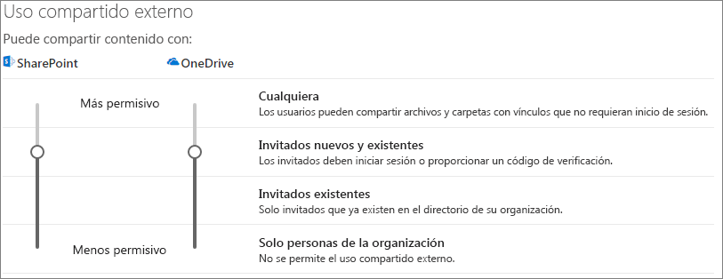
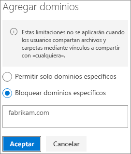

# Limitar la exposición accidental de archivos al compartirlos con usuarios externos a la organización

Al compartir archivos y carpetas con usuarios externos a la organización, hay una amplia variedad de opciones para reducir las posibilidades de compartir por error información confidencial. Puede elegir entre las opciones de este artículo para satisfacer las necesidades de su organización.

## Usar los procedimientos recomendados para los vínculos de tipo "Cualquiera"

Si los usuarios de su organización necesitan llevar a cabo un uso compartido sin autenticar, pero le preocupa que los usuarios sin autenticar modifiquen el contenido, lea los [Procedimientos recomendados para el uso compartido sin autenticar](best-practices-anonymous-sharing.md) para obtener instrucciones sobre cómo trabajar con el uso compartido sin autenticar en su organización.

## Desactivar vínculos de tipo Cualquiera

Se recomienda dejar habilitados los vínculos de tipo *Cualquiera* para el contenido adecuado, ya que es la manera más sencilla de compartir y puede ayudar a reducir el riesgo de que los usuarios soliciten otras soluciones que no están controladas por el departamento de TI. Los vínculos de tipo *Cualquiera* se pueden reenviar a otros usuarios, pero el acceso al archivo solo está disponible para los usuarios que tengan el vínculo.

Si quiere que los usuarios externos a la organización siempre tengan que autenticarse al obtener acceso al contenido de SharePoint, Grupos o Teams, puede desactivar el uso compartido de tipo *Cualquiera*. Esto impedirá que los usuarios compartan el contenido sin autenticar.

Si deshabilita los vínculos de tipo *Cualquiera*, los usuarios podrán seguir compartiendo con los invitados mediante los vínculos de *Personas específicas*. En este caso, todos los usuarios externos a la organización tendrán que autenticarse antes de poder tener acceso al contenido compartido.

En función de sus necesidades, puede deshabilitar los vínculos de tipo *Cualquiera* para sitios específicos o para toda la organización.

Para desactivar los vínculos de tipo *Cualquiera* de su organización, haga lo siguiente: 
1. En el Centro de administración de SharePoint, en el panel de navegación izquierdo, haga clic en **Uso compartido**.
2. Establezca la configuración de uso compartido externo de SharePoint como **Invitados nuevos y existentes**. 
   
3. Haga clic en **Guardar**.

Desactivar los vínculos de tipo *Cualquiera*
1. En el Centro de administración de SharePoint, en el panel de navegación izquierdo, expanda **Sitios** y haga clic en **Sitios activos**.
2. Seleccione el sitio para el equipo recién creado.
3. En la cinta de opciones, haga clic en **Uso compartido**.
4. Asegúrese de que el uso compartido está establecido como **Invitados nuevos y existentes**. 
   
5. Si ha realizado cambios, haga clic en **Guardar**.

## Filtrado de dominios

Puede usar las listas de dominios permitidos o rechazados para determinar los dominios que los usuarios pueden compartir con personas externas a la organización.

Con una lista de dominios permitidos, puede especificar una lista de dominios en los que los usuarios de su organización pueden compartir con usuarios externos a la organización. El uso compartido con otros dominios está bloqueado. Si su organización solo colabora con usuarios de una lista de dominios específicos, puede usar esta característica para evitar el uso compartido con otros dominios.

Con una lista de dominios rechazados, puede especificar una lista de dominios desde los que los usuarios de su organización no pueden compartir contenido con usuarios externos a la organización. El uso compartido con dominios en la lista está bloqueado. Esto puede resultar útil si tiene competidores que, por ejemplo, no quiere que tengan acceso al contenido de su organización.

Las listas de permitidos y rechazados solo afectan al uso compartido con invitados. Los usuarios aún podrán compartir con personas de dominios prohibidos mediante el uso de vínculos de tipo *Cualquiera* si no los ha deshabilitado. Para obtener los mejores resultados con las listas de dominios permitidos y de denegación, considere la posibilidad de deshabilitar los vínculos de tipo *Cualquiera* como se ha descrito anteriormente.

Para configurar una lista de dominios permitidos o rechazados para usuarios externos a la organización
1. En el centro de administración de SharePoint, en el panel de navegación izquierdo, haga clic en **Uso compartido**.
2. En **Configuración avanzada para uso compartido externo**, active la casilla **Limitar uso compartido externo por dominio**.
3. Haga clic en **Agregar dominios**.
4. Seleccione si quiere bloquear dominios, escriba los dominios y haga clic en **Aceptar**. 
   
5. Haga clic en **Guardar**.

Si quiere limitar el uso compartido de dominios en un nivel más alto que SharePoint y OneDrive, puede [permitir o bloquear las invitaciones a los usuarios B2B desde organizaciones específicas](https://docs.microsoft.com/azure/active-directory/b2b/allow-deny-list) de Azure Active Directory. (Debe configurar la [integración de SharePoint y OneDrive con la versión preliminar de B2B de Azure AD](https://docs.microsoft.com/sharepoint/sharepoint-azureb2b-integration-preview) para que estas opciones de configuración afecten a SharePoint y OneDrive).

## Limitar el uso compartido de archivos, carpetas y sitios con usuarios externos a la organización a grupos de seguridad específicos

Puede restringir el uso compartido de archivos, carpetas y sitios con usuarios externos a la organización a los miembros de un grupo de seguridad específico. Esto es útil si quiere habilitar el uso compartido externo, pero con un flujo de trabajo de aprobación o un proceso de solicitud.

Para limitar el uso compartido externo a los miembros de un grupo de seguridad
1. En el centro de administración de SharePoint, en el panel de navegación izquierdo, haga clic en **Uso compartido**.
2. En **Otras opciones de configuración**. Seleccione el vínculo **Limitar el uso compartido externo a grupos de seguridad específicos**.
3. En **Quién puede compartir elementos con usuarios ajenos a la organización**, seleccione una o ambas casillas: a. **Permitir que solo los usuarios de los grupos de seguridad seleccionados compartan con usuarios externos autenticados** para especificar un grupo de seguridad que pueda compartir con usuarios autenticados b. **Permitir que solo los usuarios de los grupos de seguridad seleccionados compartan con usuarios externos y con vínculos anónimos** para especificar un grupo de seguridad que pueda compartir con usuarios autenticados y con vínculos de tipo Cualquiera.
4. Haga clic en **Aceptar**.

Tenga en cuenta que esto afecta a archivos, carpetas y sitios, pero no a los grupos de Office 365 o Teams. Cuando los miembros inviten a invitados a un grupo privado de Office 365 o Microsoft Teams, la invitación se enviará al propietario del grupo o equipo para que la apruebe.

## Vea también

[Crear un entorno seguro de uso compartido para invitados](create-a-secure-guest-sharing-environment.md)

[Procedimientos recomendados para compartir archivos y carpetas con usuarios anónimos](best-practices-anonymous-sharing.md)