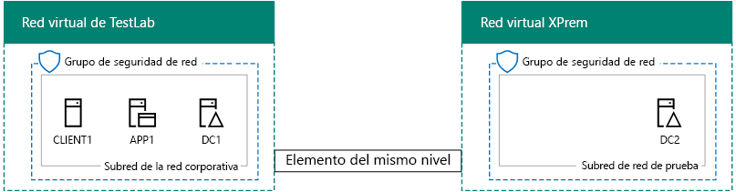
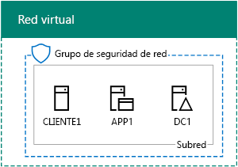
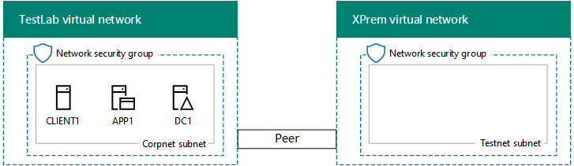

# <a name="simulated-cross-premises-virtual-network-in-azure"></a>Red virtual entre locales simulada en Azure

 **Resumen:** Crear una red virtual simulado entre locales en Microsoft Azure como un entorno de desarrollo o prueba.
  
En este artículo se le indicará el proceso de creación de un entorno de nube híbrida simulado con Microsoft Azure mediante dos redes virtuales de Azure. Esta es la configuración resultante.   
  

  
Esta configuración simula un entorno de producción de nube híbrida de Azure IaaS y consta de:
  
- 	Una red local simulada y simplificada alojada en una red virtual de Azure (la red virtual TestLab).
    
- 	Una red virtual entre locales simulada y alojada en Azure (XPrem).
    
- 	Una relación de emparejamiento de VNet entre las dos redes virtuales.
    
- 	Un controlador de dominio secundario en la red virtual XPrem.
    
Estos componentes constituyen la base a partir de la cual puede:  
  
- 	Desarrollar y probar las aplicaciones en un entorno simulado de nube de híbrida de IaaS de Azure.
    
- 	Crear configuraciones de prueba de los equipos, algunos dentro de la red virtual TestLab y otros dentro de la red virtual XPrem, para simular cargas de trabajo de TI basadas en nube híbrida.
    
Existen tres fases principales para configurar el entorno de desarrollo y pruebas:
  
1. 	Configurar la red virtual TestLab.
    
2. Crear la red virtual entre locales.
    
3. Configurar DC2.
    
> [!NOTE]
> Esta configuración requiere una suscripción de pago de Azure. 
  

  
> [!TIP]
> Haga clic [aquí](http://aka.ms/catlgstack) para un mapa visual a todos los artículos de la pila de una guía de laboratorio de prueba de nube de Microsoft.
  
## <a name="phase-1-configure-the-testlab-virtual-network"></a>Fase 1: Configurar la red virtual TestLab

Use las instrucciones en el [entorno de desarrollo y prueba de configuración básica](base-configuration-dev-test-environment.md) para configurar los equipos DC1, APP1 y CLIENT1 en la red virtual de Azure con nombre de laboratorio de pruebas.
  
Esta es su configuración actual. 
  

  
## <a name="phase-2-create-the-xprem-virtual-network"></a>Fase 2: Crear la red virtual XPrem

En esta fase, creará y configurará la nueva red virtual XPrem y la conectará a la red virtual TestLab mediante un emparejamiento de VNet.
  
En primer lugar, inicie un símbolo del sistema de Azure PowerShell en el equipo local.
  
> [!NOTE]
> Los siguientes conjuntos de comandos utilizan la última versión de Azure PowerShell. Visite [Get started with Azure PowerShell cmdlets (Introducción a los cmdlets de Azure)](https://docs.microsoft.com/en-us/powershell/azureps-cmdlets-docs/). 
  
Inicie sesión en su cuenta de Azure con el siguiente comando.
  
```
Login-AzureRMAccount
```

> [!TIP]
> Para obtener un archivo de texto que contenga todos los comandos de PowerShell de este artículo, haga clic [aquí](https://gallery.technet.microsoft.com/PowerShell-commands-for-7844edd0).
  
Obtenga su nombre de suscripción mediante el comando siguiente.
  
```
Get-AzureRMSubscription | Sort Name | Select Name
```

Establecer su suscripción de Azure. Reemplace todo el contenido de las comillas, incluido el \< y > caracteres, con los nombres correctos.
  
```
$subscrName="<subscription name>"
Get-AzureRmSubscription -SubscriptionName $subscrName | Select-AzureRmSubscription
```

A continuación, cree la red virtual XPrem y protéjala con un grupo de seguridad de red con estos comandos.
  
```
$rgName="<name of the resource group that you used for your TestLab virtual network>"
$locName=(Get-AzureRmResourceGroup -Name $rgName).Location
$Testnet=New-AzureRMVirtualNetworkSubnetConfig -Name "Testnet" -AddressPrefix 192.168.0.0/24
New-AzureRMVirtualNetwork -Name "XPrem" -ResourceGroupName $rgName -Location $locName -AddressPrefix 192.168.0.0/16 -Subnet $Testnet -DNSServer 10.0.0.4
$rule1=New-AzureRMNetworkSecurityRuleConfig -Name "RDPTraffic" -Description "Allow RDP to all VMs on the subnet" -Access Allow -Protocol Tcp -Direction Inbound -Priority 100 -SourceAddressPrefix Internet -SourcePortRange * -DestinationAddressPrefix * -DestinationPortRange 3389
New-AzureRMNetworkSecurityGroup -Name "Testnet" -ResourceGroupName $rgName -Location $locName -SecurityRules $rule1
$vnet=Get-AzureRMVirtualNetwork -ResourceGroupName $rgName -Name XPrem
$nsg=Get-AzureRMNetworkSecurityGroup -Name "Testnet" -ResourceGroupName $rgName
Set-AzureRMVirtualNetworkSubnetConfig -VirtualNetwork $vnet -Name "Testnet" -AddressPrefix 192.168.0.0/24 -NetworkSecurityGroup $nsg
```

Después, cree la relación de emparejamiento de VNet entre las redes virtuales TestLab y XPrem con estos comandos.
  
```
$rgName="<name of the resource group that you used for your TestLab virtual network>"
$vnet1=Get-AzureRmVirtualNetwork -ResourceGroupName $rgName -Name TestLab
$vnet2=Get-AzureRmVirtualNetwork -ResourceGroupName $rgName -Name XPrem
Add-AzureRmVirtualNetworkPeering -Name TestLab2XPrem -VirtualNetwork $vnet1 -RemoteVirtualNetworkId $vnet2.Id
Add-AzureRmVirtualNetworkPeering -Name XPrem2TestLab -VirtualNetwork $vnet2 -RemoteVirtualNetworkId $vnet1.Id
```

Esta es su configuración actual. 
  

  
## <a name="phase-3-configure-dc2"></a>Fase 3: Configurar DC2

En esta fase, creará la máquina virtual de DC2 en la red virtual XPrem y, a continuación, la configurará como un controlador de dominio de réplica.
  
En primer lugar, cree una máquina virtual para DC2. Ejecute estos comandos desde el símbolo del sistema de Azure PowerShell en su equipo local.
  
```
$rgName="<your resource group name>"
$locName=(Get-AzureRmResourceGroup -Name $rgName).Location
$vnet=Get-AzureRMVirtualNetwork -Name XPrem -ResourceGroupName $rgName
$pip=New-AzureRMPublicIpAddress -Name DC2-PIP -ResourceGroupName $rgName -Location $locName -AllocationMethod Dynamic
$nic=New-AzureRMNetworkInterface -Name DC2-NIC -ResourceGroupName $rgName -Location $locName -SubnetId $vnet.Subnets[0].Id -PublicIpAddressId $pip.Id -PrivateIpAddress 192.168.0.4
$vm=New-AzureRMVMConfig -VMName DC2 -VMSize Standard_A1
$cred=Get-Credential -Message "Type the name and password of the local administrator account for DC2."
$vm=Set-AzureRMVMOperatingSystem -VM $vm -Windows -ComputerName DC2 -Credential $cred -ProvisionVMAgent -EnableAutoUpdate
$vm=Set-AzureRMVMSourceImage -VM $vm -PublisherName MicrosoftWindowsServer -Offer WindowsServer -Skus 2016-Datacenter -Version "latest"
$vm=Add-AzureRMVMNetworkInterface -VM $vm -Id $nic.Id
$vm=Set-AzureRmVMOSDisk -VM $vm -Name "DC2-OS" -DiskSizeInGB 128 -CreateOption FromImage -StorageAccountType "StandardLRS"
$diskConfig=New-AzureRmDiskConfig -AccountType "StandardLRS" -Location $locName -CreateOption Empty -DiskSizeGB 20
$dataDisk1=New-AzureRmDisk -DiskName "DC2-DataDisk1" -Disk $diskConfig -ResourceGroupName $rgName
$vm=Add-AzureRmVMDataDisk -VM $vm -Name "DC2-DataDisk1" -CreateOption Attach -ManagedDiskId $dataDisk1.Id -Lun 1
New-AzureRMVM -ResourceGroupName $rgName -Location $locName -VM $vm
```

A continuación, conectarse a la nueva máquina virtual de DC2 desde el [portal de Azure](https://portal.azure.com) con su nombre de cuenta de administrador local y la contraseña.
  
Después, configure una regla de Firewall de Windows para permitir el tráfico durante la prueba de conectividad básica. Desde un símbolo del sistema de Windows PowerShell con el nivel de administrador en DC2, ejecute estos comandos:  
  
```
Set-NetFirewallRule -DisplayName "File and Printer Sharing (Echo Request - ICMPv4-In)" -enabled True
ping dc1.corp.contoso.com
```

El comando ping debería devolver cuatro respuestas correctas de la dirección IP 10.0.0.4. Esta prueba para comprobar el tráfico de la relación de emparejamiento de VNet.  
  
A continuación, agregue el disco de datos adicionales como un volumen nuevo con la letra de unidad F: con este comando desde el símbolo del sistema de Windows PowerShell en DC2.
  
```
Get-Disk | Where PartitionStyle -eq "RAW" | Initialize-Disk -PartitionStyle MBR -PassThru | New-Partition -AssignDriveLetter -UseMaximumSize | Format-Volume -FileSystem NTFS -NewFileSystemLabel "WSAD Data"
```

A continuación, configure DC2 como un controlador de dominio de réplica para el dominio corp.contoso.com. Ejecute estos comandos desde el símbolo del sistema de Windows PowerShell en DC2.
  
```
Install-WindowsFeature AD-Domain-Services -IncludeManagementTools
Install-ADDSDomainController -Credential (Get-Credential CORP\User1) -DomainName "corp.contoso.com" -InstallDns:$true -DatabasePath "F:\NTDS" -LogPath "F:\Logs" -SysvolPath "F:\SYSVOL"
```

Tenga en cuenta que se le pide que proporcione tanto el CORP\\User1 contraseña y una contraseña de modo de restauración de servicios de directorio (DSRM) y para reiniciar DC2. 
  
Una vez que la red virtual XPrem tenga su propio servidor DNS (DC2), deberá configurarla para que utilice este servidor DNS. Ejecute estos comandos desde el símbolo del sistema de Azure PowerShell en el equipo local.
  
```
$vnet=Get-AzureRmVirtualNetwork -ResourceGroupName $rgName -name "XPrem"
$vnet.DhcpOptions.DnsServers="192.168.0.4" 
Set-AzureRmVirtualNetwork -VirtualNetwork $vnet
Restart-AzureRmVM -ResourceGroupName $rgName -Name "DC2"
```

Desde el portal de Azure en el equipo local, conectar a DC1 con la CORP\\las credenciales de Usuario1. Para configurar el dominio corporativo para que los usuarios y equipos de usan su controlador de dominio local para la autenticación, ejecute estos comandos desde un símbolo de Windows PowerShell de nivel de administrador en DC1.
  
```
New-ADReplicationSite -Name "TestLab" 
New-ADReplicationSite -Name "XPrem"
New-ADReplicationSubnet -Name "10.0.0.0/8" -Site "TestLab"
New-ADReplicationSubnet -Name "192.168.0.0/16" -Site "XPrem"
```

Esta es su configuración actual. 
  

  
Ya puede probar el entorno simulado de nube híbrida de Azure.
  
## <a name="next-step"></a>Paso siguiente

Use este entorno de desarrollo y prueba para simular una [granja de servidores de intranet de SharePoint Server 2016 hospedado en Azure](https://technet.microsoft.com/library/mt806351%28v=office.16%29.aspx).
  
## <a name="see-also"></a>Consulte también

[Entorno de desarrollo y pruebas de la configuración básica](base-configuration-dev-test-environment.md)
  
[Entorno de desarrollo y pruebas de Office 365](office-365-dev-test-environment.md)
  
[Sincronización de directorios (DirSync) para el entorno de desarrollo y pruebas de Office 365](dirsync-for-your-office-365-dev-test-environment.md)
  
[Seguridad de la aplicación en la nube para el entorno de desarrollo y prueba de Office 365](cloud-app-security-for-your-office-365-dev-test-environment.md)
  
[Una protección avanzada para el entorno de desarrollo y prueba de Office 365](advanced-threat-protection-for-your-office-365-dev-test-environment.md)
  
[Adopción de la nube y soluciones híbridas](cloud-adoption-and-hybrid-solutions.md)


