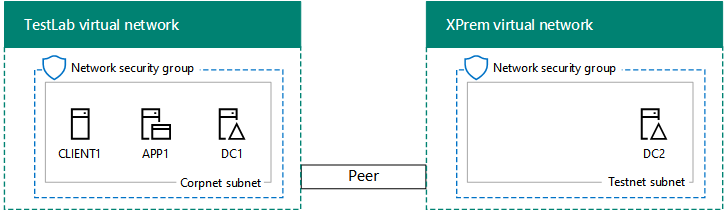

# <a name="simulated-cross-premises-virtual-network-in-azure"></a><span data-ttu-id="e86bb-103">Red virtual entre locales simulada en Azure</span><span class="sxs-lookup"><span data-stu-id="e86bb-103">Simulated cross-premises virtual network in Azure</span></span>

 <span data-ttu-id="e86bb-104">**Resumen:** Crear una red virtual simulado entre locales en Microsoft Azure como un entorno de pruebas y desarrollo.</span><span class="sxs-lookup"><span data-stu-id="e86bb-104">**Summary:** Create a simulated cross-premises virtual network in Microsoft Azure as a dev/test environment.</span></span>
  
<span data-ttu-id="e86bb-p101">En este artículo se le indicará el proceso de creación de un entorno de nube híbrida simulado con Microsoft Azure mediante dos redes virtuales de Azure. Esta es la configuración resultante.  </span><span class="sxs-lookup"><span data-stu-id="e86bb-p101">This article steps you through creating a simulated hybrid cloud environment with Microsoft Azure using two Azure virtual networks. Here is the resulting configuration.</span></span> 
  

  
<span data-ttu-id="e86bb-108">Esta configuración simula un entorno de producción de nube híbrida de Azure IaaS y consta de:</span><span class="sxs-lookup"><span data-stu-id="e86bb-108">This simulates an Azure IaaS hybrid cloud production environment and consists of:</span></span>
  
- <span data-ttu-id="e86bb-109">	Una red local simulada y simplificada alojada en una red virtual de Azure (la red virtual TestLab).</span><span class="sxs-lookup"><span data-stu-id="e86bb-109">A simulated and simplified on-premises network hosted in an Azure virtual network (the TestLab virtual network).</span></span>
    
- <span data-ttu-id="e86bb-110">	Una red virtual entre locales simulada y alojada en Azure (XPrem).</span><span class="sxs-lookup"><span data-stu-id="e86bb-110">A simulated cross-premises virtual network hosted in Azure (XPrem).</span></span>
    
- <span data-ttu-id="e86bb-111">	Una relación de emparejamiento de VNet entre las dos redes virtuales.</span><span class="sxs-lookup"><span data-stu-id="e86bb-111">A VNet peering relationship between the two virtual networks.</span></span>
    
- <span data-ttu-id="e86bb-112">	Un controlador de dominio secundario en la red virtual XPrem.</span><span class="sxs-lookup"><span data-stu-id="e86bb-112">A secondary domain controller in the XPrem virtual network.</span></span>
    
<span data-ttu-id="e86bb-113">Estos componentes constituyen la base a partir de la cual puede: </span><span class="sxs-lookup"><span data-stu-id="e86bb-113">This provides a basis and common starting point from which you can:</span></span> 
  
- <span data-ttu-id="e86bb-114">	Desarrollar y probar las aplicaciones en un entorno simulado de nube de híbrida de IaaS de Azure.</span><span class="sxs-lookup"><span data-stu-id="e86bb-114">Develop and test applications in a simulated Azure IaaS hybrid cloud environment.</span></span>
    
- <span data-ttu-id="e86bb-115">	Crear configuraciones de prueba de los equipos, algunos dentro de la red virtual TestLab y otros dentro de la red virtual XPrem, para simular cargas de trabajo de TI basadas en nube híbrida.</span><span class="sxs-lookup"><span data-stu-id="e86bb-115">Create test configurations of computers, some within the TestLab virtual network and some within the XPrem virtual network, to simulate hybrid cloud-based IT workloads.</span></span>
    
<span data-ttu-id="e86bb-116">Existen tres fases principales para configurar el entorno de desarrollo y pruebas:</span><span class="sxs-lookup"><span data-stu-id="e86bb-116">There are three major phases to setting up this dev/test environment:</span></span>
  
1. <span data-ttu-id="e86bb-117">	Configurar la red virtual TestLab.</span><span class="sxs-lookup"><span data-stu-id="e86bb-117">Configure the TestLab virtual network.</span></span>
    
2. <span data-ttu-id="e86bb-118">Crear la red virtual entre locales.</span><span class="sxs-lookup"><span data-stu-id="e86bb-118">Create the cross-premises virtual network.</span></span>
    
3. <span data-ttu-id="e86bb-119">Configurar DC2.</span><span class="sxs-lookup"><span data-stu-id="e86bb-119">Configure DC2.</span></span>
    
> [!NOTE]
> <span data-ttu-id="e86bb-120">Esta configuración requiere una suscripción de pago de Azure.</span><span class="sxs-lookup"><span data-stu-id="e86bb-120">This configuration requires a paid Azure subscription.</span></span> 
  

  
> [!TIP]
> <span data-ttu-id="e86bb-122">Haga clic [aquí](http://aka.ms/catlgstack) para ver un mapa visual para todos los artículos de la pila de una guía de laboratorio de prueba de nube de Microsoft.</span><span class="sxs-lookup"><span data-stu-id="e86bb-122">Click [here](http://aka.ms/catlgstack) for a visual map to all the articles in the One Microsoft Cloud Test Lab Guide stack.</span></span>
  
## <a name="phase-1-configure-the-testlab-virtual-network"></a><span data-ttu-id="e86bb-123">Fase 1: Configurar la red virtual TestLab</span><span class="sxs-lookup"><span data-stu-id="e86bb-123">Phase 1: Configure the TestLab virtual network</span></span>

<span data-ttu-id="e86bb-124">Utilice las instrucciones en el [entorno de desarrollo y prueba de configuración de Base](base-configuration-dev-test-environment.md) para configurar los equipos de DC1, APP1 y CLIENTE1 de la red virtual Azure denominada práctica de prueba.</span><span class="sxs-lookup"><span data-stu-id="e86bb-124">Use the instructions in [Base Configuration dev/test environment](base-configuration-dev-test-environment.md) to configure the DC1, APP1, and CLIENT1 computers in the Azure virtual network named TestLab.</span></span>
  
<span data-ttu-id="e86bb-125">Esta es su configuración actual.</span><span class="sxs-lookup"><span data-stu-id="e86bb-125">This is your current configuration.</span></span> 
  

  
## <a name="phase-2-create-the-xprem-virtual-network"></a><span data-ttu-id="e86bb-127">Fase 2: Crear la red virtual XPrem</span><span class="sxs-lookup"><span data-stu-id="e86bb-127">Phase 2: Create the XPrem virtual network</span></span>

<span data-ttu-id="e86bb-128">En esta fase, creará y configurará la nueva red virtual XPrem y la conectará a la red virtual TestLab mediante un emparejamiento de VNet.</span><span class="sxs-lookup"><span data-stu-id="e86bb-128">In this phase, you create and configure the new XPrem virtual network and then connect it to the TestLab virtual network with VNet peering.</span></span>
  
<span data-ttu-id="e86bb-129">En primer lugar, inicie un símbolo del sistema de Azure PowerShell en el equipo local.</span><span class="sxs-lookup"><span data-stu-id="e86bb-129">First, start an Azure PowerShell prompt on your local computer.</span></span>
  
> [!NOTE]
> <span data-ttu-id="e86bb-p102">Los siguientes conjuntos de comandos utilice la última versión de PowerShell de Azure. Consulte [Introducción a los cmdlets de PowerShell de Azure](https://docs.microsoft.com/en-us/powershell/azureps-cmdlets-docs/).</span><span class="sxs-lookup"><span data-stu-id="e86bb-p102">The following command sets use the latest version of Azure PowerShell. See [Get started with Azure PowerShell cmdlets](https://docs.microsoft.com/en-us/powershell/azureps-cmdlets-docs/).</span></span> 
  
<span data-ttu-id="e86bb-132">Inicie sesión en su cuenta de Azure con el siguiente comando.</span><span class="sxs-lookup"><span data-stu-id="e86bb-132">Sign in to your Azure account with the following command.</span></span>
  
```
Login-AzureRMAccount
```

> [!TIP]
> <span data-ttu-id="e86bb-133">Haga clic [aquí](https://gallery.technet.microsoft.com/PowerShell-commands-for-7844edd0) para obtener un archivo de texto que contiene todos los comandos de PowerShell en este artículo.</span><span class="sxs-lookup"><span data-stu-id="e86bb-133">Click [here](https://gallery.technet.microsoft.com/PowerShell-commands-for-7844edd0) to get a text file that contains all of the PowerShell commands in this article.</span></span>
  
<span data-ttu-id="e86bb-134">Obtenga su nombre de suscripción mediante el comando siguiente.</span><span class="sxs-lookup"><span data-stu-id="e86bb-134">Get your subscription name using the following command.</span></span>
  
```
Get-AzureRMSubscription | Sort Name | Select Name
```

<span data-ttu-id="e86bb-p103">Establecer su suscripción de Azure. Reemplace todo el contenido de las ofertas, incluyendo el \< y > caracteres, con los nombres correctos.</span><span class="sxs-lookup"><span data-stu-id="e86bb-p103">Set your Azure subscription. Replace everything within the quotes, including the \< and > characters, with the correct names.</span></span>
  
```
$subscrName="<subscription name>"
Get-AzureRmSubscription -SubscriptionName $subscrName | Select-AzureRmSubscription
```

<span data-ttu-id="e86bb-137">A continuación, cree la red virtual XPrem y protéjala con un grupo de seguridad de red con estos comandos.</span><span class="sxs-lookup"><span data-stu-id="e86bb-137">Next, create the XPrem virtual network and protect it with a network security group with these commands.</span></span>
  
```
$rgName="<name of the resource group that you used for your TestLab virtual network>"
$locName=(Get-AzureRmResourceGroup -Name $rgName).Location
$Testnet=New-AzureRMVirtualNetworkSubnetConfig -Name "Testnet" -AddressPrefix 192.168.0.0/24
New-AzureRMVirtualNetwork -Name "XPrem" -ResourceGroupName $rgName -Location $locName -AddressPrefix 192.168.0.0/16 -Subnet $Testnet -DNSServer 10.0.0.4
$rule1=New-AzureRMNetworkSecurityRuleConfig -Name "RDPTraffic" -Description "Allow RDP to all VMs on the subnet" -Access Allow -Protocol Tcp -Direction Inbound -Priority 100 -SourceAddressPrefix Internet -SourcePortRange * -DestinationAddressPrefix * -DestinationPortRange 3389
New-AzureRMNetworkSecurityGroup -Name "Testnet" -ResourceGroupName $rgName -Location $locName -SecurityRules $rule1
$vnet=Get-AzureRMVirtualNetwork -ResourceGroupName $rgName -Name XPrem
$nsg=Get-AzureRMNetworkSecurityGroup -Name "Testnet" -ResourceGroupName $rgName
Set-AzureRMVirtualNetworkSubnetConfig -VirtualNetwork $vnet -Name "Testnet" -AddressPrefix 192.168.0.0/24 -NetworkSecurityGroup $nsg
```

<span data-ttu-id="e86bb-138">Después, cree la relación de emparejamiento de VNet entre las redes virtuales TestLab y XPrem con estos comandos.</span><span class="sxs-lookup"><span data-stu-id="e86bb-138">Next, you create the VNet peering relationship between the TestLab and XPrem VNets with these commands.</span></span>
  
```
$rgName="<name of the resource group that you used for your TestLab virtual network>"
$vnet1=Get-AzureRmVirtualNetwork -ResourceGroupName $rgName -Name TestLab
$vnet2=Get-AzureRmVirtualNetwork -ResourceGroupName $rgName -Name XPrem
Add-AzureRmVirtualNetworkPeering -Name TestLab2XPrem -VirtualNetwork $vnet1 -RemoteVirtualNetworkId $vnet2.Id
Add-AzureRmVirtualNetworkPeering -Name XPrem2TestLab -VirtualNetwork $vnet2 -RemoteVirtualNetworkId $vnet1.Id
```

<span data-ttu-id="e86bb-139">Esta es su configuración actual.</span><span class="sxs-lookup"><span data-stu-id="e86bb-139">This is your current configuration.</span></span> 
  

  
## <a name="phase-3-configure-dc2"></a><span data-ttu-id="e86bb-141">Fase 3: Configurar DC2</span><span class="sxs-lookup"><span data-stu-id="e86bb-141">Phase 3: Configure DC2</span></span>

<span data-ttu-id="e86bb-142">En esta fase, creará la máquina virtual de DC2 en la red virtual XPrem y, a continuación, la configurará como un controlador de dominio de réplica.</span><span class="sxs-lookup"><span data-stu-id="e86bb-142">In this phase, you create the DC2 virtual machine in the XPrem virtual network and then configure it as a replica domain controller.</span></span>
  
<span data-ttu-id="e86bb-p104">En primer lugar, cree una máquina virtual para DC2. Ejecute estos comandos desde el símbolo del sistema de Azure PowerShell en su equipo local.</span><span class="sxs-lookup"><span data-stu-id="e86bb-p104">First, create a virtual machine for DC2. Run these commands at the Azure PowerShell command prompt on your local computer.</span></span>
  
```
$rgName="<your resource group name>"
$locName=(Get-AzureRmResourceGroup -Name $rgName).Location
$vnet=Get-AzureRMVirtualNetwork -Name XPrem -ResourceGroupName $rgName
$pip=New-AzureRMPublicIpAddress -Name DC2-PIP -ResourceGroupName $rgName -Location $locName -AllocationMethod Dynamic
$nic=New-AzureRMNetworkInterface -Name DC2-NIC -ResourceGroupName $rgName -Location $locName -SubnetId $vnet.Subnets[0].Id -PublicIpAddressId $pip.Id -PrivateIpAddress 192.168.0.4
$vm=New-AzureRMVMConfig -VMName DC2 -VMSize Standard_A1
$cred=Get-Credential -Message "Type the name and password of the local administrator account for DC2."
$vm=Set-AzureRMVMOperatingSystem -VM $vm -Windows -ComputerName DC2 -Credential $cred -ProvisionVMAgent -EnableAutoUpdate
$vm=Set-AzureRMVMSourceImage -VM $vm -PublisherName MicrosoftWindowsServer -Offer WindowsServer -Skus 2016-Datacenter -Version "latest"
$vm=Add-AzureRMVMNetworkInterface -VM $vm -Id $nic.Id
$vm=Set-AzureRmVMOSDisk -VM $vm -Name "DC2-OS" -DiskSizeInGB 128 -CreateOption FromImage -StorageAccountType "StandardLRS"
$diskConfig=New-AzureRmDiskConfig -AccountType "StandardLRS" -Location $locName -CreateOption Empty -DiskSizeGB 20
$dataDisk1=New-AzureRmDisk -DiskName "DC2-DataDisk1" -Disk $diskConfig -ResourceGroupName $rgName
$vm=Add-AzureRmVMDataDisk -VM $vm -Name "DC2-DataDisk1" -CreateOption Attach -ManagedDiskId $dataDisk1.Id -Lun 1
New-AzureRMVM -ResourceGroupName $rgName -Location $locName -VM $vm
```

<span data-ttu-id="e86bb-145">A continuación, conectarse a la nueva máquina virtual de DC2 desde el [portal de Azure](https://portal.azure.com) utilizando su nombre de cuenta de administrador local y la contraseña.</span><span class="sxs-lookup"><span data-stu-id="e86bb-145">Next, connect to the new DC2 virtual machine from the [Azure portal](https://portal.azure.com) using its local administrator account name and password.</span></span>
  
<span data-ttu-id="e86bb-p105">Después, configure una regla de Firewall de Windows para permitir el tráfico durante la prueba de conectividad básica. Desde un símbolo del sistema de Windows PowerShell con el nivel de administrador en DC2, ejecute estos comandos: </span><span class="sxs-lookup"><span data-stu-id="e86bb-p105">Next, configure a Windows Firewall rule to allow traffic for basic connectivity testing. From an administrator-level Windows PowerShell command prompt on DC2, run these commands.</span></span> 
  
```
Set-NetFirewallRule -DisplayName "File and Printer Sharing (Echo Request - ICMPv4-In)" -enabled True
ping dc1.corp.contoso.com
```

<span data-ttu-id="e86bb-p106">El comando ping debería devolver cuatro respuestas correctas de la dirección IP 10.0.0.4. Esta prueba para comprobar el tráfico de la relación de emparejamiento de VNet. </span><span class="sxs-lookup"><span data-stu-id="e86bb-p106">The ping command should result in four successful replies from IP address 10.0.0.4. This is a test of traffic across the VNet peering relationship.</span></span> 
  
<span data-ttu-id="e86bb-150">A continuación, agregar el disco de datos adicionales como un nuevo volumen con la letra de unidad F: con este comando desde el símbolo del sistema de Windows PowerShell en DC2.</span><span class="sxs-lookup"><span data-stu-id="e86bb-150">Next, add the extra data disk as a new volume with the drive letter F: with this command from the Windows PowerShell command prompt on DC2.</span></span>
  
```
Get-Disk | Where PartitionStyle -eq "RAW" | Initialize-Disk -PartitionStyle MBR -PassThru | New-Partition -AssignDriveLetter -UseMaximumSize | Format-Volume -FileSystem NTFS -NewFileSystemLabel "WSAD Data"
```

<span data-ttu-id="e86bb-p107">A continuación, configure DC2 como un controlador de dominio de réplica para el dominio corp.contoso.com. Ejecute estos comandos desde el símbolo del sistema de Windows PowerShell en DC2.</span><span class="sxs-lookup"><span data-stu-id="e86bb-p107">Next, configure DC2 as a replica domain controller for the corp.contoso.com domain. Run these commands from the Windows PowerShell command prompt on DC2.</span></span>
  
```
Install-WindowsFeature AD-Domain-Services -IncludeManagementTools
Install-ADDSDomainController -Credential (Get-Credential CORP\\User1) -DomainName "corp.contoso.com" -InstallDns:$true -DatabasePath "F:\\NTDS" -LogPath "F:\\Logs" -SysvolPath "F:\\SYSVOL"
```

<span data-ttu-id="e86bb-153">Tenga en cuenta que deberá proporcionar tanto la CORP\\Usuario1 contraseña y una contraseña de modo de restauración de servicios de directorio (DSRM) y reinicie DC2.</span><span class="sxs-lookup"><span data-stu-id="e86bb-153">Note that you are prompted to supply both the CORP\\User1 password and a Directory Services Restore Mode (DSRM) password, and to restart DC2.</span></span> 
  
<span data-ttu-id="e86bb-p108">Una vez que la red virtual XPrem tenga su propio servidor DNS (DC2), deberá configurarla para que utilice este servidor DNS. Ejecute estos comandos desde el símbolo del sistema de Azure PowerShell en el equipo local.</span><span class="sxs-lookup"><span data-stu-id="e86bb-p108">Now that the XPrem virtual network has its own DNS server (DC2), you must configure the XPrem virtual network to use this DNS server. Run these commands from the Azure PowerShell command prompt on your local computer.</span></span>
  
```
$vnet=Get-AzureRmVirtualNetwork -ResourceGroupName $rgName -name "XPrem"
$vnet.DhcpOptions.DnsServers="192.168.0.4" 
Set-AzureRmVirtualNetwork -VirtualNetwork $vnet
Restart-AzureRmVM -ResourceGroupName $rgName -Name "DC2"
```

<span data-ttu-id="e86bb-p109">Desde el portal de Azure en el equipo local, se conecta a DC1 con el CORP\\credenciales de Usuario1. Para configurar el dominio CORP para que usuarios y equipos de utilizan el controlador de dominio local para la autenticación, ejecutar estos comandos desde un símbolo de Windows PowerShell de nivel de administrador en DC1.</span><span class="sxs-lookup"><span data-stu-id="e86bb-p109">From the Azure portal on your local computer, connect to DC1 with the CORP\\User1 credentials. To configure the CORP domain so that computers and users use their local domain controller for authentication, run these commands from an administrator-level Windows PowerShell command prompt on DC1.</span></span>
  
```
New-ADReplicationSite -Name "TestLab" 
New-ADReplicationSite -Name "XPrem"
New-ADReplicationSubnet -Name "10.0.0.0/8" -Site "TestLab"
New-ADReplicationSubnet -Name "192.168.0.0/16" -Site "XPrem"
```

<span data-ttu-id="e86bb-158">Esta es su configuración actual.</span><span class="sxs-lookup"><span data-stu-id="e86bb-158">This is your current configuration.</span></span> 
  

  
<span data-ttu-id="e86bb-160">Ya puede probar el entorno simulado de nube híbrida de Azure.</span><span class="sxs-lookup"><span data-stu-id="e86bb-160">Your simulated Azure hybrid cloud environment is now ready for testing.</span></span>
  
## <a name="next-step"></a><span data-ttu-id="e86bb-161">Paso siguiente</span><span class="sxs-lookup"><span data-stu-id="e86bb-161">Next step</span></span>

<span data-ttu-id="e86bb-162">Utilice este entorno de prueba/desarrollo para simular una [granja de SharePoint Server 2016 intranet alojado en Azure](https://technet.microsoft.com/library/mt806351%28v=office.16%29.aspx).</span><span class="sxs-lookup"><span data-stu-id="e86bb-162">Use this dev/test environment to simulate a [SharePoint Server 2016 intranet farm hosted in Azure](https://technet.microsoft.com/library/mt806351%28v=office.16%29.aspx).</span></span>
  
## <a name="see-also"></a><span data-ttu-id="e86bb-163">Consulte también</span><span class="sxs-lookup"><span data-stu-id="e86bb-163">See Also</span></span>

[<span data-ttu-id="e86bb-164">Entorno de desarrollo y pruebas de la configuración básica</span><span class="sxs-lookup"><span data-stu-id="e86bb-164">Base Configuration dev/test environment</span></span>](base-configuration-dev-test-environment.md)
  
[<span data-ttu-id="e86bb-165">Entorno de desarrollo y pruebas de Office 365</span><span class="sxs-lookup"><span data-stu-id="e86bb-165">Office 365 dev/test environment</span></span>](office-365-dev-test-environment.md)
  
[<span data-ttu-id="e86bb-166">Sincronización de directorios (DirSync) para el entorno de desarrollo y pruebas de Office 365</span><span class="sxs-lookup"><span data-stu-id="e86bb-166">DirSync for your Office 365 dev/test environment</span></span>](dirsync-for-your-office-365-dev-test-environment.md)
  
[<span data-ttu-id="e86bb-167">Seguridad de la aplicación de nube para su entorno de pruebas y desarrollo de Office 365</span><span class="sxs-lookup"><span data-stu-id="e86bb-167">Cloud App Security for your Office 365 dev/test environment</span></span>](cloud-app-security-for-your-office-365-dev-test-environment.md)
  
[<span data-ttu-id="e86bb-168">Una protección avanzada para su entorno de pruebas y desarrollo de Office 365</span><span class="sxs-lookup"><span data-stu-id="e86bb-168">Advanced Threat Protection for your Office 365 dev/test environment</span></span>](advanced-threat-protection-for-your-office-365-dev-test-environment.md)
  
[<span data-ttu-id="e86bb-169">Adopción de la nube y soluciones híbridas</span><span class="sxs-lookup"><span data-stu-id="e86bb-169">Cloud adoption and hybrid solutions</span></span>](cloud-adoption-and-hybrid-solutions.md)


