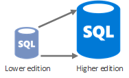
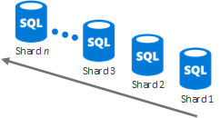
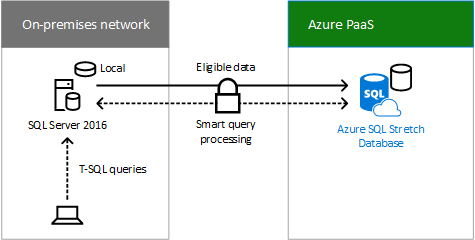
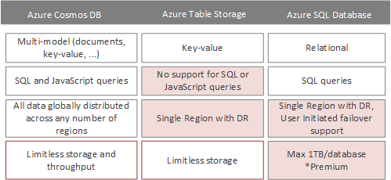

# Algunos ensamblados necesarios

 **Resumen:** Obtenga los detalles en el conjunto de la nube de opciones de almacenamiento de información que puede utilizar para crear una solución de almacenamiento de información personalizada.
  
"Algunos ensamblado necesario" soluciones de almacenamiento de información:
  
- Utilizar los servicios existentes como punto de partida para la solución de almacenamiento de información.
    
- Requieren una configuración o codificación.
    
- Puede personalizarse para que se adapte a sus necesidades.
    
Las secciones siguientes describen los detalles de cada solución de almacenamiento de información "Algún ensamblado necesario".
  
## Red de entrega de contenido de Azure

### Características

- Analítica avanzada y en tiempo real
    
- Seguridad sólida contra DDoS
    
- Obtiene contenido automáticamente desde un sitio Web de Azure o el servicio de nube Azure una vez configurada la integración
    
- Nueva asociación con Akamai
    
- Puede controlar los picos repentinos de tráfico y cargas pesadas
    
### Usos comunes

- Distribuir audio, vídeo, aplicaciones, imágenes y otros archivos más rápido y más confiable a los clientes con los servidores más cercanos a ellos
    
### Escenarios de almacenamiento de claves

- Administrar datos
    
- Gestión de vídeo
    
### Recursos

Para obtener información adicional, haga clic en [aquí](https://azure.microsoft.com/services/cdn/).
  
Para obtener información de costo, haga clic en [aquí](https://azure.microsoft.com/pricing/details/cdn/).
  
## HdInsight

### Características

- Distribución de Apache Hadoop impulsado por el servicio A datos lago de nube
    
- Escala hasta petabytes a petición
    
- Procesar datos no estructurados y semiestructurados desarrollar en Java,. NET etc.
    
- Omitir la compra y mantenimiento de hardware
    
- Conectarse a clústeres de Hadoop locales con la nube
    
- Flexibilidad para implementar proyectos arbitrarios de Hadoop a través de secuencias de comandos personalizadas (por ejemplo, R, Giraph, Solr)
    
### Usos comunes

- Cargas de trabajo de análisis de datos
    
- Marco de trabajo de procesamiento de datos en memoria para datos grandes (chispa)
    
- Procesamiento de flujo en tiempo real (tormenta)
    
- Gran procesamiento transaccional (OLTP) de datos no relacionales (HBase)
    
### Escenarios de almacenamiento de claves

- Administrar datos
    
### Recursos

Para obtener información adicional, haga clic en [aquí](https://azure.microsoft.com/services/hdinsight/).
  
Para obtener información de costo, haga clic en [aquí](https://azure.microsoft.com/pricing/details/hdinsight/).
  
## Base de datos SQL de Azure

### Características

- Optimizado para reducir los costos de administración y
    
- Actualización, recuperación ante desastres y alta disponibilidad automática
    
- Recomendado para organizaciones administrar cientos o miles de bases de datos de hasta 1 TB
    
- Técnicas de sharding pueden dividir los datos entre bases de datos para un mayor almacenamiento
    
- Expandir la base de datos con SQL Server 2016
    
### Usos comunes

- Nuevas aplicaciones diseñadas a la nube con datos relacionales
    
- Procesamiento de datos sobre los conjuntos de datos esquemáticos, altamente estructurados con relaciones
    
- Datos espaciales o tipos de datos enriquecidos
    
### Escenarios de almacenamiento de claves

- Administrar datos
    
### Base de datos elástica

Uso de los recursos de SQL Azure prácticamente ilimitados de base de datos cuando:
  
- La cantidad total de datos es demasiado grande para ajustarse dentro de los límites de una sola base de datos.
    
- El rendimiento de las transacciones de la carga de trabajo total supera las capacidades de una base de datos.
    
- Los inquilinos requieren aislamiento físico entre sí, por lo que se necesitan bases de datos independientes para cada cliente.
    
- Diferentes secciones de una base de datos deben residir en distintas geografías para cumplimiento de normas, performance o motivos geopolíticos.
    
Con la escala vertical, puede cambiar la edición por rendimiento de nivel de base de datos de Azure o mediante grupos de elásticos de la base de datos.
  

  
Con la escala horizontal, puede agregar nuevas bases de datos según sea necesario.
  

  
Haga clic [aquí](https://docs.microsoft.com/azure/sql-database/sql-database-elastic-scale-introduction) para obtener más información.
  
### Stretch Database con SQL Server 2016

Base de datos extendido es una característica de 2016 de SQL Server que permite transparente y segura mover datos inactivos, como los datos de negocios cerrados en una tabla grande que contiene información de pedidos, a una base de datos SQL Stretch en Azure. Cuando se expande, el contenido de una instancia de SQL Server, una base de datos o incluso una sola tabla es la combinación de datos locales en el servidor SQL Server 2016 y datos remotos en Azure. Datos que es susceptible de ampliación se mueven automáticamente a Azure 2016 de SQL Server.
  

  
Las consultas del usuario que incluyen los datos históricos se reenvían de manera transparente a Azure SQL Stretch Database. No es necesario que las consultas se vuelvan a escribir, aunque se extienda la tabla.
  
Stretch Database proporciona una opción rentable para el almacenamiento a largo plazo y el acceso transparente a los datos históricos. También soluciona problemas de rendimiento y disponibilidad que surgen cuando las tablas son muy grandes.
  
Haga clic [aquí](https://msdn.microsoft.com/library/dn935011.aspx) para obtener más información.
  
### Recursos

Para obtener información adicional, haga clic en [aquí](http://azure.microsoft.com/services/sql-database/).
  
Para obtener información de costo, haga clic en [aquí](http://azure.microsoft.com/pricing/details/sql-database/).
  
## Azure Cosmos DB

### Características

- Garantizada de baja latencia, SLA de disponibilidad del 99,99% con escala ilimitada, elástico de almacenamiento y rendimiento
    
- Todos los datos se replican globalmente a través de cualquier número de regiones con un failover transparente y cuatro niveles de coherencia bien definido
    
- Indizará automáticamente todos los datos sin necesidad de esquemas o índices secundarios
    
- Transacciones de artículos múltiples y consultas SQL Rich y JavaScript
    
### Usos comunes

- IoT, Mobile y Social
    
- Juegos
    
- Comercial
    
- Administración de contenido
    
### Escenarios de almacenamiento de claves

- Administrar datos
    
### Base de datos SQL de COSMOS DB en comparación con Azure tablas en comparación con Azure

Atributos comunes de Cosmos DB, el almacenamiento de Azure tabla y base de datos de SQL Azure:
  
- SLA de disponibilidad 99,99
    
- Servicios de base de datos totalmente gestionado
    
- ISO 27001, HIPAA y modelo de la Unión Europea las cláusulas compatibles con
    
En la tabla siguiente muestra los atributos de base de datos de SQL Azure, tabla de almacenamiento de Azure y Azure Cosmos DB infrecuentes.
  

  
### Recursos

Para obtener información adicional, haga clic en [aquí](http://azure.microsoft.com/services/documentdb/).
  
Para obtener información de costo, haga clic en [aquí](http://azure.microsoft.com/pricing/details/documentdb/).
  
## Servicios de Azure Media

### Características

- Directo y vídeo en entrega de demanda (VOD) con escala
    
- Alta disponibilidad de codificación y transmisión por secuencias
    
- Es compatible con Flash, iOS, Android, HTML5 y Xbox
    
- Soporte DRM certificado Studio
    
- Monetización de contenido enriquecido
    
- Amplio ecosistema de socios previamente integrados
    
### Usos comunes

- Codificar, almacenar y transmitir audio y vídeo a escala
    
- Transmisión por secuencias en tiempo real y VOD
    
- Administración de contenido de vídeo optimizada
    
### Escenarios de almacenamiento de claves

- Gestión de vídeo
    
### Recursos

Para obtener información adicional, haga clic en [aquí](https://azure.microsoft.com/services/media-services/).
  
Para obtener información de costo, haga clic en [aquí](http://azure.microsoft.com/pricing/details/media-services/).
  
## Caché de Azure Redis

### Características

- Segura y dedicada Redis server con alta disponibilidad con replicación y failover administrada por Microsoft
    
- Recomendado para cualquier necesidad de alto rendimiento de la aplicación
    
- Disponible en tamaños de hasta 530 GB y más allá (con Premium y sharding automática)
    
- Persistencia de Redis persiste en la memoria caché de datos en el almacenamiento de Azure
    
- Redis Clustering permite lograr el rendimiento y la escala máxima
    
- Aislamiento de red y seguridad mejorada con compatibilidad para red Virtual de Azure
    
### Usos comunes

- Búsqueda inversa de datos en cualquier servicio de almacenamiento de Azure, como Cosmos DB y base de datos de SQL Azure
    
- Contenido sincronizado desde otros almacenes de datos
    
### Escenarios de almacenamiento de claves

- Datos de la caché
    
- Broker de mensajes para aplicaciones de alto rendimiento
    
### Recursos

Para obtener información adicional, haga clic en [aquí](http://azure.microsoft.com/services/cache/).
  
Para obtener información de costo, haga clic en [aquí](http://azure.microsoft.com/pricing/details/cache/).
  
## SQL Server en una máquina virtual de Azure

### Características

- De SQL Server que se ejecuta como una aplicación instalada en una máquina virtual Windows Azure
    
- Usar una imagen de la galería con SQL Server instalado o Traer su propia licencia de SQL Server
    
### Usos comunes

- Administrar datos de aplicaciones
    
### Escenarios de almacenamiento de claves

- Administrar datos
    
### Recursos

Para obtener información adicional, haga clic en [aquí](http://azure.microsoft.com/services/virtual-machines/).
  
Para obtener información de costo, haga clic en [aquí](http://azure.microsoft.com/pricing/details/virtual-machines/).
  
## StorSimple

### Características

- Híbrido de empresa escalable, almacenamiento de información SAN con SSD y el disco duro en la matriz de almacenamiento en instalaciones híbridas, con almacenamiento en la nube como una extensión integrada de la solución
    
- Desduplicación en línea, compresión, niveles automáticos y cifrado no estructurado y semi datos estructurados
    
- Protección de datos automatizada fuera del sitio mediante instantáneas de nube
    
- Recuperación ante desastres altamente eficiente, independiente de la ubicación
    
- Movilidad de datos para los datos de la empresa con StorSimple dispositivo Virtual en Azure
    
### Usos comunes

- Administrar el crecimiento de los datos relacionado con los recursos compartidos de archivos, archivos y otros repositorios de datos
    
- Fuera del sitio datos protección y recuperación ante desastres para recursos compartidos de archivos, máquinas virtuales, SQL y SharePoint (con almacenamiento remoto de blobs)
    
- Utilizar instantáneas de nube para clonar datos en Azure y aumentar la agilidad del negocio.
    
### Escenarios de almacenamiento de claves

- Administrar datos
    
- Colaborar
    
### Recursos

Para obtener información adicional, haga clic en [aquí](http://azure.microsoft.com/services/storsimple/).
  
Para obtener información de costo, haga clic en [aquí](http://azure.microsoft.com/pricing/details/storsimple/).
  
## Almacén de datos SQL Azure

### Características

- Almacén de datos elásticos que escala hasta petabytes hasta 32 consultas simultáneas
    
- Administrar grandes volúmenes de datos estructurados con fast analytics dinámicamente aumentar y hundir compute en segundos
    
- Admite el cifrado de datos transparente
    
- Copia de seguridad cada 8 horas durante 7 días
    
### Usos comunes

- Informes de ventas
    
- Informes de uso
    
- Gran cantidad de datos
    
### Escenarios de almacenamiento de claves

- Administrar datos
    
### Recursos

Para obtener información adicional, haga clic en [aquí](https://azure.microsoft.com/services/sql-data-warehouse/).
  
Para obtener información de costo, haga clic en [aquí](https://azure.microsoft.com/pricing/details/sql-data-warehouse/).
  
## Lago de Azure Data Store

### Características

- Un repositorio de gran escala para cargas de trabajo de análisis de datos grandes
    
- Un sistema de archivos distribuido en Hadoop para la nube
    
- Sin límites en el tamaño de archivo fijos
    
- Sin límites de tamaño de cuenta fijados
    
- Datos estructurados y no estructurados en su formato nativo.
    
- Gran rendimiento para aumentar el rendimiento analítico
    
- Gran durabilidad, disponibilidad y confiabilidad (SLA 99,9% profesional y asistencia 24/7)
    
- Control de acceso de Active Directory Azure
    
### Usos comunes

- Repositorio de toda la empresa para almacenar todos los tipos de datos recopilados en un solo lugar
    
### Escenarios de almacenamiento de claves

- Administrar datos
    
### Recursos

Para obtener información adicional, haga clic en [aquí](https://azure.microsoft.com/services/data-lake-store/).
  
Para obtener información de costo, haga clic en [aquí](https://azure.microsoft.com/pricing/details/data-lake-store/).
  
## Paso siguiente

Revise las opciones de almacenamiento de nube [crear desde cero](build-from-the-ground-up.md) .
  
## Consulte también

[Almacenamiento de Microsoft Cloud para arquitectos empresariales](microsoft-cloud-storage-for-enterprise-architects.md)
  
[Recursos de arquitectura de TI de la nube de Microsoft](microsoft-cloud-it-architecture-resources.md)

[Mapa de ruta de Enterprise Cloud de Microsoft: Recursos para los responsables de decisiones de TI](https://sway.com/FJ2xsyWtkJc2taRD)

