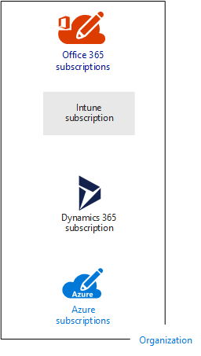
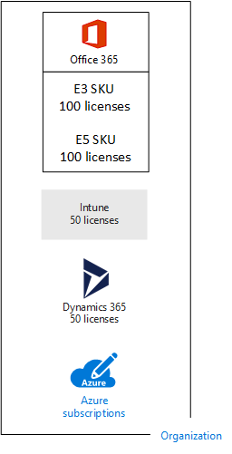
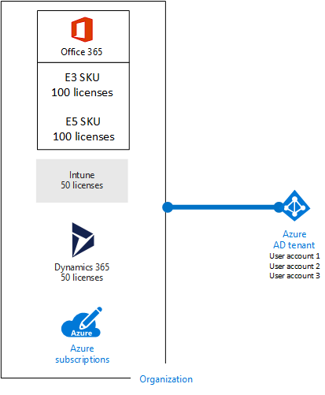
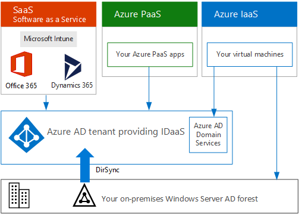

# Suscripciones, licencias, las cuentas y los inquilinos para las ofertas de nube de Microsoft

 **Resumen:** Comprender las relaciones de las organizaciones, suscripciones, licencias, cuentas de usuario y los inquilinos en las ofertas de nube de Microsoft.
  
Microsoft proporciona una jerarquía de las organizaciones, suscripciones, licencias y las cuentas de usuario para un uso coherente de las identidades y facturación a través de sus ofertas de nube:
  
- Microsoft Office 365
    
    Ver [precios y planes de negocio](https://products.office.com/business/compare-office-365-for-business-plans) para obtener más información.
    
- Microsoft Azure
    
    Para obtener más información, consulte [precios de Azure](https://azure.microsoft.com/pricing/) .
    
- Microsoft Intune y la movilidad en la empresa + seguridad (EMS)
    
    Para obtener más información, consulte [precios Intune](https://www.microsoft.com/cloud-platform/microsoft-intune-pricing) .
    
- Microsoft Dynamics 365
    
    Para obtener más información, consulte [precios de Dynamics 365](https://dynamics.microsoft.com/) .
    
## Elementos de la jerarquía

Estos son los elementos de la jerarquía:
  
### Organización

Una organización representa una entidad empresarial que usa ofertas de la nube de Microsoft, normalmente identificadas por un sistema de nombres de dominio (DNS) público, como contoso.com. La organización es un contenedor para las suscripciones.
  
### Suscripciones

Una suscripción es un contrato con Microsoft para utilizar uno o más plataformas de nube de Microsoft o servicios, para el que se acumulan los cargos basados en un pago de licencia de por usuario o en el consumo de recursos en la nube. Software de Microsoft como un servicio (SaaS)-ofertas de nube en función (Office 365, Intune/EMS y Dynamics 365) cobran por usuario cuotas de licencia. Plataforma como servicio (PaaS) y la infraestructura como servicio (IaaS) nube ofertas (Azure) impuesto basado en el consumo de recursos de nube de Microsoft.
  
También puede usar una suscripción de prueba, pero la suscripción expira después de un periodo de tiempo o cargos por consumo determinados. Puede convertir una suscripción de prueba en una suscripción de pago.
  
Las organizaciones pueden tener varias suscripciones para las ofertas de nube de Microsoft. La figura 1 muestra un ejemplo.
  
**Figura 1: Ejemplo de varias suscripciones para una organización**

  
En la figura 1, se muestra una sola organización con varias suscripciones de Office 365, una suscripción de Intune, una suscripción de Dynamics 365 y varias suscripciones de Azure.
  
### Licencias

Para las ofertas de nube de Microsoft SaaS, una licencia permite a una cuenta de usuario específica utilizar los servicios de la nube que ofrece. Se cobran una cuota fija mensual como parte de su suscripción. Los administradores asignar licencias a cuentas de usuario individuales en la suscripción. Por ejemplo en la figura 2, Contoso Corporation tiene una suscripción a Office 365 Enterprise E5 con 100 licencias, que permite utilizar servicios y características de empresa E5 hasta 100 cuentas de usuario individuales.
  
**Figura 2: Licencias dentro de las suscripciones basadas en SaaS para una organización**

  
Para los servicios en la nube basados en PaaS de Azure, las licencias de software están integradas en los precios del servicio.  
  
Para las máquinas virtuales basadas en IaaS de Azure, podrían necesitarse licencias adicionales para utilizar el software o la aplicación instalada en una imagen de la máquina virtual. Algunas imágenes de máquina virtual tienen versiones con licencia de software instalado y el costo está incluido en la tarifa por minuto para el servidor. Algunos ejemplos son las imágenes de la máquina virtual para SQL Server 2014 y SQL Server 2016.  
  
Algunas imágenes de máquina virtual tienen versiones de prueba de aplicaciones instaladas y necesitan licencias adicionales de aplicación de software para su uso más allá del período de prueba. Por ejemplo, la imagen de la máquina virtual de prueba de SharePoint Server 2016 incluye una versión de prueba de SharePoint Server 2016 instalada previamente. Para seguir utilizando SharePoint Server 2016 después de la fecha de expiración de la versión de prueba, debe adquirir una licencia de SharePoint Server 2016 y licencias de cliente de Microsoft. Estos cargos son independientes de la suscripción de Azure y la tarifa por minuto para ejecutar la máquina virtual sigue vigente.
  
### Cuentas de usuario

Las cuentas de usuario para todas las ofertas de nube de Microsoft se almacenan en un arrendatario Azure de Active Directory (AD), que contiene los grupos y cuentas de usuario. Un arrendatario AD Azure se puede sincronizar con las cuentas existentes de Windows Server AD con Azure Connect de AD, un servicio de Windows server. Esto se conoce como sincronización de directorios (DirSync).
  
La figura 3 muestra un ejemplo de varias suscripciones de una organización con un inquilino común de Azure AD que contiene las cuentas de la organización.
  
**Figura 3: Varias suscripciones de una organización que utilice al mismo inquilino de Azure AD**

  
### Inquilinos

Para las ofertas de la nube de SaaS, el inquilino es la ubicación regional que hospeda a los servidores que proporcionan servicios en la nube. Por ejemplo, Contoso Corporation eligió la región europea para hospedar a sus inquilinos de Office 365, EMS y Dynamics 365 para los 15.000 trabajadores en su sede de París.
  
Los servicios de PaaS de Azure y las cargas de trabajo basadas en máquina virtual hospedadas en IaaS de Azure pueden tener un arrendamiento en cualquier centro de datos de Azure en todo el mundo. Especifique el centro de datos de Azure, conocido como la ubicación, al crear la aplicación o el servicio de PaaS de Azure, o el elemento de una carga de trabajo de IaaS.
  
Un inquilino de Azure AD es una instancia específica de Azure AD que contiene cuentas y grupos. Las suscripciones de prueba o de pago de Office 365, Dynamics 365 o Intune/EMS incluyen un inquilino gratuito de Azure AD. Este inquilino de Azure AD no incluye otros servicios de Azure y no es lo mismo que una suscripción de prueba o de pago de Azure.
  
### Resumen de la jerarquía

Presentamos un breve resumen:
  
- Una organización puede tener varias suscripciones.
    
  - Una suscripción puede tener varias licencias.
    
  - Las licencias se pueden asignar a cuentas de usuario individuales.
    
  - Las cuentas de usuario se almacenan en un inquilino de Azure AD.
    
Aquí tiene un ejemplo de la relación de las organizaciones, suscripciones, licencias y cuentas de usuario.
  
- Una organización identificada mediante su nombre de dominio público.
    
  - Una suscripción de Office 365 Enterprise E3 con licencias de usuario.
    
    Una suscripción de Office 365 Enterprise E5 con licencias de usuario.
    
    Una suscripción de EMS con licencias de usuario.
    
    Una suscripción de Dynamics 365 con licencias de usuario.
    
    Varias suscripciones de Azure.
    
  - Las cuentas de usuario de la organización en un inquilino común de Azure AD.
    
Varias suscripciones de la oferta de la nube de Microsoft pueden usar el mismo inquilino de Azure AD, que actúa como proveedor común de identidades. Un inquilino central de Azure AD que contiene las cuentas sincronizadas de su servidor local de Windows Server AD le proporciona identidad como servicio (IDaaS) basada en la nube para su organización. Esto se muestra en la figura 4.
  
**Figura 4: Cuentas locales sincronizadas y IDaaS para una organización**

  
En la figura 4, se muestra cómo las ofertas de la nube de SaaS de Microsoft, las aplicaciones de PaaS de Azure y las máquinas virtuales de IaaS de Azure que usan Azure AD Domain Services usan un inquilino común de Azure AD. Azure AD Connect sincroniza el bosque de Windows Server AD local con el inquilino de Azure AD.
  
Para obtener más información acerca de la integración de identidades a través de ofertas de nube de Microsoft, consulte [Identidad de nube de Microsoft para Enterprise Architects](https://aka.ms/cloudarchidentity).
  
## Combinación de suscripciones para varias ofertas de la nube de Microsoft

En la siguiente tabla se describe cómo combinar varias ofertas de la nube de Microsoft si ya se cuenta con una suscripción para un tipo de oferta de la nube (las etiquetas de la primera columna) y si se agrega una suscripción para una oferta de la nube diferente (que pasan por todas las columnas).
  
||**Office 365**|**Azure**|**Intune/EMS**|**Dynamics 365**|
|:-----|:-----|:-----|:-----|:-----|
|**Office 365**   |ND    |Agregue una suscripción de Azure a la organización desde el portal de Azure.    |Agregue una suscripción de Intune/EMS a la organización desde el portal de Office 365.    |Agregue una suscripción de Dynamics 365 a la organización desde el portal de Office 365.    |
|**Azure**   |Agregue una suscripción de Office 365 a su organización.     |ND    |Agregue una suscripción de Intune/EMS a su organización.    |Agregue una suscripción de Dynamics 365 a su organización.    |
|**Intune/EMS**   |Agregue una suscripción de Office 365 a su organización.     |Agregue una suscripción de Azure a la organización desde el portal de Azure.    |ND    |Agregue una suscripción de Dynamics 365 a su organización.    |
|**Dynamics 365**   |Agregue una suscripción de Office 365 a su organización.     |Agregue una suscripción de Azure a la organización desde el portal de Azure.    |Agregue una suscripción de Intune/EMS a su organización.    |ND    |
   
Una forma fácil de agregar suscripciones a su organización para los servicios basados en SaaS de Microsoft es a través del centro de administración de Office 365:
  
1. Iniciar sesión en el portal de Office 365 ([https://portal.office.com](https://portal.office.com)) con el administrador global de cuenta y, a continuación, haga clic en **Admin**.
    
2. En la barra de navegación izquierda de la página principal de **Administración central** , haga clic en **facturación**y, a continuación, en **Servicios de compra**.
    
3. En la página **Servicios de compra** , compra sus nuevas suscripciones.
    
El Centro de administración de Office 365 asigna la organización y el inquilino de Azure AD de su suscripción a Office 365 a las nuevas suscripciones para las ofertas de la nube basadas en SaaS.
  
Para agregar una suscripción a Azure con la misma organización e inquilino de Azure AD como su suscripción a Office 365:
  
1. Iniciar sesión en el portal de Azure ([https://portal.azure.com](https://portal.azure.com)) con la cuenta de administrador global de Office 365.
    
2. En la exploración de la izquierda, haga clic en **suscripciones**y, a continuación, haga clic en **Agregar**.
    
3. En la página **Agregar suscripción** , seleccione una oferta y completar la información de pago y el acuerdo.
    
Si adquirió las suscripciones de Azure y Office 365 y desea tener acceso a los inquilinos de Azure AD Office 365 desde su suscripción de Azure, consulte las instrucciones de [asociar a un arrendatario Office 365 con una suscripción de Azure](https://channel9.msdn.com/Series/Microsoft-Azure-Tutorials/Associate-an-Office-365-tenant-with-an-Azure-subscription).
  
## Consulte también

[Recursos de arquitectura de TI de la nube de Microsoft](microsoft-cloud-it-architecture-resources.md)
  
[Guías de entorno de pruebas de adopción de la nube (TLG)](cloud-adoption-test-lab-guides-tlgs.md)
  
[Modelos de arquitectura para SharePoint, Exchange, Skype Empresarial y Lync](architectural-models-for-sharepoint-exchange-skype-for-business-and-lync.md)
  
[Soluciones híbridas](hybrid-solutions.md)
  
[Suscripciones, licencias y cuentas de usuario para Contoso Corporation](subscriptions-licenses-and-user-accounts-for-the-contoso-corporation.md)

