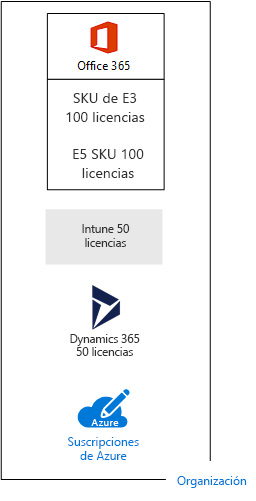
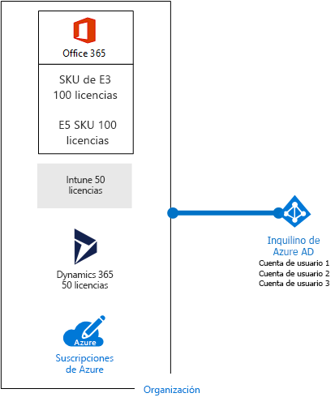

# Suscripciones, licencias, cuentas y espacios empresariales para las ofertas de la nube de Microsoft

 **Resumen:** comprenda las relaciones de las organizaciones, las suscripciones, las licencias, las cuentas de usuario y los espacios empresariales en las ofertas de la nube de Microsoft.
  
Microsoft facilita una jerarquía de organizaciones, suscripciones, licencias y cuentas de usuario para un uso coherente de las identidades y la facturación en todas sus ofertas de la nube:
  
- Microsoft Office 365
- Microsoft Azure
- Microsoft Intune y Enterprise Mobility + Security (EMS)
- Microsoft Dynamics 365

[Microsoft 365](https://docs.microsoft.com/microsoft-365/) combina Office 365, EMS y Windows 10 Enterprise en una única suscripción y un conjunto de servicios integrados.

## Elementos de la jerarquía

Estos son los elementos de la jerarquía:
  
### Organización

An organization represents a business entity that is using Microsoft cloud offerings, typically identified by one or more public Domain Name System (DNS) domain names, such as contoso.com. The organization is a container for subscriptions.
  
### Suscripciones

Una suscripción es un contrato con Microsoft para utilizar uno o más servicios o plataformas de la nube de Microsoft, para los que se acumulan los cargos en función de un precio de licencia por usuario o en el consumo de recursos basados en la nube. 

- Las ofertas de la nube basadas en el software como servicio (SaaS) de Microsoft (Office 365, Intune/EMS y Dynamics 365) se cobran por precios de licencia por usuario. 
- Las ofertas de la nube de plataforma como servicio (PaaS) y de infraestructura como servicio (IaaS) de Microsoft (Azure) se cobran en función del consumo de recursos de la nube.
 
You can also use a trial subscription, but the subscription expires after a specific amount of time or consumption charges. You can convert a trial subscription to a paid subscription.
  
Las organizaciones pueden tener varias suscripciones para las ofertas de la nube de Microsoft. En la ilustración 1, se muestra una sola organización con varias suscripciones de Office 365, una suscripción de Intune, una suscripción de Dynamics 365 y varias suscripciones de Azure.

**Ilustración 1: Ejemplo de varias suscripciones para una organización**

  
### Licencias

Para las ofertas de la nube de SaaS de Microsoft, una licencia permite a una cuenta de usuario específica utilizar los servicios de la oferta de la nube. Se le cobrará un precio mensual fijo como parte de su suscripción. Los administradores asignan licencias a cuentas de usuario individuales en la suscripción. Para el ejemplo en la figura 2, Contoso Corporation tiene una suscripción a Office 365 Enterprise E5 con 100 licencias, que permite a hasta 100 cuentas de usuario individuales utilizar las características y los servicios de Office 365 Enterprise E5.
  
**Ilustración 2: Licencias en las suscripciones basadas en SaaS para una organización**

  
Para los servicios en la nube basados en PaaS de Azure, las licencias de software están integradas en los precios del servicio.
  
For Azure IaaS-based virtual machines, additional licenses to use the software or application installed on a virtual machine image might be required. Some virtual machine images have licensed versions of software installed and the cost is included in the per-minute rate for the server. Examples are the virtual machine images for SQL Server 2014 and SQL Server 2016. 
  
Some virtual machine images have trial versions of applications installed and need additional software application licenses for use beyond the trial period. For example, the SharePoint Server 2016 Trial virtual machine image includes a trial version of SharePoint Server 2016 pre-installed. To continue using SharePoint Server 2016 after the trial expiration date, you must purchase a SharePoint Server 2016 license and client licenses from Microsoft. These charges are separate from the Azure subscription and the per-minute rate to run the virtual machine still applies.
  
### Cuentas de usuario

Las cuentas de usuario para todas las ofertas de la nube de Microsoft se almacenan en un espacio empresarial de Azure Active Directory (Azure AD), que contiene grupos y cuentas de usuario. Un inquilino de Azure AD se puede sincronizar con las cuentas existentes de Active Directory Domain Services (AD DS) mediante Azure AD Connect, un servicio basado en Windows Server. Esto se conoce como sincronización de directorios.
  
En la ilustración 3, se muestra un ejemplo de varias suscripciones de una organización con un espacio empresarial de Azure AD común que contiene las cuentas de la organización.
  
**Ilustración 3: Varias suscripciones de una organización que usan el mismo espacio empresarial de Azure AD**

  
### Espacios empresariales

For SaaS cloud offerings, the tenant is the regional location that houses the servers providing cloud services. For example, the Contoso Corporation chose the European region to host its Office 365, EMS, and Dynamics 365 tenants for the 15,000 workers in their Paris headquarters.
  
Azure PaaS services and virtual machine-based workloads hosted in Azure IaaS can have tenancy in any Azure datacenter across the world. You specify the Azure datacenter, known as the location, when you create the Azure PaaS app or service or element of an IaaS workload.
  
An Azure AD tenant is a specific instance of Azure AD containing accounts and groups. Paid or trial subscriptions of Office 365, Dynamics 365, or Intune/EMS include a free Azure AD tenant. This Azure AD tenant does not include other Azure services and is not the same as an Azure trial or paid subscription.
  
### Resumen de la jerarquía

Presentamos un breve resumen:
  
- Una organización puede tener varias suscripciones.
    
  - Una suscripción puede tener varias licencias.
    
  - Las licencias se pueden asignar a cuentas de usuario individuales.
    
  - Las cuentas de usuario se almacenan en un inquilino de Azure AD.
    
Aquí tiene un ejemplo de la relación de las organizaciones, suscripciones, licencias y cuentas de usuario.
  
- Una organización identificada mediante su nombre de dominio público.
    
  - Una suscripción de Office 365 Enterprise E3 con licencias de usuario.
    
    Una suscripción de Office 365 Enterprise E5 con licencias de usuario.
    
    Una suscripción de EMS con licencias de usuario.
    
    Una suscripción de Dynamics 365 con licencias de usuario.
    
    Varias suscripciones de Azure.
    
  - Las cuentas de usuario de la organización en un inquilino común de Azure AD.
    
Varias suscripciones de la oferta de la nube de Microsoft pueden usar el mismo inquilino de Azure AD, que actúa como proveedor común de identidades. Un espacio empresarial central de Azure AD que contiene las cuentas sincronizadas de su servidor local de AD DS le proporciona identidad como servicio (IDaaS) basada en la nube para su organización. 
  
**Ilustración 4: Cuentas locales sincronizadas e IDaaS para una organización**

  
Figure 4 shows how a common Azure AD tenant is used by Microsoft's SaaS cloud offerings, Azure PaaS apps, and virtual machines in Azure IaaS that use Azure AD Domain Services. Azure AD Connect synchronizes the on-premises AD DS forest with the Azure AD tenant.
  
## Combinación de suscripciones para varias ofertas de la nube de Microsoft

En la siguiente tabla se describe cómo combinar varias ofertas de la nube de Microsoft si ya se cuenta con una suscripción para un tipo de oferta de la nube (las etiquetas de la primera columna) y si se agrega una suscripción para una oferta de la nube diferente (que pasan por todas las columnas).
  
||**Office 365**|**Azure**|**Intune/EMS**|**Dynamics 365**|
|:-----|:-----|:-----|:-----|:-----|
|**Office 365**   |ND    |Agregue una suscripción de Azure a la organización desde el portal de Azure.    |Agregue una suscripción de Intune/EMS a la organización desde el Centro de administración de Microsoft 365.    |Agregue una suscripción de Dynamics 365 a la organización desde el Centro de administración de Microsoft 365.    |
|**Azure**   |Agregue una suscripción de Office 365 a su organización.    |ND    |Agregue una suscripción de Intune/EMS a su organización.    |Agregue una suscripción de Dynamics 365 a su organización.    |
|**Intune/EMS**   |Agregue una suscripción de Office 365 a su organización.    |Agregue una suscripción de Azure a la organización desde el portal de Azure.    |ND    |Agregue una suscripción de Dynamics 365 a su organización.    |
|**Dynamics 365**   |Agregue una suscripción de Office 365 a su organización.    |Agregue una suscripción de Azure a la organización desde el portal de Azure.    |Agregue una suscripción de Intune/EMS a su organización.    |N/D    |
   
Una forma sencilla de agregar suscripciones a su organización para los servicios basados en SaaS para Microsoft es a través del Centro de administración:
  
1. Inicie sesión en el Centro de administración de Microsoft 365 ([https://admin.microsoft.com](https://admin.microsoft.com)) con su cuenta de administrador global.
    
2. En el panel de navegación izquierdo de la página principal del **Centro de administración**, haga clic en **Facturación** y, después, en **Servicios de compra**.
    
3. En la página **Servicios de compra**, compre las nuevas suscripciones.
    
El Centro de administración asigna la organización y al inquilino de Azure AD de su suscripción en Office 365 a las nuevas suscripciones para las ofertas de la nube basadas en SaaS.
  
Para agregar una suscripción de Azure con la misma organización y espacio empresarial de Azure AD como su suscripción de Office 365:
  
1. Inicie sesión en Azure Portal ([https://portal.azure.com](https://portal.azure.com)) con su cuenta de administrador global de Office 365.
    
2. En el panel de navegación izquierdo, haga clic en **Suscripciones** y después en **Agregar**.
    
3. En la página **Agregar suscripción**, seleccione una oferta y complete la información de pago y el contrato.
    
Si usted adquiere suscripciones de Office 365 y Azure por separado y quiere obtener acceso del espacio empresarial de Azure AD de Office 365 desde su suscripción de Azure, vea las instrucciones en [Añadir una suscripción existente de Azure a su Directorio de Azure Active](https://docs.microsoft.com/azure/active-directory/fundamentals/active-directory-how-subscriptions-associated-directory).
 
## Vea también

[Recursos de arquitectura de TI de la nube de Microsoft](microsoft-cloud-it-architecture-resources.md)
  
[Modelos de arquitectura para SharePoint, Exchange, Skype Empresarial y Lync](architectural-models-for-sharepoint-exchange-skype-for-business-and-lync.md)
  
[Soluciones híbridas](hybrid-solutions.md)

## Siguiente paso

[Evaluar la conectividad de red de Office 365](assessing-network-connectivity.md)
  
