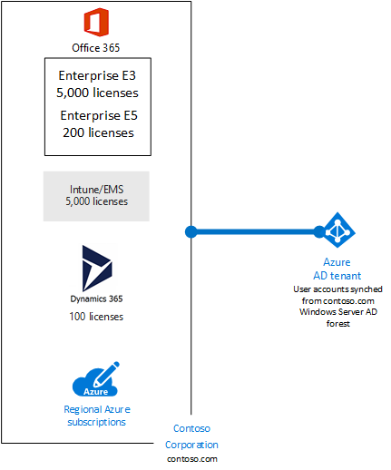
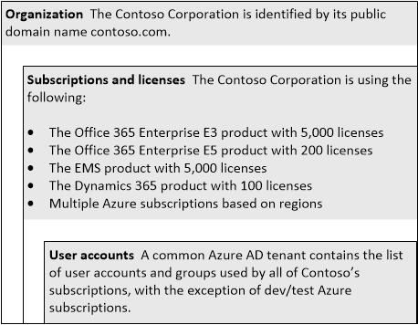

# Suscripciones, licencias y cuentas de usuario para Contoso Corporation

 **Resumen:** Comprender la estructura de los inquilinos, cuentas de usuario, licencias y suscripciones de nube de Contoso.
  
Para proporcionar un uso coherente de las identidades y la facturación para todas las ofertas de nube, Microsoft ofrece una jerarquía de cuentas de organización, suscripciones, licencias y usuario.
  
- Organización
    
    La entidad empresarial que usa las ofertas de nube de Microsoft, normalmente identificadas por un nombre de dominio DNS público, como contoso.com.
    
- Suscripciones
    
    Para Microsoft SaaS (Office 365, Intune/EMS y Dynamics 365) de las ofertas de nube, una suscripción es un producto específico y un conjunto de licencias de usuario comprado. Para Azure, una suscripción permite la facturación de los servicios de nube consumido a la organización.
    
- Licencias
    
    Para las ofertas de nube de Microsoft SaaS, una licencia permite una cuenta de usuario específica utilizar los servicios de nube. Para Azure, licencias de software se crean en tarifas de servicio, pero en algunos casos que necesitará adquirir licencias de software adicionales.
    
- Cuentas de usuario
    
    Las cuentas de usuario se almacenan en un inquilino de Azure AD y pueden sincronizarse desde un proveedor de identidades local como Windows Server AD.
    
## Estructura de Contoso

Contoso determinó la siguiente estructura para la organización y sus suscripciones, licencias, cuentas e inquilinos:
  
**Figura 1: Contoso organización, suscripciones, licencias, cuentas de usuario y los inquilinos**

  
La figura 1 muestra cómo la organización Contoso incluye varias suscripciones y está vinculada a un inquilino común de Azure AD que contiene las cuentas de usuario que se sincronizan desde el bosque de Windows Server AD de contoso.com.
  
- **Organización** Contoso Corporation se identifica mediante su nombre de dominio público contoso.com.
    
  - **Suscripciones y licencias** La empresa Contoso utiliza lo siguiente:
    
  - El producto de Office 365 Enterprise E3 con 5.000 licencias
    
  - Producto Office 365 Enterprise E5 con 200 licencias
    
  - El producto EMS con 5.000 licencias
    
  - El producto Dynamics 365 con 100 licencias
    
  - Varias suscripciones de Azure según las regiones
    
  - **Cuentas de usuario** Un arrendatario común de Azure AD contiene la lista de cuentas de usuario y grupos utilizan todas las suscripciones de Contoso, a excepción de pruebas y desarrollo Azure suscripciones.
    
Para los inquilinos de Contoso:
  
- Para las ofertas de nube de SaaS, el arrendatario es la ubicación regional que aloja a los servidores que proporcionan servicios de nube. Contoso ha elegido la región europea para alojar a sus arrendatarios de Office 365, EMS y Dynamics 365. 
    
- Los servicios de Azure PaaS y aplicaciones y cargas de trabajo de TI de IaaS pueden tener tenencia en cualquier centro de datos de Azure en todo el mundo. Un arrendatario AD Azure es una instancia específica de Azure AD que contiene las cuentas y grupos.
    
- El inquilino AD Azure comun que contiene las cuentas sincronizadas para el bosque de Windows Server de Contoso AD proporciona IDaaS en las ofertas de nube de Microsoft.
    
Para obtener más información, consulte [suscripciones, licencias, cuentas y los inquilinos para las ofertas de nube de Microsoft](subscriptions-licenses-accounts-and-tenants-for-microsoft-cloud-offerings.md).
  
## Suscripciones de Azure de Contoso

La figura 2 muestra el diseño jerárquico de suscripciones de Azure de Contoso:
  
**Figura 2: Estructura de Contoso para suscripciones de Azure**

  
- Contoso está en la parte superior, de acuerdo con su Contrato Enterprise con Microsoft.
    
- Hay un conjunto de cuentas correspondiente a las diferentes regiones de Contoso Corporation todo el mundo, basado en los dominios del bosque de Windows Server AD de Contoso.
    
- Dentro de cada región, hay una o más suscripciones basadas en necesidades de implementación de desarrollo, pruebas y producción de la región.
    
Cada suscripción de Azure puede asociarse a un solo inquilino de Azure AD que contenga cuentas de usuario y grupos para la autenticación y la autorización para los servicios de Azure. Las suscripciones de producción usan el inquilino de Azure AD común de Contoso.
  
## See Also

[Contoso en la nube de Microsoft](contoso-in-the-microsoft-cloud.md)
  
[Recursos de arquitectura de TI de la nube de Microsoft](microsoft-cloud-it-architecture-resources.md)

[Mapa de ruta de Enterprise Cloud de Microsoft: Recursos para los responsables de decisiones de TI](https://sway.com/FJ2xsyWtkJc2taRD)

