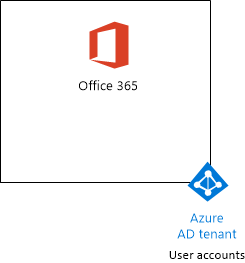
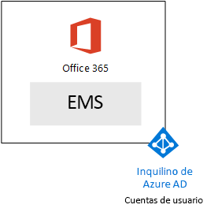
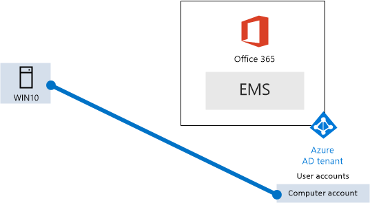

# <a name="the-microsoft-365-enterprise-devtest-environment"></a>El entorno de pruebas y desarrollo empresarial de Microsoft 365

 **Resumen:** Utilice a esta guía de laboratorio de prueba para crear un entorno de pruebas y desarrollo que incluye Office 365 E5, movilidad en la empresa + E5 de seguridad (EMS) y un equipo que ejecuta Windows 10 Enterprise.
  
Este artículo proporciona instrucciones paso a paso para crear un entorno simplificado para probar las características y funciones de [Empresa de Microsoft 365](https://www.microsoft.com/microsoft-365/enterprise).
  
## <a name="phase-1-create-your-office-365-e5-subscription"></a>Fase 1: Crear tu suscripción a Office 365 E5

Siga los pasos de la fase 2 y 3 de la fase del [entorno de desarrollo y prueba de Office 365](office-365-dev-test-environment.md) para crear un entorno de pruebas y desarrollo ligero Office 365, como se muestra en la figura 1.
  
**Figura 1: La suscripción a Office 365 E5 con sus cuentas de usuario y de los inquilinos de Azure de Active Directory (AD)**


  
## <a name="phase-2-add-ems"></a>Fase 2: Agregar EMS

En esta fase, Inscríbase en la suscripción de prueba de EMS E5 y agregarlo a la misma organización que su suscripción de prueba de Office 365 E5.
  
En primer lugar, agregue la suscripción de prueba de EMS E5 y asignar una licencia de EMS a su cuenta de administrador global.
  
1. Con una instancia privada de un explorador de Internet, inicie sesión en el portal de Office 365 con sus credenciales de la cuenta de administrador global. Para obtener ayuda, visite [dónde puede iniciar sesión en Office 365](https://support.office.com/Article/Where-to-sign-in-to-Office-365-e9eb7d51-5430-4929-91ab-6157c5a050b4).
    
2. Haga clic en el icono **Administración**.
    
3. En la pestaña **Centro de administración de Office** del explorador, en el panel de navegación izquierdo, haga clic en **Facturación > Servicios de compra**.
    
4. En la página **Servicios de compra** , busque el elemento de **seguridad E5 + de movilidad en la empresa** . Sitúe el puntero del mouse sobre él y haga clic en **iniciar la versión de prueba gratuita**.
    
5. En la página **Confirmar pedido**, haga clic en **Probar ahora**.
    
6. En la página **Recibo del pedido**, haga clic en **Continuar**.
    
7. En la pestaña **Centro de administración de Office 365** del explorador, en el panel de navegación izquierdo, haga clic en **Usuarios > Usuarios activos**.
    
8. Haga clic en la cuenta de administrador global y, a continuación, haga clic en **Editar** para **licencias de producto**.
    
9. En el panel de **licencias de producto** , activar la licencia del producto de **movilidad en la empresa + seguridad E5** en **On**, haga clic en **Guardar** y, a continuación, haga clic en **Cerrar** dos veces.
    
> [!NOTE]
> La suscripción de prueba a Enterprise Mobility + Security E5 tiene una duración de 90 días. Si quiere usar un entorno de pruebas y desarrollo permanente, cree una nueva suscripción de pago con un número reducido de licencias. 
  
 ***Si se ha completado la fase 3 de la*** [Entorno de desarrollo y prueba de office 365](office-365-dev-test-environment.md), repita los pasos 8 y 9 del procedimiento anterior para todas las cuentas (usuario 2, 3 de usuario, usuario 4 y 5 de usuario).
  
Ahora tiene su entorno de pruebas y desarrollo:
  
- Suscripciones de prueba de Office 365 E5 Enterprise y EMS que comparten la misma organización y el mismo inquilino de AD Azure con la lista de cuentas de usuario.
- Todas las cuentas de usuario adecuado (sólo el administrador global o todas las cinco cuentas de usuario) están habilitadas para utilizar Office 365 E5 y E5 EMS.
    
La figura 2 muestra la configuración resultante, que agrega EMS.
  
**Figura 2: Agregar la suscripción de prueba de EMS**


  
## <a name="phase-3-create-a-windows-10-enterprise-computer"></a>Fase 3: Crear un equipo de Windows 10 Enterprise

En esta fase, se crea un equipo independiente que ejecuta Windows 10 Enterprise.
  
### <a name="physical-computer"></a>Equipo físico

Obtenga un equipo e instale Windows 10 Enterprise en él. Puede descargar el Windows 10 Enterprise prueba [aquí](https://www.microsoft.com/evalcenter/evaluate-windows-10-enterprise).
  
### <a name="virtual-machine"></a>Máquina virtual

Crear una máquina virtual utilizando el hipervisor de su elección e instale Windows 10 Enterprise en él. Puede descargar el Windows 10 Enterprise prueba [aquí](https://www.microsoft.com/evalcenter/evaluate-windows-10-enterprise).
  
### <a name="virtual-machine-in-azure"></a>Máquina virtual en Azure

Crear una máquina virtual de Windows 10 en Azure de Microsoft utilizando la imagen de la Galería de Azure.
  
> [!NOTE]
> Los siguientes conjuntos de comandos utilizan la versión más reciente te de PowerShell de Azure. Consulte [Introducción a los cmdlets de PowerShell de Azure](https://docs.microsoft.com/powershell/azureps-cmdlets-docs/). Estos generación de conjuntos de una máquina virtual de Windows 10 Enterprise de comando denominado WIN10 y todos su infraestructura necesaria, incluyendo una red virtual, una cuenta de almacenamiento y un grupo de recursos. Si ya está familiarizado con los servicios de infraestructura de Azure, por favor adaptar estas instrucciones para adaptarse a la infraestructura implementada actualmente. 
  
En primer lugar, inicie un símbolo del sistema de Microsoft PowerShell.
  
Inicie sesión en su cuenta de Azure con el siguiente comando.
  
```
Login-AzureRMAccount
```

Obtenga su nombre de suscripción mediante el comando siguiente.
  
```
Get-AzureRMSubscription | Sort Name | Select Name
```

Establecer su suscripción de Azure. Reemplace todo el contenido de las ofertas, incluyendo el \< y > caracteres, con el nombre correcto.
  
```
$subscr="<subscription name>"
Get-AzureRmSubscription -SubscriptionName $subscr | Select-AzureRmSubscription
```

Después, cree un nuevo grupo de recursos. Para determinar un nombre único de grupo de recursos, use este comando a fin de enumerar los grupos de recursos existentes.
  
```
Get-AzureRMResourceGroup | Sort ResourceGroupName | Select ResourceGroupName
```

Crear el nuevo grupo de recursos con estos comandos. Reemplace todo el contenido de las ofertas, incluyendo el \< y > caracteres, con los nombres correctos.
  
```
$rgName="<resource group name>"
$locName="<location name, such as West US>"
New-AzureRMResourceGroup -Name $rgName -Location $locName
```

A continuación, cree una nueva red virtual y la máquina virtual de WIN10 con estos comandos. Cuando se le pida, proporcione el nombre y la contraseña de la cuenta de administrador local para WIN10 y almacenarlos en una ubicación segura.
  
```
$corpnetSubnet=New-AzureRMVirtualNetworkSubnetConfig -Name Corpnet -AddressPrefix 10.0.0.0/24
New-AzureRMVirtualNetwork -Name "M365Ent-TestLab" -ResourceGroupName $rgName -Location $locName -AddressPrefix 10.0.0.0/8 -Subnet $corpnetSubnet
$rule1=New-AzureRMNetworkSecurityRuleConfig -Name "RDPTraffic" -Description "Allow RDP to all VMs on the subnet" -Access Allow -Protocol Tcp -Direction Inbound -Priority 100 -SourceAddressPrefix Internet -SourcePortRange * -DestinationAddressPrefix * -DestinationPortRange 3389
New-AzureRMNetworkSecurityGroup -Name Corpnet -ResourceGroupName $rgName -Location $locName -SecurityRules $rule1
$vnet=Get-AzureRMVirtualNetwork -ResourceGroupName $rgName -Name "M365Ent-TestLab"
$nsg=Get-AzureRMNetworkSecurityGroup -Name Corpnet -ResourceGroupName $rgName
Set-AzureRMVirtualNetworkSubnetConfig -VirtualNetwork $vnet -Name Corpnet -AddressPrefix "10.0.0.0/24" -NetworkSecurityGroup $nsg
$pip=New-AzureRMPublicIpAddress -Name WIN10-PIP -ResourceGroupName $rgName -Location $locName -AllocationMethod Dynamic
$nic=New-AzureRMNetworkInterface -Name WIN10-NIC -ResourceGroupName $rgName -Location $locName -SubnetId $vnet.Subnets[0].Id -PublicIpAddressId $pip.Id
$vm=New-AzureRMVMConfig -VMName WIN10 -VMSize Standard_D1_V2
$cred=Get-Credential -Message "Type the name and password of the local administrator account for WIN10."
$vm=Set-AzureRMVMOperatingSystem -VM $vm -Windows -ComputerName WIN10 -Credential $cred -ProvisionVMAgent -EnableAutoUpdate
$vm=Set-AzureRMVMSourceImage -VM $vm -PublisherName MicrosoftWindowsDesktop -Offer Windows-10 -Skus RS3-Pro -Version "latest"
$vm=Add-AzureRMVMNetworkInterface -VM $vm -Id $nic.Id
$vm=Set-AzureRmVMOSDisk -VM $vm -Name WIN10-TestLab-OSDisk -DiskSizeInGB 128 -CreateOption FromImage -StorageAccountType "StandardLRS"
New-AzureRMVM -ResourceGroupName $rgName -Location $locName -VM $vm
```

## <a name="phase-4-join-your-windows-10-computer-to-azure-ad"></a>Fase 4: Unir el equipo Windows 10 a Azure AD

Después de crear la máquina física o virtual con Enterprise del 10 de Windows, inicie sesión con una cuenta de administrador local.
  
> [!NOTE]
> Para una máquina virtual en Azure, conectarse a ella mediante [estas instrucciones](https://docs.microsoft.com/azure/virtual-machines/windows/connect-logon). Inicie sesión con las credenciales de la cuenta de administrador local. 
  
A continuación, unir el equipo de WIN10 a los inquilinos de Azure AD de sus suscripciones a Office 365 y EMS.
  
1. En el escritorio del equipo WIN10, haga clic en **Inicio > Configuración > cuentas > acceso trabajo o la escuela > conectar**.
    
2. En el cuadro de diálogo **Configurar una cuenta de trabajo o escuela** , haga clic en **unirse a este dispositivo a Azure Active Directory**.
    
3. En **trabajo o escuela cuenta**, escriba el nombre de la cuenta de administrador global de la suscripción a Office 365 y, a continuación, haga clic en **siguiente**.
    
4. En **Escriba la contraseña**, escriba la contraseña de la cuenta de administrador global y, a continuación, haga clic en **iniciar sesión**.
    
5. Cuando se le pida para asegurarse de que se trata de su organización, haga clic en **unirse**y, a continuación, haga clic en **Listo**.
    
6. Cierre la ventana de configuración.
    
A continuación, instale Office 2016 en el equipo de WIN10.
  
1. Abra el Explorador de Microsoft Edge e inicie sesión en el portal de Office 365 con sus credenciales de la cuenta de administrador global. Para obtener ayuda, visite [dónde puede iniciar sesión en Office 365](https://support.office.com/Article/Where-to-sign-in-to-Office-365-e9eb7d51-5430-4929-91ab-6157c5a050b4).
    
2. En la ficha **Página de inicio de Microsoft Office** , haga clic en **instalar Office 2016**.
    
3. Cuando se le pregunte qué hacer, haga clic en **Ejecutar**y, a continuación, haga clic en **Sí** para el **Control de cuentas de usuario**.
    
4. Espere a que Office completar su instalación. Cuando vea **está todo listo!**, haga clic en **Cerrar** dos veces.
    
La figura 3 muestra el entorno resultante, que incluye el equipo de WIN10 que se ha unido al inquilino Azure AD de sus suscripciones a Office 365 y EMS.
  
**Figura 3: Agregar la cuenta de equipo WIN10 a los inquilinos de Azure AD**


  
Ahora está listo para probar otras características de [Empresa de Microsoft 365](https://www.microsoft.com/microsoft-365/enterprise).
  
## <a name="next-steps"></a>Pasos siguientes

Uso de estos artículos adicionales para explorar las características de empresa de Microsoft 365:
  
- [Agregar directivas de aplicación móvil management (MAM)](https://technet.microsoft.com/library/mt764059.aspx)
    
- [Inscribir a dispositivos iOS y Android](https://technet.microsoft.com/library/mt743077.aspx)
    
- [Configurar y probar la administración de seguridad avanzada](https://technet.microsoft.com/library/mt757250.aspx)
    
- [Configurar y probar la avanzada protección frente a amenazas](https://technet.microsoft.com/library/mt490479.aspx)
    
## <a name="see-also"></a>Consulte también

- [Documentación de Microsoft 365 Enterprise](https://docs.microsoft.com/microsoft-365-enterprise/)

 - [Implementar Microsoft 365 Enterprise](https://docs.microsoft.com/microsoft-365/enterprise/deploy-microsoft-365-enterprise)

- [El entorno de desarrollo y prueba de una nube de Microsoft](the-one-microsoft-cloud-dev-test-environment.md)
