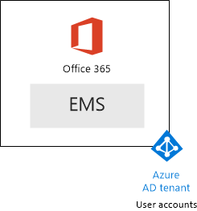

# <a name="the-microsoft-365-enterprise-devtest-environment"></a><span data-ttu-id="ca7b0-103">El entorno de pruebas y desarrollo empresarial de Microsoft 365</span><span class="sxs-lookup"><span data-stu-id="ca7b0-103">The Microsoft 365 Enterprise dev/test environment</span></span>

 <span data-ttu-id="ca7b0-104">**Resumen:** Utilice a esta guía de laboratorio de prueba para crear un entorno de pruebas y desarrollo que incluye Office 365 E5, movilidad en la empresa + E5 de seguridad (EMS) y un equipo que ejecuta Windows 10 Enterprise.</span><span class="sxs-lookup"><span data-stu-id="ca7b0-104">**Summary:** Use this Test Lab Guide to create a dev/test environment that includes Office 365 E5, Enterprise Mobility + Security (EMS) E5, and a computer running Windows 10 Enterprise.</span></span>
  
<span data-ttu-id="ca7b0-105">Este artículo proporciona instrucciones paso a paso para crear un entorno simplificado para probar las características y funciones de [Empresa de Microsoft 365](https://www.microsoft.com/microsoft-365/enterprise).</span><span class="sxs-lookup"><span data-stu-id="ca7b0-105">This article provides you with step-by-step instructions to create a simplified environment to test the features and functionality of [Microsoft 365 Enterprise](https://www.microsoft.com/microsoft-365/enterprise).</span></span>
  
## <a name="phase-1-create-your-office-365-e5-subscription"></a><span data-ttu-id="ca7b0-106">Fase 1: Crear tu suscripción a Office 365 E5</span><span class="sxs-lookup"><span data-stu-id="ca7b0-106">Phase 1: Create your Office 365 E5 subscription</span></span>

<span data-ttu-id="ca7b0-107">Siga los pasos de la fase 2 y 3 de la fase del [entorno de desarrollo y prueba de Office 365](office-365-dev-test-environment.md) para crear un entorno de pruebas y desarrollo ligero Office 365, como se muestra en la figura 1.</span><span class="sxs-lookup"><span data-stu-id="ca7b0-107">Follow the steps in Phase 2 and Phase 3 of [Office 365 dev/test environment](office-365-dev-test-environment.md) to create a lightweight Office 365 dev/test environment, as shown in Figure 1.</span></span>
  
<span data-ttu-id="ca7b0-108">**Figura 1: La suscripción a Office 365 E5 con sus cuentas de usuario y de los inquilinos de Azure de Active Directory (AD)**</span><span class="sxs-lookup"><span data-stu-id="ca7b0-108">**Figure 1: Your Office 365 E5 subscription with its Azure Active Directory (AD) tenant and user accounts**</span></span>


  
## <a name="phase-2-add-ems"></a><span data-ttu-id="ca7b0-110">Fase 2: Agregar EMS</span><span class="sxs-lookup"><span data-stu-id="ca7b0-110">Phase 2: Add EMS</span></span>

<span data-ttu-id="ca7b0-111">En esta fase, Inscríbase en la suscripción de prueba de EMS E5 y agregarlo a la misma organización que su suscripción de prueba de Office 365 E5.</span><span class="sxs-lookup"><span data-stu-id="ca7b0-111">In this phase, you sign up for the EMS E5 trial subscription and add it to the same organization as your Office 365 E5 trial subscription.</span></span>
  
<span data-ttu-id="ca7b0-112">En primer lugar, agregue la suscripción de prueba de EMS E5 y asignar una licencia de EMS a su cuenta de administrador global.</span><span class="sxs-lookup"><span data-stu-id="ca7b0-112">First, add the EMS E5 trial subscription and assign an EMS license to your global administrator account.</span></span>
  
1. <span data-ttu-id="ca7b0-p101">Con una instancia privada de un explorador de Internet, inicie sesión en el portal de Office 365 con sus credenciales de la cuenta de administrador global. Para obtener ayuda, visite [dónde puede iniciar sesión en Office 365](https://support.office.com/Article/Where-to-sign-in-to-Office-365-e9eb7d51-5430-4929-91ab-6157c5a050b4).</span><span class="sxs-lookup"><span data-stu-id="ca7b0-p101">With a private instance of an Internet browser, sign in to the Office 365 portal with your global administrator account credentials. For help, see [Where to sign in to Office 365](https://support.office.com/Article/Where-to-sign-in-to-Office-365-e9eb7d51-5430-4929-91ab-6157c5a050b4).</span></span>
    
2. <span data-ttu-id="ca7b0-115">Haga clic en el mosaico de **Admin** .</span><span class="sxs-lookup"><span data-stu-id="ca7b0-115">Click the **Admin** tile.</span></span>
    
3. <span data-ttu-id="ca7b0-116">En la ficha del **Centro de administración de Office** en el explorador, en la exploración de la izquierda, haga clic en **de facturación > adquirir servicios**.</span><span class="sxs-lookup"><span data-stu-id="ca7b0-116">On the **Office Admin center** tab in your browser, in the left navigation, click **Billing > Purchase services**.</span></span>
    
4. <span data-ttu-id="ca7b0-p102">En la página **Servicios de compra** , busque el elemento de **seguridad E5 + de movilidad en la empresa** . Sitúe el puntero del mouse sobre él y haga clic en **iniciar la versión de prueba gratuita**.</span><span class="sxs-lookup"><span data-stu-id="ca7b0-p102">On the **Purchase services** page, find the **Enterprise Mobility + Security E5** item. Hover your mouse pointer over it and click **Start free trial**.</span></span>
    
5. <span data-ttu-id="ca7b0-119">En la página **confirmar su pedido** , haga clic en **Probar ahora**.</span><span class="sxs-lookup"><span data-stu-id="ca7b0-119">On the **Confirm your order** page, click **Try now**.</span></span>
    
6. <span data-ttu-id="ca7b0-120">En la página de **confirmación del pedido** , haga clic en **continuar**.</span><span class="sxs-lookup"><span data-stu-id="ca7b0-120">On the **Order receipt** page, click **Continue**.</span></span>
    
7. <span data-ttu-id="ca7b0-121">En la ficha del **Centro de administración de Office 365** en el explorador, en la exploración de la izquierda, haga clic en **los usuarios > usuarios activos**.</span><span class="sxs-lookup"><span data-stu-id="ca7b0-121">On the **Office 365 Admin center** tab in your browser, in the left navigation, click **Users > Active users**.</span></span>
    
8. <span data-ttu-id="ca7b0-122">Haga clic en la cuenta de administrador global y, a continuación, haga clic en **Editar** para **licencias de producto**.</span><span class="sxs-lookup"><span data-stu-id="ca7b0-122">Click your global administrator account, and then click **Edit** for **Product licenses**.</span></span>
    
9. <span data-ttu-id="ca7b0-123">En el panel de **licencias de producto** , activar la licencia del producto de **movilidad en la empresa + seguridad E5** en **On**, haga clic en **Guardar** y, a continuación, haga clic en **Cerrar** dos veces.</span><span class="sxs-lookup"><span data-stu-id="ca7b0-123">On the **Product licenses** pane, turn the product license for **Enterprise Mobility + Security E5** to **On**, click **Save,** and then click **Close** twice.</span></span>
    
> [!NOTE]
> <span data-ttu-id="ca7b0-p103">La suscripción de prueba a Enterprise Mobility + Security E5 tiene una duración de 90 días. Si quiere usar un entorno de pruebas y desarrollo permanente, cree una nueva suscripción de pago con un número reducido de licencias.</span><span class="sxs-lookup"><span data-stu-id="ca7b0-p103">The Enterprise Mobility + Security E5 trial subscription is 90 days. For a permanent dev/test environment, create a new paid subscription with a small number of licenses.</span></span> 
  
 <span data-ttu-id="ca7b0-126">***Si ha completado la fase 3 de*** [Entorno de desarrollo y prueba de office 365](office-365-dev-test-environment.md) , repita los pasos 8 y 9 del procedimiento anterior para todas las cuentas (usuario 2, 3 de usuario, usuario 4 y 5 de usuario).</span><span class="sxs-lookup"><span data-stu-id="ca7b0-126">***If you completed Phase 3 of*** [Office 365 dev/test environment](office-365-dev-test-environment.md) , repeat steps 8 and 9 of the previous procedure for all of your other accounts (User 2, User 3, User 4, and User 5).</span></span>
  
<span data-ttu-id="ca7b0-127">Ahora tiene su entorno de pruebas y desarrollo:</span><span class="sxs-lookup"><span data-stu-id="ca7b0-127">Your dev/test environment now has:</span></span>
  
- <span data-ttu-id="ca7b0-128">Suscripciones de prueba de Office 365 E5 Enterprise y EMS que comparten la misma organización y el mismo inquilino de AD Azure con la lista de cuentas de usuario.</span><span class="sxs-lookup"><span data-stu-id="ca7b0-128">Office 365 E5 Enterprise and EMS trial subscriptions sharing the same organization and the same Azure AD tenant with your list of user accounts.</span></span>
    
- <span data-ttu-id="ca7b0-129">Todas las cuentas de usuario adecuado (sólo el administrador global o todas las cinco cuentas de usuario) están habilitadas para utilizar Office 365 E5 y E5 EMS.</span><span class="sxs-lookup"><span data-stu-id="ca7b0-129">All your appropriate user accounts (either just the global administrator or all five user accounts) are enabled to use Office 365 E5 and EMS E5.</span></span>
    
<span data-ttu-id="ca7b0-130">La figura 2 muestra la configuración resultante, que agrega EMS.</span><span class="sxs-lookup"><span data-stu-id="ca7b0-130">Figure 2 shows your resulting configuration, which adds EMS.</span></span>
  
<span data-ttu-id="ca7b0-131">**Figura 2: Agregar la suscripción de prueba de EMS**</span><span class="sxs-lookup"><span data-stu-id="ca7b0-131">**Figure 2: Adding the EMS trial subscription**</span></span>


  
## <a name="phase-3-create-a-windows-10-enterprise-computer"></a><span data-ttu-id="ca7b0-133">Fase 3: Crear un equipo de Windows 10 Enterprise</span><span class="sxs-lookup"><span data-stu-id="ca7b0-133">Phase 3: Create a Windows 10 Enterprise computer</span></span>

<span data-ttu-id="ca7b0-134">En esta fase, se crea un equipo independiente que ejecuta Windows 10 Enterprise.</span><span class="sxs-lookup"><span data-stu-id="ca7b0-134">In this phase, you create a standalone computer running Windows 10 Enterprise.</span></span>
  
### <a name="physical-computer"></a><span data-ttu-id="ca7b0-135">Equipo físico</span><span class="sxs-lookup"><span data-stu-id="ca7b0-135">Physical computer</span></span>

<span data-ttu-id="ca7b0-p104">Obtenga un equipo e instale Windows 10 Enterprise en él. Puede descargar el Windows 10 Enterprise prueba [aquí](https://www.microsoft.com/evalcenter/evaluate-windows-10-enterprise).</span><span class="sxs-lookup"><span data-stu-id="ca7b0-p104">Obtain a personal computer and install Windows 10 Enterprise on it. You can download the Windows 10 Enterprise trial [here](https://www.microsoft.com/evalcenter/evaluate-windows-10-enterprise).</span></span>
  
### <a name="virtual-machine"></a><span data-ttu-id="ca7b0-138">Máquina virtual</span><span class="sxs-lookup"><span data-stu-id="ca7b0-138">Virtual machine</span></span>

<span data-ttu-id="ca7b0-p105">Crear una máquina virtual utilizando el hipervisor de su elección e instale Windows 10 Enterprise en él. Puede descargar el Windows 10 Enterprise prueba [aquí](https://www.microsoft.com/evalcenter/evaluate-windows-10-enterprise).</span><span class="sxs-lookup"><span data-stu-id="ca7b0-p105">Create a virtual machine using the hypervisor of your choice and install Windows 10 Enterprise on it. You can download the Windows 10 Enterprise trial [here](https://www.microsoft.com/evalcenter/evaluate-windows-10-enterprise).</span></span>
  
### <a name="virtual-machine-in-azure"></a><span data-ttu-id="ca7b0-141">Máquina virtual en Azure</span><span class="sxs-lookup"><span data-stu-id="ca7b0-141">Virtual machine in Azure</span></span>

<span data-ttu-id="ca7b0-p106">Para crear una máquina virtual de Windows 10 en Azure de Microsoft, ***debe tener una suscripción basada en Visual Studio***, que tiene acceso a la imagen de Windows 10 Enterprise. Otros tipos de suscripciones de Azure, como suscripciones de prueba y de pagadas, no tienen acceso a esta imagen.</span><span class="sxs-lookup"><span data-stu-id="ca7b0-p106">To create a Windows 10 virtual machine in Microsoft Azure, ***you must have a Visual Studio-based subscription***, which has access to the image for Windows 10 Enterprise. Other types of Azure subscriptions, such as trial and paid subscriptions, do not have access to this image.</span></span>
  
> [!NOTE]
> <span data-ttu-id="ca7b0-p107">Los siguientes conjuntos de comandos utilizan la versión más reciente te de PowerShell de Azure. Consulte [Introducción a los cmdlets de PowerShell de Azure](https://docs.microsoft.com/powershell/azureps-cmdlets-docs/). Estos generación de conjuntos de una máquina virtual de Windows 10 Enterprise de comando denominado WIN10 y todos su infraestructura necesaria, incluyendo una red virtual, una cuenta de almacenamiento y un grupo de recursos. Si ya está familiarizado con los servicios de infraestructura de Azure, por favor adaptar estas instrucciones para adaptarse a la infraestructura implementada actualmente.</span><span class="sxs-lookup"><span data-stu-id="ca7b0-p107">The following command sets use te latest version of Azure PowerShell. See [Get started with Azure PowerShell cmdlets](https://docs.microsoft.com/powershell/azureps-cmdlets-docs/). These command sets build a Windows 10 Enterprise virtual machine named WIN10 and all of its required infrastructure, including a resource group, a storage account, and a virtual network. If you are already familiar with Azure infrastructure services, please adapt these instructions to suit your currently deployed infrastructure.</span></span> 
  
<span data-ttu-id="ca7b0-148">En primer lugar, inicie un símbolo del sistema de Microsoft PowerShell.</span><span class="sxs-lookup"><span data-stu-id="ca7b0-148">First, start a Microsoft PowerShell prompt.</span></span>
  
<span data-ttu-id="ca7b0-149">Inicie sesión en su cuenta de Azure con el siguiente comando.</span><span class="sxs-lookup"><span data-stu-id="ca7b0-149">Sign in to your Azure account with the following command.</span></span>
  
```
Login-AzureRMAccount
```

<span data-ttu-id="ca7b0-150">Obtenga su nombre de suscripción mediante el comando siguiente.</span><span class="sxs-lookup"><span data-stu-id="ca7b0-150">Get your subscription name using the following command.</span></span>
  
```
Get-AzureRMSubscription | Sort Name | Select Name
```

<span data-ttu-id="ca7b0-p108">Establecer su suscripción de Azure. Reemplace todo el contenido de las ofertas, incluyendo el \< y > caracteres, con el nombre correcto.</span><span class="sxs-lookup"><span data-stu-id="ca7b0-p108">Set your Azure subscription. Replace everything within the quotes, including the \< and > characters, with the correct name.</span></span>
  
```
$subscr="<subscription name>"
Get-AzureRmSubscription -SubscriptionName $subscr | Select-AzureRmSubscription
```

<span data-ttu-id="ca7b0-p109">Después, cree un nuevo grupo de recursos. Para determinar un nombre único de grupo de recursos, use este comando a fin de enumerar los grupos de recursos existentes.</span><span class="sxs-lookup"><span data-stu-id="ca7b0-p109">Next, create a new resource group. To determine a unique resource group name, use this command to list your existing resource groups.</span></span>
  
```
Get-AzureRMResourceGroup | Sort ResourceGroupName | Select ResourceGroupName
```

<span data-ttu-id="ca7b0-p110">Crear el nuevo grupo de recursos con estos comandos. Reemplace todo el contenido de las ofertas, incluyendo el \< y > caracteres, con los nombres correctos.</span><span class="sxs-lookup"><span data-stu-id="ca7b0-p110">Create your new resource group with these commands. Replace everything within the quotes, including the \< and > characters, with the correct names.</span></span>
  
```
$rgName="<resource group name>"
$locName="<location name, such as West US>"
New-AzureRMResourceGroup -Name $rgName -Location $locName
```

<span data-ttu-id="ca7b0-p111">Máquinas virtuales basadas en el Administrador de recursos requieren una cuenta de almacenamiento de información basado en el Administrador de recursos. Debe elegir un nombre único global para la cuenta de almacenamiento *contiene sólo letras minúsculas y números* . Puede utilizar este comando para enumerar las cuentas existentes de almacenamiento de información.</span><span class="sxs-lookup"><span data-stu-id="ca7b0-p111">Resource Manager-based virtual machines require a Resource Manager-based storage account. You must pick a globally unique name for your storage account  *that contains only lowercase letters and numbers*  . You can use this command to list the existing storage accounts.</span></span>
  
```
Get-AzureRMStorageAccount | Sort StorageAccountName | Select StorageAccountName
```

<span data-ttu-id="ca7b0-160">Use este comando para comprobar si los nombres de las cuenta de almacenamiento de información que se propongan son únicos o no.</span><span class="sxs-lookup"><span data-stu-id="ca7b0-160">Use this command to test whether a proposed storage account name is unique.</span></span>
  
```
Get-AzureRmStorageAccountNameAvailability "<proposed name>"
```

<span data-ttu-id="ca7b0-161">Cree una nueva cuenta de almacenamiento para su nuevo entorno de pruebas con estos comandos.</span><span class="sxs-lookup"><span data-stu-id="ca7b0-161">Create a new storage account for your new test environment with these commands.</span></span>
  
```
$rgName="<your new resource group name>"
$saName="<storage account name>"
$locName=(Get-AzureRmResourceGroup -Name $rgName).Location
New-AzureRMStorageAccount -Name $saName -ResourceGroupName $rgName -Type Standard_LRS -Location $locName
```

<span data-ttu-id="ca7b0-p112">A continuación, cree una nueva red virtual y la máquina virtual de WIN10 con estos comandos. Cuando se le pida, proporcione el nombre y la contraseña de la cuenta de administrador local para WIN10 y almacenarlos en una ubicación segura.</span><span class="sxs-lookup"><span data-stu-id="ca7b0-p112">Next, you create a new virtual network and the WIN10 virtual machine with these commands. When prompted, provide the name and password of the local administrator account for WIN10 and store these in a secure location.</span></span>
  
```
$corpnetSubnet=New-AzureRMVirtualNetworkSubnetConfig -Name Corpnet -AddressPrefix 10.0.0.0/24
New-AzureRMVirtualNetwork -Name "M365Ent-TestLab" -ResourceGroupName $rgName -Location $locName -AddressPrefix 10.0.0.0/8 -Subnet $corpnetSubnet
$rule1=New-AzureRMNetworkSecurityRuleConfig -Name "RDPTraffic" -Description "Allow RDP to all VMs on the subnet" -Access Allow -Protocol Tcp -Direction Inbound -Priority 100 -SourceAddressPrefix Internet -SourcePortRange * -DestinationAddressPrefix * -DestinationPortRange 3389
New-AzureRMNetworkSecurityGroup -Name Corpnet -ResourceGroupName $rgName -Location $locName -SecurityRules $rule1
$vnet=Get-AzureRMVirtualNetwork -ResourceGroupName $rgName -Name "M365Ent-TestLab"
$nsg=Get-AzureRMNetworkSecurityGroup -Name Corpnet -ResourceGroupName $rgName
Set-AzureRMVirtualNetworkSubnetConfig -VirtualNetwork $vnet -Name Corpnet -AddressPrefix "10.0.0.0/24" -NetworkSecurityGroup $nsg
$pip=New-AzureRMPublicIpAddress -Name WIN10-PIP -ResourceGroupName $rgName -Location $locName -AllocationMethod Dynamic
$nic=New-AzureRMNetworkInterface -Name WIN10-NIC -ResourceGroupName $rgName -Location $locName -SubnetId $vnet.Subnets[0].Id -PublicIpAddressId $pip.Id
$vm=New-AzureRMVMConfig -VMName WIN10 -VMSize Standard_D1_V2
$storageAcc=Get-AzureRMStorageAccount -ResourceGroupName $rgName -Name $saName
$cred=Get-Credential -Message "Type the name and password of the local administrator account for WIN10."
$vm=Set-AzureRMVMOperatingSystem -VM $vm -Windows -ComputerName WIN10 -Credential $cred -ProvisionVMAgent -EnableAutoUpdate
$vm=Set-AzureRMVMSourceImage -VM $vm -PublisherName MicrosoftVisualStudio -Offer Windows -Skus Windows-10-N-x64 -Version "latest"
$vm=Add-AzureRMVMNetworkInterface -VM $vm -Id $nic.Id
$osDiskUri=$storageAcc.PrimaryEndpoints.Blob.ToString() + "vhds/WIN10-TestLab-OSDisk.vhd"
$vm=Set-AzureRMVMOSDisk -VM $vm -Name WIN10-TestLab-OSDisk -VhdUri $osDiskUri -CreateOption fromImage
New-AzureRMVM -ResourceGroupName $rgName -Location $locName -VM $vm
```

## <a name="phase-4-join-your-windows-10-computer-to-azure-ad"></a><span data-ttu-id="ca7b0-164">Fase 4: Unir el equipo Windows 10 a Azure AD</span><span class="sxs-lookup"><span data-stu-id="ca7b0-164">Phase 4: Join your Windows 10 computer to Azure AD</span></span>

<span data-ttu-id="ca7b0-165">Después de la máquina física o virtual creada, configurado con Windows Enterprise de 10 y se está ejecutando, inicie sesión con una cuenta de administrador local.</span><span class="sxs-lookup"><span data-stu-id="ca7b0-165">After the physical or virtual machine is created, configured with Windows 10 Enterprise, and is running, sign in with a local administrator account.</span></span>
  
> [!NOTE]
> <span data-ttu-id="ca7b0-p113">Para una máquina virtual en Azure, conectarse a ella mediante [estas instrucciones](https://docs.microsoft.com/azure/virtual-machines/windows/connect-logon). Inicie sesión con las credenciales de la cuenta de administrador local.</span><span class="sxs-lookup"><span data-stu-id="ca7b0-p113">For a virtual machine in Azure, connect to it using [these instructions](https://docs.microsoft.com/azure/virtual-machines/windows/connect-logon). Sign in with the credentials of the local administrator account.</span></span> 
  
<span data-ttu-id="ca7b0-168">A continuación, unir el equipo de WIN10 a los inquilinos de Azure AD de sus suscripciones a Office 365 y EMS.</span><span class="sxs-lookup"><span data-stu-id="ca7b0-168">Next, join the WIN10 computer to the Azure AD tenant of your Office 365 and EMS subscriptions.</span></span>
  
1. <span data-ttu-id="ca7b0-169">En el escritorio del equipo WIN10, haga clic en **Inicio > Configuración > cuentas > acceso trabajo o la escuela > conectar**.</span><span class="sxs-lookup"><span data-stu-id="ca7b0-169">At the desktop of the WIN10 computer, click **Start > Settings > Accounts > Access work or school > Connect**.</span></span>
    
2. <span data-ttu-id="ca7b0-170">En el cuadro de diálogo **Configurar una cuenta de trabajo o escuela** , haga clic en **unirse a este dispositivo a Azure Active Directory**.</span><span class="sxs-lookup"><span data-stu-id="ca7b0-170">In the **Set up a work or school account** dialog box, click **Join this device to Azure Active Directory**.</span></span>
    
3. <span data-ttu-id="ca7b0-171">En **trabajo o escuela cuenta**, escriba el nombre de la cuenta de administrador global de la suscripción a Office 365 y, a continuación, haga clic en **siguiente**.</span><span class="sxs-lookup"><span data-stu-id="ca7b0-171">In **Work or school account**, type the global administrator account name of your Office 365 subscription, and then click **Next**.</span></span>
    
4. <span data-ttu-id="ca7b0-172">En **Escriba la contraseña**, escriba la contraseña de la cuenta de administrador global y, a continuación, haga clic en **iniciar sesión**.</span><span class="sxs-lookup"><span data-stu-id="ca7b0-172">In **Enter password**, type the password for your global administrator account, and then click **Sign in**.</span></span>
    
5. <span data-ttu-id="ca7b0-173">Cuando se le pida para asegurarse de que se trata de su organización, haga clic en **unirse**y, a continuación, haga clic en **Listo**.</span><span class="sxs-lookup"><span data-stu-id="ca7b0-173">When prompted to make sure this is your organization, click **Join**, and then click **Done**.</span></span>
    
6. <span data-ttu-id="ca7b0-174">Cierre la ventana de configuración.</span><span class="sxs-lookup"><span data-stu-id="ca7b0-174">Close the settings window.</span></span>
    
<span data-ttu-id="ca7b0-175">A continuación, instale Office 2016 en el equipo de WIN10</span><span class="sxs-lookup"><span data-stu-id="ca7b0-175">Next, install Office 2016 on the WIN10 computer</span></span>
  
1. <span data-ttu-id="ca7b0-p114">Abra el Explorador de Microsoft Edge e inicie sesión en el portal de Office 365 con sus credenciales de la cuenta de administrador global. Para obtener ayuda, visite [dónde puede iniciar sesión en Office 365](https://support.office.com/Article/Where-to-sign-in-to-Office-365-e9eb7d51-5430-4929-91ab-6157c5a050b4).</span><span class="sxs-lookup"><span data-stu-id="ca7b0-p114">Open the Microsoft Edge browser and sign in to the Office 365 portal with your global administrator account credentials. For help, see [Where to sign in to Office 365](https://support.office.com/Article/Where-to-sign-in-to-Office-365-e9eb7d51-5430-4929-91ab-6157c5a050b4).</span></span>
    
2. <span data-ttu-id="ca7b0-178">En la ficha **Página de inicio de Microsoft Office** , haga clic en **instalar Office 2016**.</span><span class="sxs-lookup"><span data-stu-id="ca7b0-178">On the **Microsoft Office Home** tab, click **Install Office 2016**.</span></span>
    
3. <span data-ttu-id="ca7b0-179">Cuando se le pregunte qué hacer, haga clic en **Ejecutar**y, a continuación, haga clic en **Sí** para el **Control de cuentas de usuario**.</span><span class="sxs-lookup"><span data-stu-id="ca7b0-179">When prompted with what to do, click **Run**, and then click **Yes** for **User Account Control**.</span></span>
    
4. <span data-ttu-id="ca7b0-p115">Espere a que Office completar su instalación. Cuando vea **está todo listo!**, haga clic en **Cerrar** dos veces.</span><span class="sxs-lookup"><span data-stu-id="ca7b0-p115">Wait for Office to complete its installation. When you see **You're all set!**, click **Close** twice.</span></span>
    
<span data-ttu-id="ca7b0-182">La figura 3 muestra el entorno resultante, que incluye el equipo de WIN10 que se ha unido al inquilino Azure AD de sus suscripciones a Office 365 y EMS.</span><span class="sxs-lookup"><span data-stu-id="ca7b0-182">Figure 3 shows your resulting environment, which includes the WIN10 computer that has joined the Azure AD tenant of your Office 365 and EMS subscriptions.</span></span>
  
<span data-ttu-id="ca7b0-183">**Figura 3: Agregar la cuenta de equipo WIN10 a los inquilinos de Azure AD**</span><span class="sxs-lookup"><span data-stu-id="ca7b0-183">**Figure 3: Adding the WIN10 computer account to the Azure AD tenant**</span></span>


  
<span data-ttu-id="ca7b0-185">Ahora está listo para probar otras características de [Empresa de Microsoft 365](https://www.microsoft.com/microsoft-365/enterprise).</span><span class="sxs-lookup"><span data-stu-id="ca7b0-185">You are now ready to experiment with additional features of [Microsoft 365 Enterprise](https://www.microsoft.com/microsoft-365/enterprise).</span></span>
  
## <a name="next-steps"></a><span data-ttu-id="ca7b0-186">Pasos siguientes</span><span class="sxs-lookup"><span data-stu-id="ca7b0-186">Next steps</span></span>

<span data-ttu-id="ca7b0-187">Uso de estos artículos adicionales para explorar las características de empresa de Microsoft 365:</span><span class="sxs-lookup"><span data-stu-id="ca7b0-187">Use these additional articles to explore features of Microsoft 365 Enterprise:</span></span>
  
- [<span data-ttu-id="ca7b0-188">Agregar directivas de aplicación móvil management (MAM)</span><span class="sxs-lookup"><span data-stu-id="ca7b0-188">Add mobile application management (MAM) policies</span></span>](https://technet.microsoft.com/library/mt764059.aspx)
    
- [<span data-ttu-id="ca7b0-189">Inscribir a dispositivos iOS y Android</span><span class="sxs-lookup"><span data-stu-id="ca7b0-189">Enroll iOS and Android devices</span></span>](https://technet.microsoft.com/library/mt743077.aspx)
    
- [<span data-ttu-id="ca7b0-190">Configurar y probar la administración de seguridad avanzada</span><span class="sxs-lookup"><span data-stu-id="ca7b0-190">Configure and test Advanced Security Management</span></span>](https://technet.microsoft.com/library/mt757250.aspx)
    
- [<span data-ttu-id="ca7b0-191">Configurar y probar la avanzada protección frente a amenazas</span><span class="sxs-lookup"><span data-stu-id="ca7b0-191">Configure and test Advanced Threat Protection</span></span>](https://technet.microsoft.com/library/mt490479.aspx)
    
## <a name="see-also"></a><span data-ttu-id="ca7b0-192">Consulte también</span><span class="sxs-lookup"><span data-stu-id="ca7b0-192">See Also</span></span>

[<span data-ttu-id="ca7b0-193">El entorno de desarrollo y prueba de una nube de Microsoft</span><span class="sxs-lookup"><span data-stu-id="ca7b0-193">The One Microsoft Cloud dev/test environment</span></span>](the-one-microsoft-cloud-dev-test-environment.md)

[<span data-ttu-id="ca7b0-194">Documentación de Microsoft 365 Enterprise</span><span class="sxs-lookup"><span data-stu-id="ca7b0-194">Microsoft 365 Enterprise documentation</span></span>](https://docs.microsoft.com/microsoft-365-enterprise/)


