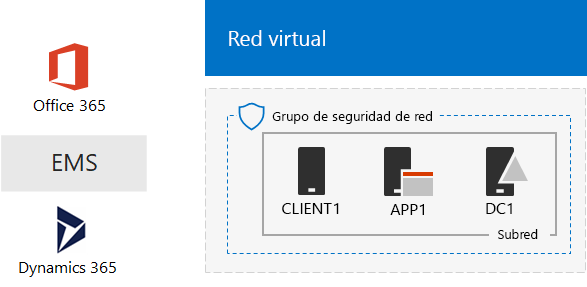
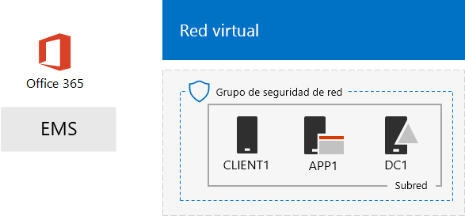

# El entorno de desarrollo y pruebas de One Microsoft Cloud

 **Resumen:** use esta guía del entorno de pruebas para crear un entorno de desarrollo y pruebas donde se incluyan todas las ofertas de la nube de Microsoft.
  
Con las instrucciones que aparecen en este artículo, creará una intranet simulada en los servicios de infraestructura de Microsoft Azure y, después, agregará suscripciones de Microsoft Office 365, Microsoft Enterprise Mobility + Security (EMS) y Microsoft Dynamics 365. El resultado es una organización simplificada que usa todas las ofertas de la nube de Microsoft al mismo tiempo en un único entorno de desarrollo y pruebas. 
  

  
Puede usar la configuración resultante para:
  
- Probar la integración en las ofertas de la nube de Microsoft, como la infraestructura de identidades común proporcionada por Azure Active Directory (AD).
    
- Evaluar los escenarios integrales donde se incluyen varias ofertas de Microsoft Cloud.
    
- Crear una demostración, una prueba de concepto o una configuración de desarrollo y pruebas donde se usen varias ofertas de Microsoft Cloud.
    
- Mejorar sus aptitudes de Microsoft Cloud para el desarrollo profesional.
    
## Fase 1: Crear una intranet simulada y agregar Office 365

Siga las instrucciones que se indican en [DirSync para el entorno de desarrollo y pruebas de Office 365](dirsync-for-your-office-365-dev-test-environment.md).
  
En la ilustración 1, se muestra la configuración resultante, donde se incluye Office 365 y una intranet simulada que se ejecuta en los servicios de infraestructura de Azure y la sincronización de directorios desde un bosque local de Windows Server Active Directory (AD).
  
**Ilustración 1: La intranet simulada en Azure con Office 365**

  
> [!NOTE]
> La prueba de Azure dura 30 días. La suscripción de prueba de Office 365 Enterprise E5 dura 30 días y se puede ampliar fácilmente durante otros 30 días. Para obtener un entorno de desarrollo y pruebas permanente, cree una suscripción de Azure de pago y una suscripción de Office 365 Enterprise E5 con un número reducido de licencias. 
  
## Fase 2: Agregar EMS

En esta fase, se inscribirá en la suscripción de prueba de EMS y la agregará a la misma organización que su suscripción de prueba de Office 365.
  
1. Con un explorador con un equipo de escritorio o desde CLIENTE1, inicie sesión en el portal de Office 365 en [https://portal.office.com](https://portal.office.com) con las credenciales de la cuenta de administrador global.
    
2. Haga clic en el icono **Administración**.
    
3. En la pestaña **Centro de administración de Office** del explorador, en el panel de navegación izquierdo, haga clic en **Facturación > Servicios de compra**.
    
4. En la página **Servicios de compra**, busque el elemento **Enterprise Mobility + Security E5**. Mantenga el puntero del mouse sobre ese elemento y haga clic en **Iniciar prueba gratuita**.
    
5. En la página **Confirmar pedido**, haga clic en **Probar ahora**.
    
6. En la página **Recibo del pedido**, haga clic en **Continuar**.
    
> [!NOTE]
> La suscripción de prueba a Enterprise Mobility + Security E5 tiene una duración de 90 días. Si quiere usar un entorno de pruebas y desarrollo permanente, cree una nueva suscripción de pago con un número reducido de licencias. 
  
Después, habilite la licencia de Enterprise Mobility + Security E5 para todas las cuentas de usuario.
  
1. En la pestaña **Centro de administración de Office 365** del explorador, en el panel de navegación izquierdo, haga clic en **Usuarios > Usuarios activos**.
    
2. Haga clic en la cuenta de administrador global y, después, en **Editar** para **Licencias de productos**.
    
3. En el panel **Licencias de productos**, cambie la licencia del producto de **Enterprise Mobility + Security E5** a **Activada**, seleccione **Guardar** y, después, haga clic en **Cerrar** dos veces.
    
4. Para el resto de sus cuentas (Usuario 1, Usuario 2, Usuario 3, Usuario 4 y Usuario 5), complete los pasos 2 y 3.
    
Ahora, su entorno de desarrollo y pruebas tiene:
  
- Una intranet simulada donde se ejecutan servicios de infraestructura de Azure.
    
- Suscripciones de prueba de Office 365 E5 Enterprise y EMS que comparten la misma organización y el mismo inquilino de AD Azure con la lista de cuentas de usuario.
    
- Todas las cuentas de usuario habilitadas para usar Office 365 Enterprise E5 y EMS.
    
En la ilustración 2, se muestra la configuración resultante, que agrega EMS.
  
**Ilustración 2: La intranet simulada en Azure con Office 365 y EMS**

  
## Fase 3: Agregar Dynamics 365

En esta fase, se registrará en la suscripción de prueba a Dynamics 365 y la agregará a la misma organización que su suscripción de prueba a Office 365 y EMS.
  
1. Con un explorador con un equipo de escritorio o desde CLIENTE1, inicie sesión en el portal de Office 365 en [https://portal.office.com](https://portal.office.com) con las credenciales de la cuenta de administrador global.
    
2. Haga clic en el icono **Administración**.
    
3. En la pestaña **Centro de administración de Office**, en el panel de navegación izquierdo, haga clic en **Facturación > Servicios de compra**.
    
4. En la página **Servicios de compra**, busque el elemento **Dynamics 365 (plan 1) Enterprise Edition**. Mantenga el puntero del mouse sobre ese elemento y haga clic en **Iniciar prueba gratuita**.
    
5. En la página **Confirmar pedido**, haga clic en **Probar ahora**.
    
6. En la página **Recibo del pedido**, haga clic en **Continuar**.
    
> [!NOTE]
> La suscripción de prueba de Dynamics 365 Plan 1 Enterprise Edition es de 30 días. Puede extender fácilmente la suscripción de prueba otros 30 días. Para un entorno de pruebas y desarrollo permanente, cree una nueva suscripción de pago con un número reducido de licencias. 
  
Siga este procedimiento para asignar las licencias de Dynamics 365 al administrador global y a las cuentas Usuario 2 y Usuario 3, y los hará administradores del sistema.
  
1. En la pestaña **Centro de administración de Office**, haga clic en **Usuarios > Usuarios activos**.
    
2. En la lista de usuarios activos, haga clic en su cuenta de administrador global y, después, haga clic en **Editar** en **Licencias de productos**.
    
3. 	En el panel **Licencias de productos**, cambie la licencia del producto de **Dynamics 365 (plan 1) Enterprise Edition** a **Activada**, seleccione **Guardar** y, después, haga clic en **Cerrar** dos veces.
    
4. Realice los pasos 2 y 3 para las cuentas Usuario 2 y Usuario 3.
    
5. Cierre la pestaña **Centro de administración de Office**.
    
Siga estos pasos para configurar las cuentas Usuario 2 y Usuario 3 como administradores del sistema de Dynamics 365.
  
1. En la pestaña **Centro de administración de Office** en el explorador, en el panel de navegación izquierdo, haga clic en **Centros de administración** y, después, seleccione **Dynamics 365**.
    
    Es posible que tenga que esperar hasta que finalice el aprovisionamiento de Dynamics 365 para que este aparezca en el menú.
    
2. En la pestaña Dynamics 365, haga clic en **Todos estos** y, después, en **Finalizar configuración**.
    
    Espere a que se complete la configuración.
    
    Cuando se complete la configuración, se mostrará un Panel de actividad de ventas basado en datos de ejemplo que forman parte de la suscripción de prueba. Dedique unos minutos a ver el vídeo **Bienvenido a la prueba**. Cuando se complete, cierra la ventana del vídeo.
    
3. En la barra de herramientas de la parte superior, haga clic en la flecha abajo junto a **Ventas**, seleccione **Configuración** y, después, haga clic en **Seguridad**.
    
4. En la página **Seguridad**, haga clic en **Usuarios**.
    
5. En la lista de usuarios, haga clic en **Usuario 2**.
    
6. En la barra de herramientas, haga clic en **Administrar roles**.
    
7. En **Administrar roles**, haga clic en **Administrador del sistema** y, después, en **Aceptar**.
    
8. En la barra de herramientas de la parte superior, haga clic en **Seguridad**.
    
9. Repita los pasos del 5 al 8 para la cuenta Usuario 3.
    
10. Cierre la pestaña **Usuario: Usuario3**.
    
> [!NOTE]
> El rol de administrador del sistema de Dynamics 365 se asignó automáticamente a su cuenta de administrador global de Office 365. 
  
Ahora, su entorno de desarrollo y pruebas tiene:
  
- Una intranet simulada donde se ejecutan servicios de infraestructura de Azure.
    
- Suscripciones de prueba de Office 365 Enterprise E5, EMS y Dynamics 365 que comparten la misma organización y el mismo espacio empresarial de Azure AD con su lista de cuentas de usuario.
    
- Todas las cuentas de usuario habilitadas para usar Office 365 Enterprise E5 y EMS.
    
- Sus cuentas de administrador de la organización global, Usuario 2 y Usuario 3 están habilitadas para usar Dynamics 365 y son administradores del sistema de Dynamics 365.
    
En la ilustración 3, se muestra la configuración resultante.
  
**Ilustración 3: La intranet simulada en Azure con Office 365, EMS y Dynamics 365**

  
## Pasos siguientes

Ahora puede experimentar con el entorno de desarrollo y pruebas de One Microsoft Cloud. Aquí contra algunas ideas para experiencias guiadas:
  
- [Configurar directivas de administración de aplicaciones móviles (MAM) en EMS para aplicaciones de Office 365](https://technet.microsoft.com/library/mt764059.aspx)
    
- [Demostrar Exchange Online en la integración de Office 365 con contactos de Dynamics 365](https://technet.microsoft.com/library/mt798313.aspx)
    
- [Crear una red entre locales simulada en los servicios de infraestructura de Azure para hospedar cargas de trabajo basadas en servidor](https://technet.microsoft.com/library/mt745150.aspx)
    
## Vea también

[Guías del entorno de pruebas de adopción de la nube (TLG)](cloud-adoption-test-lab-guides-tlgs.md)
  
[Recursos de arquitectura de TI de Microsoft Cloud](microsoft-cloud-it-architecture-resources.md)
  
[Soluciones híbridas](hybrid-solutions.md)
  
[Soluciones de seguridad](security-solutions.md)

