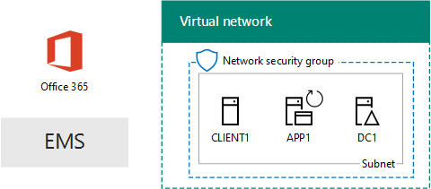

# El entorno de desarrollo y prueba de una nube de Microsoft

 **Resumen:** Utilice a esta guía de laboratorio de prueba para crear un entorno de pruebas y desarrollo que incluye todas las ofertas de nube de Microsoft.
  
Con las instrucciones de este artículo, crear una intranet simulada en los servicios de infraestructura de Microsoft Azure y luego agregar Microsoft Office 365, Microsoft Enterprise Mobility + seguridad (EMS) y Microsoft Dynamics 365 suscripciones. El resultado es una organización simplificada que utiliza las ofertas de nube de Microsoft todas al mismo tiempo en un entorno de pruebas y desarrollo único. 
  

  
Puede utilizar la configuración resultante al:
  
- Experimente la integración a través de ofertas de nube de Microsoft, tales como la infraestructura de identidad común proporcionada por Azure Active Directory (AD).
    
- Evaluar escenarios de end-to-end que incluyen múltiples ofertas de Microsoft Cloud.
    
- Crear una demostración, prueba de concepto o configuración de pruebas y desarrollo que utiliza múltiples ofertas de Microsoft Cloud.
    
- Desarrollará sus habilidades de Microsoft Cloud para desarrollo profesional.
    
## Fase 1: Crear una intranet simulada y agregar Office 365

Siga las instrucciones de [sincronización de directorios para el entorno de desarrollo y prueba de Office 365](dirsync-for-your-office-365-dev-test-environment.md).
  
La figura 1 muestra la configuración resultante, que incluye Office 365 y una intranet simulada ejecutando en servicios de infraestructura de Azure y sincronización de directorios desde un bosque de Windows Server Active Directory (AD) local.
  
**Figura 1: La intranet simulada en Azure con Office 365**

  
> [!NOTE]
> La versión de prueba de Azure es de 30 días. La suscripción de prueba de Office 365 Enterprise E5 es 30 días, que se puede extender fácilmente para otro 30 días. Para un entorno de pruebas y desarrollo permanente, crear un nuevo pagado suscripción de Azure y una nueva suscripción de Office 365 Enterprise E5 pagada con un número pequeño de licencias. 
  
## Fase 2: Agregar EMS

En esta fase, se inscribirá en la suscripción de prueba de EMS y la agregará a la misma organización que su suscripción de prueba de Office 365.
  
1. Con un explorador ya sea el equipo de escritorio o desde CLIENTE1, iniciar sesión en el portal de Office 365 en [https://portal.office.com](https://portal.office.com) con las credenciales de la cuenta de administrador global.
    
2. Haga clic en el mosaico de **Admin** .
    
3. En la ficha del **Centro de administración de Office** en el explorador, en la exploración de la izquierda, haga clic en **de facturación > adquirir servicios**.
    
4. En la página **Servicios de compra** , busque el elemento de **seguridad E5 + de movilidad en la empresa** . Sitúe el puntero del mouse sobre él y haga clic en **iniciar la versión de prueba gratuita**.
    
5. En la página **confirmar su pedido** , haga clic en **Probar ahora**.
    
6. En la página de **confirmación del pedido** , haga clic en **continuar**.
    
> [!NOTE]
> La suscripción de prueba a Enterprise Mobility + Security E5 tiene una duración de 90 días. Si quiere usar un entorno de pruebas y desarrollo permanente, cree una nueva suscripción de pago con un número reducido de licencias. 
  
A continuación, habilitar la movilidad en la empresa + licencia E5 de seguridad para todas las cuentas de usuario.
  
1. En la ficha del **Centro de administración de Office 365** en el explorador, en la exploración de la izquierda, haga clic en **los usuarios > usuarios activos**.
    
2. Haga clic en la cuenta de administrador global y, a continuación, haga clic en **Editar** para **licencias de producto**.
    
3. En el panel de **licencias de producto** , activar la licencia del producto de **movilidad en la empresa + seguridad E5** en **On**, haga clic en **Guardar** y, a continuación, haga clic en **Cerrar** dos veces.
    
4. Para el resto de sus cuentas (Usuario 1, Usuario 2, Usuario 3, Usuario 4 y Usuario 5), complete los pasos 2 y 3.
    
Ahora tiene su entorno de pruebas y desarrollo:
  
- Intranet simulada que se ejecutan en servicios de infraestructura de Azure.
    
- Suscripciones de prueba de Office 365 E5 Enterprise y EMS que comparten la misma organización y el mismo inquilino de AD Azure con la lista de cuentas de usuario.
    
- Todas las cuentas de usuario habilitadas para usar Office 365 E5 Enterprise y EMS.
    
La figura 2 muestra la configuración resultante, que agrega EMS.
  
**Figura 2: La intranet simulada en Azure con Office 365 y EMS**

  
## Fase 3: Agregar Dynamics 365

En esta fase, Inscríbase en la suscripción de prueba de Dynamics 365 y agregarlo a la misma organización que las suscripciones de prueba de Office 365 y EMS.
  
1. Con un navegador desde ya sea el equipo de escritorio o desde CLIENTE1, iniciar sesión en el portal de Office 365 en [https://portal.office.com](https://portal.office.com) con las credenciales de la cuenta de administrador global.
    
2. Haga clic en el mosaico de **Admin** .
    
3. En la ficha del **Centro de administración de Office** , en la exploración de la izquierda, haga clic en **de facturación > adquirir servicios**.
    
4. En la página **Servicios de compra** , busque el elemento **Dynamics 365 Plan 1 Enterprise Edition** . Sitúe el puntero del mouse sobre él y haga clic en **iniciar la versión de prueba gratuita**.
    
5. En la página **confirmar su pedido** , haga clic en **Probar ahora**.
    
6. En la página de **confirmación del pedido** , haga clic en **continuar**.
    
> [!NOTE]
> La suscripción de prueba de Dynamics 365 Plan 1 Enterprise Edition es de 30 días. Puede extender fácilmente la suscripción de prueba otros 30 días. Para un entorno de pruebas y desarrollo permanente, cree una nueva suscripción de pago con un número reducido de licencias. 
  
Utilice estos pasos para asignar licencias Dynamics 365 para el administrador global, 2 de usuario y cuentas de usuario 3 y hacer que los administradores del sistema.
  
1. En la ficha del **Centro de administración de Office** , haga clic en **los usuarios > usuarios activos**.
    
2. En la lista de usuarios activos, haga clic en la cuenta de administrador global y, a continuación, haga clic en **Editar** para **licencias de producto**.
    
3. En el panel de **licencias de producto** , activar la licencia del producto para **Dynamics 365 Plan 1 Enterprise Edition** **en**, haga clic en **Guardar** y, a continuación, haga clic en **Cerrar** dos veces.
    
4. Realice los pasos 2 y 3 para las cuentas Usuario 2 y Usuario 3.
    
5. Cierre la ficha de **Centro de administración de Office** .
    
Siga estos pasos para configurar las cuentas Usuario 2 y Usuario 3 como administradores del sistema de Dynamics 365.
  
1. En la ficha del **Centro de administración de Office** en el explorador, en la exploración de la izquierda, haga clic en **centros de Admin**y, a continuación, haga clic en **Dynamics 365**.
    
    Es posible que deba esperar a que finalice el aprovisionamiento de Dynamics 365 para que este aparezca en el menú.
    
2. En la ficha de Dynamics 365, haga clic en **todos ellos**y, a continuación, haga clic en **Finalizar la instalación.**
    
    Espere a que se complete la configuración.
    
    Cuando finalice la instalación, se muestra un panel de actividad de ventas basándose en datos de ejemplo que es parte de la suscripción de la pista. Tardar unos minutos para ver el **Bienvenido a la versión de prueba** de vídeo. Cierre la ventana de vídeo cuando haya terminado.
    
3. En la barra de herramientas en la parte superior, haga clic en la flecha abajo situada junto a la **venta**, haga clic en **configuración**y, a continuación, haga clic en **seguridad**.
    
4. En la página **seguridad** , haga clic en **usuarios**.
    
5. En la lista de usuarios, haga clic en **usuario 2**.
    
6. En la barra de herramientas, haga clic en **Administrar funciones**.
    
7. En **Administrar Roles**, haga clic en **Administrador del sistema**y, a continuación, haga clic en **Aceptar**.
    
8. En la barra de herramientas en la parte superior, haga clic en **seguridad**.
    
9. Repita los pasos del 5 al 8 para la cuenta Usuario 3.
    
10. Cerrar la **usuario: usuario3** ficha.
    
> [!NOTE]
> El rol de administrador del sistema de Dynamics 365 se asignó automáticamente a su cuenta de administrador global de Office 365. 
  
Ahora tiene su entorno de pruebas y desarrollo:
  
- Intranet simulada que se ejecutan en servicios de infraestructura de Azure.
    
- Office 365 E5 Enterprise, EMS y Dynamics 365 suscripciones de prueba compartiendo la misma organización y el mismo inquilino AD Azure con la lista de cuentas de usuario.
    
- Todas las cuentas de usuario habilitadas para usar Office 365 E5 Enterprise y EMS.
    
- El administrador global de empresa, 2 de usuario y cuentas de usuario 3 están habilitadas para utilizar Dynamics 365 y son administradores del sistema Dynamics 365.
    
La figura 3 muestra la configuración resultante.
  
**Figura 3: La intranet simulada en Azure con Office 365, EMS y Dynamics 365**

  
## Siguientes pasos

Ahora puede experimentar con el entorno de desarrollo y prueba de una nube de Microsoft. Aquí tiene algunas ideas para la experiencia guiada:
  
- [Configurar directivas de administración (MAM) de la aplicación móvil de EMS para aplicaciones de Office 365](https://technet.microsoft.com/library/mt764059.aspx)
    
- [Demostrar Exchange Online en Office 365 integración con contactos de Dynamics 365](https://technet.microsoft.com/library/mt798313.aspx)
    
- [Crear una red local entre simulado en servicios de infraestructura de Azure para alojar las cargas de trabajo basado en servidor](https://technet.microsoft.com/library/mt745150.aspx)
    
## Consulte también

[Guías de entorno de pruebas de adopción de la nube (TLG)](cloud-adoption-test-lab-guides-tlgs.md)
  
[Recursos de arquitectura de TI de la nube de Microsoft](microsoft-cloud-it-architecture-resources.md)
  
[Soluciones híbridas](hybrid-solutions.md)
  
[Soluciones de seguridad](security-solutions.md)

