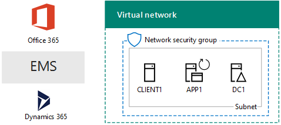

# El entorno de desarrollo y prueba de una nube de MicrosoftThe One Microsoft Cloud dev/test environment

 **Resumen:** Utilice a esta guía de laboratorio de prueba para crear un entorno de pruebas y desarrollo que incluye todas las ofertas de nube de Microsoft.**Summary:** Use this Test Lab Guide to create a dev/test environment that includes all of Microsoft's cloud offerings.
  
Con las instrucciones de este artículo, crear una intranet simulada en los servicios de infraestructura de Microsoft Azure y luego agregar Microsoft Office 365, Microsoft Enterprise Mobility + seguridad (EMS) y Microsoft Dynamics 365 suscripciones. El resultado es una organización simplificada que utiliza las ofertas de nube de Microsoft todas al mismo tiempo en un entorno de pruebas y desarrollo único.With the instructions in this article, you create a simulated intranet in Microsoft Azure infrastructure services and then add Microsoft Office 365, Microsoft Enterprise Mobility + Security (EMS), and Microsoft Dynamics 365 subscriptions. The result is a simplified organization that uses all Microsoft's cloud offerings at the same time in a single dev/test environment. 
  

  
Puede utilizar la configuración resultante al:You can use the resulting configuration to:
  
- Experimente la integración a través de ofertas de nube de Microsoft, tales como la infraestructura de identidad común proporcionada por Azure Active Directory (AD).Experience the integration across Microsoft's cloud offerings, such as the common identity infrastructure provided by Azure Active Directory (AD).
    
- Evaluar escenarios de end-to-end que incluyen múltiples ofertas de Microsoft Cloud.Evaluate end-to-end scenarios that include multiple Microsoft Cloud offerings.
    
- Crear una demostración, prueba de concepto o configuración de pruebas y desarrollo que utiliza múltiples ofertas de Microsoft Cloud.Create a demo, proof-of-concept, or dev/test configuration that uses multiple Microsoft Cloud offerings.
    
- Desarrollará sus habilidades de Microsoft Cloud para desarrollo profesional.Build your Microsoft Cloud skills for professional development.
    
## Fase 1: Crear una intranet simulada y agregar Office 365Phase 1: Create a simulated intranet and add Office 365

Siga las instrucciones de [sincronización de directorios para el entorno de desarrollo y prueba de Office 365](dirsync-for-your-office-365-dev-test-environment.md).Follow the instructions in [DirSync for your Office 365 dev/test environment](dirsync-for-your-office-365-dev-test-environment.md).
  
La figura 1 muestra la configuración resultante, que incluye Office 365 y una intranet simulada ejecutando en servicios de infraestructura de Azure y sincronización de directorios desde un bosque de Windows Server Active Directory (AD) local.Figure 1 shows your resulting configuration, which includes Office 365 and a simulated intranet running in Azure infrastructure services and directory synchronization from an on-premises Windows Server Active Directory (AD) forest.
  
**Figura 1: La intranet simulada en Azure con Office 365****Figure 1: The simulated intranet in Azure with Office 365**

  
> [!NOTE]
> La versión de prueba de Azure es de 30 días. La suscripción de prueba de Office 365 Enterprise E5 es 30 días, que se puede extender fácilmente para otro 30 días. Para un entorno de pruebas y desarrollo permanente, crear un nuevo pagado suscripción de Azure y una nueva suscripción de Office 365 Enterprise E5 pagada con un número pequeño de licencias.The Azure trial is 30 days. The Office 365 Enterprise E5 Trial subscription is 30 days, which can be easily extended for another 30 days. For a permanent dev/test environment, create a new paid Azure subscription and a new paid Office 365 Enterprise E5 subscription with a small number of licenses. 
  
## Fase 2: Agregar EMSPhase 2: Add EMS

En esta fase, se inscribirá en la suscripción de prueba de EMS y la agregará a la misma organización que su suscripción de prueba de Office 365.In this phase, you sign up for the EMS trial subscription and add it to the same organization as your Office 365 trial subscription.
  
1. Con un explorador ya sea el equipo de escritorio o desde CLIENTE1, iniciar sesión en el portal de Office 365 en [https://portal.office.com](https://portal.office.com) con las credenciales de la cuenta de administrador global.With a browser on either your desktop computer or from CLIENT1, sign in to the Office 365 portal at [https://portal.office.com](https://portal.office.com) with the credentials of your global administrator account.
    
2. Haga clic en el icono **Administración**.Click the **Admin** tile.
    
3. En la pestaña **Centro de administración de Office** del explorador, en el panel de navegación izquierdo, haga clic en **Facturación > Servicios de compra**.On the **Office Admin center** tab in your browser, in the left navigation, click **Billing > Purchase services**.
    
4. En la página **Servicios de compra** , busque el elemento de **seguridad E5 + de movilidad en la empresa** . Sitúe el puntero del mouse sobre él y haga clic en **iniciar la versión de prueba gratuita**.On the **Purchase services** page, find the **Enterprise Mobility + Security E5** item. Hover your mouse pointer over it and click **Start free trial**.
    
5. En la página **Confirmar pedido**, haga clic en **Probar ahora**.On the **Confirm your order** page, click **Try now**.
    
6. En la página **Recibo del pedido**, haga clic en **Continuar**.On the **Order receipt** page, click **Continue**.
    
> [!NOTE]
> La suscripción de prueba a Enterprise Mobility + Security E5 tiene una duración de 90 días. Si quiere usar un entorno de pruebas y desarrollo permanente, cree una nueva suscripción de pago con un número reducido de licencias.The Enterprise Mobility + Security E5 trial subscription is 90 days. For a permanent dev/test environment, create a new paid subscription with a small number of licenses. 
  
A continuación, habilitar la movilidad en la empresa + licencia E5 de seguridad para todas las cuentas de usuario.Next, enable the Enterprise Mobility + Security E5 license for all user accounts.
  
1. En la pestaña **Centro de administración de Office 365** del explorador, en el panel de navegación izquierdo, haga clic en **Usuarios > Usuarios activos**.On the **Office 365 Admin center** tab in your browser, in the left navigation, click **Users > Active users**.
    
2. Haga clic en la cuenta de administrador global y, a continuación, haga clic en **Editar** para **licencias de producto**.Click your global administrator account, and then click **Edit** for **Product licenses**.
    
3. En el panel de **licencias de producto** , activar la licencia del producto de **movilidad en la empresa + seguridad E5** en **On**, haga clic en **Guardar** y, a continuación, haga clic en **Cerrar** dos veces.On the **Product licenses** pane, turn the product license for **Enterprise Mobility + Security E5** to **On**, click **Save,** and then click **Close** twice.
    
4. Para el resto de sus cuentas (Usuario 1, Usuario 2, Usuario 3, Usuario 4 y Usuario 5), complete los pasos 2 y 3.For all of your other accounts (User1, User 2, User 3, User 4, and User 5), do steps 2 and 3.
    
Ahora tiene su entorno de pruebas y desarrollo:Your dev/test environment now has:
  
- Intranet simulada que se ejecutan en servicios de infraestructura de Azure.A simulated intranet running in Azure infrastructure services.
    
- Suscripciones de prueba de Office 365 E5 Enterprise y EMS que comparten la misma organización y el mismo inquilino de AD Azure con la lista de cuentas de usuario.Office 365 E5 Enterprise and EMS trial subscriptions sharing the same organization and the same Azure AD tenant with your list of user accounts.
    
- Todas las cuentas de usuario habilitadas para usar Office 365 E5 Enterprise y EMS.All of your user accounts enabled to use Office 365 E5 Enterprise and EMS.
    
La figura 2 muestra la configuración resultante, que agrega EMS.Figure 2 shows your resulting configuration, which adds EMS.
  
**Figura 2: La intranet simulada en Azure con Office 365 y EMS****Figure 2: The simulated intranet in Azure with Office 365 and EMS**

  
## Fase 3: Agregar Dynamics 365Phase 3: Add Dynamics 365

En esta fase, Inscríbase en la suscripción de prueba de Dynamics 365 y agregarlo a la misma organización que las suscripciones de prueba de Office 365 y EMS.In this phase, you sign up for the Dynamics 365 trial subscription and add it to the same organization as your Office 365 and EMS trial subscriptions.
  
1. Con un navegador desde ya sea el equipo de escritorio o desde CLIENTE1, iniciar sesión en el portal de Office 365 en [https://portal.office.com](https://portal.office.com) con las credenciales de la cuenta de administrador global.Using a browser on either your desktop computer or from CLIENT1, sign in to the Office 365 portal at [https://portal.office.com](https://portal.office.com) with the credentials of your global administrator account.
    
2. Haga clic en el icono **Administración**.Click the **Admin** tile.
    
3. En la ficha del **Centro de administración de Office** , en la exploración de la izquierda, haga clic en **de facturación > adquirir servicios**.On the **Office admin center** tab, in the left navigation, click **Billing > Purchase services**.
    
4. En la página **Servicios de compra** , busque el elemento **Dynamics 365 Plan 1 Enterprise Edition** . Sitúe el puntero del mouse sobre él y haga clic en **iniciar la versión de prueba gratuita**.On the **Purchase services** page, find the **Dynamics 365 Plan 1 Enterprise Edition** item. Hover your mouse pointer over it and click **Start free trial**.
    
5. En la página **Confirmar pedido**, haga clic en **Probar ahora**.On the **Confirm your order** page, click **Try now**.
    
6. En la página **Recibo del pedido**, haga clic en **Continuar**.On the **Order receipt** page, click **Continue**.
    
> [!NOTE]
> La suscripción de prueba de Dynamics 365 Plan 1 Enterprise Edition es de 30 días. Puede extender fácilmente la suscripción de prueba otros 30 días. Para un entorno de pruebas y desarrollo permanente, cree una nueva suscripción de pago con un número reducido de licencias.The Dynamics 365 Plan 1 Enterprise Edition trial subscription is 30 days. You can easily extend the trail subscription for another 30 days. For a permanent dev/test environment, create a new paid subscription with a small number of licenses. 
  
Utilice estos pasos para asignar licencias Dynamics 365 para el administrador global, 2 de usuario y cuentas de usuario 3 y hacer que los administradores del sistema.Use these steps to assign Dynamics 365 licenses to the global administrator, User 2, and User 3 accounts and make them system administrators.
  
1. En la ficha del **Centro de administración de Office** , haga clic en **los usuarios > usuarios activos**.On the **Office admin center** tab, click **Users > Active users**.
    
2. En la lista de usuarios activos, haga clic en la cuenta de administrador global y, a continuación, haga clic en **Editar** para **licencias de producto**.In the list of active users, click your global administrator account, and then click **Edit** for **Product licenses**.
    
3. En el panel de **licencias de producto** , activar la licencia del producto para **Dynamics 365 Plan 1 Enterprise Edition** **en**, haga clic en **Guardar** y, a continuación, haga clic en **Cerrar** dos veces.On the **Product licenses** pane, turn the product license for **Dynamics 365 Plan 1 Enterprise Edition** to **On**, click **Save,** and then click **Close** twice.
    
4. Realice los pasos 2 y 3 para las cuentas Usuario 2 y Usuario 3.Perform steps 2 and 3 for the User 2 and User 3 accounts.
    
5. Cierre la ficha de **Centro de administración de Office** .Close the **Office admin center** tab.
    
Siga estos pasos para configurar las cuentas Usuario 2 y Usuario 3 como administradores del sistema de Dynamics 365.Use these steps to configure the User 2 and User 3 accounts as Dynamics 365 system administrators.
  
1. En la ficha del **Centro de administración de Office** en el explorador, en la exploración de la izquierda, haga clic en **centros de Admin**y, a continuación, haga clic en **Dynamics 365**.On the **Office Admin center** tab in your browser, in the left navigation, click **Admin centers**, and then click **Dynamics 365**.
    
    Es posible que deba esperar a que finalice el aprovisionamiento de Dynamics 365 para que este aparezca en el menú.You may need to wait for Dynamics 365 to finish provisioning before Dynamics 365 appears in the menu.
    
2. En la ficha de Dynamics 365, haga clic en **todos ellos**y, a continuación, haga clic en **Finalizar la instalación.**On the Dynamics 365 tab, click **All of these**, and then click **Complete Setup.**
    
    Espere a que se complete la configuración.Wait for setup to complete.
    
    Cuando finalice la instalación, se muestra un panel de actividad de ventas basándose en datos de ejemplo que es parte de la suscripción de la pista. Tardar unos minutos para ver el **Bienvenido a la versión de prueba** de vídeo. Cierre la ventana de vídeo cuando haya terminado.When setup completes, it displays a Sales Activity Dashboard based on sample data that is part of the trail subscription. Take a few moments to view the **Welcome to your trial** video. Close the video window when complete.
    
3. En la barra de herramientas en la parte superior, haga clic en la flecha abajo situada junto a la **venta**, haga clic en **configuración**y, a continuación, haga clic en **seguridad**.On the toolbar at the top, click the down arrow next to **Sales**, click **Settings**, and then click **Security**.
    
4. En la página **seguridad** , haga clic en **usuarios**.On the **Security** page, click **Users**.
    
5. En la lista de usuarios, haga clic en **usuario 2**.In the list of users, click **User 2**.
    
6. En la barra de herramientas, haga clic en **Administrar funciones**.In the tool bar, click **Manage Roles**.
    
7. En **Administrar Roles**, haga clic en **Administrador del sistema**y, a continuación, haga clic en **Aceptar**.In **Manage Roles**, click **System Administrator**, and then click **OK**.
    
8. En la barra de herramientas en la parte superior, haga clic en **seguridad**.In the tool bar at the top click **Security**.
    
9. Repita los pasos del 5 al 8 para la cuenta Usuario 3.Repeat steps 5-8 for the User 3 account.
    
10. Cerrar la **usuario: usuario3** ficha.Close the **User: User3** tab.
    
> [!NOTE]
> El rol de administrador del sistema de Dynamics 365 se asignó automáticamente a su cuenta de administrador global de Office 365.Your Office 365 global administrator account was automatically assigned the Dynamics 365 system administrator role. 
  
Ahora tiene su entorno de pruebas y desarrollo:Your dev/test environment now has:
  
- Intranet simulada que se ejecutan en servicios de infraestructura de Azure.A simulated intranet running in Azure infrastructure services.
    
- Office 365 E5 Enterprise, EMS y Dynamics 365 suscripciones de prueba compartiendo la misma organización y el mismo inquilino AD Azure con la lista de cuentas de usuario.Office 365 E5 Enterprise, EMS, and Dynamics 365 trial subscriptions sharing the same organization and the same Azure AD tenant with your list of user accounts.
    
- Todas las cuentas de usuario habilitadas para usar Office 365 E5 Enterprise y EMS.All of your user accounts enabled to use Office 365 E5 Enterprise and EMS.
    
- El administrador global de empresa, 2 de usuario y cuentas de usuario 3 están habilitadas para utilizar Dynamics 365 y son administradores del sistema Dynamics 365.Your global enterprise administrator, User 2, and User 3 accounts are enabled to use Dynamics 365 and are Dynamics 365 system administrators.
    
La figura 3 muestra la configuración resultante.Figure 3 shows your resulting configuration.
  
**Figura 3: La intranet simulada en Azure con Office 365, EMS y Dynamics 365****Figure 3: The simulated intranet in Azure with Office 365, EMS, and Dynamics 365**

  
## Pasos siguientesNext steps

Ahora puede experimentar con el entorno de desarrollo y prueba de una nube de Microsoft. Aquí tiene algunas ideas para la experiencia guiada:You can now experiment with your One Microsoft Cloud dev/test environment. Here are some ideas for guided experiences:
  
- [Configurar directivas de administración (MAM) de la aplicación móvil de EMS para aplicaciones de Office 365Configure mobile application management (MAM) policies in EMS for Office 365 applications](https://technet.microsoft.com/library/mt764059.aspx)
    
- [Demostrar Exchange Online en Office 365 integración con contactos de Dynamics 365Demonstrate Exchange Online in Office 365 integration with Dynamics 365 contacts](https://technet.microsoft.com/library/mt798313.aspx)
    
- [Crear una red local entre simulado en servicios de infraestructura de Azure para alojar las cargas de trabajo basado en servidorCreate a simulated cross-premises network in Azure infrastructure services for hosting server-based workloads](https://technet.microsoft.com/library/mt745150.aspx)
    
## Consulte tambiénSee Also

[Guías de entorno de pruebas de adopción de la nube (TLG)Cloud adoption Test Lab Guides (TLGs)](cloud-adoption-test-lab-guides-tlgs.md)
  
[Recursos de arquitectura de TI de la nube de MicrosoftMicrosoft Cloud IT architecture resources](microsoft-cloud-it-architecture-resources.md)
  
[Soluciones híbridasHybrid solutions](hybrid-solutions.md)
  
[Soluciones de seguridadSecurity solutions](security-solutions.md)

