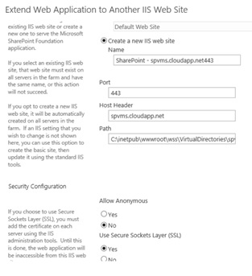
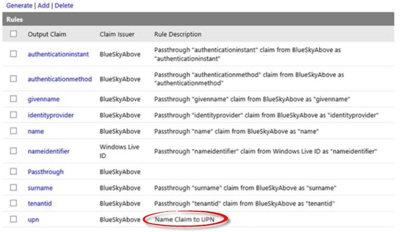
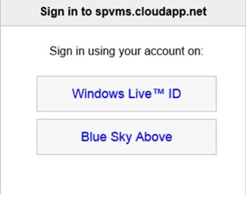

# Usar Active Directory de Microsoft Azure para autenticación de SharePoint 2013

 **Resumen:** aprenda a usar el Servicio de control de acceso de Azure para autenticar a los usuarios de SharePoint Server 2013 con Azure Active Directory.
  
Puede resultarle más sencillo administrar los usuarios si los autentica con distintos proveedores de identidades. Tenga en cuenta lo conveniente que puede resultar usar un proveedor de identidad en el que confía, pero que lo administre otra persona. Por ejemplo, podría tener un tipo de autenticación para los usuarios que tienen acceso a SharePoint Server 2013 en la nube y otro para los usuarios de SharePoint 2013 en su entorno local. El Servicio de control de acceso de Azure permite usar estas opciones.
  
En este artículo se explica cómo puede usar el Servicio de control de acceso de Azure para autenticar los usuarios de SharePoint 2013 con Azure AD, en lugar de usar la instalación local de Active Directory. En esta configuración, Azure AD se convierte en un proveedor de identidad de confianza para SharePoint 2013. Esta configuración agrega un método de autenticación de usuario que es independiente de la autenticación de Active Directory usada por la propia instalación de SharePoint 2013. Para sacarle el máximo partido a este artículo, recomendamos que esté familiarizado con WS-Federation. Para más información, consulte el tema de [introducción a WS-Federation ](https://go.microsoft.com/fwlink/p/?linkid=188052).
  
En la siguiente ilustración se muestra cómo funciona la autenticación de los usuarios de SharePoint 2013 en esta configuración.
  

  
El ejemplo que se usa en este artículo lo proporciona Kirk Evans, Arquitecto de Microsoft para el Centro de excelencia de Azure.
  
Para obtener información sobre la accesibilidad de SharePoint 2013, consulte [Accesibilidad para SharePoint 2013](https://go.microsoft.com/fwlink/p/?LinkId=393123).
  
## Descripción general de la configuración

Siga estos pasos generales de configuración del entorno para que use Azure AD como un proveedor de identidad de SharePoint 2013.
  
1. Cree un nuevo inquilino y un espacio de nombres de Azure AD.
    
2. Agregue un proveedor de identidad de WS-Federation.
    
3. Agregue SharePoint como una aplicación de usuario de confianza.
    
4. Cree un certificado autofirmado para usarlo con SSL.
    
5. Cree un grupo de reglas para la autenticación basada en notificaciones.
    
6. Configure el certificado X.509.
    
7. Cree una asignación de notificaciones.
    
8. Configure SharePoint para el nuevo proveedor de identidad.
    
9. Establezca los permisos.
    
10. Compruebe el nuevo proveedor.
    
## Crear el inquilino y el espacio de nombres de Azure AD

Siga estos pasos para crear un nuevo inquilino de Azure AD y un espacio de nombres asociado. En este ejemplo, se usa el espacio de nombres "blueskyabove".
  
1. En el Portal de administración de Azure, haga clic en **Active Directory** y, a continuación, cree un nuevo inquilino de Azure AD.
    
2. Haga clic en **Espacios de nombres de Control de acceso** y cree un nuevo espacio de nombres.
    
3. Haga clic en **Administrar** en la barra inferior. Se abrirá esta ubicación: https://blueskyabove.accesscontrol.windows.net/v2/mgmt/web.
    
4. Abra Windows PowerShell. Use el módulo Microsoft Online Services para Windows PowerShell, que es un requisito previo para instalar los cmdlets de Azure para Windows PowerShell.
    
5. En el símbolo del sistema de Windows PowerShell, escriba el comando  `Connect-Msolservice` y, después, escriba sus credenciales.
    
    > [!NOTE]
    > Para obtener más información sobre cómo usar los cmdlets de Azure para Windows PowerShell, consulte [Administrar Azure AD con Windows PowerShell](https://go.microsoft.com/fwlink/p/?LinkId=393124). 
  
6. En el símbolo del sistema de Windows PowerShell, ejecute estos comandos:
    
  ```
  Import-Module MSOnlineExtended -Force
  ```

  ```
  $replyUrl = New-MsolServicePrincipalAddresses -Address "https://blueskyabove.accesscontrol.windows.net/"
  ```

  ```
  New-MsolServicePrincipal -ServicePrincipalNames @("https://blueskyabove.accesscontrol.windows.net/") -DisplayName "BlueSkyAbove ACS Namespace" -Addresses $replyUrl
  ```

    En esta ilustración se muestra el resultado que se obtiene.
    
     
  
## Agregar un proveedor de identidad de WS-Federation al espacio de nombres

Siga estos pasos para agregar un nuevo proveedor de identidad de WS-Federation al espacio de nombres blueskyabove.
  
1. Desde el portal de administración de Azure, vaya a **Active Directory** > **Espacios de nombres de Control de acceso**, haga clic en **Crear una nueva instancia** y, a continuación, haga clic en **Administrar**.
    
2. En el portal de Servicio de control de acceso de Azure, haga clic en **Proveedores de identidades** > **Agregar**, tal y como se muestra en esta ilustración.
    
     
  
3. Haga clic en **Proveedor de identidad de WS-Federation**, como se muestra en la siguiente ilustración y, después, haga clic en **siguiente**.
    
     
  
4. Rellene el nombre para mostrar texto del vínculo de inicio de sesión y, después, haga clic en **Guardar**. Para la dirección URL de metadatos de WS-Federation, escriba https://accounts.accesscontrol.windows.net/blueskyabove.onmicrosoft.com/FederationMetadata/2007-06/FederationMetadata.xml. En esta ilustración se muestra la configuración.
    
     
  
## Agregar SharePoint como una aplicación de usuario de confianza

Siga estos pasos para agregar SharePoint como una aplicación de usuario de confianza.
  
Para obtener más información sobre la configuración de la aplicación de usuario de confianza, consulte [Aplicaciones de usuarios de confianza](https://go.microsoft.com/fwlink/p/?LinkId=393125).
  
1. En el portal de Servicio de control de acceso de Azure, haga clic en **Aplicaciones de usuario de confianza** y, después, haga clic en **Agregar**, tal y como se muestra en esta ilustración.
    
     
  
## Crear un certificado autofirmado para usarlo con SSL

Siga estos pasos para crear un nuevo certificado autofirmado que usará para las comunicaciones seguras mediante SSL.
  
1. Extienda la aplicación web para que use la misma dirección URL que PublishingSite, pero use SSL con el puerto 443, tal y como se muestra en esta ilustración.
    
     
  
2. En Administrador de IIS, haga doble clic en **Certificados de servidor**.
    
3. En el panel **Acciones**, haga clic en **Crear certificado autofirmado**. Escriba un nombre descriptivo para el certificado en el cuadro **Especifique un nombre descriptivo para el certificado** y haga clic en **Aceptar**.
    
4. En el cuadro de diálogo **Modificar enlace de sitio**, compruebe que el nombre de host es el mismo que el nombre descriptivo, como se muestra en esta ilustración.
    
     
  
     
  
5. En el portal de administración de Azure, haga clic en la máquina virtual que quiere configurar y, después, en **Extremos**.
    
6. Haga clic en **Agregar** y luego en **-->** (para Siguiente).
    
7. En **Nombre**, escriba un nombre para el extremo.
    
8. En **Puerto público** y **Puerto privado**, escriba los números de puerto que quiere usar y, después, active la casilla para finalizar. Estos números pueden ser diferentes. En este artículo usaremos 443, como se muestra en esta ilustración.
    
     
  
    > [!NOTE]
    > Para obtener más información sobre cómo agregar un punto de conexión a una máquina virtual en Azure, consulte [Cómo configurar puntos de conexión en una máquina virtual](https://go.microsoft.com/fwlink/p/?LinkId=393126). 
  
9. En el portal de Servicio de control de acceso, agregue un usuario de confianza, como se muestra aquí.
    
     
  
## Crear un grupo de reglas para la autenticación basada en notificaciones

Siga estos pasos para crear un nuevo grupo de reglas que controle la autenticación basada en notificaciones.
  
1. En el panel izquierdo, haga clic en **Grupos de reglas** y, después, elija **Agregar**.
    
2. Escriba un nombre para el grupo de reglas, haga clic en **Guardar** y, después, elija **Generar**. En este artículo usaremos **Default Rule Group for. spvms.cloudapp.net**, tal como se muestra en esta ilustración.
    
     
  
     
  
    > [!NOTE]
    > Para obtener más información sobre cómo crear grupos de reglas, consulte [Grupos de reglas y reglas](https://go.microsoft.com/fwlink/p/?LinkId=393128). 
  
3. Haga clic en el grupo de reglas que quiere cambiar y, después, haga clic en la regla de notificación que desea cambiar. En este artículo agregaremos una regla de notificación al grupo para que pase **name** como **upn**, tal y como se muestra aquí.
    
     
  
4. Elimine la regla de notificación existente denominada **upn** y deje la regla **Name Claim to UPN**, como se muestra en esta ilustración.
    
     
  
## Configurar el certificado X.509

Siga estos pasos para configurar el certificado X.509 que va a usar para la firma de tokens.
  
1. En el Servicio de control de acceso, en **Desarrollo**, haga clic en **Integración de aplicaciones**.
    
2. En **Referencia de extremo**, busque el archivo **Federation.xml** que está asociado al inquilino de Azure y, después, copie la ubicación en la barra de direcciones de un explorador.
    
3. En el archivo **Federation.xml**, busque la sección **RoleDescriptor** y copie la información del elemento _<X509Certificate>_, como se muestra aquí.
    
     
  
4. En la raíz de la unidad C:\\, cree una carpeta con el nombre **Certificates**.
    
5. Guarde la información de X509Certificate en la carpeta C:\\Certificates, con el nombre de archivo **AcsTokenSigning.cer**.
    
    > [!NOTE]
    > El nombre de archivo debe guardarse con una extensión .cer. 
  
     
  
## Crear una asignación de notificaciones mediante Windows PowerShell

Siga estos pasos para crear una asignación de notificaciones mediante Windows PowerShell.
  
Compruebe que cumple con las siguientes pertenencias a grupos:
  
1. Rol fijo de servidor **securityadmin** en la instancia de SQL Server.
    
2. Rol fijo de base de datos **db_owner** en todas las bases de datos que se van a actualizar.
    
3. Grupo de administradores en el servidor en el que se van a ejecutar los cmdlets de Windows PowerShell.
    
Un administrador puede usar el cmdlet **Add-SPShellAdmin** para conceder permisos para usar cmdlets de SharePoint 2013.
  
> [!NOTE]
> Si no tiene permisos, póngase en contacto con el administrador para la instalación o con el administrador de SQL Server para pedir los permisos. Para más información sobre los permisos de Windows PowerShell, vea [Add-SPShellAdmin](http://technet.microsoft.com/library/2ddfad84-7ca8-409e-878b-d09cb35ed4aa.aspx). 
  
1. En el menú **Inicio**, haga clic en **Todos los programas**.
    
2. Haga clic en **Productos de Microsoft SharePoint 2013**.
    
3. Elija **Shell de administración de SharePoint 2013**.
    
4. En el símbolo del sistema de Windows PowerShell, escriba este comando para crear una asignación de notificaciones:
    
  ```
  $cert = New-Object System.Security.Cryptography.X509Certificates.X509Certificate2("c:\\certificates\\AcsTokenSigning.cer")
  ```

  ```
  New-SPTrustedRootAuthority -Name "ACS BlueSkyAbove Token Signing" -Certificate $cert
  ```

  ```
  $map = New-SPClaimTypeMapping -IncomingClaimType "http://schemas.xmlsoap.org/ws/2005/05/identity/claims/upn" -IncomingClaimTypeDisplayName "UPN" -SameAsIncoming
  ```

  ```
  $map2 = New-SPClaimTypeMapping -IncomingClaimType "http://schemas.xmlsoap.org/ws/2005/05/identity/claims/givenname" -IncomingClaimTypeDisplayName "GivenName" -SameAsIncoming
  ```

  ```
  $map3 = New-SPClaimTypeMapping -IncomingClaimType "http://schemas.xmlsoap.org/ws/2005/05/identity/claims/surname" -IncomingClaimTypeDisplayName "SurName" -SameAsIncoming
  ```

  ```
  $realm = "urn:sharepoint:spvms"
  ```

  ```
  $ap = New-SPTrustedIdentityTokenIssuer -Name "ACS Provider" -Description "SharePoint secured by SAML in ACS" -realm $realm -ImportTrustCertificate $cert -ClaimsMappings $map,$map2,$map3 -SignInUrl "https://blueskyabove.accesscontrol.windows.net/v2/wsfederation" -IdentifierClaim "http://schemas.xmlsoap.org/ws/2005/05/identity/claims/upn"
  ```

## Configurar SharePoint para el nuevo proveedor de identidad

Siga estos pasos para configurar la instalación de SharePoint para el nuevo proveedor de identidad de Azure AD.
  
1. Asegúrese de que la cuenta de usuario con la que va a realizar este procedimiento pertenezca al grupo de administradores de la granja de servidores de SharePoint.
    
2. En Administración central, en la página de inicio, haga clic en **Administración de aplicaciones**.
    
3. En la página **Administración de aplicaciones**, en la sección **Aplicaciones web**, haga clic en **Administrar aplicaciones web**.
    
4. Haga clic en la aplicación web correspondiente.
    
5. En la cinta de opciones, haga clic en **Proveedores de autenticación**.
    
6. En **Zona**, haga clic en el nombre de la zona, como por ejemplo, **Predeterminada**.
    
7. En la página **Editar autenticación** de la sección **Tipos de autenticación de notificaciones**, seleccione **Proveedor de identidad de confianza** y haga clic en el nombre del proveedor, que en este artículo será **ACS Provider**. Haga clic en **Aceptar**.
    
8. En esta imagen se muestra el valor **Trusted Provider**.
    

  
## Establecer los permisos

Siga estos pasos para establecer los permisos para obtener acceso a la aplicación web.
  
1. En la página de inicio de Administración central, haga clic en **Administración de aplicaciones**.
    
2. En la sección **Aplicaciones web** de la página **Administración de aplicaciones**, haga clic en **Administrar aplicaciones web**.
    
3. Haga clic en la aplicación web adecuada y, a continuación, haga clic en **Directiva de usuario**.
    
4. En **Directiva de aplicación web**, haga clic en **Agregar usuarios**.
    
5. En el cuadro de diálogo **Agregar usuarios**, haga clic en la zona apropiada en la sección **Zonas** y, después, haga clic en **Siguiente**.
    
6. En el cuadro de diálogo **Agregar usuarios**, escriba user2@blueskyabove.onmicrosoft.com (ACS Provider).
    
7. En **Permisos**, haga clic en **Control total**.
    
8. Haga clic en **Finalizar** y, después, en **Aceptar**.
    
En esta imagen se muestra la sección **Agregar usuarios** de una aplicación web existente.
  

  
## Comprobar el nuevo proveedor

Siga estos pasos para comprobar que el nuevo proveedor de identidad funciona. Para ello, asegúrese de que el nuevo proveedor de autenticación aparece en la solicitud de inicio de sesión.
  
1. Inicie sesión con el nuevo proveedor denominado **Blue Sky Above**, tal y como se muestra en esta imagen.
    
     
  
## Recursos adicionales

[Introducción a WS-Federation](https://go.microsoft.com/fwlink/p/?linkid=188052)
  
[Adopción de la nube y soluciones híbridas](cloud-adoption-and-hybrid-solutions.md)
  
**Participar en la discusión**

|**Póngase en contacto con nosotros**|**Descripción**|
|:-----|:-----|
|**¿Qué soluciones necesita?** <br/> |Estamos creando contenido para soluciones que abarcan varios productos y servicios de Microsoft. Díganos qué piensa sobre nuestras soluciones entre servidores o solicite soluciones específicas por correo electrónico a [MODAcontent@microsoft.com](mailto:modacontent@microsoft.com?Subject=[Solution%20Feedback]:%20).  <br/> |
|**Participe en la discusión sobre soluciones** <br/> |Si le apasionan las soluciones, considere la posibilidad de participar en el Comité asesor de soluciones (SAB) para conectarse con una comunidad más grande y animada de desarrolladores de contenido para soluciones de Microsoft, profesionales del sector y clientes de todo el mundo. Envíe un correo electrónico a [SAB@microsoft.com](mailto:sab@microsoft.com?Subject=Request%20to%20join%20the%20Solutions%20Advisory%20Board) para participar. Cualquiera puede leer contenido relacionado con la comunidad en el[blog de SAB](http://blogs.technet.com/b/solutions_advisory_board/). Sin embargo, los miembros de SAB pueden tener acceso a seminarios web privados sobre soluciones y pueden participar en la red de Yammer para SAB.  <br/> |
|**Obtenga los archivos de arte que ve aquí** <br/> |Si desea una copia editable de los archivos de arte que ve en el contenido de [Adopción de la nube y soluciones híbridas](cloud-adoption-and-hybrid-solutions.md), estaremos encantados de enviársela. Envíenos un correo electrónico con su solicitud, con la dirección URL y el título del archivo de arte, a [MODAcontent@microsoft.com](mailto:modacontent@microsoft.com?subject=[Art%20Request]:%20).  <br/> |
   

